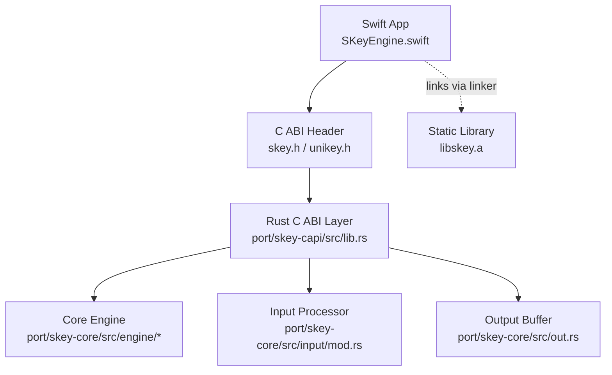
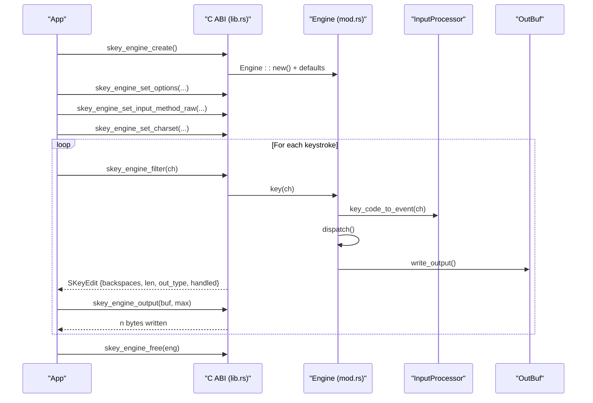
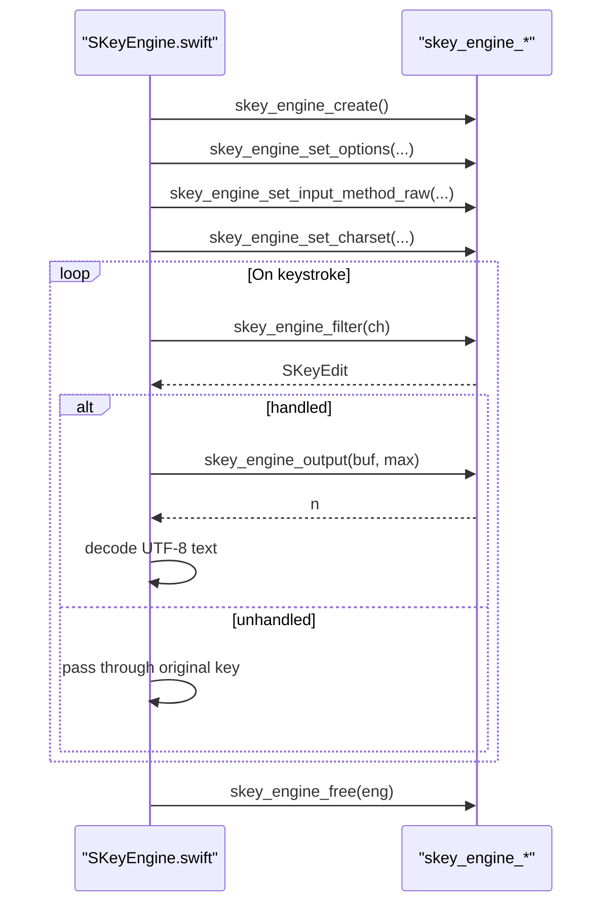
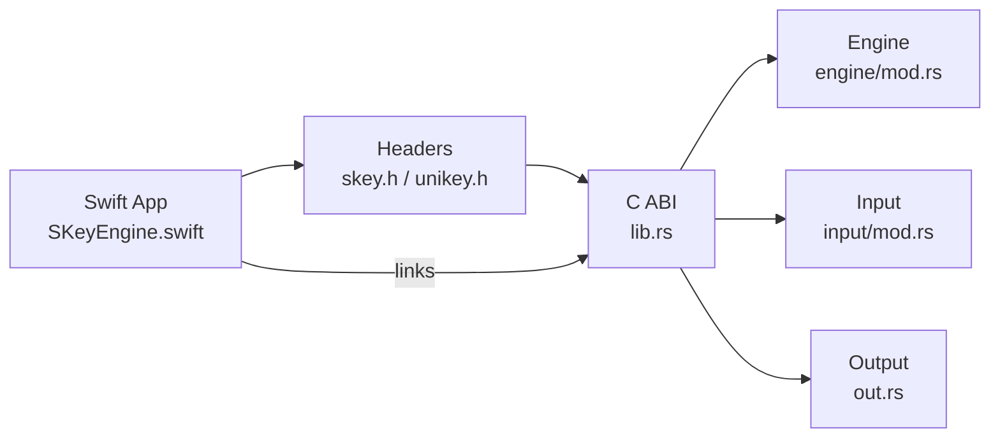

# API Reference

<cite>
**Referenced Files in This Document**
- [skey.h](file://port/skey-capi/include/skey.h)
- [unikey.h](file://port/skey-capi/include/unikey.h)
- [lib.rs (C ABI)](file://port/skey-capi/src/lib.rs)
- [mod.rs (Engine)](file://port/skey-core/src/engine/mod.rs)
- [types.rs (Engine Types)](file://port/skey-core/src/engine/types.rs)
- [input/mod.rs (Input Processor)](file://port/skey-core/src/input/mod.rs)
- [out.rs (Output Buffer)](file://port/skey-core/src/out.rs)
- [SKeyEngine.swift](file://macos/skey-app/Sources/Features/Keyboard/Engine/SKeyEngine.swift)
- [Package.swift](file://macos/skey-app/Package.swift)
</cite>

## Table of Contents
1. Introduction
2. Project Structure
3. Core Components
4. Architecture Overview
5. Detailed Component Analysis
6. Dependency Analysis
7. Performance Considerations
8. Troubleshooting Guide
9. Conclusion
10. Appendices

## Introduction
This document describes the public C ABI exposed by SKey for integrating external applications with the Vietnamese typing engine. It covers both the legacy UniKey-compatible global interface and the modern context-based multi-instance API. You will find function signatures, parameter types, return values, error behavior, data structures, threading considerations, memory management, lifecycle guidance, and protocol-specific examples for initializing the engine, processing keystrokes, and handling composition results. Integration notes include Swift FFI usage on macOS and guidance for third-party integrations.

## Project Structure
The C ABI is implemented in Rust and exposed as a static library. The headers define the stable C interface consumed by front ends. A Swift wrapper demonstrates safe integration on macOS.

**Diagram sources**
- [skey.h:1-106](file://port/skey-capi/include/skey.h#L1-L106)
- [unikey.h:1-177](file://port/skey-capi/include/unikey.h#L1-L177)
- [lib.rs (C ABI):1-800](file://port/skey-capi/src/lib.rs#L1-L800)
- [mod.rs (Engine):1-426](file://port/skey-core/src/engine/mod.rs#L1-L426)
- [input/mod.rs:1-215](file://port/skey-core/src/input/mod.rs#L1-L215)
- [out.rs:1-231](file://port/skey-core/src/out.rs#L1-L231)
- [SKeyEngine.swift:1-189](file://macos/skey-app/Sources/Features/Keyboard/Engine/SKeyEngine.swift#L1-L189)
- [Package.swift:1-52](file://macos/skey-app/Package.swift#L1-L52)

**Section sources**
- [skey.h:1-106](file://port/skey-capi/include/skey.h#L1-L106)
- [unikey.h:1-177](file://port/skey-capi/include/unikey.h#L1-L177)
- [Package.swift:1-52](file://macos/skey-app/Package.swift#L1-L52)

## Core Components
- Legacy global interface (UniKey-compatible): process-wide state, single-threaded usage model.
- Context-based API (SKeyEngine/UnikeyEngine): per-engine handles, thread-safe when used from separate threads, no shared state.
- Options and edit result structures define configuration and output semantics.
- Input method selection and charset configuration control conversion behavior.
- Macro table and user key map loading are supported.

Key responsibilities:
- Initialize and configure an engine instance or the global engine.
- Feed keystrokes and receive edits indicating backspaces and output bytes.
- Retrieve composed text safely using the provided output functions.
- Manage lifecycle (create/reset/free) and options at runtime.

**Section sources**
- [unikey.h:1-177](file://port/skey-capi/include/unikey.h#L1-L177)
- [skey.h:1-106](file://port/skey-capi/include/skey.h#L1-L106)
- [lib.rs (C ABI):1-800](file://port/skey-capi/src/lib.rs#L1-L800)

## Architecture Overview
The C ABI layer bridges Swift/C++ front ends to the Rust core. The legacy interface uses process-wide globals; the context API uses opaque engine handles. Both share the same underlying engine implementation and options.

**Diagram sources**
- [lib.rs (C ABI):349-800](file://port/skey-capi/src/lib.rs#L349-L800)
- [mod.rs (Engine):180-320](file://port/skey-core/src/engine/mod.rs#L180-L320)
- [input/mod.rs:150-192](file://port/skey-core/src/input/mod.rs#L150-L192)
- [out.rs:128-187](file://port/skey-core/src/out.rs#L128-L187)

## Detailed Component Analysis

### Data Structures
- Options:
  - SKeyOptions/UnikeyOptions: fields mirror the original ABI; include free marking, modern style, macro enablement, clipboard mode, spell check toggles, auto restore, and additional quick features.
- Edit result:
  - SKeyEdit/UnikeyEdit: backspaces to send before new bytes, length of available output, output type (character vs key), and whether the key was handled.
- Enums:
  - UkInputMethod: Telex, VNI, VIQR, MsVi, User IM, Simple Telex.
  - UkOutputType: character output vs key output.

Notes:
- The context API returns a value-type edit; the legacy global API updates global buffers and counters instead.
- Output length may exceed stored bytes due to stream counter semantics; always clamp to buffer capacity.

**Section sources**
- [skey.h:13-42](file://port/skey-capi/include/skey.h#L13-L42)
- [unikey.h:26-44](file://port/skey-capi/include/unikey.h#L26-L44)
- [lib.rs (C ABI):60-73](file://port/skey-capi/src/lib.rs#L60-L73)
- [lib.rs (C ABI):366-402](file://port/skey-capi/src/lib.rs#L366-L402)
- [types.rs:24-83](file://port/skey-core/src/engine/types.rs#L24-L83)

### Legacy Global Interface (UniKey-compatible)
Initialization and lifecycle:
- UnikeySetup: initialize default options, input method, UTF-8 output.
- UnikeyCleanup: release the global engine.
- UnikeyResetBuf: reset buffer state.

Keystroke handling:
- UnikeySetCapsState: update shift/caps lock state before filtering.
- UnikeyFilter: main handler for character input.
- UnikeyPutChar: pass-through character without filtering.
- UnikeyBackspacePress: handle backspace.
- UnikeyRestoreKeyStrokes: restore raw key strokes for the last word.

Configuration:
- UnikeySetOptions/UnikeyGetOptions: read/write options.
- UnikeySetInputMethod/UnikeySetInputMethodRaw: select input method.
- UnikeySetOutputCharset: set output encoding.
- UnikeyLoadMacroTable/UnikeyLoadUserKeyMap: load macros and user key maps.
- UnikeySetSingleMode: restrict to single-word mode.

Globals after filter/backspace/restore:
- UnikeyBuf: output bytes.
- UnikeyBackspaces: number of backspaces to send.
- UnikeyBufChars: stream counter (may exceed buffer size).
- UnikeyOutput: output type indicator.

Error behavior:
- File loading functions return success/failure indicators; invalid paths yield failure.

Threading:
- Process-wide globals; intended for single-threaded use.

**Section sources**
- [unikey.h:41-77](file://port/skey-capi/include/unikey.h#L41-L77)
- [lib.rs (C ABI):103-166](file://port/skey-capi/src/lib.rs#L103-L166)
- [lib.rs (C ABI):168-276](file://port/skey-capi/src/lib.rs#L168-L276)
- [lib.rs (C ABI):278-347](file://port/skey-capi/src/lib.rs#L278-L347)

### Context-Based API (SKeyEngine/UnikeyEngine)
Lifecycle:
- skey_engine_create/unikey_engine_create: create an engine instance with defaults.
- skey_engine_free/unikey_engine_free: release resources.
- skey_engine_reset/unikey_engine_reset: reset session state.

Configuration:
- skey_engine_set_single_mode: single-word mode.
- skey_engine_set_caps_state: update modifier state.
- skey_engine_set_input_method/set_input_method_raw: select input method.
- skey_engine_set_charset: set output encoding.
- skey_engine_set_options/get_options: manage options.

Processing:
- skey_engine_filter/unikey_engine_filter: process a character; returns edit.
- skey_engine_put_char/unikey_engine_put_char: pass-through character.
- skey_engine_backspace/unikey_engine_backspace: handle backspace; returns edit.
- skey_engine_restore/unikey_engine_restore: restore raw key strokes; returns edit.
- skey_engine_output/unikey_engine_output: copy up to max bytes into buffer; returns count.

Extensions:
- Swallowed key restore: skey_engine_set_swallowed_key_restore and related helpers.
- Quick features: quick telex, quick start/end consonant, upper case first char, allow consonant zfwj.

Memory and safety:
- All functions operate on the provided engine pointer; invalid pointers are ignored or return safe defaults.
- No heap allocation on the hot path; output buffer is bounded.

**Section sources**
- [skey.h:30-75](file://port/skey-capi/include/skey.h#L30-L75)
- [unikey.h:79-177](file://port/skey-capi/include/unikey.h#L79-L177)
- [lib.rs (C ABI):349-800](file://port/skey-capi/src/lib.rs#L349-L800)

### Engine Internals (Core)
- Engine struct holds persistent state (buffer, keys, flags, options, charset, input processor, caps state) and per-keystroke state (output buffer, backspaces, change position).
- Key processing pipeline:
  - Prepare buffer and reset per-keystroke state.
  - Convert key code to event via InputProcessor.
  - Dispatch to specialized handlers (roof, hook, tone, telex, mapping, escape, append).
  - Apply quick features and capitalization rules.
  - Write output and compute backspaces.
- Output buffer:
  - Fixed capacity matching legacy buffer size; supports streaming semantics where reported length can exceed stored bytes.

Complexity:
- Keystroke path is constant-time over small fixed-size buffers; no allocations on hot path.

**Section sources**
- [mod.rs (Engine):18-70](file://port/skey-core/src/engine/mod.rs#L18-L70)
- [mod.rs (Engine):248-319](file://port/skey-core/src/engine/mod.rs#L248-L319)
- [out.rs:1-231](file://port/skey-core/src/out.rs#L1-L231)

### Swift Integration Example (macOS)
The Swift wrapper demonstrates:
- Creating and freeing the engine.
- Setting default options, charset, input method, and feature toggles.
- Processing characters and backspace, extracting UTF-8 text using a stack-allocated buffer to avoid heap allocations.
- Thread-safety via an unfair lock around engine calls.

**Diagram sources**
- [SKeyEngine.swift:27-189](file://macos/skey-app/Sources/Features/Keyboard/Engine/SKeyEngine.swift#L27-L189)
- [skey.h:44-75](file://port/skey-capi/include/skey.h#L44-L75)

**Section sources**
- [SKeyEngine.swift:1-189](file://macos/skey-app/Sources/Features/Keyboard/Engine/SKeyEngine.swift#L1-L189)
- [Package.swift:14-49](file://macos/skey-app/Package.swift#L14-L49)

## Dependency Analysis
- Headers expose stable C symbols consumed by Swift and other front ends.
- The C ABI layer depends on the core engine modules:
  - Engine orchestration and state machine.
  - Input processor for key classification and method mappings.
  - Output buffer for bounded byte streams.
- Build configuration links the Swift app against the built static library.

**Diagram sources**
- [skey.h:1-106](file://port/skey-capi/include/skey.h#L1-L106)
- [unikey.h:1-177](file://port/skey-capi/include/unikey.h#L1-L177)
- [lib.rs (C ABI):1-800](file://port/skey-capi/src/lib.rs#L1-L800)
- [mod.rs (Engine):1-426](file://port/skey-core/src/engine/mod.rs#L1-L426)
- [input/mod.rs:1-215](file://port/skey-core/src/input/mod.rs#L1-L215)
- [out.rs:1-231](file://port/skey-core/src/out.rs#L1-L231)
- [SKeyEngine.swift:1-189](file://macos/skey-app/Sources/Features/Keyboard/Engine/SKeyEngine.swift#L1-L189)
- [Package.swift:14-49](file://macos/skey-app/Package.swift#L14-L49)

**Section sources**
- [Package.swift:14-49](file://macos/skey-app/Package.swift#L14-L49)

## Performance Considerations
- Hot path zero-allocation: keystroke processing avoids heap allocations; output is written into a fixed-capacity buffer.
- Stream counter semantics: reported length may exceed stored bytes; callers must clamp to buffer capacity.
- Locking in Swift wrapper: minimal overhead unfair lock protects engine access; consider batching operations if needed.
- Charset choice: UTF-8 simplifies backspace counting and decoding; other charsets require careful handling of byte vs character units.

[No sources needed since this section provides general guidance]

## Troubleshooting Guide
Common issues and resolutions:
- Empty or truncated output:
  - Ensure you call skey_engine_output immediately after filter/backspace/restore and that max is sufficient.
  - Check UnikeyBufChars or edit.len; it may exceed actual bytes stored—clamp accordingly.
- Unexpected key passthrough:
  - If edit.handled is false, pass the original key through unchanged.
- Incorrect input method:
  - Use set_input_method_raw for full range including MsVi and Simple Telex; set_input_method restricts to Telex/VNI/VIQR/User IM.
- Macros not applied:
  - Verify macro table loaded successfully and macro_enabled option is set.
- Threading errors:
  - Legacy globals are single-threaded; use context API for concurrency.
  - Swift wrapper uses a lock; ensure consistent locking policy across your app.

**Section sources**
- [lib.rs (C ABI):86-101](file://port/skey-capi/src/lib.rs#L86-L101)
- [lib.rs (C ABI):530-571](file://port/skey-capi/src/lib.rs#L530-L571)
- [unikey.h:120-141](file://port/skey-capi/include/unikey.h#L120-L141)

## Conclusion
SKey exposes a robust, backward-compatible C ABI with two usage models: a legacy global interface for existing front ends and a modern context-based API for concurrent, multi-session applications. The API provides clear lifecycle management, comprehensive configuration, and efficient keystroke processing with predictable output semantics. Swift integration demonstrates safe, high-performance usage suitable for macOS applications.

[No sources needed since this section summarizes without analyzing specific files]

## Appendices

### Protocol-Specific Examples

#### Initialize the Engine (Context API)
- Create engine: skey_engine_create
- Set options: skey_engine_set_options
- Set charset: skey_engine_set_charset (e.g., UTF-8)
- Select input method: skey_engine_set_input_method_raw (Telex/VNI/VIQR/MsVi/User/Simple Telex)
- Optional: enable swallowed key restore and quick features

**Section sources**
- [skey.h:44-75](file://port/skey-capi/include/skey.h#L44-L75)
- [lib.rs (C ABI):404-415](file://port/skey-capi/src/lib.rs#L404-L415)

#### Process Keystrokes (Context API)
- Update caps state: skey_engine_set_caps_state(shiftPressed, capsLockOn)
- Filter character: skey_engine_filter(ch) -> SKeyEdit
- If handled:
  - Read output: skey_engine_output(buf, max) -> n
  - Send backspaces: backspaces from edit
  - Compose text: decode UTF-8 from buf[0..n]
- If not handled: pass original key through

**Section sources**
- [skey.h:49-61](file://port/skey-capi/include/skey.h#L49-L61)
- [lib.rs (C ABI):530-571](file://port/skey-capi/src/lib.rs#L530-L571)

#### Handle Backspace and Restore (Context API)
- Backspace: skey_engine_backspace(eng) -> SKeyEdit
- Restore: skey_engine_restore(eng) -> SKeyEdit
- After either, retrieve output via skey_engine_output

**Section sources**
- [skey.h:58-61](file://port/skey-capi/include/skey.h#L58-L61)
- [lib.rs (C ABI):541-571](file://port/skey-capi/src/lib.rs#L541-L571)

#### Legacy Global Flow
- Setup: UnikeySetup
- Configure: UnikeySetOptions, UnikeySetInputMethod, UnikeySetOutputCharset
- Caps state: UnikeySetCapsState
- Filter: UnikeyFilter
- Read globals: UnikeyBackspaces, UnikeyBufChars, UnikeyBuf, UnikeyOutput
- Cleanup: UnikeyCleanup

**Section sources**
- [unikey.h:41-77](file://port/skey-capi/include/unikey.h#L41-L77)
- [lib.rs (C ABI):103-166](file://port/skey-capi/src/lib.rs#L103-L166)

### Threading and Memory Management
- Legacy globals: single-threaded; do not share across threads.
- Context API: thread-safe when each thread owns its engine handle; no shared state.
- Memory:
  - Engine creation allocates internal structures; free with skey_engine_free.
  - Output buffers are bounded; never assume edit.len equals stored bytes.
  - Swift wrapper uses stack allocation for temporary buffers to avoid heap churn.

**Section sources**
- [lib.rs (C ABI):32-37](file://port/skey-capi/src/lib.rs#L32-L37)
- [lib.rs (C ABI):404-424](file://port/skey-capi/src/lib.rs#L404-L424)
- [SKeyEngine.swift:166-187](file://macos/skey-app/Sources/Features/Keyboard/Engine/SKeyEngine.swift#L166-L187)

### Integration Guidelines
- Swift (macOS):
  - Link against libskey.a and include headers via Package.swift settings.
  - Use SKeyEngine.swift as a reference for safe FFI usage and locking.
- Other languages:
  - Bind to skey.h or unikey.h depending on desired interface.
  - Prefer context API for multi-session or threaded apps.
  - Respect output buffer sizing and stream counter semantics.
- Third-party integrations:
  - Load macro tables and user key maps early in initialization.
  - Choose appropriate input method and charset for target locale.
  - Implement proper error handling for file loads and invalid parameters.

**Section sources**
- [Package.swift:14-49](file://macos/skey-app/Package.swift#L14-L49)
- [skey.h:63-75](file://port/skey-capi/include/skey.h#L63-L75)
- [unikey.h:59-77](file://port/skey-capi/include/unikey.h#L59-L77)