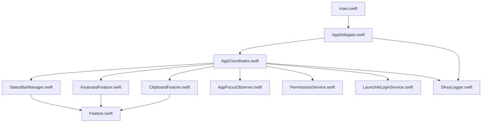
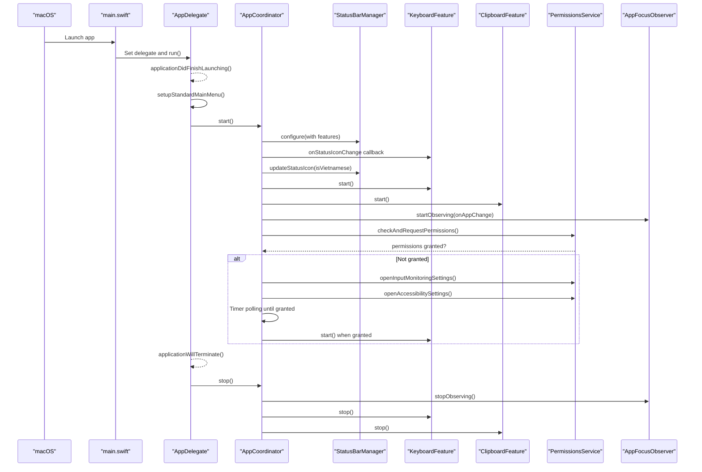
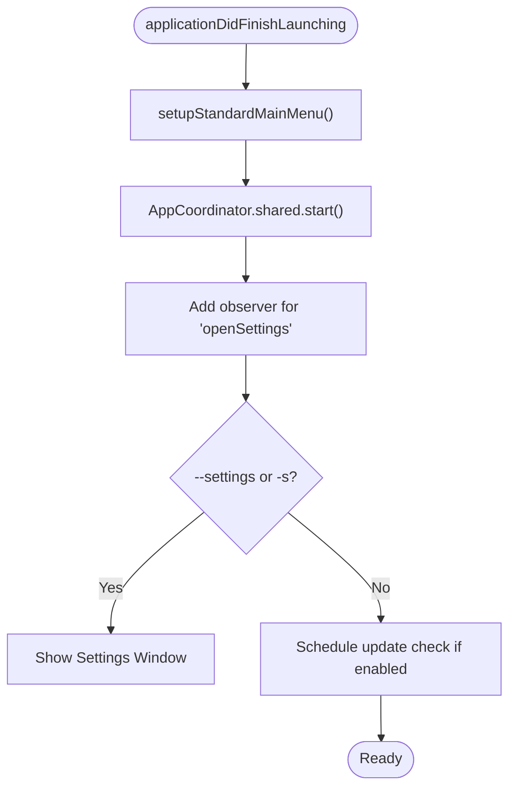
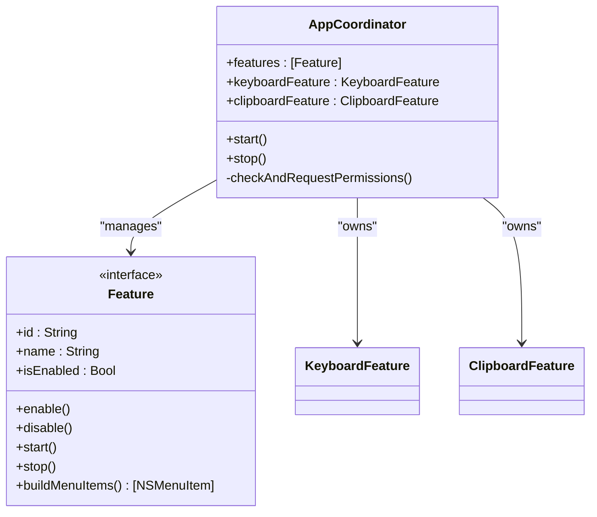
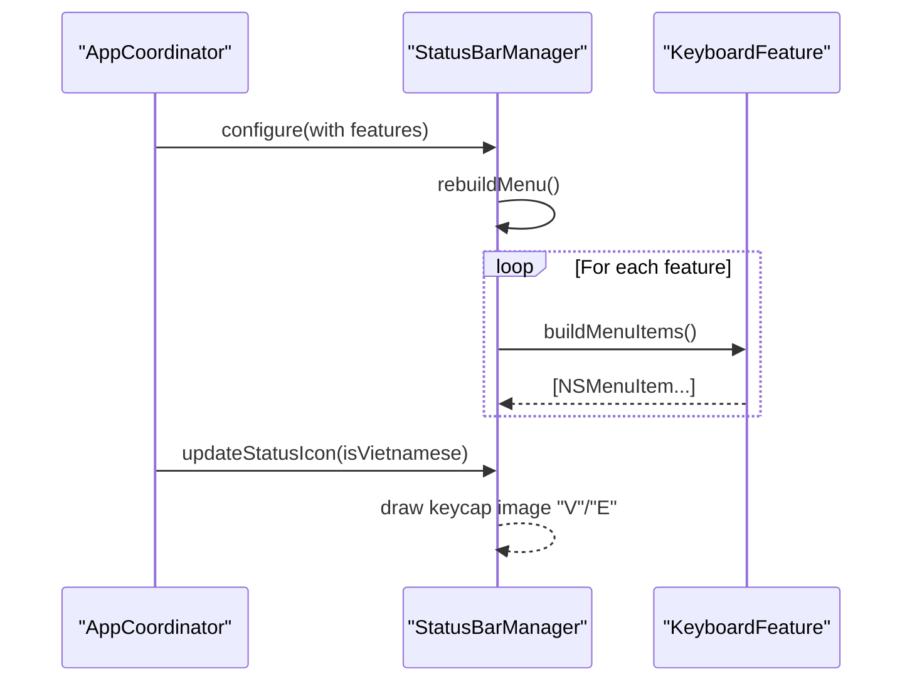
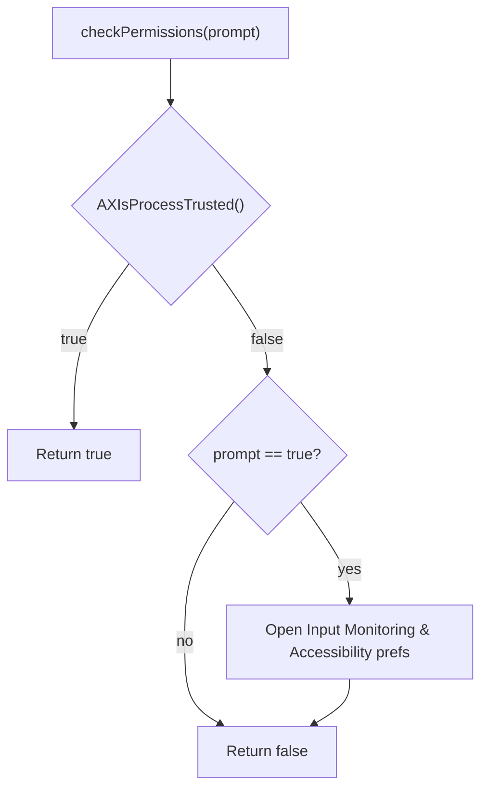
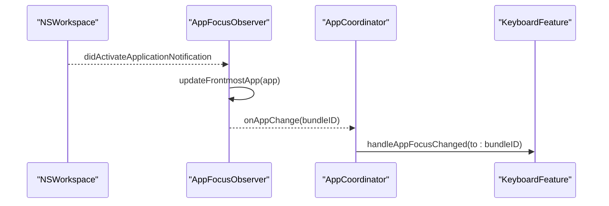
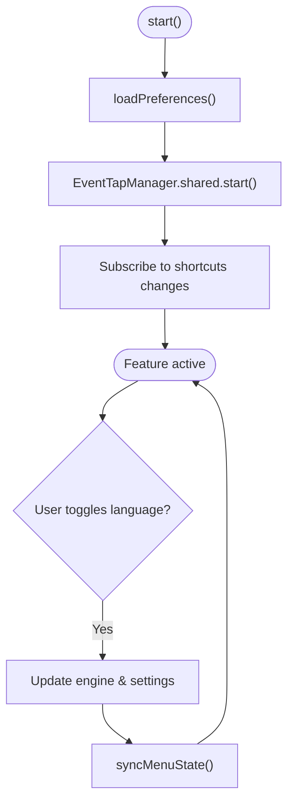
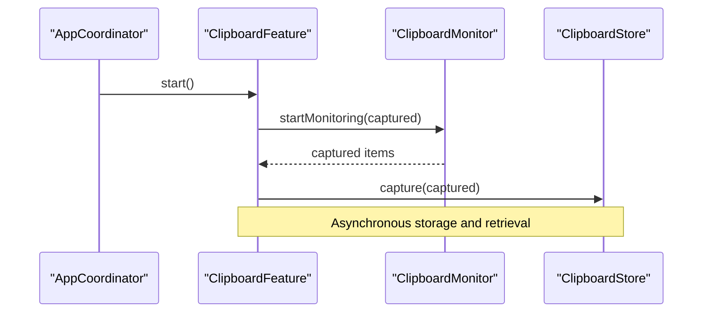
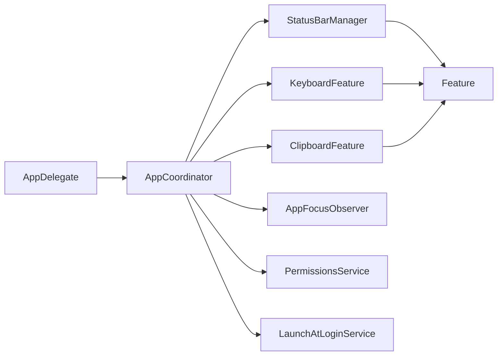

# App Lifecycle Management

<cite>
**Referenced Files in This Document**
- [main.swift](file://macos/skey-app/Sources/App/main.swift)
- [AppDelegate.swift](file://macos/skey-app/Sources/App/AppDelegate.swift)
- [AppCoordinator.swift](file://macos/skey-app/Sources/App/AppCoordinator.swift)
- [Feature.swift](file://macos/skey-app/Sources/Shared/Core/Feature.swift)
- [StatusBarManager.swift](file://macos/skey-app/Sources/Shared/UI/StatusBarManager.swift)
- [PermissionsService.swift](file://macos/skey-app/Sources/Shared/Services/PermissionsService.swift)
- [AppFocusObserver.swift](file://macos/skey-app/Sources/Shared/Services/AppFocusObserver.swift)
- [KeyboardFeature.swift](file://macos/skey-app/Sources/Features/Keyboard/KeyboardFeature.swift)
- [ClipboardFeature.swift](file://macos/skey-app/Sources/Features/Clipboard/ClipboardFeature.swift)
- [LaunchAtLoginService.swift](file://macos/skey-app/Sources/Shared/Services/LaunchAtLoginService.swift)
- [SKeyLogger.swift](file://macos/skey-app/Sources/Shared/Logging/SKeyLogger.swift)
</cite>

## Table of Contents
1. [Introduction](#introduction)
2. [Project Structure](#project-structure)
3. [Core Components](#core-components)
4. [Architecture Overview](#architecture-overview)
5. [Detailed Component Analysis](#detailed-component-analysis)
6. [Dependency Analysis](#dependency-analysis)
7. [Performance Considerations](#performance-considerations)
8. [Troubleshooting Guide](#troubleshooting-guide)
9. [Conclusion](#conclusion)
10. [Appendices](#appendices)

## Introduction
This document explains the application lifecycle management system for the macOS app. It covers how the app starts, initializes the menu bar and background services, and orchestrates feature modules through a central coordinator. You will learn the startup sequence (status bar setup, permission checks, feature registration, background service activation), error handling strategies during initialization, graceful shutdown procedures, memory considerations, and how to integrate new features and handle application state transitions.

## Project Structure
The lifecycle is implemented across a small set of focused components:
- Entry point and delegate orchestration
- A singleton coordinator that manages features and global services
- Feature protocol and concrete features (keyboard, clipboard)
- Status bar manager for UI integration
- Services for permissions, focus observation, and launch-at-login synchronization
- Logging infrastructure used throughout initialization

**Diagram sources**
- [main.swift:3-6](file://macos/skey-app/Sources/App/main.swift#L3-L6)
- [AppDelegate.swift:6-30](file://macos/skey-app/Sources/App/AppDelegate.swift#L6-L30)
- [AppCoordinator.swift:6-56](file://macos/skey-app/Sources/App/AppCoordinator.swift#L6-L56)
- [StatusBarManager.swift:6-29](file://macos/skey-app/Sources/Shared/UI/StatusBarManager.swift#L6-L29)
- [KeyboardFeature.swift:7-46](file://macos/skey-app/Sources/Features/Keyboard/KeyboardFeature.swift#L7-L46)
- [ClipboardFeature.swift:7-48](file://macos/skey-app/Sources/Features/Clipboard/ClipboardFeature.swift#L7-L48)
- [AppFocusObserver.swift:15-124](file://macos/skey-app/Sources/Shared/Services/AppFocusObserver.swift#L15-L124)
- [PermissionsService.swift:7-41](file://macos/skey-app/Sources/Shared/Services/PermissionsService.swift#L7-L41)
- [LaunchAtLoginService.swift:7-50](file://macos/skey-app/Sources/Shared/Services/LaunchAtLoginService.swift#L7-L50)
- [Feature.swift:8-32](file://macos/skey-app/Sources/Shared/Core/Feature.swift#L8-L32)
- [SKeyLogger.swift:10-77](file://macos/skey-app/Sources/Shared/Logging/SKeyLogger.swift#L10-L77)

**Section sources**
- [main.swift:3-6](file://macos/skey-app/Sources/App/main.swift#L3-L6)
- [AppDelegate.swift:6-30](file://macos/skey-app/Sources/App/AppDelegate.swift#L6-L30)
- [AppCoordinator.swift:6-56](file://macos/skey-app/Sources/App/AppCoordinator.swift#L6-L56)

## Core Components
- AppDelegate: Sets up the standard main menu, registers settings open via notifications and command-line flags, triggers update checks, and coordinates graceful shutdown by stopping the coordinator.
- AppCoordinator: Singleton that configures the status bar, wires keyboard status icon updates, starts all registered features, begins app focus observation, syncs launch-at-login state, and performs permission checks with dynamic reactivation.
- Feature protocol: Defines a pluggable capability interface with start/stop, enable/disable, and menu item generation.
- StatusBarManager: Manages the NSStatusItem, builds grouped menus from features, handles left/right click behavior, and updates the status icon based on current language state.
- PermissionsService: Checks and requests accessibility/event tap permissions and opens relevant system preference panes.
- AppFocusObserver: Observes frontmost app changes, classifies apps into categories, and notifies subscribers to adjust behavior (e.g., smart app switch).
- KeyboardFeature: Implements keyboard input interception, language toggling, input method selection, and menu state synchronization; integrates with status bar icon updates.
- ClipboardFeature: Starts clipboard monitoring, manages popup UI, and handles paste actions.
- LaunchAtLoginService: Syncs login item registration with user preferences using ServiceManagement.
- SKeyLogger: Centralized logging used throughout initialization and runtime.

**Section sources**
- [AppDelegate.swift:6-73](file://macos/skey-app/Sources/App/AppDelegate.swift#L6-L73)
- [AppCoordinator.swift:6-76](file://macos/skey-app/Sources/App/AppCoordinator.swift#L6-L76)
- [Feature.swift:8-42](file://macos/skey-app/Sources/Shared/Core/Feature.swift#L8-L42)
- [StatusBarManager.swift:6-271](file://macos/skey-app/Sources/Shared/UI/StatusBarManager.swift#L6-L271)
- [PermissionsService.swift:7-41](file://macos/skey-app/Sources/Shared/Services/PermissionsService.swift#L7-L41)
- [AppFocusObserver.swift:15-153](file://macos/skey-app/Sources/Shared/Services/AppFocusObserver.swift#L15-L153)
- [KeyboardFeature.swift:7-328](file://macos/skey-app/Sources/Features/Keyboard/KeyboardFeature.swift#L7-L328)
- [ClipboardFeature.swift:7-146](file://macos/skey-app/Sources/Features/Clipboard/ClipboardFeature.swift#L7-L146)
- [LaunchAtLoginService.swift:7-50](file://macos/skey-app/Sources/Shared/Services/LaunchAtLoginService.swift#L7-L50)
- [SKeyLogger.swift:10-139](file://macos/skey-app/Sources/Shared/Logging/SKeyLogger.swift#L10-L139)

## Architecture Overview
The lifecycle follows a clear flow:
- Application entry creates NSApplication and assigns AppDelegate as the delegate.
- On launch completion, AppDelegate sets up the main menu and invokes AppCoordinator.start().
- AppCoordinator configures the status bar, wires callbacks, starts features, observes app focus, syncs launch-at-login, and ensures required permissions are granted before enabling sensitive subsystems.
- Features implement start/stop and contribute menu items to the status bar.
- On termination, AppDelegate stops the coordinator to release resources.

**Diagram sources**
- [main.swift:3-6](file://macos/skey-app/Sources/App/main.swift#L3-L6)
- [AppDelegate.swift:7-30](file://macos/skey-app/Sources/App/AppDelegate.swift#L7-L30)
- [AppDelegate.swift:70-73](file://macos/skey-app/Sources/App/AppDelegate.swift#L70-L73)
- [AppCoordinator.swift:22-75](file://macos/skey-app/Sources/App/AppCoordinator.swift#L22-L75)
- [StatusBarManager.swift:26-43](file://macos/skey-app/Sources/Shared/UI/StatusBarManager.swift#L26-L43)
- [KeyboardFeature.swift:35-50](file://macos/skey-app/Sources/Features/Keyboard/KeyboardFeature.swift#L35-L50)
- [ClipboardFeature.swift:26-56](file://macos/skey-app/Sources/Features/Clipboard/ClipboardFeature.swift#L26-L56)
- [PermissionsService.swift:14-41](file://macos/skey-app/Sources/Shared/Services/PermissionsService.swift#L14-L41)
- [AppFocusObserver.swift:114-131](file://macos/skey-app/Sources/Shared/Services/AppFocusObserver.swift#L114-L131)

## Detailed Component Analysis

### AppDelegate: Startup, Menu Bar Integration, Background Services
- Sets up the standard main menu with localized strings and shortcuts.
- Invokes AppCoordinator.shared.start() to initialize features and services.
- Listens for a distributed notification to open settings and supports launching with --settings or -s flags.
- Schedules a non-intrusive update check after launch if enabled.
- Handles reopen events to show settings and gracefully stops the coordinator on termination.

**Diagram sources**
- [AppDelegate.swift:7-30](file://macos/skey-app/Sources/App/AppDelegate.swift#L7-L30)
- [AppDelegate.swift:32-59](file://macos/skey-app/Sources/App/AppDelegate.swift#L32-L59)
- [AppDelegate.swift:65-73](file://macos/skey-app/Sources/App/AppDelegate.swift#L65-L73)

**Section sources**
- [AppDelegate.swift:7-73](file://macos/skey-app/Sources/App/AppDelegate.swift#L7-L73)

### AppCoordinator: Orchestration and State Transitions
- Registers features and configures the status bar with those features.
- Wires keyboard feature’s status icon change callback to update the status bar icon.
- Starts all features, begins app focus observation, and syncs launch-at-login state.
- Performs permission checks; if missing, prompts user, opens relevant system settings, and polls until granted before starting the keyboard feature.

**Diagram sources**
- [AppCoordinator.swift:6-76](file://macos/skey-app/Sources/App/AppCoordinator.swift#L6-L76)
- [Feature.swift:8-42](file://macos/skey-app/Sources/Shared/Core/Feature.swift#L8-L42)
- [KeyboardFeature.swift:7-46](file://macos/skey-app/Sources/Features/Keyboard/KeyboardFeature.swift#L7-L46)
- [ClipboardFeature.swift:7-48](file://macos/skey-app/Sources/Features/Clipboard/ClipboardFeature.swift#L7-L48)

**Section sources**
- [AppCoordinator.swift:22-75](file://macos/skey-app/Sources/App/AppCoordinator.swift#L22-L75)

### StatusBarManager: Menu Building and Icon Updates
- Creates an NSStatusItem and binds click handlers for left/right clicks.
- Rebuilds the menu by aggregating items from each feature and adding tools/settings sections.
- Updates the status bar icon to reflect current language mode and tool tips.
- Provides actions to open settings, manage logs, and quit the app.

**Diagram sources**
- [AppCoordinator.swift:25-35](file://macos/skey-app/Sources/App/AppCoordinator.swift#L25-L35)
- [StatusBarManager.swift:26-43](file://macos/skey-app/Sources/Shared/UI/StatusBarManager.swift#L26-L43)
- [StatusBarManager.swift:47-160](file://macos/skey-app/Sources/Shared/UI/StatusBarManager.swift#L47-L160)
- [StatusBarManager.swift:214-257](file://macos/skey-app/Sources/Shared/UI/StatusBarManager.swift#L214-L257)
- [KeyboardFeature.swift:79-182](file://macos/skey-app/Sources/Features/Keyboard/KeyboardFeature.swift#L79-L182)

**Section sources**
- [StatusBarManager.swift:6-271](file://macos/skey-app/Sources/Shared/UI/StatusBarManager.swift#L6-L271)

### PermissionsService: Permission Checks and User Guidance
- Uses Accessibility APIs to determine if event taps and accessibility attributes can be accessed.
- Optionally prompts the user and opens system preference panes for Input Monitoring and Accessibility.
- Integrated into AppCoordinator to ensure keyboard functionality only starts when permissions are granted.

**Diagram sources**
- [PermissionsService.swift:14-41](file://macos/skey-app/Sources/Shared/Services/PermissionsService.swift#L14-L41)
- [AppCoordinator.swift:58-75](file://macos/skey-app/Sources/App/AppCoordinator.swift#L58-L75)

**Section sources**
- [PermissionsService.swift:14-41](file://macos/skey-app/Sources/Shared/Services/PermissionsService.swift#L14-L41)
- [AppCoordinator.swift:58-75](file://macos/skey-app/Sources/App/AppCoordinator.swift#L58-L75)

### AppFocusObserver: Frontmost App Tracking and Smart Switch
- Observes NSWorkspace notifications to track the frontmost app and its bundle ID.
- Classifies apps into categories (developer tool, web browser, electron/chat, spotlight, native app) using heuristics and Info.plist inspection.
- Notifies subscribers when focus changes, enabling smart switching behavior in the keyboard feature.

**Diagram sources**
- [AppFocusObserver.swift:114-131](file://macos/skey-app/Sources/Shared/Services/AppFocusObserver.swift#L114-L131)
- [AppFocusObserver.swift:29-91](file://macos/skey-app/Sources/Shared/Services/AppFocusObserver.swift#L29-L91)
- [AppCoordinator.swift:40-43](file://macos/skey-app/Sources/App/AppCoordinator.swift#L40-L43)
- [KeyboardFeature.swift:59-75](file://macos/skey-app/Sources/Features/Keyboard/KeyboardFeature.swift#L59-L75)

**Section sources**
- [AppFocusObserver.swift:15-153](file://macos/skey-app/Sources/Shared/Services/AppFocusObserver.swift#L15-L153)
- [KeyboardFeature.swift:59-75](file://macos/skey-app/Sources/Features/Keyboard/KeyboardFeature.swift#L59-L75)

### KeyboardFeature: Input Interception and Menu State
- Starts EventTapManager, loads preferences, and subscribes to shortcut changes to keep menu state synchronized.
- Exposes toggleLanguage and various options; updates status icon via callback to StatusBarManager.
- Integrates with AppFocusObserver to auto-switch language for developer tools and restore it afterward.

**Diagram sources**
- [KeyboardFeature.swift:35-46](file://macos/skey-app/Sources/Features/Keyboard/KeyboardFeature.swift#L35-L46)
- [KeyboardFeature.swift:186-238](file://macos/skey-app/Sources/Features/Keyboard/KeyboardFeature.swift#L186-L238)
- [KeyboardFeature.swift:242-326](file://macos/skey-app/Sources/Features/Keyboard/KeyboardFeature.swift#L242-L326)

**Section sources**
- [KeyboardFeature.swift:35-326](file://macos/skey-app/Sources/Features/Keyboard/KeyboardFeature.swift#L35-L326)

### ClipboardFeature: Background Monitoring and Popup UI
- Initializes ClipboardStore and ClipboardMonitor, starts monitoring, and asynchronously captures content.
- Manages popup controller lifecycle and triggers system paste actions.
- Contributes a menu item to open the clipboard history popup.

**Diagram sources**
- [ClipboardFeature.swift:26-48](file://macos/skey-app/Sources/Features/Clipboard/ClipboardFeature.swift#L26-L48)
- [ClipboardFeature.swift:82-122](file://macos/skey-app/Sources/Features/Clipboard/ClipboardFeature.swift#L82-L122)

**Section sources**
- [ClipboardFeature.swift:26-146](file://macos/skey-app/Sources/Features/Clipboard/ClipboardFeature.swift#L26-L146)

### LaunchAtLoginService: System Login Item Sync
- Reads desired state from AppSettings and synchronizes with macOS ServiceManagement on launch.
- Logs success/failure and returns status for callers.

**Section sources**
- [LaunchAtLoginService.swift:7-50](file://macos/skey-app/Sources/Shared/Services/LaunchAtLoginService.swift#L7-L50)

### Logging Infrastructure: Unified Logging and File Persistence
- Centralized logger writes to Apple Unified Logging and optionally persists to a file in debug builds.
- Enforces security by restricting debug logs and setting secure file permissions.

**Section sources**
- [SKeyLogger.swift:10-139](file://macos/skey-app/Sources/Shared/Logging/SKeyLogger.swift#L10-L139)

## Dependency Analysis
- AppDelegate depends on AppCoordinator for lifecycle orchestration and uses SKeyLogger for diagnostics.
- AppCoordinator composes StatusBarManager, KeyboardFeature, ClipboardFeature, AppFocusObserver, PermissionsService, and LaunchAtLoginService.
- StatusBarManager aggregates menu items from all features implementing Feature.
- KeyboardFeature depends on EventTapManager (external to this snippet) and AppSettings for configuration.
- ClipboardFeature depends on ClipboardMonitor and ClipboardStore for background operations.
- AppFocusObserver provides focus change events consumed by AppCoordinator and KeyboardFeature.

**Diagram sources**
- [AppDelegate.swift:7-30](file://macos/skey-app/Sources/App/AppDelegate.swift#L7-L30)
- [AppCoordinator.swift:6-56](file://macos/skey-app/Sources/App/AppCoordinator.swift#L6-L56)
- [StatusBarManager.swift:6-29](file://macos/skey-app/Sources/Shared/UI/StatusBarManager.swift#L6-L29)
- [Feature.swift:8-32](file://macos/skey-app/Sources/Shared/Core/Feature.swift#L8-L32)

**Section sources**
- [AppCoordinator.swift:6-56](file://macos/skey-app/Sources/App/AppCoordinator.swift#L6-L56)
- [Feature.swift:8-32](file://macos/skey-app/Sources/Shared/Core/Feature.swift#L8-L32)

## Performance Considerations
- Non-blocking logging: SKeyLogger uses a low-priority queue for file I/O to avoid blocking event taps.
- Efficient permission polling: AppCoordinator uses a short-interval timer to poll permissions without heavy overhead.
- Minimal allocations: AppFocusObserver caches app categories in RAM and uses fast locks to reduce contention.
- Lazy UI updates: StatusBarManager rebuilds menus only when necessary and updates icons efficiently.

[No sources needed since this section provides general guidance]

## Troubleshooting Guide
- If keyboard features do not activate:
  - Verify permissions via PermissionsService and ensure Accessibility/Input Monitoring are enabled. The coordinator will prompt and open settings if needed.
  - Check logs for permission-related messages and confirm that the keyboard feature starts after permissions are granted.
- If status bar icon does not update:
  - Ensure KeyboardFeature.onStatusIconChange is wired and that updateStatusIcon is called with the correct language state.
- If settings window does not open:
  - Confirm the distributed notification observer is registered and that command-line flags are handled.
- If app crashes on shutdown:
  - Ensure AppCoordinator.stop() is called to stop observers and features, releasing resources cleanly.

**Section sources**
- [AppCoordinator.swift:58-75](file://macos/skey-app/Sources/App/AppCoordinator.swift#L58-L75)
- [StatusBarManager.swift:214-257](file://macos/skey-app/Sources/Shared/UI/StatusBarManager.swift#L214-L257)
- [AppDelegate.swift:7-30](file://macos/skey-app/Sources/App/AppDelegate.swift#L7-L30)
- [AppDelegate.swift:70-73](file://macos/skey-app/Sources/App/AppDelegate.swift#L70-L73)

## Conclusion
The lifecycle system centers around a clean separation of concerns: AppDelegate handles high-level app events, AppCoordinator orchestrates features and services, and StatusBarManager integrates UI elements. Features implement a consistent protocol, making it straightforward to add new capabilities. Robust permission handling, focus observation, and logging provide resilience and visibility into runtime behavior. Graceful shutdown ensures resources are released properly.

[No sources needed since this section summarizes without analyzing specific files]

## Appendices

### How to Integrate a New Feature
- Implement the Feature protocol with id, name, isEnabled, enable/disable, start/stop, and buildMenuItems.
- Register the feature in AppCoordinator’s features array so it participates in status bar menu building and lifecycle management.
- If your feature requires permissions or background services, coordinate with AppCoordinator’s start/stop methods and use SKeyLogger for diagnostics.

**Section sources**
- [Feature.swift:8-42](file://macos/skey-app/Sources/Shared/Core/Feature.swift#L8-L42)
- [AppCoordinator.swift:15-20](file://macos/skey-app/Sources/App/AppCoordinator.swift#L15-L20)
- [AppCoordinator.swift:22-38](file://macos/skey-app/Sources/App/AppCoordinator.swift#L22-L38)

### Handling Application State Transitions
- Use AppFocusObserver to react to app focus changes and adjust feature behavior (e.g., smart app switch).
- Wire status icon updates from features to StatusBarManager to reflect current state consistently.
- Leverage LaunchAtLoginService to synchronize system login item state with user preferences at launch.

**Section sources**
- [AppFocusObserver.swift:114-131](file://macos/skey-app/Sources/Shared/Services/AppFocusObserver.swift#L114-L131)
- [AppCoordinator.swift:40-46](file://macos/skey-app/Sources/App/AppCoordinator.swift#L40-L46)
- [LaunchAtLoginService.swift:44-49](file://macos/skey-app/Sources/Shared/Services/LaunchAtLoginService.swift#L44-L49)