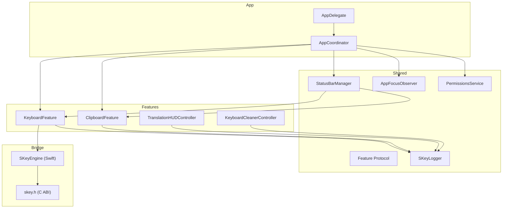
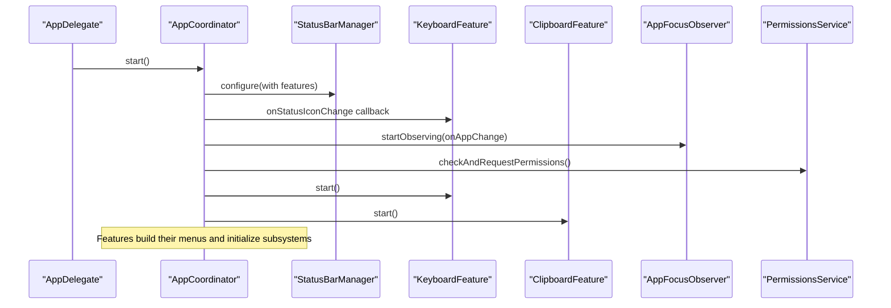
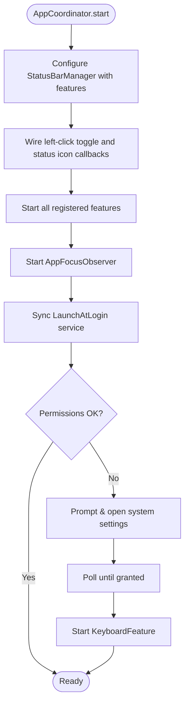
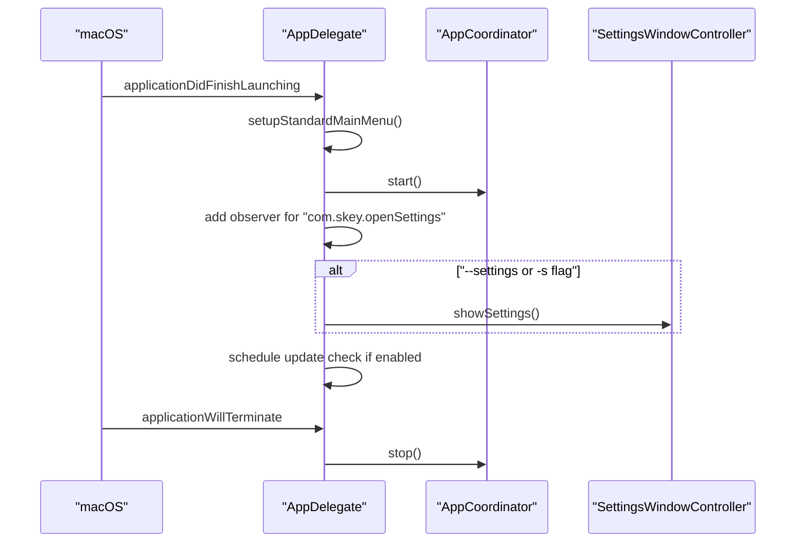
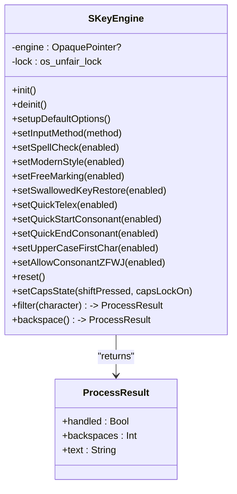
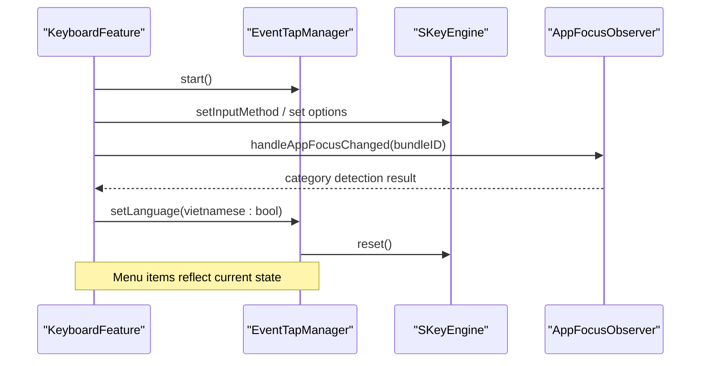
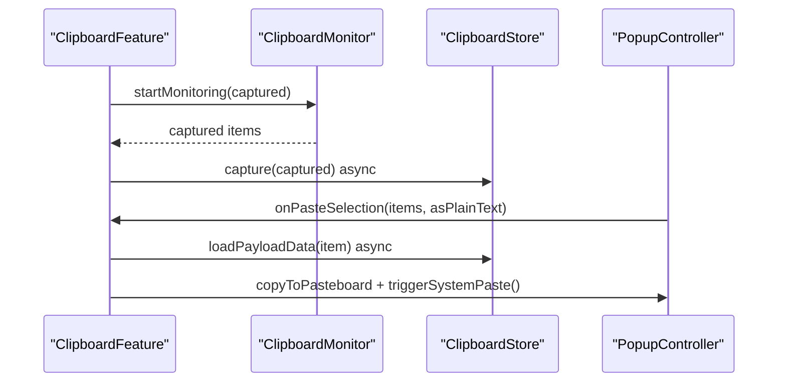
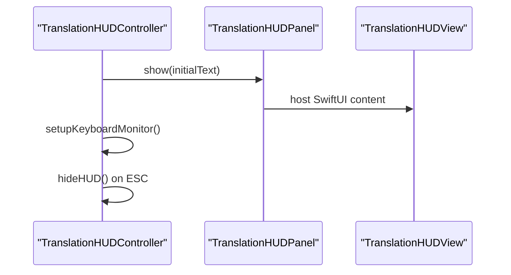
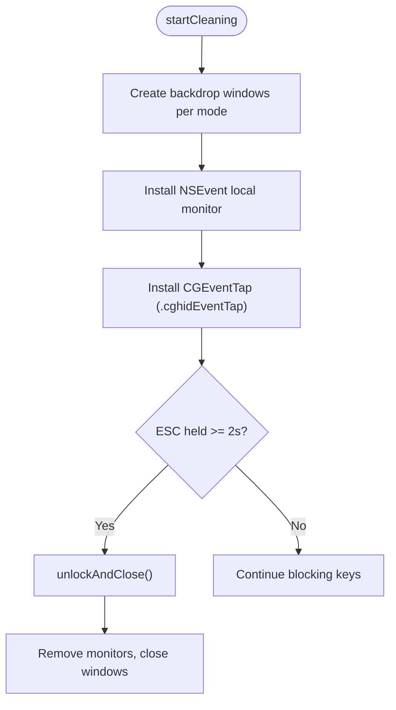
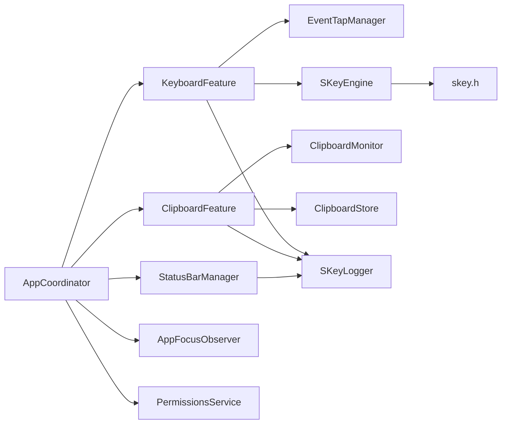

# Application Layer Architecture

<cite>
**Referenced Files in This Document**
- [AppCoordinator.swift](file://macos/skey-app/Sources/App/AppCoordinator.swift)
- [AppDelegate.swift](file://macos/skey-app/Sources/App/AppDelegate.swift)
- [SKeyEngine.swift](file://macos/skey-app/Sources/Features/Keyboard/Engine/SKeyEngine.swift)
- [Feature.swift](file://macos/skey-app/Sources/Shared/Core/Feature.swift)
- [skey.h](file://macos/skey-app/Sources/CSKey/include/skey.h)
- [KeyboardFeature.swift](file://macos/skey-app/Sources/Features/Keyboard/KeyboardFeature.swift)
- [ClipboardFeature.swift](file://macos/skey-app/Sources/Features/Clipboard/ClipboardFeature.swift)
- [StatusBarManager.swift](file://macos/skey-app/Sources/Shared/UI/StatusBarManager.swift)
- [EventTapManager.swift](file://macos/skey-app/Sources/Features/Keyboard/EventHandling/EventTapManager.swift)
- [AppFocusObserver.swift](file://macos/skey-app/Sources/Shared/Services/AppFocusObserver.swift)
- [PermissionsService.swift](file://macos/skey-app/Sources/Shared/Services/PermissionsService.swift)
- [SKeyLogger.swift](file://macos/skey-app/Sources/Shared/Logging/SKeyLogger.swift)
- [TranslationHUDController.swift](file://macos/skey-app/Sources/Features/Translator/UI/TranslationHUDController.swift)
- [KeyboardCleanerController.swift](file://macos/skey-app/Sources/Features/Cleaner/KeyboardCleanerController.swift)
</cite>

## Table of Contents
1. [Introduction](#introduction)
2. [Project Structure](#project-structure)
3. [Core Components](#core-components)
4. [Architecture Overview](#architecture-overview)
5. [Detailed Component Analysis](#detailed-component-analysis)
6. [Dependency Analysis](#dependency-analysis)
7. [Performance Considerations](#performance-considerations)
8. [Troubleshooting Guide](#troubleshooting-guide)
9. [Conclusion](#conclusion)

## Introduction
This document describes the macOS application layer architecture with a focus on Swift-based UI and system integration components. It explains:
- The AppCoordinator pattern that orchestrates feature modules and manages lifecycle
- The AppDelegate implementation for menu bar integration, background services, and system events
- The SKeyEngine bridge providing a clean Swift API over the Rust core engine via C ABI bindings
- The feature-based architecture where keyboard, clipboard, translation, settings, and tools are encapsulated as independent modules
- Error handling strategies, thread safety considerations, and performance monitoring approaches used throughout the application layer

## Project Structure
The macOS app is organized into an application bootstrap layer (App), a set of feature modules under Features, shared infrastructure under Shared, and a C header exposing the Rust engine to Swift. Key responsibilities:
- App: entry point, lifecycle coordination, status bar, permissions
- Features: Keyboard, Clipboard, Translator, Cleaner, Settings
- Shared: Core abstractions (Feature protocol), UI helpers (StatusBarManager), Services (permissions, focus observer, logging)
- CSKey: C ABI header bridging Swift to the Rust engine

**Diagram sources**
- [AppDelegate.swift:7-30](file://macos/skey-app/Sources/App/AppDelegate.swift#L7-L30)
- [AppCoordinator.swift:22-50](file://macos/skey-app/Sources/App/AppCoordinator.swift#L22-L50)
- [StatusBarManager.swift:47-160](file://macos/skey-app/Sources/Shared/UI/StatusBarManager.swift#L47-L160)
- [KeyboardFeature.swift:35-55](file://macos/skey-app/Sources/Features/Keyboard/KeyboardFeature.swift#L35-L55)
- [ClipboardFeature.swift:26-56](file://macos/skey-app/Sources/Features/Clipboard/ClipboardFeature.swift#L26-L56)
- [SKeyEngine.swift:27-34](file://macos/skey-app/Sources/Features/Keyboard/Engine/SKeyEngine.swift#L27-L34)
- [skey.h:44-74](file://macos/skey-app/Sources/CSKey/include/skey.h#L44-L74)

**Section sources**
- [AppDelegate.swift:7-75](file://macos/skey-app/Sources/App/AppDelegate.swift#L7-L75)
- [AppCoordinator.swift:6-77](file://macos/skey-app/Sources/App/AppCoordinator.swift#L6-L77)
- [Feature.swift:6-43](file://macos/skey-app/Sources/Shared/Core/Feature.swift#L6-L43)

## Core Components
- AppCoordinator: Central orchestrator that configures the status bar, registers features, starts them, observes app focus changes, syncs launch-at-login, and handles permission checks.
- Feature protocol: Defines a pluggable capability contract with id, name, lifecycle methods (start/stop), enable/disable, and menu item generation.
- StatusBarManager: Builds and owns the macOS status bar menu, aggregates feature menus, updates icons, and exposes actions like opening settings or tools.
- EventTapManager: Low-level event tap manager that hosts a dedicated thread with a run loop, processes key events through a pipeline, and exposes language state safely across threads.
- SKeyEngine: High-performance Swift wrapper around the Rust typing engine via C ABI, using zero-allocation paths and unfair locks for hot-path efficiency.
- PermissionsService: Checks and requests accessibility/input monitoring permissions and opens system preference panes when needed.
- AppFocusObserver: Tracks frontmost app and classifies it (browser, developer tool, chat/electron, spotlight, native) to support smart app switch behavior.
- Logging: Unified logger using Apple Unified Logging with optional file persistence and in-memory store for live UI streaming.

**Section sources**
- [AppCoordinator.swift:22-75](file://macos/skey-app/Sources/App/AppCoordinator.swift#L22-L75)
- [Feature.swift:6-43](file://macos/skey-app/Sources/Shared/Core/Feature.swift#L6-L43)
- [StatusBarManager.swift:6-160](file://macos/skey-app/Sources/Shared/UI/StatusBarManager.swift#L6-L160)
- [EventTapManager.swift:15-196](file://macos/skey-app/Sources/Features/Keyboard/EventHandling/EventTapManager.swift#L15-L196)
- [SKeyEngine.swift:6-189](file://macos/skey-app/Sources/Features/Keyboard/Engine/SKeyEngine.swift#L6-L189)
- [PermissionsService.swift:7-42](file://macos/skey-app/Sources/Shared/Services/PermissionsService.swift#L7-L42)
- [AppFocusObserver.swift:14-153](file://macos/skey-app/Sources/Shared/Services/AppFocusObserver.swift#L14-L153)
- [SKeyLogger.swift:6-139](file://macos/skey-app/Sources/Shared/Logging/SKeyLogger.swift#L6-L139)

## Architecture Overview
At launch, AppDelegate sets up the standard main menu and delegates startup to AppCoordinator. AppCoordinator configures the status bar, wires callbacks, starts registered features, begins app focus observation, syncs launch-at-login, and ensures required permissions. Each feature implements the Feature protocol and contributes menu items and lifecycle management. The keyboard feature uses EventTapManager to capture input and SKeyEngine to process keystrokes against the Rust engine exposed by skey.h.

**Diagram sources**
- [AppDelegate.swift:7-30](file://macos/skey-app/Sources/App/AppDelegate.swift#L7-L30)
- [AppCoordinator.swift:22-50](file://macos/skey-app/Sources/App/AppCoordinator.swift#L22-L50)
- [StatusBarManager.swift:26-58](file://macos/skey-app/Sources/Shared/UI/StatusBarManager.swift#L26-L58)
- [KeyboardFeature.swift:35-55](file://macos/skey-app/Sources/Features/Keyboard/KeyboardFeature.swift#L35-L55)
- [ClipboardFeature.swift:26-56](file://macos/skey-app/Sources/Features/Clipboard/ClipboardFeature.swift#L26-L56)
- [AppFocusObserver.swift:114-124](file://macos/skey-app/Sources/Shared/Services/AppFocusObserver.swift#L114-L124)
- [PermissionsService.swift:14-25](file://macos/skey-app/Sources/Shared/Services/PermissionsService.swift#L14-L25)

## Detailed Component Analysis

### AppCoordinator Pattern and Lifecycle Orchestration
- Registers features (keyboard, clipboard) and initializes status bar with those features
- Wires left-click toggle to language switching and status icon updates
- Starts all features and app focus observer; resets composing buffer and triggers smart app switch logic
- Syncs launch-at-login and performs permission checks, dynamically starting keyboard feature once permissions granted

**Diagram sources**
- [AppCoordinator.swift:22-75](file://macos/skey-app/Sources/App/AppCoordinator.swift#L22-L75)

**Section sources**
- [AppCoordinator.swift:22-75](file://macos/skey-app/Sources/App/AppCoordinator.swift#L22-L75)

### AppDelegate: Menu Bar Integration, Background Services, System Events
- Sets up standard main menu with localized actions
- Delegates startup to AppCoordinator
- Listens for distributed notifications to open settings
- Supports command-line flags to open settings at launch
- Performs silent update checks after launch based on user preferences
- Handles reopen and termination by showing settings and stopping coordinator

**Diagram sources**
- [AppDelegate.swift:7-75](file://macos/skey-app/Sources/App/AppDelegate.swift#L7-L75)

**Section sources**
- [AppDelegate.swift:7-75](file://macos/skey-app/Sources/App/AppDelegate.swift#L7-L75)

### SKeyEngine Bridge: Swift API Over Rust Core via C ABI
- Provides a high-performance Swift wrapper around the Rust engine
- Uses os_unfair_lock for thread-safe access to the underlying engine pointer
- Configures default options, charset, input method, and quick telex behaviors
- Processes characters and backspaces, returning a ProcessResult indicating handled state, backspaces, and output text
- Uses zero-heap allocation techniques for UTF-8 extraction from the engine’s output buffer

**Diagram sources**
- [SKeyEngine.swift:6-189](file://macos/skey-app/Sources/Features/Keyboard/Engine/SKeyEngine.swift#L6-L189)

**Section sources**
- [SKeyEngine.swift:6-189](file://macos/skey-app/Sources/Features/Keyboard/Engine/SKeyEngine.swift#L6-L189)
- [skey.h:16-74](file://macos/skey-app/Sources/CSKey/include/skey.h#L16-L74)

### Keyboard Feature: Input Capture, Engine Integration, Smart App Switch
- Implements Feature protocol; starts EventTapManager and loads preferences
- Builds grouped menu items for language toggle, input methods, charset, and typing options
- Applies preferences to the engine and keeps menu state synchronized
- Integrates with AppFocusObserver to auto-switch language for developer tools and restore Vietnamese when leaving them
- Uses EventTapManager to capture global events and delegate processing to TypingPipeline

**Diagram sources**
- [KeyboardFeature.swift:35-75](file://macos/skey-app/Sources/Features/Keyboard/KeyboardFeature.swift#L35-L75)
- [EventTapManager.swift:81-122](file://macos/skey-app/Sources/Features/Keyboard/EventHandling/EventTapManager.swift#L81-L122)
- [SKeyEngine.swift:63-123](file://macos/skey-app/Sources/Features/Keyboard/Engine/SKeyEngine.swift#L63-L123)

**Section sources**
- [KeyboardFeature.swift:7-328](file://macos/skey-app/Sources/Features/Keyboard/KeyboardFeature.swift#L7-L328)
- [EventTapManager.swift:15-196](file://macos/skey-app/Sources/Features/Keyboard/EventHandling/EventTapManager.swift#L15-L196)
- [AppFocusObserver.swift:29-91](file://macos/skey-app/Sources/Shared/Services/AppFocusObserver.swift#L29-L91)

### Clipboard Feature: History, Floating Popup, Paste Actions
- Implements Feature protocol; creates a floating popup controller on the main actor
- Monitors pasteboard changes asynchronously and captures content to storage
- Supports single-item paste and multi-item paste stack concatenation
- Triggers system paste via synthetic Cmd+V events with careful timing and local event suppression

**Diagram sources**
- [ClipboardFeature.swift:26-122](file://macos/skey-app/Sources/Features/Clipboard/ClipboardFeature.swift#L26-L122)

**Section sources**
- [ClipboardFeature.swift:6-146](file://macos/skey-app/Sources/Features/Clipboard/ClipboardFeature.swift#L6-L146)

### Translation HUD: Floating Panel and Local Event Handling
- Provides a borderless, floating panel with SwiftUI hosting view
- Centers near mouse location and supports standard editing shortcuts
- Uses a local event monitor to hide the HUD on ESC

**Diagram sources**
- [TranslationHUDController.swift:6-130](file://macos/skey-app/Sources/Features/Translator/UI/TranslationHUDController.swift#L6-L130)

**Section sources**
- [TranslationHUDController.swift:6-130](file://macos/skey-app/Sources/Features/Translator/UI/TranslationHUDController.swift#L6-L130)

### Keyboard Cleaner: Full-Screen Overlay and Hardware-Level Key Blocking
- Creates backdrop windows per screen with selectable modes (transparent, glass blur, black, white)
- Installs both local NSEvent monitoring and hardware CGEventTap to block all keys including media/brightness/volume
- Implements ESC hold-to-unlock with progress animation and cleanup on unlock

**Diagram sources**
- [KeyboardCleanerController.swift:57-279](file://macos/skey-app/Sources/Features/Cleaner/KeyboardCleanerController.swift#L57-L279)

**Section sources**
- [KeyboardCleanerController.swift:6-279](file://macos/skey-app/Sources/Features/Cleaner/KeyboardCleanerController.swift#L6-L279)

## Dependency Analysis
- AppCoordinator depends on StatusBarManager, KeyboardFeature, ClipboardFeature, AppFocusObserver, and PermissionsService
- KeyboardFeature depends on EventTapManager and SKeyEngine; integrates with AppSettings and localization
- ClipboardFeature depends on ClipboardMonitor, ClipboardStore, and UI controllers
- StatusBarManager aggregates feature menus and provides tools/actions
- SKeyEngine depends on C ABI defined in skey.h to call into the Rust engine
- Logging is used across features for diagnostics and debugging

**Diagram sources**
- [AppCoordinator.swift:22-50](file://macos/skey-app/Sources/App/AppCoordinator.swift#L22-L50)
- [KeyboardFeature.swift:35-55](file://macos/skey-app/Sources/Features/Keyboard/KeyboardFeature.swift#L35-L55)
- [ClipboardFeature.swift:26-56](file://macos/skey-app/Sources/Features/Clipboard/ClipboardFeature.swift#L26-L56)
- [SKeyEngine.swift:27-34](file://macos/skey-app/Sources/Features/Keyboard/Engine/SKeyEngine.swift#L27-L34)
- [skey.h:44-74](file://macos/skey-app/Sources/CSKey/include/skey.h#L44-L74)

**Section sources**
- [AppCoordinator.swift:22-50](file://macos/skey-app/Sources/App/AppCoordinator.swift#L22-L50)
- [KeyboardFeature.swift:35-55](file://macos/skey-app/Sources/Features/Keyboard/KeyboardFeature.swift#L35-L55)
- [ClipboardFeature.swift:26-56](file://macos/skey-app/Sources/Features/Clipboard/ClipboardFeature.swift#L26-L56)
- [SKeyEngine.swift:27-34](file://macos/skey-app/Sources/Features/Keyboard/Engine/SKeyEngine.swift#L27-L34)
- [skey.h:44-74](file://macos/skey-app/Sources/CSKey/include/skey.h#L44-L74)

## Performance Considerations
- Hot path optimization in SKeyEngine:
  - Uses os_unfair_lock for minimal contention and zero heap allocations
  - Reads engine output via temporary stack-allocated buffers to avoid malloc overhead
  - Returns lightweight ProcessResult structs to minimize allocations
- EventTapManager:
  - Dedicated thread with a CFRunLoop for low-latency event processing
  - Thread-safe language state with os_unfair_lock; UI updates dispatched to main queue
- Logging:
  - Non-blocking file writes on a utility queue; restricted debug logs in production builds
  - In-memory log store for UI streaming only when necessary
- Clipboard operations:
  - Asynchronous capture and paste actions to avoid blocking UI thread
  - Synthetic paste events scheduled with small delays to ensure target app readiness

[No sources needed since this section provides general guidance]

## Troubleshooting Guide
- Permission issues:
  - Use PermissionsService to check AXIsProcessTrusted and prompt/open system settings for Accessibility and Input Monitoring
  - AppCoordinator polls until permissions are granted before starting keyboard features
- EventTap failures:
  - EventTapManager attempts cghidEventTap first and falls back to cgSessionEventTap; logs creation failures
  - Re-enables taps on timeout/user-input disable events
- Status bar not updating:
  - Ensure StatusBarManager is configured with features and callbacks are wired in AppCoordinator
  - Verify KeyboardFeature.statusDidChange updates icon and menu state
- Logs:
  - Open log file via StatusBarManager Tools > Open Log File
  - Clear logs via Tools > Clear Logs; logs written with secure permissions in debug mode

**Section sources**
- [PermissionsService.swift:14-42](file://macos/skey-app/Sources/Shared/Services/PermissionsService.swift#L14-L42)
- [AppCoordinator.swift:58-75](file://macos/skey-app/Sources/App/AppCoordinator.swift#L58-L75)
- [EventTapManager.swift:81-122](file://macos/skey-app/Sources/Features/Keyboard/EventHandling/EventTapManager.swift#L81-L122)
- [StatusBarManager.swift:183-195](file://macos/skey-app/Sources/Shared/UI/StatusBarManager.swift#L183-L195)
- [SKeyLogger.swift:81-112](file://macos/skey-app/Sources/Shared/Logging/SKeyLogger.swift#L81-L112)

## Conclusion
The macOS application layer employs a robust AppCoordinator pattern to orchestrate feature modules, a clean SKeyEngine bridge to the Rust core, and a modular feature architecture enabling keyboard, clipboard, translation, and tools to operate independently while sharing common infrastructure. Thread safety is enforced with os_unfair_lock and main-thread dispatch for UI work, and performance is optimized through zero-allocation paths and asynchronous I/O. Logging and permissions handling provide reliable diagnostics and user guidance.

[No sources needed since this section summarizes without analyzing specific files]