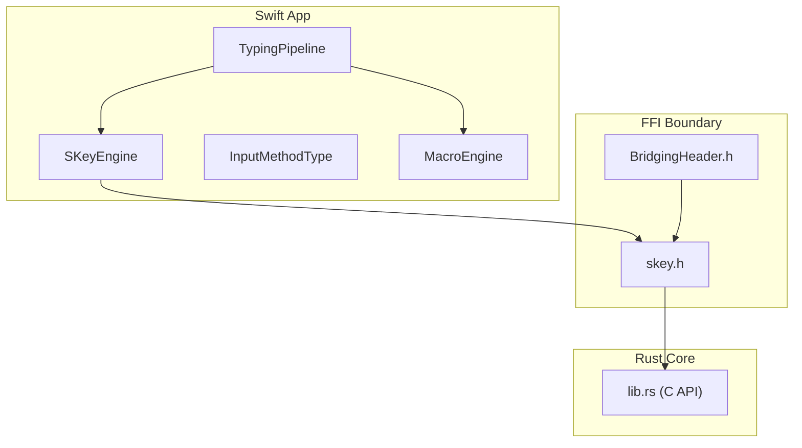
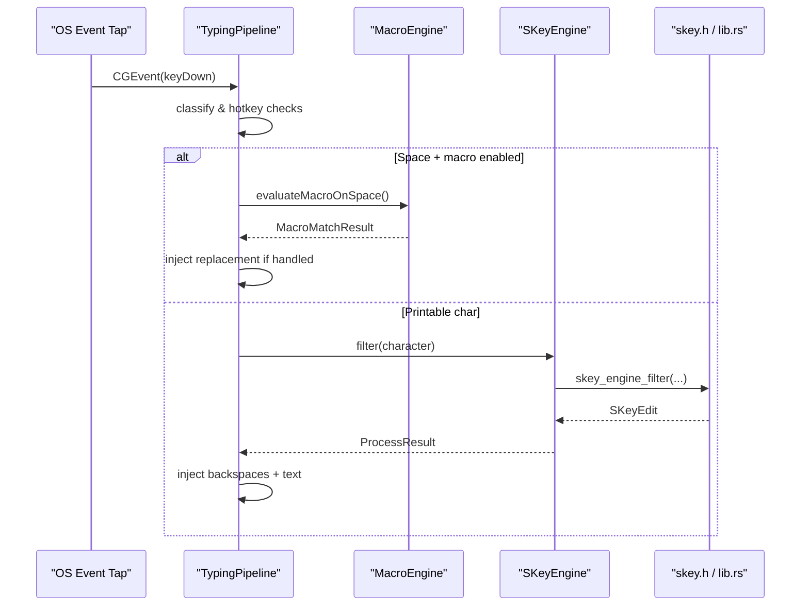
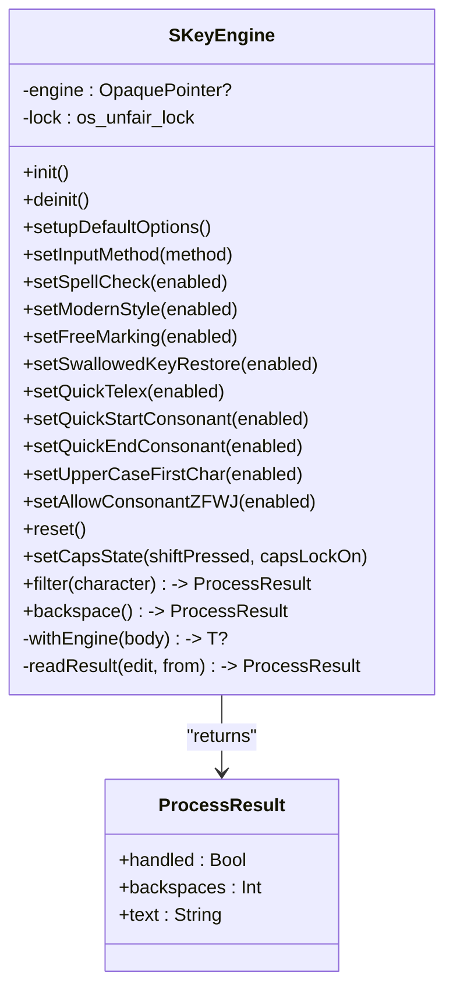
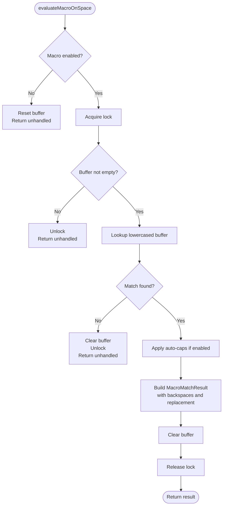
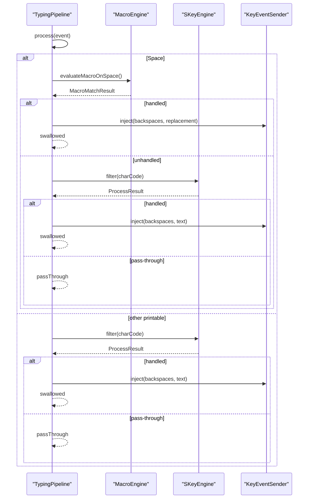
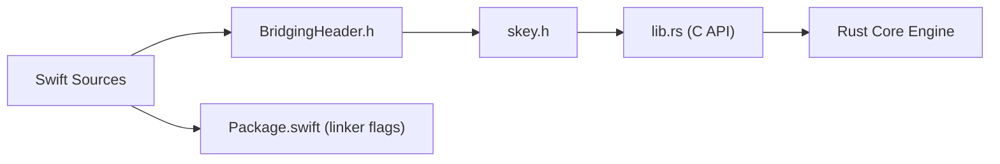

# Engine Bridge Layer

<cite>
**Referenced Files in This Document**
- [SKeyEngine.swift](file://macos/skey-app/Sources/Features/Keyboard/Engine/SKeyEngine.swift)
- [InputMethod.swift](file://macos/skey-app/Sources/Features/Keyboard/Engine/InputMethod.swift)
- [MacroEngine.swift](file://macos/skey-app/Sources/Features/Keyboard/Engine/MacroEngine.swift)
- [TypingPipeline.swift](file://macos/skey-app/Sources/Features/Keyboard/EventHandling/Pipeline/TypingPipeline.swift)
- [skey.h (C API)](file://port/skey-capi/include/skey.h)
- [lib.rs (C API implementation)](file://port/skey-capi/src/lib.rs)
- [BridgingHeader.h](file://macos/skey-app/Support/BridgingHeader.h)
- [Package.swift](file://macos/skey-app/Package.swift)
</cite>

## Table of Contents
1. [Introduction](#introduction)
2. [Project Structure](#project-structure)
3. [Core Components](#core-components)
4. [Architecture Overview](#architecture-overview)
5. [Detailed Component Analysis](#detailed-component-analysis)
6. [Dependency Analysis](#dependency-analysis)
7. [Performance Considerations](#performance-considerations)
8. [Troubleshooting Guide](#troubleshooting-guide)
9. [Conclusion](#conclusion)
10. [Appendices](#appendices)

## Introduction
This document explains the engine bridge layer that exposes a clean, type-safe Swift API over the Rust-based Vietnamese typing engine. It focuses on:
- SKeyEngine: a Swift wrapper around the C ABI for memory management, configuration, and error translation.
- InputMethodType: a unified Swift abstraction for multiple Vietnamese input methods (Telex, VNI, VIQR, Simple Telex).
- MacroEngine: an in-memory macro expander for text expansion and automation triggered on space.
- TypingPipeline: the hot path orchestrating event handling, composing via SKeyEngine, and macro expansion.

The goal is to provide high performance, thread safety, and clear extension points for adding new input methods or engine capabilities while preserving Swift type safety.

## Project Structure
At a high level:
- Swift app code lives under macos/skey-app/Sources.
- The Rust core is exposed through a stable C API under port/skey-capi.
- Swift links against the compiled static library and uses a bridging header to call into C functions.

**Diagram sources**
- [TypingPipeline.swift:1-345](file://macos/skey-app/Sources/Features/Keyboard/EventHandling/Pipeline/TypingPipeline.swift#L1-L345)
- [SKeyEngine.swift:1-189](file://macos/skey-app/Sources/Features/Keyboard/Engine/SKeyEngine.swift#L1-L189)
- [InputMethod.swift:1-20](file://macos/skey-app/Sources/Features/Keyboard/Engine/InputMethod.swift#L1-L20)
- [MacroEngine.swift:1-111](file://macos/skey-app/Sources/Features/Keyboard/Engine/MacroEngine.swift#L1-L111)
- [BridgingHeader.h:1-6](file://macos/skey-app/Support/BridgingHeader.h#L1-L6)
- [skey.h:1-106](file://port/skey-capi/include/skey.h#L1-L106)
- [lib.rs:1-800](file://port/skey-capi/src/lib.rs#L1-L800)

**Section sources**
- [Package.swift:1-51](file://macos/skey-app/Package.swift#L1-L51)
- [BridgingHeader.h:1-6](file://macos/skey-app/Support/BridgingHeader.h#L1-L6)

## Core Components
- SKeyEngine: A final class wrapping the Rust engine via C ABI. It manages lifecycle (create/free), options, input method selection, caps state, and key processing with minimal allocations and safe error translation.
- InputMethodType: An enum mapping Swift cases to raw values consumed by the engine’s input method selector.
- MacroEngine: A singleton managing a fast in-memory map of shortcuts to replacements, tracking current word buffer, and evaluating expansions on space with optional auto-caps behavior.
- TypingPipeline: Orchestrates keyboard events, applies hotkeys, resets state on navigation/clicks, filters printable characters through SKeyEngine, and triggers MacroEngine on space.

**Section sources**
- [SKeyEngine.swift:1-189](file://macos/skey-app/Sources/Features/Keyboard/Engine/SKeyEngine.swift#L1-L189)
- [InputMethod.swift:1-20](file://macos/skey-app/Sources/Features/Keyboard/Engine/InputMethod.swift#L1-L20)
- [MacroEngine.swift:1-111](file://macos/skey-app/Sources/Features/Keyboard/Engine/MacroEngine.swift#L1-L111)
- [TypingPipeline.swift:1-345](file://macos/skey-app/Sources/Features/Keyboard/EventHandling/Pipeline/TypingPipeline.swift#L1-L345)

## Architecture Overview
The pipeline processes each keystroke through several stages:
- Early exits for synthetic events, disabled taps, mouse clicks, non-keyboard events, and modifier-only chords.
- Hotkey interception for language toggle, clipboard popup, cleaner, AI settings, and quick translate.
- For printable ASCII characters, the pipeline optionally expands macros on space, then calls SKeyEngine.filter or backspace.
- Output is injected back to the system via KeyEventSender.

**Diagram sources**
- [TypingPipeline.swift:160-280](file://macos/skey-app/Sources/Features/Keyboard/EventHandling/Pipeline/TypingPipeline.swift#L160-L280)
- [SKeyEngine.swift:133-145](file://macos/skey-app/Sources/Features/Keyboard/Engine/SKeyEngine.swift#L133-L145)
- [skey.h:56-61](file://port/skey-capi/include/skey.h#L56-L61)
- [lib.rs:530-571](file://port/skey-capi/src/lib.rs#L530-L571)

## Detailed Component Analysis

### SKeyEngine: C ABI Wrapper and Memory Management
Responsibilities:
- Lifecycle: create and free the engine instance; set default options and charset; reset state when needed.
- Configuration: expose setters for input method, spell check, modern style, quick telex, uppercase first char, etc., using the C API.
- Processing: filter character and backspace operations return a ProcessResult indicating whether the key was handled, how many backspaces to emit, and the output text.
- Error translation: returns a sentinel unhandled result when the underlying engine pointer is nil or the edit indicates no handling.
- Zero-heap optimization: uses stack-allocated buffers to read UTF-8 output from the engine without heap allocation on the hot path.

Thread safety:
- Uses an unfair lock to serialize access to the opaque engine pointer across Swift threads.

**Diagram sources**
- [SKeyEngine.swift:1-189](file://macos/skey-app/Sources/Features/Keyboard/Engine/SKeyEngine.swift#L1-L189)

**Section sources**
- [SKeyEngine.swift:27-68](file://macos/skey-app/Sources/Features/Keyboard/Engine/SKeyEngine.swift#L27-L68)
- [SKeyEngine.swift:133-187](file://macos/skey-app/Sources/Features/Keyboard/Engine/SKeyEngine.swift#L133-L187)
- [skey.h:44-61](file://port/skey-capi/include/skey.h#L44-L61)
- [lib.rs:404-571](file://port/skey-capi/src/lib.rs#L404-L571)

### InputMethodType: Unified Abstraction for Vietnamese Input Methods
Provides a Swift enum with display names and raw values compatible with the C API’s input method constants. Supports Telex, VNI, VIQR, and Simple Telex.

Usage:
- Set the active input method via SKeyEngine.setInputMethod(_:) which forwards to the C function to switch modes and reset state.

Extensibility:
- Add a new case to the enum and ensure its raw value matches the engine’s expected constant. Update any UI or settings that enumerate available methods.

**Section sources**
- [InputMethod.swift:5-19](file://macos/skey-app/Sources/Features/Keyboard/Engine/InputMethod.swift#L5-L19)
- [SKeyEngine.swift:63-68](file://macos/skey-app/Sources/Features/Keyboard/Engine/SKeyEngine.swift#L63-L68)
- [skey.h:13-14](file://port/skey-capi/include/skey.h#L13-L14)

### MacroEngine: In-Memory Text Expansion
Responsibilities:
- Maintain a fast lookup table of shortcut keys to replacement strings.
- Track the current word buffer and handle recording characters, backspaces, and resets.
- Evaluate macros on space with optional auto-caps transformation based on user settings.

Thread safety:
- Protects shared state with an unfair lock.

Integration:
- Invoked by TypingPipeline on space during both Vietnamese and English mode paths.

**Diagram sources**
- [MacroEngine.swift:71-109](file://macos/skey-app/Sources/Features/Keyboard/Engine/MacroEngine.swift#L71-L109)

**Section sources**
- [MacroEngine.swift:1-111](file://macos/skey-app/Sources/Features/Keyboard/Engine/MacroEngine.swift#L1-L111)

### TypingPipeline: Hot Path Orchestration
Responsibilities:
- Early filtering of synthetic, disabled, mouse, and non-keyboard events.
- Hotkey interception for language toggle, clipboard, cleaner, AI settings, and quick translate.
- State resets on navigation, clicks, and modifier combinations.
- Character filtering through SKeyEngine and macro expansion on space.
- Smart context recomposition when caret movement is detected.

Performance considerations:
- Fast-path classification for function/media keys, navigation, backspace, and structural word-break keys.
- Minimal allocations using temporary buffers for Unicode extraction.

**Diagram sources**
- [TypingPipeline.swift:160-280](file://macos/skey-app/Sources/Features/Keyboard/EventHandling/Pipeline/TypingPipeline.swift#L160-L280)
- [MacroEngine.swift:71-109](file://macos/skey-app/Sources/Features/Keyboard/Engine/MacroEngine.swift#L71-L109)
- [SKeyEngine.swift:133-145](file://macos/skey-app/Sources/Features/Keyboard/Engine/SKeyEngine.swift#L133-L145)

**Section sources**
- [TypingPipeline.swift:31-170](file://macos/skey-app/Sources/Features/Keyboard/EventHandling/Pipeline/TypingPipeline.swift#L31-L170)
- [TypingPipeline.swift:174-280](file://macos/skey-app/Sources/Features/Keyboard/EventHandling/Pipeline/TypingPipeline.swift#L174-L280)

## Dependency Analysis
- Swift components depend on the C API declared in skey.h and exposed via BridgingHeader.h.
- The C API is implemented in lib.rs, which wraps the Rust core engine and provides both legacy globals and context-based APIs.
- Package.swift configures linking to the compiled static library and includes framework dependencies.

**Diagram sources**
- [BridgingHeader.h:1-6](file://macos/skey-app/Support/BridgingHeader.h#L1-L6)
- [skey.h:1-106](file://port/skey-capi/include/skey.h#L1-L106)
- [lib.rs:1-800](file://port/skey-capi/src/lib.rs#L1-L800)
- [Package.swift:1-51](file://macos/skey-app/Package.swift#L1-L51)

**Section sources**
- [Package.swift:14-49](file://macos/skey-app/Package.swift#L14-L49)
- [BridgingHeader.h:1-6](file://macos/skey-app/Support/BridgingHeader.h#L1-L6)

## Performance Considerations
- FFI call minimization: Batch operations where possible; avoid unnecessary reads/writes to engine options per keystroke.
- Zero-heap output extraction: SKeyEngine reads UTF-8 output into a stack-allocated buffer to prevent allocations on the hot path.
- Lock granularity: Use fine-grained locks (e.g., os_unfair_lock) only around critical sections to reduce contention.
- Fast paths: Classify keys early to bypass expensive logic for function/media keys, navigation, and structural breaks.
- Macro lookup: Keep macro map small and in-memory; use lowercased keys consistently to avoid repeated transformations.
- Thread safety: Ensure all cross-thread access to engine instances and shared state is serialized; prefer single-threaded hot paths where feasible.

[No sources needed since this section provides general guidance]

## Troubleshooting Guide
Common issues and strategies:
- Unhandled results: When filter or backspace returns unhandled, verify input method selection and engine state; ensure reset is called after navigation or focus changes.
- Missing output: If no text appears, confirm that skey_engine_output is called after filter/backspace and that the buffer capacity is sufficient.
- Macro not expanding: Check that macro is enabled, the buffer is not cleared prematurely, and the lookup key matches stored entries exactly.
- Thread crashes: Validate that all engine calls are protected by locks and that the engine pointer is valid before use.

**Section sources**
- [SKeyEngine.swift:133-187](file://macos/skey-app/Sources/Features/Keyboard/Engine/SKeyEngine.swift#L133-L187)
- [TypingPipeline.swift:174-280](file://macos/skey-app/Sources/Features/Keyboard/EventHandling/Pipeline/TypingPipeline.swift#L174-L280)
- [MacroEngine.swift:71-109](file://macos/skey-app/Sources/Features/Keyboard/Engine/MacroEngine.swift#L71-L109)

## Conclusion
The engine bridge layer cleanly separates Swift application concerns from the Rust core engine via a stable C ABI. SKeyEngine encapsulates lifecycle, configuration, and safe error translation; InputMethodType standardizes input method selection; MacroEngine provides fast text expansion; and TypingPipeline orchestrates the hot path with careful attention to performance and correctness. Extending support for new input methods or engine features involves updating the Swift enums and ensuring compatibility with the C API constants, while maintaining type safety and performance guarantees.

[No sources needed since this section summarizes without analyzing specific files]

## Appendices

### How to Extend Input Method Support
- Add a new case to InputMethodType with a raw value matching the engine’s expected constant.
- Ensure the C API supports the new method (via skey.h and lib.rs); if necessary, add a setter or raw method selector.
- Update UI and settings to enumerate and persist the new method.
- Test with representative inputs to validate behavior parity.

**Section sources**
- [InputMethod.swift:5-19](file://macos/skey-app/Sources/Features/Keyboard/Engine/InputMethod.swift#L5-L19)
- [skey.h:13-14](file://port/skey-capi/include/skey.h#L13-L14)
- [lib.rs:222-237](file://port/skey-capi/src/lib.rs#L222-L237)

### How to Integrate New Engine Capabilities
- Expose new functionality via the C API in lib.rs and skey.h to maintain stability.
- Wrap the new C functions in SKeyEngine with Swift-friendly types and error translation.
- Integrate into TypingPipeline at appropriate stages (e.g., post-filter transformations or pre-injection steps).
- Add tests to verify behavior and performance characteristics.

**Section sources**
- [SKeyEngine.swift:38-119](file://macos/skey-app/Sources/Features/Keyboard/Engine/SKeyEngine.swift#L38-L119)
- [skey.h:44-74](file://port/skey-capi/include/skey.h#L44-L74)
- [lib.rs:494-527](file://port/skey-capi/src/lib.rs#L494-L527)