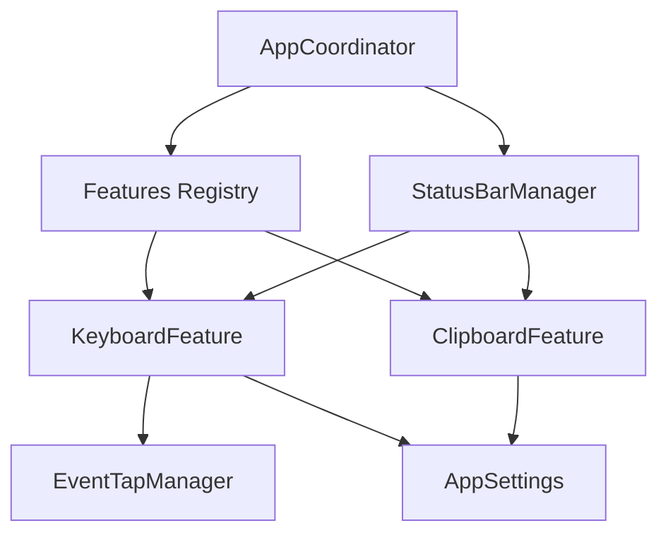
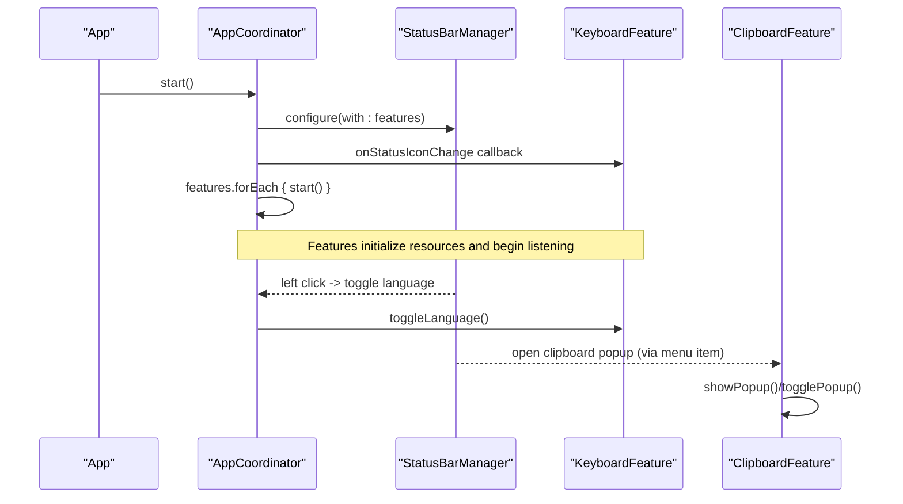
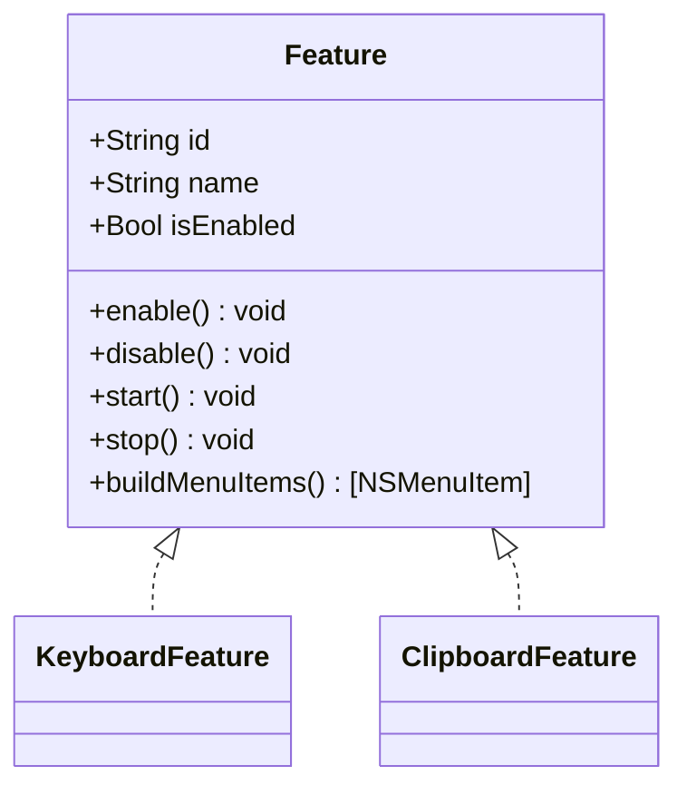
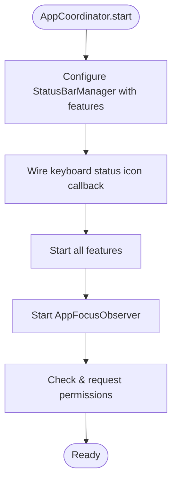
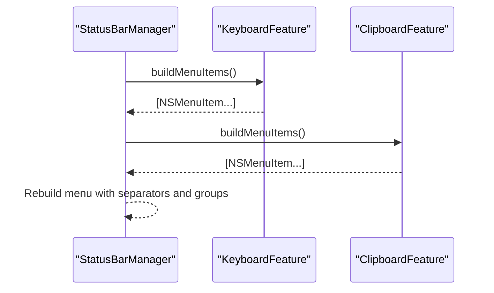
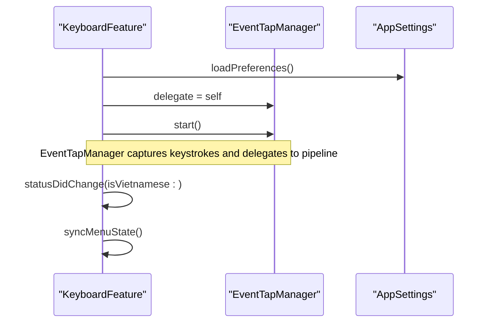
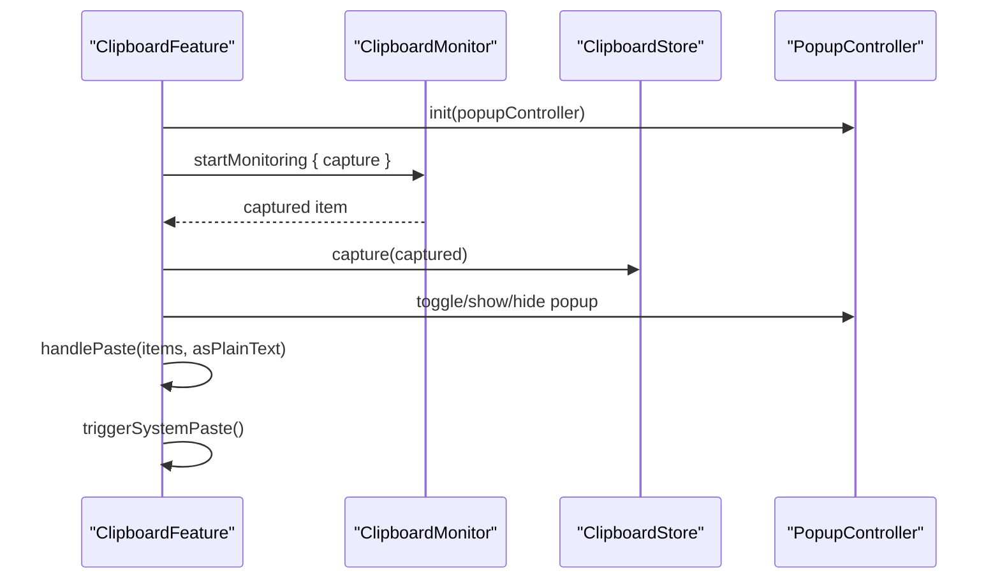
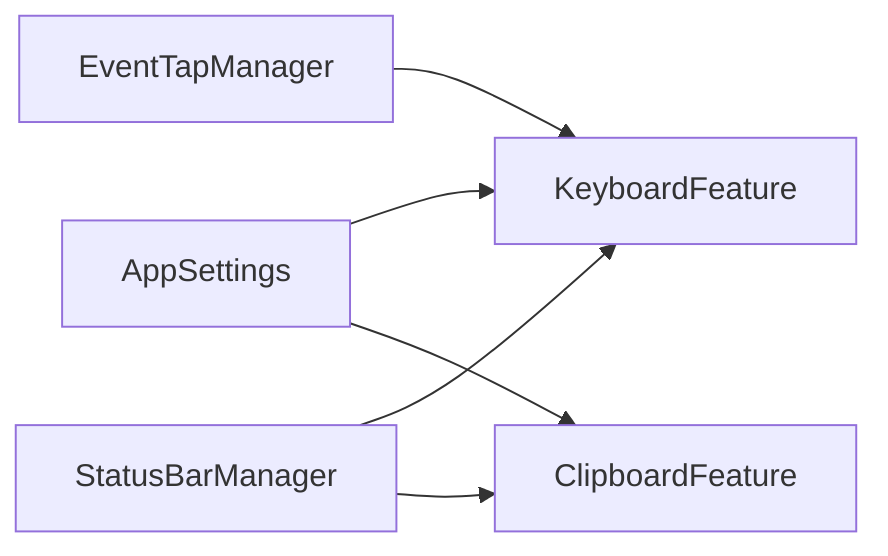
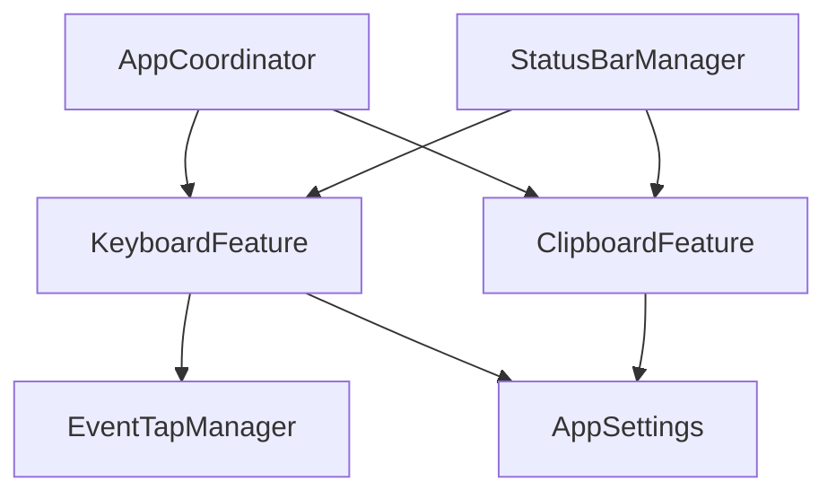

# Feature-Based Architecture

<cite>
**Referenced Files in This Document**
- [Feature.swift](file://macos/skey-app/Sources/Shared/Core/Feature.swift)
- [AppCoordinator.swift](file://macos/skey-app/Sources/App/AppCoordinator.swift)
- [KeyboardFeature.swift](file://macos/skey-app/Sources/Features/Keyboard/KeyboardFeature.swift)
- [ClipboardFeature.swift](file://macos/skey-app/Sources/Features/Clipboard/ClipboardFeature.swift)
- [StatusBarManager.swift](file://macos/skey-app/Sources/Shared/UI/StatusBarManager.swift)
- [EventTapManager.swift](file://macos/skey-app/Sources/Features/Keyboard/EventHandling/EventTapManager.swift)
- [AppSettings.swift](file://macos/skey-app/Sources/Shared/Settings/AppSettings.swift)
</cite>

## Table of Contents
1. [Introduction](#introduction)
2. [Project Structure](#project-structure)
3. [Core Components](#core-components)
4. [Architecture Overview](#architecture-overview)
5. [Detailed Component Analysis](#detailed-component-analysis)
6. [Dependency Analysis](#dependency-analysis)
7. [Performance Considerations](#performance-considerations)
8. [Troubleshooting Guide](#troubleshooting-guide)
9. [Conclusion](#conclusion)
10. [Appendices](#appendices)

## Introduction
This document explains the feature-based architecture used throughout the application. It focuses on the Feature protocol, how features are registered and managed by AppCoordinator, and how features communicate via shared services and settings. It also provides guidelines for implementing new features, best practices for isolation, and strategies for handling inter-feature dependencies, illustrated with concrete examples from the keyboard and clipboard features.

## Project Structure
The feature system is centered around a small set of core components:
- A protocol that standardizes feature lifecycle and menu integration
- An app coordinator that owns and starts/stops all features
- Concrete features (keyboard, clipboard) that implement the protocol
- Shared services and settings that provide cross-cutting concerns like UI status bar, event capture, and configuration

**Diagram sources**
- [AppCoordinator.swift:6-20](file://macos/skey-app/Sources/App/AppCoordinator.swift#L6-L20)
- [StatusBarManager.swift:6-29](file://macos/skey-app/Sources/Shared/UI/StatusBarManager.swift#L6-L29)
- [KeyboardFeature.swift:7-11](file://macos/skey-app/Sources/Features/Keyboard/KeyboardFeature.swift#L7-L11)
- [ClipboardFeature.swift:7-17](file://macos/skey-app/Sources/Features/Clipboard/ClipboardFeature.swift#L7-L17)
- [EventTapManager.swift:17-31](file://macos/skey-app/Sources/Features/Keyboard/EventHandling/EventTapManager.swift#L17-L31)
- [AppSettings.swift:10-22](file://macos/skey-app/Sources/Shared/Settings/AppSettings.swift#L10-L22)

**Section sources**
- [AppCoordinator.swift:6-20](file://macos/skey-app/Sources/App/AppCoordinator.swift#L6-L20)
- [StatusBarManager.swift:6-29](file://macos/skey-app/Sources/Shared/UI/StatusBarManager.swift#L6-L29)

## Core Components
- Feature protocol defines a uniform interface for pluggable capabilities, including lifecycle methods start(), stop(), enable(), disable(), state access isEnabled, identity id/name, and menu generation buildMenuItems(). Default implementations delegate enable/disable to start/stop.
- AppCoordinator is the central orchestrator: it holds a registry of features, configures the status bar, wires callbacks, starts all features, monitors app focus, syncs launch-at-login, and handles permissions.
- StatusBarManager builds the macOS status bar menu by aggregating menu items from all features and exposes a left-click callback to toggle language.
- KeyboardFeature implements the keyboard input engine lifecycle, integrates with EventTapManager, manages preferences, and builds rich menu items.
- ClipboardFeature implements clipboard history management, background monitoring, popup UI lifecycle, and menu integration.

**Section sources**
- [Feature.swift:6-42](file://macos/skey-app/Sources/Shared/Core/Feature.swift#L6-L42)
- [AppCoordinator.swift:6-56](file://macos/skey-app/Sources/App/AppCoordinator.swift#L6-L56)
- [StatusBarManager.swift:6-58](file://macos/skey-app/Sources/Shared/UI/StatusBarManager.swift#L6-L58)
- [KeyboardFeature.swift:7-55](file://macos/skey-app/Sources/Features/Keyboard/KeyboardFeature.swift#L7-L55)
- [ClipboardFeature.swift:7-56](file://macos/skey-app/Sources/Features/Clipboard/ClipboardFeature.swift#L7-L56)

## Architecture Overview
The application uses a centralized registry pattern where AppCoordinator owns all features and drives their lifecycle. Features remain decoupled from each other and instead interact through shared services (e.g., EventTapManager, AppSettings) and UI coordination (e.g., StatusBarManager). Communication between features is indirect:
- Status bar actions route to specific features via callbacks or direct calls
- Settings changes propagate via reactive settings modules
- System events are captured centrally and routed to relevant features

**Diagram sources**
- [AppCoordinator.swift:22-50](file://macos/skey-app/Sources/App/AppCoordinator.swift#L22-L50)
- [StatusBarManager.swift:26-58](file://macos/skey-app/Sources/Shared/UI/StatusBarManager.swift#L26-L58)
- [KeyboardFeature.swift:35-55](file://macos/skey-app/Sources/Features/Keyboard/KeyboardFeature.swift#L35-L55)
- [ClipboardFeature.swift:26-78](file://macos/skey-app/Sources/Features/Clipboard/ClipboardFeature.swift#L26-L78)

## Detailed Component Analysis

### Feature Protocol and Lifecycle
- The protocol enforces a consistent contract:
  - Identity: id, name
  - State: isEnabled
  - Lifecycle: start(), stop(), enable(), disable()
  - UI integration: buildMenuItems()
- Default implementations make enable() call start() and disable() call stop(), simplifying feature implementations.

**Diagram sources**
- [Feature.swift:6-42](file://macos/skey-app/Sources/Shared/Core/Feature.swift#L6-L42)
- [KeyboardFeature.swift:7-11](file://macos/skey-app/Sources/Features/Keyboard/KeyboardFeature.swift#L7-L11)
- [ClipboardFeature.swift:7-17](file://macos/skey-app/Sources/Features/Clipboard/ClipboardFeature.swift#L7-L17)

**Section sources**
- [Feature.swift:6-42](file://macos/skey-app/Sources/Shared/Core/Feature.swift#L6-L42)

### AppCoordinator: Centralized Registry and Orchestration
- Holds explicit references to known features and a registry array
- Configures StatusBarManager with all features
- Wires keyboard status icon updates
- Starts all features
- Observes app focus changes and forwards to keyboard feature
- Syncs launch-at-login and checks permissions

**Diagram sources**
- [AppCoordinator.swift:22-50](file://macos/skey-app/Sources/App/AppCoordinator.swift#L22-L50)

**Section sources**
- [AppCoordinator.swift:6-56](file://macos/skey-app/Sources/App/AppCoordinator.swift#L6-L56)

### StatusBarManager: Aggregating Feature Menus
- Builds the status bar menu by calling buildMenuItems() on each feature
- Provides a left-click callback to trigger keyboard language toggle
- Updates status icon based on keyboard feature state

**Diagram sources**
- [StatusBarManager.swift:47-58](file://macos/skey-app/Sources/Shared/UI/StatusBarManager.swift#L47-L58)
- [KeyboardFeature.swift:79-182](file://macos/skey-app/Sources/Features/Keyboard/KeyboardFeature.swift#L79-L182)
- [ClipboardFeature.swift:126-140](file://macos/skey-app/Sources/Features/Clipboard/ClipboardFeature.swift#L126-L140)

**Section sources**
- [StatusBarManager.swift:6-58](file://macos/skey-app/Sources/Shared/UI/StatusBarManager.swift#L6-L58)

### KeyboardFeature: Input Engine Integration
- Implements start(): loads preferences, sets EventTapManager delegate, starts event tap
- Implements stop(): stops event tap
- Manages smart app switch behavior on focus changes
- Builds comprehensive menu items for language, input method, charset, typing options
- Synchronizes menu state with settings and runtime state

**Diagram sources**
- [KeyboardFeature.swift:35-55](file://macos/skey-app/Sources/Features/Keyboard/KeyboardFeature.swift#L35-L55)
- [EventTapManager.swift:17-31](file://macos/skey-app/Sources/Features/Keyboard/EventHandling/EventTapManager.swift#L17-L31)

**Section sources**
- [KeyboardFeature.swift:35-182](file://macos/skey-app/Sources/Features/Keyboard/KeyboardFeature.swift#L35-L182)
- [EventTapManager.swift:17-31](file://macos/skey-app/Sources/Features/Keyboard/EventHandling/EventTapManager.swift#L17-L31)

### ClipboardFeature: History and Popup Management
- Implements start(): conditionally initializes popup controller and starts pasteboard monitor
- Implements stop(): stops monitor and closes popup
- Handles paste actions: single-item or multi-item paste stack
- Builds menu item to open clipboard popup

**Diagram sources**
- [ClipboardFeature.swift:26-122](file://macos/skey-app/Sources/Features/Clipboard/ClipboardFeature.swift#L26-L122)

**Section sources**
- [ClipboardFeature.swift:26-140](file://macos/skey-app/Sources/Features/Clipboard/ClipboardFeature.swift#L26-L140)

### Shared State and Dependency Injection
- AppSettings serves as a centralized, reactive settings hub with modules for keyboard, clipboard, macros, general, shortcuts, and translator. Features read/write settings to control behavior and UI state.
- EventTapManager is a singleton providing low-level event capture and an engine abstraction; KeyboardFeature depends on it for input processing.
- StatusBarManager aggregates feature menus and coordinates UI interactions without tightly coupling features to each other.

**Diagram sources**
- [AppSettings.swift:10-22](file://macos/skey-app/Sources/Shared/Settings/AppSettings.swift#L10-L22)
- [EventTapManager.swift:17-31](file://macos/skey-app/Sources/Features/Keyboard/EventHandling/EventTapManager.swift#L17-L31)
- [StatusBarManager.swift:6-29](file://macos/skey-app/Sources/Shared/UI/StatusBarManager.swift#L6-L29)
- [KeyboardFeature.swift:7-11](file://macos/skey-app/Sources/Features/Keyboard/KeyboardFeature.swift#L7-L11)
- [ClipboardFeature.swift:7-17](file://macos/skey-app/Sources/Features/Clipboard/ClipboardFeature.swift#L7-L17)

**Section sources**
- [AppSettings.swift:10-22](file://macos/skey-app/Sources/Shared/Settings/AppSettings.swift#L10-L22)

## Dependency Analysis
- Coupling:
  - AppCoordinator directly instantiates KeyboardFeature and references ClipboardFeature.shared; this is acceptable for top-level orchestration.
  - StatusBarManager depends on Feature protocol only, maintaining loose coupling to features.
  - KeyboardFeature depends on EventTapManager and AppSettings; ClipboardFeature depends on AppSettings and its own store/monitor.
- Cohesion:
  - Each feature encapsulates its domain logic and UI, exposing only lifecycle and menu building.
- External integrations:
  - EventTapManager bridges to OS-level event capture
  - AppSettings persists and reacts to configuration changes
  - StatusBarManager integrates with macOS status bar

**Diagram sources**
- [AppCoordinator.swift:6-20](file://macos/skey-app/Sources/App/AppCoordinator.swift#L6-L20)
- [KeyboardFeature.swift:7-11](file://macos/skey-app/Sources/Features/Keyboard/KeyboardFeature.swift#L7-L11)
- [ClipboardFeature.swift:7-17](file://macos/skey-app/Sources/Features/Clipboard/ClipboardFeature.swift#L7-L17)
- [EventTapManager.swift:17-31](file://macos/skey-app/Sources/Features/Keyboard/EventHandling/EventTapManager.swift#L17-L31)
- [AppSettings.swift:10-22](file://macos/skey-app/Sources/Shared/Settings/AppSettings.swift#L10-L22)
- [StatusBarManager.swift:6-29](file://macos/skey-app/Sources/Shared/UI/StatusBarManager.swift#L6-L29)

**Section sources**
- [AppCoordinator.swift:6-20](file://macos/skey-app/Sources/App/AppCoordinator.swift#L6-L20)
- [StatusBarManager.swift:6-29](file://macos/skey-app/Sources/Shared/UI/StatusBarManager.swift#L6-L29)

## Performance Considerations
- Hot path efficiency: AppSettings is designed for zero-latency access in hot paths (e.g., typing pipeline), minimizing overhead during key processing.
- Background tasks: ClipboardFeature offloads persistence to background tasks to avoid blocking UI.
- Event capture: EventTapManager centralizes low-level event handling to reduce duplication and ensure efficient processing.
- Menu rebuilds: StatusBarManager rebuilds menus when needed; features cache menu items to minimize recomputation.

[No sources needed since this section provides general guidance]

## Troubleshooting Guide
- Permissions issues:
  - AppCoordinator checks and requests necessary permissions; if not granted, it opens system settings and polls until granted, then starts keyboard feature.
- Status icon not updating:
  - Ensure KeyboardFeature.statusDidChange triggers onStatusIconChange and StatusBarManager.updateStatusIcon is called.
- Clipboard popup not appearing:
  - Verify ClipboardFeature.isEnabled and that start() has been called; check that monitor.startMonitoring is active.
- Menu items missing:
  - Confirm buildMenuItems returns non-empty arrays; StatusBarManager skips empty results.

**Section sources**
- [AppCoordinator.swift:58-75](file://macos/skey-app/Sources/App/AppCoordinator.swift#L58-L75)
- [KeyboardFeature.swift:52-55](file://macos/skey-app/Sources/Features/Keyboard/KeyboardFeature.swift#L52-L55)
- [StatusBarManager.swift:47-58](file://macos/skey-app/Sources/Shared/UI/StatusBarManager.swift#L47-L58)
- [ClipboardFeature.swift:26-56](file://macos/skey-app/Sources/Features/Clipboard/ClipboardFeature.swift#L26-L56)

## Conclusion
The feature-based architecture provides a clean separation of concerns, standardized lifecycle management, and flexible integration points. Features remain isolated while sharing common services and settings. AppCoordinator acts as the central orchestrator, and StatusBarManager unifies user interaction through the status bar. Following the guidelines below ensures maintainability and scalability as new features are added.

[No sources needed since this section summarizes without analyzing specific files]

## Appendices

### Guidelines for Implementing New Features
- Implement the Feature protocol:
  - Provide unique id and human-readable name
  - Expose isEnabled derived from settings or runtime state
  - Implement start() to initialize resources and listeners
  - Implement stop() to release resources and cancel observers
  - Implement buildMenuItems() to contribute to the status bar menu
- Use AppSettings for configuration and reactive updates
- Avoid direct coupling between features; prefer shared services (e.g., EventTapManager, StatusBarManager)
- Keep UI work on the main thread; use background tasks for I/O-heavy operations
- Make lifecycle methods idempotent to allow safe repeated calls

**Section sources**
- [Feature.swift:6-42](file://macos/skey-app/Sources/Shared/Core/Feature.swift#L6-L42)
- [AppSettings.swift:10-22](file://macos/skey-app/Sources/Shared/Settings/AppSettings.swift#L10-L22)

### Best Practices for Feature Isolation
- Encapsulate feature-specific state within the feature class
- Use weak references to prevent retain cycles with delegates and closures
- Prefer dependency injection via constructor parameters or properties for testability
- Limit global state; rely on centralized services like AppSettings and StatusBarManager

**Section sources**
- [KeyboardFeature.swift:7-11](file://macos/skey-app/Sources/Features/Keyboard/KeyboardFeature.swift#L7-L11)
- [ClipboardFeature.swift:7-17](file://macos/skey-app/Sources/Features/Clipboard/ClipboardFeature.swift#L7-L17)

### Strategies for Handling Inter-Feature Dependencies
- Use shared services for communication (e.g., EventTapManager for input events)
- Leverage settings modules for cross-feature configuration
- Coordinate UI via StatusBarManager callbacks rather than direct feature-to-feature calls
- For complex workflows, introduce a dedicated service or mediator if needed

**Section sources**
- [EventTapManager.swift:17-31](file://macos/skey-app/Sources/Features/Keyboard/EventHandling/EventTapManager.swift#L17-L31)
- [AppSettings.swift:10-22](file://macos/skey-app/Sources/Shared/Settings/AppSettings.swift#L10-L22)
- [StatusBarManager.swift:6-29](file://macos/skey-app/Sources/Shared/UI/StatusBarManager.swift#L6-L29)

### Concrete Examples from Existing Features
- Keyboard feature:
  - Implements start() to load preferences, set delegate, and start event capture
  - Implements stop() to stop event capture
  - Builds extensive menu items for language, input methods, charset, and typing options
  - Integrates with StatusBarManager for status icon updates
- Clipboard feature:
  - Implements start() to initialize popup and start monitoring
  - Implements stop() to stop monitoring and close popup
  - Handles paste actions and triggers system paste events
  - Adds a menu item to open the clipboard popup

**Section sources**
- [KeyboardFeature.swift:35-182](file://macos/skey-app/Sources/Features/Keyboard/KeyboardFeature.swift#L35-L182)
- [ClipboardFeature.swift:26-140](file://macos/skey-app/Sources/Features/Clipboard/ClipboardFeature.swift#L26-L140)