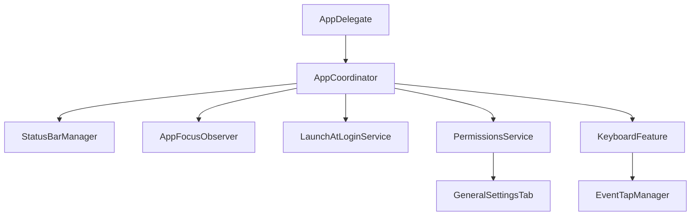
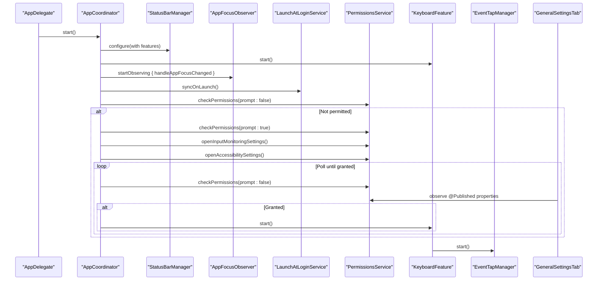
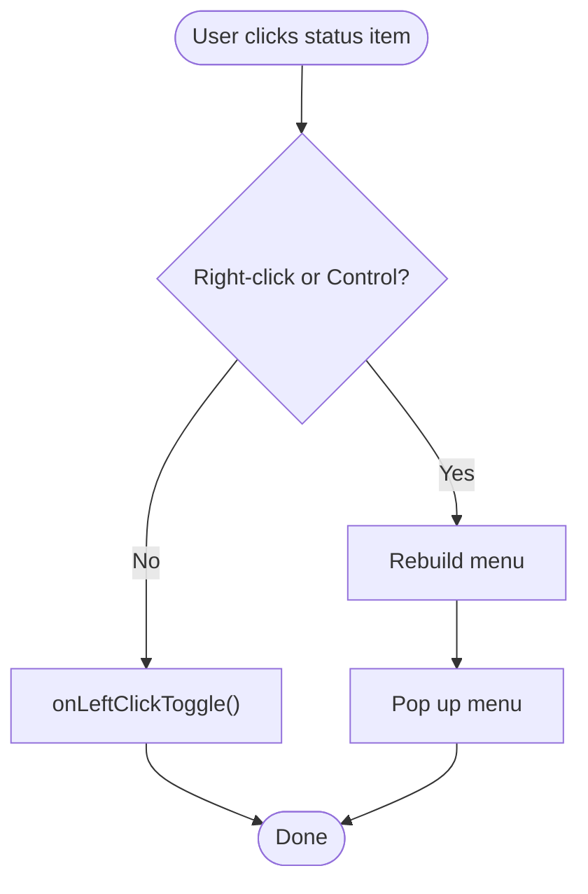
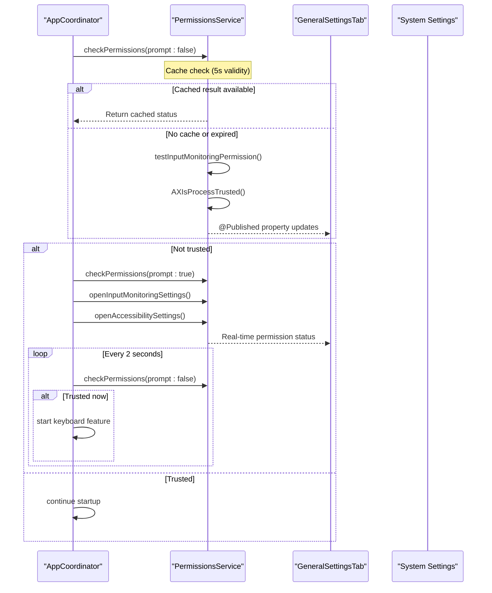
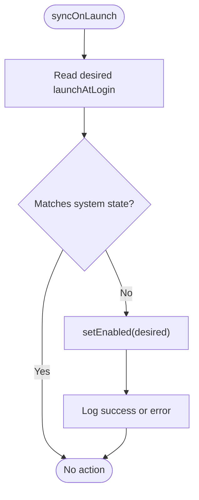
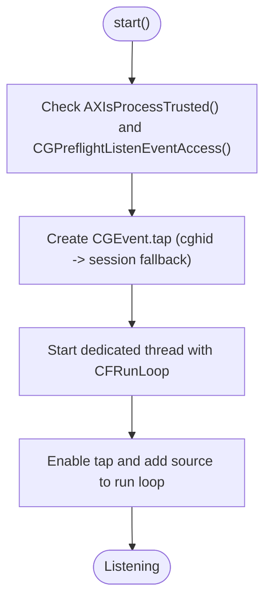
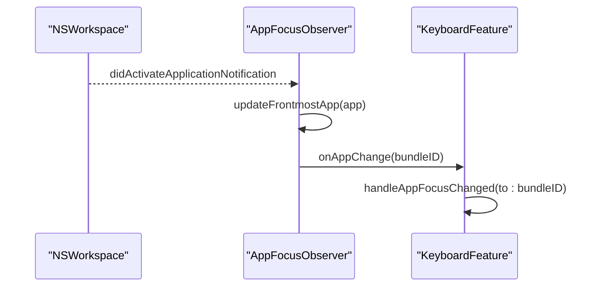
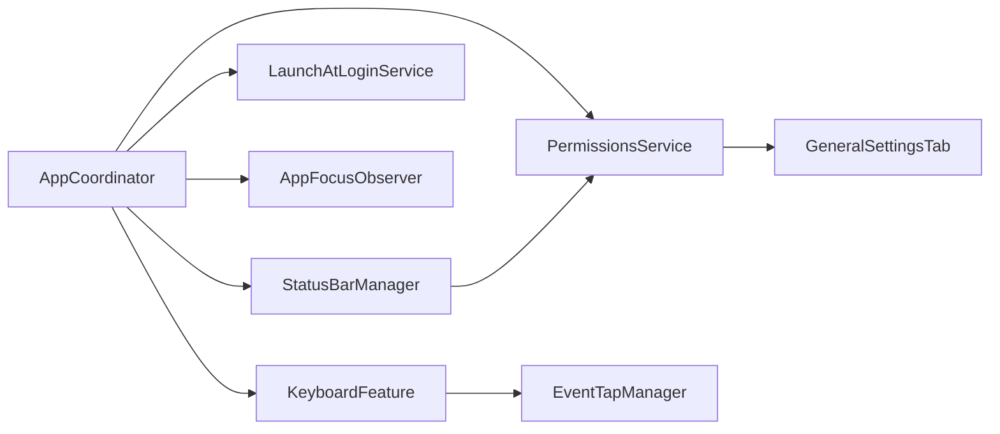

# System Integration Services

<cite>
**Referenced Files in This Document**
- [StatusBarManager.swift](file://macos/skey-app/Sources/Shared/UI/StatusBarManager.swift)
- [PermissionsService.swift](file://macos/skey-app/Sources/Shared/Services/PermissionsService.swift)
- [LaunchAtLoginService.swift](file://macos/skey-app/Sources/Shared/Services/LaunchAtLoginService.swift)
- [EventTapManager.swift](file://macos/skey-app/Sources/Features/Keyboard/EventHandling/EventTapManager.swift)
- [AppFocusObserver.swift](file://macos/skey-app/Sources/Shared/Services/AppFocusObserver.swift)
- [AppCoordinator.swift](file://macos/skey-app/Sources/App/AppCoordinator.swift)
- [AppDelegate.swift](file://macos/skey-app/Sources/App/AppDelegate.swift)
- [GeneralSettingsTab.swift](file://macos/skey-app/Sources/Features/Settings/UI/Tabs/GeneralSettingsTab.swift)
</cite>

## Update Summary
**Changes Made**
- Updated PermissionsService section to reflect ObservableObject conformance and reactive UI bindings
- Added new section on smart caching with 5-second validity window
- Enhanced Input Monitoring permission testing via temporary EventTap creation
- Updated UI integration examples showing reactive permission status display
- Added new diagram showing reactive permission flow with Combine framework

## Table of Contents
1. [Introduction](#introduction)
2. [Project Structure](#project-structure)
3. [Core Components](#core-components)
4. [Architecture Overview](#architecture-overview)
5. [Detailed Component Analysis](#detailed-component-analysis)
6. [Dependency Analysis](#dependency-analysis)
7. [Performance Considerations](#performance-considerations)
8. [Troubleshooting Guide](#troubleshooting-guide)
9. [Conclusion](#conclusion)

## Introduction
This document explains the macOS system integration services that power SKey's menu bar presence, permissions handling, and launch behavior. It focuses on:
- StatusBarManager for menu bar icon management, notifications, and user interactions
- PermissionsService for accessibility and input monitoring authorization flows with reactive UI bindings
- LaunchAtLoginService for registering/unregistering the app at login via ServiceManagement
It also covers security considerations, user experience patterns for permission requests, fallback strategies when permissions are denied, and examples of integrating with other macOS services and handling system event notifications.

## Project Structure
The system integration services live under Shared and App directories and coordinate with keyboard and clipboard features to provide a cohesive macOS experience.



**Diagram sources**
- [AppDelegate.swift:7-30](file://macos/skey-app/Sources/App/AppDelegate.swift#L7-L30)
- [AppCoordinator.swift:30-58](file://macos/skey-app/Sources/App/AppCoordinator.swift#L30-L58)
- [EventTapManager.swift:15-103](file://macos/skey-app/Sources/Features/Keyboard/EventHandling/EventTapManager.swift#L15-L103)
- [GeneralSettingsTab.swift:97-136](file://macos/skey-app/Sources/Features/Settings/UI/Tabs/GeneralSettingsTab.swift#L97-L136)

**Section sources**
- [AppDelegate.swift:7-30](file://macos/skey-app/Sources/App/AppDelegate.swift#L7-L30)
- [AppCoordinator.swift:30-58](file://macos/skey-app/Sources/App/AppCoordinator.swift#L30-L58)

## Core Components
- StatusBarManager: Manages the NSStatusItem, builds a grouped menu, updates the status icon based on language state, and provides actions to open settings and tools.
- PermissionsService: **Updated** Now conforms to ObservableObject from Combine framework with reactive UI bindings. Implements smart caching with 5-second validity window and two new @Published properties tracking hasInputMonitoringPermission and hasAccessibilityPermission separately. Added sophisticated Input Monitoring permission testing via temporary EventTap creation.
- LaunchAtLoginService: Uses ServiceManagement to register/unregister the app as a Login Item on macOS 13+.
- Supporting services:
  - EventTapManager: Low-level event capture lifecycle and thread hosting for keyboard events.
  - AppFocusObserver: Observes frontmost app changes and classifies apps to adapt behavior.
  - AppCoordinator: Orchestrates startup, feature initialization, permission checks, and service coordination.

**Section sources**
- [StatusBarManager.swift:6-160](file://macos/skey-app/Sources/Shared/UI/StatusBarManager.swift#L6-L160)
- [PermissionsService.swift:8-115](file://macos/skey-app/Sources/Shared/Services/PermissionsService.swift#L8-L115)
- [LaunchAtLoginService.swift:7-50](file://macos/skey-app/Sources/Shared/Services/LaunchAtLoginService.swift#L7-L50)
- [EventTapManager.swift:15-103](file://macos/skey-app/Sources/Features/Keyboard/EventHandling/EventTapManager.swift#L15-L103)
- [AppFocusObserver.swift:14-152](file://macos/skey-app/Sources/Shared/Services/AppFocusObserver.swift#L14-L152)
- [AppCoordinator.swift:30-84](file://macos/skey-app/Sources/App/AppCoordinator.swift#L30-L84)

## Architecture Overview
The application bootstraps via AppDelegate, which starts AppCoordinator. The coordinator configures the StatusBarManager, wires up callbacks, starts features, observes app focus changes, syncs launch-at-login state, and ensures required permissions before starting keyboard event capture.



**Diagram sources**
- [AppDelegate.swift:7-30](file://macos/skey-app/Sources/App/AppDelegate.swift#L7-L30)
- [AppCoordinator.swift:30-84](file://macos/skey-app/Sources/App/AppCoordinator.swift#L30-L84)
- [EventTapManager.swift:81-103](file://macos/skey-app/Sources/Features/Keyboard/EventHandling/EventTapManager.swift#L81-L103)
- [GeneralSettingsTab.swift:97-136](file://macos/skey-app/Sources/Features/Settings/UI/Tabs/GeneralSettingsTab.swift#L97-L136)

## Detailed Component Analysis

### StatusBarManager
Responsibilities:
- Creates and owns the NSStatusItem and its button target/action.
- Builds a grouped menu from Feature-provided items and adds Tools submenu (language selection, permissions shortcuts, cleaner tool).
- Updates the status icon to show "V" or "E" based on current language mode.
- Handles left/right clicks to toggle language or pop up the menu.
- Provides actions to open Input Monitoring and Accessibility settings by delegating to PermissionsService.

User interaction flow:
- Left click triggers a language toggle callback wired by AppCoordinator.
- Right-click or Control-click shows the menu.
- Language changes trigger menu rebuild and icon update.



**Diagram sources**
- [StatusBarManager.swift:197-210](file://macos/skey-app/Sources/Shared/UI/StatusBarManager.swift#L197-L210)

Security and UX notes:
- Menu actions delegate sensitive tasks (opening system preferences) to PermissionsService to centralize permission flows.
- Icon updates reflect user-visible state without requiring extra permissions.

**Section sources**
- [StatusBarManager.swift:6-160](file://macos/skey-app/Sources/Shared/UI/StatusBarManager.swift#L6-L160)
- [StatusBarManager.swift:197-210](file://macos/skey-app/Sources/Shared/UI/StatusBarManager.swift#L197-L210)
- [StatusBarManager.swift:214-257](file://macos/skey-app/Sources/Shared/UI/StatusBarManager.swift#L214-L257)
- [StatusBarManager.swift:259-265](file://macos/skey-app/Sources/Shared/UI/StatusBarManager.swift#L259-L265)

### PermissionsService
**Updated** Responsibilities:
- **Enhanced**: Now conforms to `ObservableObject` from Combine framework for reactive UI bindings
- **New**: Two `@Published` properties (`hasInputMonitoringPermission`, `hasAccessibilityPermission`) for real-time UI updates
- **Enhanced**: Smart caching with 5-second validity window to avoid expensive system calls
- **New**: Sophisticated Input Monitoring permission testing via temporary EventTap creation
- Checks whether the process has Accessibility privileges using AXIsProcessTrusted().
- Optionally prompts the user via AXIsProcessTrustedWithOptions to request permission.
- Opens System Settings pages for Input Monitoring and Accessibility to guide users.

**Enhanced Permission Flow:**
- On app start, AppCoordinator checks permissions silently first with caching.
- If not granted, it prompts once and opens both relevant System Settings pages.
- Reactive UI automatically updates via `@Published` properties when permissions change.
- A timer periodically re-checks until permissions are granted, then starts the keyboard feature.



**Diagram sources**
- [AppCoordinator.swift:58-75](file://macos/skey-app/Sources/App/AppCoordinator.swift#L58-L75)
- [PermissionsService.swift:22-64](file://macos/skey-app/Sources/Shared/Services/PermissionsService.swift#L22-L64)
- [GeneralSettingsTab.swift:97-136](file://macos/skey-app/Sources/Features/Settings/UI/Tabs/GeneralSettingsTab.swift#L97-L136)

**Smart Caching Implementation:**
- Maintains `cachedStatus` and `lastCheckTime` with 5-second validity window
- Avoids expensive system calls on hot paths while ensuring fresh data
- Automatically invalidates cache after prompting user for permissions

**Enhanced Input Monitoring Testing:**
- Uses temporary EventTap creation to test Input Monitoring permission
- Creates minimal CGEvent.tap with keyDown event mask
- Immediately cleans up tap after testing to avoid resource leaks
- Returns true if EventTap can be created successfully

**Section sources**
- [PermissionsService.swift:8-115](file://macos/skey-app/Sources/Shared/Services/PermissionsService.swift#L8-L115)
- [AppCoordinator.swift:58-75](file://macos/skey-app/Sources/App/AppCoordinator.swift#L58-L75)
- [GeneralSettingsTab.swift:97-136](file://macos/skey-app/Sources/Features/Settings/UI/Tabs/GeneralSettingsTab.swift#L97-L136)

### LaunchAtLoginService
Responsibilities:
- Reads and sets the app's registration as a Login Item using SMAppService.mainApp on macOS 13+.
- Syncs stored preference with system state on launch.

Behavior:
- isEnabled reads current status from the system.
- setEnabled registers or unregisters the app, logging success or error.
- syncOnLaunch aligns stored preference with actual system state.



**Diagram sources**
- [LaunchAtLoginService.swift:44-50](file://macos/skey-app/Sources/Shared/Services/LaunchAtLoginService.swift#L44-L50)
- [LaunchAtLoginService.swift:19-41](file://macos/skey-app/Sources/Shared/Services/LaunchAtLoginService.swift#L19-L41)

**Section sources**
- [LaunchAtLoginService.swift:7-50](file://macos/skey-app/Sources/Shared/Services/LaunchAtLoginService.swift#L7-L50)

### EventTapManager (Supporting)
Responsibilities:
- Creates and manages CGEvent taps, preferring cghidEventTap and falling back to cgSessionEventTap.
- Runs the tap on a dedicated high-priority thread with its own run loop.
- Delegates event processing to TypingPipeline and handles tap disable recovery.



**Diagram sources**
- [EventTapManager.swift:81-103](file://macos/skey-app/Sources/Features/Keyboard/EventHandling/EventTapManager.swift#L81-L103)
- [EventTapManager.swift:127-138](file://macos/skey-app/Sources/Features/Keyboard/EventHandling/EventTapManager.swift#L127-L138)
- [EventTapManager.swift:141-168](file://macos/skey-app/Sources/Features/Keyboard/EventHandling/EventTapManager.swift#L141-L168)

**Section sources**
- [EventTapManager.swift:15-103](file://macos/skey-app/Sources/Features/Keyboard/EventHandling/EventTapManager.swift#L15-L103)
- [EventTapManager.swift:127-168](file://macos/skey-app/Sources/Features/Keyboard/EventHandling/EventTapManager.swift#L127-L168)

### AppFocusObserver (Supporting)
Responsibilities:
- Observes NSWorkspace didActivateApplicationNotification to track the frontmost app.
- Classifies apps into categories (developer tool, web browser, electron/chat, spotlight, native) using Info.plist inspection and heuristics.
- Enables enhanced accessibility attributes for certain categories to improve context reading.



**Diagram sources**
- [AppFocusObserver.swift:114-152](file://macos/skey-app/Sources/Shared/Services/AppFocusObserver.swift#L114-L152)
- [AppCoordinator.swift:48-51](file://macos/skey-app/Sources/App/AppCoordinator.swift#L48-L51)

**Section sources**
- [AppFocusObserver.swift:14-152](file://macos/skey-app/Sources/Shared/Services/AppFocusObserver.swift#L14-L152)
- [AppCoordinator.swift:48-51](file://macos/skey-app/Sources/App/AppCoordinator.swift#L48-L51)

### Reactive UI Integration
**New Section** The enhanced PermissionsService integrates seamlessly with SwiftUI through Combine framework:

**Reactive Properties:**
- `@Published hasAccessibilityPermission`: Automatically updates UI when Accessibility permission status changes
- `@Published hasInputMonitoringPermission`: Automatically updates UI when Input Monitoring permission status changes

**UI Integration Pattern:**
- Settings views use `@ObservedObject private var permissions = PermissionsService.shared`
- Views automatically refresh when permission status changes
- Real-time feedback with visual indicators (checkmarks/crosses)
- Automatic permission status text updates ("Granted"/"Required")

```mermaid
flowchart TD
PS["PermissionsService"] --> |@Published properties| UI["SwiftUI Views"]
UI --> |Automatic updates| Status["Permission Status Display"]
Status --> |Visual feedback| User["User Interface"]
User --> |Action| PS
```

**Diagram sources**
- [PermissionsService.swift:11-12](file://macos/skey-app/Sources/Shared/Services/PermissionsService.swift#L11-L12)
- [GeneralSettingsTab.swift:97-136](file://macos/skey-app/Sources/Features/Settings/UI/Tabs/GeneralSettingsTab.swift#L97-L136)

**Section sources**
- [PermissionsService.swift:11-12](file://macos/skey-app/Sources/Shared/Services/PermissionsService.swift#L11-L12)
- [GeneralSettingsTab.swift:97-136](file://macos/skey-app/Sources/Features/Settings/UI/Tabs/GeneralSettingsTab.swift#L97-L136)

## Dependency Analysis
High-level dependencies among integration services:



**Diagram sources**
- [AppCoordinator.swift:30-58](file://macos/skey-app/Sources/App/AppCoordinator.swift#L30-L58)
- [StatusBarManager.swift:259-265](file://macos/skey-app/Sources/Shared/UI/StatusBarManager.swift#L259-L265)
- [GeneralSettingsTab.swift:97-136](file://macos/skey-app/Sources/Features/Settings/UI/Tabs/GeneralSettingsTab.swift#L97-L136)

**Section sources**
- [AppCoordinator.swift:30-58](file://macos/skey-app/Sources/App/AppCoordinator.swift#L30-L58)
- [StatusBarManager.swift:259-265](file://macos/skey-app/Sources/Shared/UI/StatusBarManager.swift#L259-L265)

## Performance Considerations
- **Enhanced**: PermissionsService implements smart caching with 5-second validity window to avoid expensive system calls on hot paths
- EventTapManager uses a dedicated thread with a high-quality-of-service run loop to minimize latency and avoid main-thread blocking.
- Language state in EventTapManager is protected by os_unfair_lock to ensure thread safety with minimal overhead.
- AppFocusObserver caches app category results in memory to reduce repeated filesystem inspections.
- StatusBarManager rebuilds menus only when necessary (e.g., language change), avoiding unnecessary UI work.
- **New**: Reactive UI updates via Combine framework minimize manual state synchronization and reduce rendering overhead.

## Troubleshooting Guide
Common issues and resolutions:
- Permissions not granted:
  - Use PermissionsService.checkPermissions(prompt: true) to trigger the system prompt.
  - Open System Settings pages for Input Monitoring and Accessibility via PermissionsService.openInputMonitoringSettings() and openAccessibilitySettings().
  - AppCoordinator polls every 2 seconds until permissions are granted, then starts the keyboard feature.
  - **Enhanced**: Check reactive UI properties `hasAccessibilityPermission` and `hasInputMonitoringPermission` for real-time status.
- Event tap disabled:
  - EventTapManager automatically re-enables the tap when receiving tapDisabledByTimeout or tapDisabledByUserInput events.
- Launch at login not working:
  - Ensure running on macOS 13+ where SMAppService is available.
  - Use LaunchAtLoginService.syncOnLaunch() on app start to reconcile stored preferences with system state.
- **New**: UI not updating permission status:
  - Verify that views are using `@ObservedObject` with PermissionsService.shared
  - Check that `refreshPermissions()` is called after user returns from System Settings
  - Ensure Combine subscriptions are active in the view lifecycle

**Section sources**
- [AppCoordinator.swift:58-75](file://macos/skey-app/Sources/App/AppCoordinator.swift#L58-L75)
- [PermissionsService.swift:22-64](file://macos/skey-app/Sources/Shared/Services/PermissionsService.swift#L22-L64)
- [EventTapManager.swift:172-188](file://macos/skey-app/Sources/Features/Keyboard/EventHandling/EventTapManager.swift#L172-L188)
- [LaunchAtLoginService.swift:44-50](file://macos/skey-app/Sources/Shared/Services/LaunchAtLoginService.swift#L44-L50)
- [GeneralSettingsTab.swift:107-131](file://macos/skey-app/Sources/Features/Settings/UI/Tabs/GeneralSettingsTab.swift#L107-L131)

## Conclusion
SKey's macOS system integration is centered around three core services:
- StatusBarManager provides a responsive menu bar interface and bridges user actions to system settings and features.
- **Enhanced** PermissionsService orchestrates secure, user-consented access to Accessibility and Input Monitoring with reactive UI bindings, smart caching, and sophisticated permission testing, guiding users through System Settings when needed.
- LaunchAtLoginService integrates with macOS ServiceManagement to manage startup behavior reliably on modern systems.
These services collaborate through AppCoordinator to ensure a smooth, secure, and performant user experience while respecting macOS security boundaries. The addition of Combine framework support enables real-time UI updates and improved user experience through reactive permission status display.