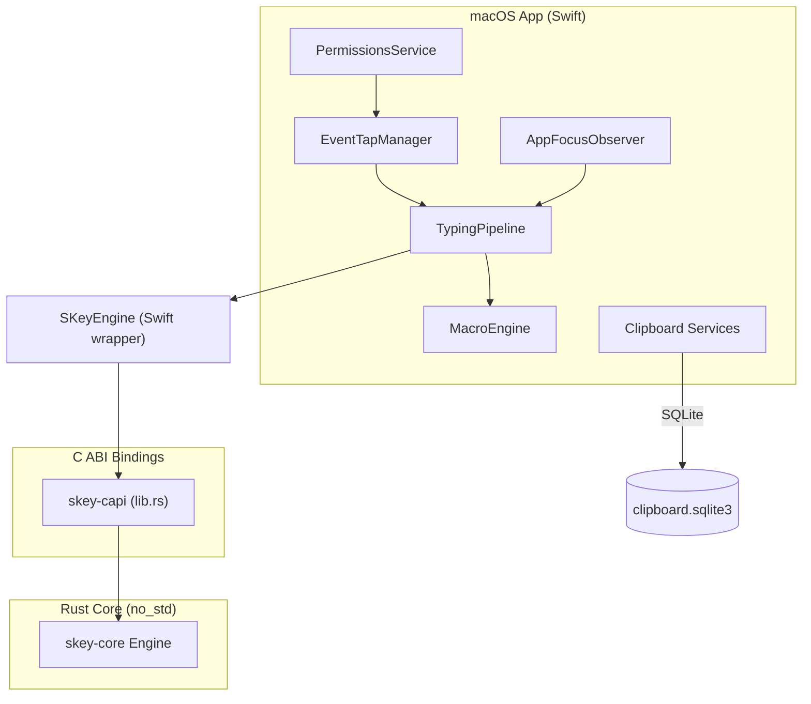
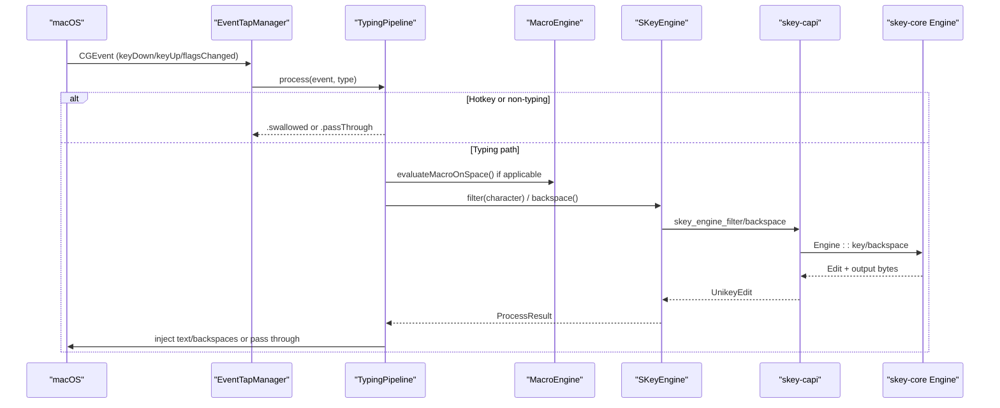
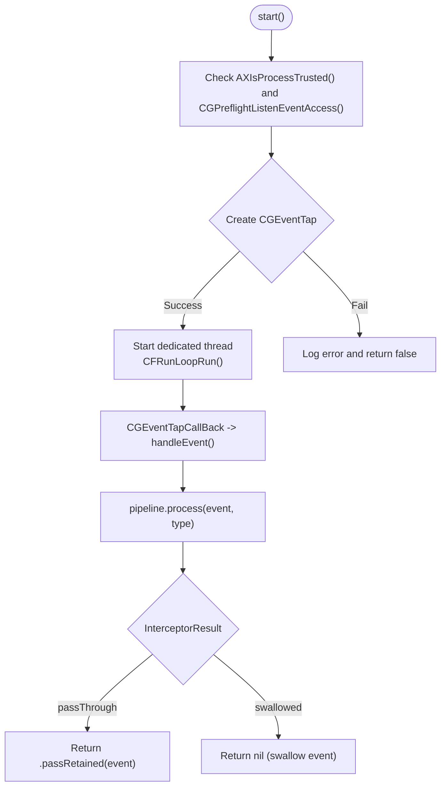
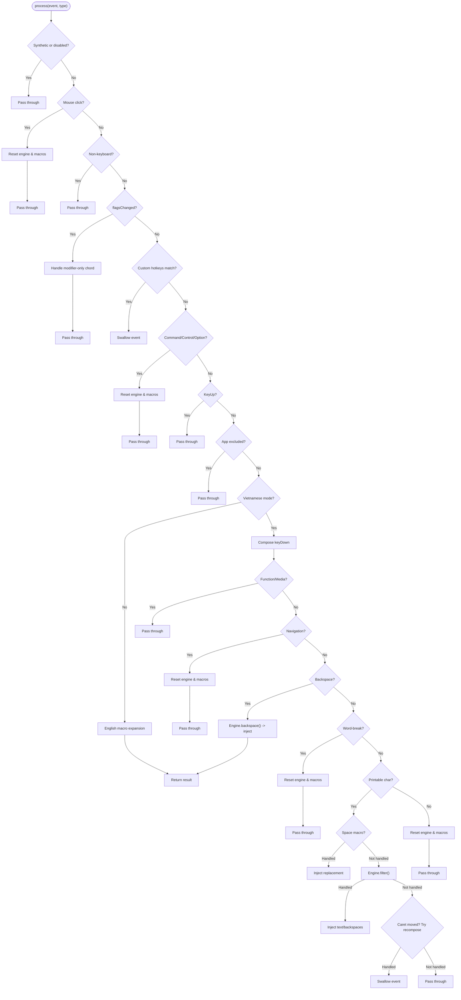
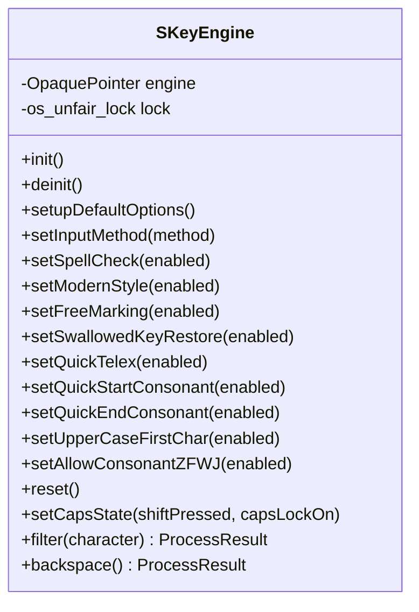
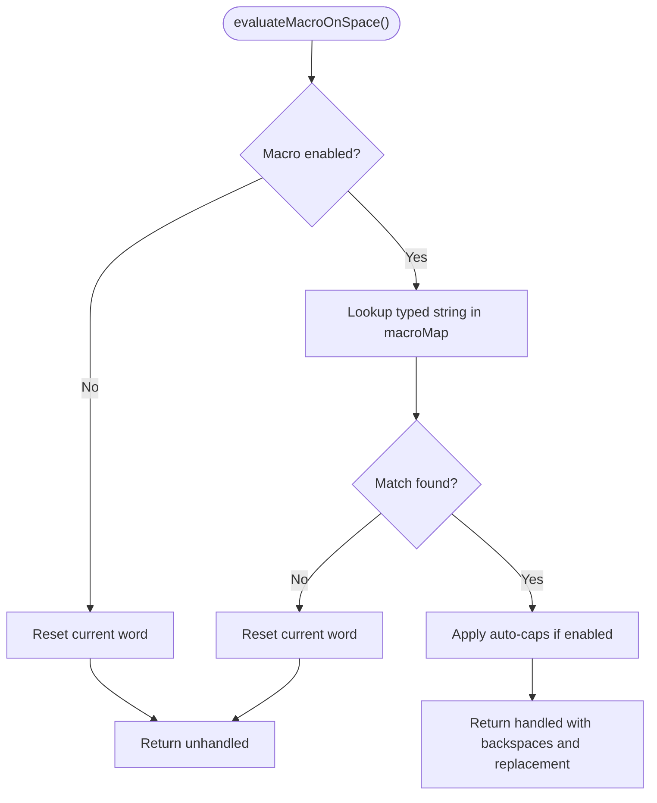
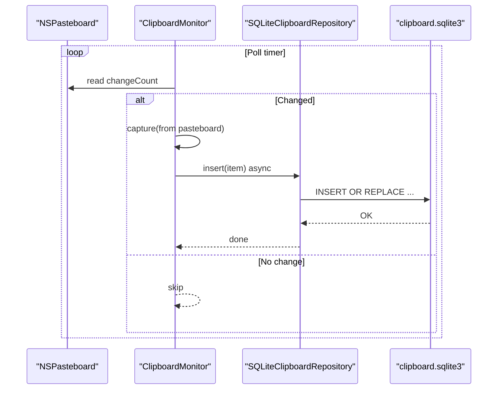
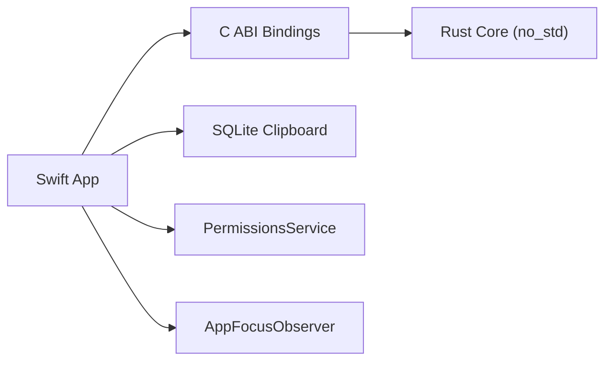

# Architecture Overview

<cite>
**Referenced Files in This Document**
- [README.md](file://README.md)
- [SKeyEngine.swift](file://macos/skey-app/Sources/Features/Keyboard/Engine/SKeyEngine.swift)
- [EventTapManager.swift](file://macos/skey-app/Sources/Features/Keyboard/EventHandling/EventTapManager.swift)
- [TypingPipeline.swift](file://macos/skey-app/Sources/Features/Keyboard/EventHandling/Pipeline/TypingPipeline.swift)
- [KeyInterceptor.swift](file://macos/skey-app/Sources/Features/Keyboard/EventHandling/Pipeline/KeyInterceptor.swift)
- [MacroEngine.swift](file://macos/skey-app/Sources/Features/Keyboard/Engine/MacroEngine.swift)
- [SQLiteClipboardRepository.swift](file://macos/skey-app/Sources/Features/Clipboard/Services/SQLiteClipboardRepository.swift)
- [PermissionsService.swift](file://macos/skey-app/Sources/Shared/Services/PermissionsService.swift)
- [AppFocusObserver.swift](file://macos/skey-app/Sources/Shared/Services/AppFocusObserver.swift)
- [skey-capi lib.rs](file://port/skey-capi/src/lib.rs)
- [skey-core lib.rs](file://port/skey-core/src/lib.rs)
- [engine/mod.rs](file://port/skey-core/src/engine/mod.rs)
- [engine/types.rs](file://port/skey-core/src/engine/types.rs)
</cite>

## Table of Contents
1. Introduction
2. Project Structure
3. Core Components
4. Architecture Overview
5. Detailed Component Analysis
6. Dependency Analysis
7. Performance Considerations
8. Troubleshooting Guide
9. Conclusion

## Introduction
SKey is a modern Vietnamese input method engine and macOS application that combines a memory-safe, high-performance Rust core with a native Swift UI and system integration layer. The design separates the no_std typing engine from macOS-specific concerns such as accessibility permissions, event capture, clipboard persistence, and UI. Communication between layers uses a stable C ABI to ensure compatibility and performance. The system employs an event-driven architecture using CoreGraphics EventTap and a chain-of-responsibility pipeline to process keystrokes with sub-microsecond latency. SQLite provides reliable, concurrent clipboard history storage.

## Project Structure
The repository organizes functionality into clear layers:
- macOS app (Swift): UI, settings, keyboard event capture, clipboard management, and system integration.
- Rust core (no_std): Typing engine, phonetics, keymaps, macros, and output handling.
- C ABI bindings: Stable interface bridging Swift and Rust.
- Legacy sources: Reference implementation for parity testing.

**Diagram sources**
- [EventTapManager.swift:15-31](file://macos/skey-app/Sources/Features/Keyboard/EventHandling/EventTapManager.swift#L15-L31)
- [TypingPipeline.swift:6-24](file://macos/skey-app/Sources/Features/Keyboard/EventHandling/Pipeline/TypingPipeline.swift#L6-L24)
- [MacroEngine.swift:14-26](file://macos/skey-app/Sources/Features/Keyboard/Engine/MacroEngine.swift#L14-L26)
- [SQLiteClipboardRepository.swift:10-55](file://macos/skey-app/Sources/Features/Clipboard/Services/SQLiteClipboardRepository.swift#L10-L55)
- [PermissionsService.swift:12-25](file://macos/skey-app/Sources/Shared/Services/PermissionsService.swift#L12-L25)
- [AppFocusObserver.swift:12-25](file://macos/skey-app/Sources/Shared/Services/AppFocusObserver.swift#L12-L25)
- [skey-capi lib.rs:349-571](file://port/skey-capi/src/lib.rs#L349-L571)
- [skey-core lib.rs:15-40](file://port/skey-core/src/lib.rs#L15-L40)

**Section sources**
- [README.md:20-31](file://README.md#L20-L31)

## Core Components
- EventTapManager: Captures global keyboard and mouse events on a dedicated thread and delegates processing to the TypingPipeline.
- TypingPipeline: Implements a multi-stage chain of responsibility for hotkeys, navigation, composing, and macro expansion.
- SKeyEngine (Swift wrapper): Provides a zero-allocation, lock-guarded interface to the Rust engine via C ABI.
- MacroEngine: In-memory shortcut expander with fast lookup and thread-safe state.
- Clipboard subsystem: Monitors pasteboard changes and persists items to SQLite with WAL mode for concurrency and crash safety.
- PermissionsService: Manages Accessibility and Input Monitoring permissions and opens system preferences when needed.
- AppFocusObserver: Tracks frontmost app and classifies it to adjust behavior (e.g., bypass or special handling).

**Section sources**
- [EventTapManager.swift:15-31](file://macos/skey-app/Sources/Features/Keyboard/EventHandling/EventTapManager.swift#L15-L31)
- [TypingPipeline.swift:6-24](file://macos/skey-app/Sources/Features/Keyboard/EventHandling/Pipeline/TypingPipeline.swift#L6-L24)
- [SKeyEngine.swift:6-30](file://macos/skey-app/Sources/Features/Keyboard/Engine/SKeyEngine.swift#L6-L30)
- [MacroEngine.swift:14-26](file://macos/skey-app/Sources/Features/Keyboard/Engine/MacroEngine.swift#L14-L26)
- [SQLiteClipboardRepository.swift:10-55](file://macos/skey-app/Sources/Features/Clipboard/Services/SQLiteClipboardRepository.swift#L10-L55)
- [PermissionsService.swift:12-25](file://macos/skey-app/Sources/Shared/Services/PermissionsService.swift#L12-L25)
- [AppFocusObserver.swift:12-25](file://macos/skey-app/Sources/Shared/Services/AppFocusObserver.swift#L12-L25)

## Architecture Overview
The system follows a layered architecture:
- Capture Layer: CoreGraphics EventTap listens to system events on a dedicated thread.
- Processing Layer: TypingPipeline applies stages (hotkeys, navigation, composing, macros) and decides whether to pass through or swallow events.
- Engine Layer: SKeyEngine calls into the Rust core via C ABI for Vietnamese typing transformations.
- Persistence Layer: ClipboardMonitor captures pasteboard changes and stores them in SQLite.
- System Integration: PermissionsService ensures required macOS permissions; AppFocusObserver informs behavior based on active app.

**Diagram sources**
- [EventTapManager.swift:81-103](file://macos/skey-app/Sources/Features/Keyboard/EventHandling/EventTapManager.swift#L81-L103)
- [TypingPipeline.swift:31-170](file://macos/skey-app/Sources/Features/Keyboard/EventHandling/Pipeline/TypingPipeline.swift#L31-L170)
- [MacroEngine.swift:71-109](file://macos/skey-app/Sources/Features/Keyboard/Engine/MacroEngine.swift#L71-L109)
- [SKeyEngine.swift:133-145](file://macos/skey-app/Sources/Features/Keyboard/Engine/SKeyEngine.swift#L133-L145)
- [skey-capi lib.rs:529-571](file://port/skey-capi/src/lib.rs#L529-L571)
- [engine/mod.rs:248-319](file://port/skey-core/src/engine/mod.rs#L248-L319)

## Detailed Component Analysis

### EventTapManager
- Purpose: Owns the lifecycle of the CoreGraphics EventTap and runs a dedicated interactive thread hosting the run loop.
- Responsibilities: Create tap, handle tap-disabled recovery, delegate event evaluation to TypingPipeline, manage language toggle state with os_unfair_lock.
- Thread model: Dedicated thread for event capture; main-thread dispatch for UI and settings updates.

**Diagram sources**
- [EventTapManager.swift:81-103](file://macos/skey-app/Sources/Features/Keyboard/EventHandling/EventTapManager.swift#L81-L103)
- [EventTapManager.swift:172-188](file://macos/skey-app/Sources/Features/Keyboard/EventHandling/EventTapManager.swift#L172-L188)

**Section sources**
- [EventTapManager.swift:15-31](file://macos/skey-app/Sources/Features/Keyboard/EventHandling/EventTapManager.swift#L15-L31)
- [EventTapManager.swift:81-122](file://macos/skey-app/Sources/Features/Keyboard/EventHandling/EventTapManager.swift#L81-L122)
- [EventTapManager.swift:140-168](file://macos/skey-app/Sources/Features/Keyboard/EventHandling/EventTapManager.swift#L140-L168)
- [EventTapManager.swift:172-188](file://macos/skey-app/Sources/Features/Keyboard/EventHandling/EventTapManager.swift#L172-L188)

### TypingPipeline (Chain of Responsibility)
- Purpose: Multi-stage event processing pipeline optimized for low latency.
- Stages:
  - Pass-through synthetic events and disabled taps.
  - Handle mouse clicks to reset composing state.
  - Filter non-keyboard events.
  - Modifier-only shortcuts and customizable hotkeys.
  - Excluded applications bypass.
  - English mode macro expansion.
  - KeyDown composing engine with fast paths for function/media keys, navigation, backspace, and structural word-break keys.
  - Smart context recomposition after caret movement.

**Diagram sources**
- [TypingPipeline.swift:31-170](file://macos/skey-app/Sources/Features/Keyboard/EventHandling/Pipeline/TypingPipeline.swift#L31-L170)
- [TypingPipeline.swift:174-280](file://macos/skey-app/Sources/Features/Keyboard/EventHandling/Pipeline/TypingPipeline.swift#L174-L280)
- [TypingPipeline.swift:284-330](file://macos/skey-app/Sources/Features/Keyboard/EventHandling/Pipeline/TypingPipeline.swift#L284-L330)

**Section sources**
- [TypingPipeline.swift:6-24](file://macos/skey-app/Sources/Features/Keyboard/EventHandling/Pipeline/TypingPipeline.swift#L6-L24)
- [TypingPipeline.swift:31-170](file://macos/skey-app/Sources/Features/Keyboard/EventHandling/Pipeline/TypingPipeline.swift#L31-L170)
- [TypingPipeline.swift:174-280](file://macos/skey-app/Sources/Features/Keyboard/EventHandling/Pipeline/TypingPipeline.swift#L174-L280)
- [TypingPipeline.swift:284-330](file://macos/skey-app/Sources/Features/Keyboard/EventHandling/Pipeline/TypingPipeline.swift#L284-L330)

### SKeyEngine (Swift wrapper)
- Purpose: High-performance wrapper around the Rust engine with zero heap allocations on the hot path and sub-microsecond latency.
- Key behaviors:
  - Lifecycle: create/free engine instance.
  - Configuration: default options, charset, input method, quick telex toggles, swallowed key restore.
  - Processing: filter character and backspace operations returning ProcessResult.
  - Threading: os_unfair_lock protects access to the opaque engine pointer.
  - Output: stack-allocated buffer for UTF-8 extraction without heap allocation.

**Diagram sources**
- [SKeyEngine.swift:6-30](file://macos/skey-app/Sources/Features/Keyboard/Engine/SKeyEngine.swift#L6-L30)
- [SKeyEngine.swift:38-129](file://macos/skey-app/Sources/Features/Keyboard/Engine/SKeyEngine.swift#L38-L129)
- [SKeyEngine.swift:133-187](file://macos/skey-app/Sources/Features/Keyboard/Engine/SKeyEngine.swift#L133-L187)

**Section sources**
- [SKeyEngine.swift:6-30](file://macos/skey-app/Sources/Features/Keyboard/Engine/SKeyEngine.swift#L6-L30)
- [SKeyEngine.swift:38-129](file://macos/skey-app/Sources/Features/Keyboard/Engine/SKeyEngine.swift#L38-L129)
- [SKeyEngine.swift:133-187](file://macos/skey-app/Sources/Features/Keyboard/Engine/SKeyEngine.swift#L133-L187)

### MacroEngine
- Purpose: O(1) in-memory macro expander for typing shortcuts.
- Behavior: Tracks current word buffer, resets on boundaries, evaluates on space, supports auto-caps transformation.
- Concurrency: Protected by os_unfair_lock_s.

**Diagram sources**
- [MacroEngine.swift:71-109](file://macos/skey-app/Sources/Features/Keyboard/Engine/MacroEngine.swift#L71-L109)

**Section sources**
- [MacroEngine.swift:14-26](file://macos/skey-app/Sources/Features/Keyboard/Engine/MacroEngine.swift#L14-L26)
- [MacroEngine.swift:40-67](file://macos/skey-app/Sources/Features/Keyboard/Engine/MacroEngine.swift#L40-L67)
- [MacroEngine.swift:71-109](file://macos/skey-app/Sources/Features/Keyboard/Engine/MacroEngine.swift#L71-L109)

### Clipboard Subsystem (SQLite)
- Purpose: Monitor pasteboard changes and persist clipboard items with concurrency and crash safety.
- Implementation:
  - ClipboardMonitor polls NSPasteboard.changeCount and captures content types (files, rich text, images, plain text).
  - SQLiteClipboardRepository uses WAL mode and NORMAL synchronous for safe concurrent reads/writes.
  - Schema includes indexes for hash and capturedAt for efficient queries and deduplication.

**Diagram sources**
- [ClipboardMonitor.swift:21-44](file://macos/skey-app/Sources/Features/Clipboard/Services/ClipboardMonitor.swift#L21-L44)
- [ClipboardMonitor.swift:46-154](file://macos/skey-app/Sources/Features/Clipboard/Services/ClipboardMonitor.swift#L46-L154)
- [SQLiteClipboardRepository.swift:10-55](file://macos/skey-app/Sources/Features/Clipboard/Services/SQLiteClipboardRepository.swift#L10-L55)
- [SQLiteClipboardRepository.swift:69-122](file://macos/skey-app/Sources/Features/Clipboard/Services/SQLiteClipboardRepository.swift#L69-L122)

**Section sources**
- [ClipboardMonitor.swift:7-19](file://macos/skey-app/Sources/Features/Clipboard/Services/ClipboardMonitor.swift#L7-L19)
- [ClipboardMonitor.swift:21-44](file://macos/skey-app/Sources/Features/Clipboard/Services/ClipboardMonitor.swift#L21-L44)
- [ClipboardMonitor.swift:46-154](file://macos/skey-app/Sources/Features/Clipboard/Services/ClipboardMonitor.swift#L46-L154)
- [SQLiteClipboardRepository.swift:10-55](file://macos/skey-app/Sources/Features/Clipboard/Services/SQLiteClipboardRepository.swift#L10-L55)
- [SQLiteClipboardRepository.swift:69-122](file://macos/skey-app/Sources/Features/Clipboard/Services/SQLiteClipboardRepository.swift#L69-L122)

### PermissionsService
- Purpose: Ensure Accessibility and Input Monitoring permissions are granted; prompt user if missing.
- Behavior: Uses AXIsProcessTrusted() and opens system preferences URLs for user action.

**Section sources**
- [PermissionsService.swift:12-25](file://macos/skey-app/Sources/Shared/Services/PermissionsService.swift#L12-L25)
- [PermissionsService.swift:27-40](file://macos/skey-app/Sources/Shared/Services/PermissionsService.swift#L27-L40)

### AppFocusObserver
- Purpose: Track frontmost app PID, bundle ID, and classify app category (developer tool, web browser, electron/chat, spotlight, native app).
- Behavior: Observes NSWorkspace notifications, caches classification results, and adjusts accessibility attributes for certain apps.

**Section sources**
- [AppFocusObserver.swift:12-25](file://macos/skey-app/Sources/Shared/Services/AppFocusObserver.swift#L12-L25)
- [AppFocusObserver.swift:29-48](file://macos/skey-app/Sources/Shared/Services/AppFocusObserver.swift#L29-L48)
- [AppFocusObserver.swift:50-91](file://macos/skey-app/Sources/Shared/Services/AppFocusObserver.swift#L50-L91)
- [AppFocusObserver.swift:114-151](file://macos/skey-app/Sources/Shared/Services/AppFocusObserver.swift#L114-L151)

## Dependency Analysis
The system exhibits clear separation of concerns:
- Swift app depends on C ABI bindings for engine access.
- C ABI bindings depend on Rust core but expose a stable, legacy-compatible interface.
- Rust core is no_std and avoids heap allocations on the hot path.
- Clipboard subsystem depends on SQLite for persistence and CryptoKit for hashing.
- Permissions and focus services provide cross-cutting system integration.

**Diagram sources**
- [skey-capi lib.rs:349-571](file://port/skey-capi/src/lib.rs#L349-L571)
- [skey-core lib.rs:15-40](file://port/skey-core/src/lib.rs#L15-L40)
- [SQLiteClipboardRepository.swift:10-55](file://macos/skey-app/Sources/Features/Clipboard/Services/SQLiteClipboardRepository.swift#L10-L55)
- [PermissionsService.swift:12-25](file://macos/skey-app/Sources/Shared/Services/PermissionsService.swift#L12-L25)
- [AppFocusObserver.swift:12-25](file://macos/skey-app/Sources/Shared/Services/AppFocusObserver.swift#L12-L25)

**Section sources**
- [skey-capi lib.rs:349-571](file://port/skey-capi/src/lib.rs#L349-L571)
- [skey-core lib.rs:15-40](file://port/skey-core/src/lib.rs#L15-L40)

## Performance Considerations
- Zero-heap hot path: SKeyEngine uses stack-allocated buffers and os_unfair_lock for minimal overhead.
- Dedicated thread: EventTap runs on a high-priority thread with CFRunLoop to avoid main thread contention.
- Fast paths: TypingPipeline short-circuits for function/media keys, navigation, and structural word-break keys.
- SQLite tuning: WAL mode and NORMAL synchronous improve concurrency and crash safety.
- Memory layout: Rust core uses compact WordInfo structures and fixed-size buffers to reduce allocations.

[No sources needed since this section provides general guidance]

## Troubleshooting Guide
- Accessibility/Input Monitoring: If EventTap fails to capture events, check permissions via PermissionsService and open system preferences.
- Tap disabled recovery: EventTapManager re-enables the tap on tapDisabledByTimeout/tapDisabledByUserInput events.
- Clipboard persistence errors: SQLiteClipboardRepository wraps sqlite3 errors and exposes them as NSError; verify WAL mode and file permissions.
- Macro expansion not triggering: Ensure MacroEngine is enabled and current word buffer is populated; check auto-caps settings.
- App exclusion bypass: Verify AppFocusObserver classification and exclusion list configuration.

**Section sources**
- [PermissionsService.swift:12-25](file://macos/skey-app/Sources/Shared/Services/PermissionsService.swift#L12-L25)
- [EventTapManager.swift:172-188](file://macos/skey-app/Sources/Features/Keyboard/EventHandling/EventTapManager.swift#L172-L188)
- [SQLiteClipboardRepository.swift:21-31](file://macos/skey-app/Sources/Features/Clipboard/Services/SQLiteClipboardRepository.swift#L21-L31)
- [MacroEngine.swift:71-109](file://macos/skey-app/Sources/Features/Keyboard/Engine/MacroEngine.swift#L71-L109)
- [AppFocusObserver.swift:29-48](file://macos/skey-app/Sources/Shared/Services/AppFocusObserver.swift#L29-L48)

## Conclusion
SKey’s architecture cleanly separates the no_std Rust typing engine from macOS-specific UI and system integration layers. The C ABI provides a stable bridge enabling Swift to leverage Rust’s memory safety and performance. An event-driven architecture using CoreGraphics EventTap and a chain-of-responsibility pipeline ensures low-latency keystroke processing. SQLite offers robust clipboard persistence with concurrency and crash safety. Cross-cutting concerns like accessibility permissions, background services, and thread safety are addressed through dedicated services and careful synchronization.

[No sources needed since this section summarizes without analyzing specific files]