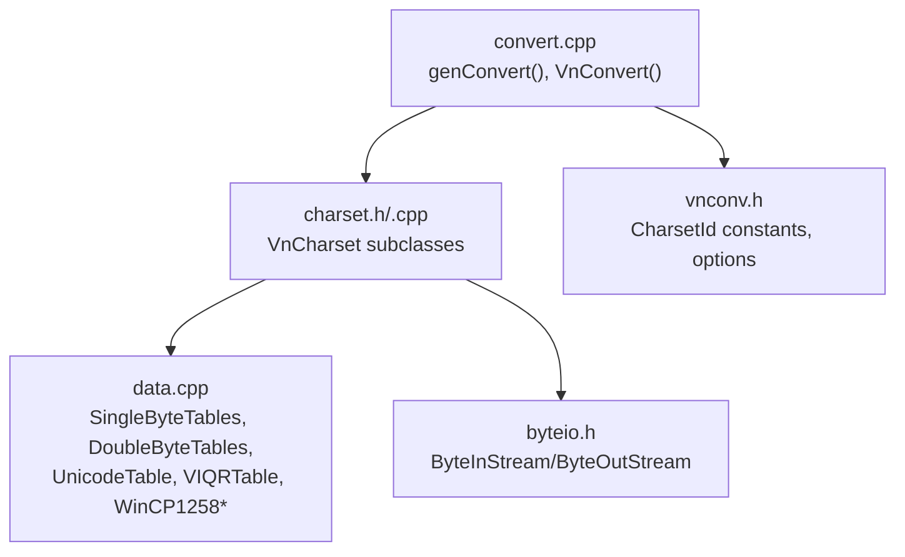
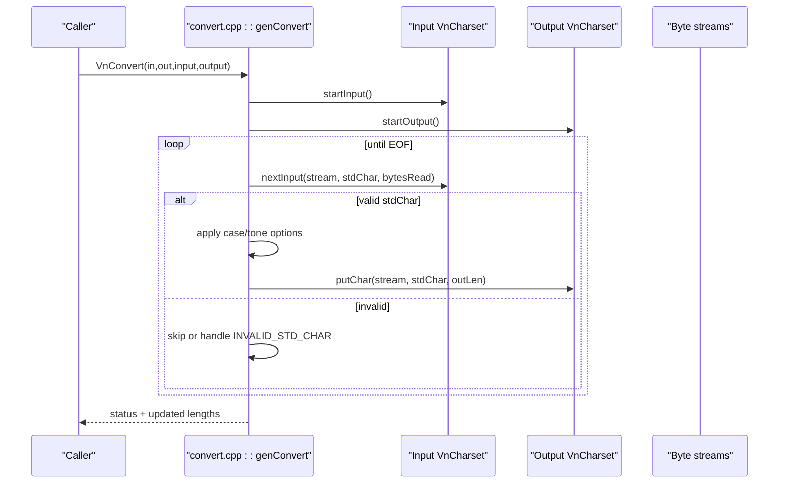
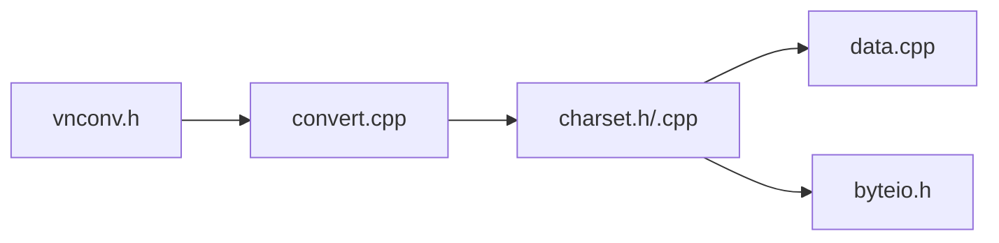

# Character Encoding System

<cite>
**Referenced Files in This Document**
- [charset.h](file://src/vnconv/charset.h)
- [charset.cpp](file://src/vnconv/charset.cpp)
- [data.h](file://src/vnconv/data.h)
- [data.cpp](file://src/vnconv/data.cpp)
- [convert.cpp](file://src/vnconv/convert.cpp)
- [vnconv.h](file://src/vnconv/vnconv.h)
- [byteio.h](file://src/byteio/byteio.h)
</cite>

## Table of Contents
1. [Introduction](#introduction)
2. [Project Structure](#project-structure)
3. [Core Components](#core-components)
4. [Architecture Overview](#architecture-overview)
5. [Detailed Component Analysis](#detailed-component-analysis)
6. [Dependency Analysis](#dependency-analysis)
7. [Performance Considerations](#performance-considerations)
8. [Troubleshooting Guide](#troubleshooting-guide)
9. [Conclusion](#conclusion)
10. [Appendices](#appendices)

## Introduction
This document explains the character encoding system that handles Vietnamese text across 21 different character sets. It covers how the charset module converts between Unicode and legacy encodings such as VNI, TCVN3, and VIQR; how output formatting generates properly encoded keystroke sequences; and how encoding detection, validation rules, and error handling are implemented. It also provides examples of conversions, performance considerations for real-time processing, and compatibility notes with the original UniKey implementation.

## Project Structure
The encoding subsystem is centered around the vnconv library:
- Charset abstraction and implementations live in charset.h/.cpp.
- Data tables mapping characters to encodings live in data.h/.cpp.
- Conversion orchestration and public APIs live in convert.cpp and vnconv.h.
- Stream I/O abstractions live in byteio.h.

**Diagram sources**
- [convert.cpp:38-106](file://src/vnconv/convert.cpp#L38-L106)
- [charset.h:87-292](file://src/vnconv/charset.h#L87-L292)
- [data.cpp:62-84](file://src/vnconv/data.cpp#L62-L84)
- [byteio.h:14-54](file://src/byteio/byteio.h#L14-L54)

**Section sources**
- [convert.cpp:38-106](file://src/vnconv/convert.cpp#L38-L106)
- [vnconv.h:40-66](file://src/vnconv/vnconv.h#L40-L66)
- [charset.h:87-292](file://src/vnconv/charset.h#L87-L292)
- [data.cpp:62-84](file://src/vnconv/data.cpp#L62-L84)
- [byteio.h:14-54](file://src/byteio/byteio.h#L14-L54)

## Core Components
- VnCharset base class defines a uniform interface for reading input bytes into a standard internal representation (StdVnChar) and writing StdVnChar back to target encodings.
- Concrete classes implement specific encodings:
  - Single-byte encodings (e.g., TCVN3, VPS, VISCII, BKHCM1, VIETWARE-F, ISC).
  - Double-byte encodings (e.g., VNI-WIN, BKHCM2, VIETWARE-X, VNI-MAC).
  - Unicode variants (UTF-16, UTF-8, decomposed/composed forms, string references like &#xNNNN;).
  - VIQR and UTF-8+VIQR hybrid.
  - Windows CP-1258.
- CVnCharsetLib manages instances of all charset objects and exposes getVnCharset by ID.
- Conversion pipeline genConvert reads from an input stream via the input charset, applies optional transformations (case, tone removal), and writes via the output charset.

**Section sources**
- [charset.h:87-292](file://src/vnconv/charset.h#L87-L292)
- [charset.cpp:46-132](file://src/vnconv/charset.cpp#L46-L132)
- [charset.cpp:143-182](file://src/vnconv/charset.cpp#L143-L182)
- [charset.cpp:195-280](file://src/vnconv/charset.cpp#L195-L280)
- [charset.cpp:285-369](file://src/vnconv/charset.cpp#L285-L369)
- [charset.cpp:387-517](file://src/vnconv/charset.cpp#L387-L517)
- [charset.cpp:600-685](file://src/vnconv/charset.cpp#L600-L685)
- [charset.cpp:706-800](file://src/vnconv/charset.cpp#L706-L800)
- [convert.cpp:38-106](file://src/vnconv/convert.cpp#L38-L106)

## Architecture Overview
The conversion architecture uses a strategy pattern: each encoding is encapsulated in a VnCharset subclass. The converter loops over input bytes, decodes them to a canonical StdVnChar, optionally transforms it, then encodes it to the target encoding.

**Diagram sources**
- [convert.cpp:38-106](file://src/vnconv/convert.cpp#L38-L106)
- [charset.h:87-106](file://src/vnconv/charset.h#L87-L106)

**Section sources**
- [convert.cpp:38-106](file://src/vnconv/convert.cpp#L38-L106)
- [charset.h:87-106](file://src/vnconv/charset.h#L87-L106)

## Detailed Component Analysis

### Charset Abstraction and Base Class
- VnCharset defines:
  - nextInput(ByteInStream&, StdVnChar&, int&) to decode one logical character.
  - putChar(ByteOutStream&, StdVnChar, int&) to encode one logical character.
  - elementSize() hinting at per-character width for stream buffering.
- Special sentinel values include INVALID_STD_CHAR and VnStdCharOffset used to distinguish mapped vs. pass-through characters.

**Section sources**
- [charset.h:87-106](file://src/vnconv/charset.h#L87-L106)
- [charset.h:79-85](file://src/vnconv/charset.h#L79-L85)

### Single-Byte Encodings (TCVN3, VPS, VISCII, BKHCM1, VIETWARE-F, ISC)
- SingleByteCharset maps single bytes to StdVnChar indices using a lookup table built from SingleByteTables.
- nextInput reads one byte and either maps it to a Vietnamese character index or passes through ASCII.
- putChar writes the corresponding byte or substitutes a padding character when the target charset lacks a glyph.

Complexity: O(1) per character due to direct table lookups.

**Section sources**
- [charset.cpp:79-132](file://src/vnconv/charset.cpp#L79-L132)
- [data.cpp:97-243](file://src/vnconv/data.cpp#L97-L243)

### Double-Byte Encodings (VNI-WIN, BKHCM2, VIETWARE-X, VNI-MAC)
- DoubleByteCharset handles two-byte sequences where the low byte may be a base character and the high byte a tone mark or modifier.
- nextInput peeks ahead to detect double-byte sequences and maps to StdVnChar accordingly.
- putChar emits either one or two bytes depending on whether the character is represented as a single byte or a two-byte pair.

Complexity: O(log N) per character due to binary search over sorted tables, where N is TOTAL_VNCHARS.

**Section sources**
- [charset.cpp:600-685](file://src/vnconv/charset.cpp#L600-L685)
- [data.cpp:245-342](file://src/vnconv/data.cpp#L245-L342)

### Unicode Variants
- UnicodeCharset (UTF-16):
  - nextInput reads a 16-bit code unit and maps to StdVnChar via a sorted array; putChar writes the corresponding Unicode code unit.
- UnicodeUTF8Charset:
  - nextInput parses 1–3 byte UTF-8 sequences, validates continuation bytes, and maps to StdVnChar; putChar emits 1–3 bytes based on code point ranges.
- UnicodeRefCharset and UnicodeHexCharset:
  - Parse HTML-style numeric character references (&#NNNN; and &#xNNNN;) and emit escaped sequences respectively.
- UnicodeCompCharset:
  - Handles composed/decomposed Unicode forms by maintaining a combined sorted index of both forms and emitting appropriate sequences.

Complexity:
- UTF-16: O(log N) per character due to bsearch.
- UTF-8: O(1) per byte with constant overhead per character.
- References: O(k) per reference where k is number of digits.

**Section sources**
- [charset.cpp:143-182](file://src/vnconv/charset.cpp#L143-L182)
- [charset.cpp:195-280](file://src/vnconv/charset.cpp#L195-L280)
- [charset.cpp:285-369](file://src/vnconv/charset.cpp#L285-L369)
- [charset.cpp:387-517](file://src/vnconv/charset.cpp#L387-L517)

### VIQR and UTF-8+VIQR Hybrid
- VIQRCharset implements VIQR parsing with tone marks and special escape behavior:
  - Recognizes tone markers and combining diacritics.
  - Supports smart mode and escape-all modes controlled by options.
  - Tracks word boundaries and suspicious sequences to improve robustness.
- UTF8VIQRCharset composes UTF-8 decoding with VIQR semantics for mixed content.

Complexity: Near O(1) per character with small lookahead and state checks.

**Section sources**
- [charset.cpp:706-800](file://src/vnconv/charset.cpp#L706-L800)
- [charset.h:225-259](file://src/vnconv/charset.h#L225-L259)

### Windows CP-1258
- WinCP1258Charset supports Windows Code Page 1258 with mappings for Vietnamese characters and Western symbols.
- Uses precomputed tables for both composed and additional precomposed forms.

**Section sources**
- [charset.h:193-204](file://src/vnconv/charset.h#L193-L204)
- [data.cpp:344-394](file://src/vnconv/data.cpp#L344-L394)

### Charset Factory and Options
- CVnCharsetLib constructs and caches charset instances and exposes getVnCharset(int).
- Global options control behavior like case conversion, tone removal, and VIQR escaping.

**Section sources**
- [charset.h:263-284](file://src/vnconv/charset.h#L263-L284)
- [charset.cpp:1004-1065](file://src/vnconv/charset.cpp#L1004-L1065)
- [vnconv.h:106-119](file://src/vnconv/vnconv.h#L106-L119)

### Conversion Pipeline and Output Formatting
- genConvert orchestrates the conversion loop:
  - Reads characters via input charset.
  - Applies options (toUpper/toLower/removeTone).
  - Writes via output charset.
- VnConvert wraps genConvert with string buffers and updates lengths.
- File conversion helpers write BOM for Unicode outputs and manage temporary files safely.

Output formatting specifics:
- For HTML-like references, UnicodeRefCharset emits decimal numeric references; UnicodeHexCharset emits hexadecimal ones.
- For UTF-8, variable-length encoding is emitted according to Unicode ranges.
- For single/double-byte legacy encodings, missing glyphs are replaced with a configurable pad character.

**Section sources**
- [convert.cpp:38-106](file://src/vnconv/convert.cpp#L38-L106)
- [convert.cpp:116-236](file://src/vnconv/convert.cpp#L116-L236)
- [charset.cpp:387-517](file://src/vnconv/charset.cpp#L387-L517)
- [charset.cpp:285-369](file://src/vnconv/charset.cpp#L285-L369)

### Encoding Detection and Validation Rules
- Input validation:
  - UTF-8 parser rejects malformed sequences by setting INVALID_STD_CHAR and returning early.
  - Double-byte parsers validate second bytes before forming multi-byte characters.
  - Reference parsers require proper delimiters and digit counts.
- Output validation:
  - When a character cannot be represented in the target charset, a pad character is emitted instead of corrupting the stream.
- Special cases:
  - Start/end quotes and ellipsis have dedicated mappings to ensure correct symbol rendering.

**Section sources**
- [charset.cpp:285-369](file://src/vnconv/charset.cpp#L285-L369)
- [charset.cpp:600-685](file://src/vnconv/charset.cpp#L600-L685)
- [charset.cpp:387-517](file://src/vnconv/charset.cpp#L387-L517)
- [data.h:5-11](file://src/vnconv/data.h#L5-L11)

### Examples of Charset Conversions
- Convert from TCVN3 to UTF-8:
  - Use VnConvert with inCharset=TCVN3, outCharset=UTF-8.
- Convert from VNI-WIN to Unicode (UTF-16):
  - Use VnConvert with inCharset=VNI-WIN, outCharset=UNICODE.
- Convert from VIQR to UTF-8:
  - Use VnConvert with inCharset=VIQR, outCharset=UTF-8.
- Convert from Unicode to Windows CP-1258:
  - Use VnConvert with inCharset=UNICODE, outCharset=WINCP-1258.

These conversions rely on the appropriate charset implementations and data tables described above.

**Section sources**
- [vnconv.h:40-66](file://src/vnconv/vnconv.h#L40-L66)
- [convert.cpp:81-106](file://src/vnconv/convert.cpp#L81-L106)
- [data.cpp:62-84](file://src/vnconv/data.cpp#L62-L84)

## Dependency Analysis
The core dependencies form a layered structure:
- convert.cpp depends on charset.h/.cpp for encoding logic and byteio.h for I/O.
- charset.cpp depends on data.cpp for mapping tables and byteio.h for streams.
- vnconv.h defines the public API and charset IDs used throughout.

**Diagram sources**
- [vnconv.h:40-66](file://src/vnconv/vnconv.h#L40-L66)
- [convert.cpp:38-106](file://src/vnconv/convert.cpp#L38-L106)
- [charset.h:87-292](file://src/vnconv/charset.h#L87-L292)
- [data.cpp:62-84](file://src/vnconv/data.cpp#L62-L84)
- [byteio.h:14-54](file://src/byteio/byteio.h#L14-L54)

**Section sources**
- [vnconv.h:40-66](file://src/vnconv/vnconv.h#L40-L66)
- [convert.cpp:38-106](file://src/vnconv/convert.cpp#L38-L106)
- [charset.h:87-292](file://src/vnconv/charset.h#L87-L292)
- [data.cpp:62-84](file://src/vnconv/data.cpp#L62-L84)
- [byteio.h:14-54](file://src/byteio/byteio.h#L14-L54)

## Performance Considerations
- Time complexity:
  - Single-byte conversions: O(1) per character via direct table lookup.
  - Double-byte and Unicode conversions: O(log N) per character due to binary search over sorted arrays of size TOTAL_VNCHARS.
  - UTF-8 parsing: O(1) per byte with minimal branching.
- Memory usage:
  - Tables are static and shared; per-conversion memory is limited to stream buffers.
- Real-time processing:
  - The streaming design avoids loading entire documents into memory.
  - Element size hints allow efficient buffering in ByteInStream/ByteOutStream.
- Optimization opportunities:
  - Replace binary searches with hash maps if latency is critical.
  - Precompute frequently used mappings for hot paths.
  - Minimize option checks inside tight loops by caching effective flags.

[No sources needed since this section provides general guidance]

## Troubleshooting Guide
Common issues and strategies:
- Invalid UTF-8 sequences:
  - Detected during parsing; INVALID_STD_CHAR signals malformed input. Ensure input is well-formed or sanitize before conversion.
- Missing glyphs in target charset:
  - Characters not representable are replaced with a pad character. Verify target charset coverage or adjust output format (e.g., use Unicode).
- VIQR ambiguity:
  - Smart mode and escape-all mode affect interpretation. Adjust options to match expected input style.
- File conversion errors:
  - Errors include invalid charset, file open/write failures, and out-of-memory conditions. Use VnConvErrMsg to map error codes to messages.

**Section sources**
- [convert.cpp:238-253](file://src/vnconv/convert.cpp#L238-L253)
- [charset.cpp:285-369](file://src/vnconv/charset.cpp#L285-L369)
- [charset.cpp:600-685](file://src/vnconv/charset.cpp#L600-L685)
- [charset.cpp:706-800](file://src/vnconv/charset.cpp#L706-L800)

## Conclusion
The vnconv charset system provides a robust, extensible framework for converting Vietnamese text across 21 encodings. Its layered architecture separates concerns between I/O, encoding logic, and data tables, enabling reliable conversions with clear validation and error handling. The design supports real-time processing through streaming and offers multiple output formats suitable for diverse applications. Compatibility with the original UniKey implementation is maintained via consistent charset IDs, options, and conversion behaviors.

[No sources needed since this section summarizes without analyzing specific files]

## Appendices

### Supported Charsets and IDs
- Unicode family: UNICODE, UTF-8, UNIREF, UNIREF_HEX, UNIDECOMPOSED, UNI_CSTRING, VNSTANDARD.
- Legacy single-byte: TCVN3, VPS, VISCII, BKHCM1, VIETWARE-F, ISC.
- Legacy double-byte: VNI-WIN, BKHCM2, VIETWARE-X, VNI-MAC.
- Platform-specific: WINCP-1258.
- Text-based: VIQR, UTF8VIQR.

**Section sources**
- [vnconv.h:40-66](file://src/vnconv/vnconv.h#L40-L66)
- [data.cpp:62-84](file://src/vnconv/data.cpp#L62-L84)

### Key Data Structures
- StdVnChar: Internal canonical representation offset by VnStdCharOffset for mapped characters.
- Mapping tables:
  - SingleByteTables: Maps single-byte encodings to base characters and symbols.
  - DoubleByteTables: Maps double-byte encodings to composed or base+modifier pairs.
  - UnicodeTable: Maps to Unicode code points.
  - VIQRTable: Maps to VIQR sequences.
  - WinCP1258/WinCP1258Pre: Windows CP-1258 mappings.

**Section sources**
- [charset.h:79-85](file://src/vnconv/charset.h#L79-L85)
- [data.cpp:97-243](file://src/vnconv/data.cpp#L97-L243)
- [data.cpp:245-342](file://src/vnconv/data.cpp#L245-L342)
- [data.cpp:396-420](file://src/vnconv/data.cpp#L396-L420)
- [data.cpp:442-465](file://src/vnconv/data.cpp#L442-L465)
- [data.cpp:344-394](file://src/vnconv/data.cpp#L344-L394)

### Conversion Flow Details
- Case and tone options:
  - toUpper/toLower transform StdVnChar before encoding.
  - removeTone reduces characters to root forms using predefined mappings.
- Output stream handling:
  - StringBOStream tracks written bytes; FileBOStream writes to disk.
  - BOM is written for Unicode outputs when converting files.

**Section sources**
- [convert.cpp:38-106](file://src/vnconv/convert.cpp#L38-L106)
- [convert.cpp:214-236](file://src/vnconv/convert.cpp#L214-L236)
- [byteio.h:143-191](file://src/byteio/byteio.h#L143-L191)