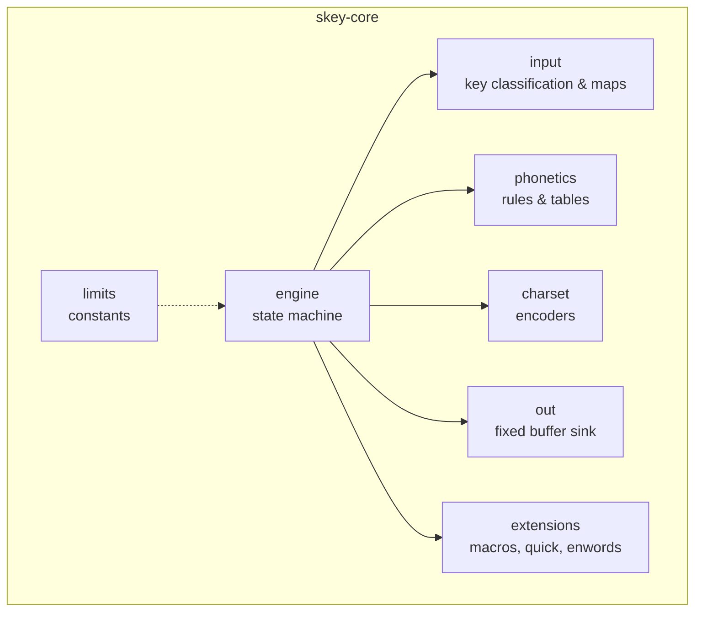
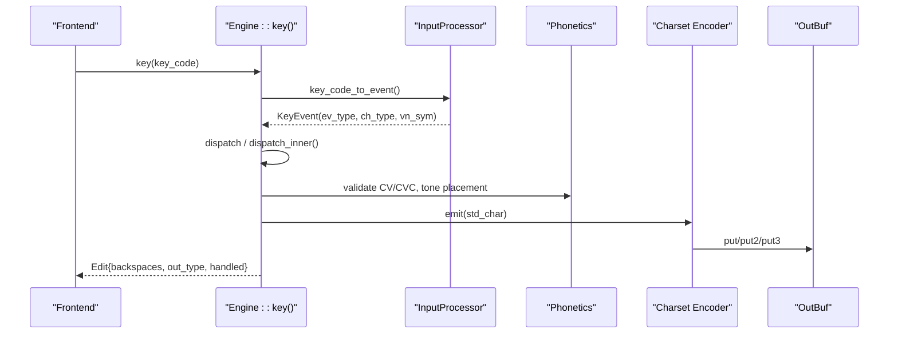
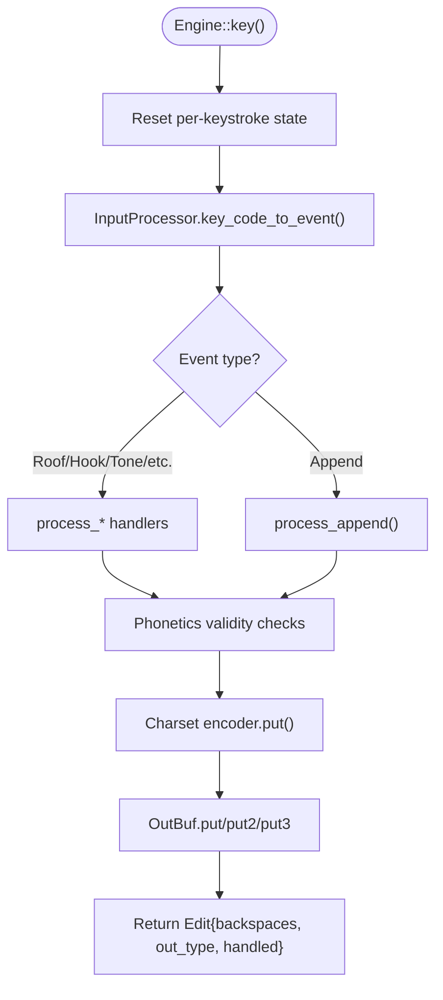
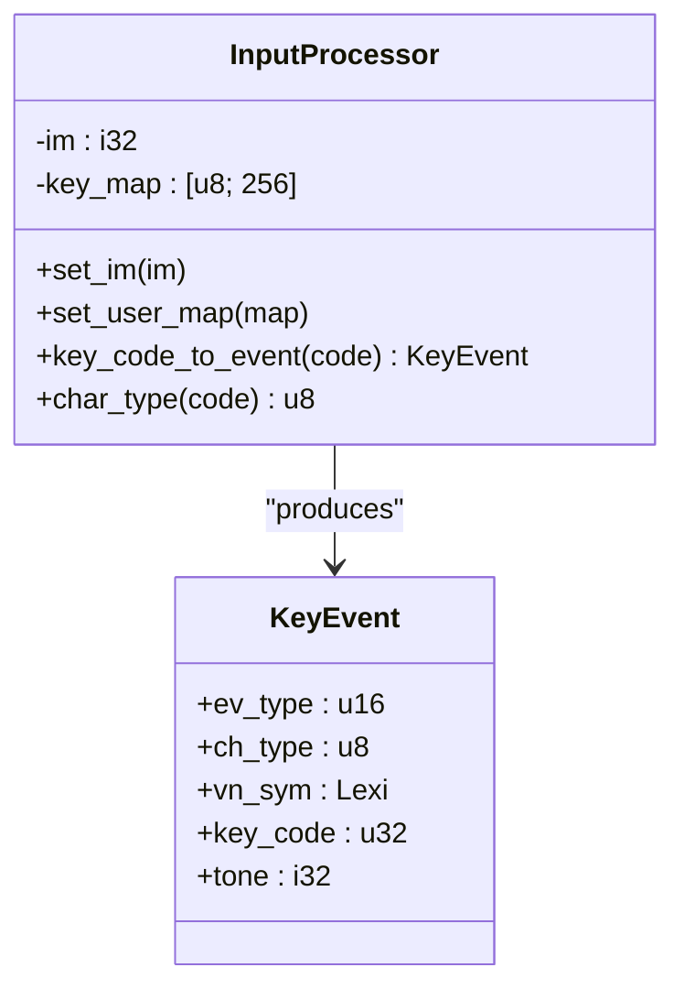
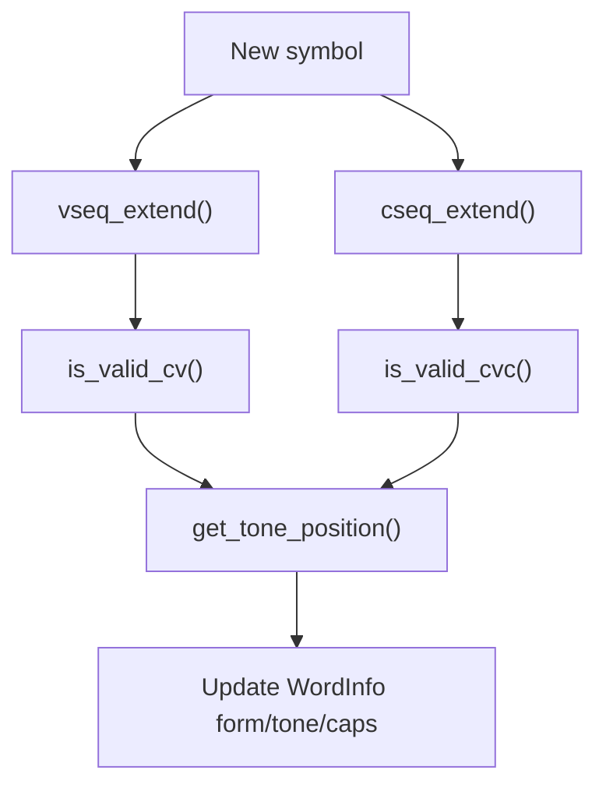
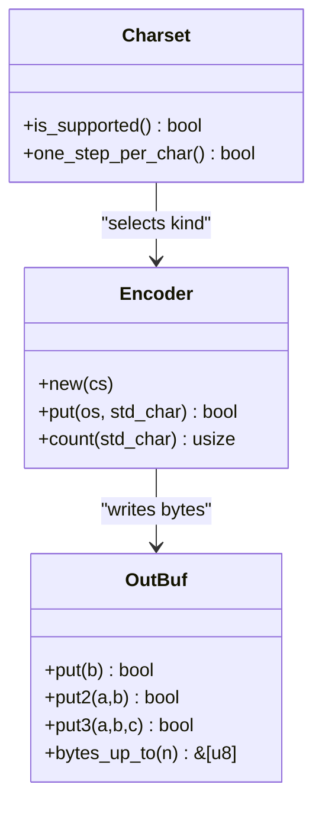
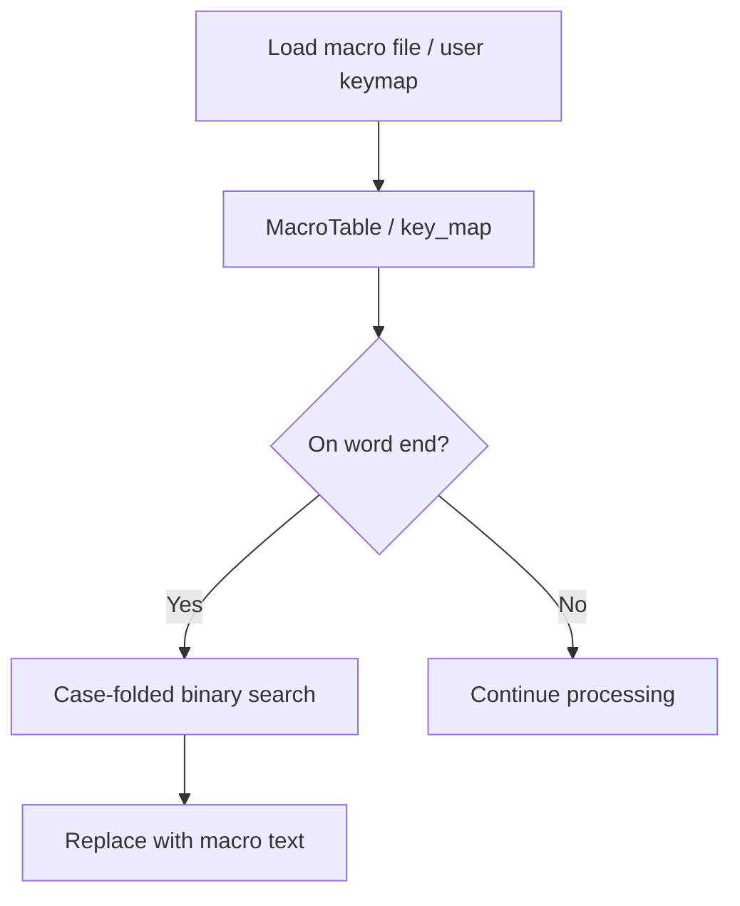
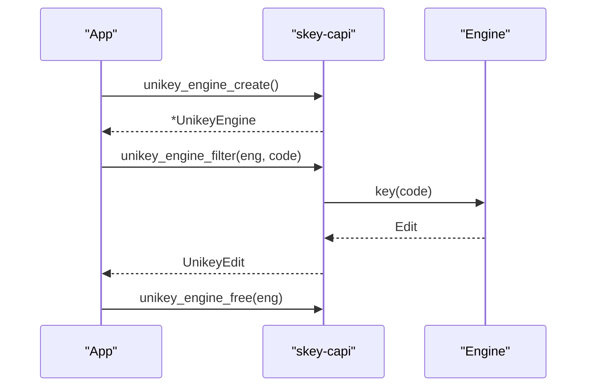
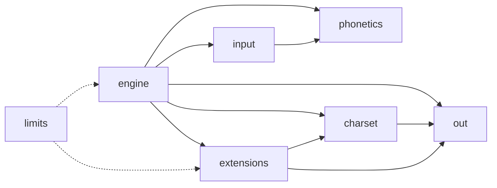

# Core Engine Architecture

<cite>
**Referenced Files in This Document**
- [lib.rs](file://port/skey-core/src/lib.rs)
- [README.md](file://port/README.md)
- [engine/mod.rs](file://port/skey-core/src/engine/mod.rs)
- [engine/types.rs](file://port/skey-core/src/engine/types.rs)
- [input/mod.rs](file://port/skey-core/src/input/mod.rs)
- [charset/mod.rs](file://port/skey-core/src/charset/mod.rs)
- [phonetics/mod.rs](file://port/skey-core/src/phonetics/mod.rs)
- [extensions/mod.rs](file://port/skey-core/src/extensions/mod.rs)
- [extensions/macros.rs](file://port/skey-core/src/extensions/macros.rs)
- [extensions/quick.rs](file://port/skey-core/src/extensions/quick.rs)
- [out.rs](file://port/skey-core/src/out.rs)
- [limits.rs](file://port/skey-core/src/limits.rs)
- [skey-capi/lib.rs](file://port/skey-capi/src/lib.rs)
</cite>

## Table of Contents
1. [Introduction](#introduction)
2. [Project Structure](#project-structure)
3. [Core Components](#core-components)
4. [Architecture Overview](#architecture-overview)
5. [Detailed Component Analysis](#detailed-component-analysis)
6. [Dependency Analysis](#dependency-analysis)
7. [Performance Considerations](#performance-considerations)
8. [Troubleshooting Guide](#troubleshooting-guide)
9. [Conclusion](#conclusion)

## Introduction
This document describes the Rust core engine that powers Vietnamese typing for SKey. It is a no_std, zero-allocation keystroke path port of the original C++ UniKey engine, designed to achieve byte-for-byte parity with the reference implementation and then optimize further. The engine is organized into four primary domain packages—charset, engine, extensions, and input—plus phonetics rules and output sinks. It supports Telex, VNI, VIQR, user keymaps, macros, quick shortcuts, and multiple output charsets while maintaining memory safety and deterministic behavior.

## Project Structure
The skey-core crate exposes a minimal public surface and organizes functionality by domain:
- phonetics: linguistic rules, symbols, transition tables
- engine: state machine, dispatch, append, transform, shortcuts
- input: key classification and per-method maps (Telex, VNI, VIQR, MsVi, Simple Telex, user map)
- charset: 21 output charsets with encoders and decoders
- extensions: swallowed-word restoration, quick shortcuts, macro table, user keymap loader
- out: fixed-capacity output sink and counters
- limits: allocator-free constants and folding helpers

**Diagram sources**
- [lib.rs:15-20](file://port/skey-core/src/lib.rs#L15-L20)
- [engine/mod.rs:18-70](file://port/skey-core/src/engine/mod.rs#L18-L70)
- [input/mod.rs:72-87](file://port/skey-core/src/input/mod.rs#L72-L87)
- [charset/mod.rs:52-101](file://port/skey-core/src/charset/mod.rs#L52-L101)
- [extensions/mod.rs:1-9](file://port/skey-core/src/extensions/mod.rs#L1-L9)
- [out.rs:60-78](file://port/skey-core/src/out.rs#L60-L78)
- [limits.rs:1-36](file://port/skey-core/src/limits.rs#L1-L36)

**Section sources**
- [lib.rs:1-47](file://port/skey-core/src/lib.rs#L1-L47)
- [README.md:400-424](file://port/README.md#L400-L424)

## Core Components
- Engine: owns the typed word buffer, keystroke buffers, options, input method, charset, optional macro store, and per-keystroke output state. Provides key(), backspace(), restore_key_strokes(), set_input_method(), set_charset(), reset().
- InputProcessor: classifies keys and maps them to events based on the active input method (Telex, VNI, VIQR, MsVi, Simple Telex, user).
- Charset: selects an encoder and emits bytes to a Sink; includes UTF-8/UTF-16, VN standard, decomposed, references, CP1258, single/double-byte sets, and VIQR with escape suppression.
- Phonetics: provides Lexi/VSeq/CSeq types, validity rules, and transition tables used by the engine’s spelling logic.
- Extensions: optional features gated behind alloc: macros (table load/lookup), quick shortcuts (telex doubles, onset/coda), swallowed-key restoration, and user keymap loading.
- Output: OutBuf implements a fixed-size sink with put/put2/put3 fast paths and a Counter sink for counting without storing.

**Section sources**
- [engine/mod.rs:18-70](file://port/skey-core/src/engine/mod.rs#L18-L70)
- [engine/types.rs:24-83](file://port/skey-core/src/engine/types.rs#L24-L83)
- [input/mod.rs:72-87](file://port/skey-core/src/input/mod.rs#L72-L87)
- [charset/mod.rs:52-101](file://port/skey-core/src/charset/mod.rs#L52-L101)
- [phonetics/mod.rs:1-16](file://port/skey-core/src/phonetics/mod.rs#L1-L16)
- [extensions/mod.rs:1-9](file://port/skey-core/src/extensions/mod.rs#L1-L9)
- [out.rs:60-78](file://port/skey-core/src/out.rs#L60-L78)

## Architecture Overview
The keystroke path is allocation-free and uses fixed-size buffers. Each key press flows through classification, event dispatch, phonetic validation, composition, and encoding. Optional features like macros and user keymaps are loaded once and do not run on the hot path.

**Diagram sources**
- [engine/mod.rs:248-319](file://port/skey-core/src/engine/mod.rs#L248-L319)
- [input/mod.rs:162-192](file://port/skey-core/src/input/mod.rs#L162-L192)
- [charset/mod.rs:361-390](file://port/skey-core/src/charset/mod.rs#L361-L390)
- [out.rs:80-126](file://port/skey-core/src/out.rs#L80-L126)

## Detailed Component Analysis

### Engine State Machine and Keystroke Path
- Buffer layout: WordInfo packed to minimize footprint; parallel arrays for keys and conversion flags keep per-keystroke work constant-time.
- Dispatch: jump-table match on event type routes to roof/hook/tone/telex_w/map_char/esc_char or append.
- Backspace: moves tone or deletes according to form and offsets; restores stroke buffer when needed.
- Restore: replays stored key strokes to reconstruct raw input; carefully models original size semantics.

**Diagram sources**
- [engine/mod.rs:227-319](file://port/skey-core/src/engine/mod.rs#L227-L319)
- [out.rs:80-126](file://port/skey-core/src/out.rs#L80-L126)

**Section sources**
- [engine/mod.rs:18-70](file://port/skey-core/src/engine/mod.rs#L18-L70)
- [engine/mod.rs:227-319](file://port/skey-core/src/engine/mod.rs#L227-L319)
- [engine/types.rs:107-222](file://port/skey-core/src/engine/types.rs#L107-L222)

### Input Methods and Key Classification
- Built-in methods: Telex, VNI, VIQR, MsVi, Simple Telex; plus user-defined map.
- Mapping: 256-entry compact action table; character mappings encoded as EV_COUNT + lexi index.
- Event creation: ISO code points mapped via Lexi; non-Vietnamese vs Vietnamese classification drives spell-checking and shortcut decisions.

**Diagram sources**
- [input/mod.rs:72-87](file://port/skey-core/src/input/mod.rs#L72-L87)
- [input/mod.rs:150-192](file://port/skey-core/src/input/mod.rs#L150-L192)

**Section sources**
- [input/mod.rs:7-49](file://port/skey-core/src/input/mod.rs#L7-L49)
- [input/mod.rs:72-87](file://port/skey-core/src/input/mod.rs#L72-L87)
- [input/mod.rs:150-192](file://port/skey-core/src/input/mod.rs#L150-L192)

### Character Composition and Phonetics
- Lexi/VSeq/CSeq encode letters, vowel sequences, and consonant sequences with compile-time constraints.
- Validity rules enforce Vietnamese phonotactics during composition.
- Transition tables replace searches to eliminate dynamic lookups on the hot path.

**Diagram sources**
- [phonetics/mod.rs:1-16](file://port/skey-core/src/phonetics/mod.rs#L1-L16)
- [engine/types.rs:107-222](file://port/skey-core/src/engine/types.rs#L107-L222)

**Section sources**
- [phonetics/mod.rs:1-16](file://port/skey-core/src/phonetics/mod.rs#L1-L16)
- [engine/types.rs:107-222](file://port/skey-core/src/engine/types.rs#L107-L222)

### Output Charsets and Encoding
- Encoders cover Unicode, UTF-8, VN Standard, decomposed, references, CP1258, single/double-byte sets, and VIQR with URL/email-aware escaping.
- Counting sink avoids allocations while computing backspace steps.
- One-step-per-character optimization for certain charsets simplifies backspace arithmetic.

**Diagram sources**
- [charset/mod.rs:52-101](file://port/skey-core/src/charset/mod.rs#L52-L101)
- [charset/mod.rs:361-390](file://port/skey-core/src/charset/mod.rs#L361-L390)
- [out.rs:60-78](file://port/skey-core/src/out.rs#L60-L78)
- [out.rs:80-126](file://port/skey-core/src/out.rs#L80-L126)

**Section sources**
- [charset/mod.rs:52-101](file://port/skey-core/src/charset/mod.rs#L52-L101)
- [charset/mod.rs:361-390](file://port/skey-core/src/charset/mod.rs#L361-L390)
- [out.rs:60-78](file://port/skey-core/src/out.rs#L60-L78)

### Extension System: Macros, Quick Shortcuts, User Keymaps
- Macros: arena-backed table with stable case-folded ordering; load/save formats preserve parity; lookup runs off the hot path.
- Quick shortcuts: doubled consonants, onset/coda expansions applied at appropriate times to avoid breaking valid words.
- User keymaps: replace built-in mapping with a 256-byte table; feature-gated behind alloc.

**Diagram sources**
- [extensions/macros.rs:54-107](file://port/skey-core/src/extensions/macros.rs#L54-L107)
- [extensions/macros.rs:190-238](file://port/skey-core/src/extensions/macros.rs#L190-L238)
- [extensions/quick.rs:10-82](file://port/skey-core/src/extensions/quick.rs#L10-L82)
- [input/mod.rs:122-129](file://port/skey-core/src/input/mod.rs#L122-L129)

**Section sources**
- [extensions/mod.rs:1-9](file://port/skey-core/src/extensions/mod.rs#L1-L9)
- [extensions/macros.rs:54-107](file://port/skey-core/src/extensions/macros.rs#L54-L107)
- [extensions/quick.rs:10-82](file://port/skey-core/src/extensions/quick.rs#L10-L82)
- [input/mod.rs:122-129](file://port/skey-core/src/input/mod.rs#L122-L129)

### C ABI and Context API
- Legacy global-style API preserved for existing front ends.
- New context API exposes create/filter/backspace/restore/free over an opaque handle, enabling multi-instance usage and thread safety.

**Diagram sources**
- [skey-capi/lib.rs:380-424](file://port/skey-capi/src/lib.rs#L380-L424)

**Section sources**
- [skey-capi/lib.rs:380-424](file://port/skey-capi/src/lib.rs#L380-L424)

## Dependency Analysis
- Engine depends on input, phonetics, charset, out, and optionally extensions.
- Input depends on phonetics tables for classification and mapping.
- Charset depends on phonetics tables for conversions and on out for writing.
- Extensions depend on charset decoding and out for serialization.
- Limits provides allocator-free constants consumed across modules.

**Diagram sources**
- [lib.rs:15-20](file://port/skey-core/src/lib.rs#L15-L20)
- [engine/mod.rs:18-70](file://port/skey-core/src/engine/mod.rs#L18-L70)
- [input/mod.rs:72-87](file://port/skey-core/src/input/mod.rs#L72-L87)
- [charset/mod.rs:52-101](file://port/skey-core/src/charset/mod.rs#L52-L101)
- [extensions/mod.rs:1-9](file://port/skey-core/src/extensions/mod.rs#L1-L9)
- [out.rs:60-78](file://port/skey-core/src/out.rs#L60-L78)
- [limits.rs:1-36](file://port/skey-core/src/limits.rs#L1-L36)

**Section sources**
- [lib.rs:15-20](file://port/skey-core/src/lib.rs#L15-L20)

## Performance Considerations
- Zero-allocation keystroke path: fixed buffers, no heap usage during typing.
- Transition tables replace searches; one array load per step.
- Compact WordInfo reduces memory footprint and improves cache locality.
- Fast multi-byte writes reduce bounds checks.
- Optional alloc features (macros, keymaps, charset decoders) are off the hot path.
- Measured improvements include faster per-keystroke timing and reduced memory usage compared to the original.

[No sources needed since this section provides general guidance]

## Troubleshooting Guide
- Parity verification: use the oracle and difftest harnesses to compare keystroke-by-keystroke traces between C++ and Rust implementations.
- Common divergence causes:
  - Incorrect input method selection or user keymap content.
  - Macro table version mismatch or malformed entries.
  - Charset-specific state (e.g., VIQR escape window) not reset properly.
- Diagnostics:
  - Inspect Edit.backspaces and Engine.output_len() to verify expected edits.
  - Use the context API harness to drive two engines concurrently and detect cross-instance state leaks.

**Section sources**
- [README.md:23-59](file://port/README.md#L23-L59)
- [skey-capi/lib.rs:380-424](file://port/skey-capi/src/lib.rs#L380-L424)

## Conclusion
The Rust core engine delivers a safe, no_std, zero-allocation keystroke path that faithfully reproduces the C++ UniKey behavior while enabling modern engineering practices: modular domains, explicit state, and robust testing. Its extension system adds powerful capabilities like macros, quick shortcuts, and user keymaps without compromising performance or parity. The result is a high-performance, embeddable engine suitable for desktop, CLI, WASM, and embedded contexts.