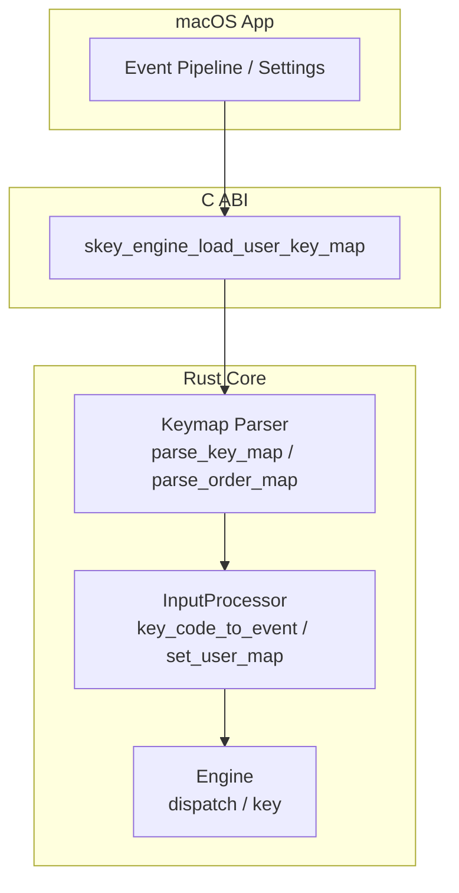
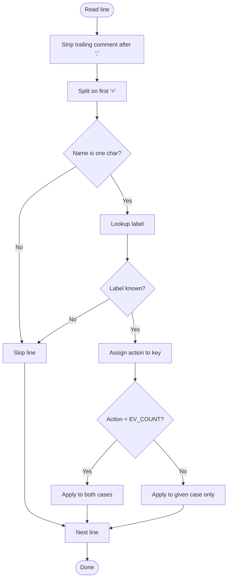
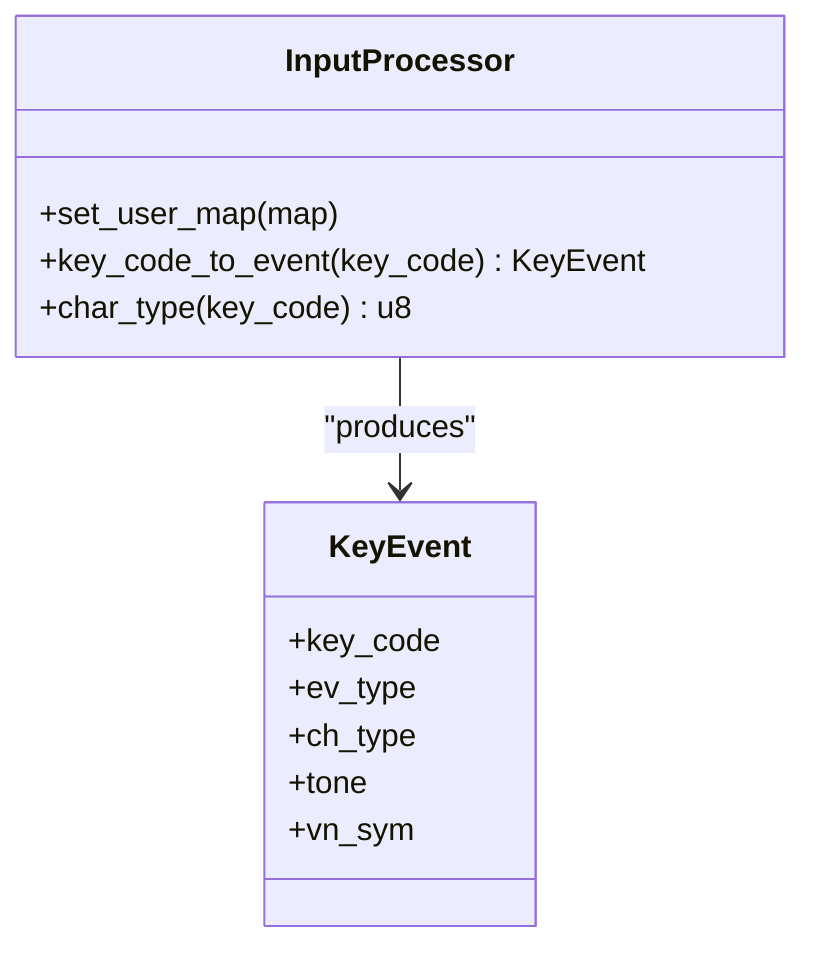
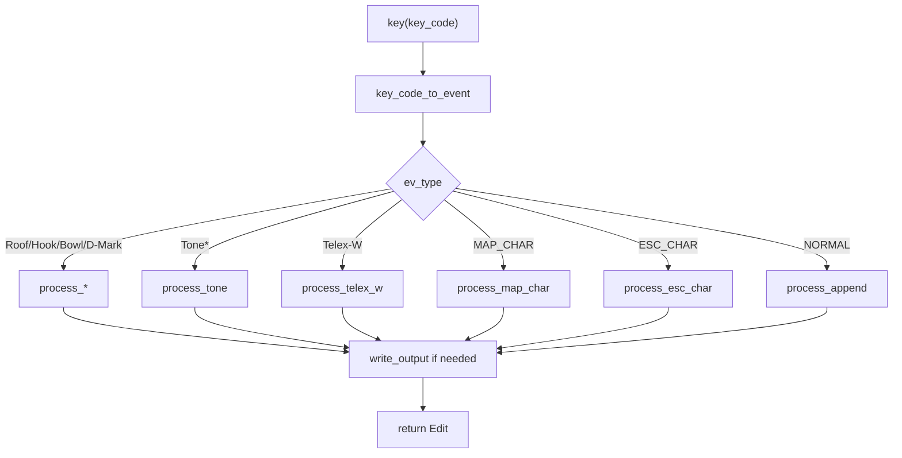
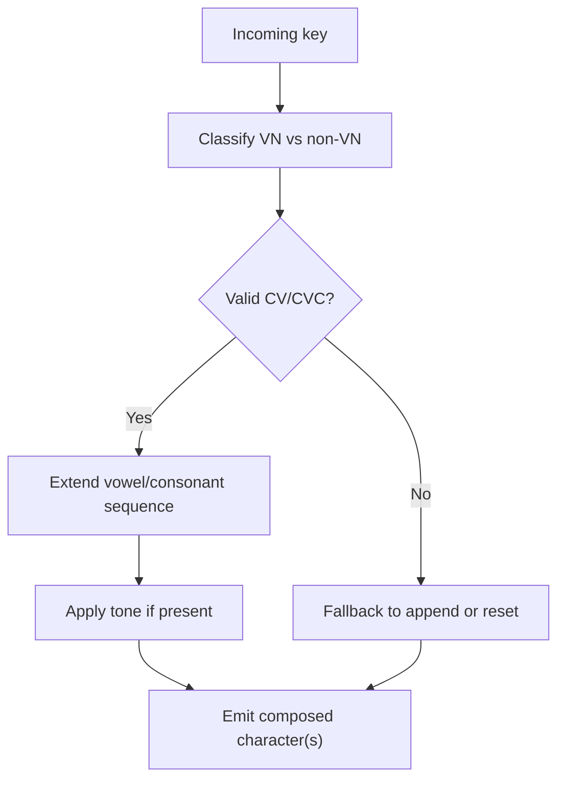
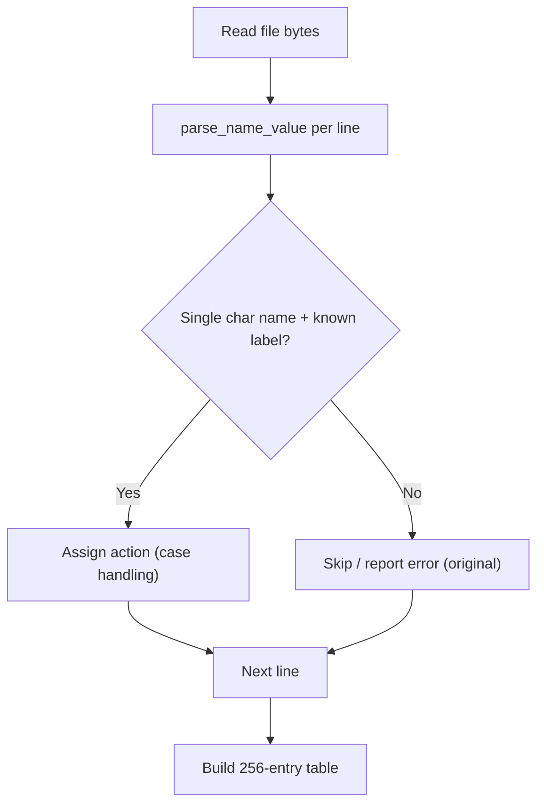
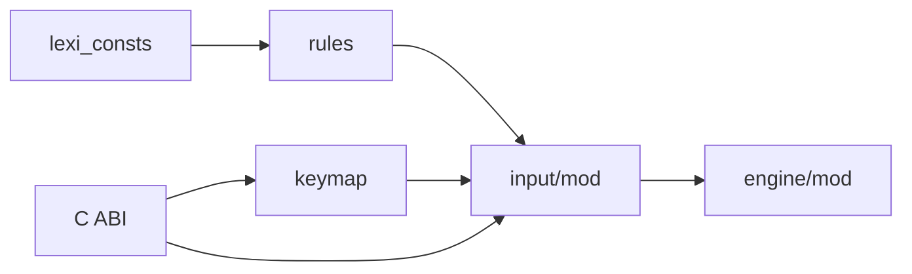

# Custom Keymaps

<cite>
**Referenced Files in This Document**
- [keymap.rs](file://port/skey-core/src/extensions/keymap.rs)
- [input/mod.rs](file://port/skey-core/src/input/mod.rs)
- [usrkeymap.cpp](file://src/ukengine/usrkeymap.cpp)
- [usrkeymap.h](file://src/ukengine/usrkeymap.h)
- [skey.h (C API)](file://port/skey-capi/include/skey.h)
- [lib.rs (C ABI bridge)](file://port/skey-capi/src/lib.rs)
- [mod.rs (Engine)](file://port/skey-core/src/engine/mod.rs)
- [rules.rs](file://port/skey-core/src/phonetics/rules.rs)
- [lexi_consts.rs](file://port/skey-core/src/phonetics/lexi_consts.rs)
- [InputMethod.swift](file://macos/skey-app/Sources/Features/Keyboard/Engine/InputMethod.swift)
- [VietnameseDecomposer.swift](file://macos/skey-app/Sources/Features/Keyboard/Context/VietnameseDecomposer.swift)
- [difftest main.rs](file://port/difftest/src/main.rs)
</cite>

## Table of Contents
1. [Introduction](#introduction)
2. [Project Structure](#project-structure)
3. [Core Components](#core-components)
4. [Architecture Overview](#architecture-overview)
5. [Detailed Component Analysis](#detailed-component-analysis)
6. [Dependency Analysis](#dependency-analysis)
7. [Performance Considerations](#performance-considerations)
8. [Troubleshooting Guide](#troubleshooting-guide)
9. [Conclusion](#conclusion)
10. [Appendices](#appendices)

## Introduction
This document explains the custom keymap system that lets users define personalized keyboard layouts and input mappings for Vietnamese typing and beyond. It covers:
- The keymap file format, mapping syntax, and supported actions
- How to create custom input methods and override default behaviors
- Language-specific typing patterns (including Vietnamese dialect support)
- Specialized programming layouts and accessibility adaptations
- Keymap loading, validation rules, and performance optimization techniques

The system is implemented as a high-performance Rust core with a native macOS app front end and a C ABI for integration.

## Project Structure
At a high level:
- The Rust core defines the keymap parser, input processor, and engine dispatch
- A C ABI exposes functions to load user key maps from files
- The macOS app integrates the engine into the event pipeline and provides UI for settings



**Diagram sources**
- [keymap.rs:126-178](file://port/skey-core/src/extensions/keymap.rs#L126-L178)
- [input/mod.rs:122-192](file://port/skey-core/src/input/mod.rs#L122-L192)
- [lib.rs:804-807](file://port/skey-capi/src/lib.rs#L804-L807)
- [mod.rs:248-319](file://port/skey-core/src/engine/mod.rs#L248-L319)

**Section sources**
- [keymap.rs:1-203](file://port/skey-core/src/extensions/keymap.rs#L1-L203)
- [input/mod.rs:1-213](file://port/skey-core/src/input/mod.rs#L1-L213)
- [mod.rs:1-426](file://port/skey-core/src/engine/mod.rs#L1-L426)

## Core Components
- Keymap parser: Reads a text-based mapping file and produces a compact 256-entry action table used by the input processor.
- Input processor: Converts raw key codes into typed events using either built-in methods or a user-defined map.
- Engine: Orchestrates keystroke processing, phonetic composition, and output generation.
- C ABI: Provides an interface to load user key maps from files at runtime.

**Section sources**
- [keymap.rs:126-178](file://port/skey-core/src/extensions/keymap.rs#L126-L178)
- [input/mod.rs:122-192](file://port/skey-core/src/input/mod.rs#L122-L192)
- [mod.rs:248-319](file://port/skey-core/src/engine/mod.rs#L248-L319)
- [lib.rs:804-807](file://port/skey-capi/src/lib.rs#L804-L807)

## Architecture Overview
The keymap system transforms user-defined mappings into a fast lookup table that drives event classification. The engine then routes each event to specialized handlers (tones, roofs, hooks, Telex-W, mapped characters, escape).

```mermaid
sequenceDiagram
participant App as "macOS App"
participant CABI as "C ABI"
participant Parser as "Keymap Parser"
participant IP as "InputProcessor"
participant ENG as "Engine"
App->>CABI : Load user key map file
CABI->>Parser : parse_key_map(bytes)
Parser-->>CABI : [u8; 256] action table
CABI->>IP : set_user_map(table)
App->>ENG : filter(key_code)
ENG->>IP : key_code_to_event()
IP-->>ENG : KeyEvent(ev_type, ch_type, tone, vn_sym)
ENG->>ENG : dispatch(ev)
ENG-->>App : Edit(backspaces, handled, output)
```

**Diagram sources**
- [lib.rs:804-807](file://port/skey-capi/src/lib.rs#L804-L807)
- [keymap.rs:126-178](file://port/skey-core/src/extensions/keymap.rs#L126-L178)
- [input/mod.rs:122-192](file://port/skey-core/src/input/mod.rs#L122-L192)
- [mod.rs:248-319](file://port/skey-core/src/engine/mod.rs#L248-L319)

## Detailed Component Analysis

### Keymap File Format and Syntax
- Lines are parsed as name-value pairs separated by “=”, with optional trailing comments after “;”.
- Name must be a single ASCII character; value must be a recognized label.
- Recognized labels include:
  - Tone marks: Tone0..Tone5
  - Roof marks: Roof-All, Roof-A, Roof-E, Roof-O
  - Hook marks: Hook-Bowl, Hook-UO, Hook-U, Hook-O
  - Bowl mark: Bowl
  - D-mark: D-Mark
  - Telex W: Telex-W
  - Escape: Escape
  - Direct character mappings: DD, dd, A^, a^, E^, e^, O^, o^, O+, o+, U+, u+
- Duplicate assignments are silently ignored; unknown labels are skipped.
- Action keys apply to both upper and lower case; direct character mappings carry their own case.



**Diagram sources**
- [keymap.rs:66-110](file://port/skey-core/src/extensions/keymap.rs#L66-L110)
- [keymap.rs:126-178](file://port/skey-core/src/extensions/keymap.rs#L126-L178)

**Section sources**
- [keymap.rs:12-63](file://port/skey-core/src/extensions/keymap.rs#L12-L63)
- [keymap.rs:66-110](file://port/skey-core/src/extensions/keymap.rs#L66-L110)
- [keymap.rs:126-178](file://port/skey-core/src/extensions/keymap.rs#L126-L178)

### Mapping Actions and Event Types
- Events include tones, roof/hook marks, bowl, d-mark, Telex-W, mapped characters, escape, and normal.
- Each action fits in a byte; character mappings are encoded as offsets beyond the event count.
- The 256-entry table indexes by key code and returns the action for fast dispatch.



**Diagram sources**
- [input/mod.rs:122-192](file://port/skey-core/src/input/mod.rs#L122-L192)

**Section sources**
- [input/mod.rs:7-34](file://port/skey-core/src/input/mod.rs#L7-L34)
- [input/mod.rs:122-192](file://port/skey-core/src/input/mod.rs#L122-L192)

### Engine Dispatch and Processing Logic
- The engine converts key codes to events via the input processor and dispatches based on event type.
- Handlers process roofs, hooks, tones, Telex-W, mapped characters, escapes, or append to the buffer.
- Output is written once per keystroke unless already written.



**Diagram sources**
- [mod.rs:248-319](file://port/skey-core/src/engine/mod.rs#L248-L319)
- [mod.rs:209-246](file://port/skey-core/src/engine/mod.rs#L209-L246)

**Section sources**
- [mod.rs:209-319](file://port/skey-core/src/engine/mod.rs#L209-L319)

### Creating Custom Input Methods and Overriding Defaults
- Use a keymap file to remap keys to actions or direct characters.
- Load the keymap through the C API function to switch the engine into user-defined mode.
- The input processor’s user map overrides built-in mappings while preserving the rest of the engine behavior.

```mermaid
sequenceDiagram
participant User as "User"
participant App as "macOS App"
participant CAPI as "C ABI"
participant Parser as "Keymap Parser"
participant IP as "InputProcessor"
User->>App : Provide keymap file path
App->>CAPI : skey_engine_load_user_key_map(path)
CAPI->>Parser : parse_key_map(file bytes)
Parser-->>CAPI : [u8; 256]
CAPI->>IP : set_user_map(table)
App-->>User : Ready with custom layout
```

**Diagram sources**
- [lib.rs:804-807](file://port/skey-capi/src/lib.rs#L804-L807)
- [keymap.rs:126-178](file://port/skey-core/src/extensions/keymap.rs#L126-L178)
- [input/mod.rs:122-125](file://port/skey-core/src/input/mod.rs#L122-L125)

**Section sources**
- [skey.h (C API):63-64](file://port/skey-capi/include/skey.h#L63-L64)
- [lib.rs:804-807](file://port/skey-capi/src/lib.rs#L804-L807)
- [input/mod.rs:122-125](file://port/skey-core/src/input/mod.rs#L122-L125)

### Vietnamese Typing Patterns and Dialect Support
- Built-in phonetic tables and rules validate consonant-vowel sequences and handle special cases like “qu” and “gi”.
- Tone placement and free tone marking are supported; modern tone placement can be enabled via options.
- Decomposition utilities translate pre-composed characters into raw keystrokes for accurate recomposition.



**Diagram sources**
- [rules.rs:184-231](file://port/skey-core/src/phonetics/rules.rs#L184-L231)
- [lexi_consts.rs:198-301](file://port/skey-core/src/phonetics/lexi_consts.rs#L198-L301)

**Section sources**
- [rules.rs:1-246](file://port/skey-core/src/phonetics/rules.rs#L1-L246)
- [lexi_consts.rs:1-301](file://port/skey-core/src/phonetics/lexi_consts.rs#L1-L301)
- [VietnameseDecomposer.swift:1-42](file://macos/skey-app/Sources/Features/Keyboard/Context/VietnameseDecomposer.swift#L1-L42)

### Programming Layouts and Accessibility Adaptations
- Remap frequently used symbols or shortcuts to ergonomic positions using direct character mappings or action keys.
- For accessibility, assign clear, consistent actions to modifier combinations or dedicated keys (e.g., Escape, mapped characters).
- Combine with quick-start features and macro expansions to streamline repetitive tasks.

[No sources needed since this section provides general guidance]

### Loading Process, Validation, and Error Handling
- The parser strips comments, splits on “=”, trims whitespace, and validates single-character names and known labels.
- Duplicate assignments are rejected; unknown labels are skipped.
- The original C++ implementation reports errors to stderr for invalid lines; the Rust port skips them silently.



**Diagram sources**
- [keymap.rs:66-110](file://port/skey-core/src/extensions/keymap.rs#L66-L110)
- [keymap.rs:126-178](file://port/skey-core/src/extensions/keymap.rs#L126-L178)
- [usrkeymap.cpp:147-219](file://src/ukengine/usrkeymap.cpp#L147-L219)

**Section sources**
- [keymap.rs:66-178](file://port/skey-core/src/extensions/keymap.rs#L66-L178)
- [usrkeymap.cpp:80-126](file://src/ukengine/usrkeymap.cpp#L80-L126)
- [usrkeymap.cpp:147-219](file://src/ukengine/usrkeymap.cpp#L147-L219)

## Dependency Analysis
- The keymap parser depends on input event constants and lexi constants to map labels to actions.
- The input processor uses the 256-entry table to classify events and produce KeyEvent objects.
- The engine consumes KeyEvent objects and dispatches to specialized handlers.
- The C ABI bridges the app to the Rust core for loading key maps.



**Diagram sources**
- [keymap.rs:1-203](file://port/skey-core/src/extensions/keymap.rs#L1-L203)
- [input/mod.rs:1-213](file://port/skey-core/src/input/mod.rs#L1-L213)
- [mod.rs:1-426](file://port/skey-core/src/engine/mod.rs#L1-L426)
- [lib.rs:804-807](file://port/skey-capi/src/lib.rs#L804-L807)

**Section sources**
- [keymap.rs:1-203](file://port/skey-core/src/extensions/keymap.rs#L1-L203)
- [input/mod.rs:1-213](file://port/skey-core/src/input/mod.rs#L1-L213)
- [mod.rs:1-426](file://port/skey-core/src/engine/mod.rs#L1-L426)
- [lib.rs:804-807](file://port/skey-capi/src/lib.rs#L804-L807)

## Performance Considerations
- The keymap table is a fixed-size 256-byte array enabling O(1) lookups per key press.
- Event dispatch uses a tight match on event types; no allocations on the hot path.
- Phonetics use compact tables and bitmasks for fast validation and sequence extension.
- Decomposition utilities avoid heap allocations on the hot path for maximum responsiveness.

[No sources needed since this section provides general guidance]

## Troubleshooting Guide
- If a key does not respond as expected, verify:
  - The mapping line has a single-character name and a recognized label
  - There are no duplicate assignments for the same key
  - Comments do not accidentally truncate the value
- Check logs or stderr (in the original C++ implementation) for invalid lines or unknown commands.
- Use differential testing to compare behavior against the reference engine.

**Section sources**
- [usrkeymap.cpp:180-219](file://src/ukengine/usrkeymap.cpp#L180-L219)
- [difftest main.rs:209-220](file://port/difftest/src/main.rs#L209-L220)

## Conclusion
The custom keymap system provides a robust, high-performance mechanism to personalize keyboard layouts and input behaviors. With a simple text-based format, strict validation, and efficient runtime tables, it supports Vietnamese typing patterns, programming layouts, and accessibility needs while maintaining sub-microsecond latency.

[No sources needed since this section summarizes without analyzing specific files]

## Appendices

### Supported Labels Reference
- Tones: Tone0..Tone5
- Roofs: Roof-All, Roof-A, Roof-E, Roof-O
- Hooks: Hook-Bowl, Hook-UO, Hook-U, Hook-O
- Others: Bowl, D-Mark, Telex-W, Escape
- Direct characters: DD, dd, A^, a^, E^, e^, O^, o^, O+, o+, U+, u+

**Section sources**
- [keymap.rs:29-63](file://port/skey-core/src/extensions/keymap.rs#L29-L63)

### Example Scenarios
- Vietnamese dialect support: Use tone and roof/hook mappings to match regional preferences; combine with modern tone placement options.
- Programming layouts: Map punctuation and symbols to ergonomic keys; use Escape for toggling modes or triggering macros.
- Accessibility: Assign clear, consistent actions to dedicated keys; leverage mapped characters for complex symbols.

[No sources needed since this section provides general guidance]