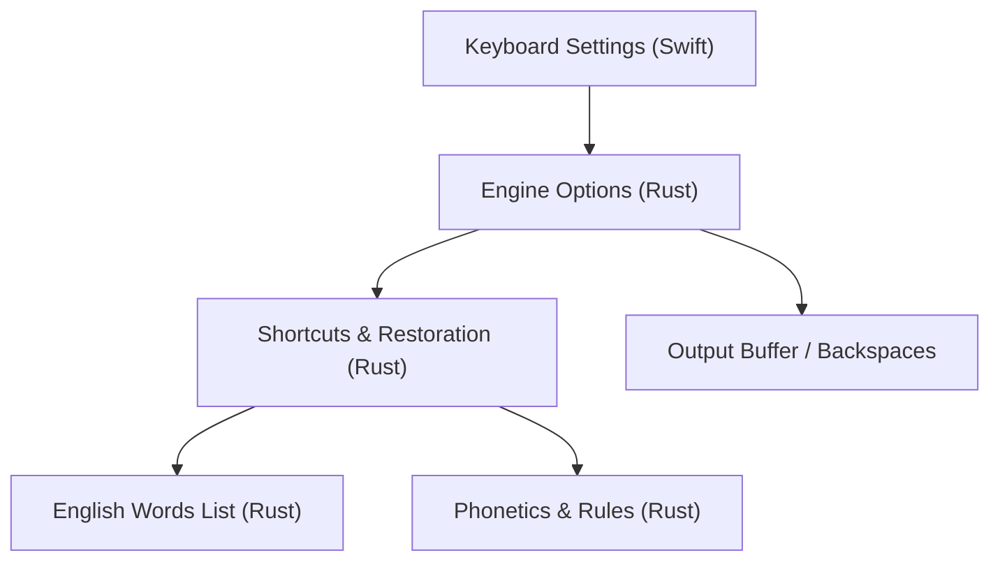
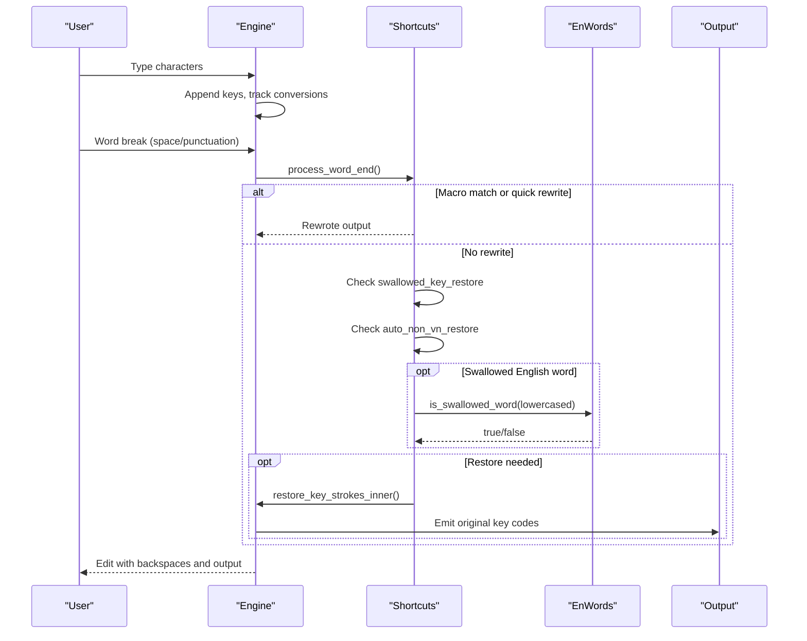
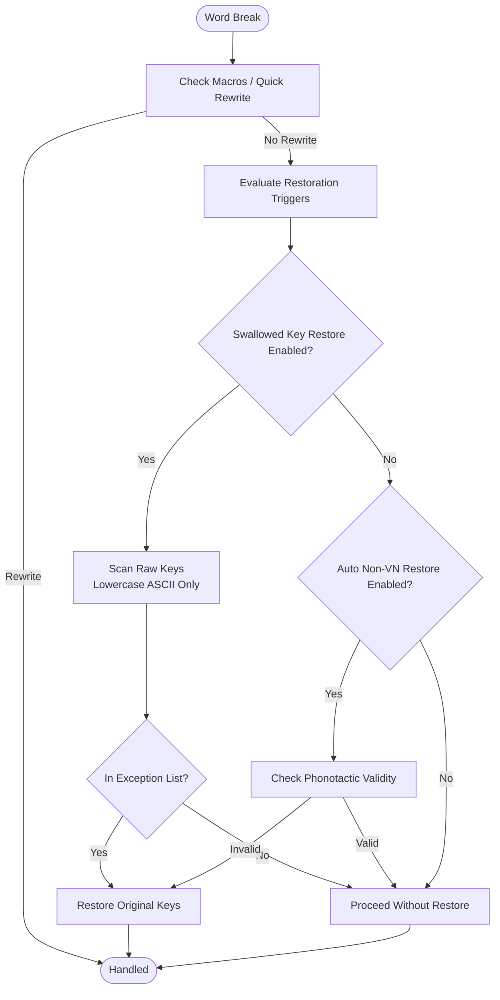
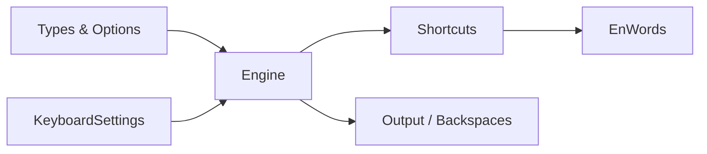

# English Word Swallowing

<cite>
**Referenced Files in This Document**
- [enwords.rs](file://port/skey-core/src/extensions/enwords.rs)
- [shortcuts.rs](file://port/skey-core/src/engine/shortcuts.rs)
- [types.rs](file://port/skey-core/src/engine/types.rs)
- [mod.rs](file://port/skey-core/src/engine/mod.rs)
- [lib.rs](file://port/skey-core/src/lib.rs)
- [KeyboardSettings.swift](file://macos/skey-app/Sources/Shared/Settings/Modules/KeyboardSettings.swift)
- [README.md](file://port/README.md)
- [smoke.rs](file://port/skey-core/tests/smoke.rs)
</cite>

## Table of Contents
1. [Introduction](#introduction)
2. [Project Structure](#project-structure)
3. [Core Components](#core-components)
4. [Architecture Overview](#architecture-overview)
5. [Detailed Component Analysis](#detailed-component-analysis)
6. [Dependency Analysis](#dependency-analysis)
7. [Performance Considerations](#performance-considerations)
8. [Troubleshooting Guide](#troubleshooting-guide)
9. [Conclusion](#conclusion)

## Introduction
This document explains the English word swallowing feature that intelligently handles English words typed within Vietnamese text input. It covers how the system detects when an English word has been “mangled” by the Vietnamese engine, how it restores the original keystrokes to preserve formatting and typing flow, and how users can configure behavior such as word boundaries, exception lists, and restoration policies. It also provides mixed-language typing examples and troubleshooting guidance.

## Project Structure
The English word swallowing logic is implemented in the core engine and exposed through configuration options:
- The detection and restoration pipeline lives in the engine’s shortcuts module.
- A compact, sorted list of problematic English words is maintained in a dedicated extension module.
- User-facing settings are provided via the macOS app’s keyboard settings module.
- Tests validate correctness against both English and Vietnamese inputs.

**Diagram sources**
- [KeyboardSettings.swift:155-160](file://macos/skey-app/Sources/Shared/Settings/Modules/KeyboardSettings.swift#L155-L160)
- [types.rs:34-83](file://port/skey-core/src/engine/types.rs#L34-L83)
- [shortcuts.rs:518-590](file://port/skey-core/src/engine/shortcuts.rs#L518-L590)
- [enwords.rs:22-53](file://port/skey-core/src/extensions/enwords.rs#L22-L53)

**Section sources**
- [KeyboardSettings.swift:155-160](file://macos/skey-app/Sources/Shared/Settings/Modules/KeyboardSettings.swift#L155-L160)
- [types.rs:34-83](file://port/skey-core/src/engine/types.rs#L34-L83)
- [shortcuts.rs:518-590](file://port/skey-core/src/engine/shortcuts.rs#L518-L590)
- [enwords.rs:22-53](file://port/skey-core/src/extensions/enwords.rs#L22-L53)

## Core Components
- Options: Controls whether swallowed-key restoration is enabled alongside other behaviors like auto-restore for non-Vietnamese words, quick telex shortcuts, and capitalization rules.
- Detection: At each word boundary, the engine checks if the last word matches a known problematic English pattern or is phonotactically invalid.
- Restoration: If triggered, the engine re-emits the original key strokes for the current word, preserving case and spacing while maintaining typing flow.
- Exception list: A compact, sorted table of English words that are known to be mangled by swallowing a key; these are restored automatically when the option is enabled.

**Section sources**
- [types.rs:34-83](file://port/skey-core/src/engine/types.rs#L34-L83)
- [shortcuts.rs:518-590](file://port/skey-core/src/engine/shortcuts.rs#L518-L590)
- [enwords.rs:22-53](file://port/skey-core/src/extensions/enwords.rs#L22-L53)

## Architecture Overview
The workflow at a word boundary integrates spell checking, macro expansion, quick consonant shortcuts, and restoration logic. When a word ends, the engine decides whether to restore keystrokes based on configuration and detected conditions.

**Diagram sources**
- [shortcuts.rs:518-590](file://port/skey-core/src/engine/shortcuts.rs#L518-L590)
- [shortcuts.rs:625-654](file://port/skey-core/src/engine/shortcuts.rs#L625-L654)
- [enwords.rs:33-48](file://port/skey-core/src/extensions/enwords.rs#L33-L48)

## Detailed Component Analysis

### Detection Algorithms
- Word boundary handling: On word break, the engine evaluates macros, quick consonant shortcuts, and restoration triggers.
- Swallowed-key detection: The engine scans the raw key strokes of the last word, lowercases ASCII alphabetic sequences, and checks membership in the exception list. Non-ASCII or non-alphabetic sequences abort the check.
- Phonotactic detection: Independently, the engine can detect non-Vietnamese words using phonotactic rules and restore them when configured.

**Diagram sources**
- [shortcuts.rs:518-590](file://port/skey-core/src/engine/shortcuts.rs#L518-L590)
- [shortcuts.rs:625-654](file://port/skey-core/src/engine/shortcuts.rs#L625-L654)

**Section sources**
- [shortcuts.rs:518-590](file://port/skey-core/src/engine/shortcuts.rs#L518-L590)
- [shortcuts.rs:625-654](file://port/skey-core/src/engine/shortcuts.rs#L625-L654)

### Context Awareness and Automatic Switching
- Context awareness: The engine tracks whether keys were converted and maintains a stroke buffer to reconstruct original input during restoration.
- Automatic switching: Depending on options, the engine may automatically restore keystrokes for non-Vietnamese words or specifically for listed English words that had a key swallowed.
- Formatting preservation: Restoration emits the exact original key codes, preserving case and spacing without altering surrounding text beyond necessary backspaces.

**Section sources**
- [mod.rs:248-319](file://port/skey-core/src/engine/mod.rs#L248-L319)
- [shortcuts.rs:300-371](file://port/skey-core/src/engine/shortcuts.rs#L300-L371)

### Configuration Options
- swallowed_key_restore: Enables restoration for listed English words where a key was swallowed and no Vietnamese mark was produced.
- auto_non_vn_restore: Enables restoration when the result is phonotactically invalid (non-Vietnamese).
- quick_telex, quick_start_consonant, quick_end_consonant: Additional shortcuts that interact with restoration at word boundaries.
- upper_case_first_char: Capitalization behavior that does not interfere with restoration but affects character classification.

These options are exposed in the macOS app’s KeyboardSettings and propagated to the engine.

**Section sources**
- [types.rs:34-83](file://port/skey-core/src/engine/types.rs#L34-L83)
- [KeyboardSettings.swift:155-160](file://macos/skey-app/Sources/Shared/Settings/Modules/KeyboardSettings.swift#L155-L160)

### Exception List and Word Boundaries
- Exception list: A compact, sorted blob of English words known to be mangled by swallowing a key. Membership is checked via binary search over offsets into the blob.
- Word boundaries: The scan for restoration starts from the last word break and includes only ASCII alphabetic sequences; any non-ASCII or non-alphabetic character aborts the check.

**Section sources**
- [enwords.rs:22-53](file://port/skey-core/src/extensions/enwords.rs#L22-L53)
- [shortcuts.rs:625-654](file://port/skey-core/src/engine/shortcuts.rs#L625-L654)

### Data Structures and Complexity
- WordInfo: Compact representation of per-character state including form, offsets, tone, and caps. Efficient accessors keep operations fast.
- Exception list lookup: Binary search over offsets yields O(log N) checks for membership, with minimal memory overhead due to the compact blob.

**Section sources**
- [types.rs:107-222](file://port/skey-core/src/engine/types.rs#L107-L222)
- [enwords.rs:33-48](file://port/skey-core/src/extensions/enwords.rs#L33-L48)

## Dependency Analysis
- Engine depends on phonetics rules to determine validity and on shortcuts for restoration.
- Shortcuts depend on the enwords extension for the exception list and on the engine’s internal buffers to reconstruct original keystrokes.
- Settings propagate user preferences into the engine’s Options, enabling or disabling restoration behaviors.

**Diagram sources**
- [types.rs:34-83](file://port/skey-core/src/engine/types.rs#L34-L83)
- [shortcuts.rs:518-590](file://port/skey-core/src/engine/shortcuts.rs#L518-L590)
- [enwords.rs:22-53](file://port/skey-core/src/extensions/enwords.rs#L22-L53)
- [KeyboardSettings.swift:155-160](file://macos/skey-app/Sources/Shared/Settings/Modules/KeyboardSettings.swift#L155-L160)

**Section sources**
- [types.rs:34-83](file://port/skey-core/src/engine/types.rs#L34-L83)
- [shortcuts.rs:518-590](file://port/skey-core/src/engine/shortcuts.rs#L518-L590)
- [enwords.rs:22-53](file://port/skey-core/src/extensions/enwords.rs#L22-L53)
- [KeyboardSettings.swift:155-160](file://macos/skey-app/Sources/Shared/Settings/Modules/KeyboardSettings.swift#L155-L160)

## Performance Considerations
- Minimal overhead: Restoration only runs at word boundaries and only when enabled.
- Compact data: The exception list uses a single blob plus offsets to reduce memory footprint.
- Fast checks: Binary search over offsets ensures quick membership tests.
- No allocation in hot path: The keystroke path avoids allocations, keeping latency low.

[No sources needed since this section provides general guidance]

## Troubleshooting Guide
- Symptom: English words still get mangled.
  - Ensure swallowed_key_restore is enabled in settings.
  - Verify the word is in the exception list; if not, it may be intentionally excluded because its mangled form is valid Vietnamese.
- Symptom: Vietnamese words are incorrectly restored.
  - The engine deliberately avoids restoring cases where the result is valid Vietnamese to prevent breaking Vietnamese typing.
- Symptom: Mixed-language typing feels inconsistent.
  - Check auto_non_vn_restore behavior; it restores only when phonotactically invalid.
  - Confirm that word boundaries are recognized correctly (spaces, punctuation).

Examples validated by tests:
- Listed English words survive intact when restoration is enabled.
- Vietnamese words typed via Telex remain unchanged regardless of restoration settings.

**Section sources**
- [smoke.rs:124-196](file://port/skey-core/tests/smoke.rs#L124-L196)
- [README.md:202-233](file://port/README.md#L202-L233)

## Conclusion
The English word swallowing feature provides a targeted, efficient mechanism to correct common mangles caused by the Vietnamese input engine. By combining a curated exception list, phonotactic checks, and careful restoration of original keystrokes, it preserves typing flow and formatting while minimizing risk to Vietnamese typing. Users can tailor behavior via configuration options to suit their needs, and tests ensure reliability across mixed-language scenarios.