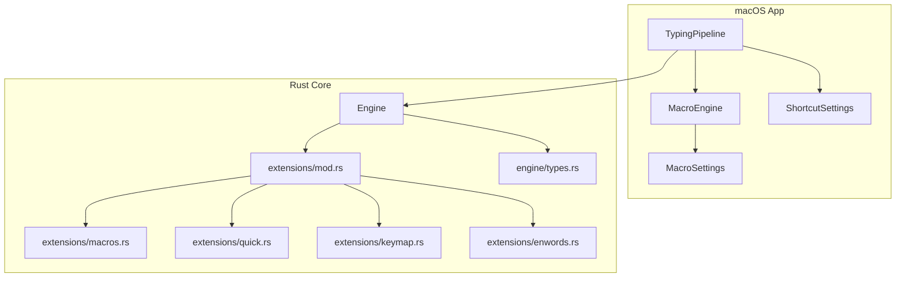
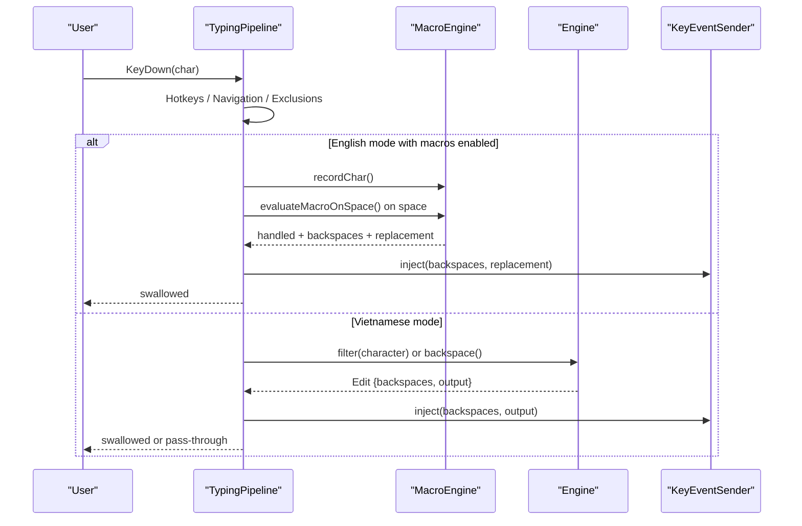
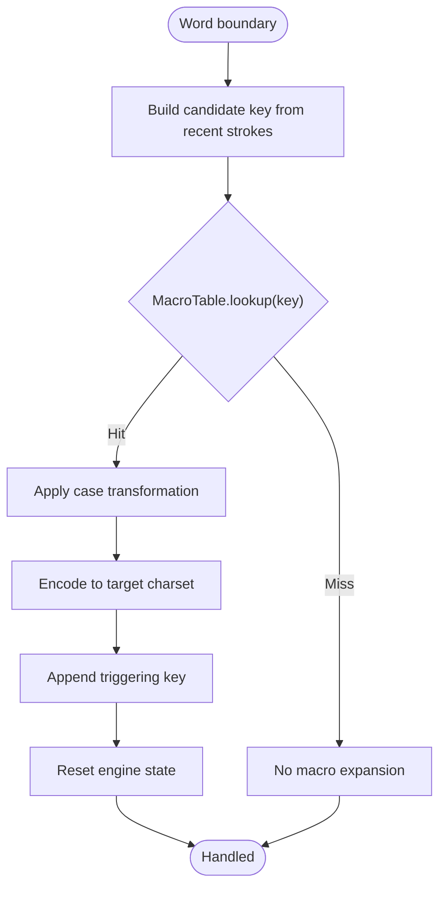
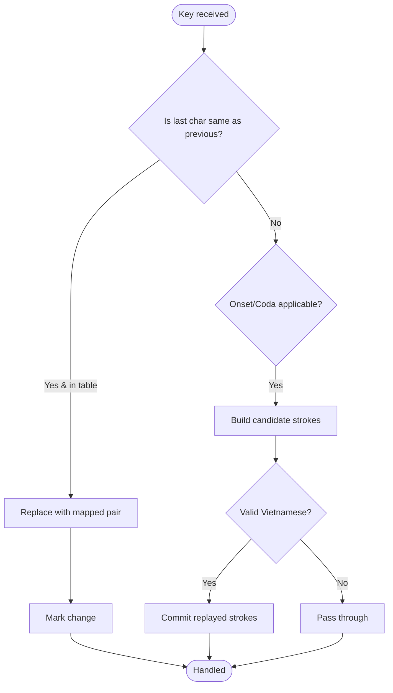
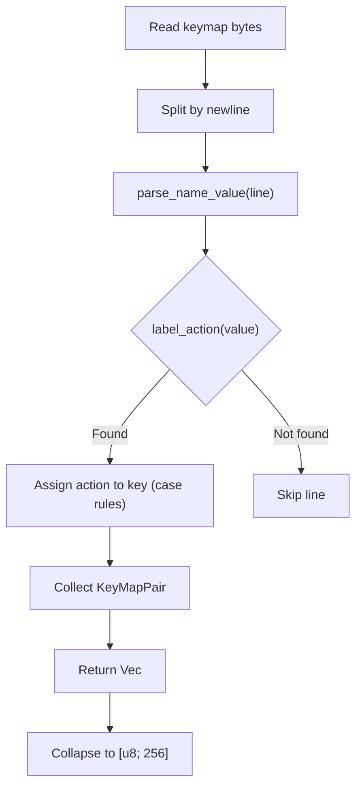
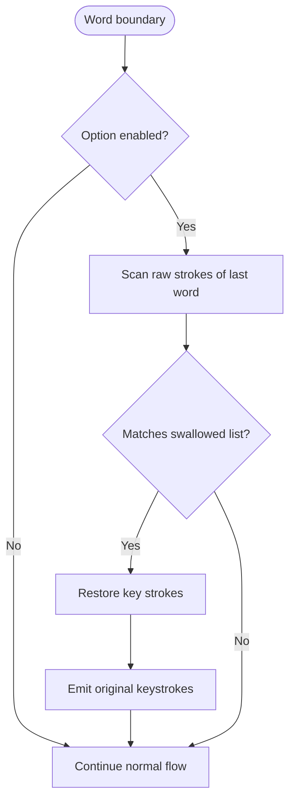
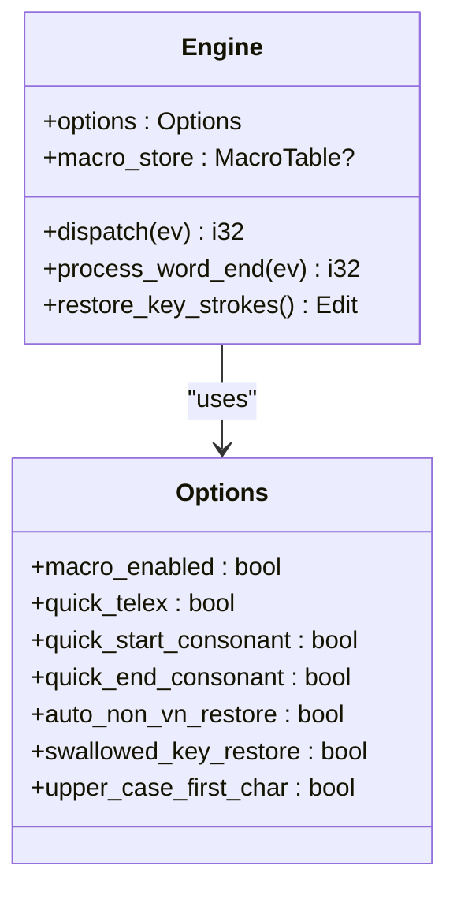
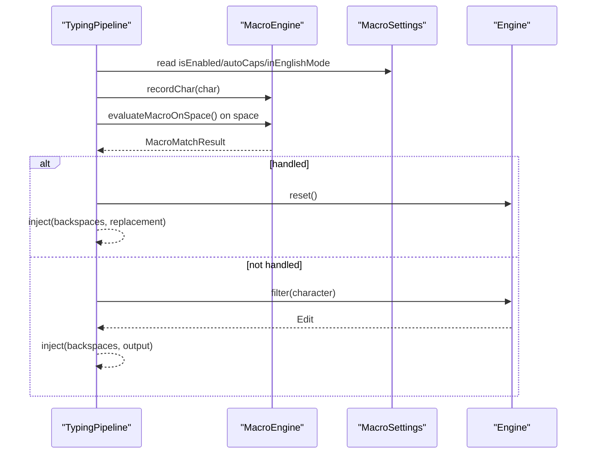
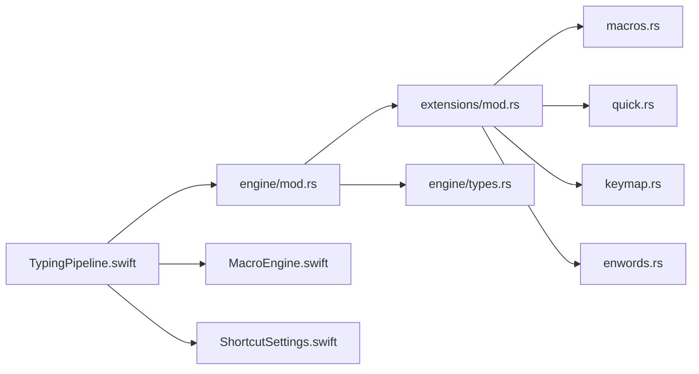

# Extension System

<cite>
**Referenced Files in This Document**
- [mod.rs](file://port/skey-core/src/extensions/mod.rs)
- [macros.rs](file://port/skey-core/src/extensions/macros.rs)
- [quick.rs](file://port/skey-core/src/extensions/quick.rs)
- [keymap.rs](file://port/skey-core/src/extensions/keymap.rs)
- [enwords.rs](file://port/skey-core/src/extensions/enwords.rs)
- [engine_mod.rs](file://port/skey-core/src/engine/mod.rs)
- [shortcuts.rs](file://port/skey-core/src/engine/shortcuts.rs)
- [types.rs](file://port/skey-core/src/engine/types.rs)
- [TypingPipeline.swift](file://macos/skey-app/Sources/Features/Keyboard/EventHandling/Pipeline/TypingPipeline.swift)
- [MacroEngine.swift](file://macos/skey-app/Sources/Features/Keyboard/Engine/MacroEngine.swift)
- [MacroSettings.swift](file://macos/skey-app/Sources/Shared/Settings/Modules/MacroSettings.swift)
- [ShortcutSettings.swift](file://macos/skey-app/Sources/Shared/Settings/Modules/ShortcutSettings.swift)
- [quick.rs (tests)](file://port/skey-core/tests/quick.rs)
</cite>

## Table of Contents
1. Introduction
2. Project Structure
3. Core Components
4. Architecture Overview
5. Detailed Component Analysis
6. Dependency Analysis
7. Performance Considerations
8. Troubleshooting Guide
9. Conclusion
10. Appendices

## Introduction
This document explains the extension system that augments the core Vietnamese typing engine with:
- A macro system for text expansion triggered at word boundaries
- Quick shortcuts for common Vietnamese typing patterns (doubled consonants, onset/coda substitutions)
- Custom keymap support to remap keys to input actions
- English word swallowing restoration to recover original keystrokes when a word is mangled by the engine

It also documents how extensions are loaded, parsed, and executed within the keystroke processing pipeline, and provides configuration formats and integration patterns for both the Rust core and the macOS front end.

## Project Structure
The extension system spans two layers:
- Rust core (skey-core): implements macros, quick shortcuts, custom keymaps, and swallowed-word restoration
- macOS app: provides an in-memory macro expander, settings UI, and a production event pipeline that integrates with the core engine

**Diagram sources**
- [TypingPipeline.swift:31-170](file://macos/skey-app/Sources/Features/Keyboard/EventHandling/Pipeline/TypingPipeline.swift#L31-L170)
- [MacroEngine.swift:17-111](file://macos/skey-app/Sources/Features/Keyboard/Engine/MacroEngine.swift#L17-L111)
- [mod.rs:1-8](file://port/skey-core/src/extensions/mod.rs#L1-L8)
- [engine_mod.rs:18-70](file://port/skey-core/src/engine/mod.rs#L18-L70)

**Section sources**
- [mod.rs:1-8](file://port/skey-core/src/extensions/mod.rs#L1-L8)
- [engine_mod.rs:18-70](file://port/skey-core/src/engine/mod.rs#L18-L70)

## Core Components
- MacroTable (Rust): persistent macro table stored in a compact arena; supports loading from bytes, binary search lookup, and UTF-8 export
- Quick shortcuts (Rust): tables and predicates for doubled consonants, onset, and coda expansions
- Custom keymaps (Rust): parser/writer for user-defined key mappings into the input processor
- Swallowed words (Rust): compact list of English words whose mangled forms should restore raw keystrokes
- Engine options (Rust): feature flags enabling macros, quick shortcuts, auto capitalization, and restoration behaviors
- MacroEngine (macOS): fast in-memory macro expander keyed on current word buffer, with auto-caps behavior
- TypingPipeline (macOS): multi-stage event pipeline integrating hotkeys, language toggle, macro expansion, and core engine calls

**Section sources**
- [macros.rs:58-239](file://port/skey-core/src/extensions/macros.rs#L58-L239)
- [quick.rs:10-82](file://port/skey-core/src/extensions/quick.rs#L10-L82)
- [keymap.rs:129-178](file://port/skey-core/src/extensions/keymap.rs#L129-L178)
- [enwords.rs:22-54](file://port/skey-core/src/extensions/enwords.rs#L22-L54)
- [types.rs:34-105](file://port/skey-core/src/engine/types.rs#L34-L105)
- [MacroEngine.swift:17-111](file://macos/skey-app/Sources/Features/Keyboard/Engine/MacroEngine.swift#L17-L111)
- [TypingPipeline.swift:31-170](file://macos/skey-app/Sources/Features/Keyboard/EventHandling/Pipeline/TypingPipeline.swift#L31-L170)

## Architecture Overview
The keystroke processing pipeline integrates multiple stages before and after the core engine processes each key.

**Diagram sources**
- [TypingPipeline.swift:31-170](file://macos/skey-app/Sources/Features/Keyboard/EventHandling/Pipeline/TypingPipeline.swift#L31-L170)
- [MacroEngine.swift:71-111](file://macos/skey-app/Sources/Features/Keyboard/Engine/MacroEngine.swift#L71-L111)
- [engine_mod.rs:249-319](file://port/skey-core/src/engine/mod.rs#L249-L319)

## Detailed Component Analysis

### Macro System (Rust Core)
- Storage: MacroTable uses a contiguous arena for keys and texts plus a sorted index; supports case-folded binary search
- Loading: load_from_bytes detects version header, decodes charset (UTF-8 or VIQR), parses lines, sorts entries
- Lookup: macro_match walks backward over the current word building candidate keys and expands the first match
- Case handling: preserves all-caps, title-case, or no-change based on typed key casing
- Output: converts matched text to target charset, appends triggering key, resets state, and marks change

**Diagram sources**
- [macros.rs:97-166](file://port/skey-core/src/extensions/macros.rs#L97-L166)
- [shortcuts.rs:44-180](file://port/skey-core/src/engine/shortcuts.rs#L44-L180)

**Section sources**
- [macros.rs:58-239](file://port/skey-core/src/extensions/macros.rs#L58-L239)
- [shortcuts.rs:44-180](file://port/skey-core/src/engine/shortcuts.rs#L44-L180)

### Quick Shortcuts (Rust Core)
- Doubled consonants: maps pairs like cc→ch, gg→gi, etc., preserving case
- Onset shortcuts: f→ph, j→gi, w→qu applied at word start
- Coda shortcuts: g→ng, h→nh, k→ch applied at word end only if it rescues an invalid word
- Special case: uu→u horn + o horn handled separately in the engine

**Diagram sources**
- [quick.rs:10-82](file://port/skey-core/src/extensions/quick.rs#L10-L82)
- [shortcuts.rs:232-297](file://port/skey-core/src/engine/shortcuts.rs#L232-L297)
- [shortcuts.rs:374-515](file://port/skey-core/src/engine/shortcuts.rs#L374-L515)

**Section sources**
- [quick.rs:10-82](file://port/skey-core/src/extensions/quick.rs#L10-L82)
- [shortcuts.rs:232-297](file://port/skey-core/src/engine/shortcuts.rs#L232-L297)
- [shortcuts.rs:374-515](file://port/skey-core/src/engine/shortcuts.rs#L374-L515)
- [quick.rs (tests):23-180](file://port/skey-core/tests/quick.rs#L23-L180)

### Custom Keymaps (Rust Core)
- Parser: reads name=value lines, strips comments, trims whitespace, maps labels to actions
- Order map: collects unique mappings; duplicate keys are silently rejected
- Collapsed map: produces a 256-entry array used by the input processor
- Writer: exports order map to a human-readable file format

**Diagram sources**
- [keymap.rs:66-110](file://port/skey-core/src/extensions/keymap.rs#L66-L110)
- [keymap.rs:129-178](file://port/skey-core/src/extensions/keymap.rs#L129-L178)
- [keymap.rs:180-203](file://port/skey-core/src/extensions/keymap.rs#L180-L203)

**Section sources**
- [keymap.rs:66-178](file://port/skey-core/src/extensions/keymap.rs#L66-L178)
- [keymap.rs:180-203](file://port/skey-core/src/extensions/keymap.rs#L180-L203)

### English Word Swallowing Restoration (Rust Core)
- List: compact blob + offsets of known English words that lose a key during conversion
- Detection: at word end, if the option is enabled, check if the raw strokes match a listed word
- Restoration: rewind the word and re-emit original keystrokes so the user sees what they typed

**Diagram sources**
- [enwords.rs:22-54](file://port/skey-core/src/extensions/enwords.rs#L22-L54)
- [shortcuts.rs:518-590](file://port/skey-core/src/engine/shortcuts.rs#L518-L590)
- [shortcuts.rs:625-654](file://port/skey-core/src/engine/shortcuts.rs#L625-L654)

**Section sources**
- [enwords.rs:22-54](file://port/skey-core/src/extensions/enwords.rs#L22-L54)
- [shortcuts.rs:518-590](file://port/skey-core/src/engine/shortcuts.rs#L518-L590)
- [shortcuts.rs:625-654](file://port/skey-core/src/engine/shortcuts.rs#L625-L654)

### Engine Integration Points
- Dispatch: applies quick telex and upper-case first letter before inner dispatch
- Word end: triggers macro matching, quick consonant rewrite, and optional restoration
- Options: control which features are active per engine instance

**Diagram sources**
- [engine_mod.rs:18-70](file://port/skey-core/src/engine/mod.rs#L18-L70)
- [types.rs:34-105](file://port/skey-core/src/engine/types.rs#L34-L105)
- [shortcuts.rs:518-590](file://port/skey-core/src/engine/shortcuts.rs#L518-L590)

**Section sources**
- [engine_mod.rs:18-70](file://port/skey-core/src/engine/mod.rs#L18-L70)
- [types.rs:34-105](file://port/skey-core/src/engine/types.rs#L34-L105)
- [shortcuts.rs:518-590](file://port/skey-core/src/engine/shortcuts.rs#L518-L590)

### macOS Front End: Macro Expansion and Pipeline
- MacroEngine: maintains a thread-safe in-memory map of shortcut→replacement, tracks current word buffer, evaluates on space with auto-caps
- TypingPipeline: intercepts events, handles hotkeys, toggles language, runs macros in English mode, delegates to core engine in Vietnamese mode
- Settings: MacroSettings persists items and toggles; ShortcutSettings manages presets and conflicts

**Diagram sources**
- [TypingPipeline.swift:31-170](file://macos/skey-app/Sources/Features/Keyboard/EventHandling/Pipeline/TypingPipeline.swift#L31-L170)
- [MacroEngine.swift:17-111](file://macos/skey-app/Sources/Features/Keyboard/Engine/MacroEngine.swift#L17-L111)
- [MacroSettings.swift:6-125](file://macos/skey-app/Sources/Shared/Settings/Modules/MacroSettings.swift#L6-L125)

**Section sources**
- [TypingPipeline.swift:31-170](file://macos/skey-app/Sources/Features/Keyboard/EventHandling/Pipeline/TypingPipeline.swift#L31-L170)
- [MacroEngine.swift:17-111](file://macos/skey-app/Sources/Features/Keyboard/Engine/MacroEngine.swift#L17-L111)
- [MacroSettings.swift:6-125](file://macos/skey-app/Sources/Shared/Settings/Modules/MacroSettings.swift#L6-L125)
- [ShortcutSettings.swift:18-330](file://macos/skey-app/Sources/Shared/Settings/Modules/ShortcutSettings.swift#L18-L330)

## Dependency Analysis
- Extensions module exposes four add-ons: enwords, quick, macros, keymap
- Engine depends on extensions via feature flags and options
- macOS pipeline depends on MacroEngine and ShortcutSettings; delegates to Engine for Vietnamese typing
- Tests validate quick shortcuts behavior and ensure defaults are off

**Diagram sources**
- [mod.rs:1-8](file://port/skey-core/src/extensions/mod.rs#L1-L8)
- [engine_mod.rs:18-70](file://port/skey-core/src/engine/mod.rs#L18-L70)
- [types.rs:34-105](file://port/skey-core/src/engine/types.rs#L34-L105)
- [TypingPipeline.swift:31-170](file://macos/skey-app/Sources/Features/Keyboard/EventHandling/Pipeline/TypingPipeline.swift#L31-L170)

**Section sources**
- [mod.rs:1-8](file://port/skey-core/src/extensions/mod.rs#L1-L8)
- [engine_mod.rs:18-70](file://port/skey-core/src/engine/mod.rs#L18-L70)
- [types.rs:34-105](file://port/skey-core/src/engine/types.rs#L34-L105)
- [TypingPipeline.swift:31-170](file://macos/skey-app/Sources/Features/Keyboard/EventHandling/Pipeline/TypingPipeline.swift#L31-L170)

## Performance Considerations
- MacroTable uses a compact arena and binary search for O(log N) lookups with minimal allocations
- Quick shortcuts rely on small constant-time tables and early guards to avoid unnecessary work
- Restoration paths operate on bounded buffers and short scans limited to the current word
- macOS MacroEngine uses a lock-protected hash map and a sliding window for the current word buffer to keep evaluation fast
- The pipeline minimizes IPC and avoids heavy operations on hot paths, injecting only necessary backspaces and text

[No sources needed since this section provides general guidance]

## Troubleshooting Guide
- Macros not expanding:
  - Ensure macro_enabled is set in Options for the core or isEnabled is true in MacroSettings for the app
  - Verify macro file format and version header when loading from bytes
- Quick shortcuts not firing:
  - Confirm corresponding options are enabled (quick_telex, quick_start_consonant, quick_end_consonant)
  - Check tests for expected behavior and default-off guarantees
- Custom keymaps ignored:
  - Validate label names and syntax; duplicates are rejected silently
  - Use write_order_map to inspect generated mappings
- English restoration not working:
  - Enable swallowed_key_restore and verify the typed strokes match the swallowed list
  - Ensure last_word_has_vn_mark conditions allow restoration when needed

**Section sources**
- [macros.rs:193-239](file://port/skey-core/src/extensions/macros.rs#L193-L239)
- [types.rs:34-105](file://port/skey-core/src/engine/types.rs#L34-L105)
- [quick.rs (tests):14-21](file://port/skey-core/tests/quick.rs#L14-L21)
- [keymap.rs:129-178](file://port/skey-core/src/extensions/keymap.rs#L129-L178)
- [shortcuts.rs:518-590](file://port/skey-core/src/engine/shortcuts.rs#L518-L590)

## Conclusion
The extension system cleanly separates concerns between the Rust core and the macOS front end. The core provides robust, efficient implementations of macros, quick shortcuts, custom keymaps, and restoration logic, while the app layer offers a responsive UI and pipeline integration. Configuration is centralized in settings modules, and the pipeline ensures low-latency processing with clear separation of hotkeys, language modes, and engine interactions.

[No sources needed since this section summarizes without analyzing specific files]

## Appendices

### Configuration Formats and API Summary
- Macro table (core):
  - Load from bytes with optional UTF-8 header; parse key:text lines; sort and store
  - Export to UTF-8 file with header
- Keymap file (core):
  - Lines: key = Label; supports comments and trimming
  - Produces a 256-entry mapping used by the input processor
- Engine options (core):
  - Flags to enable/disable macros, quick shortcuts, restoration, and capitalization
- App settings (macOS):
  - MacroSettings: items (shortcut→replacement), isEnabled, autoCaps, inEnglishMode
  - ShortcutSettings: presets and custom shortcuts for language toggle, clipboard, cleaner, AI

**Section sources**
- [macros.rs:193-239](file://port/skey-core/src/extensions/macros.rs#L193-L239)
- [keymap.rs:129-178](file://port/skey-core/src/extensions/keymap.rs#L129-L178)
- [types.rs:34-105](file://port/skey-core/src/engine/types.rs#L34-L105)
- [MacroSettings.swift:6-125](file://macos/skey-app/Sources/Shared/Settings/Modules/MacroSettings.swift#L6-L125)
- [ShortcutSettings.swift:18-330](file://macos/skey-app/Sources/Shared/Settings/Modules/ShortcutSettings.swift#L18-L330)

### Examples and Usage Patterns
- Create a custom macro:
  - Add an item in MacroSettings with a shortcut and replacement; save to persist and reload the in-memory map
  - In English mode, macros trigger on space; in Vietnamese mode, core macros expand at word boundaries
- Define quick shortcuts:
  - Enable quick_telex for doubled consonants; enable quick_start_consonant and/or quick_end_consonant for onset/coda
  - Behavior validated by tests ensuring defaults are off and Vietnamese inputs remain untouched
- Implement a custom keymap:
  - Write key = Label lines; parse to obtain mappings; apply to the input processor
  - Use writer to export and verify mappings

**Section sources**
- [MacroSettings.swift:82-125](file://macos/skey-app/Sources/Shared/Settings/Modules/MacroSettings.swift#L82-L125)
- [MacroEngine.swift:71-111](file://macos/skey-app/Sources/Features/Keyboard/Engine/MacroEngine.swift#L71-L111)
- [quick.rs (tests):23-180](file://port/skey-core/tests/quick.rs#L23-L180)
- [keymap.rs:129-178](file://port/skey-core/src/extensions/keymap.rs#L129-L178)
- [keymap.rs:180-203](file://port/skey-core/src/extensions/keymap.rs#L180-L203)