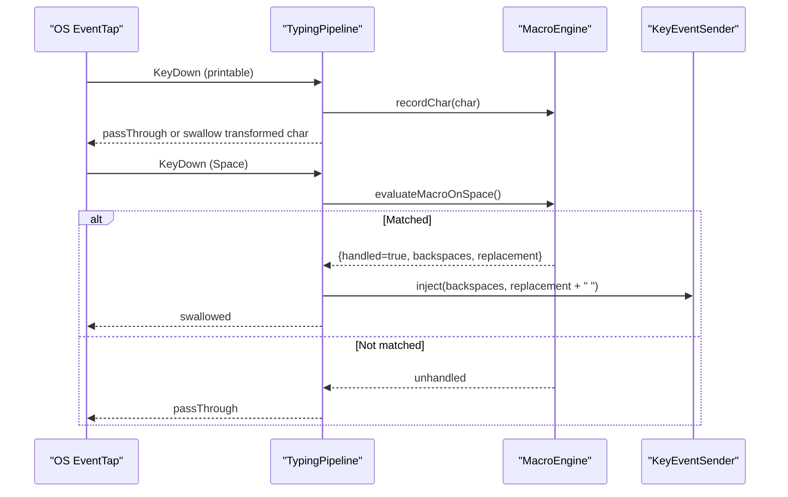
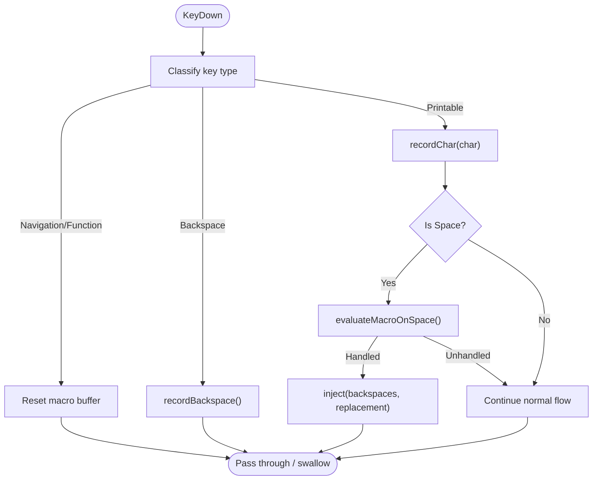
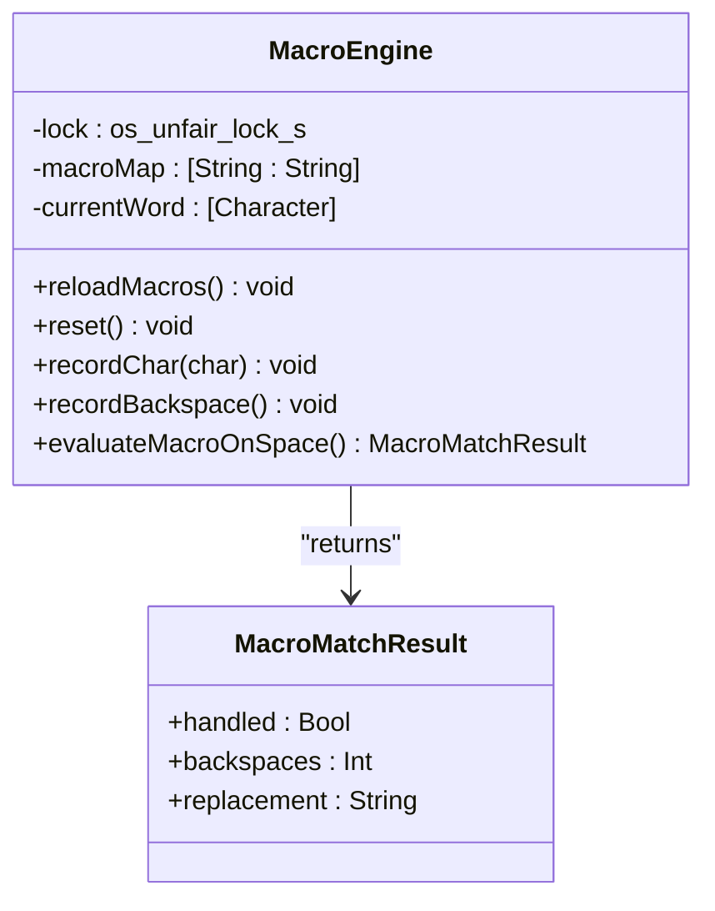
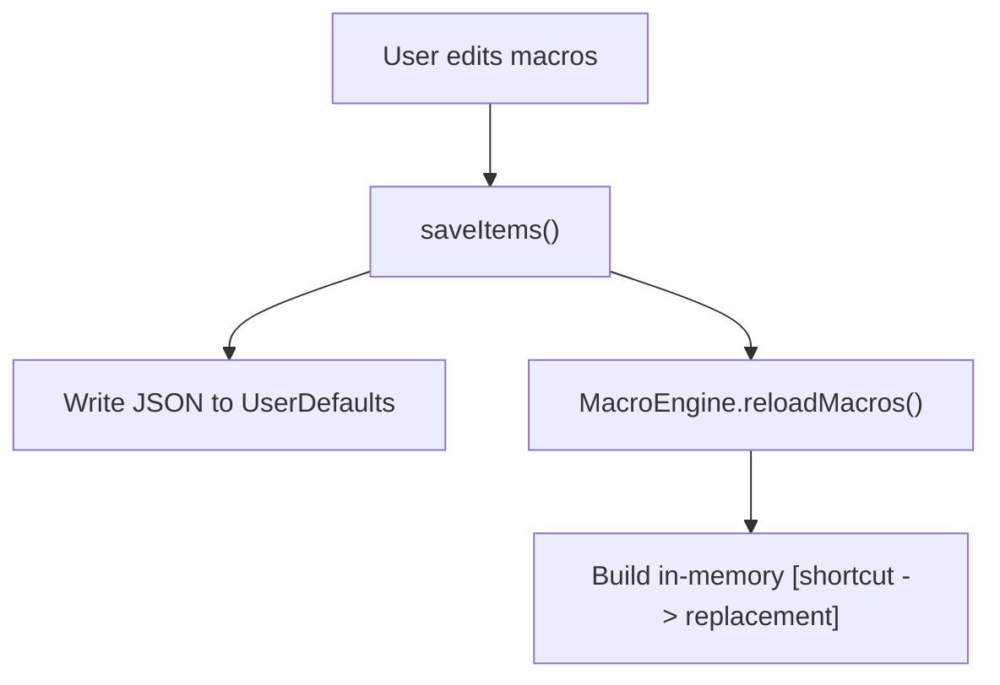
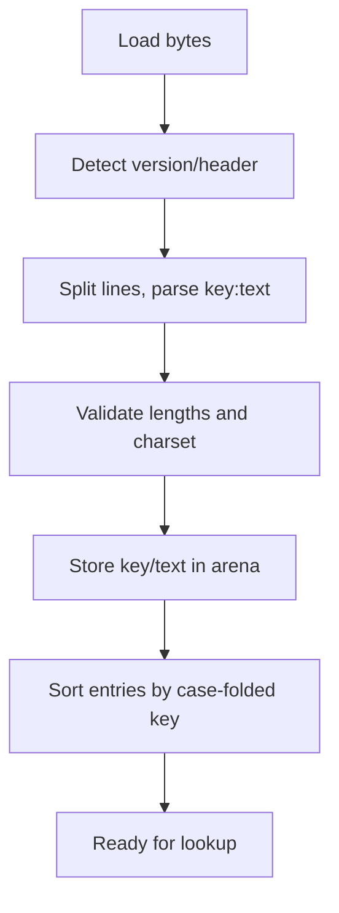
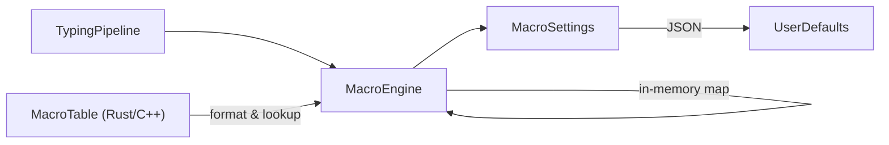

# Macro System

<cite>
**Referenced Files in This Document**
- [MacroEngine.swift](file://macos/skey-app/Sources/Features/Keyboard/Engine/MacroEngine.swift)
- [TypingPipeline.swift](file://macos/skey-app/Sources/Features/Keyboard/EventHandling/Pipeline/TypingPipeline.swift)
- [KeyInterceptor.swift](file://macos/skey-app/Sources/Features/Keyboard/EventHandling/Pipeline/KeyInterceptor.swift)
- [MacroItem.swift](file://macos/skey-app/Sources/Features/Keyboard/Models/MacroItem.swift)
- [MacroSettings.swift](file://macos/skey-app/Sources/Shared/Settings/Modules/MacroSettings.swift)
- [macros.rs](file://port/skey-core/src/extensions/macros.rs)
- [mactab.cpp](file://src/ukengine/mactab.cpp)
- [macro.h](file://src/ukengine/macro.h)
</cite>

## Table of Contents
1. [Introduction](#introduction)
2. [Project Structure](#project-structure)
3. [Core Components](#core-components)
4. [Architecture Overview](#architecture-overview)
5. [Detailed Component Analysis](#detailed-component-analysis)
6. [Dependency Analysis](#dependency-analysis)
7. [Performance Considerations](#performance-considerations)
8. [Troubleshooting Guide](#troubleshooting-guide)
9. [Conclusion](#conclusion)
10. [Appendices](#appendices)

## Introduction
This document explains the macro system that enables text expansion and automated typing sequences. It covers how macros are defined, parsed, stored, and executed within the keystroke processing pipeline. It documents the macro syntax, trigger patterns, replacement rules, configuration format, storage mechanisms, performance characteristics, precedence and conflict resolution, and debugging techniques.

## Project Structure
The macro system spans two layers:
- macOS Swift layer: runtime engine for live typing, settings UI, and event pipeline integration.
- Legacy C++ and Rust core layers: macro table formats, parsing, sorting, and lookup semantics used by the broader engine.

```mermaid
graph TB
subgraph "macOS App (Swift)"
TP["TypingPipeline"]
ME["MacroEngine"]
MS["MacroSettings"]
MI["MacroItem"]
end
subgraph "Core Engine"
MT_Rust["MacroTable (Rust)"]
MT_CPP["CMacroTable (C++)"]
end
TP --> ME
MS --> ME
ME --> |"lookup key -> replacement"| MT_Rust
MT_Rust < --> MT_CPP
```

**Diagram sources**
- [TypingPipeline.swift:31-170](file://macos/skey-app/Sources/Features/Keyboard/EventHandling/Pipeline/TypingPipeline.swift#L31-L170)
- [MacroEngine.swift:16-111](file://macos/skey-app/Sources/Features/Keyboard/Engine/MacroEngine.swift#L16-L111)
- [MacroSettings.swift:6-125](file://macos/skey-app/Sources/Shared/Settings/Modules/MacroSettings.swift#L6-L125)
- [macros.rs:58-239](file://port/skey-core/src/extensions/macros.rs#L58-L239)
- [mactab.cpp:167-208](file://src/ukengine/mactab.cpp#L167-L208)

**Section sources**
- [TypingPipeline.swift:31-170](file://macos/skey-app/Sources/Features/Keyboard/EventHandling/Pipeline/TypingPipeline.swift#L31-L170)
- [MacroEngine.swift:16-111](file://macos/skey-app/Sources/Features/Keyboard/Engine/MacroEngine.swift#L16-L111)
- [MacroSettings.swift:6-125](file://macos/skey-app/Sources/Shared/Settings/Modules/MacroSettings.swift#L6-L125)
- [macros.rs:58-239](file://port/skey-core/src/extensions/macros.rs#L58-L239)
- [mactab.cpp:167-208](file://src/ukengine/mactab.cpp#L167-L208)

## Core Components
- TypingPipeline: intercepts keystrokes, decides when to run macro expansion, and injects replacements.
- MacroEngine: maintains a current word buffer and performs case-aware expansion on space.
- MacroSettings: manages user preferences (enable/disable, auto-caps, English mode), default items, and persistence.
- MacroItem: data model for each macro shortcut and replacement.
- MacroTable (Rust/C++): stores and retrieves macro mappings with consistent ordering and charset handling.

**Section sources**
- [TypingPipeline.swift:31-170](file://macos/skey-app/Sources/Features/Keyboard/EventHandling/Pipeline/TypingPipeline.swift#L31-L170)
- [MacroEngine.swift:16-111](file://macos/skey-app/Sources/Features/Keyboard/Engine/MacroEngine.swift#L16-L111)
- [MacroSettings.swift:6-125](file://macos/skey-app/Sources/Shared/Settings/Modules/MacroSettings.swift#L6-L125)
- [MacroItem.swift:5-23](file://macos/skey-app/Sources/Features/Keyboard/Models/MacroItem.swift#L5-L23)
- [macros.rs:58-239](file://port/skey-core/src/extensions/macros.rs#L58-L239)
- [mactab.cpp:167-208](file://src/ukengine/mactab.cpp#L167-L208)

## Architecture Overview
The macro system integrates into the hot path of keystroke processing. On printable characters, the pipeline records the character into the macro engine’s word buffer. On space, it attempts to match the buffered word against configured macros and, if found, backspaces the typed text and injects the replacement. Auto-caps can adjust casing based on the typed prefix.



**Diagram sources**
- [TypingPipeline.swift:218-244](file://macos/skey-app/Sources/Features/Keyboard/EventHandling/Pipeline/TypingPipeline.swift#L218-L244)
- [MacroEngine.swift:71-109](file://macos/skey-app/Sources/Features/Keyboard/Engine/MacroEngine.swift#L71-L109)

## Detailed Component Analysis

### TypingPipeline: Keystroke Processing and Macro Triggering
- Filters synthetic events, mouse clicks, modifier-only chords, and excluded apps before reaching macro logic.
- Records printable ASCII into the macro engine; resets buffers on navigation, function/media keys, and structural breaks.
- On Space, triggers macro evaluation; if handled, backspaces the typed word and injects the replacement.
- In English mode, optionally runs macro expansion even when Vietnamese composing is disabled.



**Diagram sources**
- [TypingPipeline.swift:174-280](file://macos/skey-app/Sources/Features/Keyboard/EventHandling/Pipeline/TypingPipeline.swift#L174-L280)

**Section sources**
- [TypingPipeline.swift:31-170](file://macos/skey-app/Sources/Features/Keyboard/EventHandling/Pipeline/TypingPipeline.swift#L31-L170)
- [TypingPipeline.swift:174-280](file://macos/skey-app/Sources/Features/Keyboard/EventHandling/Pipeline/TypingPipeline.swift#L174-L280)
- [KeyInterceptor.swift:6-20](file://macos/skey-app/Sources/Features/Keyboard/EventHandling/Pipeline/KeyInterceptor.swift#L6-L20)

### MacroEngine: Word Buffering and Expansion
- Maintains a bounded current-word buffer; resets on whitespace/newline and on explicit reset calls.
- On space, looks up the lowercased buffer in an in-memory map built from settings; returns whether handled, number of backspaces, and replacement string.
- Supports auto-caps: all-uppercase input uppercases the replacement; first-letter uppercase capitalizes the first character of the replacement.



**Diagram sources**
- [MacroEngine.swift:6-111](file://macos/skey-app/Sources/Features/Keyboard/Engine/MacroEngine.swift#L6-L111)

**Section sources**
- [MacroEngine.swift:16-111](file://macos/skey-app/Sources/Features/Keyboard/Engine/MacroEngine.swift#L16-L111)

### MacroSettings and MacroItem: Configuration and Storage
- Stores enable flag, auto-caps behavior, English-mode toggle, and a list of macros.
- Default macros are provided out-of-the-box; user edits persist via UserDefaults as JSON.
- Saving items triggers a reload of the in-memory macro map in MacroEngine.



**Diagram sources**
- [MacroSettings.swift:18-97](file://macos/skey-app/Sources/Shared/Settings/Modules/MacroSettings.swift#L18-L97)
- [MacroEngine.swift:28-38](file://macos/skey-app/Sources/Features/Keyboard/Engine/MacroEngine.swift#L28-L38)

**Section sources**
- [MacroSettings.swift:6-125](file://macos/skey-app/Sources/Shared/Settings/Modules/MacroSettings.swift#L6-L125)
- [MacroItem.swift:5-23](file://macos/skey-app/Sources/Features/Keyboard/Models/MacroItem.swift#L5-L23)

### MacroTable (Rust and C++): Parsing, Sorting, and Lookup Semantics
- File format: lines of key:text with an optional header line containing version metadata.
- Parsing splits on colon; supports legacy and UTF-8 versions; strips trailing newline/carriage return.
- Sorting uses case-folded comparison; ties broken by insertion order for reproducibility.
- Lookup is binary search over sorted entries using the same case-folded comparator.



**Diagram sources**
- [macros.rs:193-239](file://port/skey-core/src/extensions/macros.rs#L193-L239)
- [mactab.cpp:167-208](file://src/ukengine/mactab.cpp#L167-L208)

**Section sources**
- [macros.rs:19-43](file://port/skey-core/src/extensions/macros.rs#L19-L43)
- [macros.rs:150-188](file://port/skey-core/src/extensions/macros.rs#L150-L188)
- [macros.rs:193-239](file://port/skey-core/src/extensions/macros.rs#L193-L239)
- [mactab.cpp:167-208](file://src/ukengine/mactab.cpp#L167-L208)
- [macro.h:31-31](file://src/ukengine/macro.h#L31-L31)

## Dependency Analysis
- TypingPipeline depends on MacroEngine for expansion and KeyEventSender for injection.
- MacroEngine depends on MacroSettings for enabled state, auto-caps, and item list.
- MacroSettings persists items and triggers MacroEngine reload.
- MacroTable (Rust/C++) provides canonical parsing and lookup semantics used by the broader engine stack.



**Diagram sources**
- [TypingPipeline.swift:218-244](file://macos/skey-app/Sources/Features/Keyboard/EventHandling/Pipeline/TypingPipeline.swift#L218-L244)
- [MacroEngine.swift:28-38](file://macos/skey-app/Sources/Features/Keyboard/Engine/MacroEngine.swift#L28-L38)
- [MacroSettings.swift:82-97](file://macos/skey-app/Sources/Shared/Settings/Modules/MacroSettings.swift#L82-L97)
- [macros.rs:97-107](file://port/skey-core/src/extensions/macros.rs#L97-L107)

**Section sources**
- [TypingPipeline.swift:218-244](file://macos/skey-app/Sources/Features/Keyboard/EventHandling/Pipeline/TypingPipeline.swift#L218-L244)
- [MacroEngine.swift:28-38](file://macos/skey-app/Sources/Features/Keyboard/Engine/MacroEngine.swift#L28-L38)
- [MacroSettings.swift:82-97](file://macos/skey-app/Sources/Shared/Settings/Modules/MacroSettings.swift#L82-L97)
- [macros.rs:97-107](file://port/skey-core/src/extensions/macros.rs#L97-L107)

## Performance Considerations
- Hot-path design: The pipeline avoids heavy work on non-printable keys and resets buffers quickly on navigation or structural breaks.
- Bounded buffer: The macro engine caps the tracked word length to prevent unbounded growth.
- O(1) in-memory lookup: The macOS engine builds a dictionary keyed by lowercase shortcuts for constant-time matching during typing.
- Efficient storage: The Rust macro table uses a contiguous arena and binary search to minimize allocations and improve cache locality.
- Minimal IPC: Backspace count adjustment only checks selection state for web browsers where needed.

[No sources needed since this section provides general guidance]

## Troubleshooting Guide
- Macros not triggering:
  - Ensure macros are enabled and, if desired, active in English mode.
  - Verify that the typed shortcut matches exactly (case-insensitive lookup).
  - Confirm that the space key is being recorded and evaluated; other word-break keys will reset the buffer.
- Unexpected casing:
  - Check auto-caps setting; all-uppercase input triggers full uppercase replacement; initial uppercase capitalizes the first character.
- Conflicts and precedence:
  - Duplicate shortcuts are deduplicated by lowercased shortcut; adding a new one updates the existing entry.
  - The in-memory map ensures deterministic single-match behavior at runtime.
- Debugging tips:
  - Toggle debug logging in the app to observe transform details around macro expansion.
  - Inspect saved macro items in settings to confirm persistence and content.
  - Use the settings “reset to defaults” to restore known-good macros.

**Section sources**
- [MacroEngine.swift:96-102](file://macos/skey-app/Sources/Features/Keyboard/Engine/MacroEngine.swift#L96-L102)
- [MacroSettings.swift:47-54](file://macos/skey-app/Sources/Shared/Settings/Modules/MacroSettings.swift#L47-L54)
- [MacroSettings.swift:99-111](file://macos/skey-app/Sources/Shared/Settings/Modules/MacroSettings.swift#L99-L111)
- [TypingPipeline.swift:234-244](file://macos/skey-app/Sources/Features/Keyboard/EventHandling/Pipeline/TypingPipeline.swift#L234-L244)

## Conclusion
The macro system combines a fast, low-latency Swift pipeline with robust macro storage and lookup semantics. Macros are triggered on space after typing a shortcut, with optional auto-casing and configurable scope (Vietnamese vs English mode). Settings provide a simple interface to manage macros, while the underlying tables ensure consistent parsing, sorting, and retrieval across engines.

[No sources needed since this section summarizes without analyzing specific files]

## Appendices

### Macro Syntax and Rules
- Definition format: Each macro is a pair of shortcut and replacement.
- Trigger pattern: Type the exact shortcut followed by a space to expand.
- Replacement rules:
  - Case-insensitive matching of the shortcut.
  - Auto-caps:
    - All-uppercase input → uppercase replacement.
    - First-letter uppercase input → capitalize first letter of replacement.
  - A trailing space is appended to the replacement.

**Section sources**
- [MacroEngine.swift:71-109](file://macos/skey-app/Sources/Features/Keyboard/Engine/MacroEngine.swift#L71-L109)
- [MacroSettings.swift:18-27](file://macos/skey-app/Sources/Shared/Settings/Modules/MacroSettings.swift#L18-L27)

### Configuration Format and Storage
- Keys:
  - Enable macro feature.
  - Enable auto-caps.
  - Enable macro expansion in English mode.
  - Items: JSON array of objects with fields for shortcut, replacement, id, and createdAt.
- Persistence:
  - Stored in UserDefaults under a dedicated key.
  - Changes trigger a reload of the in-memory macro map.

**Section sources**
- [MacroSettings.swift:11-16](file://macos/skey-app/Sources/Shared/Settings/Modules/MacroSettings.swift#L11-L16)
- [MacroSettings.swift:82-97](file://macos/skey-app/Sources/Shared/Settings/Modules/MacroSettings.swift#L82-L97)

### Examples of Custom Macros
- Common phrases:
  - Create a macro with a short shortcut mapping to a frequently used phrase.
- Code snippets:
  - Define a shortcut that expands to a multi-line snippet; insert via space-triggered expansion.
- Repetitive text patterns:
  - Map common email signatures or boilerplate text to short shortcuts.

[No sources needed since this section provides general guidance]

### Precedence and Conflict Resolution
- Duplicate shortcuts: Adding a new macro with the same shortcut updates the existing entry rather than creating duplicates.
- Matching: Lowercased comparison ensures case-insensitive matching.
- Ordering: The underlying macro tables sort by case-folded keys; ties are resolved by insertion order for reproducibility.

**Section sources**
- [MacroSettings.swift:99-111](file://macos/skey-app/Sources/Shared/Settings/Modules/MacroSettings.swift#L99-L111)
- [macros.rs:168-188](file://port/skey-core/src/extensions/macros.rs#L168-L188)