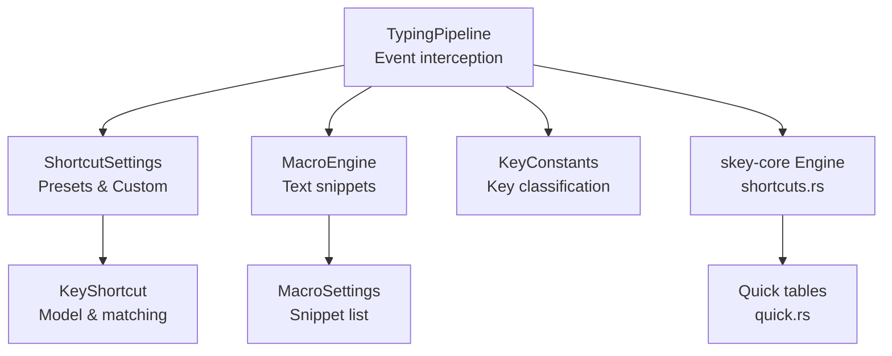
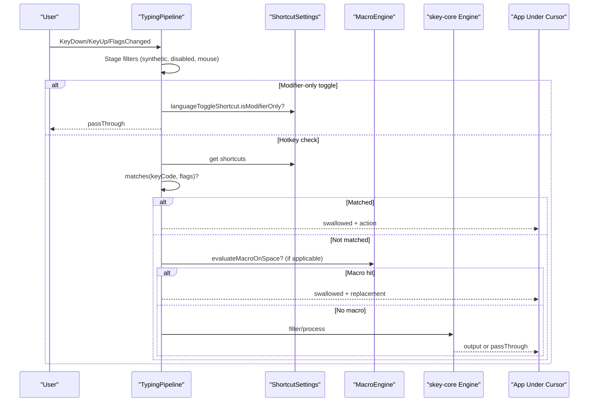
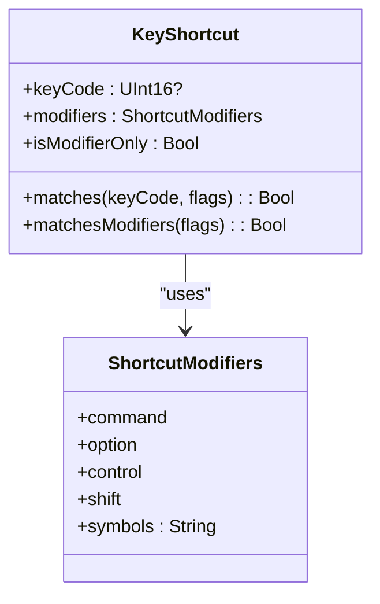
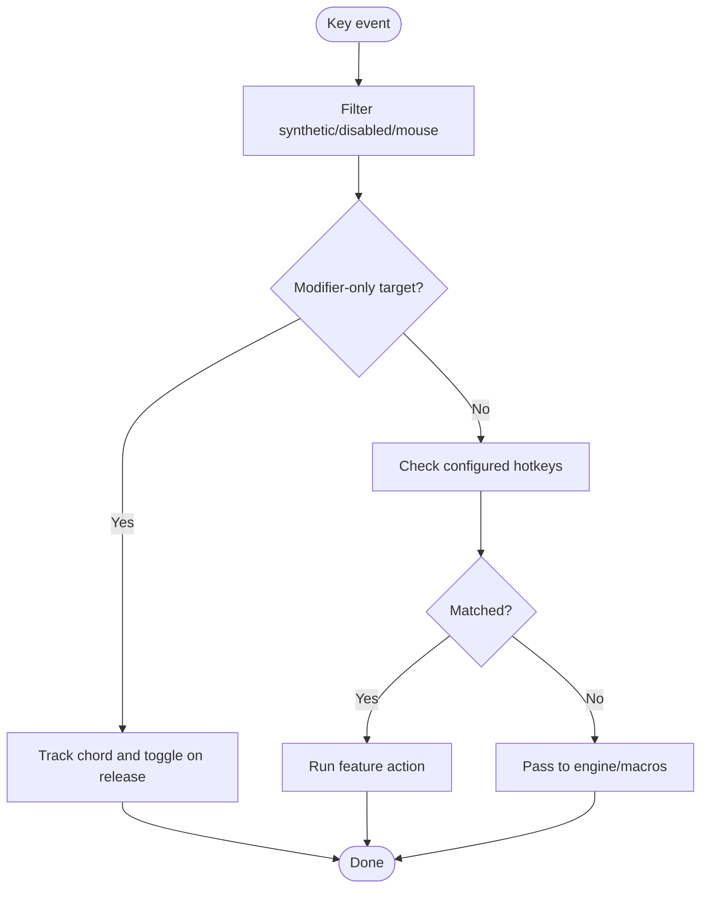
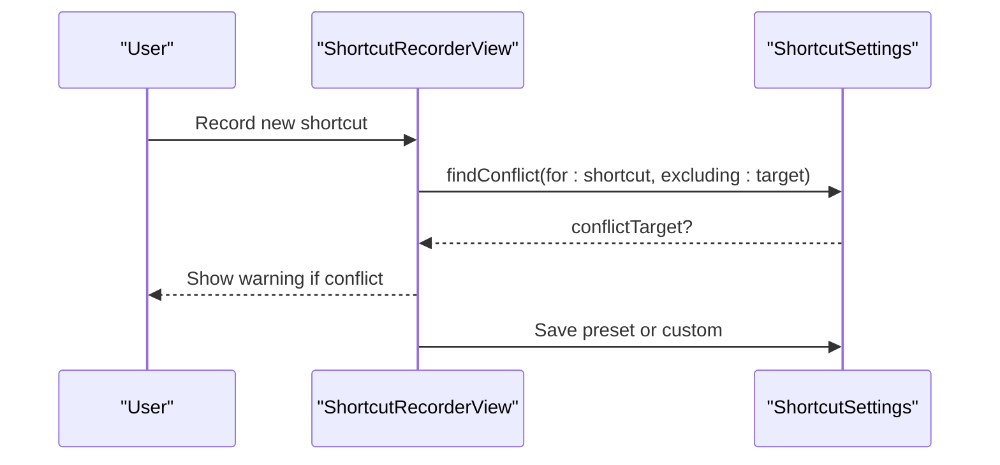
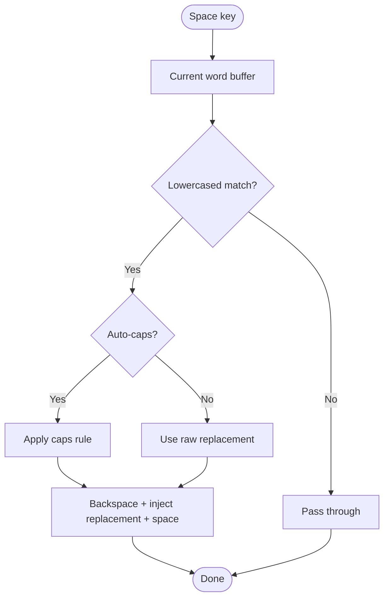
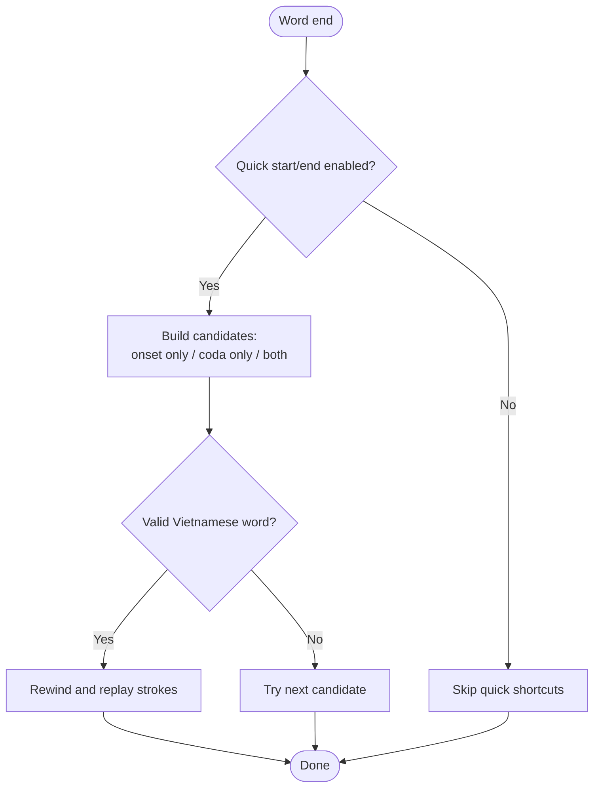
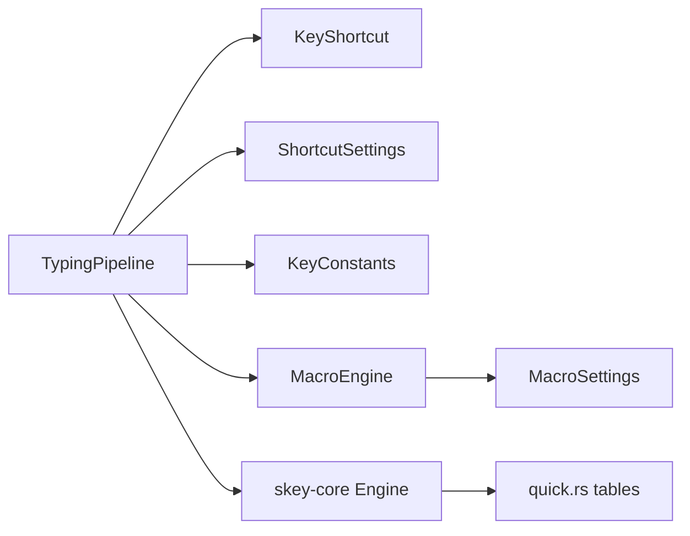

# Quick Shortcuts

<cite>
**Referenced Files in This Document**
- [TypingPipeline.swift](file://macos/skey-app/Sources/Features/Keyboard/EventHandling/Pipeline/TypingPipeline.swift)
- [KeyShortcut.swift](file://macos/skey-app/Sources/Shared/Shortcuts/KeyShortcut.swift)
- [ShortcutSettings.swift](file://macos/skey-app/Sources/Shared/Settings/Modules/ShortcutSettings.swift)
- [MacroEngine.swift](file://macos/skey-app/Sources/Features/Keyboard/Engine/MacroEngine.swift)
- [shortcuts.rs](file://port/skey-core/src/engine/shortcuts.rs)
- [quick.rs](file://port/skey-core/src/extensions/quick.rs)
- [KeyConstants.swift](file://macos/skey-app/Sources/Features/Keyboard/EventHandling/KeyConstants.swift)
- [MacroSettings.swift](file://macos/skey-app/Sources/Shared/Settings/Modules/MacroSettings.swift)
- [ShortcutRecorderView.swift](file://macos/skey-app/Sources/Shared/Shortcuts/ShortcutRecorderView.swift)
</cite>

## Table of Contents
1. [Introduction](#introduction)
2. [Project Structure](#project-structure)
3. [Core Components](#core-components)
4. [Architecture Overview](#architecture-overview)
5. [Detailed Component Analysis](#detailed-component-analysis)
6. [Dependency Analysis](#dependency-analysis)
7. [Performance Considerations](#performance-considerations)
8. [Troubleshooting Guide](#troubleshooting-guide)
9. [Conclusion](#conclusion)
10. [Appendices](#appendices)

## Introduction
This document explains the quick shortcuts system that provides instant access to frequently used text fragments and commands. It covers:
- Shortcut definition format and built-in presets
- Trigger mechanisms and execution context
- Built-in shortcuts and custom shortcut creation
- Integration with typing, macros, clipboard, cleaner, and AI features
- Matching algorithm, priority handling, and conflict resolution strategies
- Practical examples for coding, writing, and daily tasks

## Project Structure
The quick shortcuts feature spans UI configuration, event interception, core engine logic, and settings persistence:
- Event interception and hotkeys are handled by the typing pipeline
- Shortcut models and matchers define how key combinations are represented and matched
- Settings modules manage presets, custom shortcuts, and conflicts
- The core engine implements fast macro expansion and Vietnamese quick shortcuts
- Constants classify keys and provide virtual key codes

**Diagram sources**
- [TypingPipeline.swift:31-169](file://macos/skey-app/Sources/Features/Keyboard/EventHandling/Pipeline/TypingPipeline.swift#L31-L169)
- [ShortcutSettings.swift:20-329](file://macos/skey-app/Sources/Shared/Settings/Modules/ShortcutSettings.swift#L20-L329)
- [KeyShortcut.swift:68-159](file://macos/skey-app/Sources/Shared/Shortcuts/KeyShortcut.swift#L68-L159)
- [MacroEngine.swift:16-111](file://macos/skey-app/Sources/Features/Keyboard/Engine/MacroEngine.swift#L16-L111)
- [shortcuts.rs:44-180](file://port/skey-core/src/engine/shortcuts.rs#L44-L180)
- [quick.rs:10-82](file://port/skey-core/src/extensions/quick.rs#L10-L82)
- [KeyConstants.swift:7-192](file://macos/skey-app/Sources/Features/Keyboard/EventHandling/KeyConstants.swift#L7-L192)

**Section sources**
- [TypingPipeline.swift:31-169](file://macos/skey-app/Sources/Features/Keyboard/EventHandling/Pipeline/TypingPipeline.swift#L31-L169)
- [KeyConstants.swift:7-192](file://macos/skey-app/Sources/Features/Keyboard/EventHandling/KeyConstants.swift#L7-L192)

## Core Components
- KeyShortcut: Defines a shortcut as a virtual key code plus modifiers; supports modifier-only shortcuts and built-in presets.
- ShortcutSettings: Stores preset or custom shortcuts per feature (language toggle, clipboard, cleaner, AI), and detects conflicts.
- TypingPipeline: Intercepts events, checks configured shortcuts first, then passes through to composing engine or macros.
- MacroEngine: In-memory snippet expander triggered on space; supports auto-caps and English mode integration.
- skey-core shortcuts: Fast macro matching and Vietnamese quick shortcuts (doubled consonants, onset/coda expansions).
- KeyConstants: Virtual key codes and key classification for fast-path decisions.

**Section sources**
- [KeyShortcut.swift:68-159](file://macos/skey-app/Sources/Shared/Shortcuts/KeyShortcut.swift#L68-L159)
- [ShortcutSettings.swift:20-329](file://macos/skey-app/Sources/Shared/Settings/Modules/ShortcutSettings.swift#L20-L329)
- [TypingPipeline.swift:31-169](file://macos/skey-app/Sources/Features/Keyboard/EventHandling/Pipeline/TypingPipeline.swift#L31-L169)
- [MacroEngine.swift:16-111](file://macos/skey-app/Sources/Features/Keyboard/Engine/MacroEngine.swift#L16-L111)
- [shortcuts.rs:44-180](file://port/skey-core/src/engine/shortcuts.rs#L44-L180)
- [quick.rs:10-82](file://port/skey-core/src/extensions/quick.rs#L10-L82)
- [KeyConstants.swift:7-192](file://macos/skey-app/Sources/Features/Keyboard/EventHandling/KeyConstants.swift#L7-L192)

## Architecture Overview
The system processes every keystroke through a prioritized pipeline:
1. Ignore synthetic or disabled events
2. Handle mouse clicks to reset state
3. Handle modifier-only toggles (e.g., Control+Shift)
4. Check configured hotkeys (language toggle, clipboard, cleaner, AI)
5. Pass through if modifiers are held or non-keyboard events
6. Apply app exclusion rules
7. If not in Vietnamese mode and macros enabled in English mode, evaluate macros on space
8. Otherwise, pass to the composing engine for Vietnamese input

**Diagram sources**
- [TypingPipeline.swift:31-169](file://macos/skey-app/Sources/Features/Keyboard/EventHandling/Pipeline/TypingPipeline.swift#L31-L169)
- [ShortcutSettings.swift:109-245](file://macos/skey-app/Sources/Shared/Settings/Modules/ShortcutSettings.swift#L109-L245)
- [MacroEngine.swift:71-111](file://macos/skey-app/Sources/Features/Keyboard/Engine/MacroEngine.swift#L71-L111)
- [shortcuts.rs:44-180](file://port/skey-core/src/engine/shortcuts.rs#L44-L180)

## Detailed Component Analysis

### Shortcut Definition Format and Matching
- Representation: A shortcut is a struct with an optional virtual key code and a set of modifiers. Modifier-only shortcuts have no key code.
- Matching:
  - For key+modifiers: exact key code and exact modifier set must match.
  - For modifier-only: only modifiers must match exactly.
- Display helpers convert key codes to readable strings and key equivalents for menus.

**Diagram sources**
- [KeyShortcut.swift:68-159](file://macos/skey-app/Sources/Shared/Shortcuts/KeyShortcut.swift#L68-L159)

**Section sources**
- [KeyShortcut.swift:68-159](file://macos/skey-app/Sources/Shared/Shortcuts/KeyShortcut.swift#L68-L159)

### Trigger Mechanisms and Execution Context
- Hotkeys are checked early in the pipeline before any composing or macro processing.
- On match, the event is swallowed and the corresponding action runs on the main thread:
  - Language toggle
  - Clipboard popup
  - Keyboard cleaner
  - AI settings panel
  - Quick translate HUD (Option+T)
- Modifier-only toggles (e.g., Control+Shift) are detected via flagsChanged events and trigger when the exact modifier set is pressed and then released without other keys.

**Diagram sources**
- [TypingPipeline.swift:31-169](file://macos/skey-app/Sources/Features/Keyboard/EventHandling/Pipeline/TypingPipeline.swift#L31-L169)

**Section sources**
- [TypingPipeline.swift:31-169](file://macos/skey-app/Sources/Features/Keyboard/EventHandling/Pipeline/TypingPipeline.swift#L31-L169)

### Built-in Shortcuts and Presets
- Language toggle presets include Option+Z, Control+Shift, Control+Option+Z, Command+Shift, Option+Shift, Control+Space.
- Clipboard presets include Option+V, Command+Shift+V, Control+Option+V, Option+C.
- Cleaner presets include Option+Shift+K, Option+Shift+C, Control+Option+K.
- AI presets include Option+Space, Control+Option+Space, Command+Shift+Space.
- Defaults are registered and can be reset to defaults per feature.

**Section sources**
- [ShortcutSettings.swift:41-84](file://macos/skey-app/Sources/Shared/Settings/Modules/ShortcutSettings.swift#L41-L84)
- [ShortcutSettings.swift:109-245](file://macos/skey-app/Sources/Shared/Settings/Modules/ShortcutSettings.swift#L109-L245)

### Custom Shortcut Creation and Conflict Resolution
- Users can pick from presets or record a custom combination via the recorder view.
- When a custom shortcut is set, it is persisted as JSON and marked as “custom”.
- Conflict detection compares the new shortcut against all active targets (excluding the current one); if a conflict exists, a warning badge is shown in the UI.

**Diagram sources**
- [ShortcutRecorderView.swift:218-327](file://macos/skey-app/Sources/Shared/Shortcuts/ShortcutRecorderView.swift#L218-L327)
- [ShortcutSettings.swift:276-286](file://macos/skey-app/Sources/Shared/Settings/Modules/ShortcutSettings.swift#L276-L286)

**Section sources**
- [ShortcutRecorderView.swift:218-327](file://macos/skey-app/Sources/Shared/Shortcuts/ShortcutRecorderView.swift#L218-L327)
- [ShortcutSettings.swift:276-286](file://macos/skey-app/Sources/Shared/Settings/Modules/ShortcutSettings.swift#L276-L286)

### Text Snippets (Macros) and Expansion Algorithm
- Macros are stored as pairs of shortcut text and replacement text.
- The engine buffers the current word and evaluates on space:
  - Normalizes the typed string to lowercase for lookup
  - Finds a match in the in-memory map
  - Optionally applies auto-caps transformation
  - Replaces the buffered text and inserts a trailing space
- The core engine also supports macro matching at word boundaries with longest-suffix-first search and case preservation.

**Diagram sources**
- [MacroEngine.swift:71-111](file://macos/skey-app/Sources/Features/Keyboard/Engine/MacroEngine.swift#L71-L111)
- [shortcuts.rs:44-180](file://port/skey-core/src/engine/shortcuts.rs#L44-L180)

**Section sources**
- [MacroEngine.swift:71-111](file://macos/skey-app/Sources/Features/Keyboard/Engine/MacroEngine.swift#L71-L111)
- [MacroSettings.swift:18-27](file://macos/skey-app/Sources/Shared/Settings/Modules/MacroSettings.swift#L18-L27)
- [shortcuts.rs:44-180](file://port/skey-core/src/engine/shortcuts.rs#L44-L180)

### Vietnamese Quick Shortcuts (Doubled Consonants, Onset/Coda)
- Doubled consonants: typing a letter twice expands to a predefined pair (e.g., cc → ch).
- Onset shortcuts: initial letters f/j/w expand to two-character onsets.
- Coda shortcuts: final letters g/h/k expand to valid coda pairs when the rest of the word would otherwise be invalid.
- These are table-driven and applied during word-end processing.

**Diagram sources**
- [shortcuts.rs:374-515](file://port/skey-core/src/engine/shortcuts.rs#L374-L515)
- [quick.rs:10-82](file://port/skey-core/src/extensions/quick.rs#L10-L82)

**Section sources**
- [shortcuts.rs:374-515](file://port/skey-core/src/engine/shortcuts.rs#L374-L515)
- [quick.rs:10-82](file://port/skey-core/src/extensions/quick.rs#L10-L82)

### Priority Handling and Conflict Resolution Strategy
- Priority order in the pipeline:
  1. Synthetic/disabled/mouse events pass through
  2. Modifier-only toggles tracked on flagsChanged
  3. Configured hotkeys (language toggle, clipboard, cleaner, AI)
  4. Quick translate HUD (Option+T)
  5. If modifiers are held, pass through to avoid interfering with app shortcuts
  6. App exclusion bypass
  7. English-mode macros on space (if enabled)
  8. Vietnamese composing engine
- Conflict resolution:
  - UI warns when a chosen shortcut duplicates another active target
  - Cleaner shortcut can be excluded from conflict checks if the feature is disabled

**Section sources**
- [TypingPipeline.swift:31-169](file://macos/skey-app/Sources/Features/Keyboard/EventHandling/Pipeline/TypingPipeline.swift#L31-L169)
- [ShortcutSettings.swift:276-286](file://macos/skey-app/Sources/Shared/Settings/Modules/ShortcutSettings.swift#L276-L286)

## Dependency Analysis

**Diagram sources**
- [TypingPipeline.swift:31-169](file://macos/skey-app/Sources/Features/Keyboard/EventHandling/Pipeline/TypingPipeline.swift#L31-L169)
- [KeyShortcut.swift:68-159](file://macos/skey-app/Sources/Shared/Shortcuts/KeyShortcut.swift#L68-L159)
- [ShortcutSettings.swift:20-329](file://macos/skey-app/Sources/Shared/Settings/Modules/ShortcutSettings.swift#L20-L329)
- [KeyConstants.swift:7-192](file://macos/skey-app/Sources/Features/Keyboard/EventHandling/KeyConstants.swift#L7-L192)
- [MacroEngine.swift:16-111](file://macos/skey-app/Sources/Features/Keyboard/Engine/MacroEngine.swift#L16-L111)
- [MacroSettings.swift:18-27](file://macos/skey-app/Sources/Shared/Settings/Modules/MacroSettings.swift#L18-L27)
- [shortcuts.rs:44-180](file://port/skey-core/src/engine/shortcuts.rs#L44-L180)
- [quick.rs:10-82](file://port/skey-core/src/extensions/quick.rs#L10-L82)

**Section sources**
- [TypingPipeline.swift:31-169](file://macos/skey-app/Sources/Features/Keyboard/EventHandling/Pipeline/TypingPipeline.swift#L31-L169)
- [ShortcutSettings.swift:20-329](file://macos/skey-app/Sources/Shared/Settings/Modules/ShortcutSettings.swift#L20-L329)

## Performance Considerations
- Early exits for synthetic, disabled, and non-keyboard events reduce overhead.
- Fast-path classifications for function/media keys, navigation keys, backspace, and word breaks minimize engine work.
- In-memory macro map enables O(1) lookups on space.
- Table-driven quick shortcuts (doubled, onset, coda) are constant-time checks.
- Main-thread actions are dispatched asynchronously to keep the hot path responsive.

[No sources needed since this section provides general guidance]

## Troubleshooting Guide
- Hotkeys not triggering:
  - Ensure the correct preset or custom shortcut is selected for the target feature.
  - Verify no conflicting shortcut is assigned to another feature; use the conflict warning in the recorder.
  - Confirm the application is not excluded from keyboard interception.
- Macros not expanding:
  - Enable macros and ensure they are active in the desired mode (English/Vietnamese).
  - Check that the typed shortcut exists in the macro list and is not empty.
  - Auto-caps may alter casing; verify expected behavior.
- Modifier-only toggles not working:
  - Ensure the language toggle shortcut is set to a modifier-only combination.
  - Hold the exact modifier set and release without pressing other keys.

**Section sources**
- [ShortcutSettings.swift:276-286](file://macos/skey-app/Sources/Shared/Settings/Modules/ShortcutSettings.swift#L276-L286)
- [MacroSettings.swift:56-78](file://macos/skey-app/Sources/Shared/Settings/Modules/MacroSettings.swift#L56-L78)
- [TypingPipeline.swift:59-79](file://macos/skey-app/Sources/Features/Keyboard/EventHandling/Pipeline/TypingPipeline.swift#L59-L79)

## Conclusion
The quick shortcuts system combines configurable hotkeys, fast macro expansion, and Vietnamese quick shortcuts into a low-latency pipeline. Users can rely on sensible defaults, customize shortcuts safely with conflict warnings, and integrate snippets across workflows. The design separates concerns between UI, event interception, settings, and core engine logic to maintain clarity and performance.

[No sources needed since this section summarizes without analyzing specific files]

## Appendices

### Practical Examples
- Coding productivity:
  - Assign a hotkey to open your IDE’s command palette or run a build script.
  - Create macros for common boilerplate (imports, function templates) and enable them in English mode.
- Writing productivity:
  - Use macros for frequent phrases, names, and addresses.
  - Set a hotkey to open translation or dictionary tools quickly.
- Daily tasks:
  - Bind a hotkey to clipboard history to paste recent items.
  - Use a cleaner shortcut to clear sensitive content from the screen.

[No sources needed since this section provides general guidance]