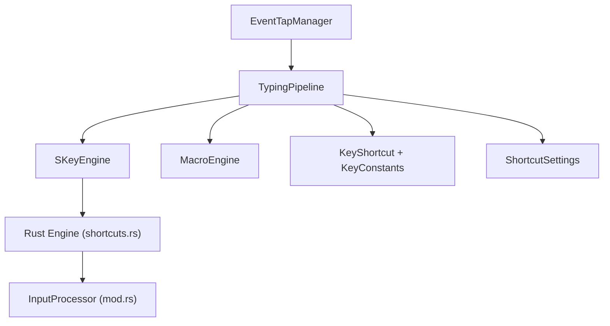
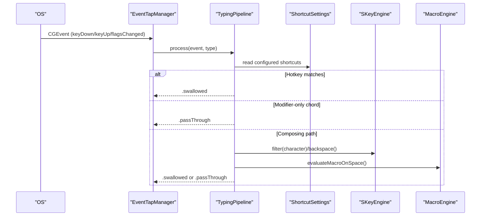
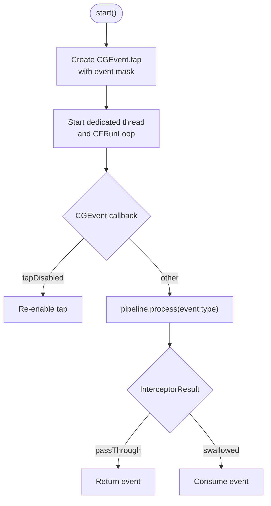
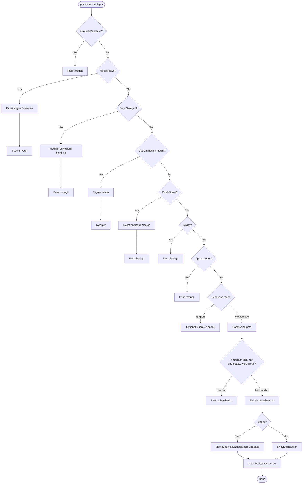
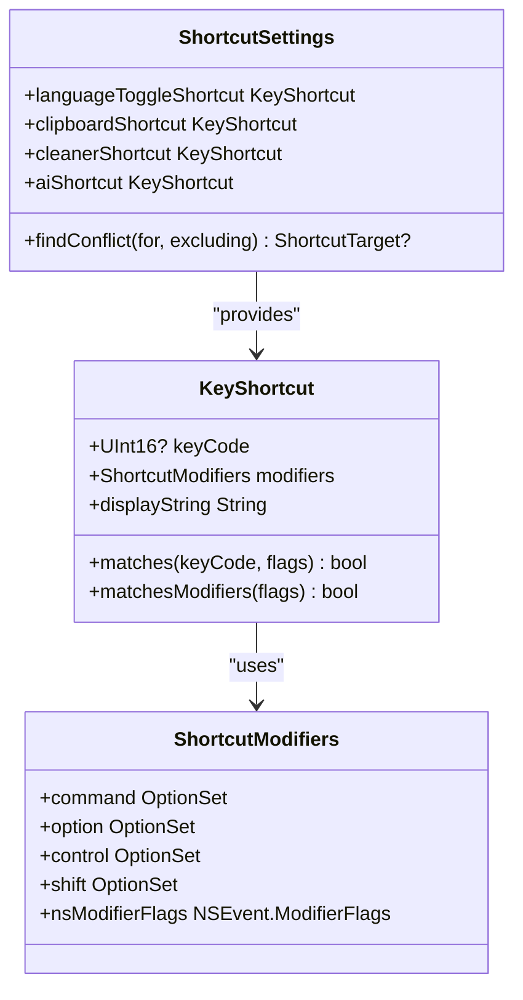
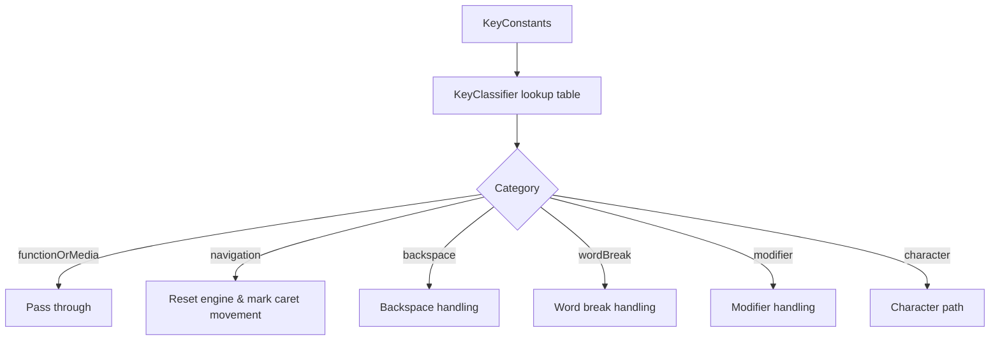
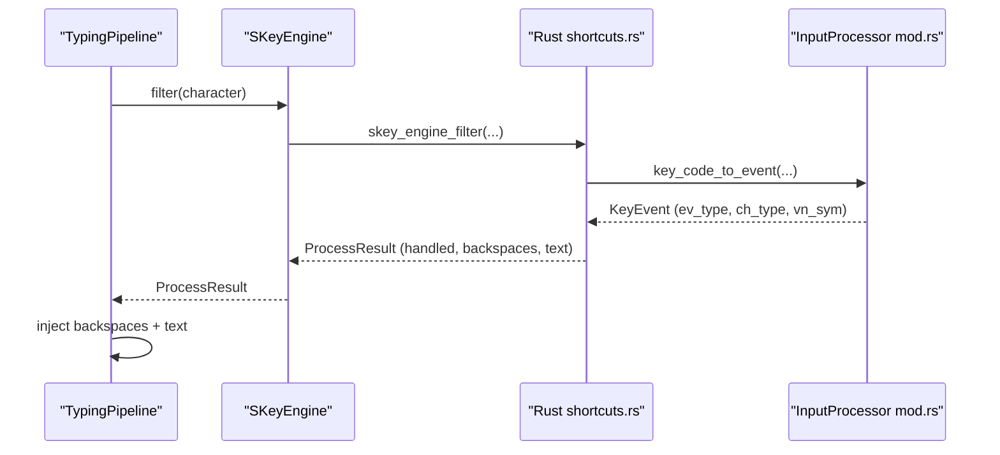
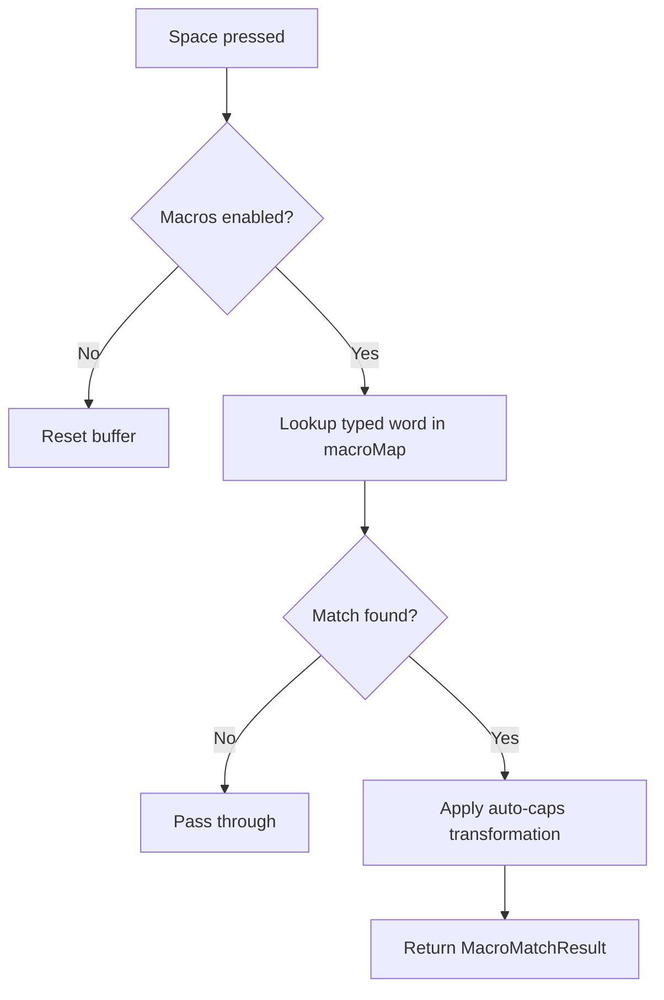
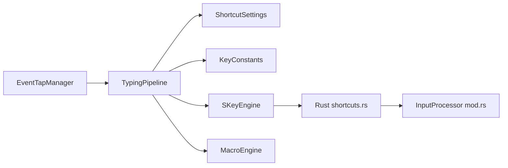

# Input Handling

<cite>
**Referenced Files in This Document**
- [EventTapManager.swift](file://macos/skey-app/Sources/Features/Keyboard/EventHandling/EventTapManager.swift)
- [TypingPipeline.swift](file://macos/skey-app/Sources/Features/Keyboard/EventHandling/Pipeline/TypingPipeline.swift)
- [KeyInterceptor.swift](file://macos/skey-app/Sources/Features/Keyboard/EventHandling/Pipeline/KeyInterceptor.swift)
- [KeyConstants.swift](file://macos/skey-app/Sources/Features/Keyboard/EventHandling/KeyConstants.swift)
- [KeyShortcut.swift](file://macos/skey-app/Sources/Shared/Shortcuts/KeyShortcut.swift)
- [ShortcutSettings.swift](file://macos/skey-app/Sources/Shared/Settings/Modules/ShortcutSettings.swift)
- [SKeyEngine.swift](file://macos/skey-app/Sources/Features/Keyboard/Engine/SKeyEngine.swift)
- [MacroEngine.swift](file://macos/skey-app/Sources/Features/Keyboard/Engine/MacroEngine.swift)
- [shortcuts.rs](file://port/skey-core/src/engine/shortcuts.rs)
- [mod.rs (input)](file://port/skey-core/src/input/mod.rs)
</cite>

## Table of Contents
1. Introduction
2. Project Structure
3. Core Components
4. Architecture Overview
5. Detailed Component Analysis
6. Dependency Analysis
7. Performance Considerations
8. Troubleshooting Guide
9. Conclusion

## Introduction
This document explains the input handling system that captures raw keystrokes, normalizes events, handles modifiers and special keys, and processes custom keyboard shortcuts. It covers how low-level events are intercepted, routed through a high-performance pipeline, matched against user-defined shortcuts, and then either passed through or transformed by the typing engine. It also documents the shortcut definition model, event parsing, key code mapping, and matching algorithms used to integrate with the main typing engine.

## Project Structure
The input handling system spans several modules:
- Low-level event capture and lifecycle management
- A multi-stage processing pipeline for hotkeys, navigation, composing, and macros
- Shortcut definitions and settings persistence
- The core typing engine wrapper and macro expansion
- Core Rust input normalization and shortcut logic

**Diagram sources**
- [EventTapManager.swift:15-103](file://macos/skey-app/Sources/Features/Keyboard/EventHandling/EventTapManager.swift#L15-L103)
- [TypingPipeline.swift:6-170](file://macos/skey-app/Sources/Features/Keyboard/EventHandling/Pipeline/TypingPipeline.swift#L6-L170)
- [SKeyEngine.swift:6-145](file://macos/skey-app/Sources/Features/Keyboard/Engine/SKeyEngine.swift#L6-L145)
- [MacroEngine.swift:14-111](file://macos/skey-app/Sources/Features/Keyboard/Engine/MacroEngine.swift#L14-L111)
- [KeyShortcut.swift:8-159](file://macos/skey-app/Sources/Shared/Shortcuts/KeyShortcut.swift#L8-L159)
- [KeyConstants.swift:7-192](file://macos/skey-app/Sources/Features/Keyboard/EventHandling/KeyConstants.swift#L7-L192)
- [ShortcutSettings.swift:20-330](file://macos/skey-app/Sources/Shared/Settings/Modules/ShortcutSettings.swift#L20-L330)
- [shortcuts.rs:19-675](file://port/skey-core/src/engine/shortcuts.rs#L19-L675)
- [mod.rs (input):1-215](file://port/skey-core/src/input/mod.rs#L1-L215)

**Section sources**
- [EventTapManager.swift:15-103](file://macos/skey-app/Sources/Features/Keyboard/EventHandling/EventTapManager.swift#L15-L103)
- [TypingPipeline.swift:6-170](file://macos/skey-app/Sources/Features/Keyboard/EventHandling/Pipeline/TypingPipeline.swift#L6-L170)

## Core Components
- EventTapManager: Creates and manages the OS-level event tap, runs it on a dedicated thread, and delegates event evaluation to the TypingPipeline.
- TypingPipeline: Multi-stage processor that filters synthetic events, handles mouse clicks, modifier-only toggles, customizable hotkeys, navigation, backspace, printable characters, app exclusions, and language mode routing.
- KeyShortcut and ShortcutSettings: Define and persist user shortcuts with presets and custom bindings; provide matching against CGEvent flags and key codes.
- SKeyEngine: High-performance wrapper around the Rust Vietnamese typing engine; configures options, resets state, and applies character filtering/backspacing.
- MacroEngine: In-memory macro expander triggered on space; tracks current word buffer and returns replacement text with backspaces.
- Rust shortcuts and input: Core algorithms for macro matching, quick telex/consonant shortcuts, and key stroke restoration.

**Section sources**
- [EventTapManager.swift:15-103](file://macos/skey-app/Sources/Features/Keyboard/EventHandling/EventTapManager.swift#L15-L103)
- [TypingPipeline.swift:6-170](file://macos/skey-app/Sources/Features/Keyboard/EventHandling/Pipeline/TypingPipeline.swift#L6-L170)
- [KeyShortcut.swift:8-159](file://macos/skey-app/Sources/Shared/Shortcuts/KeyShortcut.swift#L8-L159)
- [ShortcutSettings.swift:20-330](file://macos/skey-app/Sources/Shared/Settings/Modules/ShortcutSettings.swift#L20-L330)
- [SKeyEngine.swift:6-145](file://macos/skey-app/Sources/Features/Keyboard/Engine/SKeyEngine.swift#L6-L145)
- [MacroEngine.swift:14-111](file://macos/skey-app/Sources/Features/Keyboard/Engine/MacroEngine.swift#L14-L111)
- [shortcuts.rs:19-675](file://port/skey-core/src/engine/shortcuts.rs#L19-L675)
- [mod.rs (input):1-215](file://port/skey-core/src/input/mod.rs#L1-L215)

## Architecture Overview
The system uses a Chain of Responsibility pattern via KeyInterceptor to process events. EventTapManager creates an OS event tap and routes each event to TypingPipeline.process. The pipeline performs staged checks:
- Pass-through synthetic events and disabled taps
- Handle mouse clicks to reset state
- Handle modifier-only chords and customizable hotkeys
- Reset state on command/control/option combinations
- Route to English mode macros or Vietnamese composing
- Apply fast paths for function/media, navigation, backspace, and structural keys
- Inject output via KeyEventSender when swallowed

**Diagram sources**
- [EventTapManager.swift:81-103](file://macos/skey-app/Sources/Features/Keyboard/EventHandling/EventTapManager.swift#L81-L103)
- [TypingPipeline.swift:31-170](file://macos/skey-app/Sources/Features/Keyboard/EventHandling/Pipeline/TypingPipeline.swift#L31-L170)
- [ShortcutSettings.swift:109-245](file://macos/skey-app/Sources/Shared/Settings/Modules/ShortcutSettings.swift#L109-L245)
- [SKeyEngine.swift:121-145](file://macos/skey-app/Sources/Features/Keyboard/Engine/SKeyEngine.swift#L121-L145)
- [MacroEngine.swift:71-111](file://macos/skey-app/Sources/Features/Keyboard/Engine/MacroEngine.swift#L71-L111)

## Detailed Component Analysis

### Event Capture and Lifecycle (EventTapManager)
- Creates an event tap with interest masks for keyDown, keyUp, flagsChanged, and mouse down events.
- Runs the tap on a dedicated high-priority thread with its own run loop.
- Delegates all event evaluation to TypingPipeline and decides whether to pass through or swallow events.
- Manages language toggle state safely across threads using os_unfair_lock and updates UI/settings on the main queue.

**Diagram sources**
- [EventTapManager.swift:81-103](file://macos/skey-app/Sources/Features/Keyboard/EventHandling/EventTapManager.swift#L81-L103)
- [EventTapManager.swift:127-168](file://macos/skey-app/Sources/Features/Keyboard/EventHandling/EventTapManager.swift#L127-L168)
- [EventTapManager.swift:172-188](file://macos/skey-app/Sources/Features/Keyboard/EventHandling/EventTapManager.swift#L172-L188)

**Section sources**
- [EventTapManager.swift:81-103](file://macos/skey-app/Sources/Features/Keyboard/EventHandling/EventTapManager.swift#L81-L103)
- [EventTapManager.swift:127-168](file://macos/skey-app/Sources/Features/Keyboard/EventHandling/EventTapManager.swift#L127-L168)
- [EventTapManager.swift:172-188](file://macos/skey-app/Sources/Features/Keyboard/EventHandling/EventTapManager.swift#L172-L188)

### Pipeline Processing (TypingPipeline)
Stages:
1. Pass-through synthetic events and disabled taps.
2. Mouse click handling resets engine and macro state.
3. Modifier-only chord detection for language toggle.
4. Customizable hotkey matching (language toggle, clipboard, cleaner, AI).
5. Command/Control/Option combinations reset state and pass through.
6. KeyUp passes through without altering engine state.
7. App exclusion bypass.
8. Language mode routing:
   - English mode: optional macro expansion on space.
   - Vietnamese mode: composing via SKeyEngine; fast paths for function/media, navigation, backspace, and structural keys.
9. Printable ASCII range handling:
   - Space triggers macro expansion.
   - Character goes through engine.filter; if handled, injects backspaces and text.
   - If not handled, attempts smart context recomposition when caret moved.

**Diagram sources**
- [TypingPipeline.swift:31-170](file://macos/skey-app/Sources/Features/Keyboard/EventHandling/Pipeline/TypingPipeline.swift#L31-L170)
- [TypingPipeline.swift:174-280](file://macos/skey-app/Sources/Features/Keyboard/EventHandling/Pipeline/TypingPipeline.swift#L174-L280)
- [TypingPipeline.swift:284-330](file://macos/skey-app/Sources/Features/Keyboard/EventHandling/Pipeline/TypingPipeline.swift#L284-L330)

**Section sources**
- [TypingPipeline.swift:31-170](file://macos/skey-app/Sources/Features/Keyboard/EventHandling/Pipeline/TypingPipeline.swift#L31-L170)
- [TypingPipeline.swift:174-280](file://macos/skey-app/Sources/Features/Keyboard/EventHandling/Pipeline/TypingPipeline.swift#L174-L280)
- [TypingPipeline.swift:284-330](file://macos/skey-app/Sources/Features/Keyboard/EventHandling/Pipeline/TypingPipeline.swift#L284-L330)

### Shortcut Model and Matching (KeyShortcut and ShortcutSettings)
- KeyShortcut encodes a virtual key code and modifier set; supports built-in presets and display formatting.
- Matching methods compare incoming CGEventFlags and keyCode against stored definitions.
- ShortcutSettings provides preset collections and custom storage; resolves active shortcut per target (language toggle, clipboard, cleaner, AI).
- Conflict detection prevents duplicate shortcuts across targets.

**Diagram sources**
- [KeyShortcut.swift:8-159](file://macos/skey-app/Sources/Shared/Shortcuts/KeyShortcut.swift#L8-L159)
- [ShortcutSettings.swift:20-330](file://macos/skey-app/Sources/Shared/Settings/Modules/ShortcutSettings.swift#L20-L330)

**Section sources**
- [KeyShortcut.swift:8-159](file://macos/skey-app/Sources/Shared/Shortcuts/KeyShortcut.swift#L8-L159)
- [ShortcutSettings.swift:20-330](file://macos/skey-app/Sources/Shared/Settings/Modules/ShortcutSettings.swift#L20-L330)

### Key Code Mapping and Classification (KeyConstants and KeyClassifier)
- KeyConstants defines Carbon virtual key codes for letters, numbers, punctuation, navigation, function/media keys, and modifiers.
- KeyClassifier maps key codes to categories (character, backspace, navigation, wordBreak, functionOrMedia, modifier) for fast-path decisions in the pipeline.

**Diagram sources**
- [KeyConstants.swift:7-192](file://macos/skey-app/Sources/Features/Keyboard/EventHandling/KeyConstants.swift#L7-L192)

**Section sources**
- [KeyConstants.swift:7-192](file://macos/skey-app/Sources/Features/Keyboard/EventHandling/KeyConstants.swift#L7-L192)

### Typing Engine Integration (SKeyEngine and Rust shortcuts)
- SKeyEngine configures the Rust engine (input method, charset, options), resets state, sets caps state, and processes characters/backspaces.
- Rust shortcuts module implements macro matching, quick telex/consonant shortcuts, and key stroke restoration logic used during composing.
- InputProcessor normalizes key codes into internal KeyEvent structures with character types and event types.

**Diagram sources**
- [SKeyEngine.swift:121-145](file://macos/skey-app/Sources/Features/Keyboard/Engine/SKeyEngine.swift#L121-L145)
- [shortcuts.rs:19-675](file://port/skey-core/src/engine/shortcuts.rs#L19-L675)
- [mod.rs (input):162-215](file://port/skey-core/src/input/mod.rs#L162-L215)

**Section sources**
- [SKeyEngine.swift:6-145](file://macos/skey-app/Sources/Features/Keyboard/Engine/SKeyEngine.swift#L6-L145)
- [shortcuts.rs:19-675](file://port/skey-core/src/engine/shortcuts.rs#L19-L675)
- [mod.rs (input):1-215](file://port/skey-core/src/input/mod.rs#L1-L215)

### Macro Expansion (MacroEngine)
- Tracks current word buffer and resets on spaces/newlines or backspace.
- On space, looks up lowercase key in macro map; returns replacement with auto-caps support and required backspaces.
- Integrated in both English and Vietnamese modes for space-triggered expansions.

**Diagram sources**
- [MacroEngine.swift:14-111](file://macos/skey-app/Sources/Features/Keyboard/Engine/MacroEngine.swift#L14-L111)

**Section sources**
- [MacroEngine.swift:14-111](file://macos/skey-app/Sources/Features/Keyboard/Engine/MacroEngine.swift#L14-L111)

## Dependency Analysis
- EventTapManager depends on TypingPipeline for all event logic and on SKeyEngine for language state changes.
- TypingPipeline depends on ShortcutSettings for hotkey configuration, KeyConstants for key classification, and SKeyEngine/MacroEngine for transformations.
- SKeyEngine wraps Rust engine APIs; shortcuts.rs and input/mod.rs implement core algorithms and normalization.
- KeyShortcut and ShortcutSettings form the user-facing shortcut model and persistence layer.

**Diagram sources**
- [EventTapManager.swift:15-103](file://macos/skey-app/Sources/Features/Keyboard/EventHandling/EventTapManager.swift#L15-L103)
- [TypingPipeline.swift:6-170](file://macos/skey-app/Sources/Features/Keyboard/EventHandling/Pipeline/TypingPipeline.swift#L6-L170)
- [SKeyEngine.swift:6-145](file://macos/skey-app/Sources/Features/Keyboard/Engine/SKeyEngine.swift#L6-L145)
- [shortcuts.rs:19-675](file://port/skey-core/src/engine/shortcuts.rs#L19-L675)
- [mod.rs (input):1-215](file://port/skey-core/src/input/mod.rs#L1-L215)

**Section sources**
- [EventTapManager.swift:15-103](file://macos/skey-app/Sources/Features/Keyboard/EventHandling/EventTapManager.swift#L15-L103)
- [TypingPipeline.swift:6-170](file://macos/skey-app/Sources/Features/Keyboard/EventHandling/Pipeline/TypingPipeline.swift#L6-L170)
- [SKeyEngine.swift:6-145](file://macos/skey-app/Sources/Features/Keyboard/Engine/SKeyEngine.swift#L6-L145)
- [shortcuts.rs:19-675](file://port/skey-core/src/engine/shortcuts.rs#L19-L675)
- [mod.rs (input):1-215](file://port/skey-core/src/input/mod.rs#L1-L215)

## Performance Considerations
- Dedicated thread and CFRunLoop for event tap minimize latency and avoid blocking the main thread.
- os_unfair_lock used for critical sections to reduce overhead compared to NSLock.
- Fast-path classifications via KeyClassifier avoid expensive checks for function/media, navigation, backspace, and structural keys.
- Stack-allocated buffers in SKeyEngine read operations prevent heap allocations on the hot path.
- MacroEngine maintains a compact in-memory map and bounded word buffer to keep lookups O(1) and memory usage minimal.

[No sources needed since this section provides general guidance]

## Troubleshooting Guide
Common issues and resolutions:
- Event tap disabled by timeout/user input: The pipeline passes through such events; EventTapManager re-enables the tap automatically.
- No response to custom shortcuts: Verify ShortcutSettings resolve correct KeyShortcut and that matches(keyCode, flags) aligns with actual CGEventFlags.
- Conflicting shortcuts: Use ShortcutSettings.findConflict to detect duplicates across targets.
- Unexpected behavior in excluded apps: Ensure AppFocusObserver reports correct bundle ID and exclusion list is applied before composing path.
- Macro not expanding: Confirm MacroEngine.enabled and that the typed word exists in the macro map; check auto-caps behavior.

**Section sources**
- [EventTapManager.swift:172-188](file://macos/skey-app/Sources/Features/Keyboard/EventHandling/EventTapManager.swift#L172-L188)
- [TypingPipeline.swift:31-170](file://macos/skey-app/Sources/Features/Keyboard/EventHandling/Pipeline/TypingPipeline.swift#L31-L170)
- [ShortcutSettings.swift:247-330](file://macos/skey-app/Sources/Shared/Settings/Modules/ShortcutSettings.swift#L247-L330)
- [MacroEngine.swift:71-111](file://macos/skey-app/Sources/Features/Keyboard/Engine/MacroEngine.swift#L71-L111)

## Conclusion
The input handling system combines robust OS-level event capture with a highly optimized pipeline that separates concerns for hotkeys, navigation, composing, and macros. Shortcuts are defined via a clear model and persisted with presets and custom bindings. The integration with the Rust-based typing engine ensures efficient Vietnamese composition while supporting flexible macro expansions. Together, these components deliver responsive, configurable, and reliable keyboard interaction.

[No sources needed since this section summarizes without analyzing specific files]