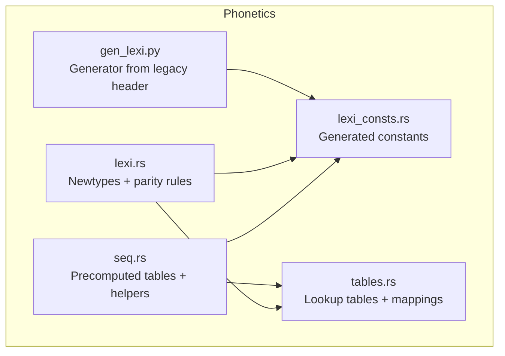
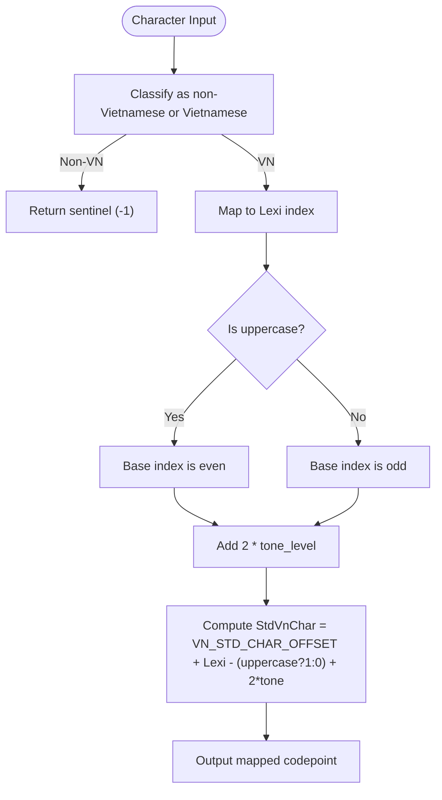
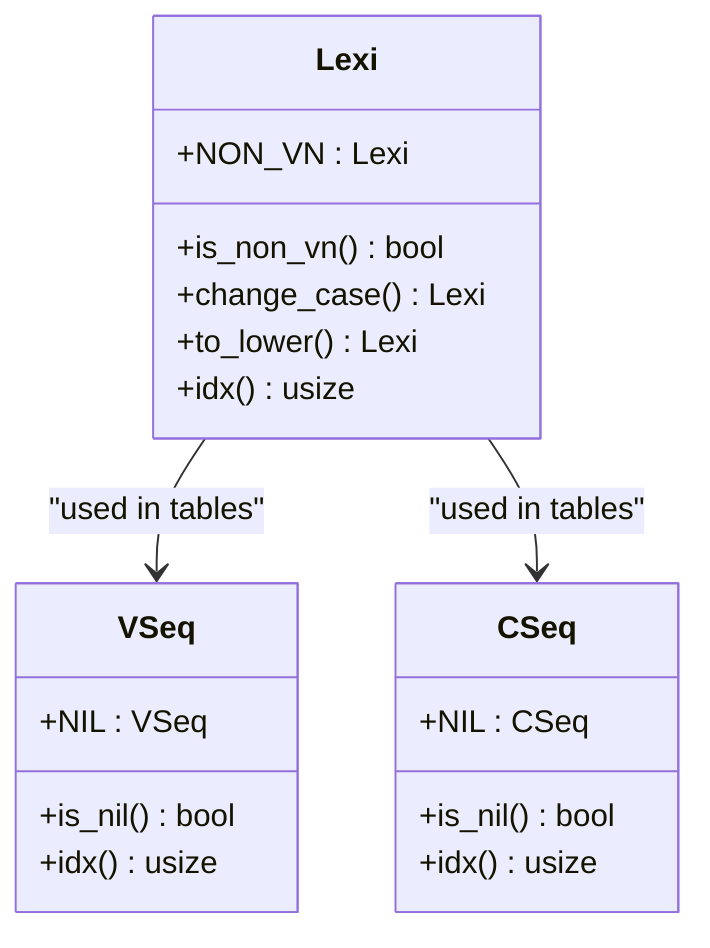
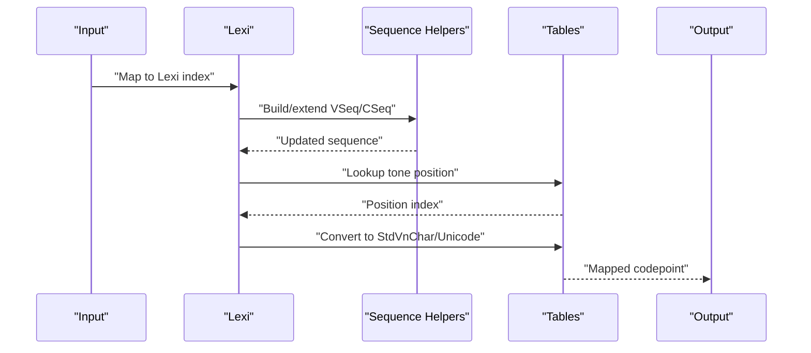
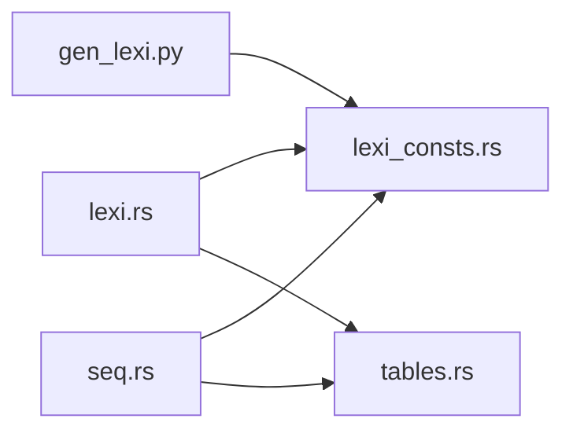

# Lexi Encoding System

<cite>
**Referenced Files in This Document**
- [lexi.rs](file://port/skey-core/src/phonetics/lexi.rs)
- [lexi_consts.rs](file://port/skey-core/src/phonetics/lexi_consts.rs)
- [seq.rs](file://port/skey-core/src/phonetics/seq.rs)
- [tables.rs](file://port/skey-core/src/phonetics/tables.rs)
- [gen_lexi.py](file://port/tablegen/gen_lexi.py)
</cite>

## Table of Contents
1. [Introduction](#introduction)
2. [Project Structure](#project-structure)
3. [Core Components](#core-components)
4. [Architecture Overview](#architecture-overview)
5. [Detailed Component Analysis](#detailed-component-analysis)
6. [Dependency Analysis](#dependency-analysis)
7. [Performance Considerations](#performance-considerations)
8. [Troubleshooting Guide](#troubleshooting-guide)
9. [Conclusion](#conclusion)

## Introduction
This document explains the Lexi encoding system used to represent Vietnamese characters with a compact numeric scheme. The design encodes case and tone directly into small integer indices, enabling fast table-driven processing. It covers:
- The numeric encoding where even indices are uppercase and odd indices are lowercase
- Tone levels encoded as +2 per level from a base character
- The StdVnChar offset (0x10000) and how it relates to Lexi indices
- Compile-time assertions that keep tables and engine consistent
- Newtypes Lexi, VSeq, CSeq and their methods for case manipulation, validation, and indexing
- Examples of transformations and the parity bit system for case handling

## Project Structure
The Lexi subsystem lives under the phonetics module and is composed of:
- Core newtypes and arithmetic: lexi.rs
- Generated constants for all Lexi/VSeq/CSeq symbols: lexi_consts.rs
- Precomputed sequence tables and helpers: seq.rs
- Large lookup tables derived from the original engine: tables.rs
- Code generator that emits constants from the legacy header: gen_lexi.py

**Diagram sources**
- [lexi.rs:1-15](file://port/skey-core/src/phonetics/lexi.rs#L1-L15)
- [lexi_consts.rs:1-8](file://port/skey-core/src/phonetics/lexi_consts.rs#L1-L8)
- [seq.rs:1-20](file://port/skey-core/src/phonetics/seq.rs#L1-L20)
- [tables.rs:1-7](file://port/skey-core/src/phonetics/tables.rs#L1-L7)
- [gen_lexi.py:1-7](file://port/tablegen/gen_lexi.py#L1-L7)

**Section sources**
- [lexi.rs:1-15](file://port/skey-core/src/phonetics/lexi.rs#L1-L15)
- [lexi_consts.rs:1-8](file://port/skey-core/src/phonetics/lexi_consts.rs#L1-L8)
- [seq.rs:1-20](file://port/skey-core/src/phonetics/seq.rs#L1-L20)
- [tables.rs:1-7](file://port/skey-core/src/phonetics/tables.rs#L1-L7)
- [gen_lexi.py:1-7](file://port/tablegen/gen_lexi.py#L1-L7)

## Core Components
- Lexi: A typed index over the Vietnamese lexical alphabet. Even indices encode uppercase; odd indices encode lowercase. Tone steps add +2 per level from the base.
- VSeq: Index into vowel sequence table; -1 denotes nil.
- CSeq: Index into consonant sequence table; -1 denotes nil.
- Constants: lexicon entries for all vowels/consonants and sequences, generated from the legacy header to ensure order stability.
- Tables: Lookup tables for ISO/Unicode mapping, Telex/VNI/ViQR mappings, and validity checks.

Key invariants enforced at compile time:
- Parity rule: lowercase = uppercase + 1
- Tone step: each tone level adds +2
- Specific ordering constraints for special characters (e.g., “a with roof” after six tones)
- Last char boundary ensures table size consistency

**Section sources**
- [lexi.rs:16-66](file://port/skey-core/src/phonetics/lexi.rs#L16-L66)
- [lexi.rs:98-109](file://port/skey-core/src/phonetics/lexi.rs#L98-L109)
- [lexi_consts.rs:9-196](file://port/skey-core/src/phonetics/lexi_consts.rs#L9-L196)
- [lexi_consts.rs:198-301](file://port/skey-core/src/phonetics/lexi_consts.rs#L198-L301)

## Architecture Overview
The Lexi encoding maps Vietnamese characters to compact integers. Case is stored in the least significant bit (parity), and tone is stored by stepping +2 per tone level from the base character. This allows simple bitwise and arithmetic operations for case toggling and tone adjustments.

**Diagram sources**
- [lexi.rs:1-15](file://port/skey-core/src/phonetics/lexi.rs#L1-L15)
- [lexi.rs:94-96](file://port/skey-core/src/phonetics/lexi.rs#L94-L96)
- [tables.rs:190-213](file://port/skey-core/src/phonetics/tables.rs#L190-L213)

**Section sources**
- [lexi.rs:1-15](file://port/skey-core/src/phonetics/lexi.rs#L1-L15)
- [lexi.rs:94-96](file://port/skey-core/src/phonetics/lexi.rs#L94-L96)
- [tables.rs:190-213](file://port/skey-core/src/phonetics/tables.rs#L190-L213)

## Detailed Component Analysis

### Numeric Encoding Scheme and Parity Bit
- Even indices represent uppercase; odd indices represent lowercase. Flipping the least significant bit toggles case.
- Each tone level adds +2 to the base index. For example, if base A is even, its first tone form is base+2, second tone base+4, etc.
- Non-Vietnamese characters use a sentinel value (-1).

Examples of transformations:
- Toggle case: add/subtract 1 depending on current parity
- Lowercase: force odd parity
- Uppercase: force even parity
- Apply tone: add 2 * tone_level

These operations are implemented as efficient inline functions on Lexi.

**Section sources**
- [lexi.rs:29-66](file://port/skey-core/src/phonetics/lexi.rs#L29-L66)
- [lexi_consts.rs:9-196](file://port/skey-core/src/phonetics/lexi_consts.rs#L9-L196)

### StdVnChar Offset and Mapping
- The standard Vietnamese character space uses an offset of 0x10000.
- A Lexi index can be converted to a StdVnChar by adding the offset, adjusting for capitalization, and adding twice the tone level.
- The tables include mappings between Lexi and Unicode/ISO representations for output and input conversion.

Practical implications:
- Fast conversion via constant addition and bit operations
- Consistent layout across engines due to compile-time assertions

**Section sources**
- [lexi.rs:94-96](file://port/skey-core/src/phonetics/lexi.rs#L94-L96)
- [tables.rs:190-213](file://port/skey-core/src/phonetics/tables.rs#L190-L213)

### Compile-Time Assertions for Table Consistency
The system asserts critical invariants at compile time to prevent silent misalignment between tables and engine logic:
- Parity: lowercase equals uppercase + 1
- Tone step: each tone level is +2
- Ordering: specific characters like “a with roof” follow expected positions
- Boundary: last character index matches expected size

If any assertion fails, the build stops, ensuring data integrity.

**Section sources**
- [lexi.rs:98-109](file://port/skey-core/src/phonetics/lexi.rs#L98-L109)
- [gen_lexi.py:1-7](file://port/tablegen/gen_lexi.py#L1-L7)

### Newtypes: Lexi, VSeq, CSeq
- Lexi wraps i16 with methods:
  - change_case: flips parity bit
  - to_lower: forces odd parity
  - idx: safe indexing with debug assertions
- VSeq wraps i16 with:
  - NIL sentinel
  - is_nil check
  - idx with debug assertions
- CSeq wraps i16 with:
  - NIL sentinel
  - is_nil check
  - idx with debug assertions

These types encapsulate invariants and provide safe access patterns.

**Diagram sources**
- [lexi.rs:16-92](file://port/skey-core/src/phonetics/lexi.rs#L16-L92)

**Section sources**
- [lexi.rs:16-92](file://port/skey-core/src/phonetics/lexi.rs#L16-L92)

### Sequence Tables and Helpers
- Vowel and consonant sequences are represented by compact indices.
- Precomputed tables enable O(1) lookups for:
  - Single symbol to sequence mapping
  - Extending sequences by one symbol
  - Removing roofs/hooks from sequences
  - Determining tone position based on sequence, termination, and modern style
  - Validating consonant-vowel combinations using bitmasks

These helpers replace runtime searches with single array loads, improving performance significantly.

**Section sources**
- [seq.rs:22-75](file://port/skey-core/src/phonetics/seq.rs#L22-L75)
- [seq.rs:107-221](file://port/skey-core/src/phonetics/seq.rs#L107-L221)
- [seq.rs:223-328](file://port/skey-core/src/phonetics/seq.rs#L223-L328)
- [seq.rs:330-451](file://port/skey-core/src/phonetics/seq.rs#L330-L451)

### Generation and Validation Flow
The flow from input to output involves:
- Mapping input to Lexi
- Building or updating VSeq/CSeq
- Determining tone position
- Converting to StdVnChar or Unicode

**Diagram sources**
- [seq.rs:263-328](file://port/skey-core/src/phonetics/seq.rs#L263-L328)
- [seq.rs:383-386](file://port/skey-core/src/phonetics/seq.rs#L383-L386)
- [tables.rs:190-213](file://port/skey-core/src/phonetics/tables.rs#L190-L213)

## Dependency Analysis
- lexi.rs depends on lexi_consts.rs for symbol definitions and on tables.rs for mappings.
- seq.rs depends on both lexi_consts.rs and tables.rs to build precomputed tables.
- gen_lexi.py generates lexi_consts.rs from the legacy header, ensuring order stability.

**Diagram sources**
- [gen_lexi.py:1-7](file://port/tablegen/gen_lexi.py#L1-L7)
- [lexi.rs:1-15](file://port/skey-core/src/phonetics/lexi.rs#L1-L15)
- [seq.rs:1-20](file://port/skey-core/src/phonetics/seq.rs#L1-L20)
- [tables.rs:1-7](file://port/skey-core/src/phonetics/tables.rs#L1-L7)

**Section sources**
- [gen_lexi.py:1-7](file://port/tablegen/gen_lexi.py#L1-L7)
- [lexi.rs:1-15](file://port/skey-core/src/phonetics/lexi.rs#L1-L15)
- [seq.rs:1-20](file://port/skey-core/src/phonetics/seq.rs#L1-L20)
- [tables.rs:1-7](file://port/skey-core/src/phonetics/tables.rs#L1-L7)

## Performance Considerations
- All sequence operations are reduced to single array loads via precomputed tables, avoiding runtime searches.
- Tone position calculation is a direct table lookup indexed by sequence, termination flag, and modern style.
- Case and tone manipulations use simple arithmetic/bitwise operations on small integers.
- Compile-time assertions prevent costly runtime checks and ensure correctness.

[No sources needed since this section provides general guidance]

## Troubleshooting Guide
Common issues and resolutions:
- Build failures due to compile-time assertions indicate mismatched table order or missing symbols. Regenerate constants using the generator and rebuild.
- Incorrect case/tone behavior suggests misuse of Lexi methods; ensure to use change_case/to_lower rather than manual arithmetic.
- Unexpected nil sequences occur when extending invalid sequences; validate inputs before calling extend functions.

**Section sources**
- [lexi.rs:98-109](file://port/skey-core/src/phonetics/lexi.rs#L98-L109)
- [seq.rs:263-328](file://port/skey-core/src/phonetics/seq.rs#L263-L328)
- [gen_lexi.py:1-7](file://port/tablegen/gen_lexi.py#L1-L7)

## Conclusion
The Lexi encoding system provides a compact, efficient representation for Vietnamese characters with built-in support for case and tone. Its design leverages parity bits and arithmetic offsets to minimize runtime overhead while maintaining strict invariants through compile-time assertions. The newtypes and precomputed tables offer safe, high-performance interfaces for building and manipulating Vietnamese text within the engine.

[No sources needed since this section summarizes without analyzing specific files]