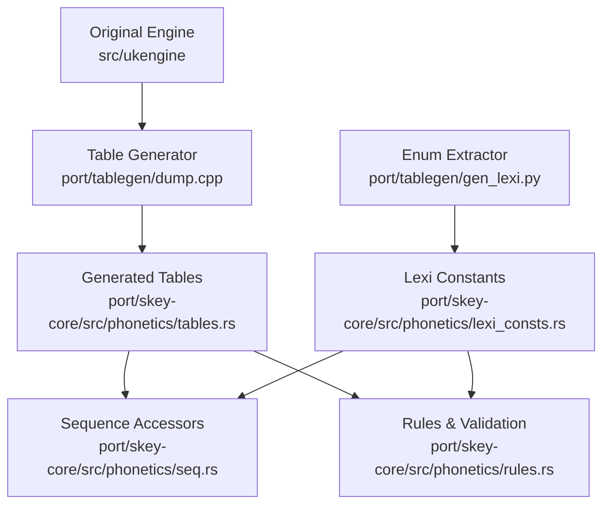
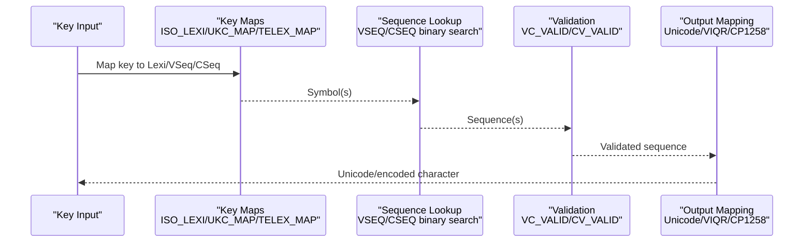
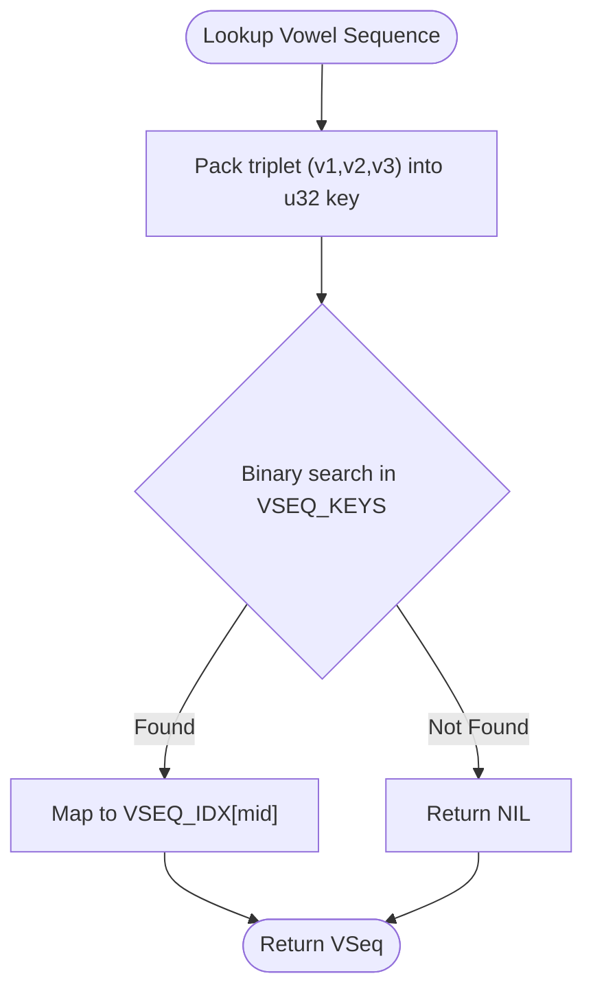
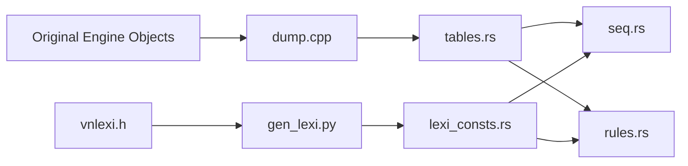

# Lookup Tables

<cite>
**Referenced Files in This Document**
- [tables.rs](file://port/skey-core/src/phonetics/tables.rs)
- [lexi.rs](file://port/skey-core/src/phonetics/lexi.rs)
- [rules.rs](file://port/skey-core/src/phonetics/rules.rs)
- [seq.rs](file://port/skey-core/src/phonetics/seq.rs)
- [dump.cpp](file://port/tablegen/dump.cpp)
- [gen_lexi.py](file://port/tablegen/gen_lexi.py)
- [vnlexi.h](file://src/ukengine/vnlexi.h)
</cite>

## Table of Contents
1. [Introduction](#introduction)
2. [Project Structure](#project-structure)
3. [Core Components](#core-components)
4. [Architecture Overview](#architecture-overview)
5. [Detailed Component Analysis](#detailed-component-analysis)
6. [Dependency Analysis](#dependency-analysis)
7. [Performance Considerations](#performance-considerations)
8. [Troubleshooting Guide](#troubleshooting-guide)
9. [Conclusion](#conclusion)

## Introduction
This document explains the table-driven architecture that provides fast access to Vietnamese phonetic data for keyboard-to-character conversion. The system stores mappings between keyboard inputs, phonetic representations (vowels, consonants, tones), and output characters using compact, precomputed tables. These tables enable sub-microsecond lookups by replacing runtime searches with direct array indexing, bitmaps, and binary search over sorted keys. The tables are generated from the original C++ engine to ensure consistency and correctness across ports.

## Project Structure
The lookup tables live under the phonetics module and are consumed by sequence processing and rules:
- Core tables and constants: port/skey-core/src/phonetics/tables.rs
- Lexical types and invariants: port/skey-core/src/phonetics/lexi.rs
- Sequence generation and fast accessors: port/skey-core/src/phonetics/seq.rs
- Phonotactic validation and lookup helpers: port/skey-core/src/phonetics/rules.rs
- Table generator (C++): port/tablegen/dump.cpp
- Enum extractor (Python): port/tablegen/gen_lexi.py
- Original engine enums: src/ukengine/vnlexi.h

**Diagram sources**
- [dump.cpp:1-276](file://port/tablegen/dump.cpp#L1-L276)
- [gen_lexi.py:1-51](file://port/tablegen/gen_lexi.py#L1-L51)
- [tables.rs:1-696](file://port/skey-core/src/phonetics/tables.rs#L1-L696)
- [lexi.rs:1-110](file://port/skey-core/src/phonetics/lexi.rs#L1-L110)
- [seq.rs:1-451](file://port/skey-core/src/phonetics/seq.rs#L1-L451)
- [rules.rs:1-246](file://port/skey-core/src/phonetics/rules.rs#L1-L246)

**Section sources**
- [dump.cpp:1-276](file://port/tablegen/dump.cpp#L1-L276)
- [gen_lexi.py:1-51](file://port/tablegen/gen_lexi.py#L1-L51)
- [tables.rs:1-696](file://port/skey-core/src/phonetics/tables.rs#L1-L696)
- [lexi.rs:1-110](file://port/skey-core/src/phonetics/lexi.rs#L1-L110)
- [seq.rs:1-451](file://port/skey-core/src/phonetics/seq.rs#L1-L451)
- [rules.rs:1-246](file://port/skey-core/src/phonetics/rules.rs#L1-L246)
- [vnlexi.h:1-163](file://src/ukengine/vnlexi.h#L1-L163)

## Core Components
- Vowel sequences (VSEQ): Define valid vowel combinations, their length, completeness, roof/hook positions, and transitions.
- Consonant sequences (CSEQ): Define valid consonant clusters and suffix behavior.
- Key maps: ISO_LEXI, UKC_MAP, TELEX_MAP, SIMPLE_TELEX_MAP, VNI_MAP, VIQR_MAP, MSVI_MAP map keystrokes to internal symbols or actions.
- Character encoding tables: UNICODE_TABLE, VIQR_TABLE, UNICODE_COMPOSITE, WIN_CP1258, WIN_CP1258_PRE, SINGLE_BYTE_TABLES, DOUBLE_BYTE_TABLES map internal indices to encodings.
- Validation and helper tables: VC_VALID bitmap, IS_VOWEL flags, STD_NO_TONE, STD_ROOT, TONE_POS (in seq.rs).

These components together implement a table-driven pipeline:
- Input key → symbol mapping (ISO_LEXI/UKC_MAP/TELEX_MAP/etc.)
- Symbol → phonetic sequence (VSEQ/CSEQ via packed-key binary search or compile-time tables)
- Sequence validation (VC_VALID, CV_VALID)
- Output character selection (encoding tables)

**Section sources**
- [tables.rs:1-696](file://port/skey-core/src/phonetics/tables.rs#L1-L696)
- [seq.rs:1-451](file://port/skey-core/src/phonetics/seq.rs#L1-L451)
- [rules.rs:1-246](file://port/skey-core/src/phonetics/rules.rs#L1-L246)

## Architecture Overview
The architecture is strictly table-driven:
- Generation: The C++ tool dumps compiled tables directly from the original engine, ensuring no drift. Python extracts enum constants to maintain numeric layout invariants.
- Storage: Rust const arrays hold all mappings; they are memory-aligned and contiguous for cache efficiency.
- Access: Runtime code uses O(1) array lookups, bitmasks, and O(log N) binary search on pre-sorted keys.

**Diagram sources**
- [tables.rs:150-188](file://port/skey-core/src/phonetics/tables.rs#L150-L188)
- [tables.rs:644-696](file://port/skey-core/src/phonetics/tables.rs#L644-L696)
- [rules.rs:46-93](file://port/skey-core/src/phonetics/rules.rs#L46-L93)
- [rules.rs:184-196](file://port/skey-core/src/phonetics/rules.rs#L184-L196)
- [seq.rs:337-386](file://port/skey-core/src/phonetics/seq.rs#L337-L386)

## Detailed Component Analysis

### Vowel Tables (VSEQ)
- Purpose: Encode all valid Vietnamese vowel sequences up to length three, including metadata like whether the sequence is complete, whether it can take a consonant suffix, and where roof/hook diacritics attach.
- Structure: Each entry contains length, completion flags, constituent Lexi values, sub-sequence indices, roof/hook positions, and resulting sequences when roof/hook applied.
- Indexing: Binary search over packed u32 keys built from triplets of Lexi values; an index array maps back to the actual VSeqInfo.

**Diagram sources**
- [rules.rs:31-62](file://port/skey-core/src/phonetics/rules.rs#L31-L62)
- [tables.rs:644-662](file://port/skey-core/src/phonetics/tables.rs#L644-L662)

**Section sources**
- [tables.rs:9-93](file://port/skey-core/src/phonetics/tables.rs#L9-L93)
- [rules.rs:31-62](file://port/skey-core/src/phonetics/rules.rs#L31-L62)

### Consonant Tables (CSEQ)
- Purpose: Encode valid consonant clusters and suffix behavior.
- Structure: Each entry has length, constituent Lexi values, and a suffix flag indicating if it can appear at the end of a syllable.
- Indexing: Same packed-key binary search pattern as vowels.

**Section sources**
- [tables.rs:95-133](file://port/skey-core/src/phonetics/tables.rs#L95-L133)
- [rules.rs:76-93](file://port/skey-core/src/phonetics/rules.rs#L76-L93)

### Tone Tables and Positioning
- Tone position is precomputed per vowel sequence, termination state, and modern style mode to avoid branching at runtime.
- Additional tables provide root and toneless forms for normalization.

**Section sources**
- [seq.rs:337-386](file://port/skey-core/src/phonetics/seq.rs#L337-L386)
- [tables.rs:245-285](file://port/skey-core/src/phonetics/tables.rs#L245-L285)

### Combination Tables (VC_VALID and CV_VALID)
- VC_VALID: A 32-bit bitmap per vowel sequence indicates which consonant suffixes are valid. Replaces a sorted list and bsearch with a single AND operation.
- CV_VALID: A 128-bit bitmap per consonant sequence indicates which vowel sequences are valid, handling special cases (e.g., gi + i, qu + u) and k’s allowed vowels.

**Section sources**
- [tables.rs:135-148](file://port/skey-core/src/phonetics/tables.rs#L135-L148)
- [rules.rs:184-196](file://port/skey-core/src/phonetics/rules.rs#L184-L196)
- [seq.rs:393-450](file://port/skey-core/src/phonetics/seq.rs#L393-L450)

### Keyboard Input Mapping Tables
- ISO_LEXI: Maps ASCII bytes to lexical symbols used internally.
- UKC_MAP: Classifies input keys for processing stages.
- TELEX_MAP, SIMPLE_TELEX_MAP, VNI_MAP, VIQR_MAP, MSVI_MAP: Map keystroke sequences to tone marks or actions for different input methods.

**Section sources**
- [tables.rs:150-188](file://port/skey-core/src/phonetics/tables.rs#L150-L188)
- [tables.rs:676-696](file://port/skey-core/src/phonetics/tables.rs#L676-L696)

### Output Character Encoding Tables
- UNICODE_TABLE: Internal index to Unicode code points.
- VIQR_TABLE, UNICODE_COMPOSITE: Representations for VIQR and composed Unicode forms.
- WIN_CP1258, WIN_CP1258_PRE, SINGLE_BYTE_TABLES, DOUBLE_BYTE_TABLES: Legacy Windows code page mappings.

**Section sources**
- [tables.rs:287-310](file://port/skey-core/src/phonetics/tables.rs#L287-L310)
- [tables.rs:312-340](file://port/skey-core/src/phonetics/tables.rs#L312-L340)
- [tables.rs:342-370](file://port/skey-core/src/phonetics/tables.rs#L342-L370)
- [tables.rs:372-420](file://port/skey-core/src/phonetics/tables.rs#L372-L420)
- [tables.rs:422-543](file://port/skey-core/src/phonetics/tables.rs#L422-L543)
- [tables.rs:545-642](file://port/skey-core/src/phonetics/tables.rs#L545-L642)

### Lexical Types and Invariants
- Lexi, VSeq, CSeq are newtypes around small integers with strict invariants: parity encodes case, tone levels step by two, and sentinel -1 denotes invalid/nil.
- Compile-time assertions enforce these invariants to prevent silent misalignment between tables and engine logic.

**Section sources**
- [lexi.rs:1-110](file://port/skey-core/src/phonetics/lexi.rs#L1-L110)

## Dependency Analysis
- dump.cpp links against the original engine to read compiled tables, guaranteeing fidelity. It emits Rust source with exact sizes and ordering.
- gen_lexi.py parses vnlexi.h to emit constants preserving the load-bearing numeric order required by lexi.rs assertions.
- seq.rs builds compile-time tables from VSEQ/CSEQ to replace runtime searches with direct array loads.
- rules.rs uses both generated tables and compile-time tables for validation and extension operations.

**Diagram sources**
- [dump.cpp:1-276](file://port/tablegen/dump.cpp#L1-L276)
- [gen_lexi.py:1-51](file://port/tablegen/gen_lexi.py#L1-L51)
- [tables.rs:1-696](file://port/skey-core/src/phonetics/tables.rs#L1-L696)
- [seq.rs:1-451](file://port/skey-core/src/phonetics/seq.rs#L1-L451)
- [rules.rs:1-246](file://port/skey-core/src/phonetics/rules.rs#L1-L246)
- [vnlexi.h:1-163](file://src/ukengine/vnlexi.h#L1-L163)

**Section sources**
- [dump.cpp:1-276](file://port/tablegen/dump.cpp#L1-L276)
- [gen_lexi.py:1-51](file://port/tablegen/gen_lexi.py#L1-L51)
- [tables.rs:1-696](file://port/skey-core/src/phonetics/tables.rs#L1-L696)
- [seq.rs:1-451](file://port/skey-core/src/phonetics/seq.rs#L1-L451)
- [rules.rs:1-246](file://port/skey-core/src/phonetics/rules.rs#L1-L246)
- [vnlexi.h:1-163](file://src/ukengine/vnlexi.h#L1-L163)

## Performance Considerations
- O(1) lookups dominate hot paths:
  - Single-symbol to sequence: V_SINGLE, C_SINGLE arrays.
  - Extend sequence: V_EXTEND, C_EXTEND indexed by compact symbol codes.
  - Tone position: TONE_POS avoids branching.
  - Validity checks: VC_VALID and CV_VALID use bitwise AND instead of scans.
- O(log N) lookups:
  - Packed-key binary search over VSEQ_KEYS/CSEQ_KEYS replaces startup sorting and comparator calls.
- Memory layout:
  - Flat arrays of primitive types minimize indirection and improve cache locality.
  - Bitmaps pack many relationships into few words.
- Generation guarantees:
  - Tables are dumped from compiled engine objects, preventing drift and ensuring identical behavior.

[No sources needed since this section provides general guidance]

## Troubleshooting Guide
- Symptom: Incorrect tone placement or character output.
  - Cause: Misalignment between lexi numeric invariants and generated tables.
  - Check: Ensure lexi.rs compile-time assertions pass; regenerate tables via make -C port/tablegen.
- Symptom: Slow performance spikes.
  - Cause: Falling back to search-based paths.
  - Check: Verify usage of V_EXTEND/C_EXTEND and TONE_POS; confirm packed-key binary search is used only in debug/reference paths.
- Symptom: Inconsistent behavior after edits.
  - Cause: Manual edits to tables.rs.
  - Fix: Do not edit tables.rs by hand; regenerate from the original engine.

**Section sources**
- [lexi.rs:98-110](file://port/skey-core/src/phonetics/lexi.rs#L98-L110)
- [dump.cpp:1-65](file://port/tablegen/dump.cpp#L1-L65)
- [rules.rs:132-182](file://port/skey-core/src/phonetics/rules.rs#L132-L182)

## Conclusion
The lookup tables form a high-performance, table-driven core for Vietnamese phonetic processing. By generating tables directly from the original engine and optimizing access patterns with arrays, bitmaps, and pre-sorted keys, the system achieves sub-microsecond lookups while maintaining strict compatibility with the original engine’s behavior. Maintenance relies on regeneration rather than manual edits, ensuring long-term consistency and correctness.

[No sources needed since this section summarizes without analyzing specific files]