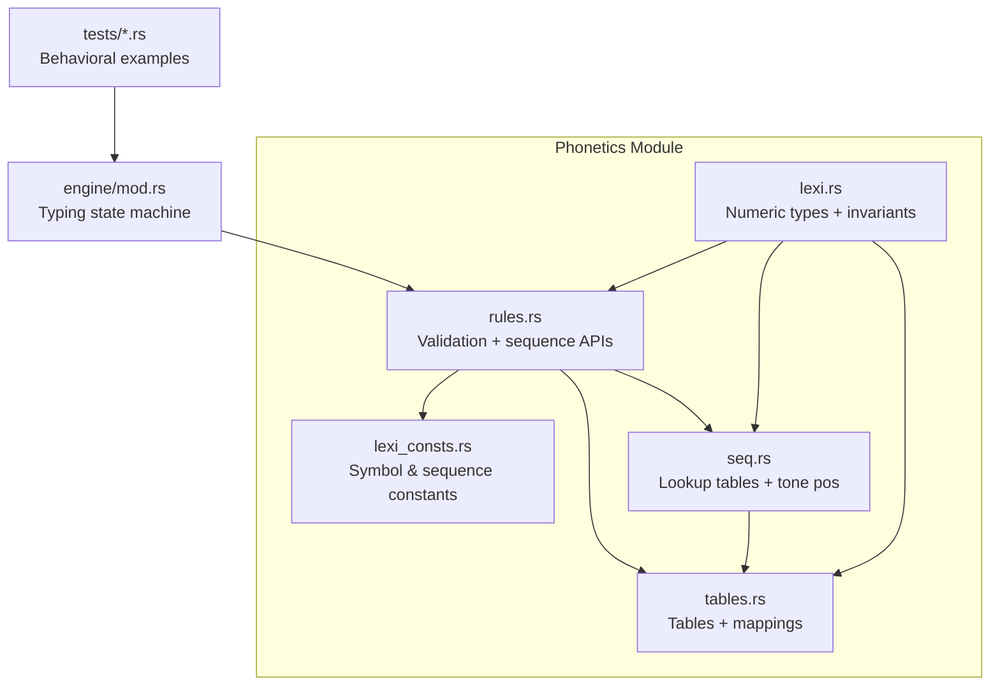
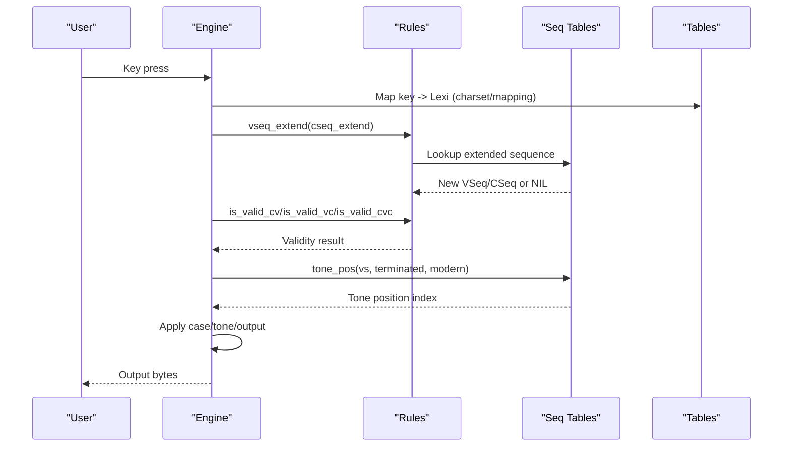
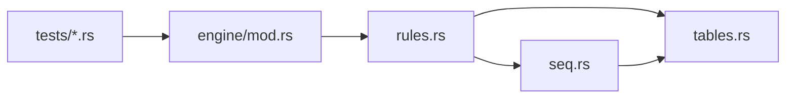

# Phonetics Processing

<cite>
**Referenced Files in This Document**
- [mod.rs](file://port/skey-core/src/phonetics/mod.rs)
- [lexi.rs](file://port/skey-core/src/phonetics/lexi.rs)
- [lexi_consts.rs](file://port/skey-core/src/phonetics/lexi_consts.rs)
- [seq.rs](file://port/skey-core/src/phonetics/seq.rs)
- [rules.rs](file://port/skey-core/src/phonetics/rules.rs)
- [tables.rs](file://port/skey-core/src/phonetics/tables.rs)
- [engine/mod.rs](file://port/skey-core/src/engine/mod.rs)
- [simple_telex.rs](file://port/skey-core/tests/simple_telex.rs)
- [quick.rs](file://port/skey-core/tests/quick.rs)
</cite>

## Table of Contents
1. [Introduction](#introduction)
2. [Project Structure](#project-structure)
3. [Core Components](#core-components)
4. [Architecture Overview](#architecture-overview)
5. [Detailed Component Analysis](#detailed-component-analysis)
6. [Dependency Analysis](#dependency-analysis)
7. [Performance Considerations](#performance-considerations)
8. [Troubleshooting Guide](#troubleshooting-guide)
9. [Conclusion](#conclusion)

## Introduction
This document explains the phonetics processing system that implements Vietnamese language-specific typing rules. It focuses on the lexi module’s role in phonetic analysis, sequence processing, and rule application. You will learn how tone marking, vowel combinations, and consonant processing are handled through a table-driven approach, and how keyboard input patterns are transformed into correct Vietnamese characters. Examples illustrate phonetic transformations, tone handling, and the underlying tables that drive decisions.

## Project Structure
The phonetics subsystem lives under port/skey-core/src/phonetics and is composed of:
- lexi: Numeric encoding for Vietnamese lexical symbols (Lexi), vowel sequences (VSeq), and consonant sequences (CSeq).
- lexi_consts: Generated constants for all lexical symbols and sequence identifiers.
- seq: Compile-time generated lookup tables for fast vowel/consonant sequence operations and tone position computation.
- rules: Phonotactic validation and sequence lookup APIs used by the engine.
- tables: Data tables generated from the original C++ engine, including Unicode mappings, Telex/VN/QI maps, and sequence definitions.

**Diagram sources**
- [mod.rs:1-16](file://port/skey-core/src/phonetics/mod.rs#L1-L16)
- [engine/mod.rs:1-200](file://port/skey-core/src/engine/mod.rs#L1-L200)

**Section sources**
- [mod.rs:1-16](file://port/skey-core/src/phonetics/mod.rs#L1-L16)
- [engine/mod.rs:1-200](file://port/skey-core/src/engine/mod.rs#L1-L200)

## Core Components
- Lexi, VSeq, CSeq: Compact numeric representations of Vietnamese letters and sequences with strict layout invariants to preserve compatibility with the original engine.
- Sequence tables: Precomputed arrays enable O(1) extension, removal of diacritics (roof/hook), and tone placement decisions.
- Rules: High-level phonotactic checks (valid CV, VC, CVC) and sequence lookups that the engine calls during typing.
- Tables: Canonical data for character mapping, Telex/VN/QI inputs, and sequence metadata.

Key responsibilities:
- Phonetic analysis: Map keystrokes to Lexi values and build VSeq/CSeq incrementally.
- Sequence processing: Extend or reduce sequences as keys arrive; remove roof/hook when needed.
- Rule application: Validate transitions and determine where tones should be placed based on sequence context.

**Section sources**
- [lexi.rs:1-110](file://port/skey-core/src/phonetics/lexi.rs#L1-L110)
- [seq.rs:1-451](file://port/skey-core/src/phonetics/seq.rs#L1-L451)
- [rules.rs:1-246](file://port/skey-core/src/phonetics/rules.rs#L1-L246)
- [tables.rs:1-696](file://port/skey-core/src/phonetics/tables.rs#L1-L696)

## Architecture Overview
The engine orchestrates key events and delegates phonetic processing to the phonetics module. On each keystroke:
1. The engine converts the key to a Lexi symbol using charset and mapping tables.
2. It updates current VSeq/CSeq via sequence extension functions.
3. It validates transitions using phonotactic rules.
4. It determines tone placement using precomputed tone position tables.
5. It emits output characters according to the selected charset and options.

**Diagram sources**
- [engine/mod.rs:1-200](file://port/skey-core/src/engine/mod.rs#L1-L200)
- [rules.rs:132-246](file://port/skey-core/src/phonetics/rules.rs#L132-L246)
- [seq.rs:263-386](file://port/skey-core/src/phonetics/seq.rs#L263-L386)
- [tables.rs:150-213](file://port/skey-core/src/phonetics/tables.rs#L150-L213)

## Detailed Component Analysis

### Lexi Encoding and Invariants
- Lexi encodes base letters and their cases; even indices are uppercase, odd are lowercase.
- Tone levels are encoded as offsets from the base, with consistent spacing to simplify arithmetic.
- VSeq and CSeq represent vowel and consonant sequences with sentinel “nil” values.
- Compile-time assertions ensure the numeric layout matches the original engine, preserving behavior across ports.

Practical implications:
- Case toggling and lowercasing are bit flips on the parity of the index.
- Tone addition/subtraction uses fixed offsets, enabling fast tone placement.

**Section sources**
- [lexi.rs:1-110](file://port/skey-core/src/phonetics/lexi.rs#L1-L110)
- [lexi_consts.rs:1-301](file://port/skey-core/src/phonetics/lexi_consts.rs#L1-L301)

### Sequence Processing and Lookup Tables
- Single-symbol to sequence conversion: v_single/c_single map a Lexi to its initial VSeq/CSeq.
- Extension: v_extend/c_extend append a new symbol if valid, returning NIL when invalid or at max length.
- Diacritic removal: v_no_roof/v_no_hook compute the sequence after removing a roof or hook at the appropriate position.
- Special prefix handling: v_u_or/v_u_o/v_uh_oh support complex vowel combinations like u+or or uh+oh.

Tone position:
- tone_pos returns the index within the sequence where a tone mark should be placed, considering termination and modern style flags.
- The table is built once at compile time and accessed in O(1) at runtime.

**Section sources**
- [seq.rs:107-386](file://port/skey-core/src/phonetics/seq.rs#L107-L386)

### Phonotactic Validation and Rule Application
- is_valid_cv: Ensures a consonant can precede a given vowel sequence, with special handling for specific consonants (e.g., k) and digraphs (gi/qu).
- is_valid_vc: Ensures a vowel sequence can be followed by a coda consonant, using a compact bitmap for fast checks.
- is_valid_cvc: Combines both checks and includes exceptions for certain triconsonantal clusters (e.g., quyn, gieng).
- std_no_tone and is_vowel: Provide helpers to normalize characters and identify vowels for further processing.

These rules are called during typing to decide whether a transition is allowed and how to handle ambiguous or invalid sequences.

**Section sources**
- [rules.rs:1-246](file://port/skey-core/src/phonetics/rules.rs#L1-L246)

### Tables and Mappings
- VSEQ and CSEQ define all valid sequences with metadata such as length, completion status, suffix flags, and positions for roof/hook.
- VC_VALID provides a compact representation of which coda consonants may follow which vowel sequences.
- ISO_LEXI, UNICODE_TABLE, VIQR_TABLE, and other mapping tables convert between input encodings and internal Lexi/Unicode forms.
- TELEX_MAP, SIMPLE_TELEX_MAP, VNI_MAP, VIQR_MAP, MSVI_MAP encode keyboard-to-Lexi mappings for different input methods.

These tables are generated from the original C++ engine to maintain fidelity.

**Section sources**
- [tables.rs:1-696](file://port/skey-core/src/phonetics/tables.rs#L1-L696)

### Engine Integration and Typing Flow
- The engine maintains per-stroke buffers and state, delegating phonetic decisions to the phonetics module.
- It sets input method and charset, then processes keystrokes via type_str or key dispatch.
- Options control features like quick telex shortcuts, capitalization, and consonant allowances.

Examples in tests demonstrate expected behaviors for various input methods and options.

**Section sources**
- [engine/mod.rs:1-200](file://port/skey-core/src/engine/mod.rs#L1-L200)
- [simple_telex.rs:1-53](file://port/skey-core/tests/simple_telex.rs#L1-L53)
- [quick.rs:1-304](file://port/skey-core/tests/quick.rs#L1-L304)

## Dependency Analysis
- Engine depends on phonetics rules for validation and sequence manipulation.
- Rules depend on seq tables for fast lookups and on tables for canonical data.
- Seq tables depend on tables for sequence definitions and generate additional lookup arrays at compile time.
- Tests exercise the engine and validate behavior against expected outputs.

**Diagram sources**
- [engine/mod.rs:1-200](file://port/skey-core/src/engine/mod.rs#L1-L200)
- [rules.rs:1-246](file://port/skey-core/src/phonetics/rules.rs#L1-L246)
- [seq.rs:1-451](file://port/skey-core/src/phonetics/seq.rs#L1-L451)
- [tables.rs:1-696](file://port/skey-core/src/phonetics/tables.rs#L1-L696)
- [simple_telex.rs:1-53](file://port/skey-core/tests/simple_telex.rs#L1-L53)
- [quick.rs:1-304](file://port/skey-core/tests/quick.rs#L1-L304)

**Section sources**
- [engine/mod.rs:1-200](file://port/skey-core/src/engine/mod.rs#L1-L200)
- [rules.rs:1-246](file://port/skey-core/src/phonetics/rules.rs#L1-L246)
- [seq.rs:1-451](file://port/skey-core/src/phonetics/seq.rs#L1-L451)
- [tables.rs:1-696](file://port/skey-core/src/phonetics/tables.rs#L1-L696)

## Performance Considerations
- All critical lookups are table-driven and compiled into static arrays, avoiding runtime searches.
- Tone position is computed via a single array load using a precomputed table indexed by sequence ID and flags.
- Phonotactic validity checks use bitmasks for constant-time decisions.
- Case and tone manipulations rely on simple arithmetic on compact indices, minimizing branching.

These design choices ensure high throughput and low latency during live typing.

[No sources needed since this section provides general guidance]

## Troubleshooting Guide
Common issues and diagnostics:
- Invalid transitions: If a sequence becomes invalid, is_valid_cv/is_valid_vc/is_valid_cvc will reject it; check the relevant consonant-vowel pairings and coda constraints.
- Incorrect tone placement: Verify the sequence’s termination and modern-style flags when calling tone_pos; ensure the sequence has been correctly extended before tone application.
- Mapping mismatches: Confirm the active input method and charset; consult TELEX_MAP/SIMPLE_TELEX_MAP/VNI_MAP/VIQR_MAP/MSVI_MAP to ensure keys map to expected Lexi values.
- Case handling: Use Lexi.change_case/to_lower to adjust case consistently; verify parity assumptions hold.

Use the test suite as reference for expected behavior:
- Simple Telex behavior and bracket handling.
- Quick telex shortcuts and option gating.
- Consonant allowance and sentence-ending punctuation behavior.

**Section sources**
- [rules.rs:107-246](file://port/skey-core/src/phonetics/rules.rs#L107-L246)
- [seq.rs:263-386](file://port/skey-core/src/phonetics/seq.rs#L263-L386)
- [tables.rs:150-213](file://port/skey-core/src/phonetics/tables.rs#L150-L213)
- [simple_telex.rs:1-53](file://port/skey-core/tests/simple_telex.rs#L1-L53)
- [quick.rs:1-304](file://port/skey-core/tests/quick.rs#L1-L304)

## Conclusion
The phonetics processing system implements robust Vietnamese typing rules through a carefully designed combination of compact numeric encodings, precomputed lookup tables, and strict phonotactic validation. The lexi module defines the foundational types and invariants, while seq and rules provide efficient sequence manipulation and decision-making. Tables encode the canonical mappings and sequence metadata required for accurate character composition. Together, these components deliver fast, reliable, and faithful Vietnamese typing behavior across input methods and charsets.

[No sources needed since this section summarizes without analyzing specific files]