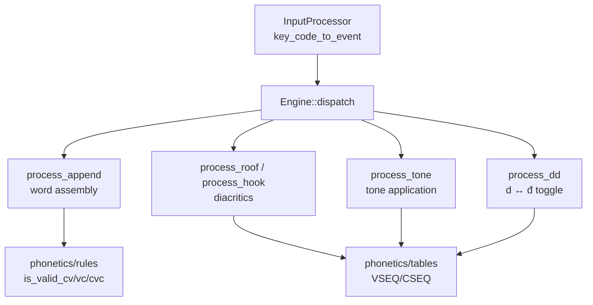
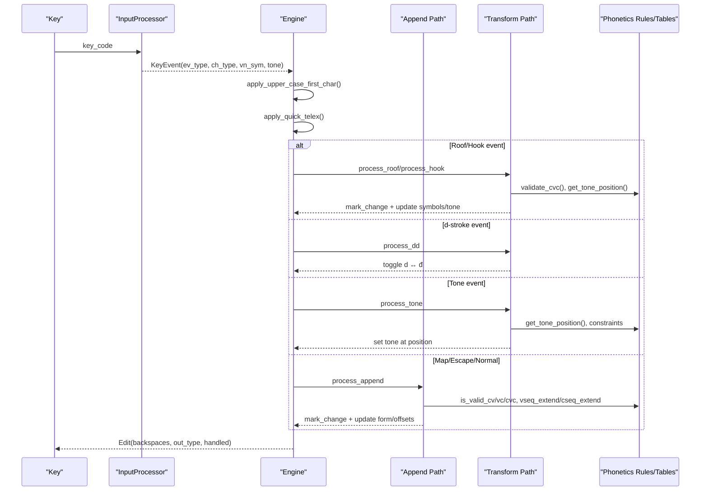
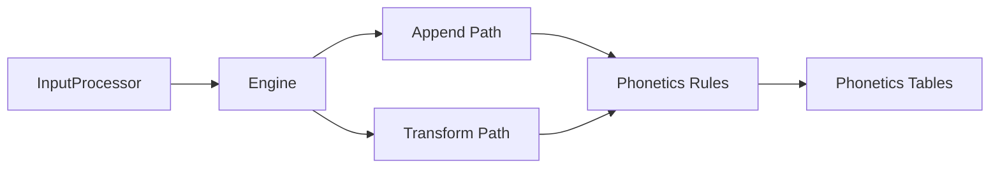

# Rule Engine

<cite>
**Referenced Files in This Document**
- [lib.rs](file://port/skey-core/src/lib.rs)
- [engine/mod.rs](file://port/skey-core/src/engine/mod.rs)
- [engine/types.rs](file://port/skey-core/src/engine/types.rs)
- [engine/append.rs](file://port/skey-core/src/engine/append.rs)
- [engine/transform.rs](file://port/skey-core/src/engine/transform.rs)
- [input/mod.rs](file://port/skey-core/src/input/mod.rs)
- [phonetics/mod.rs](file://port/skey-core/src/phonetics/mod.rs)
- [phonetics/rules.rs](file://port/skey-core/src/phonetics/rules.rs)
- [phonetics/seq.rs](file://port/skey-core/src/phonetics/seq.rs)
- [phonetics/tables.rs](file://port/skey-core/src/phonetics/tables.rs)
- [README.md](file://README.md)
</cite>

## Table of Contents
1. [Introduction](#introduction)
2. [Project Structure](#project-structure)
3. [Core Components](#core-components)
4. [Architecture Overview](#architecture-overview)
5. [Detailed Component Analysis](#detailed-component-analysis)
6. [Dependency Analysis](#dependency-analysis)
7. [Performance Considerations](#performance-considerations)
8. [Troubleshooting Guide](#troubleshooting-guide)
9. [Conclusion](#conclusion)

## Introduction
This document explains the rule engine that transforms Vietnamese keyboard input into correctly typed characters. It covers how tone marking, vowel combinations, and consonant modifications are determined by context; the evaluation order and priority of rules; conflict resolution; special cases such as d vs đ, tone placement, and diacritic positioning; and how the engine maintains compatibility with the original UniKey implementation while delivering better performance through table-driven logic and zero-allocation keystroke processing.

## Project Structure
The engine is implemented in a Rust core library (skey-core) organized into:
- Input classification and key mapping
- Engine state machine and dispatch
- Append path for building words from keys
- Transform path for applying roof/hook/d-stroke/tone
- Phonetics tables and rules for Vietnamese orthography

**Diagram sources**
- [input/mod.rs:150-192](file://port/skey-core/src/input/mod.rs#L150-L192)
- [engine/mod.rs:209-246](file://port/skey-core/src/engine/mod.rs#L209-L246)
- [engine/append.rs:141-196](file://port/skey-core/src/engine/append.rs#L141-L196)
- [engine/transform.rs:70-536](file://port/skey-core/src/engine/transform.rs#L70-L536)
- [phonetics/rules.rs:107-231](file://port/skey-core/src/phonetics/rules.rs#L107-L231)
- [phonetics/tables.rs:22-133](file://port/skey-core/src/phonetics/tables.rs#L22-L133)

**Section sources**
- [lib.rs:1-47](file://port/skey-core/src/lib.rs#L1-L47)
- [README.md:1-70](file://README.md#L1-L70)

## Core Components
- Engine: central state machine holding buffers, options, charset, and per-keystroke output state. It normalizes events and dispatches to specialized handlers.
- InputProcessor: maps raw key codes to events (roof, hook, tone, telex-w, map char, escape, normal) and classifies characters as Vietnamese or non-Vietnamese.
- Append path: builds words by appending vowels or consonants, validates phonotactics, and manages buffer positions and tone repositioning.
- Transform path: applies roof/hook marks, toggles d ↔ đ, and places tones according to sequence and style options.
- Phonetics layer: provides lookup tables and validation functions for valid sequences and tone placement.

Key data structures:
- WordInfo: compact representation of one buffer entry storing symbol, sequence indices, offsets, form, and tone bits.
- VSeq/CSeq: indexes into precomputed vowel/consonant sequence tables.
- Options: feature flags controlling behavior like free marking, modern style, quick shortcuts, spell checking, and character classification.

**Section sources**
- [engine/mod.rs:18-70](file://port/skey-core/src/engine/mod.rs#L18-L70)
- [engine/types.rs:15-83](file://port/skey-core/src/engine/types.rs#L15-L83)
- [engine/types.rs:107-235](file://port/skey-core/src/engine/types.rs#L107-L235)
- [input/mod.rs:50-87](file://port/skey-core/src/input/mod.rs#L50-L87)
- [phonetics/mod.rs:1-16](file://port/skey-core/src/phonetics/mod.rs#L1-L16)

## Architecture Overview
The keystroke flow follows a strict priority order:
1. Quick shortcuts and uppercase-first handling
2. Roof/hook application if applicable
3. d ↔ đ toggle
4. Tone application
5. Telex-w fallback to u horn mapping
6. Character mapping and escape handling
7. Append to word buffer (vowel/consonant)

**Diagram sources**
- [engine/mod.rs:209-246](file://port/skey-core/src/engine/mod.rs#L209-L246)
- [engine/transform.rs:70-536](file://port/skey-core/src/engine/transform.rs#L70-L536)
- [engine/append.rs:141-196](file://port/skey-core/src/engine/append.rs#L141-L196)
- [phonetics/rules.rs:107-231](file://port/skey-core/src/phonetics/rules.rs#L107-L231)
- [phonetics/seq.rs:337-386](file://port/skey-core/src/phonetics/seq.rs#L337-L386)

## Detailed Component Analysis

### Rule Evaluation Order and Priority
- Dispatch prioritizes special actions over generic append:
  - Roof/hook events modify existing vowel sequences before any other processing.
  - d ↔ đ toggle is handled early to ensure correct onset/coda semantics.
  - Tone events place or remove tones based on current sequence and style.
  - Telex-w first attempts hook application; if not applicable, it falls back to mapping w to u horn.
  - Escape mode allows literal insertion of certain characters when needed.
  - Normal characters are appended and validated against phonotactic rules.

Priority summary:
1. Uppercase-first and quick shortcuts
2. Roof/hook transformation
3. d ↔ đ toggle
4. Tone application
5. Telex-w fallback
6. Map/escape
7. Append

**Section sources**
- [engine/mod.rs:209-246](file://port/skey-core/src/engine/mod.rs#L209-L246)
- [engine/transform.rs:675-712](file://port/skey-core/src/engine/transform.rs#L675-L712)
- [engine/append.rs:141-196](file://port/skey-core/src/engine/append.rs#L141-L196)

### Vowel Combination Rules
- Vowel sequences are extended via table lookups; length-three sequences cannot be extended further.
- Special handling exists for uo-related sequences:
  - Roof on u+o or u+o+i becomes uo^ with appropriate symbol changes.
  - Hook on u+o can split into u+o+ depending on preceding consonant context (e.g., th/h).
- Validity checks prevent illegal CV and VC combinations:
  - gi does not combine with i; qu does not combine with u.
  - k has a restricted set of allowed following vowels.
  - Certain coda combinations are permitted only for specific sequences (e.g., quyn/quynh, gieng/gie^ng).

Tone placement:
- Determined by a precomputed table based on sequence, termination state, and modern style option.
- When sequence changes due to roof/hook, tone may be moved to maintain correctness.

Examples of applications:
- Adding roof to a: a → ă; adding roof to e: e → ê; adding roof to o: o → ô.
- Adding hook to u/o/a: u → ư, o → ơ, a → ả.
- uo handling:
  - u + o → u+o+ when preceded by th/h and hook applied to second vowel.
  - u + o + i → uo^i when roof applied appropriately.

**Section sources**
- [phonetics/seq.rs:107-222](file://port/skey-core/src/phonetics/seq.rs#L107-L222)
- [phonetics/seq.rs:337-386](file://port/skey-core/src/phonetics/seq.rs#L337-L386)
- [phonetics/rules.rs:107-231](file://port/skey-core/src/phonetics/rules.rs#L107-L231)
- [engine/transform.rs:70-189](file://port/skey-core/src/engine/transform.rs#L70-L189)
- [engine/transform.rs:191-467](file://port/skey-core/src/engine/transform.rs#L191-L467)

### Consonant Modification Rules
- Consonant sequences extend via table lookups; invalid extensions revert to non-Vietnamese segments.
- Special cases:
  - After q, u behaves as part of the onset qu rather than a vowel.
  - After g, i behaves as part of the onset gi rather than a vowel.
  - u+o sequences adjust to u+o+ when followed by certain codas.

Conflict resolution:
- If an extension would violate phonotactics, the engine treats the new segment as non-Vietnamese or resets sequence state accordingly.
- For complex transitions (e.g., u+o → u+o+), the engine updates both symbols and sequence metadata atomically.

**Section sources**
- [engine/append.rs:201-369](file://port/skey-core/src/engine/append.rs#L201-L369)
- [engine/append.rs:371-575](file://port/skey-core/src/engine/append.rs#L371-L575)
- [phonetics/rules.rs:184-231](file://port/skey-core/src/phonetics/rules.rs#L184-L231)

### Tone Marking and Placement
- Tone events set or clear tone at the computed position for the current vowel sequence.
- Constraints:
  - Certain coda consonants (c, ch, p, t) disallow specific tones (? ~ ˀ).
  - Spell-check mode may restrict tone application until the sequence is complete unless free marking is enabled.
- Modern style affects placement for specific sequences (e.g., oa, oe, uy).

Reversion behavior:
- If the same tone is applied twice, it clears and reverts to plain character input.

**Section sources**
- [engine/transform.rs:469-536](file://port/skey-core/src/engine/transform.rs#L469-L536)
- [phonetics/seq.rs:337-386](file://port/skey-core/src/phonetics/seq.rs#L337-L386)

### Special Case: d vs đ
- The d-stroke key toggles between d and đ:
  - If the current onset is d, it becomes đ; if already đ, it reverts to d and re-appends the next character.
  - At word boundaries or after non-vowels, d-stroke can directly produce đ.
- Single-mode flag ensures abbreviations starting with đ are not spell-checked.

**Section sources**
- [engine/transform.rs:538-601](file://port/skey-core/src/engine/transform.rs#L538-L601)

### Diacritic Positioning and Reordering
- Roof and hook operations compute target positions within the vowel sequence and update symbols accordingly.
- When roof/hook changes the sequence, tone may be relocated to preserve correctness.
- Free marking option allows moving diacritics off the current position if compatible with the resulting sequence.

**Section sources**
- [engine/transform.rs:70-189](file://port/skey-core/src/engine/transform.rs#L70-L189)
- [engine/transform.rs:327-467](file://port/skey-core/src/engine/transform.rs#L327-L467)

### Compatibility with Original UniKey
- The engine preserves byte-for-byte behavioral parity with the original C++ engine where possible, verified by differential testing.
- Key mappings and character classifications mirror the original’s tables; deviations are documented (e.g., Simple Telex mapping index).
- Output encoding and backspace counts match the original’s expectations across charsets.

**Section sources**
- [lib.rs:1-6](file://port/skey-core/src/lib.rs#L1-L6)
- [input/mod.rs:94-120](file://port/skey-core/src/input/mod.rs#L94-L120)
- [engine/append.rs:41-66](file://port/skey-core/src/engine/append.rs#L41-L66)

## Dependency Analysis
- Engine depends on InputProcessor for event creation and classification.
- Append and Transform paths depend on Phonetics rules and tables for validation and sequence management.
- Tables are generated from the original engine’s compiled data, ensuring fidelity.

**Diagram sources**
- [input/mod.rs:150-192](file://port/skey-core/src/input/mod.rs#L150-L192)
- [engine/mod.rs:209-246](file://port/skey-core/src/engine/mod.rs#L209-L246)
- [phonetics/rules.rs:107-231](file://port/skey-core/src/phonetics/rules.rs#L107-L231)
- [phonetics/tables.rs:22-133](file://port/skey-core/src/phonetics/tables.rs#L22-L133)

**Section sources**
- [phonetics/tables.rs:1-200](file://port/skey-core/src/phonetics/tables.rs#L1-L200)

## Performance Considerations
- Zero-allocation keystroke path: the engine operates without heap allocations during typing, using fixed-size buffers.
- Table-driven logic replaces runtime searches:
  - Vowel/consonant extension uses precomputed arrays instead of binary search.
  - Tone placement uses a flat table indexed by sequence, termination, and style.
  - CV validity uses bitmasks for constant-time checks.
- Compact WordInfo reduces memory footprint and improves cache locality.
- Backspace calculation avoids full encoding passes by using a counting encoder.

[No sources needed since this section provides general guidance]

## Troubleshooting Guide
Common issues and resolutions:
- Unexpected tone placement:
  - Check modern style option and whether the sequence is terminated; tone position depends on these factors.
  - Verify that spell-check mode is configured appropriately; incomplete sequences may block tone application.
- d ↔ đ not toggling:
  - Ensure the current form allows onset modification; d-stroke requires a valid onset context.
- Vowel combination rejected:
  - Validate CV/VC combinations; some sequences are disallowed (e.g., gi+i, qu+u).
  - Confirm that roof/hook application respects free marking constraints.
- Telex-w behavior:
  - First attempts hook application; if not applicable, maps to u horn. Check context to understand which path was taken.

**Section sources**
- [engine/transform.rs:469-536](file://port/skey-core/src/engine/transform.rs#L469-L536)
- [engine/transform.rs:538-601](file://port/skey-core/src/engine/transform.rs#L538-L601)
- [engine/append.rs:201-369](file://port/skey-core/src/engine/append.rs#L201-L369)
- [engine/transform.rs:675-712](file://port/skey-core/src/engine/transform.rs#L675-L712)

## Conclusion
The SKey rule engine implements a robust, table-driven system for Vietnamese typing that mirrors the original UniKey behavior while improving performance through zero-allocation processing and optimized lookups. Its layered architecture separates input classification, word assembly, and diacritic/tone transformations, enabling precise control over rule evaluation order, conflict resolution, and compatibility. Developers can rely on its deterministic behavior and extensive configuration options to deliver accurate and responsive Vietnamese input experiences.

[No sources needed since this section summarizes without analyzing specific files]