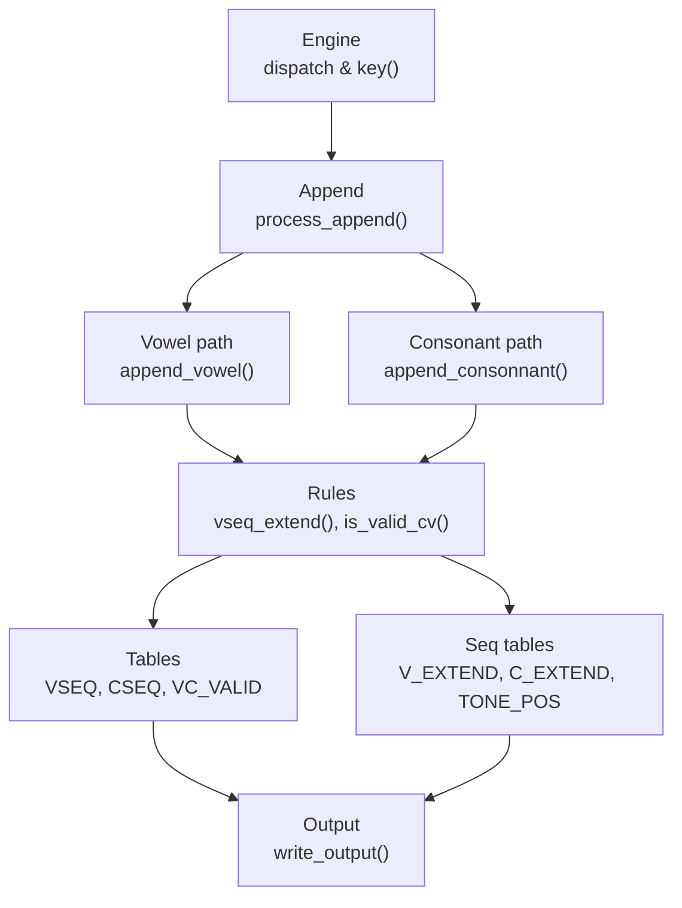
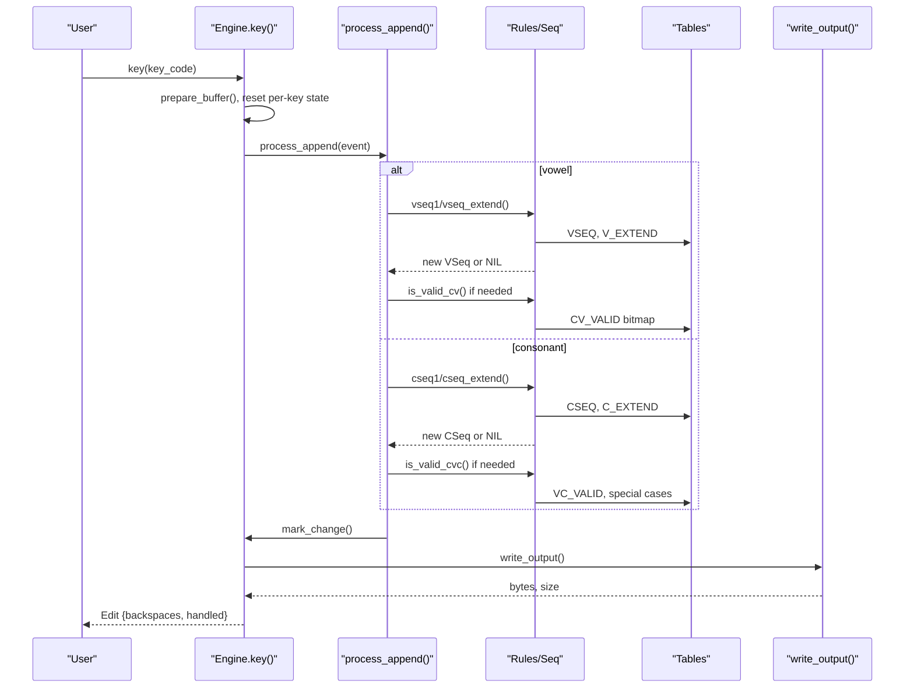
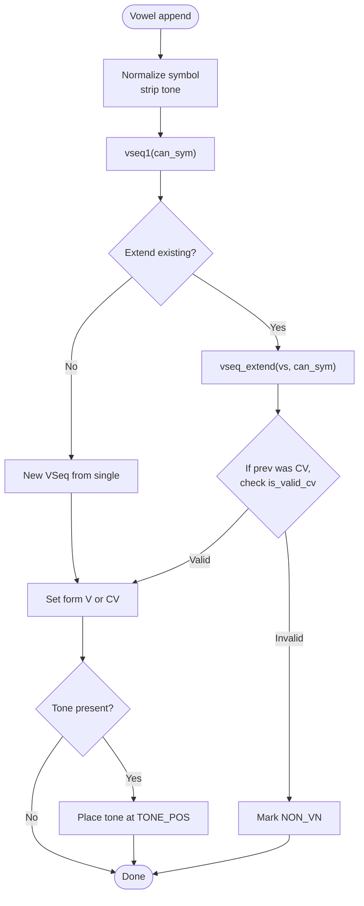
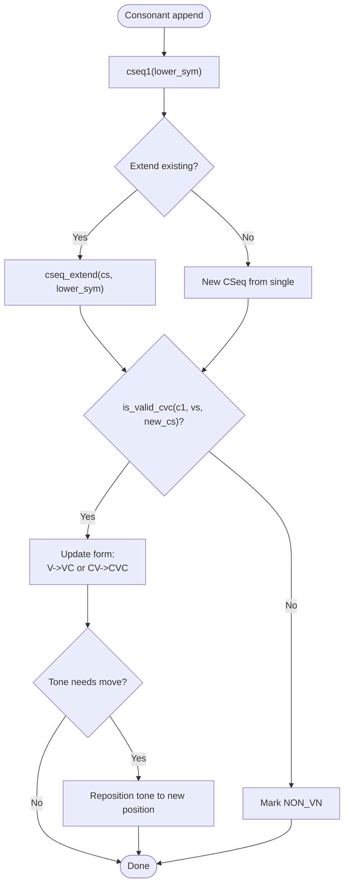
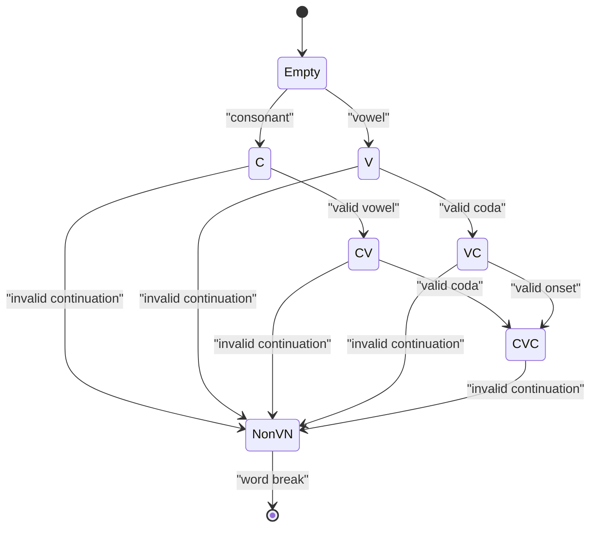
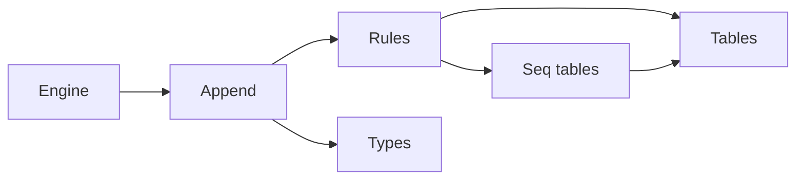

# Sequence Processing

<cite>
**Referenced Files in This Document**
- [mod.rs](file://port/skey-core/src/phonetics/mod.rs)
- [seq.rs](file://port/skey-core/src/phonetics/seq.rs)
- [rules.rs](file://port/skey-core/src/phonetics/rules.rs)
- [tables.rs](file://port/skey-core/src/phonetics/tables.rs)
- [lexi.rs](file://port/skey-core/src/phonetics/lexi.rs)
- [lexi_consts.rs](file://port/skey-core/src/phonetics/lexi_consts.rs)
- [engine_mod.rs](file://port/skey-core/src/engine/mod.rs)
- [append.rs](file://port/skey-core/src/engine/append.rs)
- [types.rs](file://port/skey-core/src/engine/types.rs)
</cite>

## Table of Contents
1. [Introduction](#introduction)
2. [Project Structure](#project-structure)
3. [Core Components](#core-components)
4. [Architecture Overview](#architecture-overview)
5. [Detailed Component Analysis](#detailed-component-analysis)
6. [Dependency Analysis](#dependency-analysis)
7. [Performance Considerations](#performance-considerations)
8. [Troubleshooting Guide](#troubleshooting-guide)
9. [Conclusion](#conclusion)

## Introduction
This document explains the sequence processing system that handles Vietnamese vowel and consonant sequences for keyboard input. It focuses on how the engine analyzes keystrokes, builds phonetic sequences using a state machine, validates combinations with table-driven rules, and determines when a complete syllable is formed. You will learn how common sequences such as "nguyen", "quy", and "ong" are recognized and validated through precomputed tables and fast lookups.

## Project Structure
The sequence processing logic lives in the phonetics subsystem and is orchestrated by the typing engine:

- Phonetics layer
  - lexi.rs: Numeric encoding for Vietnamese characters and sequence identifiers
  - lexi_consts.rs: Symbol constants (vowels, consonants, tone levels)
  - tables.rs: Compiled tables for valid sequences, mappings, and validity bitmaps
  - seq.rs: Precomputed transition tables for extending or simplifying sequences
  - rules.rs: High-level validation functions and lookup helpers
- Engine layer
  - engine/mod.rs: State machine dispatch and per-key processing
  - append.rs: Word assembly, vowel/consonant appending, spell-check integration
  - types.rs: Word forms (C, V, CV, VC, CVC), options, and buffer layout

**Diagram sources**
- [engine_mod.rs:209-245](file://port/skey-core/src/engine/mod.rs#L209-L245)
- [append.rs:141-196](file://port/skey-core/src/engine/append.rs#L141-L196)
- [rules.rs:136-182](file://port/skey-core/src/phonetics/rules.rs#L136-L182)
- [seq.rs:263-328](file://port/skey-core/src/phonetics/seq.rs#L263-L328)
- [tables.rs:135-148](file://port/skey-core/src/phonetics/tables.rs#L135-L148)

**Section sources**
- [mod.rs:1-16](file://port/skey-core/src/phonetics/mod.rs#L1-L16)
- [engine_mod.rs:18-70](file://port/skey-core/src/engine/mod.rs#L18-L70)
- [append.rs:1-15](file://port/skey-core/src/engine/append.rs#L1-L15)

## Core Components
- Lexi and sequence identifiers
  - Lexi encodes Vietnamese characters with parity for case and tone steps; VSeq and CSeq index into compiled tables
- Tables
  - VSEQ and CSEQ define all valid vowel and consonant sequences with metadata like length, completeness, and suffix flags
  - VC_VALID bitmap allows fast consonant-vowel compatibility checks
  - TONE_POS maps where to place tones based on sequence shape and modern style
- Rules and Seq
  - vseq1/cseq1 create single-symbol sequences
  - vseq_extend/cseq_extend extend sequences via compact tables
  - is_valid_cv/is_valid_vc/is_valid_cvc enforce phonotactic constraints
- Engine
  - Maintains a word buffer of WordInfo entries with form (C, V, CV, VC, CVC), offsets, and tone
  - Dispatches events to roof/hook/tone/telex handlers or appends to the current word
  - Writes output only for changed ranges and tracks backspaces

**Section sources**
- [lexi.rs:16-96](file://port/skey-core/src/phonetics/lexi.rs#L16-L96)
- [tables.rs:9-22](file://port/skey-core/src/phonetics/tables.rs#L9-L22)
- [tables.rs:95-133](file://port/skey-core/src/phonetics/tables.rs#L95-L133)
- [tables.rs:135-148](file://port/skey-core/src/phonetics/tables.rs#L135-L148)
- [seq.rs:263-328](file://port/skey-core/src/phonetics/seq.rs#L263-L328)
- [rules.rs:107-182](file://port/skey-core/src/phonetics/rules.rs#L107-L182)
- [types.rs:15-23](file://port/skey-core/src/engine/types.rs#L15-L23)
- [types.rs:114-127](file://port/skey-core/src/engine/types.rs#L114-L127)

## Architecture Overview
The engine processes each keystroke through a small state machine:

- Input classification determines if the character is a reset, word break, non-Vietnamese, or Vietnamese symbol
- For Vietnamese symbols:
  - If it is a vowel, attempt to extend the current vowel sequence
  - If it is a consonant, attempt to extend the current consonant cluster
- After each append, the engine validates transitions and updates the word form accordingly
- Tone marks and diacritics are handled by dedicated handlers that adjust the active position and tone level
- Output is produced only for modified segments, minimizing backspaces and re-rendering

**Diagram sources**
- [engine_mod.rs:249-319](file://port/skey-core/src/engine/mod.rs#L249-L319)
- [append.rs:141-196](file://port/skey-core/src/engine/append.rs#L141-L196)
- [rules.rs:136-182](file://port/skey-core/src/phonetics/rules.rs#L136-L182)
- [seq.rs:263-328](file://port/skey-core/src/phonetics/seq.rs#L263-L328)
- [tables.rs:135-148](file://port/skey-core/src/phonetics/tables.rs#L135-L148)

## Detailed Component Analysis

### Vowel Sequence Building and Extension
- Single-vowel creation: vseq1 maps a normalized vowel symbol to a VSeq index
- Extension: vseq_extend uses a compact table keyed by current VSeq and incoming vowel code
- Completion and suffix behavior: VSEQ entries encode whether a sequence can accept a coda and whether it is complete
- Tone placement: TONE_POS provides O(1) tone position based on sequence, termination, and modern style

**Diagram sources**
- [append.rs:202-369](file://port/skey-core/src/engine/append.rs#L202-L369)
- [rules.rs:136-164](file://port/skey-core/src/phonetics/rules.rs#L136-L164)
- [seq.rs:263-328](file://port/skey-core/src/phonetics/seq.rs#L263-L328)
- [seq.rs:337-386](file://port/skey-core/src/phonetics/seq.rs#L337-L386)

**Section sources**
- [append.rs:202-369](file://port/skey-core/src/engine/append.rs#L202-L369)
- [rules.rs:136-164](file://port/skey-core/src/phonetics/rules.rs#L136-L164)
- [seq.rs:263-328](file://port/skey-core/src/phonetics/seq.rs#L263-L328)
- [seq.rs:337-386](file://port/skey-core/src/phonetics/seq.rs#L337-L386)

### Consonant Cluster Processing
- Single-consonant creation: cseq1 maps a symbol to a CSeq index
- Extension: cseq_extend uses a compact table keyed by current CSeq and incoming consonant code
- Validity checks:
  - is_valid_cvc ensures the combination of onset, nucleus, and coda follows Vietnamese phonotactics
  - Special cases include "quy" and "gieng" patterns
- Coda handling: When adding a coda after a vowel sequence, the engine may transform u+o into u horn + o horn and update forms accordingly

**Diagram sources**
- [append.rs:371-575](file://port/skey-core/src/engine/append.rs#L371-L575)
- [rules.rs:184-231](file://port/skey-core/src/phonetics/rules.rs#L184-L231)
- [seq.rs:225-259](file://port/skey-core/src/phonetics/seq.rs#L225-L259)

**Section sources**
- [append.rs:371-575](file://port/skey-core/src/engine/append.rs#L371-L575)
- [rules.rs:184-231](file://port/skey-core/src/phonetics/rules.rs#L184-L231)
- [seq.rs:225-259](file://port/skey-core/src/phonetics/seq.rs#L225-L259)

### State Machine and Word Forms
- WordInfo stores per-character form: EMPTY, NON_VN, C, V, CV, VC, CVC
- Offsets track positions of first consonant, vowel nucleus, and second consonant within a word
- The engine transitions between forms as new keys arrive, ensuring valid phonotactic structure
- Backspace handling moves tone marks and adjusts forms when necessary

**Diagram sources**
- [types.rs:15-23](file://port/skey-core/src/engine/types.rs#L15-L23)
- [append.rs:141-196](file://port/skey-core/src/engine/append.rs#L141-L196)
- [append.rs:371-575](file://port/skey-core/src/engine/append.rs#L371-L575)

**Section sources**
- [types.rs:15-23](file://port/skey-core/src/engine/types.rs#L15-L23)
- [append.rs:141-196](file://port/skey-core/src/engine/append.rs#L141-L196)
- [append.rs:371-575](file://port/skey-core/src/engine/append.rs#L371-L575)

### Common Sequences: "nguyen", "quy", "ong"
- "nguyen"
  - Onset: "ng" recognized as a valid consonant cluster
  - Nucleus: "u" followed by "y" forming a valid vowel sequence
  - Coda: "e" and "n" combine to produce the expected final segment
  - Validation: is_valid_cvc permits this pattern through table-backed checks and special-case allowances
- "quy"
  - Onset: "qu" recognized as a valid two-letter onset
  - Nucleus: "y" completes the vowel sequence
  - Validation: is_valid_cvc includes special handling for "qu" + "y"
- "ong"
  - Nucleus: "o" with possible horn variants
  - Coda: "ng" recognized as a valid coda
  - Validation: VC_VALID and CSEQ ensure "o" + "ng" is allowed

These sequences are validated through:
- CSEQ and VSEQ tables defining allowed clusters and nuclei
- VC_VALID bitmap enabling fast consonant-vowel compatibility checks
- Special-case logic in is_valid_cvc for known patterns like "quy" and "gieng"

**Section sources**
- [tables.rs:95-133](file://port/skey-core/src/phonetics/tables.rs#L95-L133)
- [tables.rs:135-148](file://port/skey-core/src/phonetics/tables.rs#L135-L148)
- [rules.rs:202-231](file://port/skey-core/src/phonetics/rules.rs#L202-L231)
- [append.rs:371-575](file://port/skey-core/src/engine/append.rs#L371-L575)

## Dependency Analysis
- Engine depends on phonetics rules and tables for all sequence decisions
- Rules depend on seq tables for fast extension and on tables for validity bitmaps
- Append module orchestrates flow and applies transformations based on rule outcomes
- Types define the compact WordInfo layout used throughout the engine

**Diagram sources**
- [engine_mod.rs:209-245](file://port/skey-core/src/engine/mod.rs#L209-L245)
- [append.rs:141-196](file://port/skey-core/src/engine/append.rs#L141-L196)
- [rules.rs:136-182](file://port/skey-core/src/phonetics/rules.rs#L136-L182)
- [seq.rs:263-328](file://port/skey-core/src/phonetics/seq.rs#L263-L328)
- [types.rs:114-127](file://port/skey-core/src/engine/types.rs#L114-L127)

**Section sources**
- [engine_mod.rs:209-245](file://port/skey-core/src/engine/mod.rs#L209-L245)
- [append.rs:141-196](file://port/skey-core/src/engine/append.rs#L141-L196)
- [rules.rs:136-182](file://port/skey-core/src/phonetics/rules.rs#L136-L182)
- [seq.rs:263-328](file://port/skey-core/src/phonetics/seq.rs#L263-L328)
- [types.rs:114-127](file://port/skey-core/src/engine/types.rs#L114-L127)

## Performance Considerations
- All sequence extensions use precomputed tables for O(1) lookups instead of runtime searches
- Validity checks use bitmaps (e.g., CV_VALID, VC_VALID) to reduce branching
- Tone placement is computed via a flat table indexed by sequence and mode
- Buffer management minimizes memory usage and avoids reallocation during typical typing sessions
- Output is written only for changed ranges, reducing backspace counts and rendering overhead

[No sources needed since this section provides general guidance]

## Troubleshooting Guide
- Invalid sequences become NON_VN
  - If a vowel cannot extend the current sequence or a consonant cannot be added, the entry is marked NON_VN
  - Check is_valid_cv/is_valid_cvc outcomes and verify preceding forms
- Tone misplacement
  - Use TONE_POS to determine correct tone position; ensure modern style flag matches expectations
  - Backspace handling moves tones when sequence changes; verify tone movement logic
- Special cases not recognized
  - Patterns like "quy" and "gieng" rely on explicit exceptions in is_valid_cvc; confirm these branches are reachable
- Output issues
  - Ensure mark_change is called for modified positions; write_output only renders changed ranges

**Section sources**
- [append.rs:141-196](file://port/skey-core/src/engine/append.rs#L141-L196)
- [append.rs:371-575](file://port/skey-core/src/engine/append.rs#L371-L575)
- [rules.rs:202-231](file://port/skey-core/src/phonetics/rules.rs#L202-L231)
- [seq.rs:337-386](file://port/skey-core/src/phonetics/seq.rs#L337-L386)

## Conclusion
The sequence processing system combines a compact state machine with highly optimized table-driven rules to handle Vietnamese phonotactics efficiently. Vowel and consonant sequences are built incrementally, validated against precomputed constraints, and finalized with precise tone placement. This design enables accurate recognition of complex sequences like "nguyen", "quy", and "ong" while maintaining low latency and minimal memory overhead.

[No sources needed since this section summarizes without analyzing specific files]