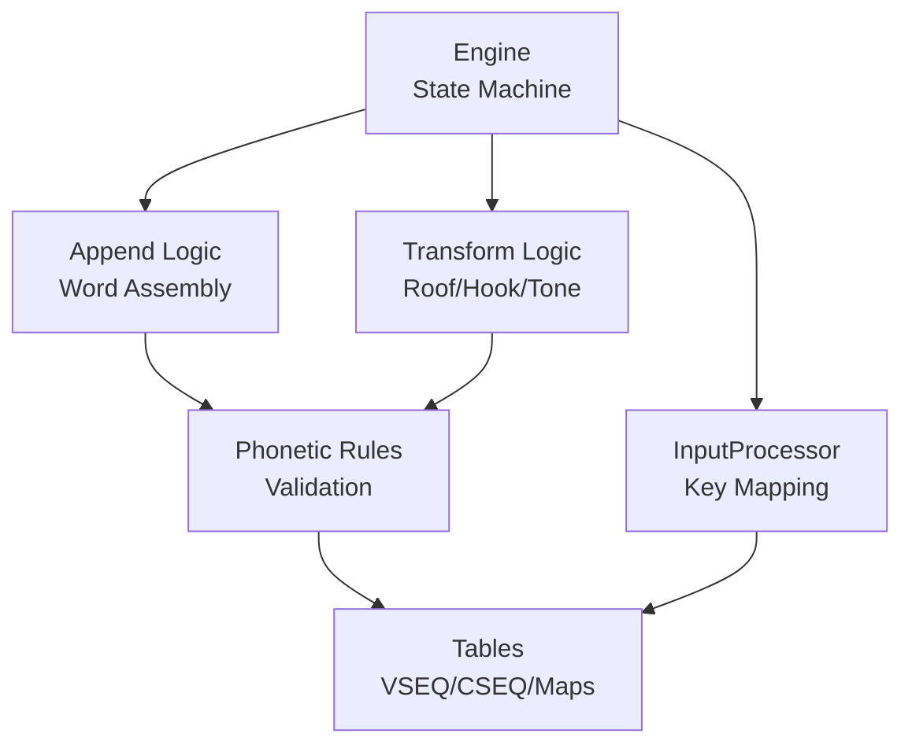
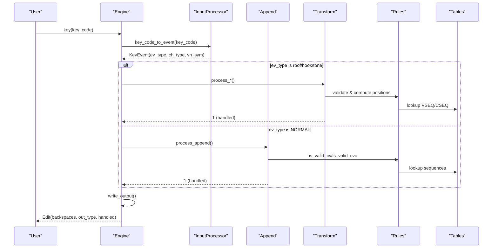
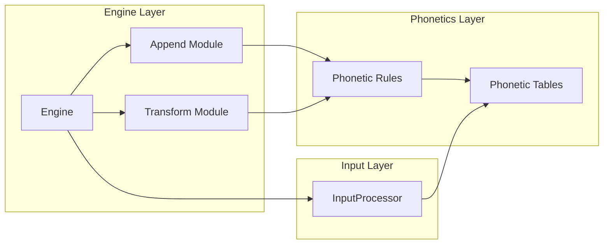

# Character Transformation System

<cite>
**Referenced Files in This Document**
- [engine/mod.rs](file://port/skey-core/src/engine/mod.rs)
- [engine/transform.rs](file://port/skey-core/src/engine/transform.rs)
- [engine/append.rs](file://port/skey-core/src/engine/append.rs)
- [engine/types.rs](file://port/skey-core/src/engine/types.rs)
- [input/mod.rs](file://port/skey-core/src/input/mod.rs)
- [phonetics/mod.rs](file://port/skey-core/src/phonetics/mod.rs)
- [phonetics/rules.rs](file://port/skey-core/src/phonetics/rules.rs)
- [phonetics/seq.rs](file://port/skey-core/src/phonetics/seq.rs)
- [phonetics/tables.rs](file://port/skey-core/src/phonetics/tables.rs)
</cite>

## Table of Contents
1. [Introduction](#introduction)
2. [Project Structure](#project-structure)
3. [Core Components](#core-components)
4. [Architecture Overview](#architecture-overview)
5. [Detailed Component Analysis](#detailed-component-analysis)
6. [Dependency Analysis](#dependency-analysis)
7. [Performance Considerations](#performance-considerations)
8. [Troubleshooting Guide](#troubleshooting-guide)
9. [Conclusion](#conclusion)

## Introduction
This document explains the character transformation system that implements Telex, VNI, and VIQR input methods for Vietnamese typing. It covers how typed keystrokes are transformed into correctly accented Vietnamese characters, including tone placement, diacritic composition (roof and hook), vowel sequence validation, consonant cluster handling, and escape sequences for VIQR. The engine maintains compatibility across multiple input methods while enforcing correct Vietnamese orthography through phonotactic rules and lookup tables.

## Project Structure
The transformation pipeline is implemented in a Rust core under port/skey-core:
- Engine orchestration and state machine
- Input method key mapping and event classification
- Phonetics tables and rules for vowels, consonants, and valid combinations
- Append logic for building words and applying composition rules
- Transform logic for roof, hook, tones, and special keys

**Diagram sources**
- [engine/mod.rs:18-70](file://port/skey-core/src/engine/mod.rs#L18-L70)
- [input/mod.rs:72-192](file://port/skey-core/src/input/mod.rs#L72-L192)
- [engine/append.rs:141-196](file://port/skey-core/src/engine/append.rs#L141-L196)
- [engine/transform.rs:14-24](file://port/skey-core/src/engine/transform.rs#L14-L24)
- [phonetics/rules.rs:107-196](file://port/skey-core/src/phonetics/rules.rs#L107-L196)
- [phonetics/tables.rs:22-93](file://port/skey-core/src/phonetics/tables.rs#L22-L93)

**Section sources**
- [engine/mod.rs:18-70](file://port/skey-core/src/engine/mod.rs#L18-L70)
- [input/mod.rs:72-192](file://port/skey-core/src/input/mod.rs#L72-L192)
- [phonetics/mod.rs:1-16](file://port/skey-core/src/phonetics/mod.rs#L1-L16)

## Core Components
- Engine: Central state machine managing buffers, keystroke processing, output generation, and dispatch to specific handlers.
- InputProcessor: Maps raw key codes to events based on selected input method (Telex, VNI, VIQR).
- Append module: Handles appending vowels/consonants, word assembly, spell-check integration, and buffer maintenance.
- Transform module: Implements roof, hook, tone application, d-stroke, and escape handling for VIQR.
- Phonetics: Provides tables and rules for valid vowel/consonant sequences, tone positioning, and composition.

Key responsibilities:
- Convert typed characters into Vietnamese with proper diacritics and tone marks
- Validate vowel sequences and consonant clusters according to Vietnamese phonotactics
- Support multiple input methods via key maps
- Maintain compatibility and correctness across different typing styles

**Section sources**
- [engine/mod.rs:18-70](file://port/skey-core/src/engine/mod.rs#L18-L70)
- [input/mod.rs:72-192](file://port/skey-core/src/input/mod.rs#L72-L192)
- [engine/append.rs:141-196](file://port/skey-core/src/engine/append.rs#L141-L196)
- [engine/transform.rs:14-24](file://port/skey-core/src/engine/transform.rs#L14-L24)
- [phonetics/mod.rs:1-16](file://port/skey-core/src/phonetics/mod.rs#L1-L16)

## Architecture Overview
The engine processes each keystroke by classifying it via the InputProcessor, then dispatching to specialized handlers. Vowels and consonants are appended to build words, while special keys trigger transformations like adding roofs, hooks, or tones. Output is encoded according to the selected charset.

**Diagram sources**
- [engine/mod.rs:249-319](file://port/skey-core/src/engine/mod.rs#L249-L319)
- [input/mod.rs:162-192](file://port/skey-core/src/input/mod.rs#L162-L192)
- [engine/append.rs:141-196](file://port/skey-core/src/engine/append.rs#L141-L196)
- [engine/transform.rs:70-189](file://port/skey-core/src/engine/transform.rs#L70-L189)
- [phonetics/rules.rs:107-196](file://port/skey-core/src/phonetics/rules.rs#L107-L196)
- [phonetics/tables.rs:22-93](file://port/skey-core/src/phonetics/tables.rs#L22-L93)

## Detailed Component Analysis

### Input Method Key Mapping
The InputProcessor selects a key map based on the active input method:
- Telex: Uses letter keys for tones and diacritics (e.g., S for acute, F for grave, R for question, X for tilde, J for dot below)
- VNI: Uses number keys for tones and symbols for diacritics
- VIQR: Uses punctuation and symbols for tones and diacritics, with escape sequences

Each key map defines how ASCII key codes translate to engine events (tones, roof, hook, etc.) or direct character mappings.

**Section sources**
- [input/mod.rs:42-49](file://port/skey-core/src/input/mod.rs#L42-L49)
- [input/mod.rs:94-120](file://port/skey-core/src/input/mod.rs#L94-L120)
- [input/mod.rs:131-148](file://port/skey-core/src/input/mod.rs#L131-L148)

### Vowel Sequence Validation and Composition
When a vowel is appended, the engine:
1. Determines if it starts a new word or extends an existing sequence
2. Looks up the appropriate vowel sequence using vseq1/vseq_extend
3. Validates the combination against consonant constraints using is_valid_cv
4. Handles tone placement based on the resulting sequence structure
5. Updates buffer entries with proper form (V, CV, VC, CVC) and offsets

Special cases include q+u and g+i behaving as consonants, and complex u/o sequences that may transform to uo+.

**Section sources**
- [engine/append.rs:202-369](file://port/skey-core/src/engine/append.rs#L202-L369)
- [phonetics/rules.rs:136-164](file://port/skey-core/src/phonetics/rules.rs#L136-L164)
- [phonetics/seq.rs:109-143](file://port/skey-core/src/phonetics/seq.rs#L109-L143)

### Consonant Cluster Handling
Consonant appending follows similar patterns:
1. Classify the symbol as a consonant
2. Extend existing consonant sequences using cseq1/cseq_extend
3. Validate CVC combinations using is_valid_cvc
4. Handle special cases like u+o → u+o+ when followed by certain consonants
5. Manage tone repositioning when consonant clusters change the vowel structure

**Section sources**
- [engine/append.rs:371-575](file://port/skey-core/src/engine/append.rs#L371-L575)
- [phonetics/rules.rs:167-182](file://port/skey-core/src/phonetics/rules.rs#L167-L182)

### Roof and Hook Transformations
Roof (circumflex) and hook (horn) transformations handle:
- Adding/removing diacritics on appropriate vowels
- Complex u/o sequences that may transform between u, o, uh, oh forms
- Tone position adjustments when diacritics change
- Special handling for th+h combinations creating o+

The process validates whether the transformation is applicable, updates the vowel sequence, and ensures tone marks remain correctly positioned.

**Section sources**
- [engine/transform.rs:70-189](file://port/skey-core/src/engine/transform.rs#L70-L189)
- [engine/transform.rs:191-467](file://port/skey-core/src/engine/transform.rs#L191-L467)

### Tone Application and Positioning
Tone application involves:
1. Determining the correct position for tone marks based on vowel sequence structure
2. Validating tone restrictions for certain consonant endings (c, ch, p, t cannot take certain tones)
3. Handling special cases for gi/gin where tones apply to the consonant
4. Supporting tone removal when the same tone is applied twice
5. Managing modern vs traditional tone placement styles

**Section sources**
- [engine/transform.rs:469-536](file://port/skey-core/src/engine/transform.rs#L469-L536)
- [engine/transform.rs:14-52](file://port/skey-core/src/engine/transform.rs#L14-L52)

### VIQR Escape Sequences
VIQR mode supports escape sequences for literal character insertion:
- Detects when a character should be escaped based on context
- Outputs backslash followed by the character code
- Handles various escape patterns for accents and tones
- Maintains compatibility with VIQR input expectations

**Section sources**
- [engine/transform.rs:714-766](file://port/skey-core/src/engine/transform.rs#L714-L766)
- [engine/append.rs:154-160](file://port/skey-core/src/engine/append.rs#L154-L160)

### Telex W Key Handling
The Telex W key has dual behavior:
- First attempts to create u horn (uh) or o horn (oh)
- Falls back to mapping as 'u' with capitalization if not applicable
- Supports both lowercase and uppercase variants
- Integrates with the hook transformation system

**Section sources**
- [engine/transform.rs:675-712](file://port/skey-core/src/engine/transform.rs#L675-L712)

## Dependency Analysis
The system exhibits clear layering with minimal coupling:

**Diagram sources**
- [engine/mod.rs:18-70](file://port/skey-core/src/engine/mod.rs#L18-L70)
- [input/mod.rs:72-192](file://port/skey-core/src/input/mod.rs#L72-L192)
- [phonetics/mod.rs:1-16](file://port/skey-core/src/phonetics/mod.rs#L1-L16)

Key dependencies:
- Engine depends on InputProcessor for key mapping
- Append and Transform modules depend on Phonetic Rules for validation
- All phonetic operations depend on static Tables for sequence data
- Minimal circular dependencies ensure maintainability

**Section sources**
- [engine/mod.rs:18-70](file://port/skey-core/src/engine/mod.rs#L18-L70)
- [phonetics/mod.rs:1-16](file://port/skey-core/src/phonetics/mod.rs#L1-L16)

## Performance Considerations
The system is optimized for real-time typing performance:
- Precomputed lookup tables eliminate runtime searches
- Bitmask operations for fast phonotactic validation
- Efficient buffer management with compact WordInfo structures
- Minimal allocations during keystroke processing
- Compile-time generated tables reduce startup overhead

Optimization techniques include:
- Static table lookups instead of dynamic computation
- Packed data structures reducing memory footprint
- Early exit conditions for invalid combinations
- Efficient tone position calculation using precomputed sequences

## Troubleshooting Guide
Common issues and their resolution:

### Invalid Combinations
- **Symptom**: Characters don't combine as expected
- **Cause**: Phonotactic rules prevent invalid Vietnamese combinations
- **Solution**: Check if the consonant-vowel combination is valid using is_valid_cv/is_valid_cvc

### Tone Placement Issues
- **Symptom**: Tone marks appear in wrong positions
- **Cause**: Complex vowel sequences require specific tone placement rules
- **Solution**: Verify vowel sequence structure and tone position calculations

### Input Method Conflicts
- **Symptom**: Keys produce unexpected results
- **Cause**: Different input methods map the same keys differently
- **Solution**: Ensure correct input method is selected for the intended typing style

### VIQR Escape Problems
- **Symptom**: Literal characters not inserted correctly
- **Cause**: Escape sequence context requirements not met
- **Solution**: Verify escape conditions and character context

**Section sources**
- [phonetics/rules.rs:107-196](file://port/skey-core/src/phonetics/rules.rs#L107-L196)
- [engine/transform.rs:714-766](file://port/skey-core/src/engine/transform.rs#L714-L766)

## Conclusion
The character transformation system provides robust support for Telex, VNI, and VIQR input methods while maintaining strict adherence to Vietnamese orthographic rules. Through careful design of lookup tables, validation algorithms, and state management, it delivers accurate character composition with high performance. The modular architecture enables easy extension and maintenance while ensuring compatibility across different typing styles and user preferences.

The system successfully balances flexibility (multiple input methods) with correctness (phonotactic validation), making it suitable for both casual users and professional Vietnamese text entry scenarios.