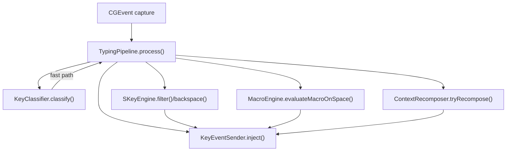
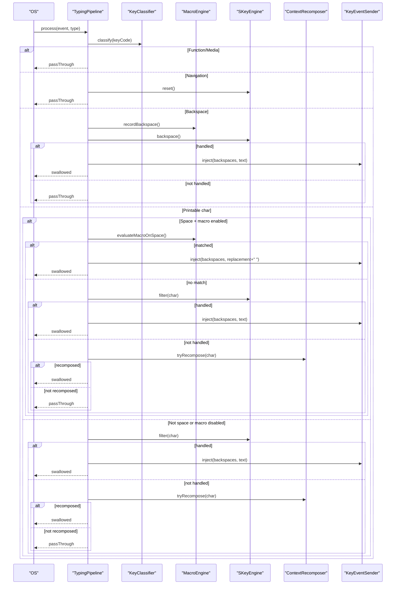
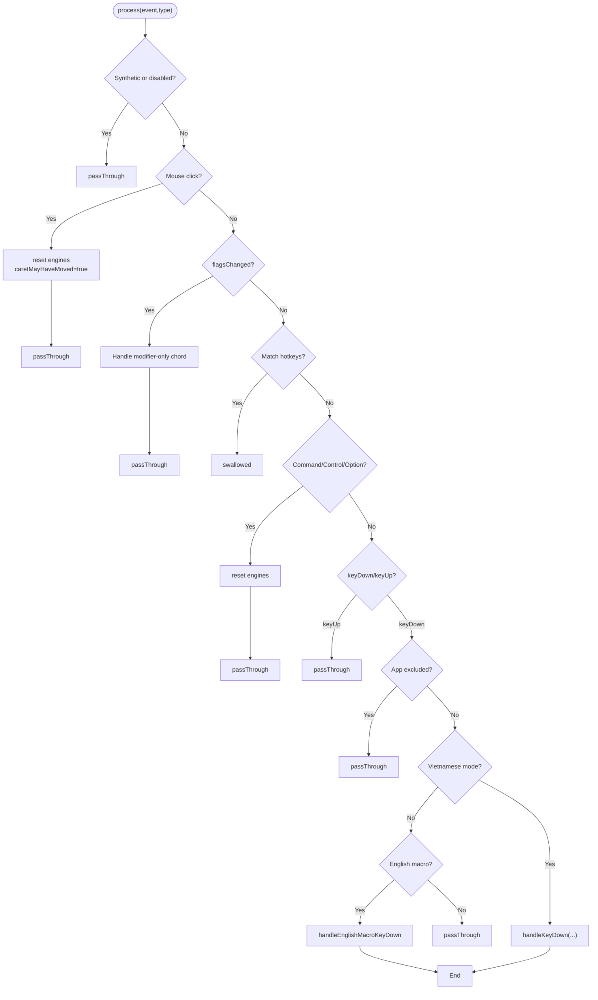
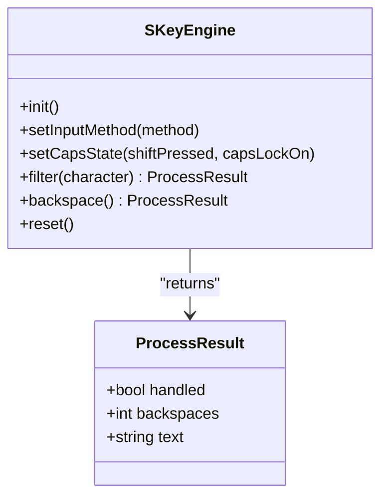
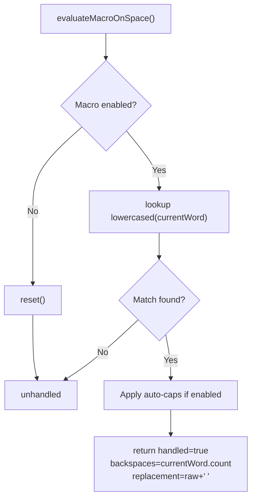
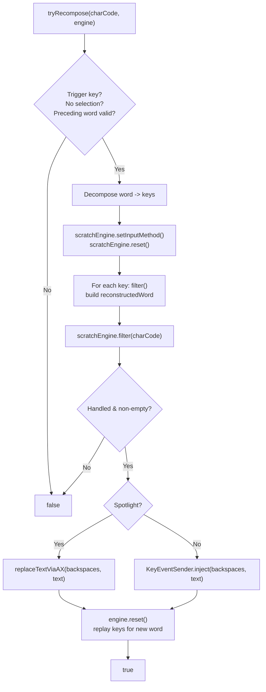
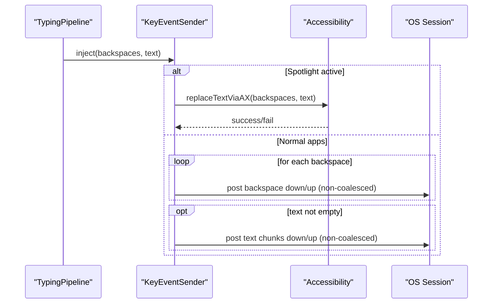
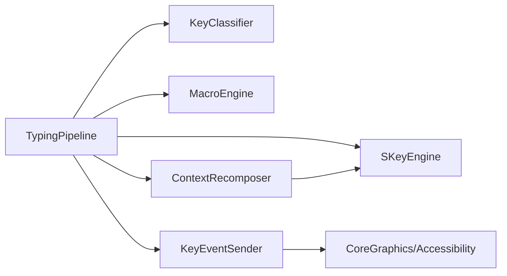

# Keystroke Processing Pipeline

<cite>
**Referenced Files in This Document**
- [TypingPipeline.swift](file://macos/skey-app/Sources/Features/Keyboard/EventHandling/Pipeline/TypingPipeline.swift)
- [KeyInterceptor.swift](file://macos/skey-app/Sources/Features/Keyboard/EventHandling/Pipeline/KeyInterceptor.swift)
- [SKeyEngine.swift](file://macos/skey-app/Sources/Features/Keyboard/Engine/SKeyEngine.swift)
- [InputMethod.swift](file://macos/skey-app/Sources/Features/Keyboard/Engine/InputMethod.swift)
- [KeyEventSender.swift](file://macos/skey-app/Sources/Features/Keyboard/EventHandling/KeyEventSender.swift)
- [KeyConstants.swift](file://macos/skey-app/Sources/Features/Keyboard/EventHandling/KeyConstants.swift)
- [ContextRecomposer.swift](file://macos/skey-app/Sources/Features/Keyboard/Context/ContextRecomposer.swift)
- [MacroEngine.swift](file://macos/skey-app/Sources/Features/Keyboard/Engine/MacroEngine.swift)
</cite>

## Table of Contents
1. Introduction
2. Project Structure
3. Core Components
4. Architecture Overview
5. Detailed Component Analysis
6. Dependency Analysis
7. Performance Considerations
8. Troubleshooting Guide
9. Conclusion

## Introduction
This document explains the keystroke processing pipeline that captures, transforms, and dispatches input events to produce correctly composed Vietnamese text and other typed content. It focuses on how key events are classified, converted into character codes, processed by the composing engine, and injected back into the system. It also documents specialized processing paths for macros, context recomposition, and navigation/backspace handling.

The pipeline is designed for low latency and high reliability: it avoids heap allocations on hot paths, uses fast classification tables, and coordinates with accessibility features only when necessary.

## Project Structure
At a high level, the pipeline consists of:
- Event interception and routing (pipeline stages)
- Key classification and fast-path decisions
- Composing engine integration (Vietnamese typing rules)
- Macro expansion
- Context-aware recomposition for editing existing words
- Synthetic event injection back to the OS or target app

**Diagram sources**
- [TypingPipeline.swift:31-170](file://macos/skey-app/Sources/Features/Keyboard/EventHandling/Pipeline/TypingPipeline.swift#L31-L170)
- [KeyConstants.swift:148-191](file://macos/skey-app/Sources/Features/Keyboard/EventHandling/KeyConstants.swift#L148-L191)
- [SKeyEngine.swift:133-145](file://macos/skey-app/Sources/Features/Keyboard/Engine/SKeyEngine.swift#L133-L145)
- [MacroEngine.swift:71-109](file://macos/skey-app/Sources/Features/Keyboard/Engine/MacroEngine.swift#L71-L109)
- [ContextRecomposer.swift:40-97](file://macos/skey-app/Sources/Features/Keyboard/Context/ContextRecomposer.swift#L40-L97)
- [KeyEventSender.swift:33-51](file://macos/skey-app/Sources/Features/Keyboard/EventHandling/KeyEventSender.swift#L33-L51)

**Section sources**
- [TypingPipeline.swift:31-170](file://macos/skey-app/Sources/Features/Keyboard/EventHandling/Pipeline/TypingPipeline.swift#L31-L170)
- [KeyConstants.swift:148-191](file://macos/skey-app/Sources/Features/Keyboard/EventHandling/KeyConstants.swift#L148-L191)

## Core Components
- TypingPipeline: Orchestrates event processing stages, classifies keys, decides fast paths, and coordinates with engine, macros, and recomposer.
- SKeyEngine: Thin wrapper around the Rust core engine; provides filter(character:) and backspace(), plus configuration and state reset.
- MacroEngine: Tracks current word buffer and expands shortcuts on space with optional auto-caps behavior.
- ContextRecomposer: Reconstructs full words atomically when editing previously typed words and applies tone/diacritic changes based on the active input method.
- KeyEventSender: Injects synthetic backspaces and Unicode text into the session or via Accessibility APIs for special targets like Spotlight.
- KeyConstants and KeyClassifier: Provide virtual keycodes and a fast lookup table to classify keys into categories (character, backspace, navigation, word break, function/media, modifier).
- InputMethodType: Enumerates supported input methods (Telex, VNI, VIQR, Simple Telex).

**Section sources**
- [TypingPipeline.swift:31-170](file://macos/skey-app/Sources/Features/Keyboard/EventHandling/Pipeline/TypingPipeline.swift#L31-L170)
- [SKeyEngine.swift:6-189](file://macos/skey-app/Sources/Features/Keyboard/Engine/SKeyEngine.swift#L6-L189)
- [MacroEngine.swift:16-111](file://macos/skey-app/Sources/Features/Keyboard/Engine/MacroEngine.swift#L16-L111)
- [ContextRecomposer.swift:9-97](file://macos/skey-app/Sources/Features/Keyboard/Context/ContextRecomposer.swift#L9-L97)
- [KeyEventSender.swift:9-127](file://macos/skey-app/Sources/Features/Keyboard/EventHandling/KeyEventSender.swift#L9-L127)
- [KeyConstants.swift:7-192](file://macos/skey-app/Sources/Features/Keyboard/EventHandling/KeyConstants.swift#L7-L192)
- [InputMethod.swift:5-19](file://macos/skey-app/Sources/Features/Keyboard/Engine/InputMethod.swift#L5-L19)

## Architecture Overview
The pipeline processes each CGEvent through a sequence of stages:
1. Pass-through checks for synthetic events, disabled taps, and mouse clicks.
2. Handle flagsChanged for modifier-only language toggle chords.
3. Match customizable hotkeys (language toggle, clipboard, cleaner, AI).
4. Early exit for command/control/option combinations.
5. Skip keyUp events and excluded applications.
6. For Vietnamese mode:
   - Classify key and apply fast paths (function/media, navigation, backspace, word-break).
   - Extract printable ASCII characters and optionally expand macros on space.
   - Filter through SKeyEngine.filter(character:) to compose Vietnamese text.
   - If unhandled and caret may have moved, attempt ContextRecomposer.tryRecompose().
7. Inject results via KeyEventSender.inject(backspaces:text:).

**Diagram sources**
- [TypingPipeline.swift:31-280](file://macos/skey-app/Sources/Features/Keyboard/EventHandling/Pipeline/TypingPipeline.swift#L31-L280)
- [MacroEngine.swift:71-109](file://macos/skey-app/Sources/Features/Keyboard/Engine/MacroEngine.swift#L71-L109)
- [SKeyEngine.swift:133-145](file://macos/skey-app/Sources/Features/Keyboard/Engine/SKeyEngine.swift#L133-L145)
- [ContextRecomposer.swift:40-97](file://macos/skey-app/Sources/Features/Keyboard/Context/ContextRecomposer.swift#L40-L97)
- [KeyEventSender.swift:33-51](file://macos/skey-app/Sources/Features/Keyboard/EventHandling/KeyEventSender.swift#L33-L51)

## Detailed Component Analysis

### TypingPipeline: Event Routing and Composition Control
- Entry point process(event:type:) implements a multi-stage pipeline:
  - Skips synthetic events, disabled taps, and mouse clicks.
  - Handles flagsChanged for modifier-only language toggle chords.
  - Matches configured hotkeys and swallows them.
  - Resets engine state on modifier combinations and navigation keys.
  - Filters printable ASCII characters and delegates to engine/filter or macro expansion.
  - Coordinates with ContextRecomposer when caret movement is detected.
- handleKeyDown(keyCode:flags:event:) performs key classification and fast-path routing:
  - Function/media keys pass through.
  - Navigation keys reset buffers and mark potential caret movement.
  - Backspace triggers engine.backspace() and injects synthetic backspaces/text.
  - Word-break keys (except space) reset buffers and pass through.
  - Space can trigger macro expansion before engine filtering.
  - Printable characters are filtered via SKeyEngine.filter(character:), with optional recomposition.

**Diagram sources**
- [TypingPipeline.swift:31-170](file://macos/skey-app/Sources/Features/Keyboard/EventHandling/Pipeline/TypingPipeline.swift#L31-L170)
- [TypingPipeline.swift:174-280](file://macos/skey-app/Sources/Features/Keyboard/EventHandling/Pipeline/TypingPipeline.swift#L174-L280)

**Section sources**
- [TypingPipeline.swift:31-280](file://macos/skey-app/Sources/Features/Keyboard/EventHandling/Pipeline/TypingPipeline.swift#L31-L280)

### SKeyEngine: Composing Engine Wrapper
- Provides filter(character:) and backspace() which return ProcessResult indicating whether the engine handled the input, how many backspaces to emit, and any resulting text.
- Configures default options, input method, charset, and caps state.
- Uses zero-allocation UTF-8 extraction from the Rust engine output buffer.

**Diagram sources**
- [SKeyEngine.swift:8-189](file://macos/skey-app/Sources/Features/Keyboard/Engine/SKeyEngine.swift#L8-L189)

**Section sources**
- [SKeyEngine.swift:27-189](file://macos/skey-app/Sources/Features/Keyboard/Engine/SKeyEngine.swift#L27-L189)

### MacroEngine: Shortcut Expansion on Space
- Maintains a sliding buffer of the current word and matches against a map of shortcuts to replacements.
- On space, returns MacroMatchResult with number of backspaces and replacement string (with optional auto-caps transformation).
- Records characters and backspaces to keep the buffer accurate.

**Diagram sources**
- [MacroEngine.swift:71-109](file://macos/skey-app/Sources/Features/Keyboard/Engine/MacroEngine.swift#L71-L109)

**Section sources**
- [MacroEngine.swift:16-111](file://macos/skey-app/Sources/Features/Keyboard/Engine/MacroEngine.swift#L16-L111)

### ContextRecomposer: Full-Word Recomposition
- Activated when caret may have moved (navigation keys) and an unhandled printable character is received.
- Validates candidate preceding word length and letters, decomposes it into keys, re-runs through a scratch engine with the active input method, then applies the new character.
- Performs atomic replacement of the entire preceding word using either Accessibility API (Spotlight) or KeyEventSender.
- Syncs the main engine state with the newly formed word.

**Diagram sources**
- [ContextRecomposer.swift:40-97](file://macos/skey-app/Sources/Features/Keyboard/Context/ContextRecomposer.swift#L40-L97)
- [KeyEventSender.swift:33-51](file://macos/skey-app/Sources/Features/Keyboard/EventHandling/KeyEventSender.swift#L33-L51)

**Section sources**
- [ContextRecomposer.swift:9-97](file://macos/skey-app/Sources/Features/Keyboard/Context/ContextRecomposer.swift#L9-L97)

### KeyEventSender: Synthetic Event Injection
- Injects backspaces followed by Unicode text.
- Uses direct Accessibility replacement for Spotlight overlay to avoid backspace loss.
- Otherwise posts non-coalesced key down/up events with chunked Unicode strings for reliable delivery.
- Stamps all synthetic events with a marker so they are ignored by the pipeline.

**Diagram sources**
- [KeyEventSender.swift:33-127](file://macos/skey-app/Sources/Features/Keyboard/EventHandling/KeyEventSender.swift#L33-L127)

**Section sources**
- [KeyEventSender.swift:9-127](file://macos/skey-app/Sources/Features/Keyboard/EventHandling/KeyEventSender.swift#L9-L127)

### Key Classification and Constants
- KeyConstants defines virtual keycodes and timing constants used for synthetic event delivery.
- KeyClassifier provides a fast lookup table mapping keycodes to categories (character, backspace, navigation, word break, function/media, modifier).

**Section sources**
- [KeyConstants.swift:7-192](file://macos/skey-app/Sources/Features/Keyboard/EventHandling/KeyConstants.swift#L7-L192)

### Input Method Types
- InputMethodType enumerates supported input methods: Telex, VNI, VIQR, Simple Telex.
- The engine’s input method affects how keys are interpreted and composed.

**Section sources**
- [InputMethod.swift:5-19](file://macos/skey-app/Sources/Features/Keyboard/Engine/InputMethod.swift#L5-L19)

## Dependency Analysis
- TypingPipeline depends on:
  - KeyClassifier for fast categorization
  - SKeyEngine for composition
  - MacroEngine for shortcut expansion
  - ContextRecomposer for context-aware recomposition
  - KeyEventSender for injecting results
- SKeyEngine wraps the Rust core engine and exposes filter/backspace operations.
- ContextRecomposer uses a scratch SKeyEngine instance and Accessibility utilities.
- KeyEventSender relies on CoreGraphics and Accessibility APIs.

**Diagram sources**
- [TypingPipeline.swift:31-280](file://macos/skey-app/Sources/Features/Keyboard/EventHandling/Pipeline/TypingPipeline.swift#L31-L280)
- [SKeyEngine.swift:133-145](file://macos/skey-app/Sources/Features/Keyboard/Engine/SKeyEngine.swift#L133-L145)
- [MacroEngine.swift:71-109](file://macos/skey-app/Sources/Features/Keyboard/Engine/MacroEngine.swift#L71-L109)
- [ContextRecomposer.swift:40-97](file://macos/skey-app/Sources/Features/Keyboard/Context/ContextRecomposer.swift#L40-L97)
- [KeyEventSender.swift:33-127](file://macos/skey-app/Sources/Features/Keyboard/EventHandling/KeyEventSender.swift#L33-L127)

**Section sources**
- [TypingPipeline.swift:31-280](file://macos/skey-app/Sources/Features/Keyboard/EventHandling/Pipeline/TypingPipeline.swift#L31-L280)

## Performance Considerations
- Fast-path classification via KeyClassifier reduces branching overhead.
- Zero-heap allocation strategies:
  - SKeyEngine reads engine output into stack buffers.
  - KeyEventSender sends text in chunks using temporary buffers.
- Non-coalesced synthetic events ensure reliable delivery across apps.
- Microsecond delays between synthetic backspaces and text chunks improve compatibility with sensitive targets.
- Modifier-only chord detection avoids unnecessary engine resets.

[No sources needed since this section provides general guidance]

## Troubleshooting Guide
- Events not being transformed:
  - Verify the pipeline is not passing through due to synthetic event markers or disabled taps.
  - Ensure the application is not excluded and that the language provider indicates Vietnamese mode.
- Incorrect composition after navigation:
  - Confirm caretMayHaveMoved is set appropriately and ContextRecomposer.tryRecompose() is invoked.
  - Check that the preceding word meets validity constraints and that the typed character is a trigger key for the active input method.
- Macros not expanding:
  - Ensure macro feature is enabled and the current word matches a configured shortcut.
  - Verify auto-caps settings and that space triggers evaluation.
- Text not appearing in Spotlight:
  - Confirm Accessibility replacement path is taken and succeeds.
- Excessive backspaces or missing characters:
  - Review resolveBackspaces logic for web browsers with active selections.
  - Check inter-chunk and settle delays in KeyEventSender.

**Section sources**
- [TypingPipeline.swift:31-280](file://macos/skey-app/Sources/Features/Keyboard/EventHandling/Pipeline/TypingPipeline.swift#L31-L280)
- [ContextRecomposer.swift:40-97](file://macos/skey-app/Sources/Features/Keyboard/Context/ContextRecomposer.swift#L40-L97)
- [MacroEngine.swift:71-109](file://macos/skey-app/Sources/Features/Keyboard/Engine/MacroEngine.swift#L71-L109)
- [KeyEventSender.swift:33-127](file://macos/skey-app/Sources/Features/Keyboard/EventHandling/KeyEventSender.swift#L33-L127)

## Conclusion
The keystroke processing pipeline integrates event interception, fast classification, composing engine calls, macro expansion, and context-aware recomposition to deliver accurate Vietnamese typing and robust text insertion across diverse applications. Its design emphasizes performance, correctness, and compatibility, with careful handling of edge cases such as navigation, modifiers, and special targets like Spotlight.

[No sources needed since this section summarizes without analyzing specific files]