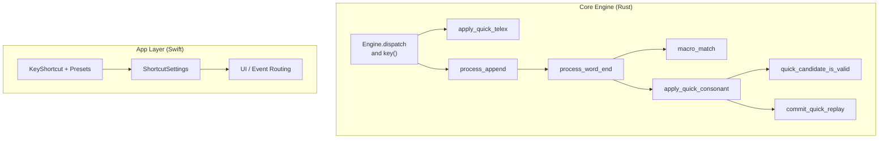
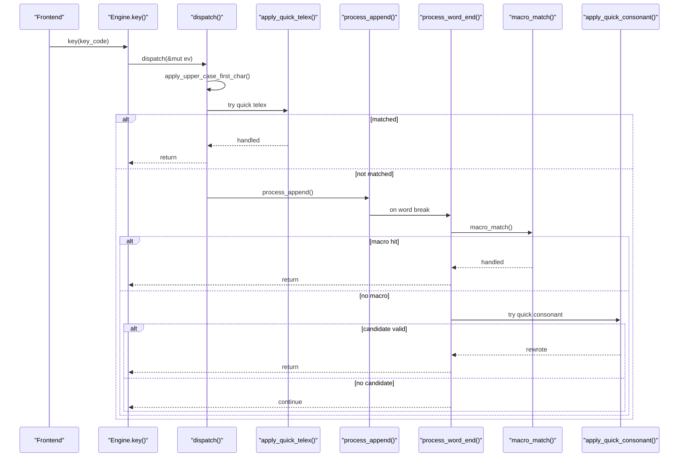
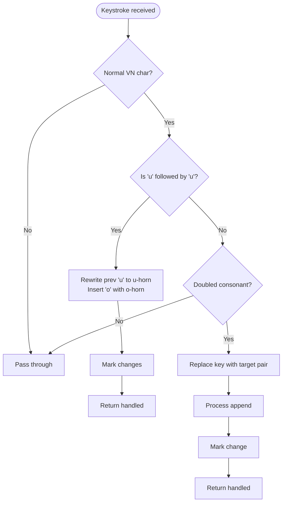
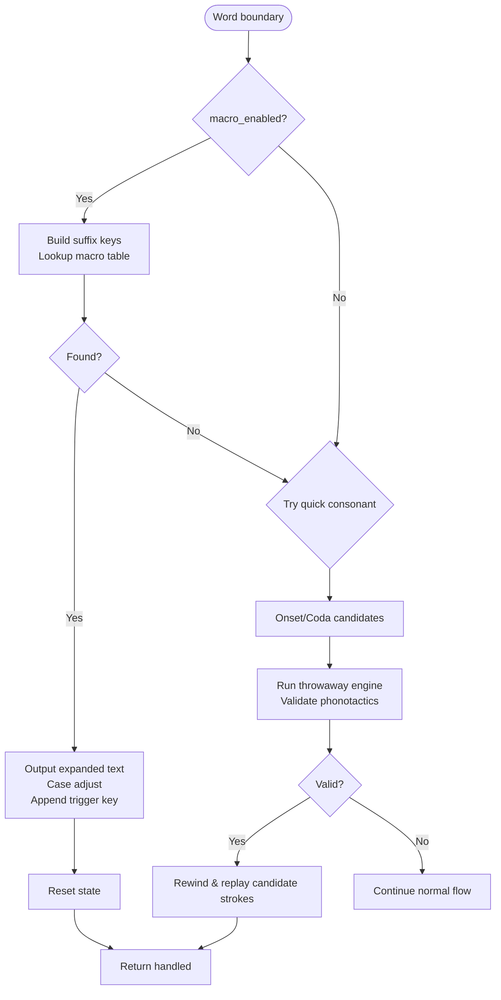
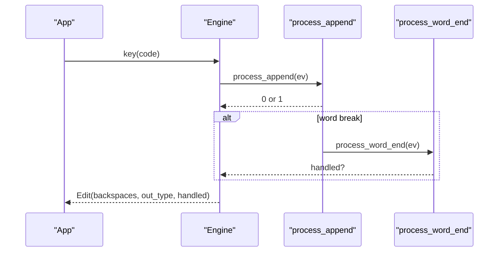
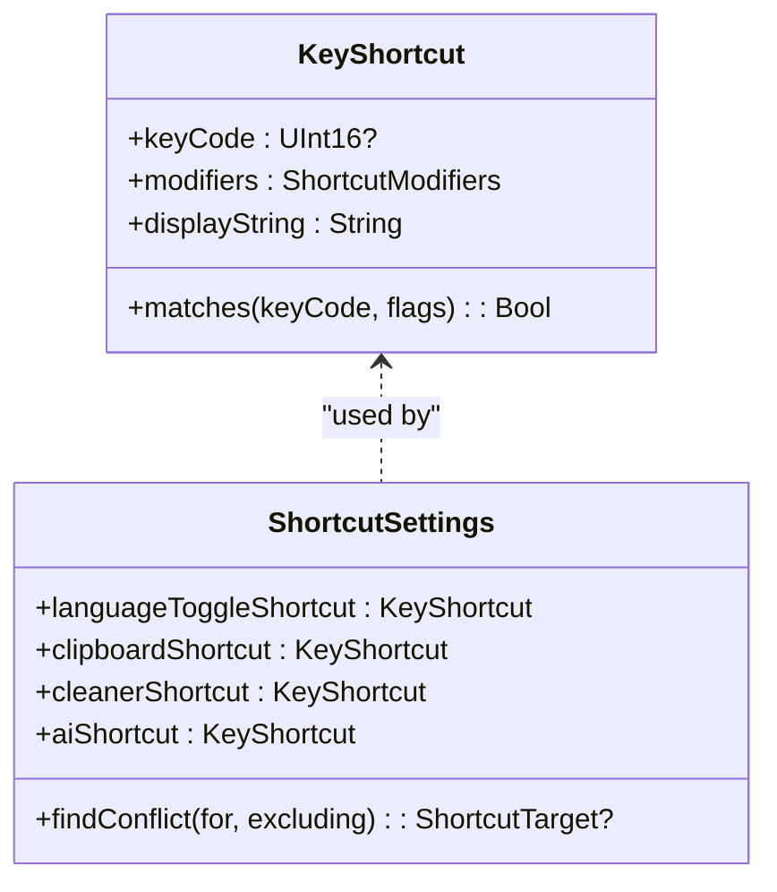
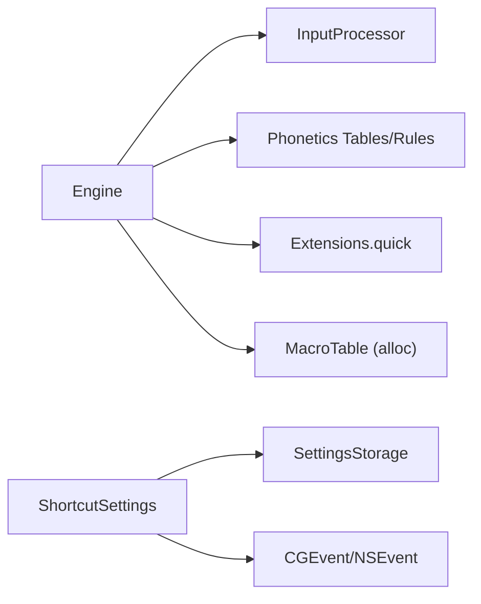

# Shortcuts and Quick Actions

<cite>
**Referenced Files in This Document**
- [shortcuts.rs](file://port/skey-core/src/engine/shortcuts.rs)
- [types.rs](file://port/skey-core/src/engine/types.rs)
- [mod.rs](file://port/skey-core/src/engine/mod.rs)
- [append.rs](file://port/skey-core/src/engine/append.rs)
- [quick.rs](file://port/skey-core/src/extensions/quick.rs)
- [KeyShortcut.swift](file://macos/skey-app/Sources/Shared/Shortcuts/KeyShortcut.swift)
- [ShortcutSettings.swift](file://macos/skey-app/Sources/Shared/Settings/Modules/ShortcutSettings.swift)
- [test_shortcuts.swift](file://macos/skey-app/scripts/test_shortcuts.swift)
</cite>

## Table of Contents
1. Introduction
2. Project Structure
3. Core Components
4. Architecture Overview
5. Detailed Component Analysis
6. Dependency Analysis
7. Performance Considerations
8. Troubleshooting Guide
9. Conclusion
10. Appendices

## Introduction
This document explains the shortcuts system that provides quick actions and text expansion within the typing engine. It covers how shortcuts are defined, matched, and executed during keystroke processing; how they integrate with the main dispatch pipeline; and how they interact with regular character input. It also documents configuration options for enabling or disabling shortcuts, built-in examples, and guidelines for implementing custom shortcuts while maintaining compatibility with the core engine.

## Project Structure
The shortcuts system spans two layers:
- Core engine (Rust): Implements macro/text expansion and “quick” Telex-style shortcuts that rewrite typed strokes into valid Vietnamese sequences at word boundaries.
- macOS app layer (Swift): Provides user-facing shortcut definitions, presets, conflict detection, and persistence for application-level shortcuts (e.g., language toggle, clipboard, cleaner, AI).

**Diagram sources**
- [mod.rs:209-225](file://port/skey-core/src/engine/mod.rs#L209-L225)
- [shortcuts.rs:232-297](file://port/skey-core/src/engine/shortcuts.rs#L232-L297)
- [shortcuts.rs:518-590](file://port/skey-core/src/engine/shortcuts.rs#L518-L590)
- [quick.rs:10-82](file://port/skey-core/src/extensions/quick.rs#L10-L82)
- [KeyShortcut.swift:68-159](file://macos/skey-app/Sources/Shared/Shortcuts/KeyShortcut.swift#L68-L159)
- [ShortcutSettings.swift:20-330](file://macos/skey-app/Sources/Shared/Settings/Modules/ShortcutSettings.swift#L20-L330)

**Section sources**
- [mod.rs:18-70](file://port/skey-core/src/engine/mod.rs#L18-L70)
- [KeyShortcut.swift:68-159](file://macos/skey-app/Sources/Shared/Shortcuts/KeyShortcut.swift#L68-L159)
- [ShortcutSettings.swift:20-330](file://macos/skey-app/Sources/Shared/Settings/Modules/ShortcutSettings.swift#L20-L330)

## Core Components
- Engine dispatch and key handling: The central entry points for keystrokes and dispatch to specialized handlers.
- Quick Telex shortcuts: Immediate rewriting of doubled consonants and special vowel sequences.
- Word-end shortcuts: Macro expansion and quick consonant substitutions applied when a word ends.
- Options: Feature flags controlling which shortcuts are active.
- App-layer shortcuts: User-configurable global shortcuts for features like language toggle, clipboard, cleaner, and AI.

**Section sources**
- [mod.rs:209-225](file://port/skey-core/src/engine/mod.rs#L209-L225)
- [shortcuts.rs:232-297](file://port/skey-core/src/engine/shortcuts.rs#L232-L297)
- [shortcuts.rs:518-590](file://port/skey-core/src/engine/shortcuts.rs#L518-L590)
- [types.rs:34-105](file://port/skey-core/src/engine/types.rs#L34-L105)
- [KeyShortcut.swift:68-159](file://macos/skey-app/Sources/Shared/Shortcuts/KeyShortcut.swift#L68-L159)
- [ShortcutSettings.swift:20-330](file://macos/skey-app/Sources/Shared/Settings/Modules/ShortcutSettings.swift#L20-L330)

## Architecture Overview
At each keystroke:
1. The engine prepares state and converts the raw key code into a KeyEvent.
2. Early transformations run:
   - Capitalize-first-letter logic.
   - Quick Telex shortcuts (e.g., doubled consonants, special vowel sequences).
3. The event is dispatched to specific processors or appended to the current word.
4. At word boundaries, additional shortcuts may apply:
   - Macro/text expansion lookup.
   - Quick consonant substitution candidates validated against phonotactics.
   - Optional restoration of original key strokes if conversion swallowed a key or produced an invalid result.

**Diagram sources**
- [mod.rs:209-225](file://port/skey-core/src/engine/mod.rs#L209-L225)
- [shortcuts.rs:232-297](file://port/skey-core/src/engine/shortcuts.rs#L232-L297)
- [shortcuts.rs:518-590](file://port/skey-core/src/engine/shortcuts.rs#L518-L590)

## Detailed Component Analysis

### Quick Telex Shortcuts (Immediate Rewrites)
- Purpose: Rewrite certain immediate patterns before normal appending, such as doubled consonants (“cc” → “ch”) and a special case where “uu” becomes “u horn + o horn”.
- Behavior:
  - Only applies to normal Vietnamese characters.
  - For “uu”, it rewrites the previous buffer entry and inserts a partner character, then marks changes and returns handled.
  - For other doubled consonants, it replaces the current key with the target pair, processes it, and marks the change.
- Configuration: Controlled by `quick_telex` option.

**Diagram sources**
- [shortcuts.rs:232-297](file://port/skey-core/src/engine/shortcuts.rs#L232-L297)
- [quick.rs:10-82](file://port/skey-core/src/extensions/quick.rs#L10-L82)

**Section sources**
- [shortcuts.rs:232-297](file://port/skey-core/src/engine/shortcuts.rs#L232-L297)
- [quick.rs:10-82](file://port/skey-core/src/extensions/quick.rs#L10-L82)
- [types.rs:34-105](file://port/skey-core/src/engine/types.rs#L34-L105)

### Word-End Shortcuts: Macros and Quick Consonants
- Macro/text expansion:
  - Scans backwards from the current position to build candidate keys and looks them up in the macro store.
  - On match, outputs expanded text (case-adjusted), appends the triggering key if needed, resets state, and reports handled.
  - Disabled when allocator feature is off; otherwise controlled by `macro_enabled`.
- Quick consonant substitution:
  - At word end, builds candidates using onset/coda tables (e.g., “f” → “ph”, “g” → “ng”).
  - Validates candidates by running them through a throwaway engine instance with shortcuts disabled to ensure validity.
  - If valid, rewinds and replays the candidate strokes, marking changes appropriately.
  - Controlled by `quick_start_consonant` and `quick_end_consonant`.

**Diagram sources**
- [shortcuts.rs:44-180](file://port/skey-core/src/engine/shortcuts.rs#L44-L180)
- [shortcuts.rs:374-515](file://port/skey-core/src/engine/shortcuts.rs#L374-L515)
- [quick.rs:38-82](file://port/skey-core/src/extensions/quick.rs#L38-L82)

**Section sources**
- [shortcuts.rs:44-180](file://port/skey-core/src/engine/shortcuts.rs#L44-L180)
- [shortcuts.rs:374-515](file://port/skey-core/src/engine/shortcuts.rs#L374-L515)
- [quick.rs:38-82](file://port/skey-core/src/extensions/quick.rs#L38-L82)
- [types.rs:34-105](file://port/skey-core/src/engine/types.rs#L34-L105)

### Integration With Regular Character Input
- Normal characters are appended via `process_append`, which routes vowels and consonants to dedicated paths that update the internal buffer and mark changes.
- Word breaks trigger `process_word_end`, where shortcuts can intervene before finalizing the output.
- Restoration logic:
  - If spell checking is enabled and the last word is non-Vietnamese or a listed English word swallowed a key, the engine can restore original key strokes to avoid unintended conversions.
  - Controlled by `auto_non_vn_restore` and `swallowed_key_restore`.

**Diagram sources**
- [append.rs:141-196](file://port/skey-core/src/engine/append.rs#L141-L196)
- [shortcuts.rs:518-590](file://port/skey-core/src/engine/shortcuts.rs#L518-L590)

**Section sources**
- [append.rs:141-196](file://port/skey-core/src/engine/append.rs#L141-L196)
- [shortcuts.rs:518-590](file://port/skey-core/src/engine/shortcuts.rs#L518-L590)

### App-Level Shortcuts (Global Actions)
- KeyShortcut model: Represents a combination of modifiers and an optional key code, with helpers for display strings, matching CGEvent flags, and menu integration.
- ShortcutSettings: Manages presets and custom shortcuts for features like language toggle, clipboard, cleaner, and AI. Includes conflict detection across targets and persistence.
- Built-in presets include combinations like Option+Z, Control+Space, Command+Shift+V, etc.

**Diagram sources**
- [KeyShortcut.swift:68-159](file://macos/skey-app/Sources/Shared/Shortcuts/KeyShortcut.swift#L68-L159)
- [ShortcutSettings.swift:20-330](file://macos/skey-app/Sources/Shared/Settings/Modules/ShortcutSettings.swift#L20-L330)

**Section sources**
- [KeyShortcut.swift:68-159](file://macos/skey-app/Sources/Shared/Shortcuts/KeyShortcut.swift#L68-L159)
- [ShortcutSettings.swift:20-330](file://macos/skey-app/Sources/Shared/Settings/Modules/ShortcutSettings.swift#L20-L330)
- [test_shortcuts.swift:1-110](file://macos/skey-app/scripts/test_shortcuts.swift#L1-L110)

## Dependency Analysis
- Engine depends on:
  - Input processor for key-to-event conversion.
  - Phonetics tables/rules for validation.
  - Extensions for quick shortcuts (tables and predicates).
  - Optional macro table (feature-gated).
- App layer depends on:
  - System event APIs for capturing and matching shortcuts.
  - Settings storage for persistence.

**Diagram sources**
- [mod.rs:18-70](file://port/skey-core/src/engine/mod.rs#L18-L70)
- [quick.rs:10-82](file://port/skey-core/src/extensions/quick.rs#L10-L82)
- [ShortcutSettings.swift:20-330](file://macos/skey-app/Sources/Shared/Settings/Modules/ShortcutSettings.swift#L20-L330)

**Section sources**
- [mod.rs:18-70](file://port/skey-core/src/engine/mod.rs#L18-L70)
- [quick.rs:10-82](file://port/skey-core/src/extensions/quick.rs#L10-L82)
- [ShortcutSettings.swift:20-330](file://macos/skey-app/Sources/Shared/Settings/Modules/ShortcutSettings.swift#L20-L330)

## Performance Considerations
- Quick Telex runs inline per keystroke and avoids allocations; it short-circuits early for non-VN events.
- Macro matching walks backward over the current word but uses fixed-size stack buffers to avoid heap allocation on hot paths.
- Quick consonant validation uses a throwaway engine instance with shortcuts disabled to prevent recursion; this adds overhead only at word boundaries and only when enabled.
- Spell-check-related restoration checks are conditional and bounded by options; they avoid unnecessary work when disabled.
- Buffer management ensures minimal copying and efficient backspace calculations based on charset step semantics.

[No sources needed since this section provides general guidance]

## Troubleshooting Guide
- Shortcuts not firing:
  - Verify relevant options are enabled (`macro_enabled`, `quick_telex`, `quick_start_consonant`, `quick_end_consonant`).
  - Ensure the event type and character type match expectations (e.g., quick telex requires normal VN characters).
- Unexpected text expansion:
  - Check macro table entries and case-handling logic; macros preserve case based on the first character’s case pattern.
- Restored keys appearing:
  - Review `auto_non_vn_restore` and `swallowed_key_restore`; these can revert conversions when results are invalid or when a listed English word swallowed a key.
- Conflicts between app-level shortcuts:
  - Use conflict detection utilities to identify overlapping shortcuts across features (language toggle, clipboard, cleaner, AI).

**Section sources**
- [types.rs:34-105](file://port/skey-core/src/engine/types.rs#L34-L105)
- [shortcuts.rs:44-180](file://port/skey-core/src/engine/shortcuts.rs#L44-L180)
- [shortcuts.rs:518-590](file://port/skey-core/src/engine/shortcuts.rs#L518-L590)
- [ShortcutSettings.swift:247-330](file://macos/skey-app/Sources/Shared/Settings/Modules/ShortcutSettings.swift#L247-L330)

## Conclusion
The shortcuts system combines immediate, per-keystroke rewrites with word-boundary expansions and validations to deliver fast, context-aware typing assistance. Quick Telex handles common patterns instantly, while macros and quick consonant substitutions provide powerful text expansion and correction at word ends. App-level shortcuts offer configurable global actions with preset support and conflict detection. Properly tuning options ensures optimal performance and behavior aligned with user preferences.

[No sources needed since this section summarizes without analyzing specific files]

## Appendices

### Configuration Options Summary
- `macro_enabled`: Enable/disable macro/text expansion at word boundaries.
- `quick_telex`: Enable/disable immediate doubled-consonant and special vowel sequence rewrites.
- `quick_start_consonant`: Enable/disable onset shortcuts (e.g., “f” → “ph”).
- `quick_end_consonant`: Enable/disable coda shortcuts (e.g., “g” → “ng”), applied only when they rescue an invalid word.
- `upper_case_first_char`: Capitalize the first letter after sentence-ending punctuation or newlines.
- `allow_consonant_zfwj`: Treat certain letters as ordinary consonants to allow tones on words containing them.
- `spell_check_enabled`, `auto_non_vn_restore`, `swallowed_key_restore`: Control spell-checking behavior and automatic restoration of original key strokes.

**Section sources**
- [types.rs:34-105](file://port/skey-core/src/engine/types.rs#L34-L105)

### Built-in Shortcut Examples (App Layer)
- Language toggle presets: Option+Z, Control+Shift, Control+Option+Z, Command+Shift, Option+Shift, Control+Space.
- Clipboard presets: Option+V, Command+Shift+V, Control+Option+V, Option+C.
- Cleaner presets: Option+Shift+K, Option+Shift+C, Control+Option+K.
- AI presets: Option+Space, Control+Option+Space, Command+Shift+Space.

**Section sources**
- [ShortcutSettings.swift:41-67](file://macos/skey-app/Sources/Shared/Settings/Modules/ShortcutSettings.swift#L41-L67)
- [KeyShortcut.swift:93-114](file://macos/skey-app/Sources/Shared/Shortcuts/KeyShortcut.swift#L93-L114)
- [test_shortcuts.swift:22-50](file://macos/skey-app/scripts/test_shortcuts.swift#L22-L50)

### Guidelines for Implementing Custom Shortcuts
- Keep quick shortcuts pure and table-driven where possible to maintain performance and testability.
- Ensure shortcuts do not consume keys that should pass through (e.g., control keys, non-VN characters) unless explicitly intended.
- Validate any stroke-based substitutions against phonotactic rules to avoid producing invalid words.
- Respect existing options and early-exit conditions to avoid interfering with normal typing flow.
- For app-level shortcuts, use the provided models and settings module to ensure consistent persistence and conflict detection.

[No sources needed since this section provides general guidance]