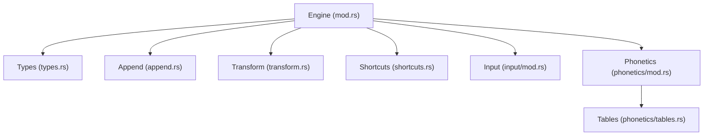
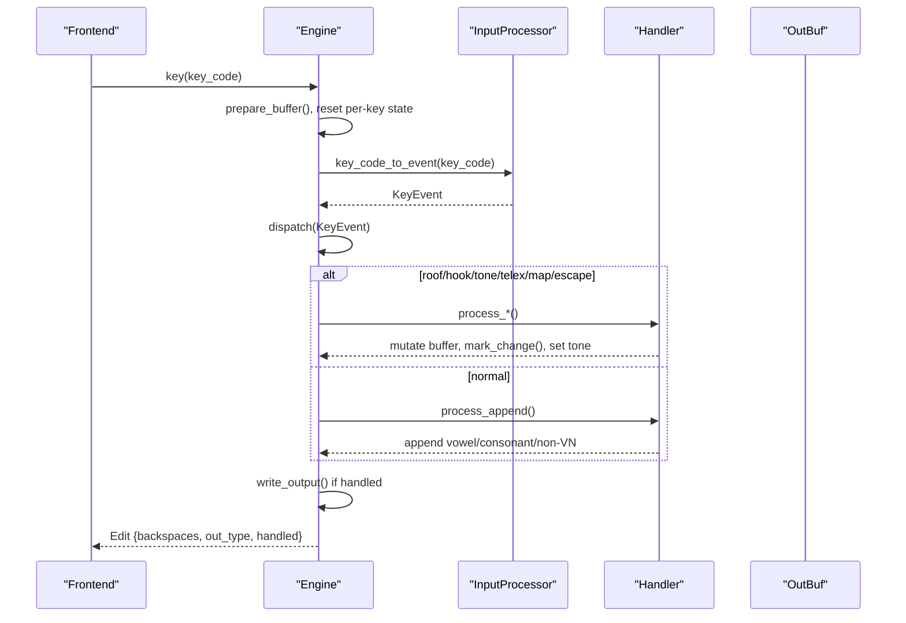
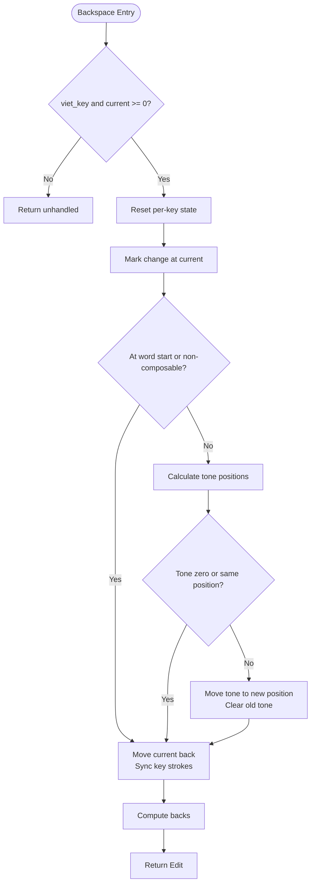
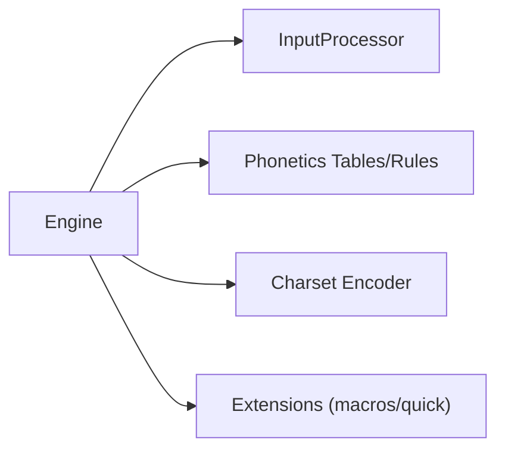

# State Machine and Buffer Management

<cite>
**Referenced Files in This Document**
- [mod.rs](file://port/skey-core/src/engine/mod.rs)
- [types.rs](file://port/skey-core/src/engine/types.rs)
- [append.rs](file://port/skey-core/src/engine/append.rs)
- [transform.rs](file://port/skey-core/src/engine/transform.rs)
- [shortcuts.rs](file://port/skey-core/src/engine/shortcuts.rs)
- [input/mod.rs](file://port/skey-core/src/input/mod.rs)
- [phonetics/mod.rs](file://port/skey-core/src/phonetics/mod.rs)
- [tables.rs](file://port/skey-core/src/phonetics/tables.rs)
- [simple_telex.rs](file://port/skey-core/tests/simple_telex.rs)
</cite>

## Table of Contents
1. [Introduction](#introduction)
2. [Project Structure](#project-structure)
3. [Core Components](#core-components)
4. [Architecture Overview](#architecture-overview)
5. [Detailed Component Analysis](#detailed-component-analysis)
6. [Dependency Analysis](#dependency-analysis)
7. [Performance Considerations](#performance-considerations)
8. [Troubleshooting Guide](#troubleshooting-guide)
9. [Conclusion](#conclusion)

## Introduction
This document explains the Vietnamese typing engine’s state machine and buffer management as implemented in the Rust port under port/skey-core. It focuses on how the Engine struct maintains per-keystroke and cross-keystroke state, how WordInfo entries model characters within a word, how the buffer indexing system tracks composition, and how state transitions occur during character composition, backspace operations, and word boundary detection. It also covers Telex input processing behavior and how the implementation preserves byte-for-byte parity with the original C++ engine by mirroring its control flow, side effects, and output semantics.

## Project Structure
The engine is organized into focused modules:
- Engine orchestration and state: mod.rs
- Types and constants: types.rs
- Append logic for vowels/consonants and non-Vietnamese handling: append.rs
- Diacritic transformations (roof, hook, tone, d-stroke, map char): transform.rs
- Shortcuts, macros, restoration, and word-end processing: shortcuts.rs
- Input classification and key mapping: input/mod.rs
- Phonetics tables and rules: phonetics/mod.rs and tables.rs
- Tests validating behavior across input methods: simple_telex.rs

**Diagram sources**
- [mod.rs:18-70](file://port/skey-core/src/engine/mod.rs#L18-L70)
- [types.rs:107-235](file://port/skey-core/src/engine/types.rs#L107-L235)
- [append.rs:141-196](file://port/skey-core/src/engine/append.rs#L141-L196)
- [transform.rs:70-770](file://port/skey-core/src/engine/transform.rs#L70-L770)
- [shortcuts.rs:19-675](file://port/skey-core/src/engine/shortcuts.rs#L19-L675)
- [input/mod.rs:50-215](file://port/skey-core/src/input/mod.rs#L50-L215)
- [phonetics/mod.rs:1-16](file://port/skey-core/src/phonetics/mod.rs#L1-L16)
- [tables.rs:1-200](file://port/skey-core/src/phonetics/tables.rs#L1-L200)

**Section sources**
- [mod.rs:18-70](file://port/skey-core/src/engine/mod.rs#L18-L70)
- [types.rs:107-235](file://port/skey-core/src/engine/types.rs#L107-L235)
- [input/mod.rs:50-215](file://port/skey-core/src/input/mod.rs#L50-L215)
- [phonetics/mod.rs:1-16](file://port/skey-core/src/phonetics/mod.rs#L1-L16)
- [tables.rs:1-200](file://port/skey-core/src/phonetics/tables.rs#L1-L200)

## Core Components
- Engine: Central state machine holding persistent buffers and per-keystroke scratch state. Manages dispatch to specialized handlers based on event type.
- WordInfo: Compact representation of one buffer entry storing symbol, sequence indices, offsets, tone, form, and capitalization.
- KeyEvent and InputProcessor: Classify keys into events (roof, hook, tone, telex, map char, escape, normal) and determine character type (Vietnamese, word break, non-Vietnamese, reset).
- Output and encoding: OutBuf and charset encoder produce bytes; change_pos and backs track what must be emitted and how many backspaces are needed.

Key responsibilities:
- Maintain current word index and key stroke history for restore.
- Track whether the last keystroke converted or was restored.
- Apply quick shortcuts, macro expansion, and auto-restoration at word boundaries.
- Ensure output parity with the original engine via identical state mutations and output sizing.

**Section sources**
- [mod.rs:18-70](file://port/skey-core/src/engine/mod.rs#L18-L70)
- [types.rs:107-235](file://port/skey-core/src/engine/types.rs#L107-L235)
- [input/mod.rs:50-215](file://port/skey-core/src/input/mod.rs#L50-L215)

## Architecture Overview
The engine processes each keystroke through a consistent pipeline:
1. Prepare buffers and reset per-keystroke state.
2. Convert raw key code to KeyEvent using InputProcessor.
3. Dispatch to specific handler based on ev_type (roof/hook/tone/telex/map/escape/normal).
4. Handlers mutate buffer entries, mark changes, adjust tones, and update single_mode/capitalise_next flags.
5. On handled output, write_output encodes changed range to OutBuf; backspaces computed from change_pos to current.
6. At word boundaries, apply macros, quick consonant shortcuts, and optional automatic restoration if the result is invalid.

**Diagram sources**
- [mod.rs:249-319](file://port/skey-core/src/engine/mod.rs#L249-L319)
- [input/mod.rs:162-192](file://port/skey-core/src/input/mod.rs#L162-L192)
- [append.rs:141-196](file://port/skey-core/src/engine/append.rs#L141-L196)
- [transform.rs:70-770](file://port/skey-core/src/engine/transform.rs#L70-L770)
- [shortcuts.rs:518-590](file://port/skey-core/src/engine/shortcuts.rs#L518-L590)

## Detailed Component Analysis

### Engine State Management and Buffer Indexing
- Persistent state:
  - buffer: array of WordInfo representing the current word being composed.
  - keys and converted: per-keystroke history used for restore_key_strokes.
  - current and key_current: indices into buffer and keys arrays.
  - single_mode, to_escape, capitalise_next: flags controlling composition behavior and capitalization after sentence-ending punctuation.
  - viet_key, options, charset, input: configuration and method-specific behavior.
  - caps_lock_on, shift_pressed: affect case mapping.
  - used_as_map_char: enables fallback path for w key in Telex.
- Per-keystroke state:
  - out, out_size, backs, change_pos, out_written, reverted, key_restored, key_restoring, out_type: manage output generation and restoration loops.

Buffer indexing:
- Accessors b(i), bm(i) provide immutable/mutable access to buffer[i] with bounds checks.
- cur() returns the current WordInfo.
- change_pos marks the start of the range that needs to be re-encoded when modifications occur.
- get_seq_steps computes backspaces depending on charset (UTF-8 vs others).

Word boundary detection:
- at_word_beginning() checks if current < 0 or current entry is empty.
- key_is_word_break uses UKC_WORD_BREAK classification.
- process_word_end finalizes the word, applies macros/quick shortcuts, and writes EMPTY marker.

**Section sources**
- [mod.rs:18-70](file://port/skey-core/src/engine/mod.rs#L18-L70)
- [mod.rs:169-188](file://port/skey-core/src/engine/mod.rs#L169-L188)
- [append.rs:29-66](file://port/skey-core/src/engine/append.rs#L29-L66)
- [shortcuts.rs:518-590](file://port/skey-core/src/engine/shortcuts.rs#L518-L590)

### WordInfo Structure and Composition States
WordInfo fields:
- key_code: original key code for non-Vietnamese or mapped characters.
- vn_sym: normalized Vietnamese symbol (Lexi).
- seq: shared field for vowel or consonant sequences (VSeq/CSeq).
- c1o, vo, c2o: offsets to first consonant, vowel, second consonant positions within the word.
- bits: packed form, tone level, and capitalization flag.

Form states:
- VNW_NON_VN, VNW_EMPTY, VNW_C, VNW_V, VNW_CV, VNW_VC, VNW_CVC.

Tone and position:
- Tone stored per entry; get_tone_position determines where tone should sit based on VSeq and modern style.

Complexity:
- WordInfo is compact (12 bytes) to reduce memory footprint while preserving layout compatibility with the original.

**Section sources**
- [types.rs:107-235](file://port/skey-core/src/engine/types.rs#L107-L235)
- [transform.rs:14-52](file://port/skey-core/src/engine/transform.rs#L14-L52)

### Character Composition: Vowels and Consonants
Vowel appending:
- Determines base symbol without tone, updates caps and tone.
- Extends or creates VSeq based on previous form and validity checks (is_valid_cv).
- Handles special cases like u after q and i after g behaving as consonants.
- Marks changes and may move tone to new position.

Consonant appending:
- Creates or extends CSeq based on previous form and validity (is_valid_cvc).
- Handles complex events like u+o combinations transforming to u+o+.
- Adjusts tone position when vowel sequence length changes.

Non-Vietnamese and escapes:
- Non-Vietnamese characters are appended directly; in VIQR mode, check_escape_viqr can emit escape sequences.
- Escape mode toggles to treat next character literally or insert a backspace and literal character.

**Section sources**
- [append.rs:141-196](file://port/skey-core/src/engine/append.rs#L141-L196)
- [append.rs:201-369](file://port/skey-core/src/engine/append.rs#L201-L369)
- [append.rs:371-575](file://port/skey-core/src/engine/append.rs#L371-L575)
- [append.rs:577-617](file://port/skey-core/src/engine/append.rs#L577-L617)

### Diacritics: Roof, Hook, Tone, and d-stroke
Roof:
- Adds or removes roof diacritic on applicable vowels; handles u+o variants and free marking option.
- Updates sub-sequence markers and tone position.

Hook:
- Adds/removes hook on u/o variants; includes special handling for th/h contexts producing u+o+.
- Validates resulting CVC forms and adjusts tone.

Tone:
- Applies tone to correct position determined by VSeq; supports toggling off tone.
- Enforces constraints for certain coda consonants disallowing specific tones.

d-stroke:
- Transforms d to dd and back; sets single_mode for abbreviations.

Map char:
- Maps ISO key codes to Vietnamese symbols; supports undoing mapping when redundant.

**Section sources**
- [transform.rs:70-189](file://port/skey-core/src/engine/transform.rs#L70-L189)
- [transform.rs:191-467](file://port/skey-core/src/engine/transform.rs#L191-L467)
- [transform.rs:469-536](file://port/skey-core/src/engine/transform.rs#L469-L536)
- [transform.rs:538-601](file://port/skey-core/src/engine/transform.rs#L538-L601)
- [transform.rs:603-673](file://port/skey-core/src/engine/transform.rs#L603-L673)

### Backspace Operations and Tone Repositioning
Backspace behavior:
- If at word start or on non-composable forms, moves current back and synchronizes key stroke buffer.
- For valid compositions, calculates v_start/v_end and tone positions; moves tone if necessary before moving current back.
- Ensures proper backspaces count and output regeneration.

Flow:

**Diagram sources**
- [mod.rs:321-405](file://port/skey-core/src/engine/mod.rs#L321-L405)

**Section sources**
- [mod.rs:321-405](file://port/skey-core/src/engine/mod.rs#L321-L405)

### Word Boundary Detection and Restoration
Word end processing:
- Attempts macro expansion if enabled.
- Applies quick consonant shortcuts (onset/coda) when configured.
- If spell checking disabled or single mode, writes EMPTY marker and continues.
- Otherwise, checks for automatic restoration based on swallowed key restore or phonotactic invalidity.

Restoration:
- Walks back to last word break, identifies converted keys, rewinds buffer, and replays raw key strokes.
- Outputs original key codes to allow front-end to revert user’s typed text.

**Section sources**
- [shortcuts.rs:518-590](file://port/skey-core/src/engine/shortcuts.rs#L518-L590)
- [shortcuts.rs:300-371](file://port/skey-core/src/engine/shortcuts.rs#L300-L371)

### Telex Input Processing and Parity
Telex-specific behaviors:
- w key: attempts hook application; if not applicable, falls back to mapping to uh/Uh; used_as_map_char ensures correct fallback.
- Quick telex shortcuts: doubled consonants (cc->ch, etc.) and uu->u+o+ when enabled.
- Simple Telex mode: treats w differently at word start compared to standard Telex.

Parity guarantees:
- Event classification and dispatch mirror original control flow.
- Output sizing and backspaces computed identically; OutBuf capacity and stream counter preserved.
- Debug assertions compare tone position calculations against reference implementations.

**Section sources**
- [transform.rs:675-712](file://port/skey-core/src/engine/transform.rs#L675-L712)
- [shortcuts.rs:232-297](file://port/skey-core/src/engine/shortcuts.rs#L232-L297)
- [simple_telex.rs:20-52](file://port/skey-core/tests/simple_telex.rs#L20-L52)

## Dependency Analysis
The engine depends on:
- InputProcessor for key classification and event creation.
- Phonetics tables/rules for sequence validation and tone positioning.
- Charset encoder for output generation.
- Optional extensions for macros and quick shortcuts.

Coupling:
- Engine tightly couples with append/transform/shortcuts modules but keeps them cohesive around composition tasks.
- InputProcessor isolates method-specific mappings, allowing easy switching between Telex, VNI, VIQR, MSVI, Simple Telex.

Potential circular dependencies:
- None observed; modules depend on shared types and phonetics but do not import each other cyclically.

External integration points:
- Frontend interacts via Edit results (backspaces, output bytes, handled flag).
- Charset selection affects output encoding and backspace counting.

**Diagram sources**
- [mod.rs:18-70](file://port/skey-core/src/engine/mod.rs#L18-L70)
- [input/mod.rs:72-215](file://port/skey-core/src/input/mod.rs#L72-L215)
- [phonetics/mod.rs:1-16](file://port/skey-core/src/phonetics/mod.rs#L1-L16)

**Section sources**
- [mod.rs:18-70](file://port/skey-core/src/engine/mod.rs#L18-L70)
- [input/mod.rs:72-215](file://port/skey-core/src/input/mod.rs#L72-L215)
- [phonetics/mod.rs:1-16](file://port/skey-core/src/phonetics/mod.rs#L1-L16)

## Performance Considerations
- Compact WordInfo reduces memory usage and improves cache locality.
- Fast-path dispatch avoids extra comparisons; jump table optimized by LLVM.
- get_seq_steps uses lightweight encoding sink for backspace counting instead of full output pass.
- Buffer compaction drops older entries when nearing capacity, maintaining performance for long inputs.

[No sources needed since this section provides general guidance]

## Troubleshooting Guide
Common issues and diagnostics:
- Unexpected capitalization: Check upper_case_first_char option and capitalise_next flag behavior after sentence-ending punctuation.
- Incorrect tone placement: Verify modern_style option and VSeq completeness; debug assertions compare tone positions.
- Macro interference: Disable macro_enabled to isolate macro expansion effects.
- Quick shortcut conflicts: Toggle quick_telex, quick_start_consonant, quick_end_consonant to identify unintended substitutions.
- VIQR escape anomalies: Inspect check_escape_viqr conditions and ensure correct character context.

**Section sources**
- [shortcuts.rs:182-229](file://port/skey-core/src/engine/shortcuts.rs#L182-L229)
- [transform.rs:14-52](file://port/skey-core/src/engine/transform.rs#L14-L52)
- [transform.rs:714-766](file://port/skey-core/src/engine/transform.rs#L714-L766)

## Conclusion
The Vietnamese typing engine implements a robust state machine that accurately models character composition, diacritic application, and word boundary handling. Its design mirrors the original C++ engine’s control flow and side effects to ensure byte-for-byte parity. The compact WordInfo structure, careful buffer indexing, and precise backspace calculation enable efficient and predictable behavior across diverse input methods and character sets. By separating concerns into append, transform, and shortcuts modules, the engine remains maintainable while delivering high fidelity to user expectations.

[No sources needed since this section summarizes without analyzing specific files]