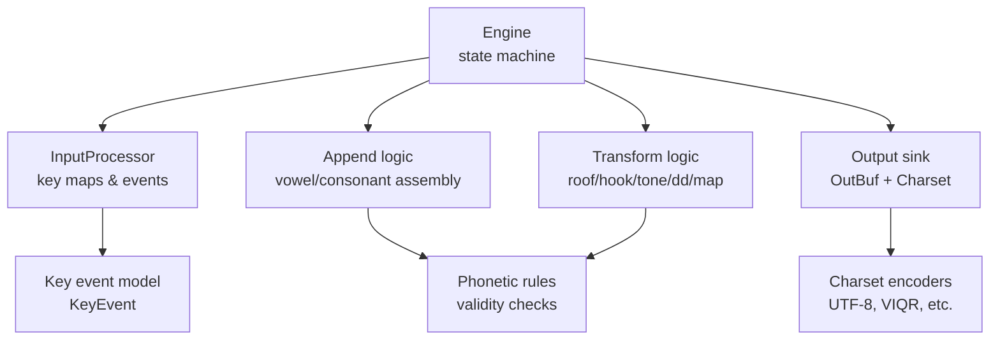
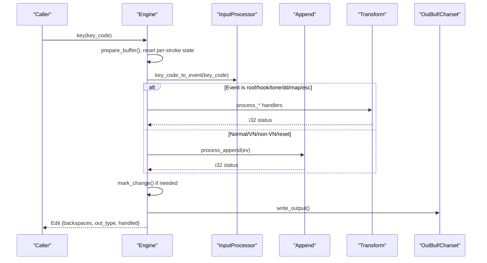
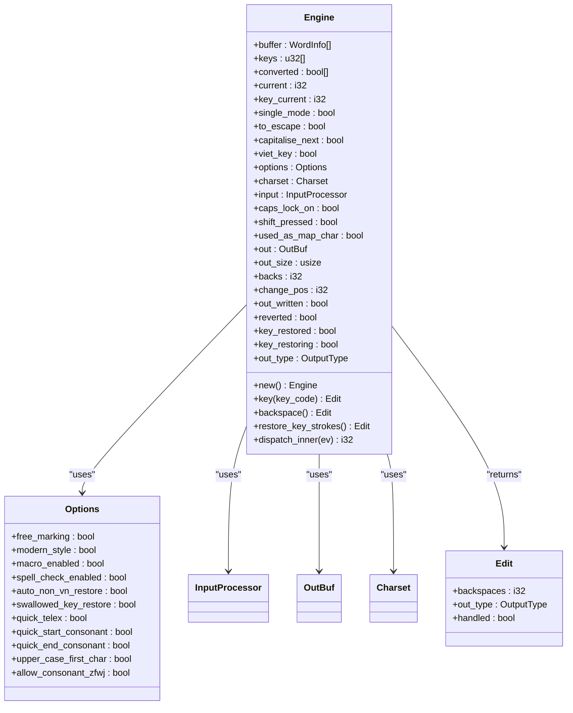
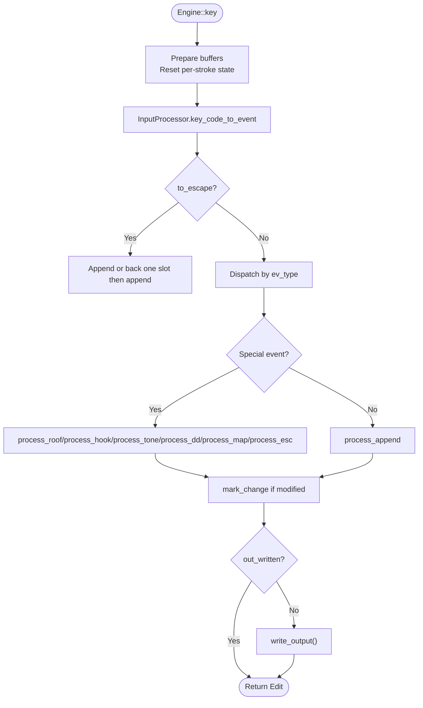
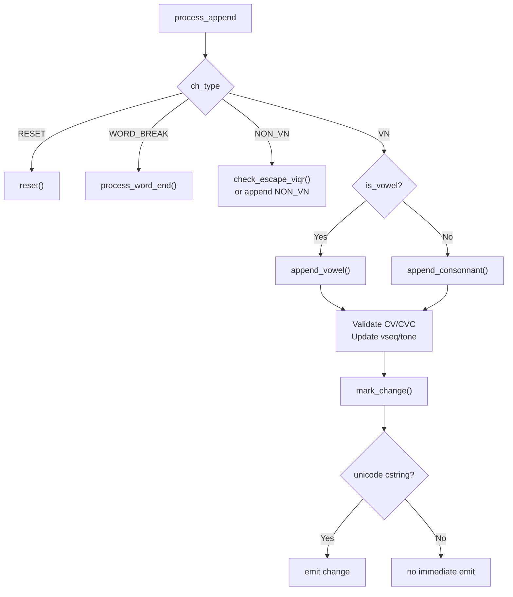
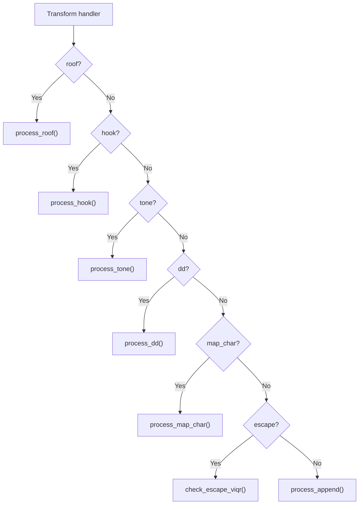
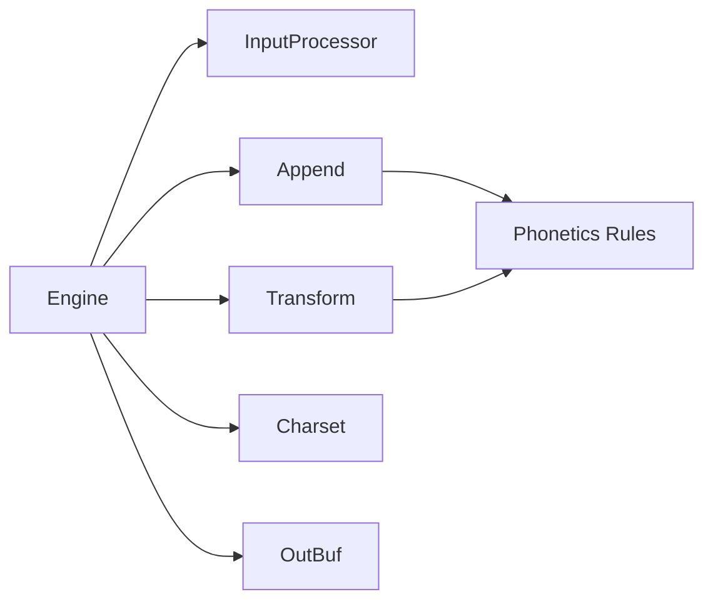

# Typing Engine Core

<cite>
**Referenced Files in This Document**
- [lib.rs](file://port/skey-core/src/lib.rs)
- [engine/mod.rs](file://port/skey-core/src/engine/mod.rs)
- [engine/types.rs](file://port/skey-core/src/engine/types.rs)
- [engine/append.rs](file://port/skey-core/src/engine/append.rs)
- [engine/transform.rs](file://port/skey-core/src/engine/transform.rs)
- [input/mod.rs](file://port/skey-core/src/input/mod.rs)
- [out.rs](file://port/skey-core/src/out.rs)
- [charset/mod.rs](file://port/skey-core/src/charset/mod.rs)
- [phonetics/rules.rs](file://port/skey-core/src/phonetics/rules.rs)
- [Cargo.toml](file://port/skey-core/Cargo.toml)
</cite>

## Table of Contents
1. [Introduction](#introduction)
2. [Project Structure](#project-structure)
3. [Core Components](#core-components)
4. [Architecture Overview](#architecture-overview)
5. [Detailed Component Analysis](#detailed-component-analysis)
6. [Dependency Analysis](#dependency-analysis)
7. [Performance Considerations](#performance-considerations)
8. [Troubleshooting Guide](#troubleshooting-guide)
9. [Conclusion](#conclusion)

## Introduction
This document explains the core typing engine that implements Vietnamese character composition as a deterministic state machine. It focuses on the Edit and Engine types, the keystroke processing pipeline, and the append and transform operations that implement Telex, VNI, and VIQR input methods. The design preserves byte-for-byte parity with the original C++ engine by mirroring its state layout, control flow, and output semantics. It also documents state management, buffer handling, composition rules, error handling, and performance techniques used in a no_std environment.

## Project Structure
The engine is implemented as a Rust library with a strict separation between:
- Input classification and method mapping (InputProcessor)
- Stateful composition engine (Engine)
- Phonetics and rules (phonetics/*)
- Output encoding (charset/* and out/*)
- Configuration and options (engine/types.rs)

**Diagram sources**
- [engine/mod.rs:18-70](file://port/skey-core/src/engine/mod.rs#L18-L70)
- [input/mod.rs:50-76](file://port/skey-core/src/input/mod.rs#L50-L76)
- [engine/append.rs:141-196](file://port/skey-core/src/engine/append.rs#L141-L196)
- [engine/transform.rs:70-712](file://port/skey-core/src/engine/transform.rs#L70-L712)
- [out.rs:60-192](file://port/skey-core/src/out.rs#L60-L192)
- [charset/mod.rs:52-102](file://port/skey-core/src/charset/mod.rs#L52-L102)

**Section sources**
- [lib.rs:1-47](file://port/skey-core/src/lib.rs#L1-L47)
- [Cargo.toml:1-26](file://port/skey-core/Cargo.toml#L1-L26)

## Core Components
- Engine: Holds per-stroke and persistent state, orchestrates dispatch to append or transform handlers, and produces edits and output bytes.
- Edit: Per-key result describing backspaces, output type, and whether the key was handled.
- Options: Feature flags controlling behavior such as quick shortcuts, auto restore, upper-case first char, and spell check integration.
- WordInfo: Compact per-buffer entry representing a character position with form, offsets, tone, caps, and symbol sequence indices.
- InputProcessor: Maps raw key codes to KeyEvent instances using built-in or user key maps for Telex, VNI, VIQR, MSVI, Simple Telex, or custom.
- OutBuf and Charset: Encodes composed characters into target byte streams while preserving original size reporting semantics.

**Section sources**
- [engine/mod.rs:18-70](file://port/skey-core/src/engine/mod.rs#L18-L70)
- [engine/types.rs:24-127](file://port/skey-core/src/engine/types.rs#L24-L127)
- [engine/types.rs:224-235](file://port/skey-core/src/engine/types.rs#L224-L235)
- [input/mod.rs:50-76](file://port/skey-core/src/input/mod.rs#L50-L76)
- [out.rs:60-192](file://port/skey-core/src/out.rs#L60-L192)
- [charset/mod.rs:52-102](file://port/skey-core/src/charset/mod.rs#L52-L102)

## Architecture Overview
The keystroke pipeline is a tight loop:
- Prepare buffers and per-stroke state
- Convert key code to KeyEvent via InputProcessor
- Dispatch to specialized handlers based on event type
- Append or transform the current word buffer
- Mark changes and compute backspace count
- Encode output through charset-aware sink
- Return Edit to the caller

**Diagram sources**
- [engine/mod.rs:248-319](file://port/skey-core/src/engine/mod.rs#L248-L319)
- [engine/append.rs:141-196](file://port/skey-core/src/engine/append.rs#L141-L196)
- [engine/transform.rs:70-712](file://port/skey-core/src/engine/transform.rs#L70-L712)
- [out.rs:98-109](file://port/skey-core/src/out.rs#L98-L109)

## Detailed Component Analysis

### Engine and Edit Types
- Engine fields include:
  - Persistent buffers for word entries, keys, conversion flags, and mode flags
  - Current index tracking and single-mode toggles
  - Output buffer and size tracking aligned with original’s m_pOutSize semantics
  - Input processor and charset configuration
- Edit carries:
  - Backspaces to send before new bytes
  - Output type (Char vs Key)
  - Handled flag indicating whether the key was consumed

**Diagram sources**
- [engine/mod.rs:18-70](file://port/skey-core/src/engine/mod.rs#L18-L70)
- [engine/types.rs:24-127](file://port/skey-core/src/engine/types.rs#L24-L127)
- [engine/types.rs:224-235](file://port/skey-core/src/engine/types.rs#L224-L235)

**Section sources**
- [engine/mod.rs:18-70](file://port/skey-core/src/engine/mod.rs#L18-L70)
- [engine/types.rs:24-127](file://port/skey-core/src/engine/types.rs#L24-L127)
- [engine/types.rs:224-235](file://port/skey-core/src/engine/types.rs#L224-L235)

### Keystroke Processing Pipeline
- Entry point: Engine::key prepares per-stroke state, converts key code to KeyEvent, and dispatches.
- Dispatch:
  - Roof/hook/bowl/double-d/tone/map/escape events route to specialized handlers
  - Otherwise falls through to append path
- After processing:
  - If not handled, returns an unhandled Edit
  - Otherwise writes output and returns Edit with backspaces and output type

**Diagram sources**
- [engine/mod.rs:248-319](file://port/skey-core/src/engine/mod.rs#L248-L319)
- [engine/append.rs:141-196](file://port/skey-core/src/engine/append.rs#L141-L196)
- [engine/transform.rs:70-712](file://port/skey-core/src/engine/transform.rs#L70-L712)

**Section sources**
- [engine/mod.rs:248-319](file://port/skey-core/src/engine/mod.rs#L248-L319)

### Append Operations: Vowels, Consonants, Spell Check, Buffer Maintenance
- process_append routes based on character type:
  - Reset clears state
  - Word break finalizes word and may trigger quick-end consonant substitutions
  - Non-VN characters either pass through or handle VIQR escape sequences
  - VN characters branch to vowel or consonant append paths
- append_vowel:
  - Initializes or extends vowel sequences
  - Handles tone placement and movement when sequence changes
  - Validates CV/CVC forms against phonotactic rules
- append_consonnant:
  - Starts or extends consonant sequences
  - Handles special cases like u+o combinations and complex multi-step updates
  - Validates VC/CVC forms
- Buffer maintenance:
  - prepare_buffer compacts old entries to keep free slots
  - get_seq_steps computes backspace counts accounting for charset step sizes
  - write_output encodes changed range into OutBuf

**Diagram sources**
- [engine/append.rs:141-196](file://port/skey-core/src/engine/append.rs#L141-L196)
- [engine/append.rs:202-369](file://port/skey-core/src/engine/append.rs#L202-L369)
- [engine/append.rs:371-575](file://port/skey-core/src/engine/append.rs#L371-L575)
- [engine/append.rs:98-109](file://port/skey-core/src/engine/append.rs#L98-L109)
- [engine/append.rs:111-139](file://port/skey-core/src/engine/append.rs#L111-L139)

**Section sources**
- [engine/append.rs:141-196](file://port/skey-core/src/engine/append.rs#L141-L196)
- [engine/append.rs:202-369](file://port/skey-core/src/engine/append.rs#L202-L369)
- [engine/append.rs:371-575](file://port/skey-core/src/engine/append.rs#L371-L575)
- [engine/append.rs:98-109](file://port/skey-core/src/engine/append.rs#L98-L109)
- [engine/append.rs:111-139](file://port/skey-core/src/engine/append.rs#L111-L139)

### Transform Operations: Roof, Hook, Tone, Double-D, Map, VIQR Escape
- process_roof:
  - Adds or removes roof marks on a/v/e/o depending on current vowel sequence
  - Moves tone if necessary; supports double-change for u+o variants
- process_hook:
  - Adds/removes hooks on u/o/a with special handling for u+o sequences
  - Preserves tone position across transformations
- process_tone:
  - Places or removes tones at computed positions based on modern style and spelling constraints
  - Special case for gi/gin where tone moves to the g
- process_dd:
  - Toggles d ↔ dd for abbreviations and common patterns
- process_map_char:
  - Applies character mapping with case handling and undo semantics
- check_escape_viqr:
  - Emits literal escape sequences for VIQR when applicable, writing directly to output buffer

**Diagram sources**
- [engine/transform.rs:70-189](file://port/skey-core/src/engine/transform.rs#L70-L189)
- [engine/transform.rs:191-467](file://port/skey-core/src/engine/transform.rs#L191-L467)
- [engine/transform.rs:469-536](file://port/skey-core/src/engine/transform.rs#L469-L536)
- [engine/transform.rs:538-601](file://port/skey-core/src/engine/transform.rs#L538-L601)
- [engine/transform.rs:603-673](file://port/skey-core/src/engine/transform.rs#L603-L673)
- [engine/transform.rs:675-712](file://port/skey-core/src/engine/transform.rs#L675-L712)
- [engine/transform.rs:714-766](file://port/skey-core/src/engine/transform.rs#L714-L766)

**Section sources**
- [engine/transform.rs:70-189](file://port/skey-core/src/engine/transform.rs#L70-L189)
- [engine/transform.rs:191-467](file://port/skey-core/src/engine/transform.rs#L191-L467)
- [engine/transform.rs:469-536](file://port/skey-core/src/engine/transform.rs#L469-L536)
- [engine/transform.rs:538-601](file://port/skey-core/src/engine/transform.rs#L538-L601)
- [engine/transform.rs:603-673](file://port/skey-core/src/engine/transform.rs#L603-L673)
- [engine/transform.rs:675-712](file://port/skey-core/src/engine/transform.rs#L675-L712)
- [engine/transform.rs:714-766](file://port/skey-core/src/engine/transform.rs#L714-L766)

### Input Methods and Key Mapping
- InputProcessor maintains a 256-entry key map per input method:
  - Telex, VNI, VIQR, MSVI, Simple Telex, or user-defined
- key_code_to_event translates key codes into KeyEvent with:
  - ev_type (action or mapped character)
  - ch_type (VN, non-VN, word break, reset)
  - vn_sym (for VN characters)
  - tone (for tone events)
- Built-in maps apply both cases for action keys; character mappings carry their own case.

**Section sources**
- [input/mod.rs:8-49](file://port/skey-core/src/input/mod.rs#L8-L49)
- [input/mod.rs:50-76](file://port/skey-core/src/input/mod.rs#L50-L76)
- [input/mod.rs:78-125](file://port/skey-core/src/input/mod.rs#L78-L125)
- [input/mod.rs:131-192](file://port/skey-core/src/input/mod.rs#L131-L192)

### Output Encoding and Byte Parity
- OutBuf mirrors StringBOStream semantics:
  - Count increments before capacity check, allowing reported size to exceed stored bytes when full
  - Supports direct write_at for paths bypassing stream
  - Provides bytes_up_to(n) to clamp to requested size
- Charset encodes composed characters:
  - One_step_per_char fast path for UTF-8 and certain single-byte charsets
  - VIQR is stateful; Encoder state is scoped per output call
- write_output encodes only the changed range from change_pos to current

**Section sources**
- [out.rs:1-231](file://port/skey-core/src/out.rs#L1-L231)
- [charset/mod.rs:1-102](file://port/skey-core/src/charset/mod.rs#L1-L102)
- [engine/append.rs:98-109](file://port/skey-core/src/engine/append.rs#L98-L109)

### State Management and Composition Rules
- WordInfo compactly stores:
  - Form (empty, non-VN, C, V, CV, VC, CVC)
  - Offsets to consonants and vowels within the word
  - Tone level and capitalization bit
  - Sequence indices for vowel and consonant sequences
- Composition rules:
  - Vowel extension uses vseq_extend and validates CV/CVC forms
  - Consonant extension uses cseq_extend and validates VC/CVC forms
  - Tone placement uses get_tone_position considering modern style and termination
  - Special handling for gi/gin tone movement and u+o hook/roof interactions

**Section sources**
- [engine/types.rs:107-222](file://port/skey-core/src/engine/types.rs#L107-L222)
- [engine/append.rs:202-369](file://port/skey-core/src/engine/append.rs#L202-L369)
- [engine/append.rs:371-575](file://port/skey-core/src/engine/append.rs#L371-L575)
- [engine/transform.rs:19-52](file://port/skey-core/src/engine/transform.rs#L19-L52)
- [phonetics/rules.rs:107-200](file://port/skey-core/src/phonetics/rules.rs#L107-L200)

## Dependency Analysis
- Engine depends on:
  - InputProcessor for event creation and classification
  - Append and Transform modules for composition logic
  - Phonetics rules for validity checks and sequence lookups
  - Charset and OutBuf for encoding output
- InputProcessor depends on static tables for key maps and character classification
- Append and Transform depend on phonetics rules and tables for sequence manipulation
- No_std constraint ensures no heap allocation in the hot path; optional alloc feature enables macros and keymaps

**Diagram sources**
- [engine/mod.rs:18-70](file://port/skey-core/src/engine/mod.rs#L18-L70)
- [input/mod.rs:72-192](file://port/skey-core/src/input/mod.rs#L72-L192)
- [engine/append.rs:141-196](file://port/skey-core/src/engine/append.rs#L141-L196)
- [engine/transform.rs:70-712](file://port/skey-core/src/engine/transform.rs#L70-L712)
- [phonetics/rules.rs:107-200](file://port/skey-core/src/phonetics/rules.rs#L107-L200)
- [out.rs:60-192](file://port/skey-core/src/out.rs#L60-L192)
- [charset/mod.rs:52-102](file://port/skey-core/src/charset/mod.rs#L52-L102)

**Section sources**
- [lib.rs:1-47](file://port/skey-core/src/lib.rs#L1-L47)
- [Cargo.toml:20-26](file://port/skey-core/Cargo.toml#L20-L26)

## Performance Considerations
- Hot path avoids allocations:
  - Fixed-size buffers for word entries and key strokes
  - OutBuf preallocated with capacity matching original buffer size
- Fast paths:
  - one_step_per_char optimization for UTF-8 and single-byte charsets
  - Direct table lookups for sequence extensions and validity checks
  - Minimal branching in dispatch via match on event types
- Debug assertions validate generated tables against reference implementations without impacting release builds
- no_std compatibility:
  - Core engine works without allocator
  - Optional features enable macros and keymaps when available

[No sources needed since this section provides general guidance]

## Troubleshooting Guide
Common issues and diagnostics:
- Unexpected backspaces:
  - Verify change_pos and mark_change usage during transforms
  - Ensure get_seq_steps accounts for charset-specific step sizes
- Incorrect tone placement:
  - Check get_tone_position arguments and modern_style option
  - Confirm tone movement for gi/gin special case
- VIQR escape not emitting:
  - Ensure check_escape_viqr conditions match current form and tone
  - Confirm output buffer has capacity and write_at succeeds
- Spell check interference:
  - Disable spell_check_enabled or adjust free_marking to allow intermediate states
- Quick shortcuts not applying:
  - Enable quick_telex, quick_start_consonant, quick_end_consonant as needed

**Section sources**
- [engine/append.rs:34-66](file://port/skey-core/src/engine/append.rs#L34-L66)
- [engine/transform.rs:19-52](file://port/skey-core/src/engine/transform.rs#L19-L52)
- [engine/transform.rs:714-766](file://port/skey-core/src/engine/transform.rs#L714-L766)
- [engine/types.rs:31-83](file://port/skey-core/src/engine/types.rs#L31-L83)

## Conclusion
The SKey typing engine implements a precise, efficient state machine for Vietnamese character composition. By mirroring the original C++ engine’s state layout, control flow, and output semantics, it achieves byte-for-byte parity while providing a clean, modular Rust implementation. The design separates concerns across input processing, append and transform logic, phonetic rules, and output encoding, enabling robust support for Telex, VNI, and VIQR input methods. Performance is optimized for no_std environments with fixed buffers, table-driven lookups, and minimal allocations, ensuring reliable real-time typing experiences.

[No sources needed since this section summarizes without analyzing specific files]