# System Integration Patterns

<cite>
**Referenced Files in This Document**
- [EventTapManager.swift](file://macos/skey-app/Sources/Features/Keyboard/EventHandling/EventTapManager.swift)
- [TypingPipeline.swift](file://macos/skey-app/Sources/Features/Keyboard/EventHandling/Pipeline/TypingPipeline.swift)
- [KeyInterceptor.swift](file://macos/skey-app/Sources/Features/Keyboard/EventHandling/Pipeline/KeyInterceptor.swift)
- [KeyEventSender.swift](file://macos/skey-app/Sources/Features/Keyboard/EventHandling/KeyEventSender.swift)
- [PermissionsService.swift](file://macos/skey-app/Sources/Shared/Services/PermissionsService.swift)
- [StatusBarManager.swift](file://macos/skey-app/Sources/Shared/UI/StatusBarManager.swift)
- [LaunchAtLoginService.swift](file://macos/skey-app/Sources/Shared/Services/LaunchAtLoginService.swift)
- [ClipboardMonitor.swift](file://macos/skey-app/Sources/Features/Clipboard/Services/ClipboardMonitor.swift)
- [AppFocusObserver.swift](file://macos/skey-app/Sources/Shared/Services/AppFocusObserver.swift)
- [AccessibilityContextReader.swift](file://macos/skey-app/Sources/Features/Keyboard/Context/AccessibilityContextReader.swift)
- [SKeyEngine.swift](file://macos/skey-app/Sources/Features/Keyboard/Engine/SKeyEngine.swift)
- [AppDelegate.swift](file://macos/skey-app/Sources/App/AppDelegate.swift)
</cite>

## Table of Contents
1. Introduction
2. Project Structure
3. Core Components
4. Architecture Overview
5. Detailed Component Analysis
6. Dependency Analysis
7. Performance Considerations
8. Troubleshooting Guide
9. Conclusion

## Introduction
This document explains the system integration patterns used by the macOS application to intercept and process keyboard events, manage accessibility permissions, integrate with the status bar, run as a background service, and launch at login. It focuses on:
- Low-level event interception using CoreGraphics EventTap
- The chain of responsibility pattern for the typing pipeline
- Accessibility and privacy controls (accessibility permissions, clipboard access)
- Cross-application compatibility via app focus detection and context-aware behavior
- Status bar integration, background services, and launch-at-login
- Threading model for asynchronous system event handling while keeping the UI responsive
- Security considerations and resource management best practices

## Project Structure
The macOS app is organized into feature-based modules under Sources/Features and shared infrastructure under Sources/Shared. Key areas relevant to this document:
- Keyboard event interception and processing: EventTapManager, TypingPipeline, KeyEventSender, SKeyEngine
- Permissions and system integration: PermissionsService, LaunchAtLoginService, StatusBarManager
- Clipboard monitoring: ClipboardMonitor
- App focus and accessibility context: AppFocusObserver, AccessibilityContextReader
- App lifecycle: AppDelegate

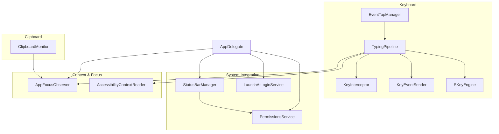

**Diagram sources**
- [EventTapManager.swift:15-103](file://macos/skey-app/Sources/Features/Keyboard/EventHandling/EventTapManager.swift#L15-L103)
- [TypingPipeline.swift:6-170](file://macos/skey-app/Sources/Features/Keyboard/EventHandling/Pipeline/TypingPipeline.swift#L6-L170)
- [KeyInterceptor.swift:5-20](file://macos/skey-app/Sources/Features/Keyboard/EventHandling/Pipeline/KeyInterceptor.swift#L5-L20)
- [KeyEventSender.swift:7-51](file://macos/skey-app/Sources/Features/Keyboard/EventHandling/KeyEventSender.swift#L7-L51)
- [SKeyEngine.swift:6-30](file://macos/skey-app/Sources/Features/Keyboard/Engine/SKeyEngine.swift#L6-L30)
- [PermissionsService.swift:5-41](file://macos/skey-app/Sources/Shared/Services/PermissionsService.swift#L5-L41)
- [StatusBarManager.swift:4-29](file://macos/skey-app/Sources/Shared/UI/StatusBarManager.swift#L4-L29)
- [LaunchAtLoginService.swift:4-49](file://macos/skey-app/Sources/Shared/Services/LaunchAtLoginService.swift#L4-L49)
- [ClipboardMonitor.swift:5-44](file://macos/skey-app/Sources/Features/Clipboard/Services/ClipboardMonitor.swift#L5-L44)
- [AppFocusObserver.swift:12-48](file://macos/skey-app/Sources/Shared/Services/AppFocusObserver.swift#L12-L48)
- [AccessibilityContextReader.swift:7-43](file://macos/skey-app/Sources/Features/Keyboard/Context/AccessibilityContextReader.swift#L7-L43)
- [AppDelegate.swift:6-30](file://macos/skey-app/Sources/App/AppDelegate.swift#L6-L30)

**Section sources**
- [AppDelegate.swift:6-30](file://macos/skey-app/Sources/App/AppDelegate.swift#L6-L30)

## Core Components
- EventTapManager: Creates and manages a CoreGraphics EventTap, hosts it on a dedicated thread with its own run loop, and delegates event processing to the TypingPipeline.
- TypingPipeline: Implements a multi-stage chain of responsibility for key/mouse events, including hotkeys, navigation, composing, macro expansion, and app exclusion logic.
- KeyEventSender: Injects synthetic backspaces and Unicode text into the target app; uses Accessibility API for Spotlight overlay when needed.
- PermissionsService: Checks and prompts for Accessibility and Input Monitoring permissions; opens system settings when required.
- StatusBarManager: Manages the menu bar item, dynamic menus, and status icon reflecting language state.
- LaunchAtLoginService: Registers/unregisters the app as a Login Item using ServiceManagement on modern macOS versions.
- ClipboardMonitor: Polls NSPasteboard for changes and captures content types (text, rich text, images, files).
- AppFocusObserver: Tracks the frontmost app and classifies it (web browser, developer tool, chat/electron, Spotlight, native app) to tailor behavior.
- AccessibilityContextReader: Reads and manipulates text in the focused element via Accessibility APIs; supports Spotlight-specific replacement.
- SKeyEngine: High-performance wrapper around the Rust core engine for Vietnamese typing transformations.

**Section sources**
- [EventTapManager.swift:15-103](file://macos/skey-app/Sources/Features/Keyboard/EventHandling/EventTapManager.swift#L15-L103)
- [TypingPipeline.swift:6-170](file://macos/skey-app/Sources/Features/Keyboard/EventHandling/Pipeline/TypingPipeline.swift#L6-L170)
- [KeyEventSender.swift:7-51](file://macos/skey-app/Sources/Features/Keyboard/EventHandling/KeyEventSender.swift#L7-L51)
- [PermissionsService.swift:12-41](file://macos/skey-app/Sources/Shared/Services/PermissionsService.swift#L12-L41)
- [StatusBarManager.swift:6-29](file://macos/skey-app/Sources/Shared/UI/StatusBarManager.swift#L6-L29)
- [LaunchAtLoginService.swift:6-49](file://macos/skey-app/Sources/Shared/Services/LaunchAtLoginService.swift#L6-L49)
- [ClipboardMonitor.swift:5-44](file://macos/skey-app/Sources/Features/Clipboard/Services/ClipboardMonitor.swift#L5-L44)
- [AppFocusObserver.swift:12-48](file://macos/skey-app/Sources/Shared/Services/AppFocusObserver.swift#L12-L48)
- [AccessibilityContextReader.swift:7-43](file://macos/skey-app/Sources/Features/Keyboard/Context/AccessibilityContextReader.swift#L7-L43)
- [SKeyEngine.swift:6-30](file://macos/skey-app/Sources/Features/Keyboard/Engine/SKeyEngine.swift#L6-L30)

## Architecture Overview
The system integrates deeply with macOS through CoreGraphics and Accessibility APIs. Events are captured at the OS level, processed in a low-latency pipeline, and injected back into the active application. UI updates and user-facing actions remain on the main thread, while heavy or blocking operations run off-main where appropriate.

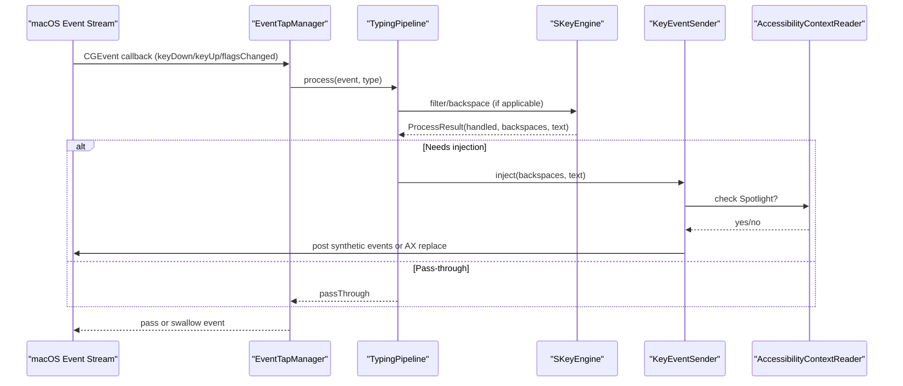

**Diagram sources**
- [EventTapManager.swift:81-103](file://macos/skey-app/Sources/Features/Keyboard/EventHandling/EventTapManager.swift#L81-L103)
- [TypingPipeline.swift:31-170](file://macos/skey-app/Sources/Features/Keyboard/EventHandling/Pipeline/TypingPipeline.swift#L31-L170)
- [KeyEventSender.swift:30-51](file://macos/skey-app/Sources/Features/Keyboard/EventHandling/KeyEventSender.swift#L30-L51)
- [AccessibilityContextReader.swift:39-77](file://macos/skey-app/Sources/Features/Keyboard/Context/AccessibilityContextReader.swift#L39-L77)
- [SKeyEngine.swift:131-145](file://macos/skey-app/Sources/Features/Keyboard/Engine/SKeyEngine.swift#L131-L145)

## Detailed Component Analysis

### CoreGraphics EventTap Implementation
- Creation and fallback: Attempts .cghidEventTap first, then falls back to .cgSessionEventTap if necessary.
- Dedicated thread and run loop: Starts a high-priority thread that owns a CFRunLoop hosting the tap source; enables/disables the tap within that thread.
- Lifecycle: start() creates the tap, adds the run loop source, enables the tap, and runs the loop; stop() disables and invalidates resources, stops the run loop, and cleans up.
- Event recovery: Handles tap disabled events by re-enabling the tap automatically.
- Delegation: All events are forwarded to TypingPipeline for processing.

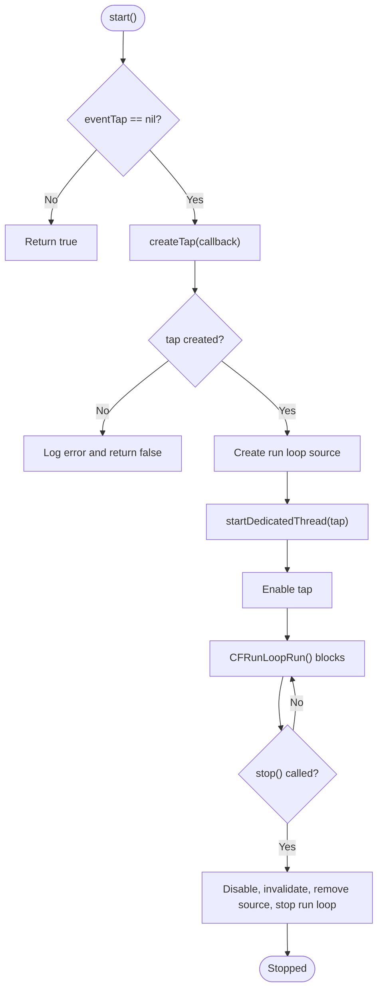

**Diagram sources**
- [EventTapManager.swift:81-122](file://macos/skey-app/Sources/Features/Keyboard/EventHandling/EventTapManager.swift#L81-L122)
- [EventTapManager.swift:127-168](file://macos/skey-app/Sources/Features/Keyboard/EventHandling/EventTapManager.swift#L127-L168)

**Section sources**
- [EventTapManager.swift:81-168](file://macos/skey-app/Sources/Features/Keyboard/EventHandling/EventTapManager.swift#L81-L168)

### Chain of Responsibility in the Typing Pipeline
- Stages include:
  - Skip synthetic events generated by the app
  - Handle tap-disabled events
  - Mouse clicks reset state and mark caret movement
  - Modifier-only shortcut candidate tracking
  - Customizable hotkeys (language toggle, clipboard popup, cleaner, AI, quick translate)
  - Command/Control/Option keys reset buffers and pass through
  - Excluded applications bypass
  - English mode macro expansion
  - Vietnamese composing via SKeyEngine
  - Smart context recomposition when caret moved
- InterceptorResult enum defines passThrough vs swallowed decisions.

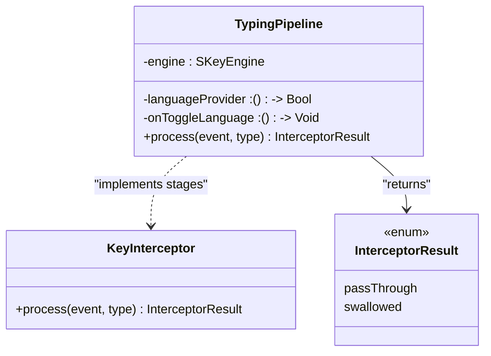

**Diagram sources**
- [KeyInterceptor.swift:5-20](file://macos/skey-app/Sources/Features/Keyboard/EventHandling/Pipeline/KeyInterceptor.swift#L5-L20)
- [TypingPipeline.swift:6-170](file://macos/skey-app/Sources/Features/Keyboard/EventHandling/Pipeline/TypingPipeline.swift#L6-L170)

**Section sources**
- [TypingPipeline.swift:31-170](file://macos/skey-app/Sources/Features/Keyboard/EventHandling/Pipeline/TypingPipeline.swift#L31-L170)
- [KeyInterceptor.swift:5-20](file://macos/skey-app/Sources/Features/Keyboard/EventHandling/Pipeline/KeyInterceptor.swift#L5-L20)

### Accessibility Permissions Management
- Permission checks: Uses AXIsProcessTrusted() to determine global accessibility and input monitoring capability.
- Prompting: Optionally prompts the user via AXIsProcessTrustedWithOptions.
- Settings navigation: Opens Accessibility and Input Monitoring preferences panes directly from the app.
- Status bar integration: Provides menu items to open these settings quickly.

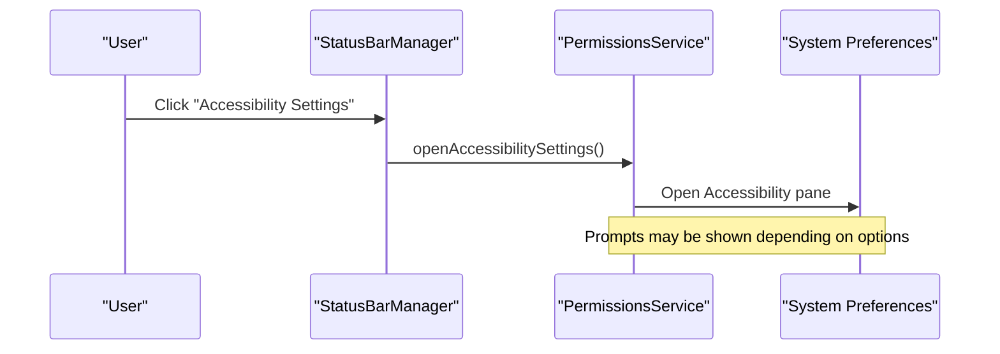

**Diagram sources**
- [PermissionsService.swift:12-41](file://macos/skey-app/Sources/Shared/Services/PermissionsService.swift#L12-L41)
- [StatusBarManager.swift:101-116](file://macos/skey-app/Sources/Shared/UI/StatusBarManager.swift#L101-L116)

**Section sources**
- [PermissionsService.swift:12-41](file://macos/skey-app/Sources/Shared/Services/PermissionsService.swift#L12-L41)
- [StatusBarManager.swift:101-116](file://macos/skey-app/Sources/Shared/UI/StatusBarManager.swift#L101-L116)

### Universal Compatibility Across Applications
- App classification: Detects web browsers, developer tools, chat/electron apps, Spotlight, and native apps based on bundle info and heuristics.
- Context-aware behavior: Adjusts backspace counts for web omnibox autocomplete; enables enhanced accessibility attributes for certain apps.
- Exclusion list: Allows bypassing the pipeline for specific apps by bundle ID.

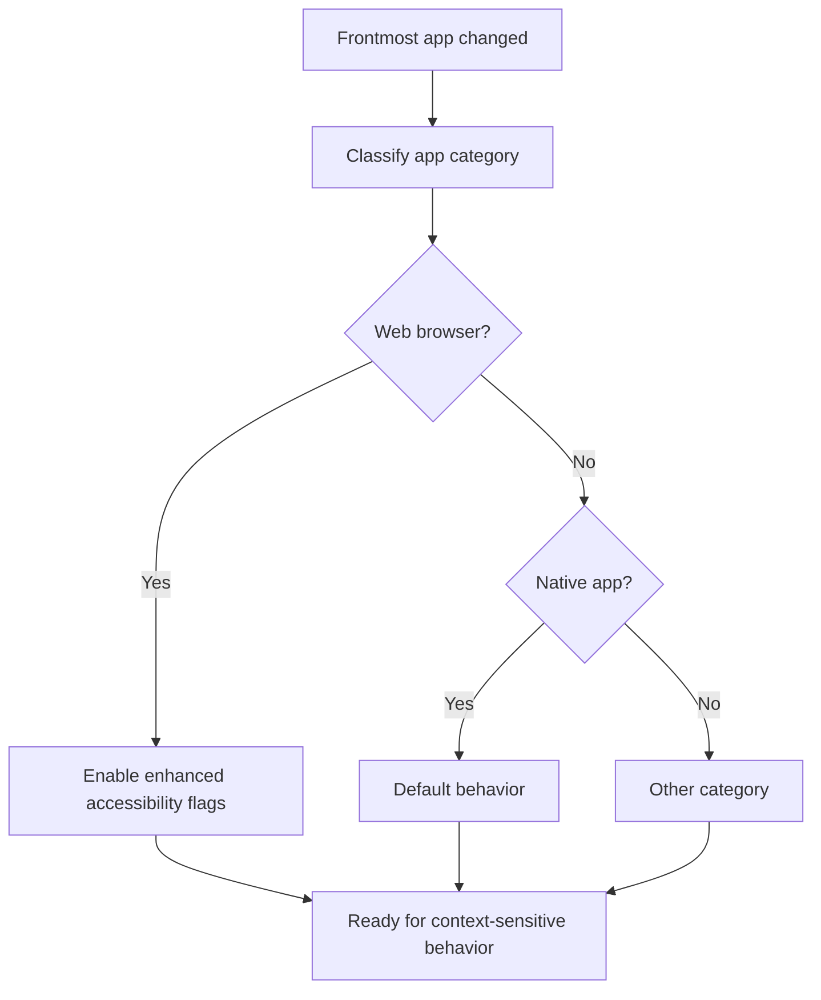

**Diagram sources**
- [AppFocusObserver.swift:29-91](file://macos/skey-app/Sources/Shared/Services/AppFocusObserver.swift#L29-L91)
- [AppFocusObserver.swift:146-150](file://macos/skey-app/Sources/Shared/Services/AppFocusObserver.swift#L146-L150)
- [TypingPipeline.swift:153-156](file://macos/skey-app/Sources/Features/Keyboard/EventHandling/Pipeline/TypingPipeline.swift#L153-L156)

**Section sources**
- [AppFocusObserver.swift:29-91](file://macos/skey-app/Sources/Shared/Services/AppFocusObserver.swift#L29-L91)
- [TypingPipeline.swift:153-156](file://macos/skey-app/Sources/Features/Keyboard/EventHandling/Pipeline/TypingPipeline.swift#L153-L156)

### Status Bar Integration
- Menu building: Dynamically builds grouped menu items from features, includes tools submenu (language selection, permissions, cleaners), and quit action.
- Icon rendering: Draws a small keycap-style image showing current language state ("V" or "E").
- Notifications: Listens for language change notifications to update the icon and menu.

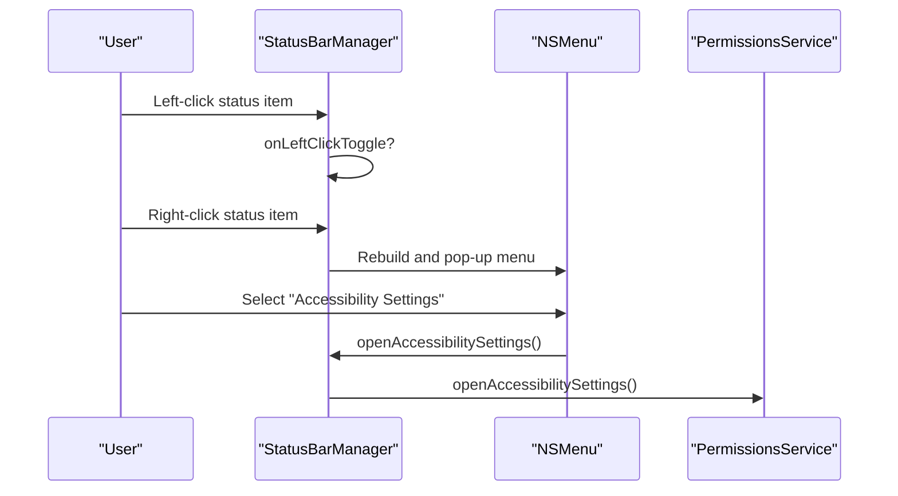

**Diagram sources**
- [StatusBarManager.swift:47-160](file://macos/skey-app/Sources/Shared/UI/StatusBarManager.swift#L47-L160)
- [StatusBarManager.swift:214-257](file://macos/skey-app/Sources/Shared/UI/StatusBarManager.swift#L214-L257)
- [StatusBarManager.swift:259-265](file://macos/skey-app/Sources/Shared/UI/StatusBarManager.swift#L259-L265)

**Section sources**
- [StatusBarManager.swift:47-160](file://macos/skey-app/Sources/Shared/UI/StatusBarManager.swift#L47-L160)
- [StatusBarManager.swift:214-257](file://macos/skey-app/Sources/Shared/UI/StatusBarManager.swift#L214-L257)

### Background Service Management and Launch-at-Login
- Launch-at-login: Uses ServiceManagement to register/unregister the app as a Login Item on macOS 13+; syncs stored preference with system state on launch.
- Background operation: EventTap runs on a dedicated thread with a persistent run loop; clipboard monitoring uses a Timer on the main run loop; UI updates are dispatched to the main queue.

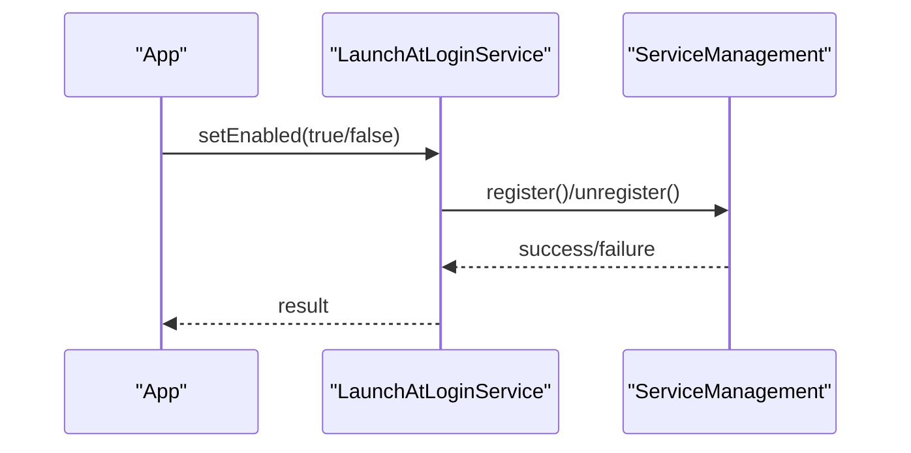

**Diagram sources**
- [LaunchAtLoginService.swift:18-41](file://macos/skey-app/Sources/Shared/Services/LaunchAtLoginService.swift#L18-L41)

**Section sources**
- [LaunchAtLoginService.swift:6-49](file://macos/skey-app/Sources/Shared/Services/LaunchAtLoginService.swift#L6-L49)

### Threading Model for Asynchronous System Events
- Dedicated EventTap thread: Runs a CFRunLoop to receive CGEvents without blocking the UI thread.
- Main-thread UI: Language state persistence and UI callbacks are dispatched to the main queue to avoid cross-thread issues.
- Clipboard polling: Uses a Timer scheduled on the main run loop to detect pasteboard changes.
- Concurrency control: Uses os_unfair_lock for low-overhead synchronization of shared state (e.g., language flag, engine access).

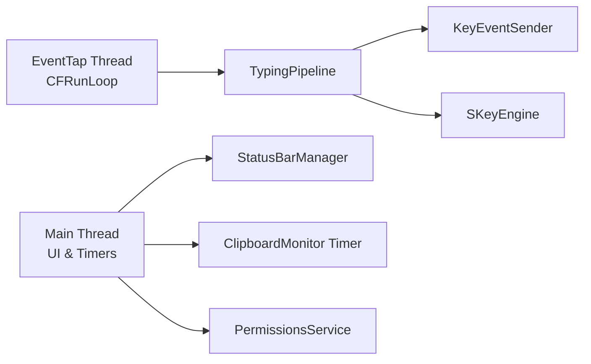

**Diagram sources**
- [EventTapManager.swift:140-168](file://macos/skey-app/Sources/Features/Keyboard/EventHandling/EventTapManager.swift#L140-L168)
- [EventTapManager.swift:33-55](file://macos/skey-app/Sources/Features/Keyboard/EventHandling/EventTapManager.swift#L33-L55)
- [ClipboardMonitor.swift:21-29](file://macos/skey-app/Sources/Features/Clipboard/Services/ClipboardMonitor.swift#L21-L29)
- [SKeyEngine.swift:22-30](file://macos/skey-app/Sources/Features/Keyboard/Engine/SKeyEngine.swift#L22-L30)

**Section sources**
- [EventTapManager.swift:33-55](file://macos/skey-app/Sources/Features/Keyboard/EventHandling/EventTapManager.swift#L33-L55)
- [EventTapManager.swift:140-168](file://macos/skey-app/Sources/Features/Keyboard/EventHandling/EventTapManager.swift#L140-L168)
- [ClipboardMonitor.swift:21-29](file://macos/skey-app/Sources/Features/Clipboard/Services/ClipboardMonitor.swift#L21-L29)
- [SKeyEngine.swift:22-30](file://macos/skey-app/Sources/Features/Keyboard/Engine/SKeyEngine.swift#L22-L30)

### Clipboard Access and Privacy Controls
- Clipboard monitoring: Polls NSPasteboard.changeCount on a timer; captures text, rich text, images, and file references.
- Content hashing: Uses SHA-256 to identify duplicates efficiently.
- Writing to pasteboard: Supports plain text, rich text, images, and file references based on captured content type.
- Privacy considerations: Clipboard access requires user permission; ensure minimal data retention and clear user consent flows.

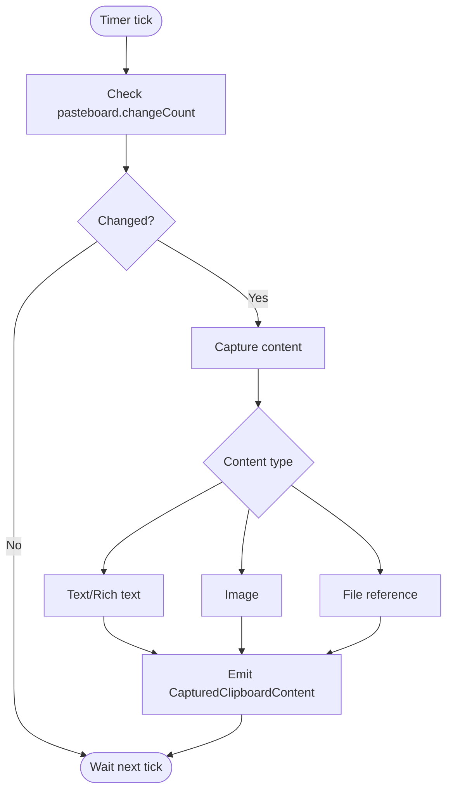

**Diagram sources**
- [ClipboardMonitor.swift:21-44](file://macos/skey-app/Sources/Features/Clipboard/Services/ClipboardMonitor.swift#L21-L44)
- [ClipboardMonitor.swift:46-154](file://macos/skey-app/Sources/Features/Clipboard/Services/ClipboardMonitor.swift#L46-L154)

**Section sources**
- [ClipboardMonitor.swift:21-44](file://macos/skey-app/Sources/Features/Clipboard/Services/ClipboardMonitor.swift#L21-L44)
- [ClipboardMonitor.swift:46-154](file://macos/skey-app/Sources/Features/Clipboard/Services/ClipboardMonitor.swift#L46-L154)

### Security Considerations for Accessibility APIs
- Least privilege: Only request accessibility and input monitoring when needed; prompt users explicitly.
- Secure defaults: Avoid capturing sensitive data beyond what is necessary; hash clipboard payloads for deduplication rather than storing raw content unnecessarily.
- Robustness: Validate Accessibility objects and ranges; handle failures gracefully to prevent crashes.
- Transparency: Provide easy access to system settings for users to review and revoke permissions.

[No sources needed since this section provides general guidance]

## Dependency Analysis
- EventTapManager depends on CoreGraphics and Carbon for low-level event capture; delegates to TypingPipeline.
- TypingPipeline depends on SKeyEngine for composing, KeyEventSender for injection, AppFocusObserver for app categorization, and AccessibilityContextReader for Spotlight handling.
- StatusBarManager depends on PermissionsService for opening system settings and on localization services for UI strings.
- LaunchAtLoginService depends on ServiceManagement for login item registration.
- ClipboardMonitor depends on NSWorkspace and NSPasteboard for content capture.

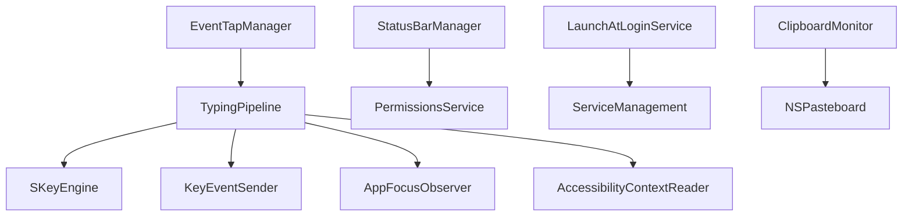

**Diagram sources**
- [EventTapManager.swift:15-103](file://macos/skey-app/Sources/Features/Keyboard/EventHandling/EventTapManager.swift#L15-L103)
- [TypingPipeline.swift:6-170](file://macos/skey-app/Sources/Features/Keyboard/EventHandling/Pipeline/TypingPipeline.swift#L6-L170)
- [KeyEventSender.swift:7-51](file://macos/skey-app/Sources/Features/Keyboard/EventHandling/KeyEventSender.swift#L7-L51)
- [PermissionsService.swift:12-41](file://macos/skey-app/Sources/Shared/Services/PermissionsService.swift#L12-L41)
- [LaunchAtLoginService.swift:6-49](file://macos/skey-app/Sources/Shared/Services/LaunchAtLoginService.swift#L6-L49)
- [ClipboardMonitor.swift:5-44](file://macos/skey-app/Sources/Features/Clipboard/Services/ClipboardMonitor.swift#L5-L44)

**Section sources**
- [EventTapManager.swift:15-103](file://macos/skey-app/Sources/Features/Keyboard/EventHandling/EventTapManager.swift#L15-L103)
- [TypingPipeline.swift:6-170](file://macos/skey-app/Sources/Features/Keyboard/EventHandling/Pipeline/TypingPipeline.swift#L6-L170)
- [PermissionsService.swift:12-41](file://macos/skey-app/Sources/Shared/Services/PermissionsService.swift#L12-L41)
- [LaunchAtLoginService.swift:6-49](file://macos/skey-app/Sources/Shared/Services/LaunchAtLoginService.swift#L6-L49)
- [ClipboardMonitor.swift:5-44](file://macos/skey-app/Sources/Features/Clipboard/Services/ClipboardMonitor.swift#L5-L44)

## Performance Considerations
- Hot path optimization:
  - Use of os_unfair_lock for low-overhead synchronization.
  - Zero-heap allocations on critical paths using stack buffers and temporary allocations.
  - Inline functions and fast-path checks for function/media keys, navigation keys, and backspace.
- Event handling efficiency:
  - Early exits for non-keyboard events and modifier-only shortcuts.
  - Minimal IPC calls; only query active selection for web browsers when necessary.
- Resource management:
  - Properly disable and invalidate EventTap resources on stop.
  - Ensure timers are invalidated when stopping clipboard monitoring.
  - Avoid unnecessary disk writes; batch UI updates on the main thread.

[No sources needed since this section provides general guidance]

## Troubleshooting Guide
- EventTap not receiving events:
  - Verify Accessibility and Input Monitoring permissions; use provided menu items to open system settings.
  - Check logs for tap creation failures and automatic re-enablement after tap disabled events.
- Synthetic events not applied:
  - For Spotlight overlay, ensure Accessibility replacement path is attempted; otherwise fall back to CGEvent synthesis.
  - Confirm non-coalesced flags are set to avoid event coalescing.
- Clipboard not updating:
  - Ensure clipboard monitoring timer is running and pasteboard permissions are granted.
  - Validate content capture logic for the expected type (text, rich text, image, file).
- Launch-at-login not working:
  - On macOS 13+, confirm ServiceManagement registration succeeded; check logs for errors.
- UI unresponsive:
  - Ensure long-running tasks are dispatched off the main thread; UI updates should be on the main queue.

**Section sources**
- [PermissionsService.swift:12-41](file://macos/skey-app/Sources/Shared/Services/PermissionsService.swift#L12-L41)
- [EventTapManager.swift:81-122](file://macos/skey-app/Sources/Features/Keyboard/EventHandling/EventTapManager.swift#L81-L122)
- [KeyEventSender.swift:30-51](file://macos/skey-app/Sources/Features/Keyboard/EventHandling/KeyEventSender.swift#L30-L51)
- [ClipboardMonitor.swift:21-44](file://macos/skey-app/Sources/Features/Clipboard/Services/ClipboardMonitor.swift#L21-L44)
- [LaunchAtLoginService.swift:18-41](file://macos/skey-app/Sources/Shared/Services/LaunchAtLoginService.swift#L18-L41)

## Conclusion
The application integrates deeply with macOS through CoreGraphics EventTap and Accessibility APIs to provide low-latency keyboard event interception and transformation. The chain of responsibility in the TypingPipeline ensures modular, maintainable processing of diverse events while preserving responsiveness. Permissions management, status bar integration, background services, and launch-at-login functionality deliver a seamless user experience. Careful threading, zero-allocation hot paths, and robust error handling contribute to performance and reliability across a wide range of applications.

[No sources needed since this section summarizes without analyzing specific files]