# Build & Deployment

<cite>
**Referenced Files in This Document**
- [build-and-release-macos.yml](file://.github/workflows/build-and-release-macos.yml)
- [ci.yml](file://.github/workflows/ci.yml)
- [update-cask.yml](file://.github/workflows/update-cask.yml)
- [build_release.sh](file://scripts/build_release.sh)
- [create_dmg.sh](file://scripts/create_dmg.sh)
- [generate_release_notes.sh](file://scripts/generate_release_notes.sh)
- [generate_dmg_background.swift](file://scripts/generate_dmg_background.swift)
- [build.sh](file://macos/skey-app/build.sh)
- [release.sh](file://macos/skey-app/release.sh)
- [skey.rb](file://Casks/skey.rb)
- [Cargo.toml (port workspace)](file://port/Cargo.toml)
- [Cargo.toml (skey-capi)](file://port/skey-capi/Cargo.toml)
- [Package.swift](file://macos/skey-app/Package.swift)
</cite>

## Update Summary
**Changes Made**
- Enhanced release notes generation script with semantic version pattern filtering and intelligent fallback logic
- Updated Homebrew Cask configuration to version 1.0.14 with architecture-specific SHA256 checksums
- Improved commit range detection using second most recent tag as baseline
- Added 30-day window fallback for repositories without previous releases
- Implemented macOS-specific commit filtering for release notes generation

## Table of Contents
1. [Introduction](#introduction)
2. [Project Structure](#project-structure)
3. [Core Components](#core-components)
4. [Architecture Overview](#architecture-overview)
5. [Detailed Component Analysis](#detailed-component-analysis)
6. [Dependency Analysis](#dependency-analysis)
7. [Performance Considerations](#performance-considerations)
8. [Troubleshooting Guide](#troubleshooting-guide)
9. [Conclusion](#conclusion)

## Introduction
This document explains the end-to-end build and deployment system for SKey on macOS. It covers:
- Multi-stage compilation of the Rust core library into a static archive, linking with Swift to produce a universal macOS app bundle
- Code signing strategies for development and release flows
- DMG creation and ZIP packaging for distribution
- Homebrew Cask automation via GitHub Actions
- Release automation including semantic versioning, changelog generation, and publishing artifacts

The pipeline is designed to be reproducible across CI and local developer environments while supporting both Apple Silicon and Intel architectures.

## Project Structure
At a high level:
- The Rust core lives under port and exposes a C ABI via skey-capi
- The macOS app is a Swift application that links against the compiled Rust static library
- GitHub Actions orchestrate builds, packaging, release notes, and cask updates
- Scripts handle DMG creation, background image generation, checksums, and artifact packaging

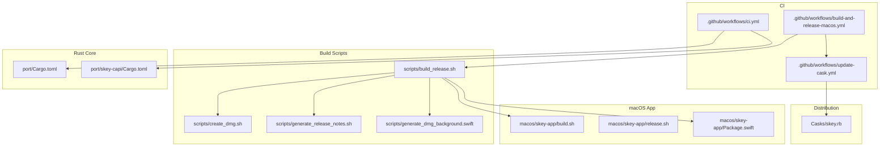

**Diagram sources**
- [build-and-release-macos.yml:40-167](file://.github/workflows/build-and-release-macos.yml#L40-L167)
- [build_release.sh:13-116](file://scripts/build_release.sh#L13-L116)
- [create_dmg.sh:7-82](file://scripts/create_dmg.sh#L7-L82)
- [generate_release_notes.sh:30-132](file://scripts/generate_release_notes.sh#L30-L132)
- [generate_dmg_background.swift:95-127](file://scripts/generate_dmg_background.swift#L95-L127)
- [build.sh:9-92](file://macos/skey-app/build.sh#L9-L92)
- [release.sh:12-36](file://macos/skey-app/release.sh#L12-L36)
- [Package.swift:1-52](file://macos/skey-app/Package.swift#L1-L52)
- [Cargo.toml (port workspace):1-8](file://port/Cargo.toml#L1-L8)
- [Cargo.toml (skey-capi):1-14](file://port/skey-capi/Cargo.toml#L1-L14)
- [update-cask.yml:11-80](file://.github/workflows/update-cask.yml#L11-L80)
- [skey.rb:1-34](file://Casks/skey.rb#L1-L34)

**Section sources**
- [build-and-release-macos.yml:40-167](file://.github/workflows/build-and-release-macos.yml#L40-L167)
- [build_release.sh:13-116](file://scripts/build_release.sh#L13-L116)
- [create_dmg.sh:7-82](file://scripts/create_dmg.sh#L7-L82)
- [generate_release_notes.sh:30-132](file://scripts/generate_release_notes.sh#L30-L132)
- [generate_dmg_background.swift:95-127](file://scripts/generate_dmg_background.swift#L95-L127)
- [build.sh:9-92](file://macos/skey-app/build.sh#L9-L92)
- [release.sh:12-36](file://macos/skey-app/release.sh#L12-L36)
- [Package.swift:1-52](file://macos/skey-app/Package.swift#L1-L52)
- [Cargo.toml (port workspace):1-8](file://port/Cargo.toml#L1-L8)
- [Cargo.toml (skey-capi):1-14](file://port/skey-capi/Cargo.toml#L1-L14)
- [update-cask.yml:11-80](file://.github/workflows/update-cask.yml#L11-L80)
- [skey.rb:1-34](file://Casks/skey.rb#L1-L34)

## Core Components
- CI Orchestration:
  - macOS build and release workflow triggers on pushes to main/master, tags, or manual dispatch; it selects Xcode, installs Rust targets, computes versions/tags, builds universal binaries, signs the app, creates DMG/ZIP, generates release notes, and publishes a GitHub Release
  - Update Cask workflow runs after successful macOS build to fetch the latest DMG asset, compute SHA256, update the cask file, and commit changes
  - CI workflow validates Rust workspace builds, tests, and cross-target compatibility (including wasm and no-allocator configurations)
- Build Scripts:
  - build_release.sh compiles Rust static libraries for both architectures, merges them into a universal archive, builds Swift binaries per architecture, merges into a universal executable inside an app bundle, signs the app, creates a DMG, zips the app, and generates checksums
  - create_dmg.sh prepares a staging directory, copies the app bundle and Applications symlink, sets Finder presentation properties, and converts to a compressed DMG
  - generate_release_notes.sh parses git history between tags to produce categorized release notes with enhanced semantic version filtering and intelligent fallback logic
  - generate_dmg_background.swift draws a branded background image used by the DMG installer
- Local Build Helpers:
  - macos/skey-app/build.sh builds the Rust library, assembles the app bundle, stamps version metadata, compiles Swift code, signs with a developer certificate, and installs to /Applications
  - macos/skey-app/release.sh packages the built app into a versioned ZIP and prints checksums for manual releases
- Distribution:
  - Casks/skey.rb defines the Homebrew Cask entry, pointing to the GitHub Release DMG asset and specifying uninstall/zap behavior

**Updated** Enhanced release notes generation with semantic version pattern filtering, intelligent fallback logic using second most recent tag as baseline, 30-day window fallback, and macOS-specific commit filtering.

**Section sources**
- [build-and-release-macos.yml:40-167](file://.github/workflows/build-and-release-macos.yml#L40-L167)
- [update-cask.yml:11-80](file://.github/workflows/update-cask.yml#L11-L80)
- [ci.yml:17-98](file://.github/workflows/ci.yml#L17-L98)
- [build_release.sh:13-116](file://scripts/build_release.sh#L13-L116)
- [create_dmg.sh:7-82](file://scripts/create_dmg.sh#L7-L82)
- [generate_release_notes.sh:30-132](file://scripts/generate_release_notes.sh#L30-L132)
- [generate_dmg_background.swift:95-127](file://scripts/generate_dmg_background.swift#L95-L127)
- [build.sh:9-92](file://macos/skey-app/build.sh#L9-L92)
- [release.sh:12-36](file://macos/skey-app/release.sh#L12-L36)
- [skey.rb:1-34](file://Casks/skey.rb#L1-L34)

## Architecture Overview
The multi-stage build pipeline integrates Rust and Swift components into a signed, distributable macOS app.

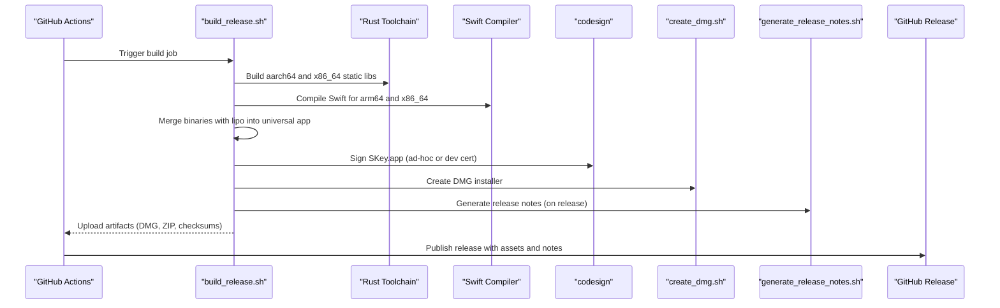

**Diagram sources**
- [build-and-release-macos.yml:40-167](file://.github/workflows/build-and-release-macos.yml#L40-L167)
- [build_release.sh:13-116](file://scripts/build_release.sh#L13-L116)
- [create_dmg.sh:7-82](file://scripts/create_dmg.sh#L7-L82)
- [generate_release_notes.sh:30-132](file://scripts/generate_release_notes.sh#L30-L132)

## Detailed Component Analysis

### Multi-stage Build Process
- Rust Core Compilation:
  - Builds static archives for both Apple targets using cargo with release profile optimizations defined in the workspace
  - Merges the two static archives into a single universal archive using lipo
- Swift Application Compilation:
  - Compiles Swift sources with optimization flags and WMO, linking against the appropriate per-architecture static library and required frameworks
  - Produces per-architecture executables which are merged into a universal binary within the app bundle
- App Bundle Assembly:
  - Copies Info.plist, localization resources, and icons into the app bundle structure
  - Stamps version metadata into Info.plist from environment or git tag
- Signing and Packaging:
  - Signs the app bundle using codesign (ad-hoc in CI, developer certificate locally)
  - Creates a user-friendly DMG with a custom background and drag-to-install layout
  - Generates ZIP archive and SHA256 checksums for verification

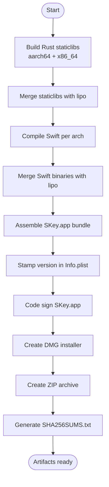

**Diagram sources**
- [build_release.sh:13-116](file://scripts/build_release.sh#L13-L116)
- [create_dmg.sh:7-82](file://scripts/create_dmg.sh#L7-L82)

**Section sources**
- [build_release.sh:13-116](file://scripts/build_release.sh#L13-L116)
- [create_dmg.sh:7-82](file://scripts/create_dmg.sh#L7-L82)
- [Package.swift:29-48](file://macos/skey-app/Package.swift#L29-L48)
- [Cargo.toml (port workspace):5-8](file://port/Cargo.toml#L5-L8)

### Dependency Management
- Rust Workspace:
  - The workspace aggregates multiple crates including the core engine and the C API wrapper
  - Release profile enables LTO and reduced codegen units for optimized binaries
- C ABI Exposure:
  - The skey-capi crate produces staticlib and cdylib outputs to link with Swift and expose a stable C interface
- Swift Linking:
  - The macOS app's Package.swift configures linker settings to include the Rust static library and required system frameworks
  - Bridging header provides access to Objective-C/Swift interop where needed

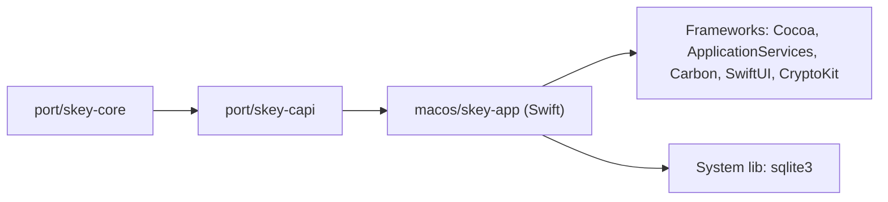

**Diagram sources**
- [Cargo.toml (port workspace):1-8](file://port/Cargo.toml#L1-L8)
- [Cargo.toml (skey-capi):1-14](file://port/skey-capi/Cargo.toml#L1-L14)
- [Package.swift:29-48](file://macos/skey-app/Package.swift#L29-L48)

**Section sources**
- [Cargo.toml (port workspace):1-8](file://port/Cargo.toml#L1-L8)
- [Cargo.toml (skey-capi):1-14](file://port/skey-capi/Cargo.toml#L1-L14)
- [Package.swift:29-48](file://macos/skey-app/Package.swift#L29-L48)

### Code Signing Procedures
- CI Flow:
  - Uses ad-hoc signing to enable installation and execution without requiring a paid Apple Developer account during automated builds
- Local Development:
  - Uses a trusted developer certificate named "SKeyDev" for signing the app bundle before installing to /Applications
- Notes:
  - Deep signing ensures nested components are signed consistently
  - Ad-hoc signing is sufficient for distribution via DMG when users trust the source; production distribution typically requires a proper Apple Developer certificate and provisioning

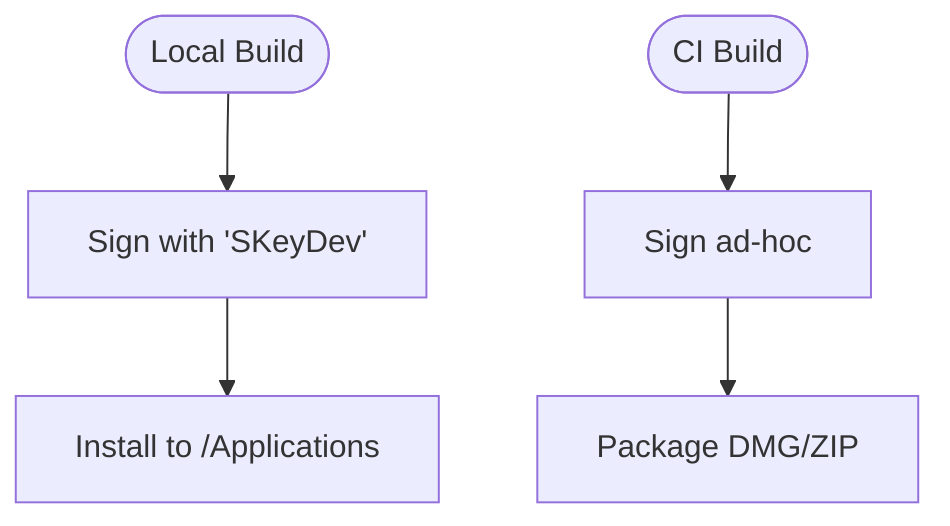

**Diagram sources**
- [build_release.sh:104-106](file://scripts/build_release.sh#L104-L106)
- [build.sh:85-90](file://macos/skey-app/build.sh#L85-L90)

**Section sources**
- [build_release.sh:104-106](file://scripts/build_release.sh#L104-L106)
- [build.sh:85-90](file://macos/skey-app/build.sh#L85-L90)

### Artifact Generation and Distribution
- Artifacts:
  - DMG installer with branded background and drag-to-install layout
  - ZIP archive containing the universal app bundle
  - SHA256 checksums for integrity verification
- DMG Creation:
  - Prepares a writable disk image, configures Finder view options, positions items, and converts to a compressed UDZO format
- ZIP Archive:
  - Created directly from the app bundle preserving resource forks and symlinks
- Checksums:
  - Generated for both DMG and ZIP to support verification by users and downstream tools

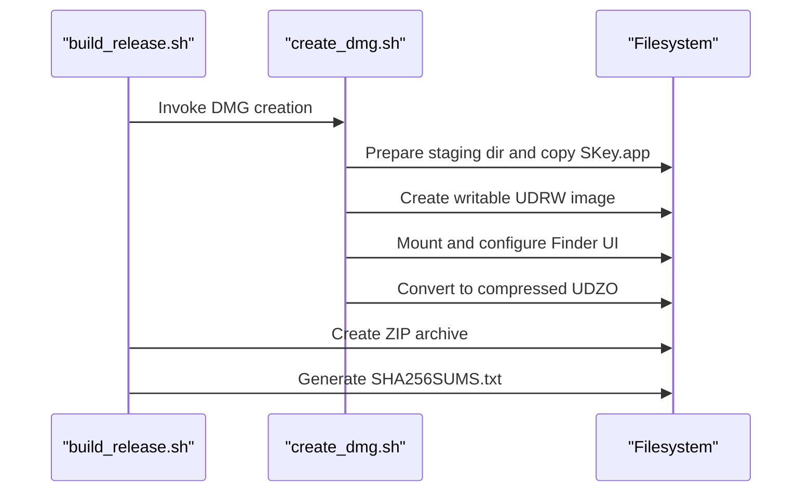

**Diagram sources**
- [build_release.sh:107-116](file://scripts/build_release.sh#L107-L116)
- [create_dmg.sh:7-82](file://scripts/create_dmg.sh#L7-L82)

**Section sources**
- [build_release.sh:107-116](file://scripts/build_release.sh#L107-L116)
- [create_dmg.sh:7-82](file://scripts/create_dmg.sh#L7-L82)

### Homebrew Cask Distribution
- Automation:
  - After a successful macOS build, the update-cask workflow retrieves the latest release tag, downloads the DMG asset, computes its SHA256, and updates the cask file with version, URL, and checksums for both ARM and Intel architectures
- Commit and Push:
  - If changes are detected, commits and pushes the updated cask file automatically
- Cask Definition:
  - Declares app name, description, homepage, minimum macOS version, installed app path, uninstall commands, and cleanup entries

**Updated** Homebrew Cask configuration updated to version 1.0.14 with updated SHA256 checksums for both ARM and Intel architectures.

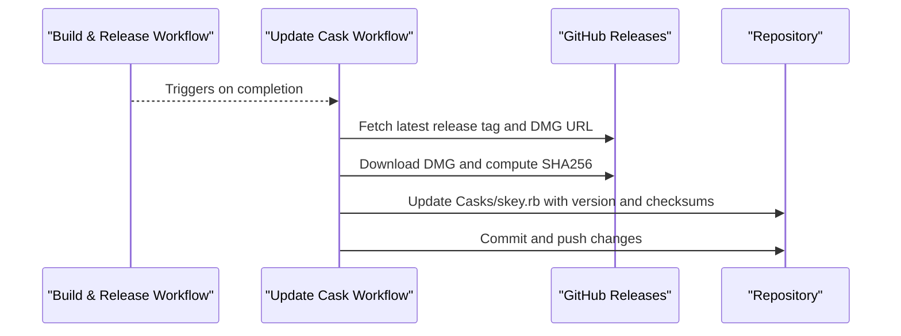

**Diagram sources**
- [update-cask.yml:11-80](file://.github/workflows/update-cask.yml#L11-L80)
- [skey.rb:1-34](file://Casks/skey.rb#L1-L34)

**Section sources**
- [update-cask.yml:11-80](file://.github/workflows/update-cask.yml#L11-L80)
- [skey.rb:1-34](file://Casks/skey.rb#L1-L34)

### Release Automation Workflow
- Version Management:
  - On push to main/master, the workflow computes the next semantic version based on existing tags and commit messages, then creates and pushes a tag
  - For explicit tag pushes, uses the tag as the release version
- Changelog Generation:
  - Generates release notes by parsing commit messages between tags, categorizing features, fixes, performance improvements, UI changes, and other updates with enhanced semantic version pattern filtering
- Publishing:
  - Creates a GitHub Release with DMG, ZIP, checksums, and generated release notes

**Updated** Enhanced release notes generation with intelligent fallback logic using second most recent tag as baseline and 30-day window fallback for repositories without previous releases.

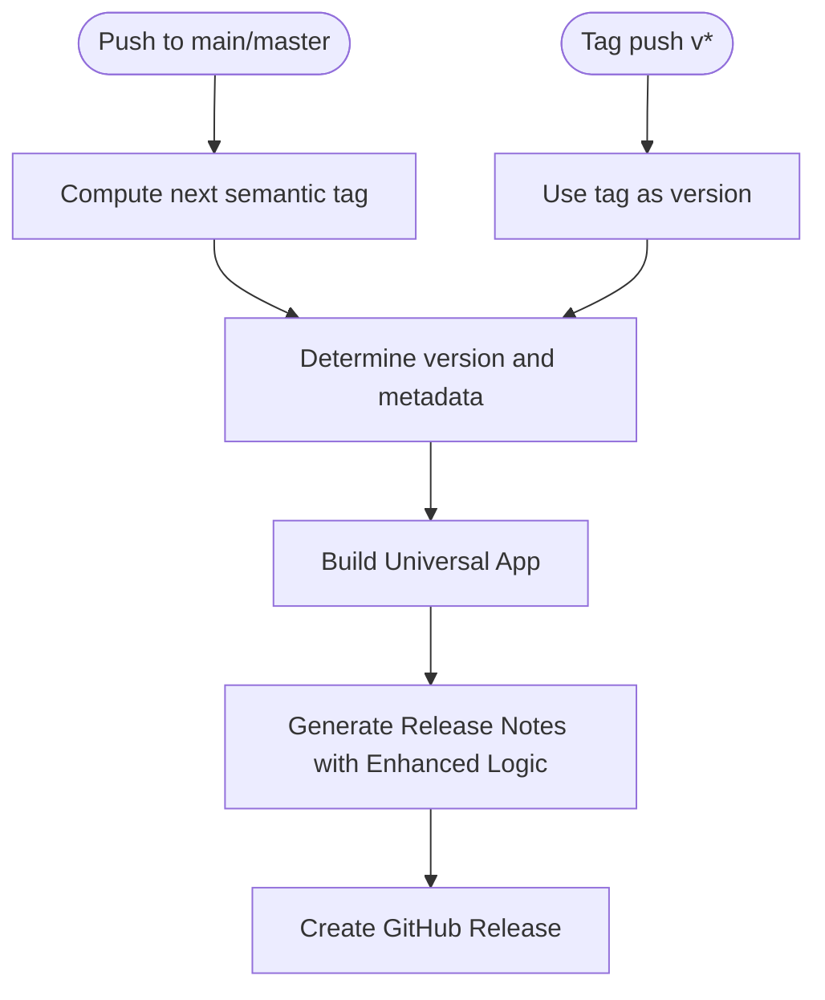

**Diagram sources**
- [build-and-release-macos.yml:69-167](file://.github/workflows/build-and-release-macos.yml#L69-L167)
- [generate_release_notes.sh:30-132](file://scripts/generate_release_notes.sh#L30-L132)

**Section sources**
- [build-and-release-macos.yml:69-167](file://.github/workflows/build-and-release-macos.yml#L69-L167)
- [generate_release_notes.sh:30-132](file://scripts/generate_release_notes.sh#L30-L132)

### Enhanced Release Notes Generation
- Semantic Version Pattern Filtering:
  - Filters commit messages using semantic version patterns (^feat, ^fix, ^perf, ^ui) and Vietnamese keywords (thêm, sửa, tối ưu, giao diện)
  - Categorizes commits into New Features, Bug Fixes, Performance, UI/UX, and Other Improvements sections
- Intelligent Fallback Logic:
  - Uses second most recent tag as baseline when current tag exists to avoid including current release commits
  - Falls back to single tag if only one exists and it's not the current version
  - Implements 30-day window fallback for repositories without previous releases
- macOS-Specific Commit Filtering:
  - Filters commits to only include macOS-related changes in macos/skey-app/, port/, scripts/, and build workflow files
  - Excludes unrelated repository changes from release notes

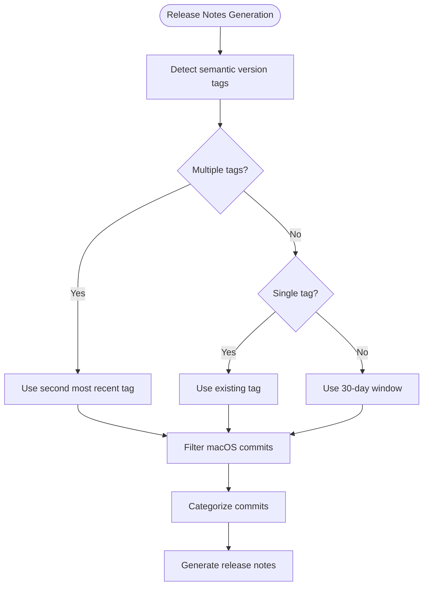

**Diagram sources**
- [generate_release_notes.sh:30-49](file://scripts/generate_release_notes.sh#L30-L49)
- [generate_release_notes.sh:51-84](file://scripts/generate_release_notes.sh#L51-L84)

**Section sources**
- [generate_release_notes.sh:30-49](file://scripts/generate_release_notes.sh#L30-L49)
- [generate_release_notes.sh:51-84](file://scripts/generate_release_notes.sh#L51-L84)

### Cross-Compilation Considerations
- Targets:
  - Rust toolchain includes aarch64-apple-darwin and x86_64-apple-darwin targets for building universal binaries
  - Swift compiler is invoked with specific target triples to produce per-architecture binaries that are later merged
- LTO and Optimization:
  - Workspace release profile enables LTO and reduces codegen units for smaller, faster binaries
- CI Validation:
  - CI also validates builds for non-native targets like wasm32 and no-allocator configurations to ensure broad compatibility

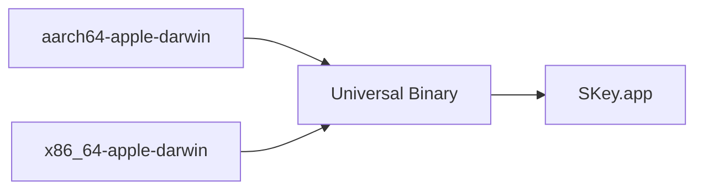

**Diagram sources**
- [build-and-release-macos.yml:64-68](file://.github/workflows/build-and-release-macos.yml#L64-L68)
- [build_release.sh:13-30](file://scripts/build_release.sh#L13-L30)
- [ci.yml:57-66](file://.github/workflows/ci.yml#L57-L66)
- [Cargo.toml (port workspace):5-8](file://port/Cargo.toml#L5-L8)

**Section sources**
- [build-and-release-macos.yml:64-68](file://.github/workflows/build-and-release-macos.yml#L64-L68)
- [build_release.sh:13-30](file://scripts/build_release.sh#L13-L30)
- [ci.yml:57-66](file://.github/workflows/ci.yml#L57-L66)
- [Cargo.toml (port workspace):5-8](file://port/Cargo.toml#L5-L8)

### Code Signing Certificate Management
- Local Development:
  - Uses a developer certificate named "SKeyDev" for signing the app bundle prior to installation
- CI Environment:
  - Uses ad-hoc signing to allow installation and testing without requiring a paid Apple Developer account
- Best Practices:
  - Ensure the correct certificate is available in the keychain for local builds
  - For production distribution, integrate a proper Apple Developer certificate and consider notarization workflows if required by your distribution policy

**Section sources**
- [build.sh:85-90](file://macos/skey-app/build.sh#L85-L90)
- [build_release.sh:104-106](file://scripts/build_release.sh#L104-L106)

### Troubleshooting Common Build Issues
- Missing Rust Targets:
  - Ensure rustup has both aarch64-apple-darwin and x86_64-apple-darwin targets installed; the build script adds them if missing
- Swift Compilation Errors:
  - Verify the bridging header path and include directories match the repository layout; confirm frameworks and libraries are linked correctly
- DMG Creation Failures:
  - Confirm hdiutil and osascript are available; check that SKey.app exists in the expected location before creating the DMG
- Code Signing Errors:
  - Locally, ensure the "SKeyDev" certificate exists in the keychain; in CI, ad-hoc signing should succeed without additional configuration
- Version Stamping Issues:
  - If Info.plist version stamping fails, verify PlistBuddy availability and permissions; the scripts continue even if stamping is skipped
- Cask Update Failures:
  - Ensure the GitHub token has permissions to read releases and write to the repository; verify the DMG asset exists on the tagged release
- Release Notes Generation Issues:
  - Ensure git tags exist and follow semantic versioning patterns (vX.Y.Z); verify repository history is accessible for commit range detection

**Section sources**
- [build_release.sh:13-30](file://scripts/build_release.sh#L13-L30)
- [create_dmg.sh:21-82](file://scripts/create_dmg.sh#L21-L82)
- [build.sh:26-31](file://macos/skey-app/build.sh#L26-L31)
- [update-cask.yml:20-40](file://.github/workflows/update-cask.yml#L20-L40)
- [generate_release_notes.sh:30-49](file://scripts/generate_release_notes.sh#L30-L49)

## Dependency Analysis
- Rust Core Dependencies:
  - skey-core provides the core functionality and is included via the skey-capi crate with default features disabled except alloc
- Swift App Dependencies:
  - Links against system frameworks (Cocoa, ApplicationServices, Carbon, SwiftUI, CryptoKit) and sqlite3
- CI Dependencies:
  - Uses actions for checkout, caching, uploading artifacts, and releasing; relies on standard macOS tools (hdiutil, codesign, swiftc, lipo)

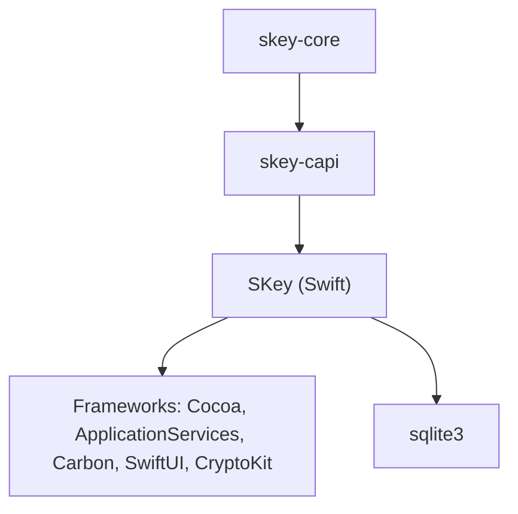

**Diagram sources**
- [Cargo.toml (skey-capi):1-14](file://port/skey-capi/Cargo.toml#L1-L14)
- [Package.swift:29-48](file://macos/skey-app/Package.swift#L29-L48)

**Section sources**
- [Cargo.toml (skey-capi):1-14](file://port/skey-capi/Cargo.toml#L1-L14)
- [Package.swift:29-48](file://macos/skey-app/Package.swift#L29-L48)

## Performance Considerations
- LTO and Codegen:
  - The workspace release profile enables LTO and reduces codegen units to optimize binary size and performance
- WMO Compilation:
  - Swift is compiled with Whole Module Optimization for improved runtime performance
- Universal Binaries:
  - Merging per-architecture binaries ensures native performance on both Apple Silicon and Intel Macs

[No sources needed since this section provides general guidance]

## Troubleshooting Guide
- Rust Build Failures:
  - Verify toolchain stability and target availability; clean and rebuild if necessary
- Swift Linker Errors:
  - Confirm the static library paths and framework links match the current repository layout; ensure the bridging header is present
- DMG Background Generation:
  - Ensure the Swift script can write to the dist/.background directory; check for graphics context availability
- Release Notes Generation:
  - Ensure git tags exist and follow semantic versioning patterns; verify repository history is accessible; adjust commit message conventions if categories are not recognized
- Cask Updates:
  - Validate GH_TOKEN permissions and network access to GitHub Releases; ensure the DMG asset name matches expectations

**Section sources**
- [build_release.sh:13-30](file://scripts/build_release.sh#L13-L30)
- [create_dmg.sh:7-82](file://scripts/create_dmg.sh#L7-L82)
- [generate_release_notes.sh:30-132](file://scripts/generate_release_notes.sh#L30-L132)
- [update-cask.yml:20-40](file://.github/workflows/update-cask.yml#L20-L40)

## Conclusion
The build and deployment system integrates Rust and Swift into a cohesive, signed, and distributable macOS application. It automates versioning, artifact generation, release notes, and Homebrew Cask updates through GitHub Actions. By following the documented steps and troubleshooting guidance, developers can reliably build, test, and distribute SKey across different environments while maintaining high performance and consistency.

**Updated** Recent enhancements include improved release notes generation with semantic version pattern filtering and intelligent fallback logic, along with updated Homebrew Cask configuration supporting version 1.0.14 with architecture-specific checksums for both ARM and Intel platforms.