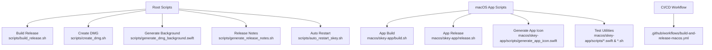
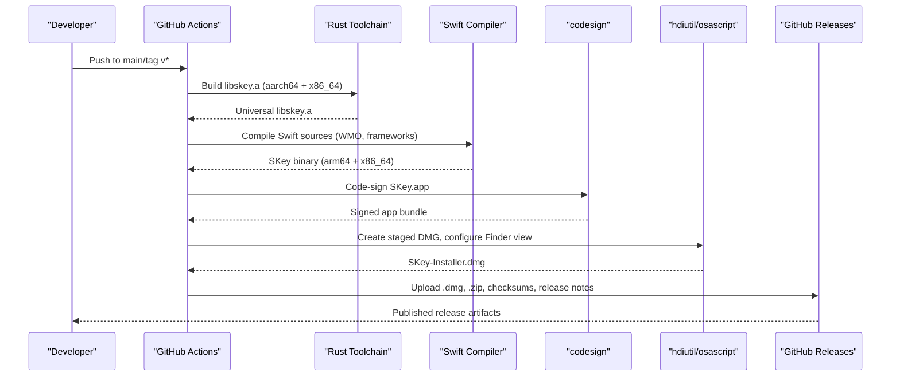
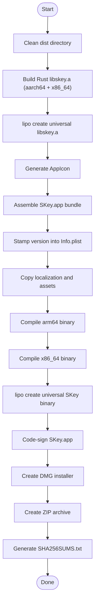
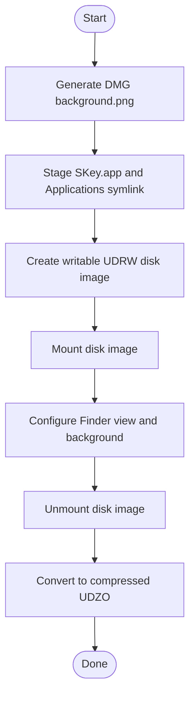
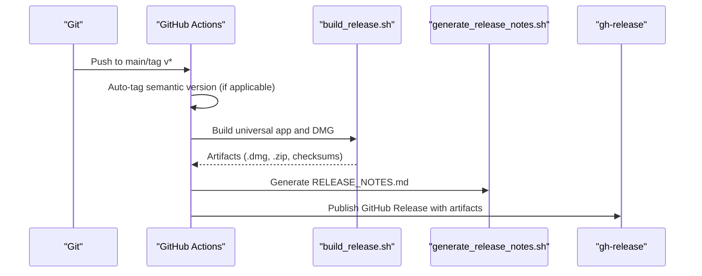
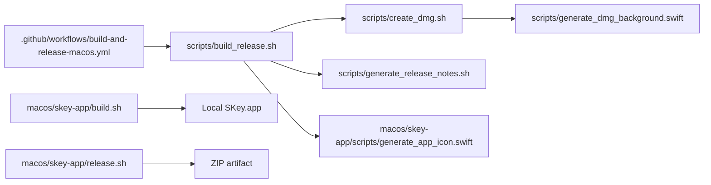

# Development Scripts

<cite>
**Referenced Files in This Document**
- [build_release.sh](file://scripts/build_release.sh)
- [create_dmg.sh](file://scripts/create_dmg.sh)
- [auto_restart_skey.sh](file://scripts/auto_restart_skey.sh)
- [generate_dmg_background.swift](file://scripts/generate_dmg_background.swift)
- [generate_release_notes.sh](file://scripts/generate_release_notes.sh)
- [build.sh](file://macos/skey-app/build.sh)
- [release.sh](file://macos/skey-app/release.sh)
- [generate_app_icon.swift](file://macos/skey-app/scripts/generate_app_icon.swift)
- [run_yandex_test.sh](file://macos/skey-app/scripts/run_yandex_test.sh)
- [test_shortcuts.swift](file://macos/skey-app/scripts/test_shortcuts.swift)
- [build-and-release-macos.yml](file://.github/workflows/build-and-release-macos.yml)
</cite>

## Table of Contents
1. [Introduction](#introduction)
2. [Project Structure](#project-structure)
3. [Core Components](#core-components)
4. [Architecture Overview](#architecture-overview)
5. [Detailed Component Analysis](#detailed-component-analysis)
6. [Dependency Analysis](#dependency-analysis)
7. [Performance Considerations](#performance-considerations)
8. [Troubleshooting Guide](#troubleshooting-guide)
9. [Conclusion](#conclusion)

## Introduction
This document explains the development and release scripts that build, package, sign, and distribute the SKey macOS application. It covers local development workflows, automated CI/CD pipelines, testing utilities, and asset generation tools used to produce installers and release artifacts. The goal is to help developers understand how to build a universal macOS app, create DMG installers, generate icons and backgrounds, run tests, and publish releases via GitHub Actions.

## Project Structure
The repository organizes scripts into two main areas:
- Root-level scripts for end-to-end release packaging and automation
- macOS app-specific scripts for building the app bundle, generating assets, and running targeted tests

**Diagram sources**
- [build_release.sh:1-121](file://scripts/build_release.sh#L1-L121)
- [create_dmg.sh:1-89](file://scripts/create_dmg.sh#L1-L89)
- [generate_dmg_background.swift:1-128](file://scripts/generate_dmg_background.swift#L1-L128)
- [generate_release_notes.sh:1-157](file://scripts/generate_release_notes.sh#L1-L157)
- [auto_restart_skey.sh:1-45](file://scripts/auto_restart_skey.sh#L1-L45)
- [build.sh:1-93](file://macos/skey-app/build.sh#L1-L93)
- [release.sh:1-36](file://macos/skey-app/release.sh#L1-L36)
- [generate_app_icon.swift:1-102](file://macos/skey-app/scripts/generate_app_icon.swift#L1-L102)
- [build-and-release-macos.yml:1-167](file://.github/workflows/build-and-release-macos.yml#L1-L167)

**Section sources**
- [build_release.sh:1-121](file://scripts/build_release.sh#L1-L121)
- [create_dmg.sh:1-89](file://scripts/create_dmg.sh#L1-L89)
- [build.sh:1-93](file://macos/skey-app/build.sh#L1-L93)
- [release.sh:1-36](file://macos/skey-app/release.sh#L1-L36)
- [generate_app_icon.swift:1-102](file://macos/skey-app/scripts/generate_app_icon.swift#L1-L102)
- [generate_dmg_background.swift:1-128](file://scripts/generate_dmg_background.swift#L1-L128)
- [generate_release_notes.sh:1-157](file://scripts/generate_release_notes.sh#L1-L157)
- [auto_restart_skey.sh:1-45](file://scripts/auto_restart_skey.sh#L1-L45)
- [build-and-release-macos.yml:1-167](file://.github/workflows/build-and-release-macos.yml#L1-L167)

## Core Components
- Universal build pipeline: Builds Rust core libraries for both Apple Silicon and Intel, creates a universal static library, compiles Swift sources with WMO optimization, signs the app, and packages DMG and ZIP artifacts.
- Installer creation: Generates a branded DMG background, stages the app bundle and Applications symlink, configures Finder presentation, and compresses the final installer.
- Asset generation: Produces multi-resolution app icons and DMG backgrounds programmatically using Cocoa/AppKit.
- Release notes generator: Extracts relevant commits since the last semantic version tag and formats changelog sections in Markdown.
- Developer helpers: Auto-restart utility to prevent keyboard freezes during testing; targeted test runners for specific features.
- CI/CD automation: GitHub Actions workflow that builds, tags versions, generates release notes, and publishes artifacts on push or tag events.

**Section sources**
- [build_release.sh:1-121](file://scripts/build_release.sh#L1-L121)
- [create_dmg.sh:1-89](file://scripts/create_dmg.sh#L1-L89)
- [generate_app_icon.swift:1-102](file://macos/skey-app/scripts/generate_app_icon.swift#L1-L102)
- [generate_dmg_background.swift:1-128](file://scripts/generate_dmg_background.swift#L1-L128)
- [generate_release_notes.sh:1-157](file://scripts/generate_release_notes.sh#L1-L157)
- [auto_restart_skey.sh:1-45](file://scripts/auto_restart_skey.sh#L1-L45)
- [build-and-release-macos.yml:1-167](file://.github/workflows/build-and-release-macos.yml#L1-L167)

## Architecture Overview
The end-to-end build and release flow integrates multiple tools and steps across local and CI environments.

**Diagram sources**
- [build-and-release-macos.yml:40-167](file://.github/workflows/build-and-release-macos.yml#L40-L167)
- [build_release.sh:13-116](file://scripts/build_release.sh#L13-L116)
- [create_dmg.sh:7-83](file://scripts/create_dmg.sh#L7-L83)

## Detailed Component Analysis

### Universal Build Script (scripts/build_release.sh)
Purpose:
- Prepare a clean distribution directory
- Build Rust core libraries for both architectures and combine them into a universal static library
- Generate app icon assets
- Assemble the SKey.app bundle with resources and Info.plist
- Compile Swift sources with WMO optimization for both architectures and link against the universal library and required frameworks
- Create a universal macOS binary inside the app bundle
- Code-sign the app bundle ad-hoc
- Package DMG and ZIP artifacts and generate SHA256 checksums

Key behaviors:
- Uses lipo to merge architecture-specific binaries and libraries
- Stamps version metadata into Info.plist when APP_VERSION is provided
- Copies localization resources and app icon into the bundle
- Links against Cocoa, ApplicationServices, Carbon, SwiftUI, CryptoKit, and SQLite

**Diagram sources**
- [build_release.sh:9-116](file://scripts/build_release.sh#L9-L116)

**Section sources**
- [build_release.sh:1-121](file://scripts/build_release.sh#L1-L121)

### DMG Creation Script (scripts/create_dmg.sh)
Purpose:
- Generate a branded DMG background image
- Stage the app bundle and an Applications symlink
- Configure Finder presentation properties (icon size, background, positions)
- Create a writable disk image, mount it, apply settings, unmount, and convert to compressed UDZO format

Key behaviors:
- Uses osascript to set Finder preferences for the mounted volume
- Ensures the final DMG is optimized for distribution

**Diagram sources**
- [create_dmg.sh:7-83](file://scripts/create_dmg.sh#L7-L83)

**Section sources**
- [create_dmg.sh:1-89](file://scripts/create_dmg.sh#L1-L89)

### DMG Background Generator (scripts/generate_dmg_background.swift)
Purpose:
- Programmatically draw a gradient background, headline, subtitle, and chevron arrows
- Output a Retina-ready PNG suitable for DMG background usage

Key behaviors:
- Uses NSImage and CGContext to render text and vector shapes
- Writes output to dist/.background/background.png

**Section sources**
- [generate_dmg_background.swift:1-128](file://scripts/generate_dmg_background.swift#L1-L128)

### App Icon Generator (macos/skey-app/scripts/generate_app_icon.swift)
Purpose:
- Render a multi-resolution icon set and compile to AppIcon.icns using system tools

Key behaviors:
- Draws a squircle background and stylized “S” shape at various sizes
- Outputs PNGs into AppIcon.iconset and invokes iconutil to produce icns

**Section sources**
- [generate_app_icon.swift:1-102](file://macos/skey-app/scripts/generate_app_icon.swift#L1-L102)

### Local App Build Script (macos/skey-app/build.sh)
Purpose:
- Build the Rust core library in release mode
- Assemble the SKey.app bundle structure and copy resources
- Stamp version from git tag into Info.plist
- Compile Swift sources with WMO optimization and link frameworks
- Code-sign with a trusted certificate and install to /Applications

Key behaviors:
- Supports debug/dev flags
- Installs the built app bundle to the system Applications folder

**Section sources**
- [build.sh:1-93](file://macos/skey-app/build.sh#L1-L93)

### Local App Release Script (macos/skey-app/release.sh)
Purpose:
- Build the app in release mode and package it into a ZIP file
- Compute and display SHA256 checksum for distribution

Key behaviors:
- Uses ditto to preserve resource forks and extended attributes
- Provides next steps for GitHub Release and Homebrew Cask updates

**Section sources**
- [release.sh:1-36](file://macos/skey-app/release.sh#L1-L36)

### Release Notes Generator (scripts/generate_release_notes.sh)
Purpose:
- Generate structured Markdown release notes based on recent commits
- Categorize changes into features, fixes, UI/UX, performance, and other improvements
- Filter commits to macOS-related paths and respect semantic versioning tags

Key behaviors:
- Detects previous tags and computes commit ranges
- Supports custom version and output file arguments
- Includes system requirements and installation instructions

**Section sources**
- [generate_release_notes.sh:1-157](file://scripts/generate_release_notes.sh#L1-L157)

### Auto-Restart Helper (scripts/auto_restart_skey.sh)
Purpose:
- Periodically restart the SKey app to mitigate keyboard freezes during testing

Key behaviors:
- Kills any running instance and relaunches the app every interval
- Graceful cleanup on SIGINT/SIGTERM

**Section sources**
- [auto_restart_skey.sh:1-45](file://scripts/auto_restart_skey.sh#L1-L45)

### Test Utilities (macos/skey-app/scripts)
Examples:
- run_yandex_test.sh: Compiles and runs a typing tester, then tails logs
- test_shortcuts.swift: Validates shortcut modifiers, key mappings, JSON serialization, event matching, and conflict detection

Usage:
- These scripts assist in validating input handling, shortcuts, and integration points under real-world conditions.

**Section sources**
- [run_yandex_test.sh:1-15](file://macos/skey-app/scripts/run_yandex_test.sh#L1-L15)
- [test_shortcuts.swift:1-110](file://macos/skey-app/scripts/test_shortcuts.swift#L1-L110)

### CI/CD Workflow (.github/workflows/build-and-release-macos.yml)
Purpose:
- Automate building, tagging, packaging, and publishing on pushes and tags
- Trigger builds on changes to macOS app, port, scripts, and workflow files

Key behaviors:
- Selects Xcode version and installs Rust toolchain with targets
- Auto-tags semantic version on main branch pushes based on commit messages
- Determines release metadata and builds universal artifacts
- Generates release notes and publishes GitHub Release with artifacts

**Diagram sources**
- [build-and-release-macos.yml:40-167](file://.github/workflows/build-and-release-macos.yml#L40-L167)
- [build_release.sh:13-116](file://scripts/build_release.sh#L13-L116)
- [generate_release_notes.sh:146-157](file://scripts/generate_release_notes.sh#L146-L157)

**Section sources**
- [build-and-release-macos.yml:1-167](file://.github/workflows/build-and-release-macos.yml#L1-L167)

## Dependency Analysis
The scripts form a layered dependency chain:
- CI workflow orchestrates the entire process and depends on environment setup (Xcode, Rust)
- build_release.sh depends on Rust toolchain, Swift compiler, lipo, codesign, hdiutil, and PlistBuddy
- create_dmg.sh depends on swift script for background generation and macOS disk imaging tools
- generate_release_notes.sh depends on git history and formatting logic
- Local build.sh and release.sh provide developer-friendly shortcuts for iterative builds and packaging

**Diagram sources**
- [build-and-release-macos.yml:40-167](file://.github/workflows/build-and-release-macos.yml#L40-L167)
- [build_release.sh:13-116](file://scripts/build_release.sh#L13-L116)
- [create_dmg.sh:7-83](file://scripts/create_dmg.sh#L7-L83)
- [generate_dmg_background.swift:1-128](file://scripts/generate_dmg_background.swift#L1-L128)
- [generate_app_icon.swift:1-102](file://macos/skey-app/scripts/generate_app_icon.swift#L1-L102)
- [build.sh:1-93](file://macos/skey-app/build.sh#L1-L93)
- [release.sh:1-36](file://macos/skey-app/release.sh#L1-L36)

**Section sources**
- [build_release.sh:13-116](file://scripts/build_release.sh#L13-L116)
- [create_dmg.sh:7-83](file://scripts/create_dmg.sh#L7-L83)
- [generate_release_notes.sh:30-84](file://scripts/generate_release_notes.sh#L30-L84)
- [build-and-release-macos.yml:40-167](file://.github/workflows/build-and-release-macos.yml#L40-L167)

## Performance Considerations
- Use WMO (Whole Module Optimization) for faster Swift compilation and smaller binaries when building release artifacts.
- Prefer universal binaries for distribution to support both Apple Silicon and Intel users without separate builds.
- Compress DMGs with high zlib level to reduce download size while balancing creation time.
- Avoid unnecessary rebuilds by caching Rust and Swift artifacts in CI where possible.
- Limit logging and heavy operations in hot paths during testing to keep feedback loops short.

[No sources needed since this section provides general guidance]

## Troubleshooting Guide
Common issues and resolutions:
- Missing Rust targets: Ensure rustup has installed aarch64-apple-darwin and x86_64-apple-darwin targets before building.
- Swift compilation errors: Verify that all required frameworks are linked and that the bridging header is present.
- Code signing failures: Confirm that a valid signing identity exists locally or use ad-hoc signing for CI.
- DMG creation errors: Ensure hdiutil and osascript are available and that the background image path exists.
- Version stamping issues: Validate that PlistBuddy can modify Info.plist and that the version string is correctly formatted.
- Release notes empty: Check that there are commits in the expected paths and that git tags exist for range calculation.

Operational tips:
- Use auto_restart_skey.sh during intensive testing to avoid keyboard freezes.
- Run targeted test scripts (e.g., shortcuts, Yandex typing tester) to isolate issues quickly.
- Inspect generated artifacts and checksums to verify integrity.

**Section sources**
- [build_release.sh:13-116](file://scripts/build_release.sh#L13-L116)
- [create_dmg.sh:7-83](file://scripts/create_dmg.sh#L7-L83)
- [generate_release_notes.sh:30-84](file://scripts/generate_release_notes.sh#L30-L84)
- [auto_restart_skey.sh:1-45](file://scripts/auto_restart_skey.sh#L1-L45)
- [run_yandex_test.sh:1-15](file://macos/skey-app/scripts/run_yandex_test.sh#L1-L15)
- [test_shortcuts.swift:1-110](file://macos/skey-app/scripts/test_shortcuts.swift#L1-L110)

## Conclusion
The development scripts provide a robust, repeatable pipeline for building, testing, and distributing SKey on macOS. They integrate Rust and Swift toolchains, automate asset generation, ensure consistent packaging, and streamline releases through CI/CD. By following the documented workflows and troubleshooting steps, developers can efficiently iterate on features and deliver reliable updates to users.

[No sources needed since this section summarizes without analyzing specific files]