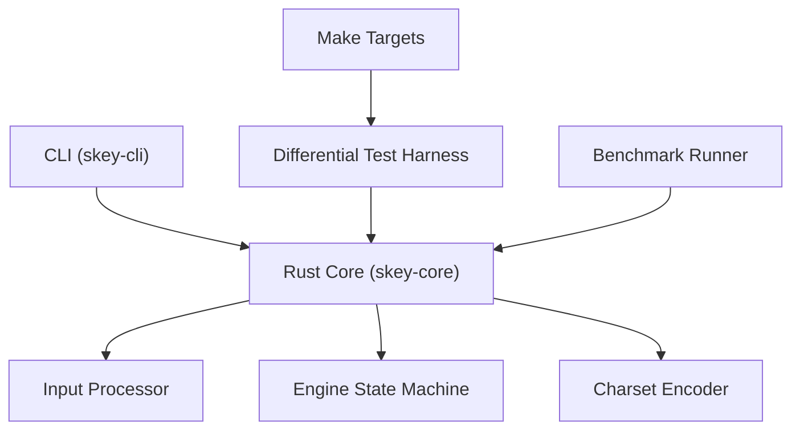
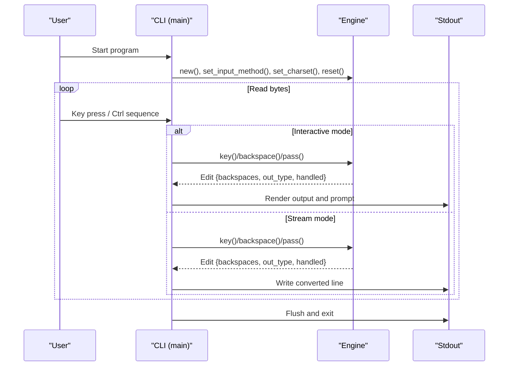
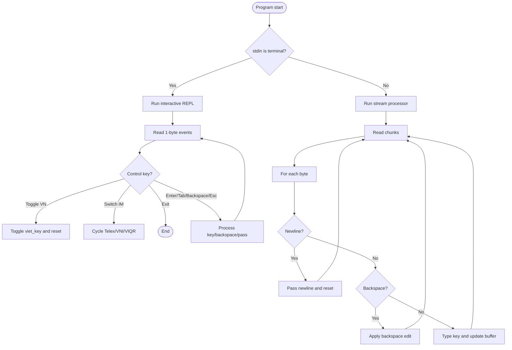
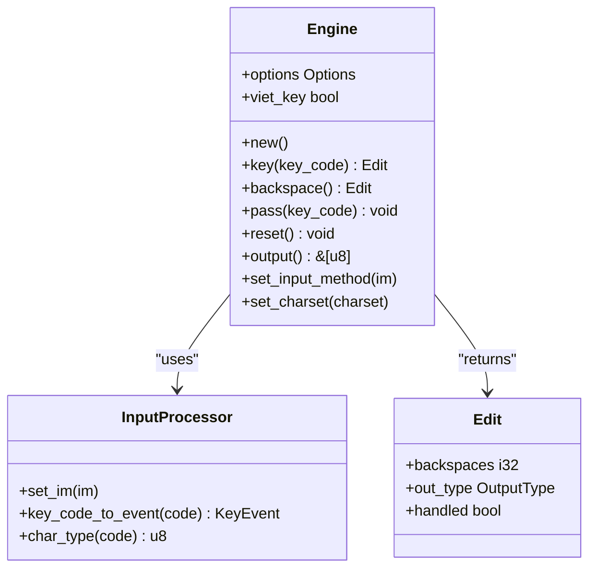
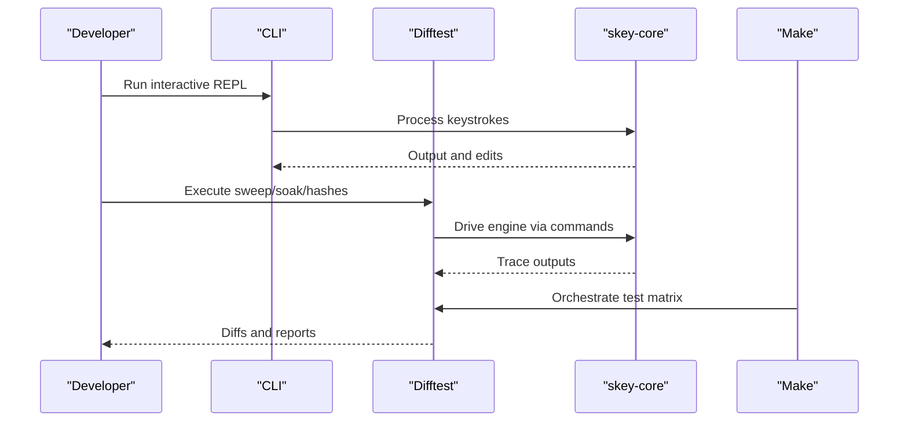
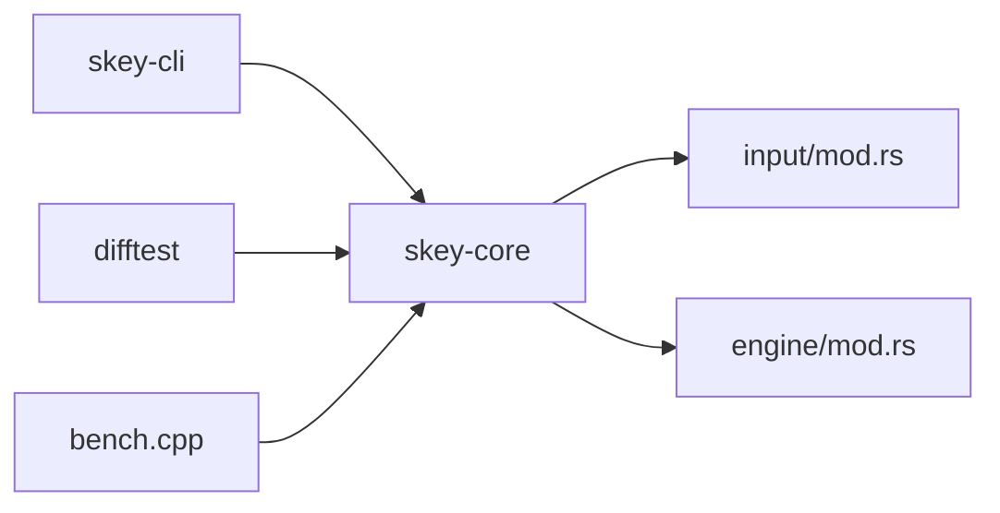

# CLI Tool

<cite>
**Referenced Files in This Document**
- [main.rs](file://port/skey-cli/src/main.rs)
- [Cargo.toml](file://port/skey-cli/Cargo.toml)
- [mod.rs (Engine)](file://port/skey-core/src/engine/mod.rs)
- [lib.rs (skey-core)](file://port/skey-core/src/lib.rs)
- [mod.rs (Input)](file://port/skey-core/src/input/mod.rs)
- [README.md (port)](file://port/README.md)
- [main.rs (difftest)](file://port/difftest/src/main.rs)
- [Makefile](file://port/Makefile)
- [bench.cpp](file://port/bench/bench.cpp)
</cite>

## Table of Contents
1. Introduction
2. Project Structure
3. Core Components
4. Architecture Overview
5. Detailed Component Analysis
6. Dependency Analysis
7. Performance Considerations
8. Troubleshooting Guide
9. Conclusion
10. Appendices

## Introduction
This document explains the command-line interface tool that provides an interactive terminal REPL and automation capabilities for Vietnamese input method processing. The CLI is built on top of a high-performance Rust core engine and exposes two modes:
- Interactive REPL mode when run from a terminal, with real-time key handling and status display.
- Stream mode when input is piped or redirected, suitable for scripting and batch processing.

The CLI integrates directly with the skey-core Engine to convert keystrokes into typed output using Telex, VNI, and VIQR input methods, while supporting backspace, escape, tab, and newline semantics. It also participates in automated testing and benchmarking workflows via the difftest harness and Make targets.

## Project Structure
The CLI lives under port/skey-cli and depends on the skey-core library. The repository includes additional tools for differential testing and benchmarking that complement the CLI’s automation use cases.

**Diagram sources**
- [main.rs:1-244](file://port/skey-cli/src/main.rs#L1-L244)
- [lib.rs:1-47](file://port/skey-core/src/lib.rs#L1-L47)
- [mod.rs (Engine):1-426](file://port/skey-core/src/engine/mod.rs#L1-L426)
- [mod.rs (Input):1-215](file://port/skey-core/src/input/mod.rs#L1-L215)
- [main.rs (difftest):1-259](file://port/difftest/src/main.rs#L1-L259)
- [Makefile:1-138](file://port/Makefile#L1-L138)
- [bench.cpp:1-83](file://port/bench/bench.cpp#L1-L83)

**Section sources**
- [Cargo.toml:1-10](file://port/skey-cli/Cargo.toml#L1-L10)
- [README.md (port):1-458](file://port/README.md#L1-L458)

## Core Components
- CLI entrypoint detects whether stdin is a terminal and chooses between interactive REPL and stream processing.
- Interactive REPL sets raw terminal mode, handles control sequences, toggles Vietnamese mode, switches input methods, and renders live output.
- Stream mode reads bytes, processes keys and backspaces, and writes converted text line by line.
- The Engine encapsulates state, options, input method mapping, and output buffering.
- Input processor classifies key codes and maps them per input method (Telex, VNI, VIQR).
- Charset encoder produces UTF-8 output compatible with terminals and scripts.

Key responsibilities:
- Terminal interaction and control key handling in the CLI.
- Keystroke-to-output conversion in the Engine.
- Input method selection and character classification in the Input processor.
- Output encoding and buffer management in the Engine and charset layer.

**Section sources**
- [main.rs:66-174](file://port/skey-cli/src/main.rs#L66-L174)
- [main.rs:183-235](file://port/skey-cli/src/main.rs#L183-L235)
- [mod.rs (Engine):80-178](file://port/skey-core/src/engine/mod.rs#L80-L178)
- [mod.rs (Input):72-192](file://port/skey-core/src/input/mod.rs#L72-L192)

## Architecture Overview
The CLI architecture separates user interaction from the core typing engine. The CLI configures the Engine once at startup (input method, charset, options), then dispatches each byte to the Engine and renders results. In stream mode, it maintains a line buffer to handle backspace edits consistently.

**Diagram sources**
- [main.rs:237-244](file://port/skey-cli/src/main.rs#L237-L244)
- [main.rs:66-174](file://port/skey-cli/src/main.rs#L66-L174)
- [main.rs:183-235](file://port/skey-cli/src/main.rs#L183-L235)
- [mod.rs (Engine):248-319](file://port/skey-core/src/engine/mod.rs#L248-L319)

## Detailed Component Analysis

### CLI Entry and Modes
- Detects terminal vs pipe to select interactive or stream mode.
- Interactive mode uses raw terminal settings and control key handlers for toggling Vietnamese mode, switching input methods, and exiting.
- Stream mode buffers lines and applies backspace edits to maintain consistent output.

**Diagram sources**
- [main.rs:237-244](file://port/skey-cli/src/main.rs#L237-L244)
- [main.rs:66-174](file://port/skey-cli/src/main.rs#L66-L174)
- [main.rs:183-235](file://port/skey-cli/src/main.rs#L183-L235)

**Section sources**
- [main.rs:66-174](file://port/skey-cli/src/main.rs#L66-L174)
- [main.rs:183-235](file://port/skey-cli/src/main.rs#L183-L235)
- [main.rs:237-244](file://port/skey-cli/src/main.rs#L237-L244)

### Engine Integration
- The CLI initializes the Engine with Telex input method, UTF-8 charset, default options, and Vietnamese mode enabled.
- Each key press is dispatched through the Engine’s key function; backspace uses the Engine’s backspace function; Enter passes a newline and resets state.
- Output is read from the Engine and written to stdout, respecting backspace counts and output type.

**Diagram sources**
- [mod.rs (Engine):18-70](file://port/skey-core/src/engine/mod.rs#L18-L70)
- [mod.rs (Engine):80-178](file://port/skey-core/src/engine/mod.rs#L80-L178)
- [mod.rs (Engine):248-319](file://port/skey-core/src/engine/mod.rs#L248-L319)
- [mod.rs (Input):72-192](file://port/skey-core/src/input/mod.rs#L72-L192)

**Section sources**
- [mod.rs (Engine):80-178](file://port/skey-core/src/engine/mod.rs#L80-L178)
- [mod.rs (Engine):248-319](file://port/skey-core/src/engine/mod.rs#L248-L319)
- [mod.rs (Input):72-192](file://port/skey-core/src/input/mod.rs#L72-L192)

### Automation and Testing Integration
- The difftest harness speaks the same protocol as the reference oracle, enabling line-by-line diffs against the Rust engine.
- The CLI can be used interactively to validate behavior during development, while automated tests drive the Engine via commands like gen, type, bench, hashes.
- Make targets orchestrate sweeps, soak tests, macro/keymap validation, and C ABI checks.

**Diagram sources**
- [main.rs (difftest):1-259](file://port/difftest/src/main.rs#L1-L259)
- [Makefile:1-138](file://port/Makefile#L1-L138)

**Section sources**
- [main.rs (difftest):1-259](file://port/difftest/src/main.rs#L1-L259)
- [Makefile:1-138](file://port/Makefile#L1-L138)

## Dependency Analysis
- The CLI depends only on skey-core for engine functionality.
- skey-core exposes Engine, Options, Charset, and related types.
- Input processor provides key classification and method-specific mappings.
- The difftest harness depends on skey-core for generating traces and running benchmarks.
- Benchmarks compare Rust and C++ engines over identical corpora.

**Diagram sources**
- [Cargo.toml:1-10](file://port/skey-cli/Cargo.toml#L1-L10)
- [lib.rs:1-47](file://port/skey-core/src/lib.rs#L1-L47)
- [mod.rs (Input):1-215](file://port/skey-core/src/input/mod.rs#L1-L215)
- [mod.rs (Engine):1-426](file://port/skey-core/src/engine/mod.rs#L1-L426)
- [main.rs (difftest):1-259](file://port/difftest/src/main.rs#L1-L259)
- [bench.cpp:1-83](file://port/bench/bench.cpp#L1-L83)

**Section sources**
- [Cargo.toml:1-10](file://port/skey-cli/Cargo.toml#L1-L10)
- [lib.rs:1-47](file://port/skey-core/src/lib.rs#L1-L47)

## Performance Considerations
- The CLI operates in two modes optimized for different workloads:
  - Interactive mode minimizes latency by reading one byte at a time and rendering immediately.
  - Stream mode batches reads and processes line-by-line for throughput.
- The Engine performs no allocation on the keystroke path and avoids searches, ensuring low overhead.
- Benchmarks demonstrate the Rust engine’s performance relative to the original C++ implementation across multiple configurations.

Practical guidance:
- Use stream mode for large inputs or CI pipelines where piping text is standard.
- Use interactive mode for debugging and quick validation of input method behavior.
- Leverage Make targets for comprehensive verification and benchmarking.

[No sources needed since this section provides general guidance]

## Troubleshooting Guide
Common issues and resolutions:
- Terminal not restoring after crash: The CLI installs a panic hook to restore terminal mode; ensure your environment allows stty commands.
- Control keys not working: Verify you are running in a TTY; interactive mode requires a terminal.
- Incorrect input method: Confirm the current input method and switch using the provided control sequence.
- Stream mode output misalignment: Ensure backspace handling is supported by your downstream consumer; the CLI updates its internal buffer accordingly.

Operational tips:
- When integrating with shell scripts, prefer stream mode and parse output line by line.
- For CI, use Make targets to run sweeps and soak tests; capture diffs for regression detection.
- For benchmarking, generate a corpus and run the bench target to measure per-key performance.

**Section sources**
- [main.rs:66-174](file://port/skey-cli/src/main.rs#L66-L174)
- [main.rs:183-235](file://port/skey-cli/src/main.rs#L183-L235)
- [Makefile:1-138](file://port/Makefile#L1-L138)

## Conclusion
The CLI tool provides a robust, efficient interface to the skey-core Vietnamese input engine, supporting both interactive typing sessions and scripted automation. Its design cleanly separates terminal interaction from engine logic, enabling seamless integration into development workflows, continuous integration, and performance benchmarking. With comprehensive testing harnesses and Make targets, users can validate behavior across input methods, charsets, and options while maintaining high performance and reliability.

[No sources needed since this section summarizes without analyzing specific files]

## Appendices

### Command-Line Usage Examples
- Interactive REPL:
  - Run the CLI in a terminal to toggle Vietnamese mode, switch input methods, and type Vietnamese characters in real time.
  - Use control sequences to toggle Vietnamese mode, cycle input methods, and exit.
- Stream processing:
  - Pipe text into the CLI to convert keystrokes according to the configured input method and charset.
  - Combine with shell utilities for batch transformations and automated testing.

Integration patterns:
- Continuous integration:
  - Use Make targets to run sweeps, soak tests, and macro/keymap validations.
  - Capture diffs and logs to detect regressions in input method behavior.
- Performance benchmarking:
  - Generate a corpus and run benchmarks to measure per-key performance.
  - Compare Rust and C++ implementations using provided scripts.

Platform compatibility:
- The CLI runs on POSIX-like systems where stty is available for terminal control.
- The core engine supports no_std builds and WebAssembly targets for embedded or browser contexts.

Environment setup:
- Install Rust toolchain and build dependencies.
- Use Cargo to build the CLI and associated tools.
- Utilize Make targets for comprehensive verification and benchmarking.

**Section sources**
- [main.rs:66-174](file://port/skey-cli/src/main.rs#L66-L174)
- [main.rs:183-235](file://port/skey-cli/src/main.rs#L183-L235)
- [Makefile:1-138](file://port/Makefile#L1-L138)
- [README.md (port):298-311](file://port/README.md#L298-L311)