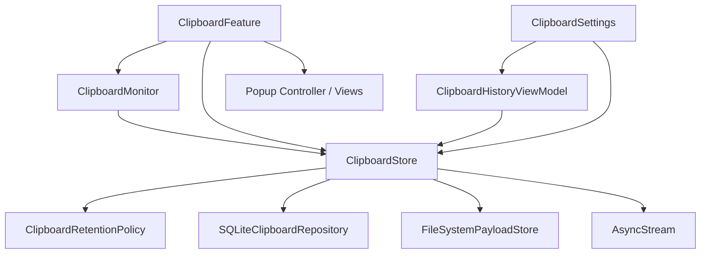
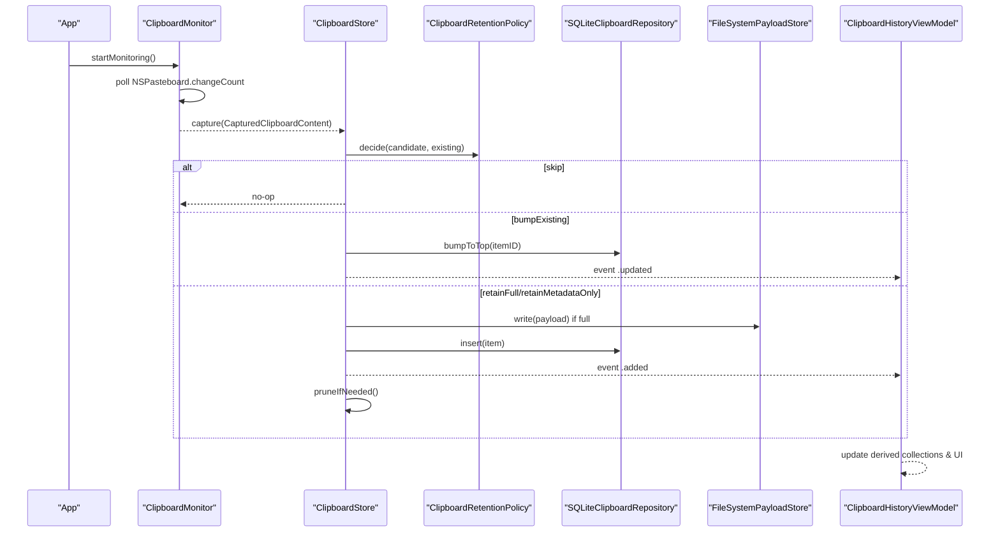
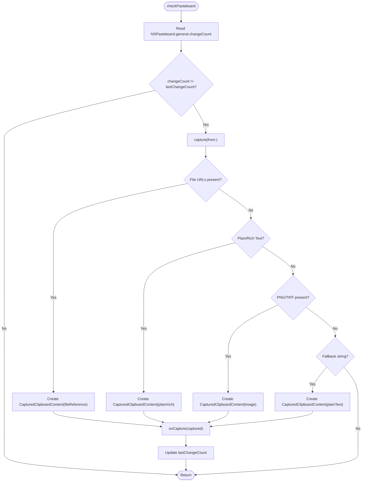
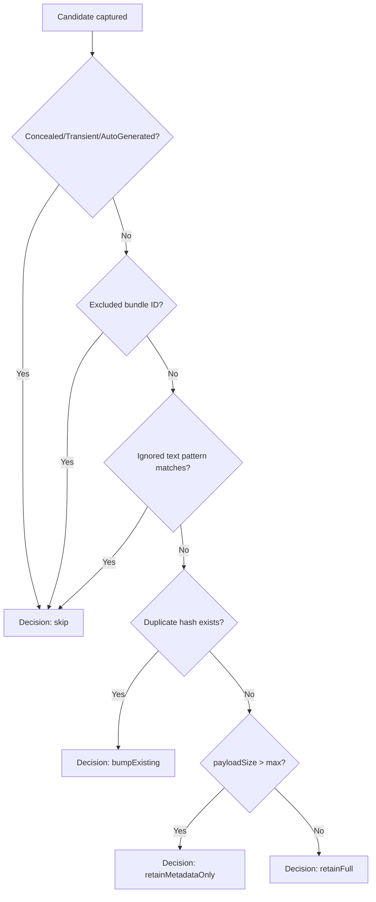
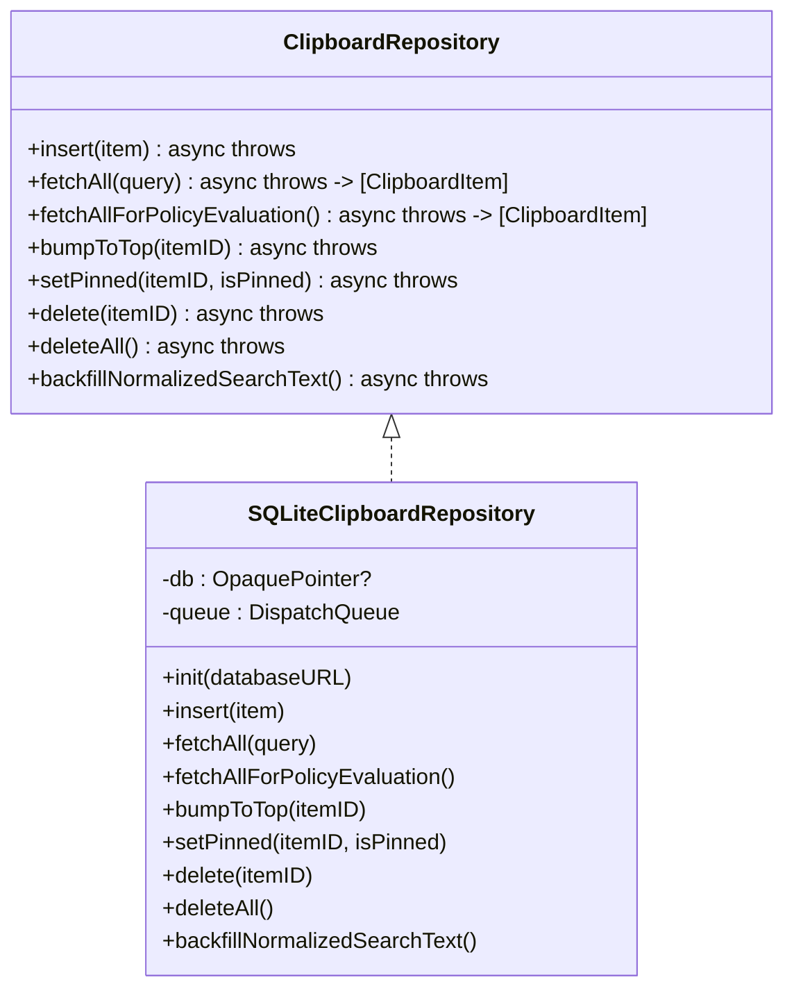
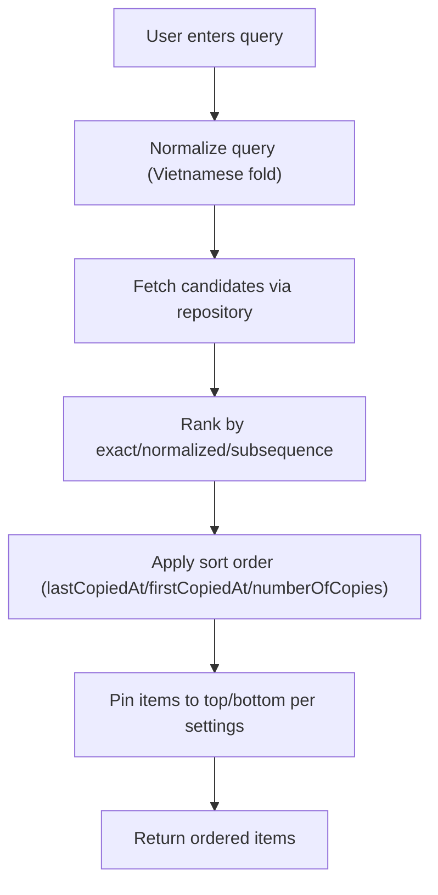
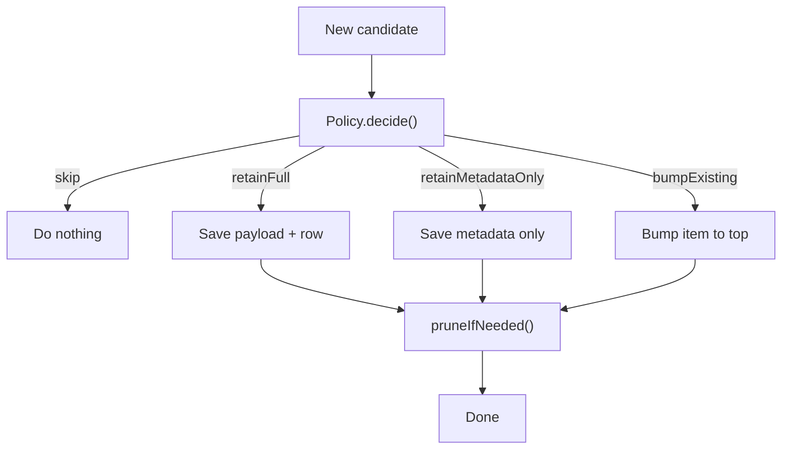
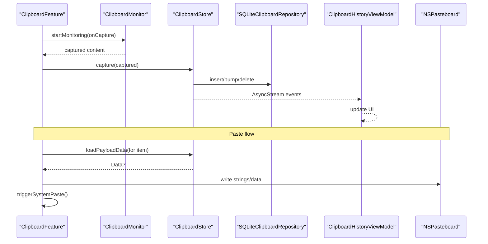
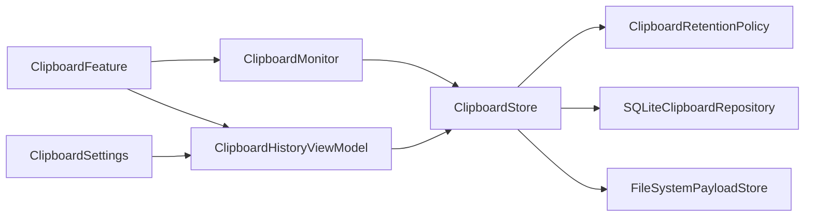

# Clipboard Manager

<cite>
**Referenced Files in This Document**
- [ClipboardMonitor.swift](file://macos/skey-app/Sources/Features/Clipboard/Services/ClipboardMonitor.swift)
- [ClipboardRepository.swift](file://macos/skey-app/Sources/Features/Clipboard/Services/ClipboardRepository.swift)
- [SQLiteClipboardRepository.swift](file://macos/skey-app/Sources/Features/Clipboard/Services/SQLiteClipboardRepository.swift)
- [ClipboardItem.swift](file://macos/skey-app/Sources/Features/Clipboard/Models/ClipboardItem.swift)
- [ClipboardEnums.swift](file://macos/skey-app/Sources/Features/Clipboard/Models/ClipboardEnums.swift)
- [ClipboardRetentionPolicy.swift](file://macos/skey-app/Sources/Features/Clipboard/Services/ClipboardRetentionPolicy.swift)
- [PayloadStoring.swift](file://macos/skey-app/Sources/Features/Clipboard/Services/PayloadStoring.swift)
- [SearchRanking.swift](file://macos/skey-app/Sources/Features/Clipboard/Services/SearchRanking.swift)
- [ClipboardStore.swift](file://macos/skey-app/Sources/Features/Clipboard/Services/ClipboardStore.swift)
- [ClipboardHistoryViewModel.swift](file://macos/skey-app/Sources/Features/Clipboard/UI/ViewModels/ClipboardHistoryViewModel.swift)
- [ClipboardFeature.swift](file://macos/skey-app/Sources/Features/Clipboard/ClipboardFeature.swift)
- [ClipboardSettings.swift](file://macos/skey-app/Sources/Shared/Settings/Modules/ClipboardSettings.swift)
</cite>

## Table of Contents
1. [Introduction](#introduction)
2. [Project Structure](#project-structure)
3. [Core Components](#core-components)
4. [Architecture Overview](#architecture-overview)
5. [Detailed Component Analysis](#detailed-component-analysis)
6. [Dependency Analysis](#dependency-analysis)
7. [Performance Considerations](#performance-considerations)
8. [Troubleshooting Guide](#troubleshooting-guide)
9. [Conclusion](#conclusion)
10. [Appendices](#appendices)

## Introduction
This document explains the clipboard manager feature with a focus on thread-safe clipboard monitoring, history management, and privacy controls. It covers how NSPasteboard changes are observed, how content types are detected, how sensitive or transient data is filtered out, and how history is stored and retrieved efficiently using SQLite and search indexing. It also documents retention policies, pinning, export/import considerations, and interactions with the UI layer and system clipboard service. Finally, it addresses common issues such as memory usage, concurrent access handling, and data migration between versions.

## Project Structure
The clipboard feature is organized into clear layers:
- Monitoring and capture: ClipboardMonitor observes NSPasteboard and captures content safely.
- Policy and storage: ClipboardRetentionPolicy decides whether to keep, bump, skip, or store metadata-only; ClipboardStore orchestrates policy, repository, and payload storage; SQLiteClipboardRepository persists items; PayloadStoring handles large payloads off the main database.
- Data model and search: ClipboardItem and related enums define the item schema; SearchRanking provides fast, diacritic-insensitive ranking.
- UI integration: ClipboardHistoryViewModel binds to ClipboardStore events and drives the popup UI; ClipboardFeature wires monitoring, store, and UI together.
- Settings: ClipboardSettings exposes user preferences that influence behavior (history limit, sort order, pin placement, etc.).

**Diagram sources**
- [ClipboardFeature.swift:26-48](file://macos/skey-app/Sources/Features/Clipboard/ClipboardFeature.swift#L26-L48)
- [ClipboardMonitor.swift:21-44](file://macos/skey-app/Sources/Features/Clipboard/Services/ClipboardMonitor.swift#L21-L44)
- [ClipboardStore.swift:68-113](file://macos/skey-app/Sources/Features/Clipboard/Services/ClipboardStore.swift#L68-L113)
- [ClipboardRetentionPolicy.swift:30-53](file://macos/skey-app/Sources/Features/Clipboard/Services/ClipboardRetentionPolicy.swift#L30-L53)
- [SQLiteClipboardRepository.swift:34-54](file://macos/skey-app/Sources/Features/Clipboard/Services/SQLiteClipboardRepository.swift#L34-L54)
- [PayloadStoring.swift:13-41](file://macos/skey-app/Sources/Features/Clipboard/Services/PayloadStoring.swift#L13-L41)
- [ClipboardHistoryViewModel.swift:66-77](file://macos/skey-app/Sources/Features/Clipboard/UI/ViewModels/ClipboardHistoryViewModel.swift#L66-L77)
- [ClipboardSettings.swift:63-84](file://macos/skey-app/Sources/Shared/Settings/Modules/ClipboardSettings.swift#L63-L84)

**Section sources**
- [ClipboardFeature.swift:26-48](file://macos/skey-app/Sources/Features/Clipboard/ClipboardFeature.swift#L26-L48)
- [ClipboardMonitor.swift:21-44](file://macos/skey-app/Sources/Features/Clipboard/Services/ClipboardMonitor.swift#L21-L44)
- [ClipboardStore.swift:68-113](file://macos/skey-app/Sources/Features/Clipboard/Services/ClipboardStore.swift#L68-L113)
- [ClipboardRetentionPolicy.swift:30-53](file://macos/skey-app/Sources/Features/Clipboard/Services/ClipboardRetentionPolicy.swift#L30-L53)
- [SQLiteClipboardRepository.swift:34-54](file://macos/skey-app/Sources/Features/Clipboard/Services/SQLiteClipboardRepository.swift#L34-L54)
- [PayloadStoring.swift:13-41](file://macos/skey-app/Sources/Features/Clipboard/Services/PayloadStoring.swift#L13-L41)
- [ClipboardHistoryViewModel.swift:66-77](file://macos/skey-app/Sources/Features/Clipboard/UI/ViewModels/ClipboardHistoryViewModel.swift#L66-L77)
- [ClipboardSettings.swift:63-84](file://macos/skey-app/Sources/Shared/Settings/Modules/ClipboardSettings.swift#L63-L84)

## Core Components
- ClipboardMonitor: Polls NSPasteboard.changeCount on a background timer, detects new content, classifies type, computes hashes, and invokes a capture callback.
- ClipboardRetentionPolicy: Filters out concealed/transient types, app exclusions, ignored text patterns, duplicates, and oversized payloads; returns decisions like skip, bumpExisting, retainFull, retainMetadataOnly.
- ClipboardStore: Actor-based coordinator that applies policy, persists via repository, stores payloads separately, emits events, and manages caching and pruning.
- SQLiteClipboardRepository: Thread-safe SQLite-backed persistence with WAL mode, indexes, normalized search text, and operations for insert, fetch, bump, pin, delete, and backfill.
- PayloadStoring: Filesystem-based storage for large payloads (images, rich text), referenced by path in the database.
- SearchRanking: Diacritic- and case-insensitive ranking over normalized search text with exact match priority and subsequence fallback.
- ClipboardHistoryViewModel: MainActor-bound view model that listens to store events, performs debounced search, preloads images, and updates derived collections (pinned/unpinned).
- ClipboardFeature: Wires monitor, store, and UI; triggers paste actions and opens/closes the popup.
- ClipboardSettings: User-configurable options controlling history limit, sorting, pin placement, preview behavior, and more.

**Section sources**
- [ClipboardMonitor.swift:7-44](file://macos/skey-app/Sources/Features/Clipboard/Services/ClipboardMonitor.swift#L7-L44)
- [ClipboardRetentionPolicy.swift:6-53](file://macos/skey-app/Sources/Features/Clipboard/Services/ClipboardRetentionPolicy.swift#L6-L53)
- [ClipboardStore.swift:5-44](file://macos/skey-app/Sources/Features/Clipboard/Services/ClipboardStore.swift#L5-L44)
- [SQLiteClipboardRepository.swift:6-54](file://macos/skey-app/Sources/Features/Clipboard/Services/SQLiteClipboardRepository.swift#L6-L54)
- [PayloadStoring.swift:5-41](file://macos/skey-app/Sources/Features/Clipboard/Services/PayloadStoring.swift#L5-L41)
- [SearchRanking.swift:5-64](file://macos/skey-app/Sources/Features/Clipboard/Services/SearchRanking.swift#L5-L64)
- [ClipboardHistoryViewModel.swift:8-77](file://macos/skey-app/Sources/Features/Clipboard/UI/ViewModels/ClipboardHistoryViewModel.swift#L8-L77)
- [ClipboardFeature.swift:6-48](file://macos/skey-app/Sources/Features/Clipboard/ClipboardFeature.swift#L6-L48)
- [ClipboardSettings.swift:6-84](file://macos/skey-app/Sources/Shared/Settings/Modules/ClipboardSettings.swift#L6-L84)

## Architecture Overview
The clipboard pipeline is actor-isolated and thread-safe:
- ClipboardMonitor polls NSPasteboard and captures content without blocking the UI.
- ClipboardStore receives captured content, applies privacy and retention rules, and persists results.
- SQLiteClipboardRepository uses a dedicated queue and WAL mode for concurrency safety and crash resilience.
- PayloadStoring writes large payloads to disk and references them by filename.
- ClipboardHistoryViewModel subscribes to store events and updates the UI reactively.

**Diagram sources**
- [ClipboardMonitor.swift:21-44](file://macos/skey-app/Sources/Features/Clipboard/Services/ClipboardMonitor.swift#L21-L44)
- [ClipboardStore.swift:68-113](file://macos/skey-app/Sources/Features/Clipboard/Services/ClipboardStore.swift#L68-L113)
- [ClipboardRetentionPolicy.swift:30-53](file://macos/skey-app/Sources/Features/Clipboard/Services/ClipboardRetentionPolicy.swift#L30-L53)
- [SQLiteClipboardRepository.swift:69-122](file://macos/skey-app/Sources/Features/Clipboard/Services/SQLiteClipboardRepository.swift#L69-L122)
- [PayloadStoring.swift:26-31](file://macos/skey-app/Sources/Features/Clipboard/Services/PayloadStoring.swift#L26-L31)
- [ClipboardHistoryViewModel.swift:66-77](file://macos/skey-app/Sources/Features/Clipboard/UI/ViewModels/ClipboardHistoryViewModel.swift#L66-L77)

## Detailed Component Analysis

### Clipboard Observation Mechanism (NSPasteboard polling and content detection)
- ClipboardMonitor uses a Timer to poll NSPasteboard.general.changeCount at a configurable interval. When changeCount increases, it captures content once per change.
- Content detection prioritizes files, then rich text (RTF) when available, otherwise plain text; images are handled via PNG/TIFF with TIFF-to-PNG compression; file references use URL objects.
- For each capture, it records contentHash (SHA-256), payload size, source bundle ID, and pasteboard type markers for privacy filtering.

**Diagram sources**
- [ClipboardMonitor.swift:37-154](file://macos/skey-app/Sources/Features/Clipboard/Services/ClipboardMonitor.swift#L37-L154)

**Section sources**
- [ClipboardMonitor.swift:21-44](file://macos/skey-app/Sources/Features/Clipboard/Services/ClipboardMonitor.swift#L21-L44)
- [ClipboardMonitor.swift:46-154](file://macos/skey-app/Sources/Features/Clipboard/Services/ClipboardMonitor.swift#L46-L154)

### Privacy Controls and Sensitive Information Filtering
- ClipboardRetentionPolicy excludes pasteboard types marked as concealed, transient, or auto-generated to avoid storing sensitive or temporary data.
- Exclusion rules can be configured per application bundle ID to ignore clipboard activity from specific apps.
- Ignored text patterns (regex) allow skipping sensitive content like tokens or secrets based on text matching.
- Oversized payloads are retained as metadata only to prevent memory pressure.

**Diagram sources**
- [ClipboardRetentionPolicy.swift:6-53](file://macos/skey-app/Sources/Features/Clipboard/Services/ClipboardRetentionPolicy.swift#L6-L53)

**Section sources**
- [ClipboardRetentionPolicy.swift:6-53](file://macos/skey-app/Sources/Features/Clipboard/Services/ClipboardRetentionPolicy.swift#L6-L53)

### SQLite Database Schema Design and Repository Pattern
- The ClipboardRepository protocol defines a clean abstraction for persistence operations: insert, fetch, bump, pin, delete, deleteAll, and backfillNormalizedSearchText.
- SQLiteClipboardRepository implements this with:
  - WAL journal mode and NORMAL synchronous for concurrency and crash safety.
  - A single table with fields for identity, content type, hash, text, payload path, sizes, flags, preview, source, timestamps, pin state, copy count, and normalized search text.
  - Indexes on contentHash and capturedAt for efficient duplicate detection and ordering.
  - A dedicated DispatchQueue to serialize all SQLite calls.
  - Prepared statements and proper error propagation.

**Diagram sources**
- [ClipboardRepository.swift:5-14](file://macos/skey-app/Sources/Features/Clipboard/Services/ClipboardRepository.swift#L5-L14)
- [SQLiteClipboardRepository.swift:6-54](file://macos/skey-app/Sources/Features/Clipboard/Services/SQLiteClipboardRepository.swift#L6-L54)

**Section sources**
- [ClipboardRepository.swift:5-14](file://macos/skey-app/Sources/Features/Clipboard/Services/ClipboardRepository.swift#L5-L14)
- [SQLiteClipboardRepository.swift:6-54](file://macos/skey-app/Sources/Features/Clipboard/Services/SQLiteClipboardRepository.swift#L6-L54)
- [SQLiteClipboardRepository.swift:69-122](file://macos/skey-app/Sources/Features/Clipboard/Services/SQLiteClipboardRepository.swift#L69-L122)
- [SQLiteClipboardRepository.swift:126-156](file://macos/skey-app/Sources/Features/Clipboard/Services/SQLiteClipboardRepository.swift#L126-L156)
- [SQLiteClipboardRepository.swift:205-265](file://macos/skey-app/Sources/Features/Clipboard/Services/SQLiteClipboardRepository.swift#L205-L265)
- [SQLiteClipboardRepository.swift:267-299](file://macos/skey-app/Sources/Features/Clipboard/Services/SQLiteClipboardRepository.swift#L267-L299)

### Search Indexing and Fast History Retrieval
- Each ClipboardItem includes normalizedSearchText computed via Vietnamese folding and diacritic/case insensitivity to enable robust search across languages.
- SQLiteClipboardRepository stores normalizedSearchText and supports LIKE queries for substring matching.
- SearchRanking ranks results by:
  - Exact case substring match (highest priority)
  - Normalized substring match
  - Subsequence match (lowest priority)
- ClipboardStore caches items and applies sort order after fetching/searching to minimize DB load.

**Diagram sources**
- [ClipboardItem.swift:55-61](file://macos/skey-app/Sources/Features/Clipboard/Models/ClipboardItem.swift#L55-L61)
- [SQLiteClipboardRepository.swift:126-156](file://macos/skey-app/Sources/Features/Clipboard/Services/SQLiteClipboardRepository.swift#L126-L156)
- [SearchRanking.swift:9-64](file://macos/skey-app/Sources/Features/Clipboard/Services/SearchRanking.swift#L9-L64)
- [ClipboardStore.swift:115-145](file://macos/skey-app/Sources/Features/Clipboard/Services/ClipboardStore.swift#L115-L145)

**Section sources**
- [ClipboardItem.swift:55-61](file://macos/skey-app/Sources/Features/Clipboard/Models/ClipboardItem.swift#L55-L61)
- [SQLiteClipboardRepository.swift:126-156](file://macos/skey-app/Sources/Features/Clipboard/Services/SQLiteClipboardRepository.swift#L126-L156)
- [SearchRanking.swift:9-64](file://macos/skey-app/Sources/Features/Clipboard/Services/SearchRanking.swift#L9-L64)
- [ClipboardStore.swift:115-145](file://macos/skey-app/Sources/Features/Clipboard/Services/ClipboardStore.swift#L115-L145)

### Retention Policies and Automatic Cleanup
- ClipboardRetentionPolicy determines whether to skip, bump, retain full, or retain metadata-only based on privacy markers, exclusion rules, ignored patterns, duplicates, and payload size limits.
- ClipboardStore prunes unpinned items beyond the configured history limit, deleting payloads and rows and emitting removal events.

**Diagram sources**
- [ClipboardRetentionPolicy.swift:30-63](file://macos/skey-app/Sources/Features/Clipboard/Services/ClipboardRetentionPolicy.swift#L30-L63)
- [ClipboardStore.swift:195-209](file://macos/skey-app/Sources/Features/Clipboard/Services/ClipboardStore.swift#L195-L209)

**Section sources**
- [ClipboardRetentionPolicy.swift:30-63](file://macos/skey-app/Sources/Features/Clipboard/Services/ClipboardRetentionPolicy.swift#L30-L63)
- [ClipboardStore.swift:195-209](file://macos/skey-app/Sources/Features/Clipboard/Services/ClipboardStore.swift#L195-L209)

### Pinning Mechanisms for Important Items
- Items can be pinned to keep them above or below unpinned items depending on settings.
- setPinned toggles the isPinned flag in the repository; ClipboardStore updates cached items and emits an updated event.
- UI derives display order based on pinned/unpinned groups and settings.

**Section sources**
- [SQLiteClipboardRepository.swift:223-239](file://macos/skey-app/Sources/Features/Clipboard/Services/SQLiteClipboardRepository.swift#L223-L239)
- [ClipboardStore.swift:147-158](file://macos/skey-app/Sources/Features/Clipboard/Services/ClipboardStore.swift#L147-L158)
- [ClipboardHistoryViewModel.swift:88-98](file://macos/skey-app/Sources/Features/Clipboard/UI/ViewModels/ClipboardHistoryViewModel.swift#L88-L98)
- [ClipboardSettings.swift:17-20](file://macos/skey-app/Sources/Shared/Settings/Modules/ClipboardSettings.swift#L17-L20)

### Export/Import Capabilities
- The current implementation does not include explicit export/import endpoints. However, because history is persisted in SQLite and payloads are stored as files under Application Support, users could:
  - Export by copying the SQLite database and payload directory to another location.
  - Import by placing the database and payloads back into the expected paths before launching the app.
- Caution: Ensure the app is not running during manual import/export to avoid corruption.

[No sources needed since this section provides general guidance based on existing storage design]

### Relationships with UI Layer and System Clipboard Service
- ClipboardFeature starts monitoring and constructs the popup controller on the main thread; it forwards captured content to ClipboardStore asynchronously.
- On paste selection, ClipboardFeature loads payload data and writes to NSPasteboard, then simulates a system paste command to target applications.
- ClipboardHistoryViewModel reacts to store events to update the UI, including adding, removing, and updating items, and manages image caching and search tasks.

**Diagram sources**
- [ClipboardFeature.swift:26-48](file://macos/skey-app/Sources/Features/Clipboard/ClipboardFeature.swift#L26-L48)
- [ClipboardFeature.swift:82-122](file://macos/skey-app/Sources/Features/Clipboard/ClipboardFeature.swift#L82-L122)
- [ClipboardMonitor.swift:21-44](file://macos/skey-app/Sources/Features/Clipboard/Services/ClipboardMonitor.swift#L21-L44)
- [ClipboardStore.swift:68-113](file://macos/skey-app/Sources/Features/Clipboard/Services/ClipboardStore.swift#L68-L113)
- [ClipboardHistoryViewModel.swift:66-77](file://macos/skey-app/Sources/Features/Clipboard/UI/ViewModels/ClipboardHistoryViewModel.swift#L66-L77)

**Section sources**
- [ClipboardFeature.swift:26-48](file://macos/skey-app/Sources/Features/Clipboard/ClipboardFeature.swift#L26-L48)
- [ClipboardFeature.swift:82-122](file://macos/skey-app/Sources/Features/Clipboard/ClipboardFeature.swift#L82-L122)
- [ClipboardHistoryViewModel.swift:66-77](file://macos/skey-app/Sources/Features/Clipboard/UI/ViewModels/ClipboardHistoryViewModel.swift#L66-L77)

## Dependency Analysis
- ClipboardMonitor depends on AppKit NSPasteboard and produces CapturedClipboardContent.
- ClipboardStore composes ClipboardRetentionPolicy, ClipboardRepository, and PayloadStoring; it emits ClipboardEvent streams consumed by the UI.
- SQLiteClipboardRepository depends on SQLite3 and serializes access via a dedicated queue.
- ClipboardHistoryViewModel depends on ClipboardStore and ClipboardSettings; it runs background tasks for search and preload.
- ClipboardFeature depends on ClipboardMonitor, ClipboardStore, and UI controllers; it bridges system paste actions.

**Diagram sources**
- [ClipboardMonitor.swift:21-44](file://macos/skey-app/Sources/Features/Clipboard/Services/ClipboardMonitor.swift#L21-L44)
- [ClipboardStore.swift:6-44](file://macos/skey-app/Sources/Features/Clipboard/Services/ClipboardStore.swift#L6-L44)
- [SQLiteClipboardRepository.swift:6-54](file://macos/skey-app/Sources/Features/Clipboard/Services/SQLiteClipboardRepository.swift#L6-L54)
- [PayloadStoring.swift:13-41](file://macos/skey-app/Sources/Features/Clipboard/Services/PayloadStoring.swift#L13-L41)
- [ClipboardHistoryViewModel.swift:66-77](file://macos/skey-app/Sources/Features/Clipboard/UI/ViewModels/ClipboardHistoryViewModel.swift#L66-L77)
- [ClipboardFeature.swift:26-48](file://macos/skey-app/Sources/Features/Clipboard/ClipboardFeature.swift#L26-L48)
- [ClipboardSettings.swift:63-84](file://macos/skey-app/Sources/Shared/Settings/Modules/ClipboardSettings.swift#L63-L84)

**Section sources**
- [ClipboardMonitor.swift:21-44](file://macos/skey-app/Sources/Features/Clipboard/Services/ClipboardMonitor.swift#L21-L44)
- [ClipboardStore.swift:6-44](file://macos/skey-app/Sources/Features/Clipboard/Services/ClipboardStore.swift#L6-L44)
- [SQLiteClipboardRepository.swift:6-54](file://macos/skey-app/Sources/Features/Clipboard/Services/SQLiteClipboardRepository.swift#L6-L54)
- [PayloadStoring.swift:13-41](file://macos/skey-app/Sources/Features/Clipboard/Services/PayloadStoring.swift#L13-L41)
- [ClipboardHistoryViewModel.swift:66-77](file://macos/skey-app/Sources/Features/Clipboard/UI/ViewModels/ClipboardHistoryViewModel.swift#L66-L77)
- [ClipboardFeature.swift:26-48](file://macos/skey-app/Sources/Features/Clipboard/ClipboardFeature.swift#L26-L48)
- [ClipboardSettings.swift:63-84](file://macos/skey-app/Sources/Shared/Settings/Modules/ClipboardSettings.swift#L63-L84)

## Performance Considerations
- Memory usage optimization:
  - Large payloads are stored on disk via PayloadStoring and referenced by path; only metadata is kept in SQLite.
  - ClipboardHistoryViewModel uses NSCache for images, color swatches, and attributed titles with count limits to bound memory.
  - Debounced search reduces redundant queries; background preloading caches images for recent items.
- Concurrent access handling:
  - ClipboardStore is an actor, isolating mutable state and ensuring thread-safe operations.
  - SQLiteClipboardRepository uses a dedicated queue and WAL mode for safe concurrent reads and crash resilience.
- I/O efficiency:
  - Prepared statements and indexed queries reduce overhead.
  - BackfillNormalizedSearchText ensures search performance even for legacy data.
- UI responsiveness:
  - ClipboardMonitor polls on a background timer and posts capture callbacks asynchronously.
  - MainActor is used for UI updates and paste simulation to avoid cross-thread issues.

[No sources needed since this section provides general guidance]

## Troubleshooting Guide
- Duplicate entries appearing frequently:
  - Check ClipboardRetentionPolicy duplicate detection by contentHash; duplicates result in bumpExisting rather than new rows.
  - Verify that capture logic computes consistent hashes for identical content.
- Missing sensitive data in history:
  - Review exclusion rules and ignored text patterns; ensure they do not inadvertently filter desired content.
  - Confirm that pasteboard type markers are not flagged as concealed/transient/auto-generated.
- Slow search performance:
  - Ensure normalizedSearchText has been backfilled; run backfill if migrating or upgrading.
  - Validate that LIKE queries use normalized text and that indexes exist.
- High memory usage:
  - Reduce image thumbnail height and cache limits in settings.
  - Adjust historyLimit to prune older items more aggressively.
- Data corruption risk:
  - Avoid manual edits to the SQLite database while the app is running.
  - Use WAL mode benefits; if corruption occurs, consider restoring from backup.

**Section sources**
- [ClipboardRetentionPolicy.swift:30-53](file://macos/skey-app/Sources/Features/Clipboard/Services/ClipboardRetentionPolicy.swift#L30-L53)
- [SQLiteClipboardRepository.swift:267-299](file://macos/skey-app/Sources/Features/Clipboard/Services/SQLiteClipboardRepository.swift#L267-L299)
- [ClipboardHistoryViewModel.swift:207-236](file://macos/skey-app/Sources/Features/Clipboard/UI/ViewModels/ClipboardHistoryViewModel.swift#L207-L236)
- [ClipboardSettings.swift:109-115](file://macos/skey-app/Sources/Shared/Settings/Modules/ClipboardSettings.swift#L109-L115)

## Conclusion
The clipboard manager provides a robust, thread-safe mechanism for observing NSPasteboard changes, detecting diverse content types, and enforcing privacy and retention policies. It leverages a repository pattern backed by SQLite with optimized search indexing and separate payload storage to balance performance and memory usage. The UI integrates seamlessly through reactive events and caching strategies. With configurable pinning, sorting, and cleanup policies, the system adapts to user needs while maintaining reliability and safety.

[No sources needed since this section summarizes without analyzing specific files]

## Appendices

### Data Model Summary
- ClipboardItem fields include identity, content type, hash, text, payload path, sizes, flags, preview, source, timestamps, pin state, copy count, and normalized search text.
- CapturedClipboardContent represents raw candidates before retention decisions.

**Section sources**
- [ClipboardItem.swift:5-61](file://macos/skey-app/Sources/Features/Clipboard/Models/ClipboardItem.swift#L5-L61)
- [ClipboardItem.swift:64-93](file://macos/skey-app/Sources/Features/Clipboard/Models/ClipboardItem.swift#L64-L93)

### API Surface Highlights
- ClipboardRepository methods define persistence operations.
- ClipboardStore exposes capture, fetchHistory, togglePin, loadPayloadData, delete, clearAll, clearUnpinned, and event stream.
- ClipboardMonitor provides startMonitoring, stopMonitoring, capture, and copyToPasteboard utilities.

**Section sources**
- [ClipboardRepository.swift:5-14](file://macos/skey-app/Sources/Features/Clipboard/Services/ClipboardRepository.swift#L5-L14)
- [ClipboardStore.swift:68-193](file://macos/skey-app/Sources/Features/Clipboard/Services/ClipboardStore.swift#L68-L193)
- [ClipboardMonitor.swift:21-44](file://macos/skey-app/Sources/Features/Clipboard/Services/ClipboardMonitor.swift#L21-L44)
- [ClipboardMonitor.swift:156-193](file://macos/skey-app/Sources/Features/Clipboard/Services/ClipboardMonitor.swift#L156-L193)