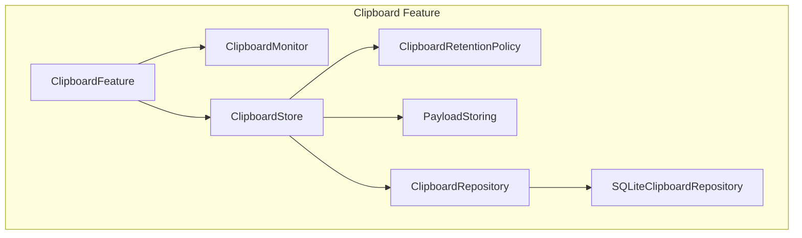
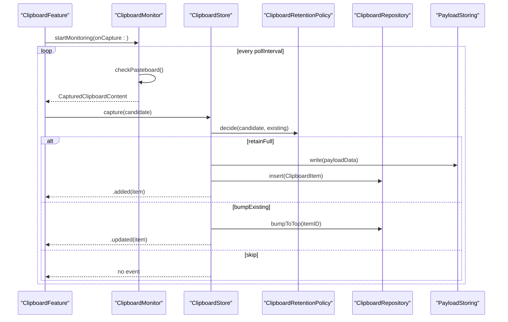
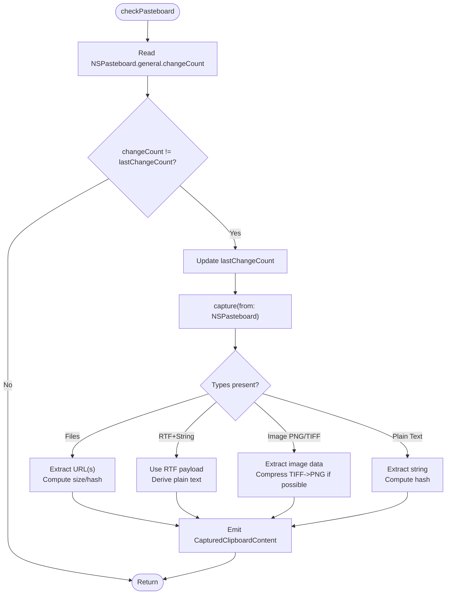
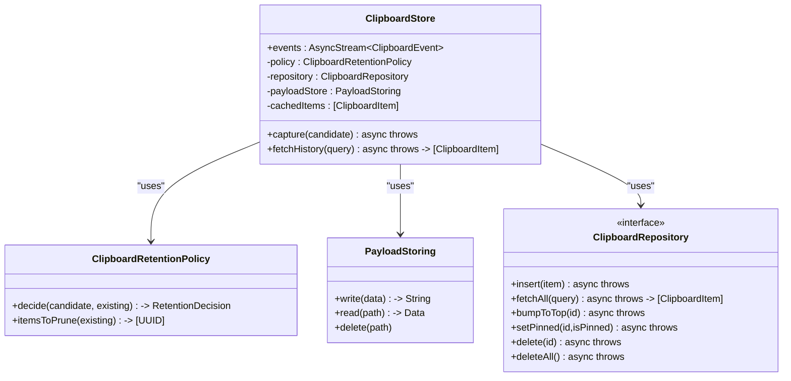
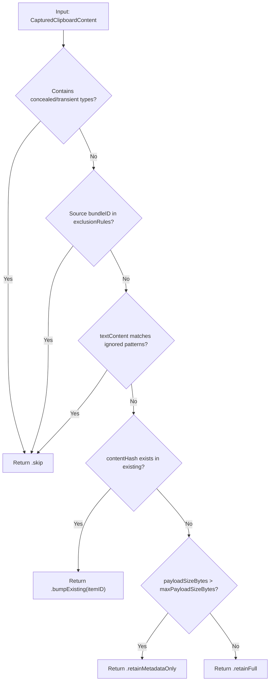
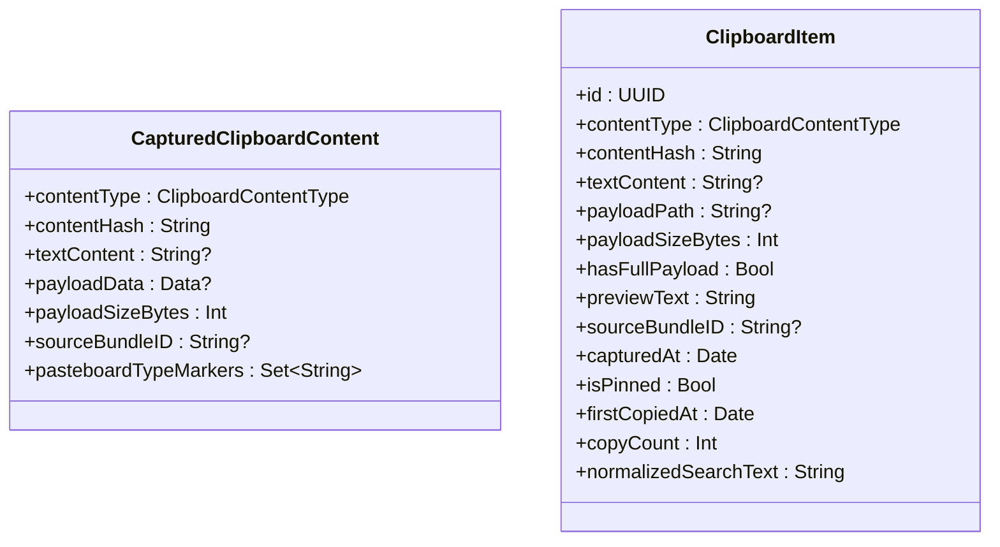
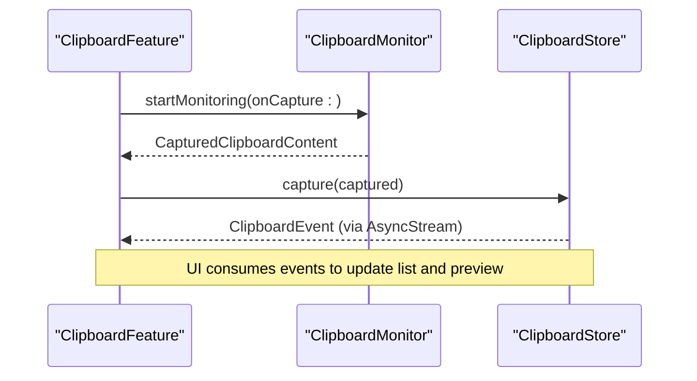
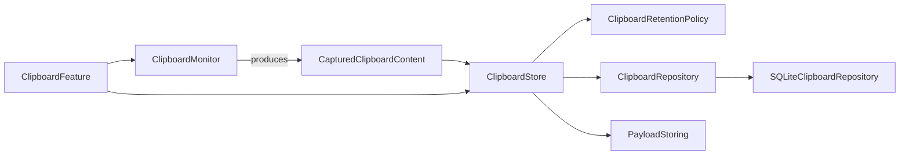

# Clipboard Monitoring

<cite>
**Referenced Files in This Document**
- [ClipboardMonitor.swift](file://macos/skey-app/Sources/Features/Clipboard/Services/ClipboardMonitor.swift)
- [ClipboardItem.swift](file://macos/skey-app/Sources/Features/Clipboard/Models/ClipboardItem.swift)
- [ClipboardEnums.swift](file://macos/skey-app/Sources/Features/Clipboard/Models/ClipboardEnums.swift)
- [ClipboardStore.swift](file://macos/skey-app/Sources/Features/Clipboard/Services/ClipboardStore.swift)
- [ClipboardRetentionPolicy.swift](file://macos/skey-app/Sources/Features/Clipboard/Services/ClipboardRetentionPolicy.swift)
- [PayloadStoring.swift](file://macos/skey-app/Sources/Features/Clipboard/Services/PayloadStoring.swift)
- [SQLiteClipboardRepository.swift](file://macos/skey-app/Sources/Features/Clipboard/Services/SQLiteClipboardRepository.swift)
- [ClipboardFeature.swift](file://macos/skey-app/Sources/Features/Clipboard/ClipboardFeature.swift)
</cite>

## Table of Contents
1. [Introduction](#introduction)
2. [Project Structure](#project-structure)
3. [Core Components](#core-components)
4. [Architecture Overview](#architecture-overview)
5. [Detailed Component Analysis](#detailed-component-analysis)
6. [Dependency Analysis](#dependency-analysis)
7. [Performance Considerations](#performance-considerations)
8. [Troubleshooting Guide](#troubleshooting-guide)
9. [Conclusion](#conclusion)

## Introduction
This document explains the clipboard monitoring system that observes system clipboard changes, detects content types (plain text, rich text, images, file references), and enforces privacy controls to filter sensitive or transient data. It covers the event-driven architecture built around polling NSPasteboard for changeCount updates, capturing payloads, applying retention policies, persisting items, and exposing a reactive stream of clipboard events to the UI.

## Project Structure
The clipboard feature is organized into models, services, and UI components:
- Models define data structures and enums for content types, selection appearance, retention decisions, and events.
- Services implement monitoring, storage, policy evaluation, payload persistence, and repository operations.
- The feature module wires monitoring to the store and exposes UI actions.

**Diagram sources**
- [ClipboardFeature.swift:15-47](file://macos/skey-app/Sources/Features/Clipboard/ClipboardFeature.swift#L15-L47)
- [ClipboardMonitor.swift:7-44](file://macos/skey-app/Sources/Features/Clipboard/Services/ClipboardMonitor.swift#L7-L44)
- [ClipboardStore.swift:5-44](file://macos/skey-app/Sources/Features/Clipboard/Services/ClipboardStore.swift#L5-L44)
- [ClipboardRetentionPolicy.swift:5-28](file://macos/skey-app/Sources/Features/Clipboard/Services/ClipboardRetentionPolicy.swift#L5-L28)
- [PayloadStoring.swift:5-24](file://macos/skey-app/Sources/Features/Clipboard/Services/PayloadStoring.swift#L5-L24)
- [SQLiteClipboardRepository.swift:6-55](file://macos/skey-app/Sources/Features/Clipboard/Services/SQLiteClipboardRepository.swift#L6-L55)

**Section sources**
- [ClipboardFeature.swift:15-47](file://macos/skey-app/Sources/Features/Clipboard/ClipboardFeature.swift#L15-L47)
- [ClipboardMonitor.swift:7-44](file://macos/skey-app/Sources/Features/Clipboard/Services/ClipboardMonitor.swift#L7-L44)
- [ClipboardStore.swift:5-44](file://macos/skey-app/Sources/Features/Clipboard/Services/ClipboardStore.swift#L5-L44)

## Core Components
- ClipboardMonitor: Polls NSPasteboard.general.changeCount on a timer and captures content when it changes.
- CapturedClipboardContent: Raw capture result with type, hash, optional text/payload, size, source app, and pasteboard type markers.
- ClipboardItem: Persisted entry with metadata, search normalization, preview, and payload reference.
- ClipboardStore: Orchestrates capture flow, applies retention policy, persists items, manages cache, and emits events.
- ClipboardRetentionPolicy: Filters out concealed/transient types, excludes apps by bundle ID, ignores patterns, deduplicates by hash, and decides full vs metadata-only retention based on payload size.
- PayloadStoring: Writes large payloads to disk and reads them back on demand.
- SQLiteClipboardRepository: Persistent storage with indexing and background queue; includes an in-memory fallback.

**Section sources**
- [ClipboardMonitor.swift:7-154](file://macos/skey-app/Sources/Features/Clipboard/Services/ClipboardMonitor.swift#L7-L154)
- [ClipboardItem.swift:5-93](file://macos/skey-app/Sources/Features/Clipboard/Models/ClipboardItem.swift#L5-L93)
- [ClipboardStore.swift:5-227](file://macos/skey-app/Sources/Features/Clipboard/Services/ClipboardStore.swift#L5-L227)
- [ClipboardRetentionPolicy.swift:5-65](file://macos/skey-app/Sources/Features/Clipboard/Services/ClipboardRetentionPolicy.swift#L5-L65)
- [PayloadStoring.swift:5-42](file://macos/skey-app/Sources/Features/Clipboard/Services/PayloadStoring.swift#L5-L42)
- [SQLiteClipboardRepository.swift:6-301](file://macos/skey-app/Sources/Features/Clipboard/Services/SQLiteClipboardRepository.swift#L6-L301)

## Architecture Overview
The system uses an event-driven pipeline:
- ClipboardMonitor polls NSPasteboard for changeCount changes at a configurable interval.
- On change, it extracts content and returns a CapturedClipboardContent.
- ClipboardStore evaluates retention policy, persists data, updates cache, and emits ClipboardEvent via AsyncStream.
- UI components consume events to update lists and previews.

**Diagram sources**
- [ClipboardFeature.swift:26-47](file://macos/skey-app/Sources/Features/Clipboard/ClipboardFeature.swift#L26-L47)
- [ClipboardMonitor.swift:21-44](file://macos/skey-app/Sources/Features/Clipboard/Services/ClipboardMonitor.swift#L21-L44)
- [ClipboardStore.swift:68-113](file://macos/skey-app/Sources/Features/Clipboard/Services/ClipboardStore.swift#L68-L113)
- [ClipboardRetentionPolicy.swift:30-53](file://macos/skey-app/Sources/Features/Clipboard/Services/ClipboardRetentionPolicy.swift#L30-L53)
- [PayloadStoring.swift:26-31](file://macos/skey-app/Sources/Features/Clipboard/Services/PayloadStoring.swift#L26-L31)
- [SQLiteClipboardRepository.swift:69-122](file://macos/skey-app/Sources/Features/Clipboard/Services/SQLiteClipboardRepository.swift#L69-L122)

## Detailed Component Analysis

### ClipboardMonitor: Notification via Polling and Content Extraction
- Uses a Timer to periodically read NSPasteboard.general.changeCount and detect changes.
- Captures content in priority order: files, rich text/plain text, standalone images (PNG/TIFF), and plain text fallback.
- Computes SHA-256 hashes for deduplication and records pasteboard type markers for privacy filtering.
- Provides copyToPasteboard to write ClipboardItem back to the system pasteboard.

**Diagram sources**
- [ClipboardMonitor.swift:37-154](file://macos/skey-app/Sources/Features/Clipboard/Services/ClipboardMonitor.swift#L37-L154)

**Section sources**
- [ClipboardMonitor.swift:7-195](file://macos/skey-app/Sources/Features/Clipboard/Services/ClipboardMonitor.swift#L7-L195)

### ClipboardStore: Event Stream and Retention Orchestration
- Exposes an AsyncStream of ClipboardEvent for live updates.
- Applies ClipboardRetentionPolicy to decide whether to skip, bump, retain metadata only, or retain full payload.
- Persists items via ClipboardRepository and writes payloads via PayloadStoring.
- Maintains an in-memory cache for fast UI rendering and triggers pruning based on history limits.

**Diagram sources**
- [ClipboardStore.swift:5-227](file://macos/skey-app/Sources/Features/Clipboard/Services/ClipboardStore.swift#L5-L227)
- [ClipboardRetentionPolicy.swift:5-65](file://macos/skey-app/Sources/Features/Clipboard/Services/ClipboardRetentionPolicy.swift#L5-L65)
- [PayloadStoring.swift:5-42](file://macos/skey-app/Sources/Features/Clipboard/Services/PayloadStoring.swift#L5-L42)
- [SQLiteClipboardRepository.swift:6-301](file://macos/skey-app/Sources/Features/Clipboard/Services/SQLiteClipboardRepository.swift#L6-L301)

**Section sources**
- [ClipboardStore.swift:5-227](file://macos/skey-app/Sources/Features/Clipboard/Services/ClipboardStore.swift#L5-L227)

### ClipboardRetentionPolicy: Privacy Controls and Deduplication
- Skips items containing concealed or transient pasteboard types (e.g., org.nspasteboard.ConcealedType).
- Skips items from excluded applications by bundle ID.
- Ignores text matching configured regular expressions.
- Deduplicates by contentHash; duplicates bump existing entries instead of creating new ones.
- Enforces max payload size; oversized items are retained as metadata only.

**Diagram sources**
- [ClipboardRetentionPolicy.swift:30-53](file://macos/skey-app/Sources/Features/Clipboard/Services/ClipboardRetentionPolicy.swift#L30-L53)

**Section sources**
- [ClipboardRetentionPolicy.swift:5-65](file://macos/skey-app/Sources/Features/Clipboard/Services/ClipboardRetentionPolicy.swift#L5-L65)

### ClipboardItem and CapturedClipboardContent: Data Model
- CapturedClipboardContent holds raw capture results before retention decision.
- ClipboardItem stores persisted metadata, normalized search text, preview, timestamps, pin state, and payload path.
- Vietnamese fold normalization supports diacritic-insensitive search.

**Diagram sources**
- [ClipboardItem.swift:5-93](file://macos/skey-app/Sources/Features/Clipboard/Models/ClipboardItem.swift#L5-L93)

**Section sources**
- [ClipboardItem.swift:5-93](file://macos/skey-app/Sources/Features/Clipboard/Models/ClipboardItem.swift#L5-L93)

### ClipboardEnums: Content Types and Events
- ClipboardContentType enumerates supported types: plainText, richText, image, fileReference.
- RetentionDecision defines outcomes: skip, bumpExisting, retainFull, retainMetadataOnly.
- ClipboardEvent describes lifecycle events: added, removed, clearedAll, updated.
- ExclusionRule allows excluding specific bundle IDs.

**Section sources**
- [ClipboardEnums.swift:5-93](file://macos/skey-app/Sources/Features/Clipboard/Models/ClipboardEnums.swift#L5-L93)

### ClipboardFeature: Wiring Monitor to Store and UI
- Starts ClipboardMonitor and forwards captured content to ClipboardStore.
- Manages popup controller and handles paste actions, including multi-item paste stacking.
- Triggers system paste via synthetic key events after writing to pasteboard.

**Diagram sources**
- [ClipboardFeature.swift:26-47](file://macos/skey-app/Sources/Features/Clipboard/ClipboardFeature.swift#L26-L47)
- [ClipboardStore.swift:11-13](file://macos/skey-app/Sources/Features/Clipboard/Services/ClipboardStore.swift#L11-L13)

**Section sources**
- [ClipboardFeature.swift:15-146](file://macos/skey-app/Sources/Features/Clipboard/ClipboardFeature.swift#L15-L146)

## Dependency Analysis
- ClipboardMonitor depends on AppKit NSPasteboard and Foundation CryptoKit for hashing.
- ClipboardStore composes ClipboardRetentionPolicy, ClipboardRepository, and PayloadStoring.
- SQLiteClipboardRepository implements ClipboardRepository using SQLite3 with WAL mode and indexes.
- ClipboardFeature orchestrates monitor and store and interacts with UI controllers.

**Diagram sources**
- [ClipboardMonitor.swift:7-154](file://macos/skey-app/Sources/Features/Clipboard/Services/ClipboardMonitor.swift#L7-L154)
- [ClipboardStore.swift:5-227](file://macos/skey-app/Sources/Features/Clipboard/Services/ClipboardStore.swift#L5-L227)
- [ClipboardRetentionPolicy.swift:5-65](file://macos/skey-app/Sources/Features/Clipboard/Services/ClipboardRetentionPolicy.swift#L5-L65)
- [PayloadStoring.swift:5-42](file://macos/skey-app/Sources/Features/Clipboard/Services/PayloadStoring.swift#L5-L42)
- [SQLiteClipboardRepository.swift:6-301](file://macos/skey-app/Sources/Features/Clipboard/Services/SQLiteClipboardRepository.swift#L6-L301)
- [ClipboardFeature.swift:15-47](file://macos/skey-app/Sources/Features/Clipboard/ClipboardFeature.swift#L15-L47)

**Section sources**
- [ClipboardMonitor.swift:7-154](file://macos/skey-app/Sources/Features/Clipboard/Services/ClipboardMonitor.swift#L7-L154)
- [ClipboardStore.swift:5-227](file://macos/skey-app/Sources/Features/Clipboard/Services/ClipboardStore.swift#L5-L227)
- [SQLiteClipboardRepository.swift:6-301](file://macos/skey-app/Sources/Features/Clipboard/Services/SQLiteClipboardRepository.swift#L6-L301)
- [ClipboardFeature.swift:15-47](file://macos/skey-app/Sources/Features/Clipboard/ClipboardFeature.swift#L15-L47)

## Performance Considerations
- Polling interval: ClipboardMonitor uses a configurable pollInterval (default 0.5s) to balance responsiveness and CPU usage. Adjust based on workload.
- Change detection: Using NSPasteboard.general.changeCount avoids unnecessary parsing when nothing changed.
- Content extraction priority: Checks files and rich text first to avoid redundant image processing when text is available.
- Image handling: TIFF data is optionally compressed to PNG to reduce memory footprint.
- Payload storage: Large payloads are written atomically to disk via PayloadStoring to prevent blocking the main thread and to manage memory.
- Database performance: SQLiteClipboardRepository enables WAL mode and NORMAL synchronous for better concurrency and crash safety; indexes on contentHash and capturedAt improve query performance.
- Cache: ClipboardStore maintains an in-memory cache to minimize DB reads during frequent UI interactions.
- Pruning: ClipboardRetentionPolicy prunes unpinned items beyond historyLimit to control growth.

[No sources needed since this section provides general guidance]

## Troubleshooting Guide
- No clipboard events received:
  - Ensure ClipboardMonitor.startMonitoring has been called and the timer is scheduled on the RunLoop.
  - Verify NSPasteboard.general.changeCount increments when clipboard changes.
- Sensitive or transient content not captured:
  - Check ClipboardRetentionPolicy concealed markers and exclusion rules; items with concealed/transient types or from excluded bundles are skipped.
- Oversized payloads not stored:
  - Items exceeding maxPayloadSizeBytes are retained as metadata only; verify payload size and policy configuration.
- Duplicate entries:
  - Deduplication is based on contentHash; identical content will bump existing entries rather than create new ones.
- UI not updating:
  - Confirm ClipboardStore.events stream is being consumed and handle all ClipboardEvent cases (.added, .removed, .clearedAll, .updated).
- Pasteboard write failures:
  - When copying back to pasteboard, ensure appropriate data types are set per content type; verify payload availability for rich text and images.

**Section sources**
- [ClipboardMonitor.swift:21-44](file://macos/skey-app/Sources/Features/Clipboard/Services/ClipboardMonitor.swift#L21-L44)
- [ClipboardRetentionPolicy.swift:30-53](file://macos/skey-app/Sources/Features/Clipboard/Services/ClipboardRetentionPolicy.swift#L30-L53)
- [ClipboardStore.swift:68-113](file://macos/skey-app/Sources/Features/Clipboard/Services/ClipboardStore.swift#L68-L113)
- [ClipboardMonitor.swift:156-189](file://macos/skey-app/Sources/Features/Clipboard/Services/ClipboardMonitor.swift#L156-L189)

## Conclusion
The clipboard monitoring system combines reliable polling of NSPasteboard with robust content detection, privacy-aware retention policies, and efficient storage. It exposes a reactive event stream for UI updates and supports high-frequency clipboard changes through careful caching, background processing, and database optimizations. By tuning polling intervals, payload size limits, and exclusion rules, you can balance responsiveness, privacy, and resource usage to fit your application’s needs.