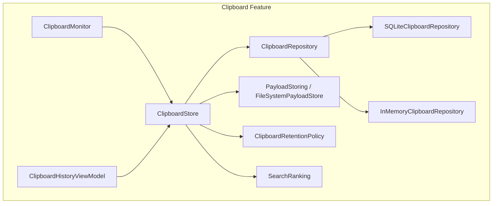
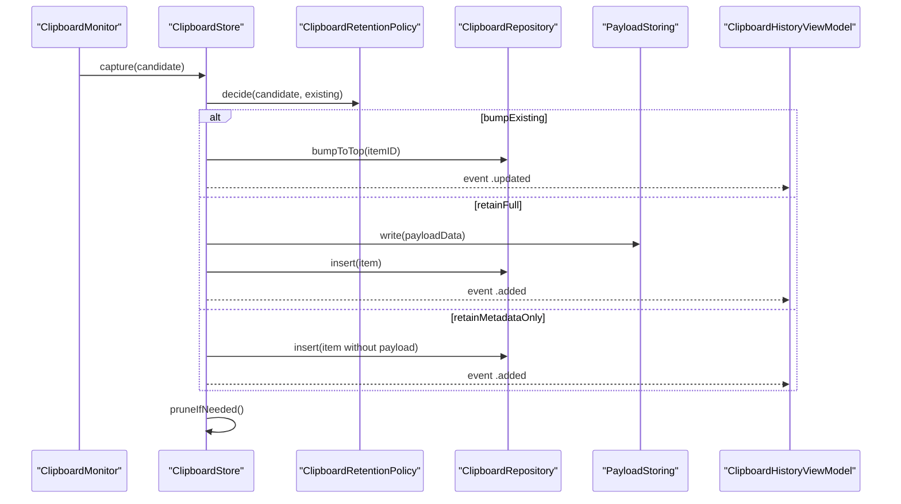
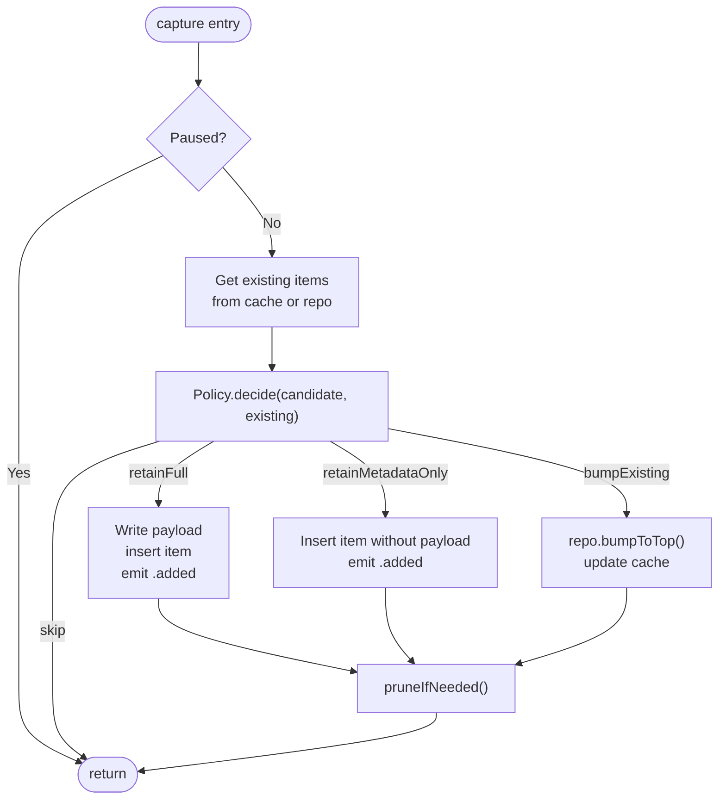
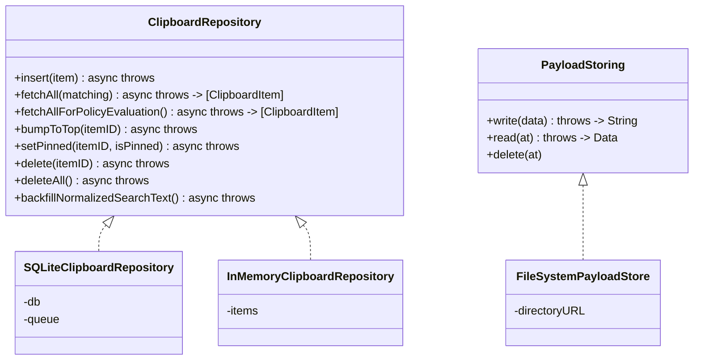
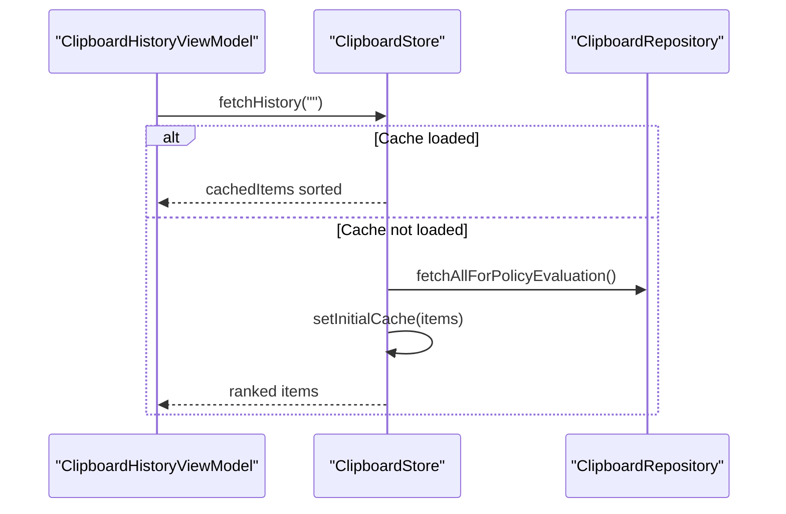
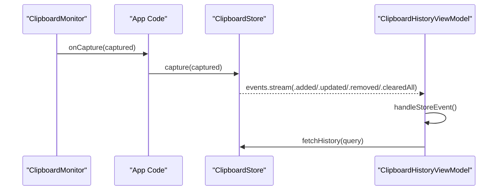
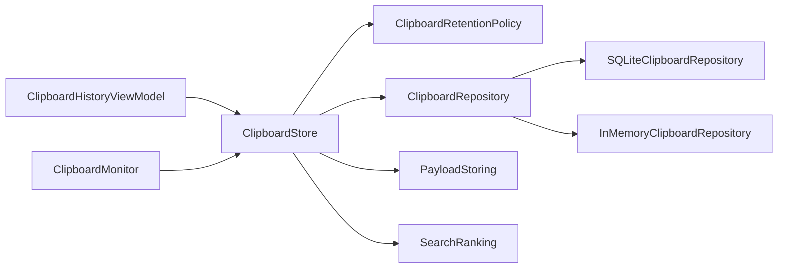

# Clipboard Store Coordination

<cite>
**Referenced Files in This Document**
- [ClipboardStore.swift](file://macos/skey-app/Sources/Features/Clipboard/Services/ClipboardStore.swift)
- [ClipboardRepository.swift](file://macos/skey-app/Sources/Features/Clipboard/Services/ClipboardRepository.swift)
- [SQLiteClipboardRepository.swift](file://macos/skey-app/Sources/Features/Clipboard/Services/SQLiteClipboardRepository.swift)
- [PayloadStoring.swift](file://macos/skey-app/Sources/Features/Clipboard/Services/PayloadStoring.swift)
- [ClipboardRetentionPolicy.swift](file://macos/skey-app/Sources/Features/Clipboard/Services/ClipboardRetentionPolicy.swift)
- [SearchRanking.swift](file://macos/skey-app/Sources/Features/Clipboard/Services/SearchRanking.swift)
- [ClipboardMonitor.swift](file://macos/skey-app/Sources/Features/Clipboard/Services/ClipboardMonitor.swift)
- [ClipboardItem.swift](file://macos/skey-app/Sources/Features/Clipboard/Models/ClipboardItem.swift)
- [ClipboardEnums.swift](file://macos/skey-app/Sources/Features/Clipboard/Models/ClipboardEnums.swift)
- [ClipboardHistoryViewModel.swift](file://macos/skey-app/Sources/Features/Clipboard/UI/ViewModels/ClipboardHistoryViewModel.swift)
</cite>

## Table of Contents
1. [Introduction](#introduction)
2. [Project Structure](#project-structure)
3. [Core Components](#core-components)
4. [Architecture Overview](#architecture-overview)
5. [Detailed Component Analysis](#detailed-component-analysis)
6. [Dependency Analysis](#dependency-analysis)
7. [Performance Considerations](#performance-considerations)
8. [Troubleshooting Guide](#troubleshooting-guide)
9. [Conclusion](#conclusion)
10. [Appendices](#appendices)

## Introduction
This document explains the ClipboardStore coordination layer that manages clipboard data persistence and retrieval across memory and disk backends. It details how ClipboardStore orchestrates storage backends, applies caching strategies, and exposes a unified interface for clipboard operations. It also covers integration with monitors and UI layers, data consistency patterns, batch operations, synchronization, cache invalidation, error handling, retry mechanisms, and monitoring capabilities.

## Project Structure
The clipboard feature is organized into services, models, and UI components:
- Services: ClipboardStore (coordination), ClipboardRepository (abstraction), SQLiteClipboardRepository (disk backend), InMemoryClipboardRepository (memory fallback), PayloadStoring (file payload I/O), ClipboardRetentionPolicy (rules), SearchRanking (ranking), ClipboardMonitor (pasteboard polling).
- Models: ClipboardItem, CapturedClipboardContent, ClipboardContentType, RetentionDecision, ClipboardEvent, ExclusionRule.
- UI: ClipboardHistoryViewModel integrates with ClipboardStore to drive the UI state and user actions.

**Diagram sources**
- [ClipboardStore.swift:5-44](file://macos/skey-app/Sources/Features/Clipboard/Services/ClipboardStore.swift#L5-L44)
- [ClipboardRepository.swift:5-14](file://macos/skey-app/Sources/Features/Clipboard/Services/ClipboardRepository.swift#L5-L14)
- [SQLiteClipboardRepository.swift:6-55](file://macos/skey-app/Sources/Features/Clipboard/Services/SQLiteClipboardRepository.swift#L6-L55)
- [PayloadStoring.swift:5-41](file://macos/skey-app/Sources/Features/Clipboard/Services/PayloadStoring.swift#L5-L41)
- [ClipboardRetentionPolicy.swift:6-63](file://macos/skey-app/Sources/Features/Clipboard/Services/ClipboardRetentionPolicy.swift#L6-L63)
- [SearchRanking.swift:6-64](file://macos/skey-app/Sources/Features/Clipboard/Services/SearchRanking.swift#L6-L64)
- [ClipboardMonitor.swift:8-44](file://macos/skey-app/Sources/Features/Clipboard/Services/ClipboardMonitor.swift#L8-L44)
- [ClipboardHistoryViewModel.swift:8-77](file://macos/skey-app/Sources/Features/Clipboard/UI/ViewModels/ClipboardHistoryViewModel.swift#L8-L77)

**Section sources**
- [ClipboardStore.swift:5-44](file://macos/skey-app/Sources/Features/Clipboard/Services/ClipboardStore.swift#L5-L44)
- [ClipboardRepository.swift:5-14](file://macos/skey-app/Sources/Features/Clipboard/Services/ClipboardRepository.swift#L5-L14)
- [SQLiteClipboardRepository.swift:6-55](file://macos/skey-app/Sources/Features/Clipboard/Services/SQLiteClipboardRepository.swift#L6-L55)
- [PayloadStoring.swift:5-41](file://macos/skey-app/Sources/Features/Clipboard/Services/PayloadStoring.swift#L5-L41)
- [ClipboardRetentionPolicy.swift:6-63](file://macos/skey-app/Sources/Features/Clipboard/Services/ClipboardRetentionPolicy.swift#L6-L63)
- [SearchRanking.swift:6-64](file://macos/skey-app/Sources/Features/Clipboard/Services/SearchRanking.swift#L6-L64)
- [ClipboardMonitor.swift:8-44](file://macos/skey-app/Sources/Features/Clipboard/Services/ClipboardMonitor.swift#L8-L44)
- [ClipboardHistoryViewModel.swift:8-77](file://macos/skey-app/Sources/Features/Clipboard/UI/ViewModels/ClipboardHistoryViewModel.swift#L8-L77)

## Core Components
- ClipboardStore: An actor that coordinates capture decisions, caching, persistence, and events. It maintains an in-memory cache of items and emits live events for UI updates.
- ClipboardRepository: A Sendable protocol abstracting storage operations. Implemented by SQLiteClipboardRepository (persistent) and InMemoryClipboardRepository (in-memory fallback).
- PayloadStoring: Abstraction for payload file I/O; FileSystemPayloadStore writes/reads payloads under Application Support.
- ClipboardRetentionPolicy: Pure rules to decide whether to skip, bump existing, retain full payload, or retain metadata only; also prunes excess unpinned items.
- SearchRanking: Ranking algorithm for search results using exact match, normalized substring, and subsequence scoring.
- ClipboardMonitor: Polls NSPasteboard and emits captured content as candidates to be processed by ClipboardStore.
- ClipboardHistoryViewModel: Main UI view model that subscribes to ClipboardStore events and drives display state.

**Section sources**
- [ClipboardStore.swift:5-227](file://macos/skey-app/Sources/Features/Clipboard/Services/ClipboardStore.swift#L5-L227)
- [ClipboardRepository.swift:5-14](file://macos/skey-app/Sources/Features/Clipboard/Services/ClipboardRepository.swift#L5-L14)
- [SQLiteClipboardRepository.swift:6-301](file://macos/skey-app/Sources/Features/Clipboard/Services/SQLiteClipboardRepository.swift#L6-L301)
- [PayloadStoring.swift:5-41](file://macos/skey-app/Sources/Features/Clipboard/Services/PayloadStoring.swift#L5-L41)
- [ClipboardRetentionPolicy.swift:6-63](file://macos/skey-app/Sources/Features/Clipboard/Services/ClipboardRetentionPolicy.swift#L6-L63)
- [SearchRanking.swift:6-64](file://macos/skey-app/Sources/Features/Clipboard/Services/SearchRanking.swift#L6-L64)
- [ClipboardMonitor.swift:8-195](file://macos/skey-app/Sources/Features/Clipboard/Services/ClipboardMonitor.swift#L8-L195)
- [ClipboardHistoryViewModel.swift:8-238](file://macos/skey-app/Sources/Features/Clipboard/UI/ViewModels/ClipboardHistoryViewModel.swift#L8-L238)

## Architecture Overview
ClipboardStore acts as the central coordinator:
- Capture flow: ClipboardMonitor detects pasteboard changes and forwards CapturedClipboardContent to ClipboardStore. ClipboardStore consults ClipboardRetentionPolicy to decide retention behavior, persists via ClipboardRepository, and optionally stores payload via PayloadStoring. It updates its in-memory cache and emits events.
- Read flow: UI requests history via ClipboardStore.fetchHistory. If no query and cache is loaded, it returns cached items sorted by configured order; otherwise it queries repository, ranks results, and warms cache.
- Persistence: SQLiteClipboardRepository uses WAL mode and indexes for performance. InMemoryClipboardRepository provides a fast fallback when SQLite cannot be initialized.
- Payload management: Large payloads are stored on disk; metadata-only entries keep lightweight records.

**Diagram sources**
- [ClipboardStore.swift:68-113](file://macos/skey-app/Sources/Features/Clipboard/Services/ClipboardStore.swift#L68-L113)
- [ClipboardRetentionPolicy.swift:30-53](file://macos/skey-app/Sources/Features/Clipboard/Services/ClipboardRetentionPolicy.swift#L30-L53)
- [SQLiteClipboardRepository.swift:69-122](file://macos/skey-app/Sources/Features/Clipboard/Services/SQLiteClipboardRepository.swift#L69-L122)
- [PayloadStoring.swift:26-40](file://macos/skey-app/Sources/Features/Clipboard/Services/PayloadStoring.swift#L26-L40)
- [ClipboardHistoryViewModel.swift:66-71](file://macos/skey-app/Sources/Features/Clipboard/UI/ViewModels/ClipboardHistoryViewModel.swift#L66-L71)

## Detailed Component Analysis

### ClipboardStore: Coordination Layer
Responsibilities:
- Orchestrates capture decisions, caching, persistence, pruning, and event emission.
- Maintains an in-memory cache of ClipboardItem ordered by recency and supports sort orders from settings.
- Provides methods for capture, fetch, pin toggle, delete, clearAll, clearUnpinned, and payload loading.

Key behaviors:
- Initialization selects SQLiteClipboardRepository if available, otherwise falls back to InMemoryClipboardRepository. It preloads normalized search text and caches initial items.
- capture evaluates policy, updates cache, persists item/payload, and triggers pruning.
- fetchHistory returns cached items when possible; otherwise queries repository and ranks results.
- Pruning removes oldest unpinned items beyond history limit and deletes associated payloads.

**Diagram sources**
- [ClipboardStore.swift:68-113](file://macos/skey-app/Sources/Features/Clipboard/Services/ClipboardStore.swift#L68-L113)
- [ClipboardStore.swift:195-209](file://macos/skey-app/Sources/Features/Clipboard/Services/ClipboardStore.swift#L195-L209)

**Section sources**
- [ClipboardStore.swift:5-44](file://macos/skey-app/Sources/Features/Clipboard/Services/ClipboardStore.swift#L5-L44)
- [ClipboardStore.swift:68-113](file://macos/skey-app/Sources/Features/Clipboard/Services/ClipboardStore.swift#L68-L113)
- [ClipboardStore.swift:115-145](file://macos/skey-app/Sources/Features/Clipboard/Services/ClipboardStore.swift#L115-L145)
- [ClipboardStore.swift:147-193](file://macos/skey-app/Sources/Features/Clipboard/Services/ClipboardStore.swift#L147-L193)
- [ClipboardStore.swift:195-227](file://macos/skey-app/Sources/Features/Clipboard/Services/ClipboardStore.swift#L195-L227)

### Storage Backends: Repository and Payload
- ClipboardRepository defines the contract for CRUD and search operations.
- SQLiteClipboardRepository implements persistent storage with WAL mode, indexes, and normalized search text backfill.
- InMemoryClipboardRepository provides an in-process fallback for quick testing or when SQLite fails.
- PayloadStoring abstracts file-based payload storage; FileSystemPayloadStore writes atomic files under Application Support.

**Diagram sources**
- [ClipboardRepository.swift:5-14](file://macos/skey-app/Sources/Features/Clipboard/Services/ClipboardRepository.swift#L5-L14)
- [SQLiteClipboardRepository.swift:6-55](file://macos/skey-app/Sources/Features/Clipboard/Services/SQLiteClipboardRepository.swift#L6-L55)
- [ClipboardStore.swift:231-274](file://macos/skey-app/Sources/Features/Clipboard/Services/ClipboardStore.swift#L231-L274)
- [PayloadStoring.swift:5-41](file://macos/skey-app/Sources/Features/Clipboard/Services/PayloadStoring.swift#L5-L41)

**Section sources**
- [ClipboardRepository.swift:5-14](file://macos/skey-app/Sources/Features/Clipboard/Services/ClipboardRepository.swift#L5-L14)
- [SQLiteClipboardRepository.swift:6-301](file://macos/skey-app/Sources/Features/Clipboard/Services/SQLiteClipboardRepository.swift#L6-L301)
- [ClipboardStore.swift:231-274](file://macos/skey-app/Sources/Features/Clipboard/Services/ClipboardStore.swift#L231-L274)
- [PayloadStoring.swift:5-41](file://macos/skey-app/Sources/Features/Clipboard/Services/PayloadStoring.swift#L5-L41)

### Caching Strategy and Consistency
- ClipboardStore maintains an in-memory cache of ClipboardItem ordered by recency.
- On initialization, it loads all items for policy evaluation and sets the initial cache.
- On capture, it updates the cache immediately after persistence to ensure UI responsiveness.
- On fetchHistory, empty queries return cached items when available; otherwise it queries the repository and warms the cache.
- Pinned items are always surfaced at the top regardless of sort order.

**Diagram sources**
- [ClipboardStore.swift:39-49](file://macos/skey-app/Sources/Features/Clipboard/Services/ClipboardStore.swift#L39-L49)
- [ClipboardStore.swift:115-134](file://macos/skey-app/Sources/Features/Clipboard/Services/ClipboardStore.swift#L115-L134)

**Section sources**
- [ClipboardStore.swift:39-49](file://macos/skey-app/Sources/Features/Clipboard/Services/ClipboardStore.swift#L39-L49)
- [ClipboardStore.swift:115-134](file://macos/skey-app/Sources/Features/Clipboard/Services/ClipboardStore.swift#L115-L134)

### Integration with Monitor and UI
- ClipboardMonitor polls NSPasteboard and emits CapturedClipboardContent via a callback. The application can forward these to ClipboardStore.capture.
- ClipboardHistoryViewModel subscribes to ClipboardStore.events stream to update UI state reactively. It also triggers searches and preloads image payloads for performance.

**Diagram sources**
- [ClipboardMonitor.swift:21-44](file://macos/skey-app/Sources/Features/Clipboard/Services/ClipboardMonitor.swift#L21-L44)
- [ClipboardStore.swift:11-12](file://macos/skey-app/Sources/Features/Clipboard/Services/ClipboardStore.swift#L11-L12)
- [ClipboardHistoryViewModel.swift:66-71](file://macos/skey-app/Sources/Features/Clipboard/UI/ViewModels/ClipboardHistoryViewModel.swift#L66-L71)
- [ClipboardHistoryViewModel.swift:217-236](file://macos/skey-app/Sources/Features/Clipboard/UI/ViewModels/ClipboardHistoryViewModel.swift#L217-L236)

**Section sources**
- [ClipboardMonitor.swift:21-44](file://macos/skey-app/Sources/Features/Clipboard/Services/ClipboardMonitor.swift#L21-L44)
- [ClipboardStore.swift:11-12](file://macos/skey-app/Sources/Features/Clipboard/Services/ClipboardStore.swift#L11-L12)
- [ClipboardHistoryViewModel.swift:66-71](file://macos/skey-app/Sources/Features/Clipboard/UI/ViewModels/ClipboardHistoryViewModel.swift#L66-L71)
- [ClipboardHistoryViewModel.swift:217-236](file://macos/skey-app/Sources/Features/Clipboard/UI/ViewModels/ClipboardHistoryViewModel.swift#L217-L236)

### Data Models and Events
- ClipboardItem encapsulates content type, hash, optional text, payload path, size, preview, source bundle ID, timestamps, pinning, and normalized search text.
- CapturedClipboardContent represents raw pasteboard captures before retention decision.
- RetentionDecision guides store behavior: skip, bump existing, retain full, or retain metadata only.
- ClipboardEvent enumerates lifecycle changes emitted by ClipboardStore for reactive UI updates.

**Section sources**
- [ClipboardItem.swift:5-94](file://macos/skey-app/Sources/Features/Clipboard/Models/ClipboardItem.swift#L5-L94)
- [ClipboardEnums.swift:67-83](file://macos/skey-app/Sources/Features/Clipboard/Models/ClipboardEnums.swift#L67-L83)

## Dependency Analysis
- ClipboardStore depends on ClipboardRetentionPolicy for decisions, ClipboardRepository for persistence, PayloadStoring for payload I/O, and SearchRanking for ranking during search.
- SQLiteClipboardRepository depends on SQLite3 and performs background work on a dedicated queue.
- ClipboardHistoryViewModel depends on ClipboardStore for data and events, and on ClipboardMonitor indirectly through app wiring.

**Diagram sources**
- [ClipboardStore.swift:5-44](file://macos/skey-app/Sources/Features/Clipboard/Services/ClipboardStore.swift#L5-L44)
- [ClipboardRepository.swift:5-14](file://macos/skey-app/Sources/Features/Clipboard/Services/ClipboardRepository.swift#L5-L14)
- [SQLiteClipboardRepository.swift:6-55](file://macos/skey-app/Sources/Features/Clipboard/Services/SQLiteClipboardRepository.swift#L6-L55)
- [PayloadStoring.swift:5-41](file://macos/skey-app/Sources/Features/Clipboard/Services/PayloadStoring.swift#L5-L41)
- [SearchRanking.swift:6-64](file://macos/skey-app/Sources/Features/Clipboard/Services/SearchRanking.swift#L6-L64)
- [ClipboardHistoryViewModel.swift:8-77](file://macos/skey-app/Sources/Features/Clipboard/UI/ViewModels/ClipboardHistoryViewModel.swift#L8-L77)
- [ClipboardMonitor.swift:8-44](file://macos/skey-app/Sources/Features/Clipboard/Services/ClipboardMonitor.swift#L8-L44)

**Section sources**
- [ClipboardStore.swift:5-44](file://macos/skey-app/Sources/Features/Clipboard/Services/ClipboardStore.swift#L5-L44)
- [ClipboardRepository.swift:5-14](file://macos/skey-app/Sources/Features/Clipboard/Services/ClipboardRepository.swift#L5-L14)
- [SQLiteClipboardRepository.swift:6-55](file://macos/skey-app/Sources/Features/Clipboard/Services/SQLiteClipboardRepository.swift#L6-L55)
- [PayloadStoring.swift:5-41](file://macos/skey-app/Sources/Features/Clipboard/Services/PayloadStoring.swift#L5-L41)
- [SearchRanking.swift:6-64](file://macos/skey-app/Sources/Features/Clipboard/Services/SearchRanking.swift#L6-L64)
- [ClipboardHistoryViewModel.swift:8-77](file://macos/skey-app/Sources/Features/Clipboard/UI/ViewModels/ClipboardHistoryViewModel.swift#L8-L77)
- [ClipboardMonitor.swift:8-44](file://macos/skey-app/Sources/Features/Clipboard/Services/ClipboardMonitor.swift#L8-L44)

## Performance Considerations
- SQLite WAL mode and NORMAL synchronous improve concurrency and crash safety.
- Indexes on contentHash and capturedAt optimize lookups and ordering.
- In-memory cache reduces repeated reads for recent history and empty queries.
- Payloads are stored on disk only when retained fully; large payloads trigger metadata-only retention to conserve space.
- Background tasks in SQLite repository avoid blocking main thread.
- UI preloads images for top items to reduce perceived latency.

[No sources needed since this section provides general guidance]

## Troubleshooting Guide
Common issues and mitigations:
- SQLite initialization failure: ClipboardStore falls back to InMemoryClipboardRepository automatically. Inspect errors thrown during repository creation and verify Application Support directory permissions.
- Payload read/write failures: FileSystemPayloadStore may fail due to missing directories or disk errors. Ensure intermediate directories exist and handle IO errors gracefully in callers.
- Stale cache: If cache becomes inconsistent, reinitialize ClipboardStore or force reload via fetchHistory to refresh cache from repository.
- Search anomalies: Ensure normalizedSearchText is backfilled; SQLiteClipboardRepository.backfillNormalizedSearchText runs at startup.
- Event storms: ClipboardStore emits many events during bulk operations; UI should debounce heavy rendering.

Error handling specifics:
- Repository operations wrap SQLite calls in continuations and resume with errors on failures.
- ClipboardStore.capture ignores pause state and skips processing when paused.
- Pruning deletes payloads and items atomically per operation and emits removal events.

Retry mechanisms:
- No explicit retry loops are implemented in the coordination layer. Callers can implement retries around ClipboardStore methods where appropriate (e.g., network-backed policies or external services).

Monitoring capabilities:
- ClipboardStore.events stream provides real-time visibility into added, removed, updated, and cleared-all events for logging and analytics.

**Section sources**
- [SQLiteClipboardRepository.swift:10-31](file://macos/skey-app/Sources/Features/Clipboard/Services/SQLiteClipboardRepository.swift#L10-L31)
- [ClipboardStore.swift:19-44](file://macos/skey-app/Sources/Features/Clipboard/Services/ClipboardStore.swift#L19-L44)
- [ClipboardStore.swift:68-113](file://macos/skey-app/Sources/Features/Clipboard/Services/ClipboardStore.swift#L68-L113)
- [ClipboardStore.swift:195-209](file://macos/skey-app/Sources/Features/Clipboard/Services/ClipboardStore.swift#L195-L209)
- [ClipboardHistoryViewModel.swift:66-71](file://macos/skey-app/Sources/Features/Clipboard/UI/ViewModels/ClipboardHistoryViewModel.swift#L66-L71)

## Conclusion
ClipboardStore provides a robust coordination layer for clipboard persistence and retrieval, combining policy-driven retention, efficient caching, and reliable storage backends. It integrates seamlessly with ClipboardMonitor for capture and ClipboardHistoryViewModel for UI updates, while offering clear extension points for custom repositories and payload stores. Its design emphasizes performance, consistency, and observability through events.

[No sources needed since this section summarizes without analyzing specific files]

## Appendices

### Typical Usage Scenarios

- Batch operations:
  - Clear all: Calls clearAll to remove all items and payloads, then emits a cleared-all event.
  - Clear unpinned: Iterates unpinned items, deletes payloads and records, and emits removal events.

- Data synchronization:
  - On startup, ClipboardStore backfills normalized search text and initializes cache from repository to ensure consistent state.

- Cache invalidation:
  - After mutations (capture, delete, clear), ClipboardStore updates its in-memory cache and emits events so UI remains in sync.

- Monitoring and logging:
  - Subscribe to ClipboardStore.events to log activity, track retention decisions, and measure performance.

**Section sources**
- [ClipboardStore.swift:175-193](file://macos/skey-app/Sources/Features/Clipboard/Services/ClipboardStore.swift#L175-L193)
- [ClipboardStore.swift:39-49](file://macos/skey-app/Sources/Features/Clipboard/Services/ClipboardStore.swift#L39-L49)
- [ClipboardStore.swift:11-12](file://macos/skey-app/Sources/Features/Clipboard/Services/ClipboardStore.swift#L11-L12)