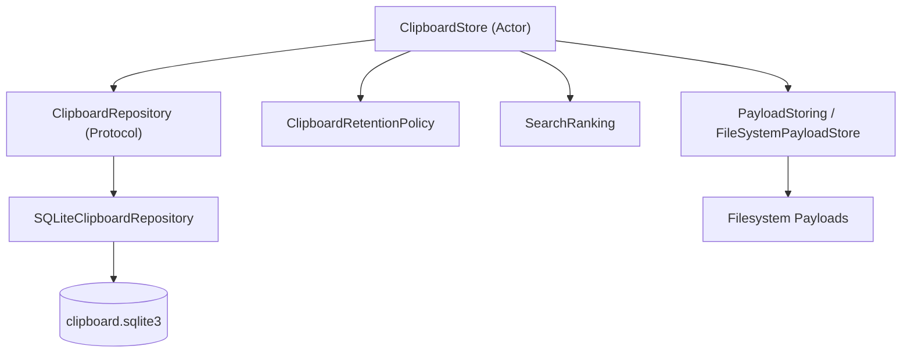
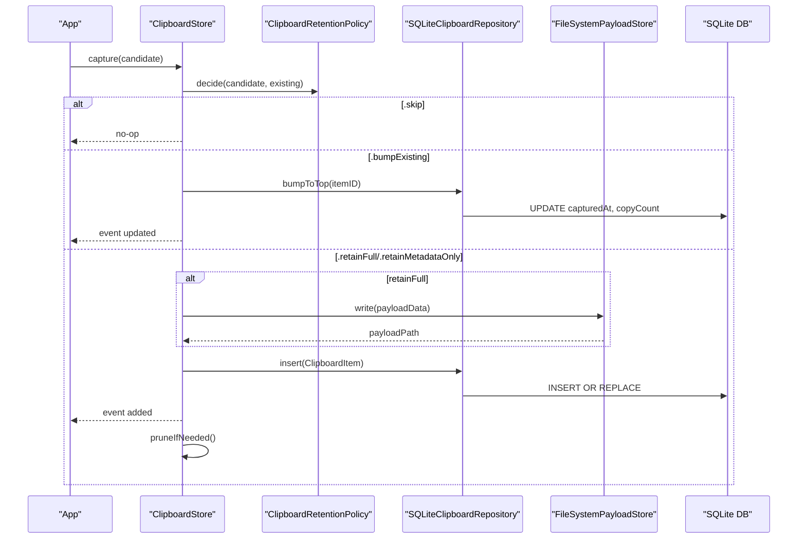
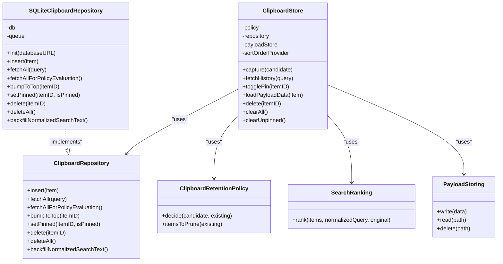

# Data Storage & Repository

<cite>
**Referenced Files in This Document**
- [ClipboardRepository.swift](file://macos/skey-app/Sources/Features/Clipboard/Services/ClipboardRepository.swift)
- [SQLiteClipboardRepository.swift](file://macos/skey-app/Sources/Features/Clipboard/Services/SQLiteClipboardRepository.swift)
- [ClipboardStore.swift](file://macos/skey-app/Sources/Features/Clipboard/Services/ClipboardStore.swift)
- [ClipboardRetentionPolicy.swift](file://macos/skey-app/Sources/Features/Clipboard/Services/ClipboardRetentionPolicy.swift)
- [SearchRanking.swift](file://macos/skey-app/Sources/Features/Clipboard/Services/SearchRanking.swift)
- [ClipboardItem.swift](file://macos/skey-app/Sources/Features/Clipboard/Models/ClipboardItem.swift)
- [ClipboardEnums.swift](file://macos/skey-app/Sources/Features/Clipboard/Models/ClipboardEnums.swift)
- [PayloadStoring.swift](file://macos/skey-app/Sources/Features/Clipboard/Services/PayloadStoring.swift)
</cite>

## Table of Contents
1. [Introduction](#introduction)
2. [Project Structure](#project-structure)
3. [Core Components](#core-components)
4. [Architecture Overview](#architecture-overview)
5. [Detailed Component Analysis](#detailed-component-analysis)
6. [Dependency Analysis](#dependency-analysis)
7. [Performance Considerations](#performance-considerations)
8. [Troubleshooting Guide](#troubleshooting-guide)
9. [Conclusion](#conclusion)
10. [Appendices](#appendices)

## Introduction
This document explains the clipboard data storage system implemented for the macOS application, focusing on:
- SQLite database design for clipboard history (items, metadata, and search indexing)
- Repository pattern with a thread-safe SQLite implementation
- Coordination layer that orchestrates capture, retention, caching, and events
- Automatic cleanup based on time and size constraints
- Intelligent search ranking for result ordering
- Data migration strategies, backup mechanisms, and performance tuning for large histories

The goal is to provide both high-level understanding and code-level details so developers can extend or maintain the system confidently.

## Project Structure
The clipboard storage subsystem lives under the Clipboard feature directory and consists of:
- Models: ClipboardItem, CapturedClipboardContent, enums for content types and decisions
- Services:
  - ClipboardRepository protocol and SQLiteClipboardRepository implementation
  - ClipboardStore actor coordinating policy, repository, payload store, and UI events
  - ClipboardRetentionPolicy for retention rules
  - SearchRanking for intelligent query scoring
  - PayloadStoring protocol and FileSystemPayloadStore for binary payloads

**Diagram sources**
- [ClipboardStore.swift:5-44](file://macos/skey-app/Sources/Features/Clipboard/Services/ClipboardStore.swift#L5-L44)
- [ClipboardRepository.swift:5-14](file://macos/skey-app/Sources/Features/Clipboard/Services/ClipboardRepository.swift#L5-L14)
- [SQLiteClipboardRepository.swift:6-55](file://macos/skey-app/Sources/Features/Clipboard/Services/SQLiteClipboardRepository.swift#L6-L55)
- [ClipboardRetentionPolicy.swift:6-28](file://macos/skey-app/Sources/Features/Clipboard/Services/ClipboardRetentionPolicy.swift#L6-L28)
- [SearchRanking.swift:6-29](file://macos/skey-app/Sources/Features/Clipboard/Services/SearchRanking.swift#L6-L29)
- [PayloadStoring.swift:5-24](file://macos/skey-app/Sources/Features/Clipboard/Services/PayloadStoring.swift#L5-L24)

**Section sources**
- [ClipboardStore.swift:5-44](file://macos/skey-app/Sources/Features/Clipboard/Services/ClipboardStore.swift#L5-L44)
- [ClipboardRepository.swift:5-14](file://macos/skey-app/Sources/Features/Clipboard/Services/ClipboardRepository.swift#L5-L14)
- [SQLiteClipboardRepository.swift:6-55](file://macos/skey-app/Sources/Features/Clipboard/Services/SQLiteClipboardRepository.swift#L6-L55)
- [ClipboardRetentionPolicy.swift:6-28](file://macos/skey-app/Sources/Features/Clipboard/Services/ClipboardRetentionPolicy.swift#L6-L28)
- [SearchRanking.swift:6-29](file://macos/skey-app/Sources/Features/Clipboard/Services/SearchRanking.swift#L6-L29)
- [PayloadStoring.swift:5-24](file://macos/skey-app/Sources/Features/Clipboard/Services/PayloadStoring.swift#L5-L24)

## Core Components
- ClipboardRepository: Defines async CRUD operations over clipboard items, including search and backfill for normalized search text.
- SQLiteClipboardRepository: Thread-safe SQLite-backed implementation using a serial queue, prepared statements, WAL mode, and indexes.
- ClipboardStore: Actor that coordinates capture flow, caching, sorting, pinning, deletion, pruning, and event streaming.
- ClipboardRetentionPolicy: Pure rules to decide whether to skip, bump existing, retain full payload, or retain metadata only; also prunes old unpinned items beyond a limit.
- SearchRanking: Scores matches by exact substring, normalized substring, and subsequence match to order results intelligently.
- PayloadStoring: Abstraction for storing binary payloads on disk; FileSystemPayloadStore writes atomic files under Application Support.

**Section sources**
- [ClipboardRepository.swift:5-14](file://macos/skey-app/Sources/Features/Clipboard/Services/ClipboardRepository.swift#L5-L14)
- [SQLiteClipboardRepository.swift:6-55](file://macos/skey-app/Sources/Features/Clipboard/Services/SQLiteClipboardRepository.swift#L6-L55)
- [ClipboardStore.swift:5-44](file://macos/skey-app/Sources/Features/Clipboard/Services/ClipboardStore.swift#L5-L44)
- [ClipboardRetentionPolicy.swift:6-28](file://macos/skey-app/Sources/Features/Clipboard/Services/ClipboardRetentionPolicy.swift#L6-L28)
- [SearchRanking.swift:6-29](file://macos/skey-app/Sources/Features/Clipboard/Services/SearchRanking.swift#L6-L29)
- [PayloadStoring.swift:5-24](file://macos/skey-app/Sources/Features/Clipboard/Services/PayloadStoring.swift#L5-L24)

## Architecture Overview
The system follows a layered architecture:
- Capture pipeline feeds candidates into ClipboardStore
- ClipboardStore applies ClipboardRetentionPolicy to decide how to persist
- SQLiteClipboardRepository persists items and metadata to SQLite, with optional payload files stored via PayloadStoring
- SearchRanking ranks results when querying with a query string
- ClipboardStore exposes an AsyncStream of ClipboardEvent for UI updates

**Diagram sources**
- [ClipboardStore.swift:68-113](file://macos/skey-app/Sources/Features/Clipboard/Services/ClipboardStore.swift#L68-L113)
- [ClipboardRetentionPolicy.swift:30-53](file://macos/skey-app/Sources/Features/Clipboard/Services/ClipboardRetentionPolicy.swift#L30-L53)
- [SQLiteClipboardRepository.swift:69-122](file://macos/skey-app/Sources/Features/Clipboard/Services/SQLiteClipboardRepository.swift#L69-L122)
- [PayloadStoring.swift:26-31](file://macos/skey-app/Sources/Features/Clipboard/Services/PayloadStoring.swift#L26-L31)

## Detailed Component Analysis

### SQLite Schema and Indexes
The SQLite database stores clipboard items in a single table with fields for identity, content type, hash, optional text, payload path, size flags, preview, source bundle, timestamps, pin state, and a normalized search index. Two indexes support fast lookups by content hash and by capture time.

Key schema elements:
- Primary key: id (UUID as TEXT)
- Content identification: contentType, contentHash
- Optional text and payload: textContent, payloadPath, payloadSizeBytes, hasFullPayload
- Display and context: previewText, sourceBundleID
- Time and frequency: capturedAt, firstCopiedAt, copyCount
- Pinning: isPinned
- Search index: normalizedSearchText (diacritic-insensitive, Vietnamese-aware fold)

Indexes:
- idx_clipboard_hash on contentHash
- idx_clipboard_captured on capturedAt

WAL mode and synchronous pragmas are enabled at initialization for concurrency and crash safety.

**Section sources**
- [SQLiteClipboardRepository.swift:10-55](file://macos/skey-app/Sources/Features/Clipboard/Services/SQLiteClipboardRepository.swift#L10-L55)

### Repository Pattern and Thread Safety
- ClipboardRepository defines a Sendable protocol with async methods for insert, fetch, bump-to-top, pin toggle, delete, clear-all, and backfill of normalized search text.
- SQLiteClipboardRepository implements the protocol using a serial DispatchQueue to serialize all SQLite access, preventing concurrent access issues.
- Prepared statements are used for all queries to avoid SQL injection and improve performance.
- Errors are surfaced as thrown NSError instances with descriptive messages from SQLite.

Thread-safety characteristics:
- All DB operations run on a dedicated serial queue
- The class is marked @unchecked Sendable because it manages its own synchronization via the queue
- Initialization sets up WAL mode and creates tables/indexes if missing

Transaction management:
- Each operation executes a single statement within its own implicit transaction boundary managed by SQLite
- For bulk operations like backfillNormalizedSearchText, the method collects updates and executes them sequentially; wrapping in explicit transactions could further reduce I/O overhead

Query optimization:
- Uses LIKE with normalized search text for fuzzy matching
- Orders by capturedAt DESC for recency
- Leverages indexes on contentHash and capturedAt

**Section sources**
- [ClipboardRepository.swift:5-14](file://macos/skey-app/Sources/Features/Clipboard/Services/ClipboardRepository.swift#L5-L14)
- [SQLiteClipboardRepository.swift:6-65](file://macos/skey-app/Sources/Features/Clipboard/Services/SQLiteClipboardRepository.swift#L6-L65)
- [SQLiteClipboardRepository.swift:69-122](file://macos/skey-app/Sources/Features/Clipboard/Services/SQLiteClipboardRepository.swift#L69-L122)
- [SQLiteClipboardRepository.swift:126-156](file://macos/skey-app/Sources/Features/Clipboard/Services/SQLiteClipboardRepository.swift#L126-L156)
- [SQLiteClipboardRepository.swift:205-299](file://macos/skey-app/Sources/Features/Clipboard/Services/SQLiteClipboardRepository.swift#L205-L299)

### ClipboardStore Coordination Layer
ClipboardStore is an actor that:
- Initializes repository (SQLite or in-memory fallback), policy, payload store, and sort order provider
- Backfills normalized search text and preloads cache for fast empty-query responses
- Coordinates capture flow: decides retention, persists payload if needed, inserts item, updates cache, emits events, and triggers pruning
- Provides fetchHistory with query normalization, ranking, sorting, and pinned-first ordering
- Supports toggling pin, deleting items/clearing all, and clearing unpinned items
- Emits ClipboardEvent stream for UI updates

Caching strategy:
- Maintains an in-memory list of items sorted by recency
- On empty query, returns cached items ordered by configured sort and pinned-first
- On non-empty query, queries repository and optionally initializes cache

Sorting options:
- lastCopiedAt (default)
- firstCopiedAt
- numberOfCopies

**Section sources**
- [ClipboardStore.swift:5-49](file://macos/skey-app/Sources/Features/Clipboard/Services/ClipboardStore.swift#L5-L49)
- [ClipboardStore.swift:68-134](file://macos/skey-app/Sources/Features/Clipboard/Services/ClipboardStore.swift#L68-L134)
- [ClipboardStore.swift:147-193](file://macos/skey-app/Sources/Features/Clipboard/Services/ClipboardStore.swift#L147-L193)
- [ClipboardStore.swift:231-275](file://macos/skey-app/Sources/Features/Clipboard/Services/ClipboardStore.swift#L231-L275)

### ClipboardRetentionPolicy
Retention policy determines what to do with each captured candidate:
- Skip if pasteboard contains concealed/transient/auto-generated markers
- Skip if source app bundle ID matches exclusion rules
- Skip if text matches any ignored regex patterns
- Bump existing if content hash already exists
- Retain metadata only if payload exceeds max size
- Otherwise retain full payload

Pruning:
- Removes unpinned items beyond a configurable history limit, oldest first

**Section sources**
- [ClipboardRetentionPolicy.swift:6-63](file://macos/skey-app/Sources/Features/Clipboard/Services/ClipboardRetentionPolicy.swift#L6-L63)

### SearchRanking Algorithm
SearchRanking provides incremental scoring for query results:
- Exact case substring match gets highest score, weighted by position
- Normalized (diacritic-insensitive) substring match gets medium score, weighted by position
- Subsequence match (characters appear in order) gets lowest score
- Results are filtered to only matched items and sorted by descending score

Normalization:
- Uses Vietnamese-aware folding to handle diacritics consistently across queries and indexed text

**Section sources**
- [SearchRanking.swift:6-63](file://macos/skey-app/Sources/Features/Clipboard/Services/SearchRanking.swift#L6-L63)
- [ClipboardItem.swift:55-61](file://macos/skey-app/Sources/Features/Clipboard/Models/ClipboardItem.swift#L55-L61)

### Data Models
- ClipboardItem: Represents a persisted clipboard entry with identity, content, payload references, timestamps, pin state, and normalized search text
- CapturedClipboardContent: Raw input from the clipboard monitor before retention decision
- Enums:
  - ClipboardContentType: plainText, richText, image, fileReference
  - RetentionDecision: skip, bumpExisting, retainFull, retainMetadataOnly
  - ClipboardEvent: added, removed, clearedAll, updated
  - ExclusionRule: bundle-based exclusion

**Section sources**
- [ClipboardItem.swift:6-61](file://macos/skey-app/Sources/Features/Clipboard/Models/ClipboardItem.swift#L6-L61)
- [ClipboardEnums.swift:7-12](file://macos/skey-app/Sources/Features/Clipboard/Models/ClipboardEnums.swift#L7-L12)
- [ClipboardEnums.swift:67-83](file://macos/skey-app/Sources/Features/Clipboard/Models/ClipboardEnums.swift#L67-L83)
- [ClipboardEnums.swift:87-92](file://macos/skey-app/Sources/Features/Clipboard/Models/ClipboardEnums.swift#L87-L92)

### Payload Storage
- PayloadStoring abstracts persistence of binary payloads
- FileSystemPayloadStore writes atomic files under Application Support and supports read/delete
- ClipboardStore writes payload only when retaining full content and deletes payloads when items are removed or pruned

**Section sources**
- [PayloadStoring.swift:5-41](file://macos/skey-app/Sources/Features/Clipboard/Services/PayloadStoring.swift#L5-L41)
- [ClipboardStore.swift:160-183](file://macos/skey-app/Sources/Features/Clipboard/Services/ClipboardStore.swift#L160-L183)

## Dependency Analysis
High-level dependencies:
- ClipboardStore depends on ClipboardRepository, ClipboardRetentionPolicy, PayloadStoring, and SearchRanking
- SQLiteClipboardRepository depends on SQLite3 and uses a serial queue for thread safety
- ClipboardItem and enums are shared models used across components

**Diagram sources**
- [ClipboardRepository.swift:5-14](file://macos/skey-app/Sources/Features/Clipboard/Services/ClipboardRepository.swift#L5-L14)
- [SQLiteClipboardRepository.swift:6-55](file://macos/skey-app/Sources/Features/Clipboard/Services/SQLiteClipboardRepository.swift#L6-L55)
- [ClipboardStore.swift:5-44](file://macos/skey-app/Sources/Features/Clipboard/Services/ClipboardStore.swift#L5-L44)
- [ClipboardRetentionPolicy.swift:6-28](file://macos/skey-app/Sources/Features/Clipboard/Services/ClipboardRetentionPolicy.swift#L6-L28)
- [SearchRanking.swift:6-29](file://macos/skey-app/Sources/Features/Clipboard/Services/SearchRanking.swift#L6-L29)
- [PayloadStoring.swift:5-24](file://macos/skey-app/Sources/Features/Clipboard/Services/PayloadStoring.swift#L5-L24)

**Section sources**
- [ClipboardStore.swift:5-44](file://macos/skey-app/Sources/Features/Clipboard/Services/ClipboardStore.swift#L5-L44)
- [ClipboardRepository.swift:5-14](file://macos/skey-app/Sources/Features/Clipboard/Services/ClipboardRepository.swift#L5-L14)
- [SQLiteClipboardRepository.swift:6-55](file://macos/skey-app/Sources/Features/Clipboard/Services/SQLiteClipboardRepository.swift#L6-L55)
- [ClipboardRetentionPolicy.swift:6-28](file://macos/skey-app/Sources/Features/Clipboard/Services/ClipboardRetentionPolicy.swift#L6-L28)
- [SearchRanking.swift:6-29](file://macos/skey-app/Sources/Features/Clipboard/Services/SearchRanking.swift#L6-L29)
- [PayloadStoring.swift:5-24](file://macos/skey-app/Sources/Features/Clipboard/Services/PayloadStoring.swift#L5-L24)

## Performance Considerations
- WAL mode and NORMAL synchronous pragma improve concurrency and crash resilience
- Serial queue ensures serialized access to SQLite, avoiding contention
- Prepared statements minimize parsing overhead and prevent injection
- Indexes on contentHash and capturedAt optimize deduplication checks and recency ordering
- LIKE queries on normalizedSearchText enable fast fuzzy search; consider adding a virtual FTS table for very large histories
- In-memory cache reduces repeated reads for empty queries
- Pruning keeps history bounded to configured limits, reducing I/O and memory pressure
- Payloads stored separately to avoid bloating the database; only referenced by paths

[No sources needed since this section provides general guidance]

## Troubleshooting Guide
Common issues and mitigations:
- Database open failures: Check permissions and path under Application Support; errors include SQLite error messages
- Query failures: Validate SQL and bound parameters; ensure normalized search text is populated via backfill
- Missing payloads: Ensure payload paths exist and filesystem is accessible; delete calls should be idempotent
- Stale cache: Reinitialize cache after mutations; ClipboardStore handles cache invalidation on deletions and pruning
- High memory usage: Reduce historyLimit and maxPayloadSizeBytes; rely on metadata-only retention for large payloads

Operational tips:
- Use fetchAllForPolicyEvaluation to refresh cache when needed
- Monitor events to detect unexpected removals or clears
- Validate exclusion rules and ignored patterns to avoid unwanted skips

**Section sources**
- [SQLiteClipboardRepository.swift:21-26](file://macos/skey-app/Sources/Features/Clipboard/Services/SQLiteClipboardRepository.swift#L21-L26)
- [SQLiteClipboardRepository.swift:108-119](file://macos/skey-app/Sources/Features/Clipboard/Services/SQLiteClipboardRepository.swift#L108-L119)
- [ClipboardStore.swift:165-193](file://macos/skey-app/Sources/Features/Clipboard/Services/ClipboardStore.swift#L165-L193)
- [ClipboardRetentionPolicy.swift:30-53](file://macos/skey-app/Sources/Features/Clipboard/Services/ClipboardRetentionPolicy.swift#L30-L53)

## Conclusion
The clipboard storage system combines a robust SQLite-backed repository with a clean actor-based coordination layer. It balances performance, correctness, and usability through:
- Thread-safe SQLite access with WAL mode and indexes
- Flexible retention policies to manage growth and privacy
- Intelligent search ranking for relevant results
- Separate payload storage to keep the database lean
- Event-driven updates for responsive UI

Future enhancements could include explicit transaction batching for bulk operations, FTS-based search for scalability, and automated backups/migrations for schema evolution.

[No sources needed since this section summarizes without analyzing specific files]

## Appendices

### Database Initialization and Migration Strategy
- Initialization:
  - Opens SQLite with READWRITE | CREATE | FULLMUTEX
  - Enables WAL and NORMAL synchronous
  - Creates table and indexes if not present
- Migration strategy:
  - Current implementation uses CREATE TABLE IF NOT EXISTS; for schema changes, add versioned migrations that check current schema and apply ALTER TABLE or recreate tables as needed
  - Consider adding a schema_version table to track upgrades and run backward-compatible migrations

**Section sources**
- [SQLiteClipboardRepository.swift:10-55](file://macos/skey-app/Sources/Features/Clipboard/Services/SQLiteClipboardRepository.swift#L10-L55)

### Backup Mechanisms
- Database file location: Application Support/com.nam088.skey/clipboard.sqlite3
- Payloads location: Application Support/com.nam088.skey/ClipboardPayloads
- Recommended backup approach:
  - Copy the SQLite file while the app is idle or paused to avoid WAL inconsistencies
  - Optionally use SQLite’s backup API to create consistent snapshots
  - Include payload directory in backups to preserve binary content

**Section sources**
- [SQLiteClipboardRepository.swift:15-19](file://macos/skey-app/Sources/Features/Clipboard/Services/SQLiteClipboardRepository.swift#L15-L19)
- [PayloadStoring.swift:16-24](file://macos/skey-app/Sources/Features/Clipboard/Services/PayloadStoring.swift#L16-L24)

### Concrete Examples from Codebase
- Database initialization and setup:
  - See initialization block that opens DB, enables WAL, and creates schema
- Insert operation:
  - See insert method binding parameters and executing prepared statement
- Fetch with search:
  - See fetchAll method building query with LIKE on normalizedSearchText
- Bump-to-top and pin toggle:
  - See update methods adjusting capturedAt, copyCount, and isPinned
- Backfill normalized search text:
  - See backfillNormalizedSearchText scanning rows and updating missing values

**Section sources**
- [SQLiteClipboardRepository.swift:10-55](file://macos/skey-app/Sources/Features/Clipboard/Services/SQLiteClipboardRepository.swift#L10-L55)
- [SQLiteClipboardRepository.swift:69-122](file://macos/skey-app/Sources/Features/Clipboard/Services/SQLiteClipboardRepository.swift#L69-L122)
- [SQLiteClipboardRepository.swift:126-156](file://macos/skey-app/Sources/Features/Clipboard/Services/SQLiteClipboardRepository.swift#L126-L156)
- [SQLiteClipboardRepository.swift:205-239](file://macos/skey-app/Sources/Features/Clipboard/Services/SQLiteClipboardRepository.swift#L205-L239)
- [SQLiteClipboardRepository.swift:267-299](file://macos/skey-app/Sources/Features/Clipboard/Services/SQLiteClipboardRepository.swift#L267-L299)