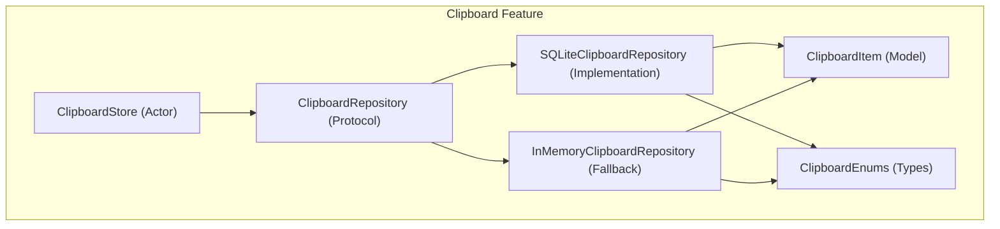
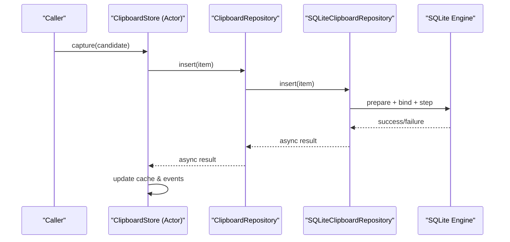
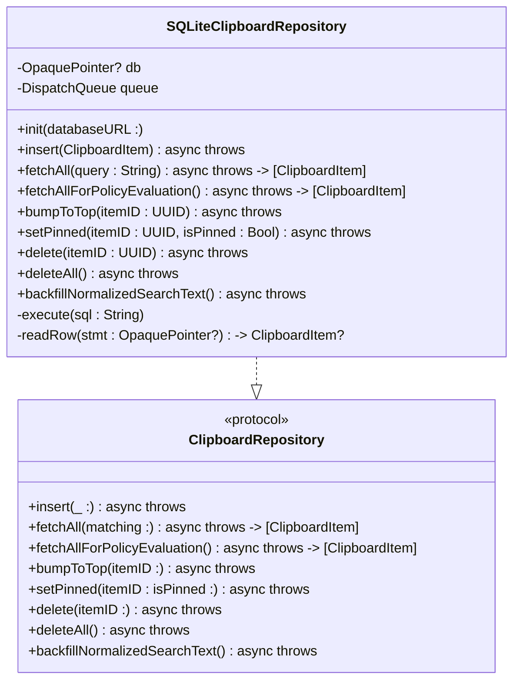
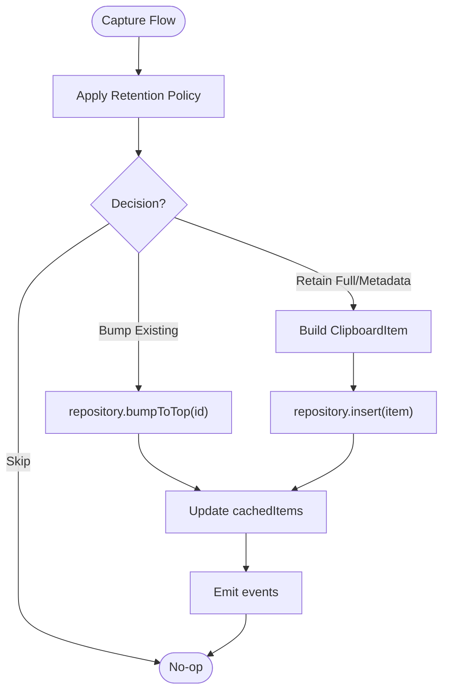
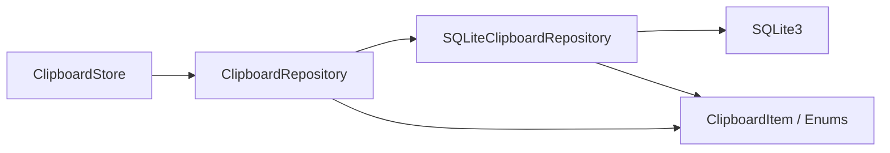

# Repository Pattern Implementation

<cite>
**Referenced Files in This Document**
- [SQLiteClipboardRepository.swift](file://macos/skey-app/Sources/Features/Clipboard/Services/SQLiteClipboardRepository.swift)
- [ClipboardRepository.swift](file://macos/skey-app/Sources/Features/Clipboard/Services/ClipboardRepository.swift)
- [ClipboardItem.swift](file://macos/skey-app/Sources/Features/Clipboard/Models/ClipboardItem.swift)
- [ClipboardEnums.swift](file://macos/skey-app/Sources/Features/Clipboard/Models/ClipboardEnums.swift)
- [ClipboardStore.swift](file://macos/skey-app/Sources/Features/Clipboard/Services/ClipboardStore.swift)
</cite>

## Table of Contents
1. [Introduction](#introduction)
2. [Project Structure](#project-structure)
3. [Core Components](#core-components)
4. [Architecture Overview](#architecture-overview)
5. [Detailed Component Analysis](#detailed-component-analysis)
6. [Dependency Analysis](#dependency-analysis)
7. [Performance Considerations](#performance-considerations)
8. [Troubleshooting Guide](#troubleshooting-guide)
9. [Conclusion](#conclusion)

## Introduction
This document explains the repository pattern implementation for clipboard persistence using SQLite, centered on the SQLiteClipboardRepository class. It covers thread-safe database access via a serial DispatchQueue, async/await integration with CheckedContinuation to avoid blocking I/O, and robust error handling strategies. It also documents all repository methods (insert, fetchAll, bumpToTop, setPinned, delete, deleteAll), their parameters, return values, and usage patterns, including prepared statement usage, parameter binding, and result mapping. Finally, it clarifies how the ClipboardRepository protocol abstracts database operations from the rest of the application and discusses connection management, transactional considerations, and performance optimizations.

## Project Structure
The clipboard feature is organized into models, services, and UI components. The repository layer isolates data access behind a Sendable protocol, enabling both persistent (SQLite) and in-memory implementations.

**Diagram sources**
- [ClipboardStore.swift:5-44](file://macos/skey-app/Sources/Features/Clipboard/Services/ClipboardStore.swift#L5-L44)
- [ClipboardRepository.swift:5-14](file://macos/skey-app/Sources/Features/Clipboard/Services/ClipboardRepository.swift#L5-L14)
- [SQLiteClipboardRepository.swift:6-55](file://macos/skey-app/Sources/Features/Clipboard/Services/SQLiteClipboardRepository.swift#L6-L55)
- [ClipboardStore.swift:231-274](file://macos/skey-app/Sources/Features/Clipboard/Services/ClipboardStore.swift#L231-L274)
- [ClipboardItem.swift:6-62](file://macos/skey-app/Sources/Features/Clipboard/Models/ClipboardItem.swift#L6-L62)
- [ClipboardEnums.swift:7-12](file://macos/skey-app/Sources/Features/Clipboard/Models/ClipboardEnums.swift#L7-L12)

**Section sources**
- [ClipboardStore.swift:5-44](file://macos/skey-app/Sources/Features/Clipboard/Services/ClipboardStore.swift#L5-L44)
- [ClipboardRepository.swift:5-14](file://macos/skey-app/Sources/Features/Clipboard/Services/ClipboardRepository.swift#L5-L14)
- [SQLiteClipboardRepository.swift:6-55](file://macos/skey-app/Sources/Features/Clipboard/Services/SQLiteClipboardRepository.swift#L6-L55)
- [ClipboardItem.swift:6-62](file://macos/skey-app/Sources/Features/Clipboard/Models/ClipboardItem.swift#L6-L62)
- [ClipboardEnums.swift:7-12](file://macos/skey-app/Sources/Features/Clipboard/Models/ClipboardEnums.swift#L7-L12)

## Core Components
- ClipboardRepository: Defines the asynchronous interface for clipboard persistence operations. All methods are async throwing and operate on Sendable types.
- SQLiteClipboardRepository: Concrete implementation backed by SQLite3 with a dedicated serial queue for thread safety. Uses prepared statements, parameter binding, and row mapping.
- ClipboardStore: An actor that coordinates policy decisions, caching, payload storage, and events. It injects a repository (defaults to SQLite or in-memory fallback).
- ClipboardItem and ClipboardEnums: Data models and enumerations used across the feature.

Key responsibilities:
- Abstraction: Consumers depend only on ClipboardRepository, not on SQLite specifics.
- Concurrency: All DB work runs off the main thread on a serial DispatchQueue; async/await bridges to Swift concurrency via CheckedContinuation.
- Persistence: WAL mode, indexes, and normalized search text optimize reads and writes.

**Section sources**
- [ClipboardRepository.swift:5-14](file://macos/skey-app/Sources/Features/Clipboard/Services/ClipboardRepository.swift#L5-L14)
- [SQLiteClipboardRepository.swift:6-55](file://macos/skey-app/Sources/Features/Clipboard/Services/SQLiteClipboardRepository.swift#L6-L55)
- [ClipboardStore.swift:5-44](file://macos/skey-app/Sources/Features/Clipboard/Services/ClipboardStore.swift#L5-L44)
- [ClipboardItem.swift:6-62](file://macos/skey-app/Sources/Features/Clipboard/Models/ClipboardItem.swift#L6-L62)
- [ClipboardEnums.swift:7-12](file://macos/skey-app/Sources/Features/Clipboard/Models/ClipboardEnums.swift#L7-L12)

## Architecture Overview
The architecture separates concerns:
- ClipboardStore orchestrates capture flows, retention policies, caching, and event streaming.
- ClipboardRepository abstracts persistence; SQLiteClipboardRepository implements it with SQLite3.
- Models and enums define data contracts.

**Diagram sources**
- [ClipboardStore.swift:68-113](file://macos/skey-app/Sources/Features/Clipboard/Services/ClipboardStore.swift#L68-L113)
- [SQLiteClipboardRepository.swift:69-122](file://macos/skey-app/Sources/Features/Clipboard/Services/SQLiteClipboardRepository.swift#L69-L122)

## Detailed Component Analysis

### ClipboardRepository Protocol
Defines the contract for clipboard persistence:
- insert(_:)
- fetchAll(matching:)
- fetchAllForPolicyEvaluation()
- bumpToTop(itemID:)
- setPinned(itemID:isPinned:)
- delete(itemID:)
- deleteAll()
- backfillNormalizedSearchText()

All methods are async throwing and operate on Sendable types to support safe concurrent usage.

**Section sources**
- [ClipboardRepository.swift:5-14](file://macos/skey-app/Sources/Features/Clipboard/Services/ClipboardRepository.swift#L5-L14)

### SQLiteClipboardRepository Class Design
- Thread-safety: A private serial DispatchQueue ensures serialized access to the underlying sqlite3 handle.
- Connection management: Opens a single sqlite3 connection in init with read/write/create flags and full mutex. Enables WAL journal mode and sets synchronous to NORMAL for crash safety and concurrency. Creates the table and indexes if missing.
- Prepared statements: Every operation uses sqlite3_prepare_v2, binds parameters, steps through results, and finalizes statements to prevent leaks.
- Async bridging: Each method wraps its work in withCheckedThrowingContinuation to expose an async API while executing blocking SQLite calls on the background queue.
- Error handling: Errors are converted to NSError with descriptive messages and thrown via continuation.resume(throwing:).

**Diagram sources**
- [SQLiteClipboardRepository.swift:6-55](file://macos/skey-app/Sources/Features/Clipboard/Services/SQLiteClipboardRepository.swift#L6-L55)
- [SQLiteClipboardRepository.swift:63-65](file://macos/skey-app/Sources/Features/Clipboard/Services/SQLiteClipboardRepository.swift#L63-L65)
- [SQLiteClipboardRepository.swift:69-122](file://macos/skey-app/Sources/Features/Clipboard/Services/SQLiteClipboardRepository.swift#L69-L122)
- [SQLiteClipboardRepository.swift:126-156](file://macos/skey-app/Sources/Features/Clipboard/Services/SQLiteClipboardRepository.swift#L126-L156)
- [SQLiteClipboardRepository.swift:158-160](file://macos/skey-app/Sources/Features/Clipboard/Services/SQLiteClipboardRepository.swift#L158-L160)
- [SQLiteClipboardRepository.swift:162-201](file://macos/skey-app/Sources/Features/Clipboard/Services/SQLiteClipboardRepository.swift#L162-L201)
- [SQLiteClipboardRepository.swift:205-221](file://macos/skey-app/Sources/Features/Clipboard/Services/SQLiteClipboardRepository.swift#L205-L221)
- [SQLiteClipboardRepository.swift:223-239](file://macos/skey-app/Sources/Features/Clipboard/Services/SQLiteClipboardRepository.swift#L223-L239)
- [SQLiteClipboardRepository.swift:241-256](file://macos/skey-app/Sources/Features/Clipboard/Services/SQLiteClipboardRepository.swift#L241-L256)
- [SQLiteClipboardRepository.swift:258-265](file://macos/skey-app/Sources/Features/Clipboard/Services/SQLiteClipboardRepository.swift#L258-L265)
- [SQLiteClipboardRepository.swift:267-299](file://macos/skey-app/Sources/Features/Clipboard/Services/SQLiteClipboardRepository.swift#L267-L299)
- [ClipboardRepository.swift:5-14](file://macos/skey-app/Sources/Features/Clipboard/Services/ClipboardRepository.swift#L5-L14)

#### Insert Operation
- Purpose: Persist a new or updated clipboard item using INSERT OR REPLACE.
- Parameters: ClipboardItem containing id, contentType, contentHash, optional text/payload metadata, timestamps, pin state, copy count, and normalized search text.
- Return: Void upon success; throws on failure.
- Prepared statement usage: Binds each field positionally; handles optional fields by binding NULL when absent.
- Result mapping: Not applicable (write-only).

Usage pattern example path:
- [SQLiteClipboardRepository.swift:69-122](file://macos/skey-app/Sources/Features/Clipboard/Services/SQLiteClipboardRepository.swift#L69-L122)

**Section sources**
- [SQLiteClipboardRepository.swift:69-122](file://macos/skey-app/Sources/Features/Clipboard/Services/SQLiteClipboardRepository.swift#L69-L122)

#### FetchAll Operation
- Purpose: Retrieve items, optionally filtered by normalized search text.
- Parameters: query string (empty means no filter).
- Return: Array of ClipboardItem ordered by capturedAt descending.
- Prepared statement usage: Prepares SELECT with optional LIKE predicate bound to normalizedSearchText. Iterates rows and maps to ClipboardItem via readRow.
- Result mapping: readRow extracts columns and constructs ClipboardItem instances.

Usage pattern example path:
- [SQLiteClipboardRepository.swift:126-156](file://macos/skey-app/Sources/Features/Clipboard/Services/SQLiteClipboardRepository.swift#L126-L156)
- [SQLiteClipboardRepository.swift:162-201](file://macos/skey-app/Sources/Features/Clipboard/Services/SQLiteClipboardRepository.swift#L162-L201)

**Section sources**
- [SQLiteClipboardRepository.swift:126-156](file://macos/skey-app/Sources/Features/Clipboard/Services/SQLiteClipboardRepository.swift#L126-L156)
- [SQLiteClipboardRepository.swift:162-201](file://macos/skey-app/Sources/Features/Clipboard/Services/SQLiteClipboardRepository.swift#L162-L201)

#### BumpToTop Operation
- Purpose: Move an existing item to the top by updating capturedAt and incrementing copyCount.
- Parameters: itemID (UUID).
- Return: Void upon success; throws on failure.
- Prepared statement usage: UPDATE with current timestamp and copyCount increment bound to id.

Usage pattern example path:
- [SQLiteClipboardRepository.swift:205-221](file://macos/skey-app/Sources/Features/Clipboard/Services/SQLiteClipboardRepository.swift#L205-L221)

**Section sources**
- [SQLiteClipboardRepository.swift:205-221](file://macos/skey-app/Sources/Features/Clipboard/Services/SQLiteClipboardRepository.swift#L205-L221)

#### SetPinned Operation
- Purpose: Toggle pin status for an item.
- Parameters: itemID (UUID), isPinned (Bool).
- Return: Void upon success; throws on failure.
- Prepared statement usage: UPDATE isPinned bound to boolean as integer and id.

Usage pattern example path:
- [SQLiteClipboardRepository.swift:223-239](file://macos/skey-app/Sources/Features/Clipboard/Services/SQLiteClipboardRepository.swift#L223-L239)

**Section sources**
- [SQLiteClipboardRepository.swift:223-239](file://macos/skey-app/Sources/Features/Clipboard/Services/SQLiteClipboardRepository.swift#L223-L239)

#### Delete Operation
- Purpose: Remove a specific item by id.
- Parameters: itemID (UUID).
- Return: Void upon success; throws on failure.
- Prepared statement usage: DELETE WHERE id bound to UUID string.

Usage pattern example path:
- [SQLiteClipboardRepository.swift:241-256](file://macos/skey-app/Sources/Features/Clipboard/Services/SQLiteClipboardRepository.swift#L241-L256)

**Section sources**
- [SQLiteClipboardRepository.swift:241-256](file://macos/skey-app/Sources/Features/Clipboard/Services/SQLiteClipboardRepository.swift#L241-L256)

#### DeleteAll Operation
- Purpose: Clear all clipboard entries.
- Parameters: None.
- Return: Void upon success; throws on failure.
- Prepared statement usage: Executes simple DELETE FROM without parameters.

Usage pattern example path:
- [SQLiteClipboardRepository.swift:258-265](file://macos/skey-app/Sources/Features/Clipboard/Services/SQLiteClipboardRepository.swift#L258-L265)

**Section sources**
- [SQLiteClipboardRepository.swift:258-265](file://macos/skey-app/Sources/Features/Clipboard/Services/SQLiteClipboardRepository.swift#L258-L265)

#### BackfillNormalizedSearchText Operation
- Purpose: Populate normalizedSearchText for legacy items where it is empty.
- Parameters: None.
- Return: Void upon success; throws on failure.
- Logic: Selects items with empty normalizedSearchText, computes folded text from textContent and previewText, then updates each row.

Usage pattern example path:
- [SQLiteClipboardRepository.swift:267-299](file://macos/skey-app/Sources/Features/Clipboard/Services/SQLiteClipboardRepository.swift#L267-L299)

**Section sources**
- [SQLiteClipboardRepository.swift:267-299](file://macos/skey-app/Sources/Features/Clipboard/Services/SQLiteClipboardRepository.swift#L267-L299)

### ClipboardStore Integration
- Dependency injection: Accepts a ClipboardRepository; defaults to SQLiteClipboardRepository or falls back to InMemoryClipboardRepository.
- Initialization: Starts a background task to backfill normalized search text and load initial cache via fetchAllForPolicyEvaluation.
- Capture flow: Applies retention policy, persists via repository.insert or bumps existing via bumpToTop, updates cache, and emits events.
- Query flow: Uses repository.fetchAll with normalized query and applies ranking and sorting before returning results.

**Diagram sources**
- [ClipboardStore.swift:68-113](file://macos/skey-app/Sources/Features/Clipboard/Services/ClipboardStore.swift#L68-L113)

**Section sources**
- [ClipboardStore.swift:5-44](file://macos/skey-app/Sources/Features/Clipboard/Services/ClipboardStore.swift#L5-L44)
- [ClipboardStore.swift:68-113](file://macos/skey-app/Sources/Features/Clipboard/Services/ClipboardStore.swift#L68-L113)
- [ClipboardStore.swift:115-134](file://macos/skey-app/Sources/Features/Clipboard/Services/ClipboardStore.swift#L115-L134)

## Dependency Analysis
- ClipboardStore depends on ClipboardRepository abstraction, decoupling business logic from persistence details.
- SQLiteClipboardRepository depends on Foundation and SQLite3; encapsulates low-level sqlite3 calls.
- Models and enums provide shared contracts across layers.

**Diagram sources**
- [ClipboardStore.swift:5-44](file://macos/skey-app/Sources/Features/Clipboard/Services/ClipboardStore.swift#L5-L44)
- [ClipboardRepository.swift:5-14](file://macos/skey-app/Sources/Features/Clipboard/Services/ClipboardRepository.swift#L5-L14)
- [SQLiteClipboardRepository.swift:6-55](file://macos/skey-app/Sources/Features/Clipboard/Services/SQLiteClipboardRepository.swift#L6-L55)
- [ClipboardItem.swift:6-62](file://macos/skey-app/Sources/Features/Clipboard/Models/ClipboardItem.swift#L6-L62)
- [ClipboardEnums.swift:7-12](file://macos/skey-app/Sources/Features/Clipboard/Models/ClipboardEnums.swift#L7-L12)

**Section sources**
- [ClipboardStore.swift:5-44](file://macos/skey-app/Sources/Features/Clipboard/Services/ClipboardStore.swift#L5-L44)
- [ClipboardRepository.swift:5-14](file://macos/skey-app/Sources/Features/Clipboard/Services/ClipboardRepository.swift#L5-L14)
- [SQLiteClipboardRepository.swift:6-55](file://macos/skey-app/Sources/Features/Clipboard/Services/SQLiteClipboardRepository.swift#L6-L55)
- [ClipboardItem.swift:6-62](file://macos/skey-app/Sources/Features/Clipboard/Models/ClipboardItem.swift#L6-L62)
- [ClipboardEnums.swift:7-12](file://macos/skey-app/Sources/Features/Clipboard/Models/ClipboardEnums.swift#L7-L12)

## Performance Considerations
- WAL mode and synchronous settings: Journal mode set to WAL and synchronous to NORMAL improve concurrency and crash safety while maintaining reasonable durability.
- Indexes: Indices on contentHash and capturedAt accelerate lookups and ordering.
- Normalized search text: Precomputed normalizedSearchText enables efficient substring searches without runtime transformations.
- Serial queue: A single DispatchQueue serializes all SQLite operations, preventing contention and ensuring consistency.
- Prepared statements: Reuse of prepared statements per call reduces overhead and avoids SQL injection risks.
- Payload strategy: Large payloads can be stored externally with metadata persisted, reducing database size.

[No sources needed since this section provides general guidance]

## Troubleshooting Guide
Common issues and resolutions:
- Database open failures: If sqlite3_open_v2 fails, an NSError is thrown during initialization with the underlying error message. Verify file paths and permissions.
- Statement preparation errors: If sqlite3_prepare_v2 fails, an NSError is thrown with the error message. Check SQL syntax and column mappings.
- Step execution errors: On sqlite3_step failure, an NSError is thrown. Inspect constraints and data types.
- Missing normalized search text: Use backfillNormalizedSearchText to populate missing values for older records.

Error handling patterns:
- Initialization: Throws on open failure.
- Write operations: Throws on prepare or step failure; otherwise resumes successfully.
- Read operations: Throws on prepare failure; otherwise returns results.

**Section sources**
- [SQLiteClipboardRepository.swift:21-27](file://macos/skey-app/Sources/Features/Clipboard/Services/SQLiteClipboardRepository.swift#L21-L27)
- [SQLiteClipboardRepository.swift:108-119](file://macos/skey-app/Sources/Features/Clipboard/Services/SQLiteClipboardRepository.swift#L108-L119)
- [SQLiteClipboardRepository.swift:150-153](file://macos/skey-app/Sources/Features/Clipboard/Services/SQLiteClipboardRepository.swift#L150-L153)
- [SQLiteClipboardRepository.swift:267-299](file://macos/skey-app/Sources/Features/Clipboard/Services/SQLiteClipboardRepository.swift#L267-L299)

## Conclusion
SQLiteClipboardRepository provides a robust, thread-safe, and async-friendly persistence layer for clipboard data. By abstracting database operations behind ClipboardRepository, the application remains decoupled from storage specifics. The use of a serial DispatchQueue, prepared statements, WAL mode, and normalized search indexing yields reliable and performant operations. The design supports easy testing and replacement with alternative repositories (e.g., in-memory) while preserving consistent APIs across the system.