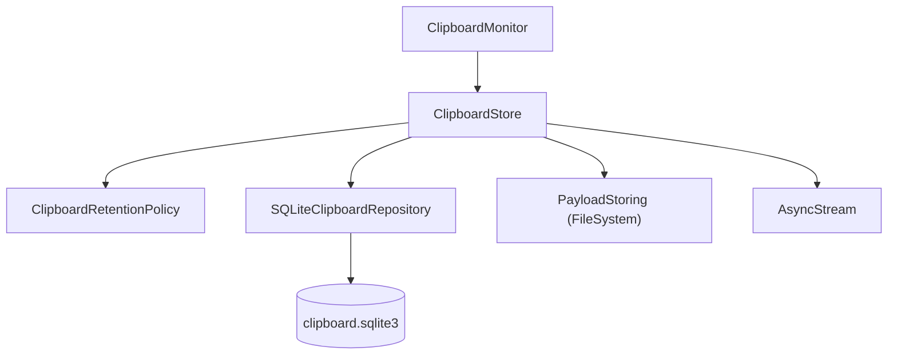
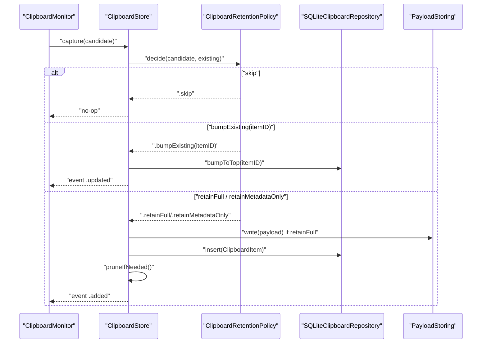
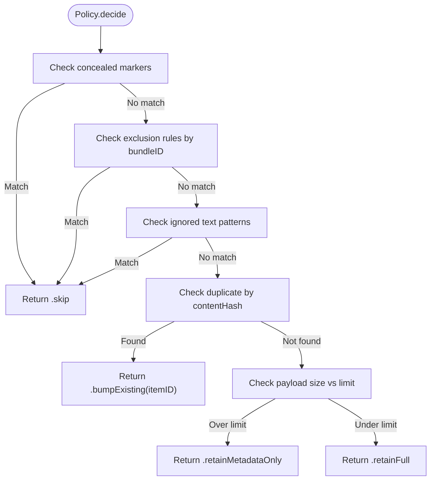
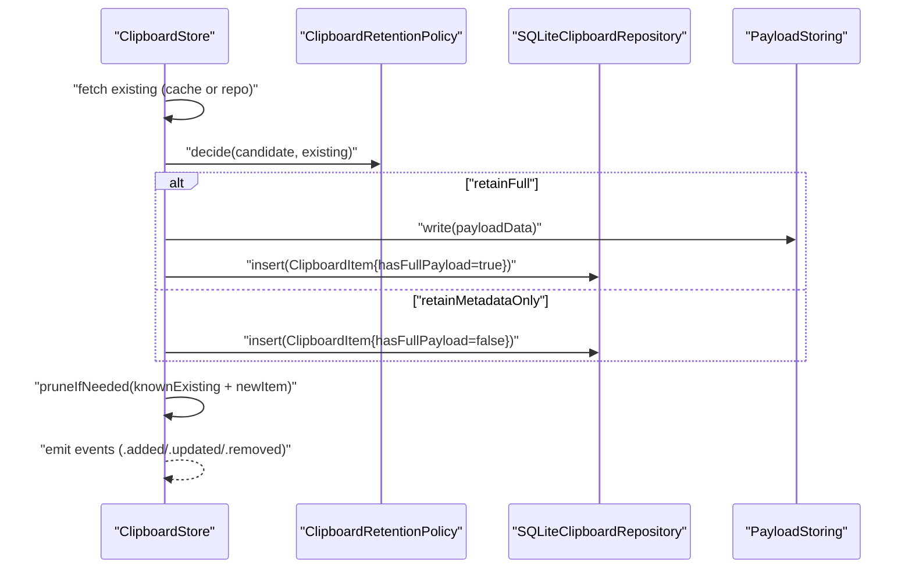
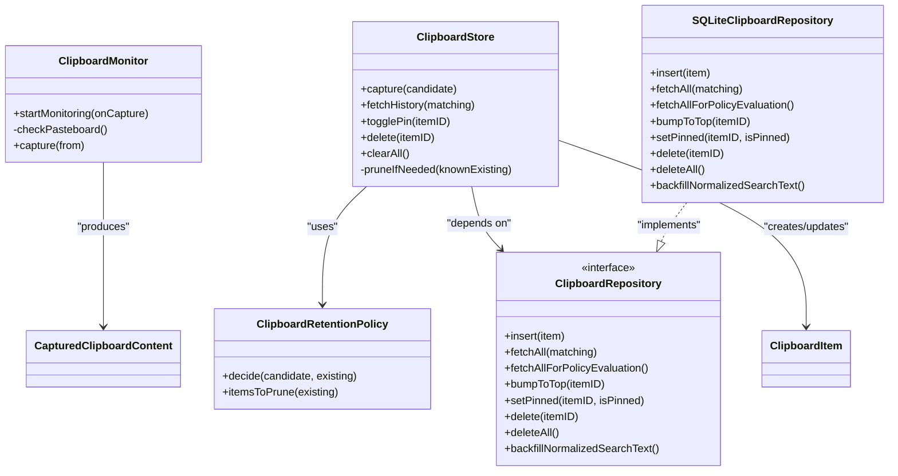

# Retention Policies & Cleanup

<cite>
**Referenced Files in This Document**
- [ClipboardRetentionPolicy.swift](file://macos/skey-app/Sources/Features/Clipboard/Services/ClipboardRetentionPolicy.swift)
- [ClipboardItem.swift](file://macos/skey-app/Sources/Features/Clipboard/Models/ClipboardItem.swift)
- [ClipboardEnums.swift](file://macos/skey-app/Sources/Features/Clipboard/Models/ClipboardEnums.swift)
- [ClipboardStore.swift](file://macos/skey-app/Sources/Features/Clipboard/Services/ClipboardStore.swift)
- [SQLiteClipboardRepository.swift](file://macos/skey-app/Sources/Features/Clipboard/Services/SQLiteClipboardRepository.swift)
- [ClipboardRepository.swift](file://macos/skey-app/Sources/Features/Clipboard/Services/ClipboardRepository.swift)
- [ClipboardSettings.swift](file://macos/skey-app/Sources/Shared/Settings/Modules/ClipboardSettings.swift)
- [ClipboardMonitor.swift](file://macos/skey-app/Sources/Features/Clipboard/Services/ClipboardMonitor.swift)
- [SearchRanking.swift](file://macos/skey-app/Sources/Features/Clipboard/Services/SearchRanking.swift)
</cite>

## Table of Contents
1. Introduction
2. Project Structure
3. Core Components
4. Architecture Overview
5. Detailed Component Analysis
6. Dependency Analysis
7. Performance Considerations
8. Troubleshooting Guide
9. Conclusion
10. Appendices

## Introduction
This document explains the clipboard retention policy system responsible for automatic cleanup and storage management. It focuses on how ClipboardRetentionPolicy evaluates new clipboard content against existing items, enforces time-based and size-based rules, and triggers intelligent cleanup while preserving pinned items. It also covers the interaction with the repository layer (SQLite), event-driven updates, performance considerations for large datasets, and user customization options exposed via settings.

## Project Structure
The retention system spans several layers:
- Capture and classification: ClipboardMonitor detects changes and builds a CapturedClipboardContent payload.
- Policy evaluation: ClipboardRetentionPolicy decides whether to skip, bump an existing item, retain full payload, or retain metadata only.
- Storage and persistence: ClipboardStore orchestrates capture flow, applies policies, persists items via ClipboardRepository (SQLiteClipboardRepository), and manages payloads through PayloadStoring.
- Settings and UI: ClipboardSettings exposes user-configurable limits and behaviors; the UI binds to these values.

**Diagram sources**
- [ClipboardMonitor.swift:21-44](file://macos/skey-app/Sources/Features/Clipboard/Services/ClipboardMonitor.swift#L21-L44)
- [ClipboardStore.swift:68-113](file://macos/skey-app/Sources/Features/Clipboard/Services/ClipboardStore.swift#L68-L113)
- [ClipboardRetentionPolicy.swift:30-63](file://macos/skey-app/Sources/Features/Clipboard/Services/ClipboardRetentionPolicy.swift#L30-L63)
- [SQLiteClipboardRepository.swift:69-122](file://macos/skey-app/Sources/Features/Clipboard/Services/SQLiteClipboardRepository.swift#L69-L122)

**Section sources**
- [ClipboardMonitor.swift:21-44](file://macos/skey-app/Sources/Features/Clipboard/Services/ClipboardMonitor.swift#L21-L44)
- [ClipboardStore.swift:68-113](file://macos/skey-app/Sources/Features/Clipboard/Services/ClipboardStore.swift#L68-L113)
- [ClipboardRetentionPolicy.swift:30-63](file://macos/skey-app/Sources/Features/Clipboard/Services/ClipboardRetentionPolicy.swift#L30-L63)
- [SQLiteClipboardRepository.swift:69-122](file://macos/skey-app/Sources/Features/Clipboard/Services/SQLiteClipboardRepository.swift#L69-L122)

## Core Components
- ClipboardRetentionPolicy: Pure rules that decide retention behavior based on pasteboard markers, source app exclusions, ignored text patterns, duplicate detection by content hash, and payload size limits. It also computes which unpinned items to prune when exceeding history limits.
- ClipboardStore: Actor that coordinates capture, policy decisions, persistence, payload handling, caching, pruning, and events.
- SQLiteClipboardRepository: Persistent store using SQLite with WAL mode, indexes, and operations for insert, fetch, bump-to-top, pin toggling, delete, and backfill of normalized search text.
- ClipboardItem and CapturedClipboardContent: Data models representing stored entries and raw captured content before policy decision.
- ClipboardSettings: User-facing configuration including history limit and other behaviors.

Key responsibilities:
- Time-based retention: Prune oldest unpinned items beyond historyLimit.
- Size-based retention: Skip storing large payloads beyond maxPayloadSizeBytes, retaining metadata only.
- Duplicate handling: Bump existing items instead of duplicating.
- Privacy and exclusion: Skip concealed types and apps defined by exclusion rules.

**Section sources**
- [ClipboardRetentionPolicy.swift:6-63](file://macos/skey-app/Sources/Features/Clipboard/Services/ClipboardRetentionPolicy.swift#L6-L63)
- [ClipboardStore.swift:6-113](file://macos/skey-app/Sources/Features/Clipboard/Services/ClipboardStore.swift#L6-L113)
- [SQLiteClipboardRepository.swift:34-55](file://macos/skey-app/Sources/Features/Clipboard/Services/SQLiteClipboardRepository.swift#L34-L55)
- [ClipboardItem.swift:6-93](file://macos/skey-app/Sources/Features/Clipboard/Models/ClipboardItem.swift#L6-L93)
- [ClipboardSettings.swift:109-115](file://macos/skey-app/Sources/Shared/Settings/Modules/ClipboardSettings.swift#L109-L115)

## Architecture Overview
The capture-to-persistence pipeline integrates monitoring, policy, storage, and payload management. ClipboardMonitor polls NSPasteboard and emits captured content. ClipboardStore applies ClipboardRetentionPolicy to decide retention, then uses ClipboardRepository to persist and manages payloads via PayloadStoring. Events are emitted to subscribers for UI updates.

**Diagram sources**
- [ClipboardMonitor.swift:21-44](file://macos/skey-app/Sources/Features/Clipboard/Services/ClipboardMonitor.swift#L21-L44)
- [ClipboardStore.swift:68-113](file://macos/skey-app/Sources/Features/Clipboard/Services/ClipboardStore.swift#L68-L113)
- [ClipboardRetentionPolicy.swift:30-63](file://macos/skey-app/Sources/Features/Clipboard/Services/ClipboardRetentionPolicy.swift#L30-L63)
- [SQLiteClipboardRepository.swift:69-122](file://macos/skey-app/Sources/Features/Clipboard/Services/SQLiteClipboardRepository.swift#L69-L122)

## Detailed Component Analysis

### ClipboardRetentionPolicy
Responsibilities:
- Skip items with concealed pasteboard type markers.
- Skip items from excluded bundle IDs.
- Skip items matching ignored text patterns (regex).
- Bump existing items by contentHash to avoid duplicates.
- Enforce size limits: retain full payload only if under maxPayloadSizeBytes; otherwise retain metadata only.
- Compute items to prune: unpinned items sorted by capturedAt; remove oldest until within historyLimit.

Evaluation criteria:
- Pasteboard type markers vs concealed set.
- Source bundle ID vs exclusionRules.
- Text content vs ignoredTextPatterns.
- Existing items by contentHash.
- Payload size vs maxPayloadSizeBytes.

Cleanup algorithm:
- Filter out pinned items.
- If count exceeds historyLimit, sort by capturedAt ascending and select excessCount oldest.
- Return their IDs for deletion.

**Diagram sources**
- [ClipboardRetentionPolicy.swift:30-53](file://macos/skey-app/Sources/Features/Clipboard/Services/ClipboardRetentionPolicy.swift#L30-L53)

**Section sources**
- [ClipboardRetentionPolicy.swift:6-63](file://macos/skey-app/Sources/Features/Clipboard/Services/ClipboardRetentionPolicy.swift#L6-L63)
- [ClipboardEnums.swift:69-74](file://macos/skey-app/Sources/Features/Clipboard/Models/ClipboardEnums.swift#L69-L74)

### ClipboardStore
Responsibilities:
- Manage capture lifecycle and apply policy decisions.
- Maintain an in-memory cache for fast reads and sorting.
- Persist items via ClipboardRepository and manage payload files.
- Emit events for added, updated, removed, clearedAll.
- Perform pruning after insertions.

Capture flow highlights:
- Fetch existing items for policy evaluation (cache or repository).
- Apply policy.decide and branch accordingly.
- For retainFull, write payload data and mark hasFullPayload.
- Insert into repository and update cache.
- Call pruneIfNeeded to enforce historyLimit on unpinned items.

Pruning logic:
- Use policy.itemsToPrune to get IDs to delete.
- Delete payloads and repository rows.
- Remove from cache and emit removal events.

**Diagram sources**
- [ClipboardStore.swift:68-113](file://macos/skey-app/Sources/Features/Clipboard/Services/ClipboardStore.swift#L68-L113)
- [ClipboardStore.swift:195-209](file://macos/skey-app/Sources/Features/Clipboard/Services/ClipboardStore.swift#L195-L209)

**Section sources**
- [ClipboardStore.swift:6-113](file://macos/skey-app/Sources/Features/Clipboard/Services/ClipboardStore.swift#L6-L113)
- [ClipboardStore.swift:195-209](file://macos/skey-app/Sources/Features/Clipboard/Services/ClipboardStore.swift#L195-L209)

### SQLiteClipboardRepository
Responsibilities:
- Initialize SQLite with WAL mode and NORMAL synchronous for concurrency and crash safety.
- Create table and indexes for efficient queries.
- Provide async methods for insert, fetch, bump-to-top, pin toggle, delete, deleteAll, and backfill of normalized search text.

Performance characteristics:
- WAL journaling improves concurrent reads and reduces locking.
- Indexes on contentHash and capturedAt optimize duplicate checks and pruning.
- Asynchronous execution via a dedicated queue avoids blocking main thread.

Transaction handling:
- Each operation is executed individually; bulk deletions are performed by iterating over IDs and issuing single DELETE statements per item.
- No explicit multi-statement transactions are used in current implementation.

**Section sources**
- [SQLiteClipboardRepository.swift:21-55](file://macos/skey-app/Sources/Features/Clipboard/Services/SQLiteClipboardRepository.swift#L21-L55)
- [SQLiteClipboardRepository.swift:69-122](file://macos/skey-app/Sources/Features/Clipboard/Services/SQLiteClipboardRepository.swift#L69-L122)
- [SQLiteClipboardRepository.swift:205-265](file://macos/skey-app/Sources/Features/Clipboard/Services/SQLiteClipboardRepository.swift#L205-L265)

### ClipboardItem and CapturedClipboardContent
- ClipboardItem represents persisted clipboard entries with metadata, payload references, timestamps, pin state, and normalized search text.
- CapturedClipboardContent is the raw candidate captured from NSPasteboard prior to policy decision, including content type, hash, optional text, payload data, size, source bundle ID, and pasteboard type markers.

These structures enable precise policy evaluation and consistent persistence.

**Section sources**
- [ClipboardItem.swift:6-93](file://macos/skey-app/Sources/Features/Clipboard/Models/ClipboardItem.swift#L6-L93)
- [ClipboardEnums.swift:69-74](file://macos/skey-app/Sources/Features/Clipboard/Models/ClipboardEnums.swift#L69-L74)

### ClipboardSettings
User customization options relevant to retention:
- historyLimit: Controls maximum number of retained items (used by policy for pruning unpinned items).
- saveText/saveImages: Influence what types are captured and stored (indirectly affects retention volume).
- sortOrder: Affects display ordering but not retention logic.

UI binding:
- The settings tab provides a slider for historyLimit and toggles for saving text/images, enabling users to control retention behavior directly.

**Section sources**
- [ClipboardSettings.swift:109-115](file://macos/skey-app/Sources/Shared/Settings/Modules/ClipboardSettings.swift#L109-L115)
- [ClipboardSettingsTab.swift:134-155](file://macos/skey-app/Sources/Features/Settings/UI/Tabs/ClipboardSettingsTab.swift#L134-L155)

## Dependency Analysis
High-level dependencies:
- ClipboardMonitor depends on NSPasteboard and emits CapturedClipboardContent.
- ClipboardStore depends on ClipboardRetentionPolicy, ClipboardRepository, and PayloadStoring.
- SQLiteClipboardRepository implements ClipboardRepository and interacts with SQLite.
- ClipboardSettings provides configuration consumed by UI and indirectly influences policy thresholds.

**Diagram sources**
- [ClipboardMonitor.swift:21-44](file://macos/skey-app/Sources/Features/Clipboard/Services/ClipboardMonitor.swift#L21-L44)
- [ClipboardStore.swift:6-113](file://macos/skey-app/Sources/Features/Clipboard/Services/ClipboardStore.swift#L6-L113)
- [ClipboardRetentionPolicy.swift:30-63](file://macos/skey-app/Sources/Features/Clipboard/Services/ClipboardRetentionPolicy.swift#L30-L63)
- [ClipboardRepository.swift:5-14](file://macos/skey-app/Sources/Features/Clipboard/Services/ClipboardRepository.swift#L5-L14)
- [SQLiteClipboardRepository.swift:69-122](file://macos/skey-app/Sources/Features/Clipboard/Services/SQLiteClipboardRepository.swift#L69-L122)

**Section sources**
- [ClipboardRepository.swift:5-14](file://macos/skey-app/Sources/Features/Clipboard/Services/ClipboardRepository.swift#L5-L14)
- [SQLiteClipboardRepository.swift:69-122](file://macos/skey-app/Sources/Features/Clipboard/Services/SQLiteClipboardRepository.swift#L69-L122)

## Performance Considerations
- WAL mode and NORMAL synchronous: Improves read concurrency and crash resilience without sacrificing too much durability.
- Indexes: contentHash enables fast duplicate detection; capturedAt supports efficient pruning by time.
- In-memory cache: ClipboardStore maintains cachedItems to reduce repeated repository reads for common operations like fetching history.
- Background processing: Repository operations run on a dedicated queue to avoid blocking the main thread.
- Payload handling: Large payloads may be omitted (metadata-only retention) to minimize disk usage and I/O overhead.
- Bulk deletions: Current implementation deletes items one-by-one; for very large datasets, consider batching deletions in transactions to reduce commit overhead.

[No sources needed since this section provides general guidance]

## Troubleshooting Guide
Common issues and diagnostics:
- Items not retained:
  - Check if pasteboard type markers include concealed types; such items are skipped by policy.
  - Verify exclusion rules for source bundle IDs and ignored text patterns.
  - Confirm payload size does not exceed maxPayloadSizeBytes; oversized payloads are stored as metadata only.
- Duplicates not bumped:
  - Ensure contentHash computation is consistent across captures; duplicates are detected by contentHash.
- Excessive storage growth:
  - Adjust historyLimit in settings to prune more aggressively.
  - Review saved types (text/images) to reduce payload volume.
- Slow queries or UI lag:
  - Validate SQLite indexes exist (contentHash, capturedAt).
  - Ensure WAL mode is enabled and synchronous setting is appropriate.
- Event stream not updating:
  - Confirm ClipboardStore emits events for added/updated/removed actions and that subscribers are connected.

**Section sources**
- [ClipboardRetentionPolicy.swift:30-53](file://macos/skey-app/Sources/Features/Clipboard/Services/ClipboardRetentionPolicy.swift#L30-L53)
- [SQLiteClipboardRepository.swift:21-55](file://macos/skey-app/Sources/Features/Clipboard/Services/SQLiteClipboardRepository.swift#L21-L55)
- [ClipboardStore.swift:68-113](file://macos/skey-app/Sources/Features/Clipboard/Services/ClipboardStore.swift#L68-L113)

## Conclusion
The retention policy system combines robust policy evaluation with efficient storage and cleanup mechanisms. It protects privacy by skipping concealed types and excluded apps, prevents duplication via content hashing, enforces size limits to manage storage, and prunes unpinned items based on time to maintain a bounded history. Users can customize retention behavior through settings, particularly the history limit and saved content types. The architecture separates concerns cleanly between capture, policy, storage, and UI, enabling maintainability and scalability.

[No sources needed since this section summarizes without analyzing specific files]

## Appendices

### Example: Policy Configuration and Evaluation
- Configure historyLimit via ClipboardSettings to cap retained items.
- On capture, ClipboardStore calls ClipboardRetentionPolicy.decide to determine action:
  - Skip: due to concealed markers, exclusion rules, or ignored patterns.
  - Bump existing: if contentHash matches an existing item.
  - Retain full: if payload size is within limits.
  - Retain metadata only: if payload exceeds size limit.

**Section sources**
- [ClipboardSettings.swift:109-115](file://macos/skey-app/Sources/Shared/Settings/Modules/ClipboardSettings.swift#L109-L115)
- [ClipboardRetentionPolicy.swift:30-53](file://macos/skey-app/Sources/Features/Clipboard/Services/ClipboardRetentionPolicy.swift#L30-L53)
- [ClipboardStore.swift:68-113](file://macos/skey-app/Sources/Features/Clipboard/Services/ClipboardStore.swift#L68-L113)

### Example: Cleanup Execution and Impact on Pinned Items
- After insertion, ClipboardStore.pruneIfNeeded invokes ClipboardRetentionPolicy.itemsToPrune to compute IDs of unpinned items exceeding historyLimit.
- Oldest unpinned items are selected for deletion; pinned items are never pruned.
- Deletions remove payloads and repository rows and emit removal events.

**Section sources**
- [ClipboardRetentionPolicy.swift:55-63](file://macos/skey-app/Sources/Features/Clipboard/Services/ClipboardRetentionPolicy.swift#L55-L63)
- [ClipboardStore.swift:195-209](file://macos/skey-app/Sources/Features/Clipboard/Services/ClipboardStore.swift#L195-L209)

### Interaction with Repository Layer and Transactions
- ClipboardStore uses ClipboardRepository for all persistence operations.
- SQLiteClipboardRepository executes individual SQL statements; no explicit multi-statement transactions are used for bulk deletions.
- For large datasets, consider wrapping multiple deletes in a transaction to improve performance and consistency.

**Section sources**
- [ClipboardStore.swift:195-209](file://macos/skey-app/Sources/Features/Clipboard/Services/ClipboardStore.swift#L195-L209)
- [SQLiteClipboardRepository.swift:241-265](file://macos/skey-app/Sources/Features/Clipboard/Services/SQLiteClipboardRepository.swift#L241-L265)

### Policy Versioning and Migration Strategies
- Normalized search text backfill: SQLiteClipboardRepository.backfillNormalizedSearchText ensures legacy items have normalized fields for search and ranking.
- Future policy versions can introduce migration steps during initialization to adapt stored items or settings.

**Section sources**
- [SQLiteClipboardRepository.swift:267-299](file://macos/skey-app/Sources/Features/Clipboard/Services/SQLiteClipboardRepository.swift#L267-L299)