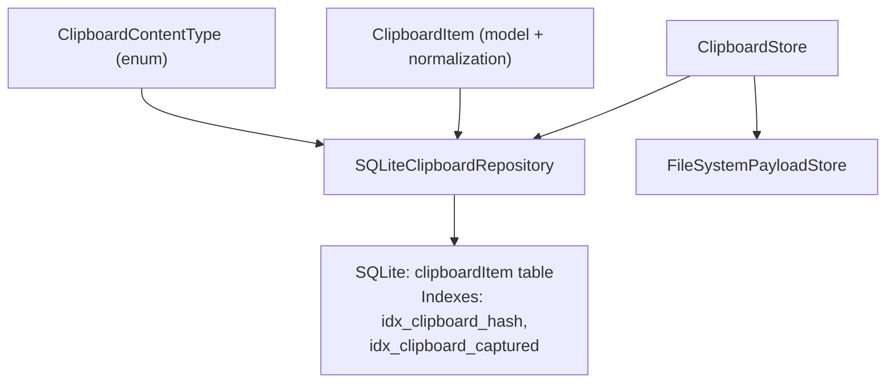
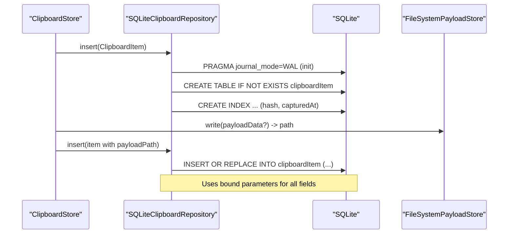
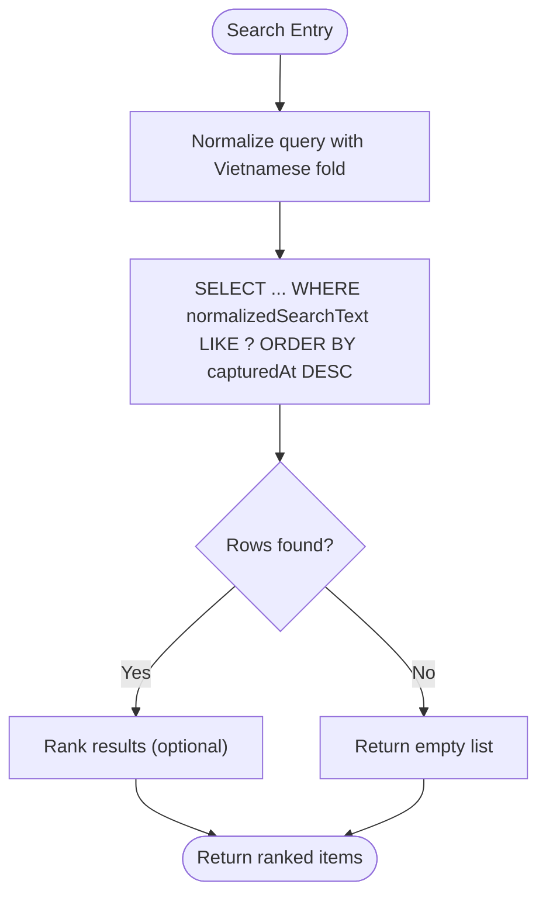
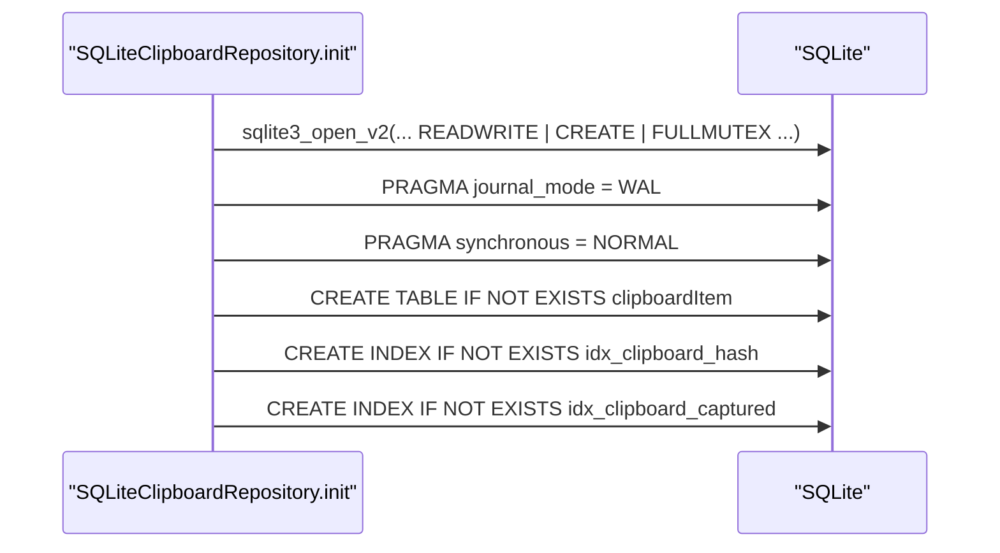
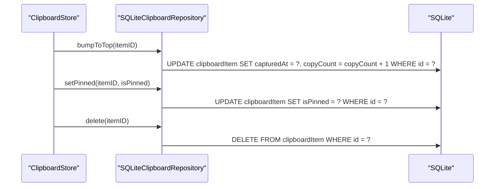
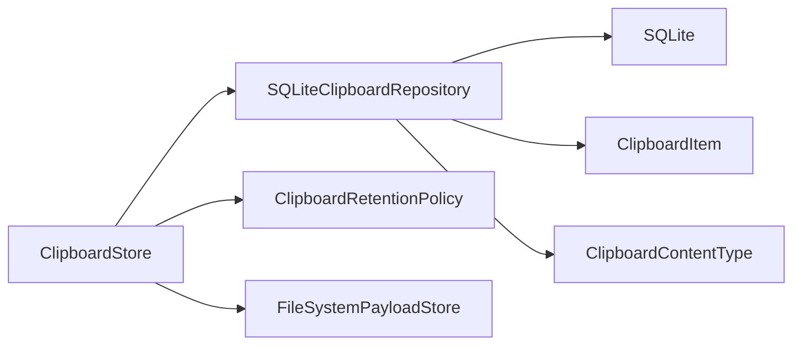

# SQLite Database Schema

<cite>
**Referenced Files in This Document**
- [SQLiteClipboardRepository.swift](file://macos/skey-app/Sources/Features/Clipboard/Services/SQLiteClipboardRepository.swift)
- [ClipboardItem.swift](file://macos/skey-app/Sources/Features/Clipboard/Models/ClipboardItem.swift)
- [ClipboardStore.swift](file://macos/skey-app/Sources/Features/Clipboard/Services/ClipboardStore.swift)
- [PayloadStoring.swift](file://macos/skey-app/Sources/Features/Clipboard/Services/PayloadStoring.swift)
- [ClipboardEnums.swift](file://macos/skey-app/Sources/Features/Clipboard/Models/ClipboardEnums.swift)
</cite>

## Table of Contents
1. [Introduction](#introduction)
2. [Project Structure](#project-structure)
3. [Core Components](#core-components)
4. [Architecture Overview](#architecture-overview)
5. [Detailed Component Analysis](#detailed-component-analysis)
6. [Dependency Analysis](#dependency-analysis)
7. [Performance Considerations](#performance-considerations)
8. [Troubleshooting Guide](#troubleshooting-guide)
9. [Conclusion](#conclusion)
10. [Appendices](#appendices)

## Introduction
This document describes the SQLite database schema used by the clipboard storage system, focusing on the clipboardItem table and its supporting indexes. It explains each field’s purpose, data types, constraints, validation rules, relationships to other components, and how search is implemented using a normalized text field. It also covers database initialization, WAL mode configuration, and concurrent access considerations.

## Project Structure
The clipboard subsystem is implemented in Swift with a repository pattern that abstracts persistence behind an interface. The SQLite implementation lives in a dedicated repository class that creates and manages the clipboardItem table and related indexes. Data models define the in-memory representation and normalization logic for search. A store orchestrates capture, retention, caching, and persistence, while payload storage is delegated to a file-based store.

**Diagram sources**
- [SQLiteClipboardRepository.swift:34-54](file://macos/skey-app/Sources/Features/Clipboard/Services/SQLiteClipboardRepository.swift#L34-L54)
- [ClipboardStore.swift:68-113](file://macos/skey-app/Sources/Features/Clipboard/Services/ClipboardStore.swift#L68-L113)
- [PayloadStoring.swift:13-41](file://macos/skey-app/Sources/Features/Clipboard/Services/PayloadStoring.swift#L13-L41)
- [ClipboardItem.swift:5-62](file://macos/skey-app/Sources/Features/Clipboard/Models/ClipboardItem.swift#L5-L62)
- [ClipboardEnums.swift:7-12](file://macos/skey-app/Sources/Features/Clipboard/Models/ClipboardEnums.swift#L7-L12)

**Section sources**
- [SQLiteClipboardRepository.swift:10-55](file://macos/skey-app/Sources/Features/Clipboard/Services/SQLiteClipboardRepository.swift#L10-L55)
- [ClipboardStore.swift:18-44](file://macos/skey-app/Sources/Features/Clipboard/Services/ClipboardStore.swift#L18-L44)
- [PayloadStoring.swift:13-41](file://macos/skey-app/Sources/Features/Clipboard/Services/PayloadStoring.swift#L13-L41)
- [ClipboardItem.swift:5-62](file://macos/skey-app/Sources/Features/Clipboard/Models/ClipboardItem.swift#L5-L62)
- [ClipboardEnums.swift:7-12](file://macos/skey-app/Sources/Features/Clipboard/Models/ClipboardEnums.swift#L7-L12)

## Core Components
- clipboardItem table: stores persisted clipboard entries with metadata, optional full payloads, and search support.
- Indexes: optimize lookups by content hash and time ordering.
- Repository layer: handles connection setup, schema creation, queries, and mutations.
- Model layer: defines ClipboardItem fields and Vietnamese-aware normalization for search.
- Store layer: coordinates capture decisions, caching, and persistence; integrates with payload storage.

Key responsibilities:
- Initialization and schema creation are performed when the repository opens the database.
- Insert uses upsert semantics via INSERT OR REPLACE keyed by id.
- Search uses LIKE against normalizedSearchText after folding input similarly.
- Time fields are stored as doubles representing seconds since epoch.
- Boolean flags are stored as integers (0/1).

**Section sources**
- [SQLiteClipboardRepository.swift:34-54](file://macos/skey-app/Sources/Features/Clipboard/Services/SQLiteClipboardRepository.swift#L34-L54)
- [SQLiteClipboardRepository.swift:69-122](file://macos/skey-app/Sources/Features/Clipboard/Services/SQLiteClipboardRepository.swift#L69-L122)
- [SQLiteClipboardRepository.swift:126-156](file://macos/skey-app/Sources/Features/Clipboard/Services/SQLiteClipboardRepository.swift#L126-L156)
- [ClipboardItem.swift:5-62](file://macos/skey-app/Sources/Features/Clipboard/Models/ClipboardItem.swift#L5-L62)

## Architecture Overview
The clipboard flow involves capturing candidates, deciding whether to retain full or metadata-only, persisting to SQLite, and optionally storing large payloads on disk. Search leverages a pre-normalized text column to enable fast, diacritic-insensitive matching.

**Diagram sources**
- [SQLiteClipboardRepository.swift:29-54](file://macos/skey-app/Sources/Features/Clipboard/Services/SQLiteClipboardRepository.swift#L29-L54)
- [SQLiteClipboardRepository.swift:69-122](file://macos/skey-app/Sources/Features/Clipboard/Services/SQLiteClipboardRepository.swift#L69-L122)
- [ClipboardStore.swift:86-113](file://macos/skey-app/Sources/Features/Clipboard/Services/ClipboardStore.swift#L86-L113)
- [PayloadStoring.swift:26-31](file://macos/skey-app/Sources/Features/Clipboard/Services/PayloadStoring.swift#L26-L31)

## Detailed Component Analysis

### clipboardItem Table Schema
- id: TEXT PRIMARY KEY — unique identifier for each entry (UUID string).
- contentType: TEXT NOT NULL — type of content (plainText, richText, image, fileReference).
- contentHash: TEXT NOT NULL — hash used to detect duplicates or reuse existing items.
- textContent: TEXT — optional raw text content.
- payloadPath: TEXT — optional path to full payload stored on disk.
- payloadSizeBytes: INTEGER NOT NULL — size of payload in bytes.
- hasFullPayload: INTEGER NOT NULL — boolean flag indicating if full payload is available.
- previewText: TEXT NOT NULL — short preview shown in UI.
- sourceBundleID: TEXT — optional originating application bundle identifier.
- capturedAt: DOUBLE NOT NULL — timestamp of capture (seconds since epoch).
- isPinned: INTEGER NOT NULL DEFAULT 0 — pinning flag for keeping items at top.
- firstCopiedAt: DOUBLE NOT NULL — timestamp when item was first copied.
- copyCount: INTEGER NOT NULL DEFAULT 1 — number of times item was reused/bumped.
- normalizedSearchText: TEXT NOT NULL DEFAULT '' — folded text for search.

Constraints and validation:
- Primary key on id ensures uniqueness.
- NOT NULL constraints enforce required fields.
- Defaults provided for isPinned, copyCount, and normalizedSearchText.
- Boolean fields are stored as integers (0/1).
- Timestamps are stored as doubles (seconds since epoch).

Relationships:
- contentHash links to duplicate detection and bumping behavior.
- payloadPath references an external file managed by FileSystemPayloadStore.
- contentType enumerates supported content kinds.

Typical data entry example (conceptual):
- id: UUID string
- contentType: "image"
- contentHash: SHA-like hash string
- textContent: null
- payloadPath: "a1b2c3d4-..."
- payloadSizeBytes: 123456
- hasFullPayload: 1
- previewText: "Image (120 KB)"
- sourceBundleID: "com.example.app"
- capturedAt: 1710000000.0
- isPinned: 0
- firstCopiedAt: 1710000000.0
- copyCount: 1
- normalizedSearchText: "image 120 kb"

**Section sources**
- [SQLiteClipboardRepository.swift:34-54](file://macos/skey-app/Sources/Features/Clipboard/Services/SQLiteClipboardRepository.swift#L34-L54)
- [ClipboardEnums.swift:7-12](file://macos/skey-app/Sources/Features/Clipboard/Models/ClipboardEnums.swift#L7-L12)
- [PayloadStoring.swift:13-41](file://macos/skey-app/Sources/Features/Clipboard/Services/PayloadStoring.swift#L13-L41)

### Indexes
- idx_clipboard_hash ON clipboardItem(contentHash): supports efficient duplicate detection and bump-to-top operations based on contentHash.
- idx_clipboard_captured ON clipboardItem(capturedAt): supports ordered retrieval by capture time and recent-first queries.

These indexes improve performance for common operations such as fetching history ordered by time and locating existing items by hash.

**Section sources**
- [SQLiteClipboardRepository.swift:51-52](file://macos/skey-app/Sources/Features/Clipboard/Services/SQLiteClipboardRepository.swift#L51-L52)

### Search Functionality via normalizedSearchText
- Input query is normalized using the same Vietnamese-aware folding applied to stored text.
- Queries use LIKE against normalizedSearchText to match substrings case- and diacritic-insensitively.
- A backfill routine can populate normalizedSearchText for existing rows by combining textContent and previewText and applying the same folding function.

**Diagram sources**
- [SQLiteClipboardRepository.swift:126-156](file://macos/skey-app/Sources/Features/Clipboard/Services/SQLiteClipboardRepository.swift#L126-L156)
- [ClipboardItem.swift:55-62](file://macos/skey-app/Sources/Features/Clipboard/Models/ClipboardItem.swift#L55-L62)
- [SQLiteClipboardRepository.swift:267-299](file://macos/skey-app/Sources/Features/Clipboard/Services/SQLiteClipboardRepository.swift#L267-L299)

**Section sources**
- [SQLiteClipboardRepository.swift:126-156](file://macos/skey-app/Sources/Features/Clipboard/Services/SQLiteClipboardRepository.swift#L126-L156)
- [SQLiteClipboardRepository.swift:267-299](file://macos/skey-app/Sources/Features/Clipboard/Services/SQLiteClipboardRepository.swift#L267-L299)
- [ClipboardItem.swift:55-62](file://macos/skey-app/Sources/Features/Clipboard/Models/ClipboardItem.swift#L55-L62)

### Database Initialization and Configuration
- Connection: opened with read-write, create-if-missing, and full mutex flags for thread safety.
- WAL mode: enabled to allow concurrent readers without blocking writers.
- Synchronous: set to NORMAL to balance durability and performance.
- Schema: table and indexes are created if not present during initialization.

**Diagram sources**
- [SQLiteClipboardRepository.swift:21-54](file://macos/skey-app/Sources/Features/Clipboard/Services/SQLiteClipboardRepository.swift#L21-L54)

**Section sources**
- [SQLiteClipboardRepository.swift:21-54](file://macos/skey-app/Sources/Features/Clipboard/Services/SQLiteClipboardRepository.swift#L21-L54)

### Concurrent Access Considerations
- Full mutex mode: enables safe concurrent access from multiple threads.
- Dedicated serial queue: all SQLite operations are executed on a single background queue to serialize writes and reads safely.
- WAL mode: improves concurrency by allowing readers to proceed while writers update.
- Asynchronous API: repository methods return async continuations, decoupling UI from DB work.

**Section sources**
- [SQLiteClipboardRepository.swift:8-31](file://macos/skey-app/Sources/Features/Clipboard/Services/SQLiteClipboardRepository.swift#L8-L31)
- [SQLiteClipboardRepository.swift:69-122](file://macos/skey-app/Sources/Features/Clipboard/Services/SQLiteClipboardRepository.swift#L69-L122)

### Data Flow and Mutations
- Insert: binds all fields including normalizedSearchText; uses INSERT OR REPLACE keyed by id.
- Fetch: returns all items ordered by capturedAt; supports filtering by normalizedSearchText.
- Bump to top: updates capturedAt and increments copyCount atomically.
- Pin toggle: updates isPinned per item.
- Delete: removes by id; deleteAll clears the table.
- Backfill: recomputes normalizedSearchText for legacy rows.

**Diagram sources**
- [SQLiteClipboardRepository.swift:205-256](file://macos/skey-app/Sources/Features/Clipboard/Services/SQLiteClipboardRepository.swift#L205-L256)

**Section sources**
- [SQLiteClipboardRepository.swift:69-122](file://macos/skey-app/Sources/Features/Clipboard/Services/SQLiteClipboardRepository.swift#L69-L122)
- [SQLiteClipboardRepository.swift:205-256](file://macos/skey-app/Sources/Features/Clipboard/Services/SQLiteClipboardRepository.swift#L205-L256)

## Dependency Analysis
- ClipboardStore depends on:
  - ClipboardRepository (implemented by SQLiteClipboardRepository or InMemoryClipboardRepository).
  - PayloadStoring (FileSystemPayloadStore for persistent payloads).
  - ClipboardRetentionPolicy (not detailed here) to decide retention.
- SQLiteClipboardRepository depends on:
  - SQLite3 C API for direct database operations.
  - ClipboardItem model for serialization/deserialization.
  - ClipboardContentType enum for mapping to TEXT values.

**Diagram sources**
- [ClipboardStore.swift:18-44](file://macos/skey-app/Sources/Features/Clipboard/Services/ClipboardStore.swift#L18-L44)
- [SQLiteClipboardRepository.swift:6-55](file://macos/skey-app/Sources/Features/Clipboard/Services/SQLiteClipboardRepository.swift#L6-L55)
- [PayloadStoring.swift:13-41](file://macos/skey-app/Sources/Features/Clipboard/Services/PayloadStoring.swift#L13-L41)
- [ClipboardEnums.swift:7-12](file://macos/skey-app/Sources/Features/Clipboard/Models/ClipboardEnums.swift#L7-L12)

**Section sources**
- [ClipboardStore.swift:18-44](file://macos/skey-app/Sources/Features/Clipboard/Services/ClipboardStore.swift#L18-L44)
- [SQLiteClipboardRepository.swift:6-55](file://macos/skey-app/Sources/Features/Clipboard/Services/SQLiteClipboardRepository.swift#L6-L55)
- [PayloadStoring.swift:13-41](file://macos/skey-app/Sources/Features/Clipboard/Services/PayloadStoring.swift#L13-L41)
- [ClipboardEnums.swift:7-12](file://macos/skey-app/Sources/Features/Clipboard/Models/ClipboardEnums.swift#L7-L12)

## Performance Considerations
- WAL mode reduces locking contention and allows concurrent reads.
- Synchronous = NORMAL balances crash safety with throughput.
- Index on contentHash accelerates duplicate detection and bump operations.
- Index on capturedAt optimizes time-ordered queries and recent-first listing.
- Using normalizedSearchText avoids expensive runtime transformations during search.
- Serializing all DB operations on a single queue prevents race conditions and simplifies error handling.

[No sources needed since this section provides general guidance]

## Troubleshooting Guide
Common issues and mitigations:
- Initialization errors: check open flags and directory permissions for creating the database under Application Support.
- Write failures: inspect prepared statement execution and step results; ensure proper binding of all parameters.
- Search anomalies: verify that both query and stored normalizedSearchText use the same Vietnamese folding process; run backfill to repair missing values.
- Concurrency problems: confirm operations run on the repository’s serial queue and that WAL mode is active.

Operational tips:
- Use fetchAllForPolicyEvaluation to retrieve all items for retention pruning.
- Ensure payload files are deleted alongside DB records to avoid orphaned files.
- Monitor copyCount and capturedAt changes when bumping items to validate correctness.

**Section sources**
- [SQLiteClipboardRepository.swift:21-31](file://macos/skey-app/Sources/Features/Clipboard/Services/SQLiteClipboardRepository.swift#L21-L31)
- [SQLiteClipboardRepository.swift:69-122](file://macos/skey-app/Sources/Features/Clipboard/Services/SQLiteClipboardRepository.swift#L69-L122)
- [SQLiteClipboardRepository.swift:267-299](file://macos/skey-app/Sources/Features/Clipboard/Services/SQLiteClipboardRepository.swift#L267-L299)
- [ClipboardStore.swift:165-193](file://macos/skey-app/Sources/Features/Clipboard/Services/ClipboardStore.swift#L165-L193)

## Conclusion
The clipboardItem table provides a robust, indexed schema for storing clipboard entries with metadata, optional full payloads, and optimized search capabilities. WAL mode and a serial queue ensure safe concurrent access, while normalizedSearchText enables fast, locale-aware substring searches. The repository pattern cleanly separates persistence concerns from higher-level orchestration in the store layer.

[No sources needed since this section summarizes without analyzing specific files]

## Appendices

### Field Reference Summary
- id: TEXT PRIMARY KEY — unique identifier
- contentType: TEXT NOT NULL — content kind
- contentHash: TEXT NOT NULL — duplicate/reuse key
- textContent: TEXT — optional raw text
- payloadPath: TEXT — optional disk path to full payload
- payloadSizeBytes: INTEGER NOT NULL — payload size
- hasFullPayload: INTEGER NOT NULL — presence of full payload
- previewText: TEXT NOT NULL — UI preview
- sourceBundleID: TEXT — optional app identifier
- capturedAt: DOUBLE NOT NULL — capture time
- isPinned: INTEGER NOT NULL DEFAULT 0 — pin flag
- firstCopiedAt: DOUBLE NOT NULL — first copy time
- copyCount: INTEGER NOT NULL DEFAULT 1 — reuse count
- normalizedSearchText: TEXT NOT NULL DEFAULT '' — search index

[No sources needed since this section lists fields already analyzed above]