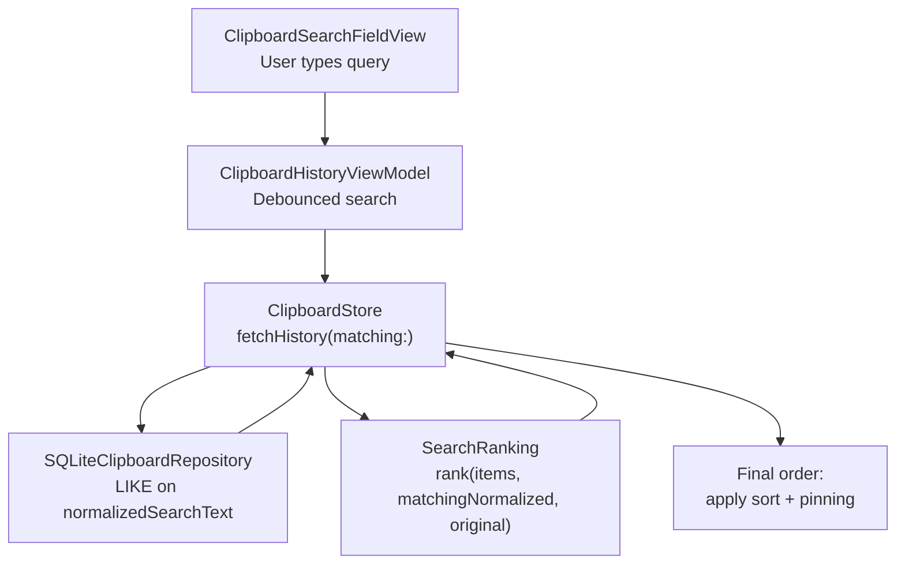
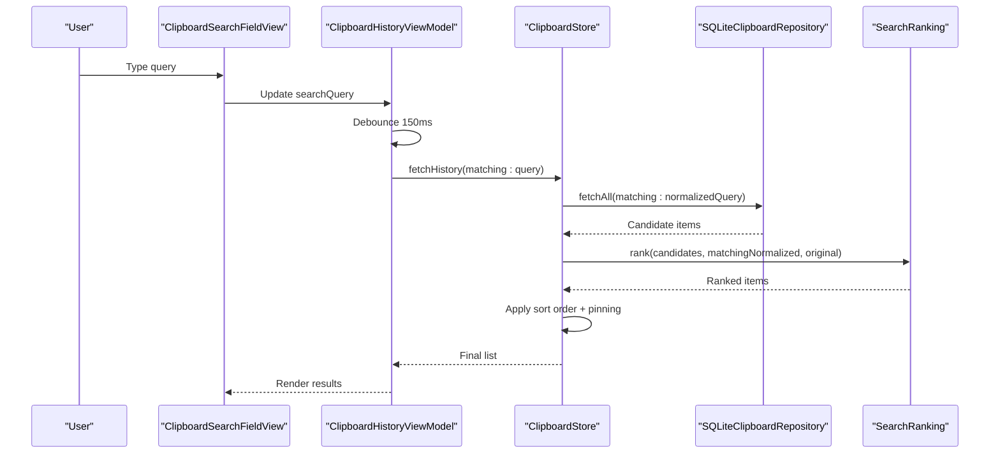
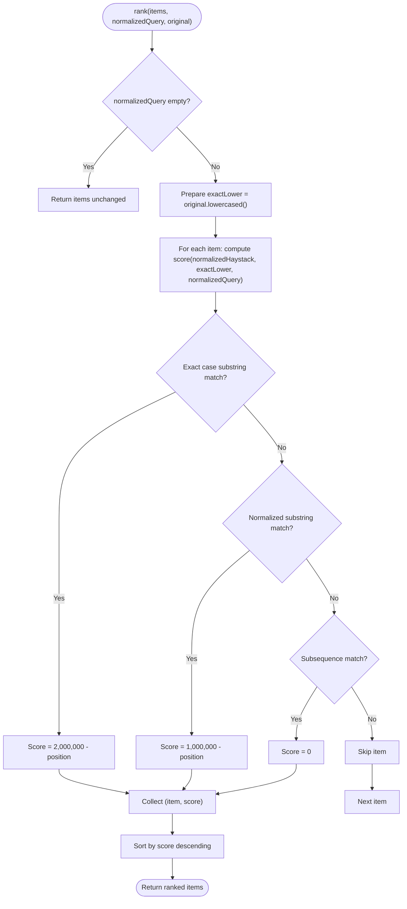
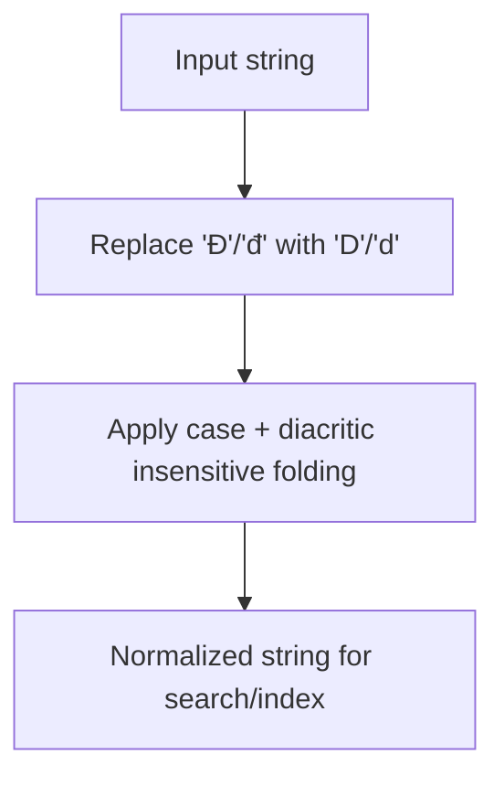
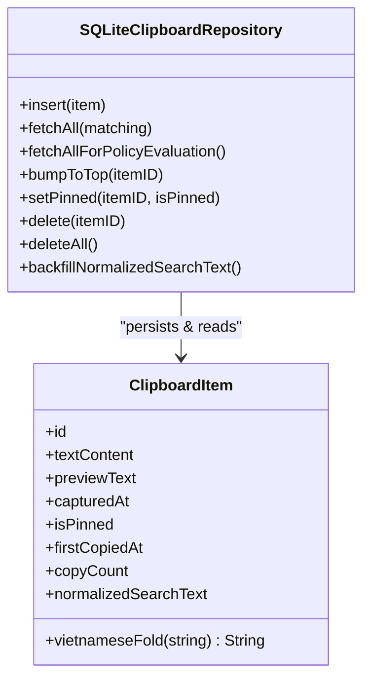
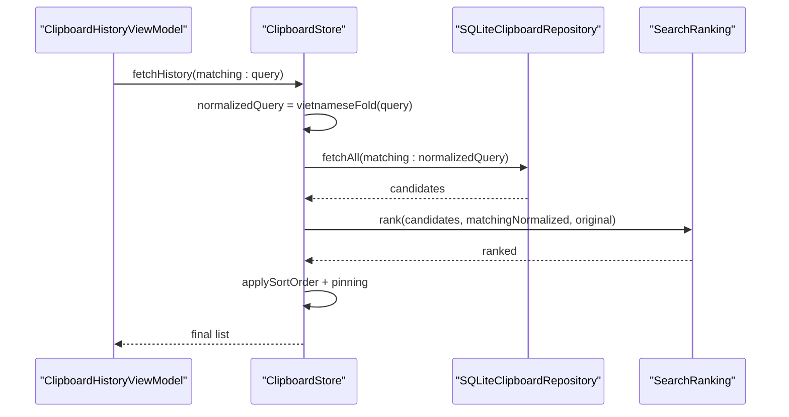
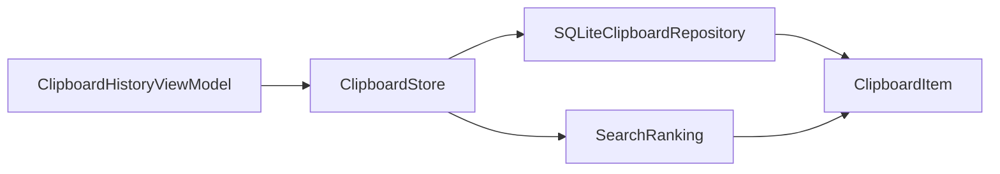

# Search Ranking Algorithm

<cite>
**Referenced Files in This Document**
- [SearchRanking.swift](file://macos/skey-app/Sources/Features/Clipboard/Services/SearchRanking.swift)
- [ClipboardItem.swift](file://macos/skey-app/Sources/Features/Clipboard/Models/ClipboardItem.swift)
- [SQLiteClipboardRepository.swift](file://macos/skey-app/Sources/Features/Clipboard/Services/SQLiteClipboardRepository.swift)
- [ClipboardStore.swift](file://macos/skey-app/Sources/Features/Clipboard/Services/ClipboardStore.swift)
- [ClipboardHistoryViewModel.swift](file://macos/skey-app/Sources/Features/Clipboard/UI/ViewModels/ClipboardHistoryViewModel.swift)
- [ClipboardSearchFieldView.swift](file://macos/skey-app/Sources/Features/Clipboard/UI/Views/ClipboardSearchFieldView.swift)
</cite>

## Table of Contents
1. [Introduction](#introduction)
2. [Project Structure](#project-structure)
3. [Core Components](#core-components)
4. [Architecture Overview](#architecture-overview)
5. [Detailed Component Analysis](#detailed-component-analysis)
6. [Dependency Analysis](#dependency-analysis)
7. [Performance Considerations](#performance-considerations)
8. [Troubleshooting Guide](#troubleshooting-guide)
9. [Conclusion](#conclusion)
10. [Appendices](#appendices)

## Introduction
This document explains the search ranking algorithm used for clipboard history queries. It covers how results are ordered by relevance, including exact substring matches, normalized (diacritic-insensitive) matches, and subsequence matches. It also documents Vietnamese text normalization via a folding function that improves search accuracy by handling diacritics and special characters. The document includes concrete examples from the codebase showing query construction, ranking calculations, and result sorting, as well as performance considerations, indexing strategies, and extensibility points for future improvements.

## Project Structure
The search ranking system spans several components:
- UI triggers search input changes and debounces them to avoid excessive work.
- ClipboardStore coordinates fetching candidates from storage and applies ranking and final ordering.
- SQLiteClipboardRepository performs fast pre-filtering using an indexed normalized column.
- SearchRanking computes per-item scores based on match type and position.
- ClipboardItem provides Vietnamese text folding used for both indexing and querying.

**Diagram sources**
- [ClipboardSearchFieldView.swift:76-123](file://macos/skey-app/Sources/Features/Clipboard/UI/Views/ClipboardSearchFieldView.swift#L76-L123)
- [ClipboardHistoryViewModel.swift:207-236](file://macos/skey-app/Sources/Features/Clipboard/UI/ViewModels/ClipboardHistoryViewModel.swift#L207-L236)
- [ClipboardStore.swift:115-134](file://macos/skey-app/Sources/Features/Clipboard/Services/ClipboardStore.swift#L115-L134)
- [SQLiteClipboardRepository.swift:126-156](file://macos/skey-app/Sources/Features/Clipboard/Services/SQLiteClipboardRepository.swift#L126-L156)
- [SearchRanking.swift:9-29](file://macos/skey-app/Sources/Features/Clipboard/Services/SearchRanking.swift#L9-L29)

**Section sources**
- [ClipboardSearchFieldView.swift:76-123](file://macos/skey-app/Sources/Features/Clipboard/UI/Views/ClipboardSearchFieldView.swift#L76-L123)
- [ClipboardHistoryViewModel.swift:207-236](file://macos/skey-app/Sources/Features/Clipboard/UI/ViewModels/ClipboardHistoryViewModel.swift#L207-L236)
- [ClipboardStore.swift:115-134](file://macos/skey-app/Sources/Features/Clipboard/Services/ClipboardStore.swift#L115-L134)
- [SQLiteClipboardRepository.swift:126-156](file://macos/skey-app/Sources/Features/Clipboard/Services/SQLiteClipboardRepository.swift#L126-L156)
- [SearchRanking.swift:9-29](file://macos/skey-app/Sources/Features/Clipboard/Services/SearchRanking.swift#L9-L29)

## Core Components
- SearchRanking: Computes relevance scores for each candidate item based on match type and position.
- ClipboardItem.vietnameseFold: Normalizes text for diacritic-insensitive searching and handles special Vietnamese characters.
- SQLiteClipboardRepository: Stores items with a precomputed normalizedSearchText and uses LIKE queries for fast filtering.
- ClipboardStore: Orchestrates fetching, ranking, and final ordering; integrates user preferences for sort order and pinning.
- ClipboardHistoryViewModel: Debounces user input and triggers search.

Key responsibilities:
- Pre-filtering at the database layer reduces the dataset before scoring.
- Scoring prioritizes exact case substring matches, then normalized substring matches, then subsequence matches.
- Final ordering respects user preferences and pins top items.

**Section sources**
- [SearchRanking.swift:9-63](file://macos/skey-app/Sources/Features/Clipboard/Services/SearchRanking.swift#L9-L63)
- [ClipboardItem.swift:55-61](file://macos/skey-app/Sources/Features/Clipboard/Models/ClipboardItem.swift#L55-L61)
- [SQLiteClipboardRepository.swift:34-54](file://macos/skey-app/Sources/Features/Clipboard/Services/SQLiteClipboardRepository.swift#L34-L54)
- [ClipboardStore.swift:115-145](file://macos/skey-app/Sources/Features/Clipboard/Services/ClipboardStore.swift#L115-L145)
- [ClipboardHistoryViewModel.swift:207-236](file://macos/skey-app/Sources/Features/Clipboard/UI/ViewModels/ClipboardHistoryViewModel.swift#L207-L236)

## Architecture Overview
The end-to-end flow for a search operation:

**Diagram sources**
- [ClipboardSearchFieldView.swift:76-123](file://macos/skey-app/Sources/Features/Clipboard/UI/Views/ClipboardSearchFieldView.swift#L76-L123)
- [ClipboardHistoryViewModel.swift:207-236](file://macos/skey-app/Sources/Features/Clipboard/UI/ViewModels/ClipboardHistoryViewModel.swift#L207-L236)
- [ClipboardStore.swift:115-134](file://macos/skey-app/Sources/Features/Clipboard/Services/ClipboardStore.swift#L115-L134)
- [SQLiteClipboardRepository.swift:126-156](file://macos/skey-app/Sources/Features/Clipboard/Services/SQLiteClipboardRepository.swift#L126-L156)
- [SearchRanking.swift:9-29](file://macos/skey-app/Sources/Features/Clipboard/Services/SearchRanking.swift#L9-L29)

## Detailed Component Analysis

### SearchRanking: Relevance Scoring
- Exact case substring match: Highest priority score derived from position within the normalized haystack. Earlier positions yield higher scores.
- Normalized substring match: Second priority; also scored by position but with a lower base value than exact matches.
- Subsequence match: Lowest priority; returns a minimal score if all characters appear in order.

Implementation highlights:
- Uses pre-normalized haystacks to avoid repeated folding during ranking.
- Score calculation is O(n) per item for substring checks plus O(n) for subsequence check in the worst case.
- Sorting is performed once over matched items.

**Diagram sources**
- [SearchRanking.swift:9-63](file://macos/skey-app/Sources/Features/Clipboard/Services/SearchRanking.swift#L9-L63)

**Section sources**
- [SearchRanking.swift:9-63](file://macos/skey-app/Sources/Features/Clipboard/Services/SearchRanking.swift#L9-L63)

### Vietnamese Text Normalization (VietnameseFold)
- Purpose: Normalize text for diacritic-insensitive search and handle special Vietnamese characters.
- Process:
  - Replace special Vietnamese characters (e.g., Đ/đ) with base letters (D/d).
  - Apply case-insensitive and diacritic-insensitive folding using the current locale.
- Usage:
  - Applied when constructing normalizedSearchText for each ClipboardItem.
  - Applied to user queries before database filtering and ranking.

**Diagram sources**
- [ClipboardItem.swift:55-61](file://macos/skey-app/Sources/Features/Clipboard/Models/ClipboardItem.swift#L55-L61)

**Section sources**
- [ClipboardItem.swift:55-61](file://macos/skey-app/Sources/Features/Clipboard/Models/ClipboardItem.swift#L55-L61)

### Storage and Indexing Strategy
- Database schema stores normalizedSearchText alongside other metadata.
- Indexes:
  - Hash index for content deduplication.
  - capturedAt index for time-based ordering.
- Query strategy:
  - For non-empty queries, use LIKE on normalizedSearchText to pre-filter candidates quickly.
  - For empty queries, return all items and apply in-memory sorting and pinning.

**Diagram sources**
- [SQLiteClipboardRepository.swift:34-54](file://macos/skey-app/Sources/Features/Clipboard/Services/SQLiteClipboardRepository.swift#L34-L54)
- [SQLiteClipboardRepository.swift:126-156](file://macos/skey-app/Sources/Features/Clipboard/Services/SQLiteClipboardRepository.swift#L126-L156)
- [ClipboardItem.swift:6-61](file://macos/skey-app/Sources/Features/Clipboard/Models/ClipboardItem.swift#L6-L61)

**Section sources**
- [SQLiteClipboardRepository.swift:34-54](file://macos/skey-app/Sources/Features/Clipboard/Services/SQLiteClipboardRepository.swift#L34-L54)
- [SQLiteClipboardRepository.swift:126-156](file://macos/skey-app/Sources/Features/Clipboard/Services/SQLiteClipboardRepository.swift#L126-L156)
- [ClipboardItem.swift:6-61](file://macos/skey-app/Sources/Features/Clipboard/Models/ClipboardItem.swift#L6-L61)

### Integration Points and Flow Control
- ClipboardHistoryViewModel debounces search input to reduce load.
- ClipboardStore orchestrates:
  - Normalizing the query.
  - Fetching candidates via repository.
  - Applying SearchRanking.
  - Applying user preferences (sort order and pinning).

**Diagram sources**
- [ClipboardHistoryViewModel.swift:207-236](file://macos/skey-app/Sources/Features/Clipboard/UI/ViewModels/ClipboardHistoryViewModel.swift#L207-L236)
- [ClipboardStore.swift:115-134](file://macos/skey-app/Sources/Features/Clipboard/Services/ClipboardStore.swift#L115-L134)
- [SQLiteClipboardRepository.swift:126-156](file://macos/skey-app/Sources/Features/Clipboard/Services/SQLiteClipboardRepository.swift#L126-L156)
- [SearchRanking.swift:9-29](file://macos/skey-app/Sources/Features/Clipboard/Services/SearchRanking.swift#L9-L29)

**Section sources**
- [ClipboardHistoryViewModel.swift:207-236](file://macos/skey-app/Sources/Features/Clipboard/UI/ViewModels/ClipboardHistoryViewModel.swift#L207-L236)
- [ClipboardStore.swift:115-134](file://macos/skey-app/Sources/Features/Clipboard/Services/ClipboardStore.swift#L115-L134)

## Dependency Analysis
- ClipboardHistoryViewModel depends on ClipboardStore for data operations.
- ClipboardStore depends on ClipboardRepository (SQLite or in-memory), SearchRanking, and user settings for sort order.
- SQLiteClipboardRepository depends on ClipboardItem for persisted fields and normalization.
- SearchRanking depends on ClipboardItem’s normalizedSearchText and VietnameseFold behavior.

**Diagram sources**
- [ClipboardHistoryViewModel.swift:207-236](file://macos/skey-app/Sources/Features/Clipboard/UI/ViewModels/ClipboardHistoryViewModel.swift#L207-L236)
- [ClipboardStore.swift:115-134](file://macos/skey-app/Sources/Features/Clipboard/Services/ClipboardStore.swift#L115-L134)
- [SQLiteClipboardRepository.swift:126-156](file://macos/skey-app/Sources/Features/Clipboard/Services/SQLiteClipboardRepository.swift#L126-L156)
- [SearchRanking.swift:9-29](file://macos/skey-app/Sources/Features/Clipboard/Services/SearchRanking.swift#L9-L29)
- [ClipboardItem.swift:55-61](file://macos/skey-app/Sources/Features/Clipboard/Models/ClipboardItem.swift#L55-L61)

**Section sources**
- [ClipboardHistoryViewModel.swift:207-236](file://macos/skey-app/Sources/Features/Clipboard/UI/ViewModels/ClipboardHistoryViewModel.swift#L207-L236)
- [ClipboardStore.swift:115-134](file://macos/skey-app/Sources/Features/Clipboard/Services/ClipboardStore.swift#L115-L134)
- [SQLiteClipboardRepository.swift:126-156](file://macos/skey-app/Sources/Features/Clipboard/Services/SQLiteClipboardRepository.swift#L126-L156)
- [SearchRanking.swift:9-29](file://macos/skey-app/Sources/Features/Clipboard/Services/SearchRanking.swift#L9-L29)
- [ClipboardItem.swift:55-61](file://macos/skey-app/Sources/Features/Clipboard/Models/ClipboardItem.swift#L55-L61)

## Performance Considerations
- Pre-filtering with LIKE on normalizedSearchText reduces the number of items passed to ranking, improving responsiveness.
- Debouncing search input (150 ms) prevents excessive re-runs during rapid typing.
- In-memory caching in ClipboardStore avoids repeated DB reads when no query is present.
- WAL mode and synchronous pragmas improve concurrency and crash safety for SQLite.
- Subsequence matching is O(n) per item; consider limiting max items processed or adding early exits for very long strings.

Optimization techniques:
- Keep normalizedSearchText concise (e.g., trim whitespace, limit length) to reduce comparison costs.
- Use indexes judiciously; capturedAt index supports time-based ordering without full scans.
- Consider token-based indexing for multi-word queries if needed in the future.

[No sources needed since this section provides general guidance]

## Troubleshooting Guide
Common issues and resolutions:
- Empty query returns unranked list: Ensure store initializes cache and applies sort order correctly.
- Unexpected results after changing language/locale: VietnameseFold relies on locale; verify consistent locale usage across folds.
- Slow searches with large histories: Validate LIKE pattern usage and consider additional indexing or tokenization strategies.
- Pinned items not appearing at top: Confirm final sorting step applies pinning after ranking.

Verification steps:
- Inspect normalizedSearchText values to ensure correct folding.
- Log query normalization and candidate counts to understand filtering effectiveness.
- Test edge cases: mixed diacritics, special characters, empty inputs.

**Section sources**
- [ClipboardStore.swift:115-134](file://macos/skey-app/Sources/Features/Clipboard/Services/ClipboardStore.swift#L115-L134)
- [ClipboardItem.swift:55-61](file://macos/skey-app/Sources/Features/Clipboard/Models/ClipboardItem.swift#L55-L61)
- [SQLiteClipboardRepository.swift:126-156](file://macos/skey-app/Sources/Features/Clipboard/Services/SQLiteClipboardRepository.swift#L126-L156)

## Conclusion
The search ranking system combines efficient database pre-filtering with precise in-memory scoring to deliver relevant results quickly. Vietnamese text normalization ensures robust matching across diacritics and special characters. The design balances performance and accuracy through debounced input, indexed storage, and layered ranking. Extensibility points include customizable scoring weights, integration of frequency/recency signals, and user preference-driven adjustments.

[No sources needed since this section summarizes without analyzing specific files]

## Appendices

### Concrete Examples from Codebase
- Query construction:
  - Normalized query created via ClipboardItem.vietnameseFold before DB filtering.
  - LIKE pattern applied to normalizedSearchText for fast candidate retrieval.
- Ranking calculations:
  - Exact case substring match yields highest scores based on position.
  - Normalized substring match yields secondary scores based on position.
  - Subsequence match yields minimal scores for partial matches.
- Result sorting:
  - Ranked results are sorted by score descending.
  - Final ordering applies user sort order and pins items to top/bottom based on settings.

**Section sources**
- [ClipboardStore.swift:115-134](file://macos/skey-app/Sources/Features/Clipboard/Services/ClipboardStore.swift#L115-L134)
- [SearchRanking.swift:9-63](file://macos/skey-app/Sources/Features/Clipboard/Services/SearchRanking.swift#L9-L63)
- [SQLiteClipboardRepository.swift:126-156](file://macos/skey-app/Sources/Features/Clipboard/Services/SQLiteClipboardRepository.swift#L126-L156)

### Custom Ranking Weights and User Preferences
- Current implementation uses fixed weights for match types and position-based offsets.
- User preferences influence final ordering via sort order and pin placement.
- Extensibility points:
  - Introduce configurable weights for recency, frequency, and pin status.
  - Add feature flags to enable/disable subsequence matching.
  - Allow user-defined boosting factors for specific sources or content types.

**Section sources**
- [ClipboardStore.swift:136-145](file://macos/skey-app/Sources/Features/Clipboard/Services/ClipboardStore.swift#L136-L145)
- [SearchRanking.swift:31-63](file://macos/skey-app/Sources/Features/Clipboard/Services/SearchRanking.swift#L31-L63)