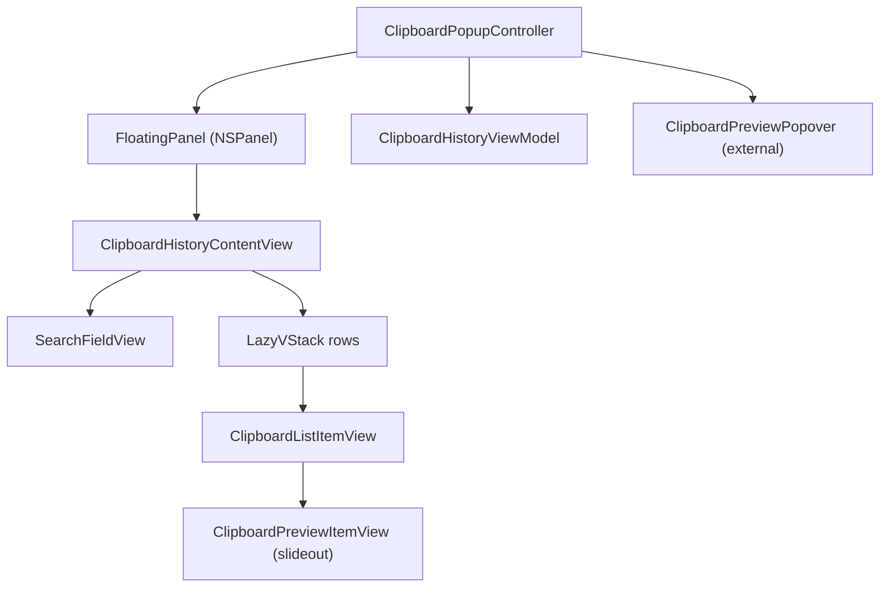
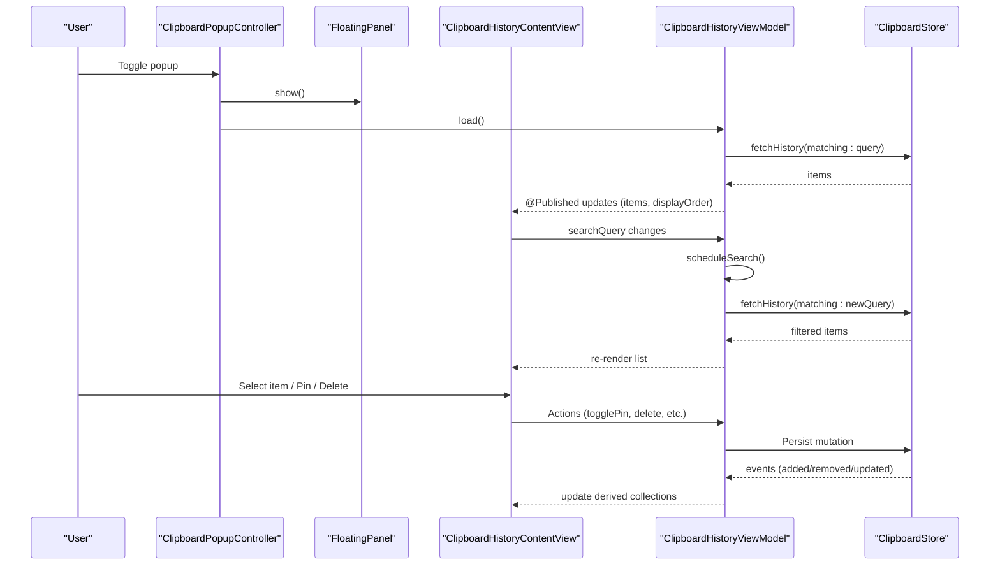
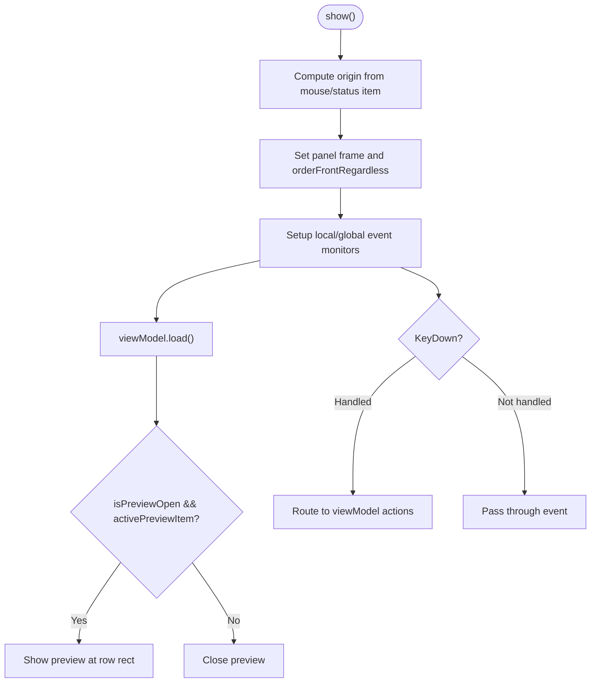
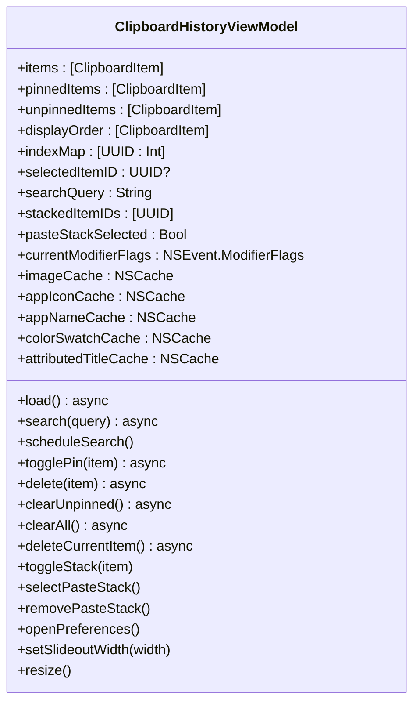
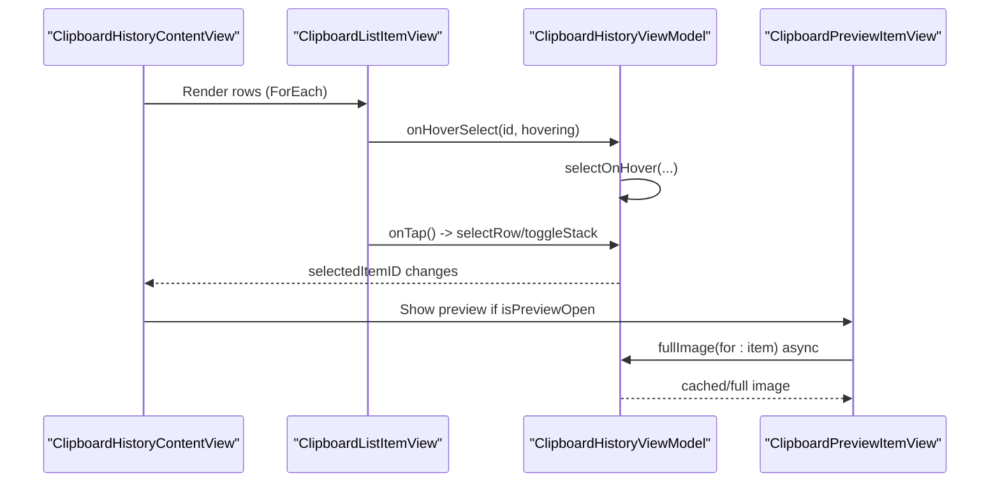
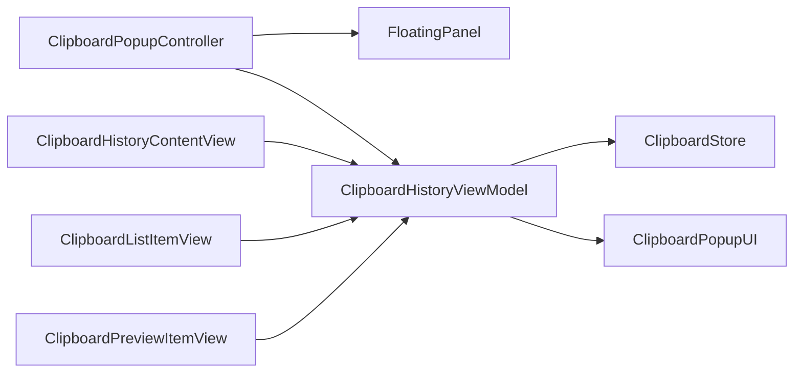

# User Interface & Interaction

<cite>
**Referenced Files in This Document**
- [ClipboardPopupController.swift](file://macos/skey-app/Sources/Features/Clipboard/UI/Controllers/ClipboardPopupController.swift)
- [FloatingPanel.swift](file://macos/skey-app/Sources/Features/Clipboard/UI/Controllers/FloatingPanel.swift)
- [ClipboardHistoryViewModel.swift](file://macos/skey-app/Sources/Features/Clipboard/UI/ViewModels/ClipboardHistoryViewModel.swift)
- [ClipboardHistoryViewModel+Actions.swift](file://macos/skey-app/Sources/Features/Clipboard/UI/ViewModels/ClipboardHistoryViewModel+Actions.swift)
- [ClipboardHistoryViewModel+Display.swift](file://macos/skey-app/Sources/Features/Clipboard/UI/ViewModels/ClipboardHistoryViewModel+Display.swift)
- [ClipboardHistoryPopup.swift](file://macos/skey-app/Sources/Features/Clipboard/UI/Views/ClipboardHistoryPopup.swift)
- [ClipboardListItemView.swift](file://macos/skey-app/Sources/Features/Clipboard/UI/Views/ClipboardListItemView.swift)
- [ClipboardSearchFieldView.swift](file://macos/skey-app/Sources/Features/Clipboard/UI/Views/ClipboardSearchFieldView.swift)
- [ClipboardPreviewItemView.swift](file://macos/skey-app/Sources/Features/Clipboard/UI/Views/ClipboardPreviewItemView.swift)
- [PasteStackPreviewView.swift](file://macos/skey-app/Sources/Features/Clipboard/UI/Views/PasteStackPreviewView.swift)
- [ClipboardPopupUI.swift](file://macos/skey-app/Sources/Features/Clipboard/UI/ClipboardPopupUI.swift)
- [ClipboardItem.swift](file://macos/skey-app/Sources/Features/Clipboard/Models/ClipboardItem.swift)
</cite>

## Table of Contents
1. [Introduction](#introduction)
2. [Project Structure](#project-structure)
3. [Core Components](#core-components)
4. [Architecture Overview](#architecture-overview)
5. [Detailed Component Analysis](#detailed-component-analysis)
6. [Dependency Analysis](#dependency-analysis)
7. [Performance Considerations](#performance-considerations)
8. [Troubleshooting Guide](#troubleshooting-guide)
9. [Conclusion](#conclusion)

## Introduction
This document explains the clipboard popup user interface and interaction patterns. It focuses on:
- ClipboardPopupController managing window lifecycle, event handling, and preview panel visibility
- ClipboardHistoryViewModel coordinating data flow between models and views, including search, pinning, deletion, and paste stack selection
- SwiftUI views for displaying clipboard history, search, previews, and paste stacks
- Visual design patterns, keyboard navigation, accessibility considerations, responsive sizing, and performance optimizations for large lists

## Project Structure
The clipboard UI is organized into controllers, view models, and SwiftUI views under a feature module. The controller owns a floating panel and wires it to a SwiftUI content view driven by a view model.

**Diagram sources**
- [ClipboardPopupController.swift:7-75](file://macos/skey-app/Sources/Features/Clipboard/UI/Controllers/ClipboardPopupController.swift#L7-L75)
- [FloatingPanel.swift:5-31](file://macos/skey-app/Sources/Features/Clipboard/UI/Controllers/FloatingPanel.swift#L5-L31)
- [ClipboardHistoryPopup.swift:6-56](file://macos/skey-app/Sources/Features/Clipboard/UI/Views/ClipboardHistoryPopup.swift#L6-L56)
- [ClipboardListItemView.swift:6-88](file://macos/skey-app/Sources/Features/Clipboard/UI/Views/ClipboardListItemView.swift#L6-L88)
- [ClipboardPreviewItemView.swift:50-80](file://macos/skey-app/Sources/Features/Clipboard/UI/Views/ClipboardPreviewItemView.swift#L50-L80)

**Section sources**
- [ClipboardPopupController.swift:7-136](file://macos/skey-app/Sources/Features/Clipboard/UI/Controllers/ClipboardPopupController.swift#L7-L136)
- [ClipboardHistoryPopup.swift:6-147](file://macos/skey-app/Sources/Features/Clipboard/UI/Views/ClipboardHistoryPopup.swift#L6-L147)

## Core Components
- ClipboardPopupController: Creates and manages the floating panel, computes placement, sets up event monitors, handles keyboard shortcuts, and coordinates preview panel visibility.
- ClipboardHistoryViewModel: Holds items, pinned/unpinned collections, display order, search state, selection, slideout width, and preview state; performs async search, preloading images, and actions like pin/delete/clear.
- SwiftUI Views:
  - ClipboardHistoryContentView: Composes header, list, footer, and clear confirmations; binds to viewModel; uses ScrollView + LazyVStack for efficient rendering.
  - ClipboardListItemView: High-performance row with app icons, thumbnails, color swatches, hover actions, and context menus.
  - SearchFieldView: Native NSTextField-based search input with focus management and submit action.
  - ClipboardPreviewItemView: Slideout preview for text or images with metadata and shortcuts.
  - PasteStackPreviewView: Compact preview of multi-item paste stacks.

**Section sources**
- [ClipboardPopupController.swift:7-136](file://macos/skey-app/Sources/Features/Clipboard/UI/Controllers/ClipboardPopupController.swift#L7-L136)
- [ClipboardHistoryViewModel.swift:8-77](file://macos/skey-app/Sources/Features/Clipboard/UI/ViewModels/ClipboardHistoryViewModel.swift#L8-L77)
- [ClipboardHistoryPopup.swift:6-147](file://macos/skey-app/Sources/Features/Clipboard/UI/Views/ClipboardHistoryPopup.swift#L6-L147)
- [ClipboardListItemView.swift:6-88](file://macos/skey-app/Sources/Features/Clipboard/UI/Views/ClipboardListItemView.swift#L6-L88)
- [ClipboardSearchFieldView.swift:6-72](file://macos/skey-app/Sources/Features/Clipboard/UI/Views/ClipboardSearchFieldView.swift#L6-L72)
- [ClipboardPreviewItemView.swift:50-80](file://macos/skey-app/Sources/Features/Clipboard/UI/Views/ClipboardPreviewItemView.swift#L50-L80)
- [PasteStackPreviewView.swift:6-43](file://macos/skey-app/Sources/Features/Clipboard/UI/Views/PasteStackPreviewView.swift#L6-L43)

## Architecture Overview
The popup follows a controller-driven architecture with a reactive view model and declarative SwiftUI views.

**Diagram sources**
- [ClipboardPopupController.swift:107-136](file://macos/skey-app/Sources/Features/Clipboard/UI/Controllers/ClipboardPopupController.swift#L107-L136)
- [ClipboardHistoryViewModel.swift:203-236](file://macos/skey-app/Sources/Features/Clipboard/UI/ViewModels/ClipboardHistoryViewModel.swift#L203-L236)
- [ClipboardHistoryViewModel.swift:100-119](file://macos/skey-app/Sources/Features/Clipboard/UI/ViewModels/ClipboardHistoryViewModel.swift#L100-L119)
- [ClipboardHistoryPopup.swift:16-56](file://macos/skey-app/Sources/Features/Clipboard/UI/Views/ClipboardHistoryPopup.swift#L16-L56)

## Detailed Component Analysis

### ClipboardPopupController: Window Lifecycle and Interactions
Responsibilities:
- Create and manage FloatingPanel, set initial size, and compute origin based on mouse position or status bar button
- Setup local and global event monitors to close the popup when clicking outside and handle keyDown events
- Manage preview panel visibility based on selected item and frame tracking
- Provide keyboard navigation and actions via static key handler

Key behaviors:
- Keyboard shortcuts:
  - Arrow keys: move selection; Shift extends selection; Command/Option jump to first/last
  - Enter/Return: confirm selection; Option/Shift paste as plain text
  - Escape: close popup
  - Backspace chords: Command deletes current; Command+Option clears unpinned; Command+Option+Shift clears all
  - Control chords: ⌃H delete char, ⌃W delete word, ⌃U clear field
  - Option-P: toggle pin; Option-Space: toggle preview; Command-, open preferences; Command-Q quit
- Event monitoring:
  - Local monitor for left/right click and keyDown to close on outside clicks and route keys
  - Global monitor to close on any click anywhere
  - Flags monitor to update modifier flags for contextual actions
- Preview panel:
  - Computes row rect from SwiftUI frame or index-based calculation
  - Shows/hides preview popover aligned to preferred edge based on screen bounds

**Diagram sources**
- [ClipboardPopupController.swift:107-136](file://macos/skey-app/Sources/Features/Clipboard/UI/Controllers/ClipboardPopupController.swift#L107-L136)
- [ClipboardPopupController.swift:215-242](file://macos/skey-app/Sources/Features/Clipboard/UI/Controllers/ClipboardPopupController.swift#L215-L242)
- [ClipboardPopupController.swift:244-365](file://macos/skey-app/Sources/Features/Clipboard/UI/Controllers/ClipboardPopupController.swift#L244-L365)

**Section sources**
- [ClipboardPopupController.swift:7-136](file://macos/skey-app/Sources/Features/Clipboard/UI/Controllers/ClipboardPopupController.swift#L7-L136)
- [ClipboardPopupController.swift:215-365](file://macos/skey-app/Sources/Features/Clipboard/UI/Controllers/ClipboardPopupController.swift#L215-L365)

### ClipboardHistoryViewModel: Data Flow and State Management
State:
- items, pinnedItems, unpinnedItems, displayOrder, indexMap
- selectedItemID, scrollTargetID, isPreviewOpen, previewPlacement
- searchQuery, stackedItemIDs, pasteStackSelected, currentModifierFlags
- Caches for images, app icons, names, color swatches, attributed titles
- Tasks for search, preload, auto-preview, and store events

Derived collections:
- updateDerivedCollections recomputes pinned/unpinned and ordered display based on settings
- Handles store events to keep items in sync without interrupting search

Search and loading:
- Debounced search via scheduleSearch with Task.sleep
- Async fetch from store, then update items and resize
- Preload top image payloads into imageCache

Actions:
- Delete, clear unpinned/all, toggle pin, delete current (including paste stack), open preferences
- Search field editing chords: clear, delete char/word

**Diagram sources**
- [ClipboardHistoryViewModel.swift:8-77](file://macos/skey-app/Sources/Features/Clipboard/UI/ViewModels/ClipboardHistoryViewModel.swift#L8-L77)
- [ClipboardHistoryViewModel.swift:86-119](file://macos/skey-app/Sources/Features/Clipboard/UI/ViewModels/ClipboardHistoryViewModel.swift#L86-L119)
- [ClipboardHistoryViewModel.swift:121-199](file://macos/skey-app/Sources/Features/Clipboard/UI/ViewModels/ClipboardHistoryViewModel.swift#L121-L199)
- [ClipboardHistoryViewModel.swift:201-236](file://macos/skey-app/Sources/Features/Clipboard/UI/ViewModels/ClipboardHistoryViewModel.swift#L201-L236)
- [ClipboardHistoryViewModel+Actions.swift:8-126](file://macos/skey-app/Sources/Features/Clipboard/UI/ViewModels/ClipboardHistoryViewModel+Actions.swift#L8-L126)
- [ClipboardHistoryViewModel+Display.swift:9-105](file://macos/skey-app/Sources/Features/Clipboard/UI/ViewModels/ClipboardHistoryViewModel+Display.swift#L9-L105)

**Section sources**
- [ClipboardHistoryViewModel.swift:8-236](file://macos/skey-app/Sources/Features/Clipboard/UI/ViewModels/ClipboardHistoryViewModel.swift#L8-L236)
- [ClipboardHistoryViewModel+Actions.swift:8-126](file://macos/skey-app/Sources/Features/Clipboard/UI/ViewModels/ClipboardHistoryViewModel+Actions.swift#L8-L126)
- [ClipboardHistoryViewModel+Display.swift:9-105](file://macos/skey-app/Sources/Features/Clipboard/UI/ViewModels/ClipboardHistoryViewModel+Display.swift#L9-L105)

### SwiftUI Views: Composition and Interaction Patterns
- ClipboardHistoryContentView:
  - Binds to viewModel.searchQuery and triggers confirmSelection on submit
  - Uses ScrollViewReader to programmatically scroll to target IDs
  - Coordinates space for selecting row frames used by preview positioning
  - Renders empty state, pins section, and list body conditionally
- ClipboardListItemView:
  - Equatable for efficient diffing
  - Displays app icon, thumbnail or leading accessory + title, trailing accessories (pin/delete buttons, copy count, number shortcut)
  - OnHover updates selection and triggers auto-preview cancellation when leaving list area
  - Context menu supports paste, paste as plain text, pin/unpin, delete
- SearchFieldView:
  - Native NSTextField wrapper with custom FocusSearchTextField ensuring focus on appear
  - Submit action triggers confirmation/paste
- ClipboardPreviewItemView:
  - Large text preview using NSTextView for performance beyond threshold
  - Image preview with progress and error states
  - Metadata card showing app icon/name, copy count, timestamps, and keyboard shortcuts
- PasteStackPreviewView:
  - Lists selected stack items with numbering and byte size

**Diagram sources**
- [ClipboardHistoryPopup.swift:16-147](file://macos/skey-app/Sources/Features/Clipboard/UI/Views/ClipboardHistoryPopup.swift#L16-L147)
- [ClipboardListItemView.swift:44-88](file://macos/skey-app/Sources/Features/Clipboard/UI/Views/ClipboardListItemView.swift#L44-L88)
- [ClipboardPreviewItemView.swift:62-80](file://macos/skey-app/Sources/Features/Clipboard/UI/Views/ClipboardPreviewItemView.swift#L62-L80)

**Section sources**
- [ClipboardHistoryPopup.swift:16-271](file://macos/skey-app/Sources/Features/Clipboard/UI/Views/ClipboardHistoryPopup.swift#L16-L271)
- [ClipboardListItemView.swift:6-216](file://macos/skey-app/Sources/Features/Clipboard/UI/Views/ClipboardListItemView.swift#L6-L216)
- [ClipboardSearchFieldView.swift:6-123](file://macos/skey-app/Sources/Features/Clipboard/UI/Views/ClipboardSearchFieldView.swift#L6-L123)
- [ClipboardPreviewItemView.swift:50-399](file://macos/skey-app/Sources/Features/Clipboard/UI/Views/ClipboardPreviewItemView.swift#L50-L399)
- [PasteStackPreviewView.swift:6-43](file://macos/skey-app/Sources/Features/Clipboard/UI/Views/PasteStackPreviewView.swift#L6-L43)

## Dependency Analysis
- ClipboardPopupController depends on:
  - FloatingPanel (AppKit NSPanel subclass)
  - ClipboardHistoryViewModel (state and actions)
  - ClipboardPreviewPopover (external preview panel)
  - AppSettings for popup position provider
- ClipboardHistoryViewModel depends on:
  - ClipboardStore (data source and events)
  - ClipboardPopupUI constants for sizing
  - NSWorkspace for app icons and names
- SwiftUI views depend on:
  - ClipboardHistoryViewModel for state and computed values
  - ClipboardPopupUI constants for layout and thresholds

**Diagram sources**
- [ClipboardPopupController.swift:7-75](file://macos/skey-app/Sources/Features/Clipboard/UI/Controllers/ClipboardPopupController.swift#L7-L75)
- [ClipboardHistoryViewModel.swift:8-77](file://macos/skey-app/Sources/Features/Clipboard/UI/ViewModels/ClipboardHistoryViewModel.swift#L8-L77)
- [ClipboardPopupUI.swift:6-28](file://macos/skey-app/Sources/Features/Clipboard/UI/ClipboardPopupUI.swift#L6-L28)

**Section sources**
- [ClipboardPopupController.swift:7-75](file://macos/skey-app/Sources/Features/Clipboard/UI/Controllers/ClipboardPopupController.swift#L7-L75)
- [ClipboardHistoryViewModel.swift:8-77](file://macos/skey-app/Sources/Features/Clipboard/UI/ViewModels/ClipboardHistoryViewModel.swift#L8-L77)
- [ClipboardPopupUI.swift:6-28](file://macos/skey-app/Sources/Features/Clipboard/UI/ClipboardPopupUI.swift#L6-L28)

## Performance Considerations
- Efficient list rendering:
  - ScrollView + LazyVStack ensures only visible rows are rendered
  - Equatable conformance on ClipboardListItemView reduces unnecessary redraws
- Image caching and preloading:
  - imageCache stores thumbnails/full images keyed by item id
  - PreloadTask prefetches top 15 image payloads into cache after search
  - Color swatch and attributed title caches reduce repeated computations
- Text preview optimization:
  - LargeTextPreviewView uses NSTextView for large texts beyond a threshold to avoid heavy SwiftUI parsing overhead
- Responsive sizing:
  - desiredHeight dynamically calculates height based on content, footer, and screen constraints
  - totalWidth accounts for preview slideout width
- Memory management:
  - Deinit cancels tasks to prevent leaks
  - Cache limits set for image, color swatch, and attributed title caches
  - Missing app icons tracked to avoid repeated failed lookups

[No sources needed since this section provides general guidance]

## Troubleshooting Guide
Common issues and resolutions:
- Popup does not close on outside clicks:
  - Ensure local and global event monitors are installed and not removed prematurely
  - Verify that clicked windows are not popovers or the panel itself
- Keyboard shortcuts not working:
  - Check that keyDown events are intercepted before IME composition (marked text check)
  - Confirm modifier flags are correctly captured and passed to viewModel actions
- Preview panel not appearing:
  - Validate selectedRowSwiftUIFrame propagation via preference key
  - Ensure isPreviewOpen and activePreviewItem are set appropriately
- Slow search or high CPU usage:
  - Confirm debounced search via scheduleSearch is functioning
  - Reduce image preload batch size or disable image thumbnails if necessary
- Memory growth over time:
  - Verify caches have appropriate count limits
  - Clear caches on clearAll/clearUnpinned operations

**Section sources**
- [ClipboardPopupController.swift:215-242](file://macos/skey-app/Sources/Features/Clipboard/UI/Controllers/ClipboardPopupController.swift#L215-L242)
- [ClipboardPopupController.swift:244-365](file://macos/skey-app/Sources/Features/Clipboard/UI/Controllers/ClipboardPopupController.swift#L244-L365)
- [ClipboardHistoryViewModel.swift:79-84](file://macos/skey-app/Sources/Features/Clipboard/UI/ViewModels/ClipboardHistoryViewModel.swift#L79-L84)
- [ClipboardHistoryViewModel.swift:207-236](file://macos/skey-app/Sources/Features/Clipboard/UI/ViewModels/ClipboardHistoryViewModel.swift#L207-L236)

## Conclusion
The clipboard popup UI combines a robust controller-driven window lifecycle with a reactive view model and performant SwiftUI views. Keyboard navigation, search, pinning, deletion, and paste stacks are integrated seamlessly. Responsive design adapts to screen sizes and preview states, while caching and lazy rendering optimize performance for large histories. Accessibility is supported via native controls, system colors, and standard keyboard interactions.