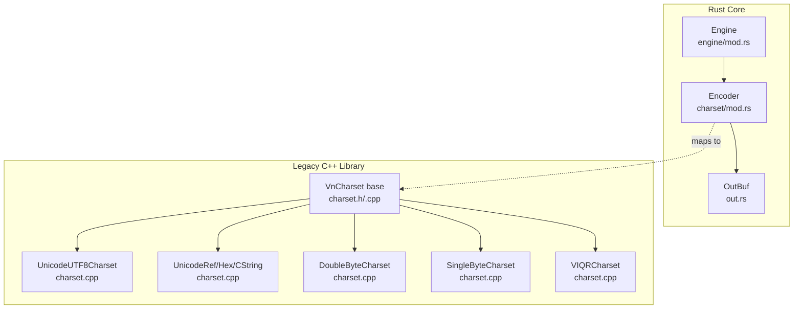
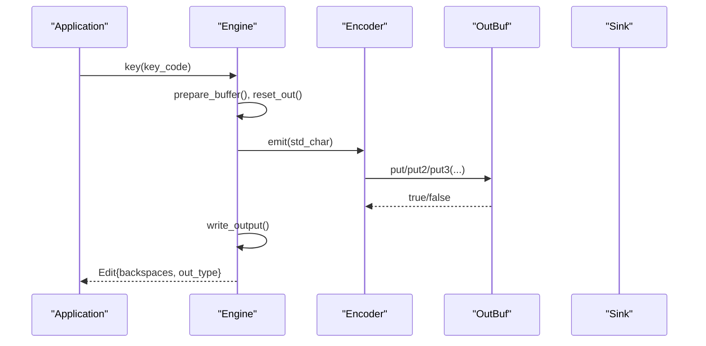
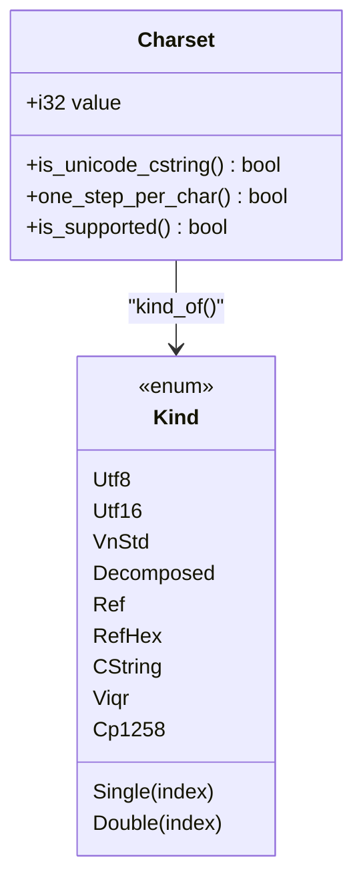
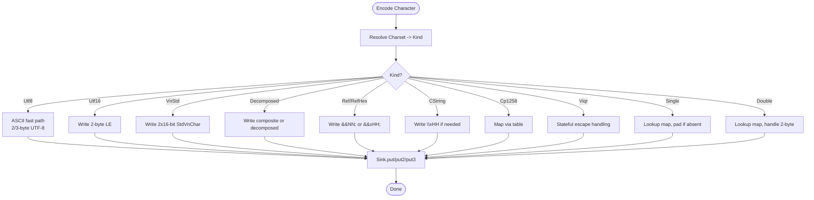
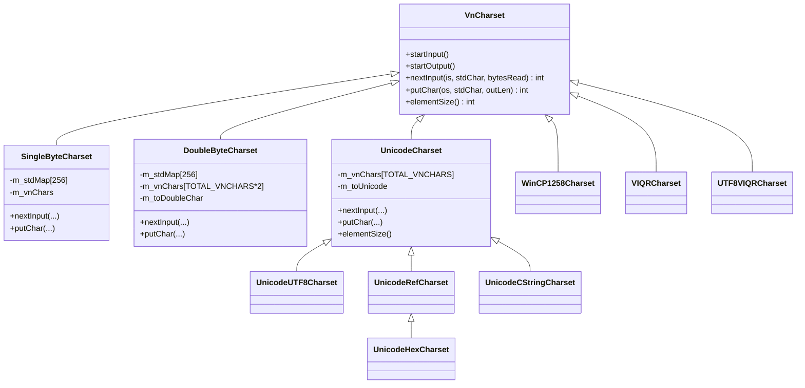
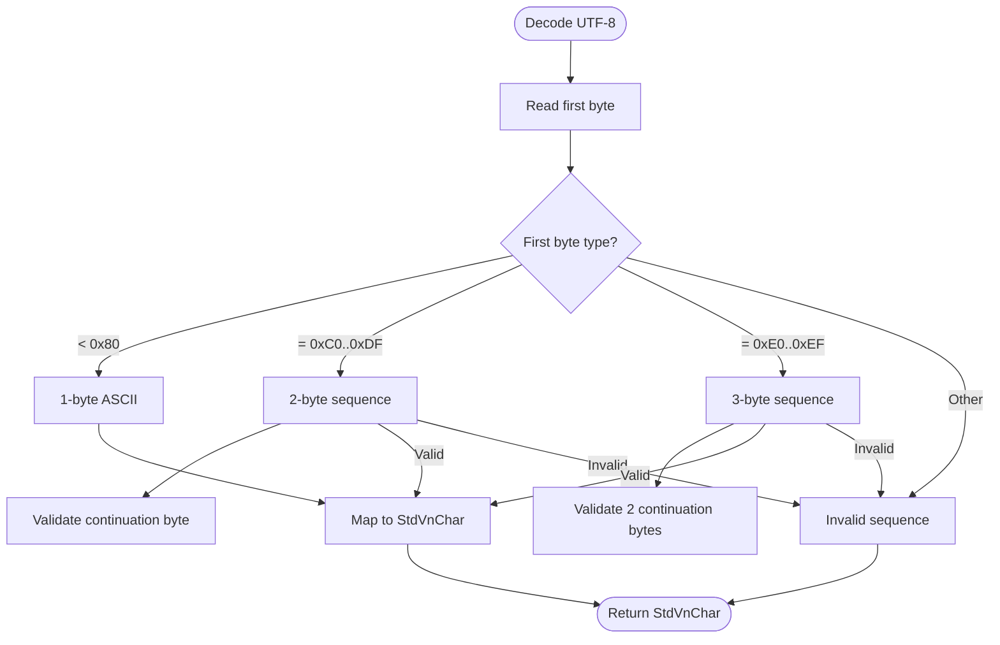
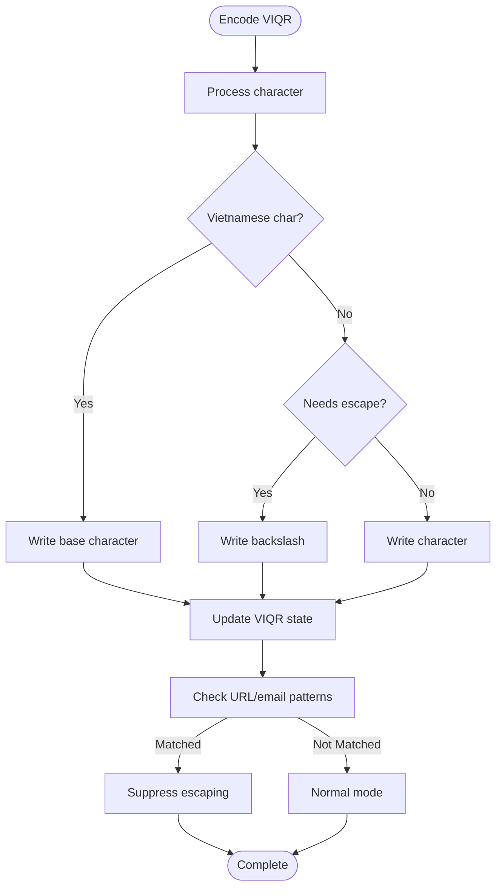
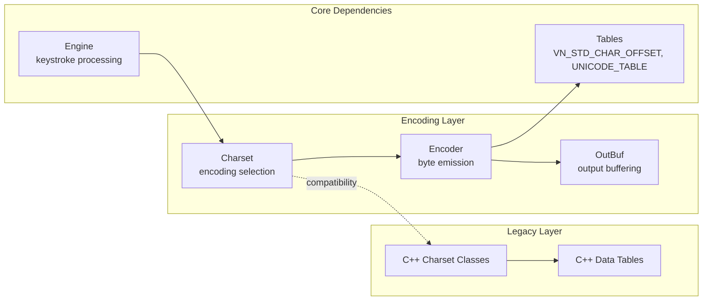

# Character Encoding Support

<cite>
**Referenced Files in This Document**
- [charset/mod.rs](file://port/skey-core/src/charset/mod.rs)
- [out.rs](file://port/skey-core/src/out.rs)
- [engine/mod.rs](file://port/skey-core/src/engine/mod.rs)
- [charset.h](file://src/vnconv/charset.h)
- [charset.cpp](file://src/vnconv/charset.cpp)
- [data.h](file://src/vnconv/data.h)
</cite>

## Table of Contents
1. [Introduction](#introduction)
2. [Project Structure](#project-structure)
3. [Core Components](#core-components)
4. [Architecture Overview](#architecture-overview)
5. [Detailed Component Analysis](#detailed-component-analysis)
6. [Dependency Analysis](#dependency-analysis)
7. [Performance Considerations](#performance-considerations)
8. [Troubleshooting Guide](#troubleshooting-guide)
9. [Conclusion](#conclusion)

## Introduction
This document explains the character encoding system that supports 21 Vietnamese character sets and how it converts between Unicode and legacy encodings such as VNI, TCVN3, and VISCII. It focuses on:
- The Charset enum and supported encodings
- The Encoder pipeline for output buffering with no heap allocation
- Encoding conversion workflows and compatibility guarantees
- Performance characteristics under no_std constraints
- Unicode normalization, surrogate handling, and multi-byte processing

The system is designed to be fast, predictable, and compatible with applications expecting different legacy encodings while maintaining a clean internal representation (StdVnChar) for Vietnamese text processing.

## Project Structure
The encoding subsystem spans two layers:
- A modern Rust core in port/skey-core that implements efficient, stack-based encoding and decoding without heap allocations by default
- A legacy C++ converter library in src/vnconv that provides class-based charset implementations and conversion utilities

**Diagram sources**
- [charset/mod.rs:321-501](file://port/skey-core/src/charset/mod.rs#L321-L501)
- [out.rs:60-192](file://port/skey-core/src/out.rs#L60-L192)
- [engine/mod.rs:18-70](file://port/skey-core/src/engine/mod.rs#L18-L70)
- [charset.h:87-284](file://src/vnconv/charset.h#L87-L284)
- [charset.cpp:79-132](file://src/vnconv/charset.cpp#L79-L132)

**Section sources**
- [charset/mod.rs:17-102](file://port/skey-core/src/charset/mod.rs#L17-L102)
- [charset.h:87-284](file://src/vnconv/charset.h#L87-L284)

## Core Components
- Charset enum defines all supported encodings, including Unicode variants, single-byte and double-byte legacy sets, and VIQR families.
- Encoder selects a dense Kind per charset and emits bytes via a Sink trait, enabling zero-allocation output through OutBuf.
- OutBuf provides a fixed-capacity buffer with optimized put2/put3 paths and absolute write_at for legacy compatibility.
- Engine integrates charset into keystroke processing, managing output size semantics and backspace accounting.

Supported encodings include:
- Unicode: UNICODE, UNIUTF8, XUTF8, UNIDECOMPOSED, UNIREF, UNIREF_HEX, UNI_CSTRING
- Single-byte: TCVN3 and five additional single-byte sets
- Double-byte: VNIWIN and three additional double-byte sets
- Legacy: WINCP1258, VNSTANDARD, VIQR, UTF8VIQR

**Section sources**
- [charset/mod.rs:17-102](file://port/skey-core/src/charset/mod.rs#L17-L102)
- [charset/mod.rs:321-501](file://port/skey-core/src/charset/mod.rs#L321-L501)
- [out.rs:60-192](file://port/skey-core/src/out.rs#L60-L192)
- [engine/mod.rs:18-70](file://port/skey-core/src/engine/mod.rs#L18-L70)

## Architecture Overview
The architecture separates concerns:
- Internal representation: StdVnChar (a 32-bit code space with an offset for Vietnamese characters)
- Encoding dispatch: Charset -> Kind mapping to specialized emit paths
- Output abstraction: Sink trait implemented by OutBuf and counters
- Legacy bridge: C++ classes mirror behavior for compatibility

**Diagram sources**
- [engine/mod.rs:248-319](file://port/skey-core/src/engine/mod.rs#L248-L319)
- [charset/mod.rs:366-501](file://port/skey-core/src/charset/mod.rs#L366-L501)
- [out.rs:80-126](file://port/skey-core/src/out.rs#L80-L126)

## Detailed Component Analysis

### Charset Enum and Supported Encodings
The Charset enum enumerates 21+ encodings grouped by family:
- Unicode family: UNICODE, UNIUTF8, XUTF8, UNIDECOMPOSED, UNIREF, UNIREF_HEX, UNI_CSTRING
- Single-byte family: TCVN3 plus five others (TCVN3..TCVN3+5)
- Double-byte family: VNIWIN plus three others (VNIWIN..VNIWIN+3)
- Others: WINCP1258, VNSTANDARD, VIQR, UTF8VIQR

Key behaviors:
- one_step_per_char identifies charsets where each character maps to exactly one output step (fast path)
- is_supported validates active encodings
- kind_of resolves to a compact Kind enum for dispatch

**Diagram sources**
- [charset/mod.rs:17-102](file://port/skey-core/src/charset/mod.rs#L17-L102)
- [charset/mod.rs:321-358](file://port/skey-core/src/charset/mod.rs#L321-L358)

**Section sources**
- [charset/mod.rs:17-102](file://port/skey-core/src/charset/mod.rs#L17-L102)
- [charset/mod.rs:321-358](file://port/skey-core/src/charset/mod.rs#L321-L358)

### Encoder Pipeline and Output Buffering
The Encoder:
- Resolves Charset to Kind once per output pass
- Emits bytes via Sink trait methods (put, put2, put3)
- Supports counting-only mode via Counter sink for backspace arithmetic without allocation

OutBuf:
- Fixed-size stack buffer (OUT_CAPACITY = 1024)
- Optimized put2/put3 with single bounds check when possible
- write_at for absolute writes required by legacy paths
- set_count to override reported size, matching original behavior

**Diagram sources**
- [charset/mod.rs:366-643](file://port/skey-core/src/charset/mod.rs#L366-L643)
- [out.rs:80-126](file://port/skey-core/src/out.rs#L80-L126)

**Section sources**
- [charset/mod.rs:366-643](file://port/skey-core/src/charset/mod.rs#L366-L643)
- [out.rs:60-192](file://port/skey-core/src/out.rs#L60-L192)

### Legacy C++ Charset Classes
The C++ layer provides a class hierarchy rooted at VnCharset:
- SingleByteCharset: Maps 1-byte codes to StdVnChar indices
- DoubleByteCharset: Handles 2-byte sequences with high-byte detection
- UnicodeCharset: Converts between Unicode and StdVnChar
- UnicodeUTF8Charset: UTF-8 encoder/decoder with validation
- UnicodeRefCharset/UnicodeHexCharset: HTML entity references
- UnicodeCStringCharset: C-style \x escapes
- WinCP1258Charset: Windows Code Page 1258 with precomposed overrides
- VIQRCharset: Stateful VIQR with escape suppression for URLs/email patterns
- UTF8VIQRCharset: Combines UTF-8 input with VIQR output

**Diagram sources**
- [charset.h:87-284](file://src/vnconv/charset.h#L87-L284)

**Section sources**
- [charset.h:87-284](file://src/vnconv/charset.h#L87-L284)
- [charset.cpp:79-132](file://src/vnconv/charset.cpp#L79-L132)
- [charset.cpp:143-182](file://src/vnconv/charset.cpp#L143-L182)
- [charset.cpp:285-369](file://src/vnconv/charset.cpp#L285-L369)
- [charset.cpp:387-517](file://src/vnconv/charset.cpp#L387-L517)
- [charset.cpp:523-595](file://src/vnconv/charset.cpp#L523-L595)
- [charset.cpp:600-685](file://src/vnconv/charset.cpp#L600-L685)
- [charset.cpp:706-800](file://src/vnconv/charset.cpp#L706-L800)

### Encoding Conversion Workflows

#### UTF-8 to StdVnChar (Decoding)
The Rust implementation decodes UTF-8 sequences and maps to StdVnChar using lookup tables:
- Validates sequence structure (1/2/3 byte)
- Converts to Unicode then maps to StdVnChar via unicode_to_std
- Returns None for invalid sequences (matching legacy INVALID_STD_CHAR behavior)

**Diagram sources**
- [charset/mod.rs:755-793](file://port/skey-core/src/charset/mod.rs#L755-L793)

**Section sources**
- [charset/mod.rs:755-793](file://port/skey-core/src/charset/mod.rs#L755-L793)

#### VIQR Encoding with Escape Suppression
VIQR encoding handles tone marks and diacritics with intelligent escape suppression for URLs and email addresses:
- Maintains state for bowl, roof, hook, and tone markers
- Uses rolling window pattern matching to detect URL/email patterns
- Suppresses escaping within detected patterns to preserve functionality

**Diagram sources**
- [charset/mod.rs:560-643](file://port/skey-core/src/charset/mod.rs#L560-L643)
- [charset/mod.rs:231-319](file://port/skey-core/src/charset/mod.rs#L231-L319)

**Section sources**
- [charset/mod.rs:560-643](file://port/skey-core/src/charset/mod.rs#L560-L643)
- [charset/mod.rs:231-319](file://port/skey-core/src/charset/mod.rs#L231-L319)

#### Single and Double Byte Legacy Encodings
Single-byte encodings use direct lookup tables with padding for missing characters:
- Characters absent from target charset are replaced with PAD_CHAR (#)
- Special quotes and ellipsis have dedicated padding characters

Double-byte encodings handle both 1-byte and 2-byte sequences:
- High-byte detection determines sequence length
- Mapping tables handle character-to-code-point conversion
- Padding applied for unsupported combinations

**Section sources**
- [charset/mod.rs:503-558](file://port/skey-core/src/charset/mod.rs#L503-L558)
- [charset.cpp:79-132](file://src/vnconv/charset.cpp#L79-L132)
- [charset.cpp:600-685](file://src/vnconv/charset.cpp#L600-L685)

## Dependency Analysis
The encoding system has clear dependency relationships:

**Diagram sources**
- [charset/mod.rs:13-16](file://port/skey-core/src/charset/mod.rs#L13-L16)
- [engine/mod.rs:10-15](file://port/skey-core/src/engine/mod.rs#L10-L15)
- [charset.h:286-299](file://src/vnconv/charset.h#L286-L299)

**Section sources**
- [charset/mod.rs:13-16](file://port/skey-core/src/charset/mod.rs#L13-L16)
- [engine/mod.rs:10-15](file://port/skey-core/src/engine/mod.rs#L10-L15)

## Performance Considerations
The encoding system is optimized for performance under no_std constraints:

### Zero-Allocation Design
- OutBuf uses fixed-size stack buffer (1024 bytes) instead of heap allocation
- Counter sink enables byte counting without storage for backspace arithmetic
- All encoding operations work directly on stack memory

### Fast Path Optimization
- one_step_per_char optimization for charsets with constant output size
- Inline functions for common operations (to_unicode, hex_digit, is_ascii_vowel)
- Dense Kind enum enables jump table dispatch instead of chain comparisons

### Memory Efficiency
- Compile-time table construction for character mappings
- Minimal state structures (Viqr struct uses u64 window for pattern matching)
- No dynamic allocation during encoding/decoding operations

### Legacy Compatibility
- Exact behavior matching for output size reporting (can exceed actual stored bytes)
- Preserves original error handling semantics (INVALID_STD_CHAR mapping)
- Maintains VIQR escape suppression logic for URL/email patterns

**Section sources**
- [out.rs:1-8](file://port/skey-core/src/out.rs#L1-L8)
- [charset/mod.rs:68-83](file://port/skey-core/src/charset/mod.rs#L68-L83)
- [charset/mod.rs:231-319](file://port/skey-core/src/charset/mod.rs#L231-L319)

## Troubleshooting Guide

### Common Encoding Issues

#### Missing Characters in Legacy Encodings
When converting to single/double-byte encodings, characters not present in the target charset are replaced with padding:
- PAD_CHAR (#) for general missing characters
- PAD_START_QUOTE/PAD_END_QUOTE for special quote characters  
- PAD_ELLIPSIS for ellipsis characters

**Resolution**: Use Unicode encodings (UNICODE, UNIUTF8, XUTF8) for full character support, or ensure source data only contains characters available in target charset.

**Section sources**
- [charset/mod.rs:42-47](file://port/skey-core/src/charset/mod.rs#L42-L47)
- [charset/mod.rs:513-528](file://port/skey-core/src/charset/mod.rs#L513-L528)

#### VIQR Escape Pattern Conflicts
VIQR encoding may suppress escape sequences within URL/email patterns:
- Patterns like "://", "@", "mailto:", "www", "ftp" trigger escape suppression
- This preserves functionality but may affect expected VIQR behavior

**Resolution**: Disable escape suppression if strict VIQR encoding is required, or avoid using VIQR in contexts containing these patterns.

**Section sources**
- [charset/mod.rs:249-284](file://port/skey-core/src/charset/mod.rs#L249-L284)
- [charset/mod.rs:573-578](file://port/skey-core/src/charset/mod.rs#L573-L578)

#### Output Buffer Overflow
OutBuf has fixed capacity (1024 bytes). When exceeded:
- bad flag is set, subsequent writes fail
- count continues to increment (matching original behavior)
- bytes_up_to(n) returns clamped slice

**Resolution**: Ensure application buffers are large enough, or process output in chunks for long texts.

**Section sources**
- [out.rs:80-95](file://port/skey-core/src/out.rs#L80-L95)
- [out.rs:167-192](file://port/skey-core/src/out.rs#L167-L192)

### Debugging Tips

#### Verify Charset Support
Use Charset::is_supported() to validate encoding before conversion attempts.

#### Monitor Output Size
Track OutBuf.len() vs remaining capacity to detect potential overflow conditions.

#### Test with Known Inputs
Use decode_nul_terminated() for testing input parsing with various encodings.

**Section sources**
- [charset/mod.rs:85-102](file://port/skey-core/src/charset/mod.rs#L85-L102)
- [out.rs:167-192](file://port/skey-core/src/out.rs#L167-L192)
- [charset/mod.rs:714-749](file://port/skey-core/src/charset/mod.rs#L714-L749)

## Conclusion
The character encoding system provides comprehensive support for 21 Vietnamese character sets through a carefully designed architecture that balances performance, compatibility, and maintainability. Key strengths include:

- **Zero-allocation design**: Stack-based buffering and compile-time optimizations enable operation in no_std environments
- **Comprehensive encoding support**: From modern Unicode to legacy single/double-byte formats
- **Performance optimization**: Fast paths, inline functions, and efficient data structures
- **Legacy compatibility**: Exact behavior matching ensures smooth migration from existing systems
- **Robust error handling**: Graceful degradation with padding characters and validation

The system successfully bridges modern Unicode processing with legacy application requirements while maintaining high performance and reliability. The separation between internal StdVnChar representation and external encoding formats provides flexibility for future enhancements while preserving backward compatibility.