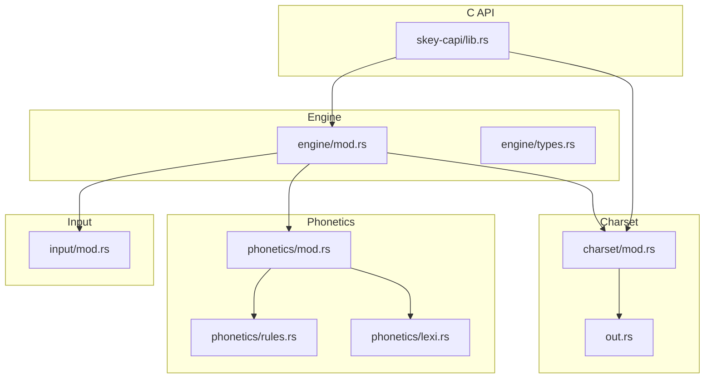
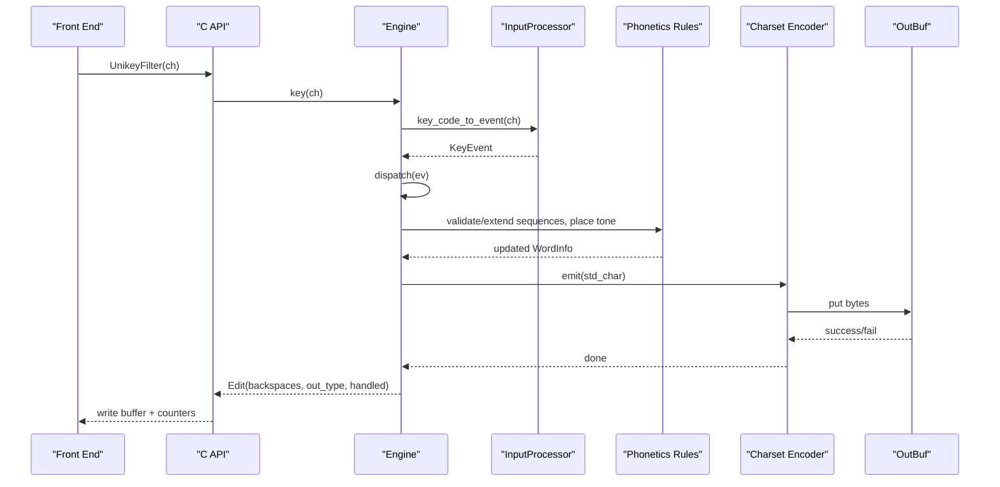
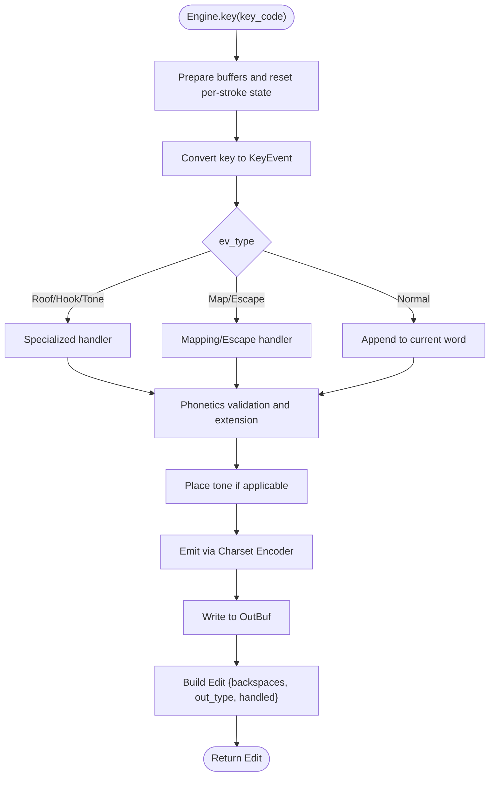
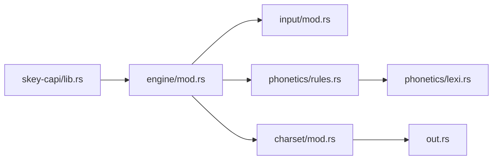

# Core Engine (Rust)

<cite>
**Referenced Files in This Document**
- [lib.rs](file://port/skey-core/src/lib.rs)
- [Cargo.toml](file://port/skey-core/Cargo.toml)
- [engine/mod.rs](file://port/skey-core/src/engine/mod.rs)
- [engine/types.rs](file://port/skey-core/src/engine/types.rs)
- [input/mod.rs](file://port/skey-core/src/input/mod.rs)
- [phonetics/mod.rs](file://port/skey-core/src/phonetics/mod.rs)
- [phonetics/rules.rs](file://port/skey-core/src/phonetics/rules.rs)
- [phonetics/lexi.rs](file://port/skey-core/src/phonetics/lexi.rs)
- [charset/mod.rs](file://port/skey-core/src/charset/mod.rs)
- [out.rs](file://port/skey-core/src/out.rs)
- [skey-capi/lib.rs](file://port/skey-capi/src/lib.rs)
- [simple_telex.rs](file://port/skey-core/tests/simple_telex.rs)
- [smoke.rs](file://port/skey-core/tests/smoke.rs)
</cite>

## Table of Contents
1. [Introduction](#introduction)
2. [Project Structure](#project-structure)
3. [Core Components](#core-components)
4. [Architecture Overview](#architecture-overview)
5. [Detailed Component Analysis](#detailed-component-analysis)
6. [Dependency Analysis](#dependency-analysis)
7. [Performance Considerations](#performance-considerations)
8. [Troubleshooting Guide](#troubleshooting-guide)
9. [Conclusion](#conclusion)
10. [Appendices](#appendices)

## Introduction
This document explains the Rust core engine that powers high-performance Vietnamese typing. It focuses on:
- The state machine architecture for character composition and tone placement
- Phonetic processing algorithms for Vietnamese tone handling
- Charset support for multiple encoding formats, including Telex, VNI, and VIQR input methods
- no_std constraints and a zero-allocation programming model enabling sub-microsecond latency
- C ABI integration with legacy front ends
- Edge case handling such as dead keys, modifier combinations, and international characters
- Performance optimizations, memory safety guarantees, and testing strategies

The engine is designed to be byte-for-byte compatible with the original C++ implementation while adding modern Rust safety and performance.

## Project Structure
At a high level, the Rust core engine is organized into focused modules:
- Engine orchestration and state machine
- Input classification and method mapping (Telex, VNI, VIQR, user maps)
- Phonetics rules and tables for Vietnamese orthography
- Charset encoders and decoders for output formats
- Output buffer abstraction for zero-allocation sinks
- C API bridge exposing the legacy interface and a context-based API

**Diagram sources**
- [engine/mod.rs:1-70](file://port/skey-core/src/engine/mod.rs#L1-L70)
- [input/mod.rs:1-80](file://port/skey-core/src/input/mod.rs#L1-L80)
- [phonetics/mod.rs:1-16](file://port/skey-core/src/phonetics/mod.rs#L1-L16)
- [phonetics/rules.rs:1-40](file://port/skey-core/src/phonetics/rules.rs#L1-L40)
- [phonetics/lexi.rs:1-30](file://port/skey-core/src/phonetics/lexi.rs#L1-L30)
- [charset/mod.rs:1-60](file://port/skey-core/src/charset/mod.rs#L1-L60)
- [out.rs:1-40](file://port/skey-core/src/out.rs#L1-L40)
- [skey-capi/lib.rs:1-120](file://port/skey-capi/src/lib.rs#L1-L120)

**Section sources**
- [lib.rs:1-47](file://port/skey-core/src/lib.rs#L1-L47)
- [Cargo.toml:1-26](file://port/skey-core/Cargo.toml#L1-L26)

## Core Components
- Engine: Central state machine that processes keystrokes, manages buffers, dispatches to phonetic and charset logic, and emits edits.
- InputProcessor: Classifies key codes into events (tones, roofs, hooks, mappings) based on the active input method (Telex, VNI, VIQR, user map).
- Phonetics: Rules and tables defining valid Vietnamese sequences, vowel/consonant extensions, tone placement, and lexical indices.
- Charset: Encodes internal StdVnChar representations into target encodings (UTF-8, UTF-16, VIQR, CP1258, single/double-byte tables), with stateful handling for VIQR escapes.
- Output: Zero-allocation sink abstraction and bounded buffer for streaming bytes without heap allocation.
- C API: Legacy global-state interface and a thread-safe context API that expose the same behavior to existing front ends.

Key behaviors:
- Keystroke path never allocates; optional features enable macro/keymap parsing and advanced options behind feature flags.
- The engine maintains a compact per-word buffer and uses fixed-size arrays to avoid dynamic allocation during hot paths.
- Tone and diacritic placement are resolved using phonotactic validation and sequence tables.

**Section sources**
- [engine/mod.rs:18-70](file://port/skey-core/src/engine/mod.rs#L18-L70)
- [engine/types.rs:107-235](file://port/skey-core/src/engine/types.rs#L107-L235)
- [input/mod.rs:72-215](file://port/skey-core/src/input/mod.rs#L72-L215)
- [phonetics/mod.rs:1-16](file://port/skey-core/src/phonetics/mod.rs#L1-L16)
- [phonetics/rules.rs:107-246](file://port/skey-core/src/phonetics/rules.rs#L107-L246)
- [charset/mod.rs:17-102](file://port/skey-core/src/charset/mod.rs#L17-L102)
- [out.rs:1-192](file://port/skey-core/src/out.rs#L1-L192)
- [skey-capi/lib.rs:21-120](file://port/skey-capi/src/lib.rs#L21-L120)

## Architecture Overview
The engine follows a strict pipeline:
1. A key code arrives via the C API or direct call.
2. InputProcessor converts it to a KeyEvent with type, symbol, and tone metadata.
3. Engine dispatch routes to specialized handlers (roof, hook, tone, mapping, escape, append).
4. Phonetics rules validate and extend sequences, place tones, and track word boundaries.
5. Charset encoder writes output bytes into a zero-allocation buffer.
6. Edit result reports backspaces, output bytes, and whether the key was handled.

**Diagram sources**
- [skey-capi/lib.rs:128-133](file://port/skey-capi/src/lib.rs#L128-L133)
- [engine/mod.rs:248-319](file://port/skey-core/src/engine/mod.rs#L248-L319)
- [input/mod.rs:162-192](file://port/skey-core/src/input/mod.rs#L162-L192)
- [phonetics/rules.rs:132-246](file://port/skey-core/src/phonetics/rules.rs#L132-L246)
- [charset/mod.rs:360-501](file://port/skey-core/src/charset/mod.rs#L360-L501)
- [out.rs:60-192](file://port/skey-core/src/out.rs#L60-L192)

## Detailed Component Analysis

### Engine State Machine and Dispatch
The Engine holds:
- Per-stroke buffers for word info, keys, conversion flags, and output
- Configuration fields (Vietnamese mode, options, charset, input processor)
- Caps lock and shift state for capitalization decisions
- Flags for escaping, single-mode, and restoration

Dispatch logic:
- Applies quick shortcuts and uppercase-first if enabled
- Routes to roof, hook, tone, mapping, escape, or append handlers
- Tracks changes and writes output only when needed
- Handles spell-check fallbacks and non-Vietnamese transitions

Backspace behavior:
- Moves through the word buffer, repositions tones when necessary
- Emits edits that reflect actual backspaces required by the UI

Restore behavior:
- Replays raw key strokes for the last word, emitting key events instead of composed characters

**Diagram sources**
- [engine/mod.rs:248-319](file://port/skey-core/src/engine/mod.rs#L248-L319)
- [engine/mod.rs:321-423](file://port/skey-core/src/engine/mod.rs#L321-L423)

**Section sources**
- [engine/mod.rs:18-70](file://port/skey-core/src/engine/mod.rs#L18-L70)
- [engine/mod.rs:209-246](file://port/skey-core/src/engine/mod.rs#L209-L246)
- [engine/mod.rs:248-319](file://port/skey-core/src/engine/mod.rs#L248-L319)
- [engine/mod.rs:321-423](file://port/skey-core/src/engine/mod.rs#L321-L423)
- [engine/types.rs:107-235](file://port/skey-core/src/engine/types.rs#L107-L235)

### Input Processing and Input Methods
InputProcessor classifies each key code into an event:
- Roof, hook, bowl, dd, tone levels, telex-specific actions, mapped characters, escapes, normal
- Maintains a 256-entry action table per input method
- Supports Telex, VNI, VIQR, MsVi, Simple Telex, and user-defined maps

Key points:
- Built-in maps apply both cases automatically for action entries
- Character mapping entries carry their own case semantics
- Non-Vietnamese keys are classified appropriately for spell checking

Examples:
- Telex: “w” at word start may stay literal depending on method
- VNI: numeric tone markers appended to vowels
- VIQR: tone and diacritic markers encoded with special symbols

**Section sources**
- [input/mod.rs:7-49](file://port/skey-core/src/input/mod.rs#L7-L49)
- [input/mod.rs:72-125](file://port/skey-core/src/input/mod.rs#L72-L125)
- [input/mod.rs:150-192](file://port/skey-core/src/input/mod.rs#L150-L192)
- [simple_telex.rs:13-52](file://port/skey-core/tests/simple_telex.rs#L13-L52)

### Phonetics Rules and Tone Handling
Phonetics module provides:
- Lexical indices for Vietnamese characters with parity and tone encoding
- Vowel and consonant sequence tables for composition
- Validation functions for CV, VC, and CVC structures
- Tone placement helpers and normalization

Tone handling highlights:
- Tone levels are stored compactly in WordInfo bits
- Backspace can move tones between positions when deleting parts of a syllable
- Rules ensure valid combinations like “quy”, “gieng”, and handle edge cases where sequences are invalid

Sequence lookup:
- Binary search over sorted keys for fast validation
- Bitmask checks for specific consonant-vowel compatibility

**Section sources**
- [phonetics/lexi.rs:1-110](file://port/skey-core/src/phonetics/lexi.rs#L1-L110)
- [phonetics/rules.rs:31-105](file://port/skey-core/src/phonetics/rules.rs#L31-L105)
- [phonetics/rules.rs:107-246](file://port/skey-core/src/phonetics/rules.rs#L107-L246)
- [engine/mod.rs:356-399](file://port/skey-core/src/engine/mod.rs#L356-L399)

### Charset Support and Encoding
Charset module supports many encodings:
- Unicode, UTF-8, UTF-16, decomposed forms
- Reference entities and hex references
- Single-byte and double-byte tables (TCVN3 family, VNIWIN family)
- CP1258 with composite and precomposed overrides
- VIQR and UTF8VIQR with stateful escape handling

Encoding strategy:
- Resolves to a dense Kind tag once per output pass
- Uses precomputed maps for single/double-byte charsets
- VIQR escape window avoids escaping inside URLs or email-like patterns using a rolling bitmask matcher

Decoding:
- NUL-terminated decoding for UTF-8 and VIQR
- Case conversion utilities for StdVnChar space

**Section sources**
- [charset/mod.rs:17-102](file://port/skey-core/src/charset/mod.rs#L17-L102)
- [charset/mod.rs:104-197](file://port/skey-core/src/charset/mod.rs#L104-L197)
- [charset/mod.rs:231-310](file://port/skey-core/src/charset/mod.rs#L231-L310)
- [charset/mod.rs:360-501](file://port/skey-core/src/charset/mod.rs#L360-L501)
- [charset/mod.rs:560-643](file://port/skey-core/src/charset/mod.rs#L560-L643)
- [charset/mod.rs:664-800](file://port/skey-core/src/charset/mod.rs#L664-L800)

### Output Buffer and Zero-Allocation Model
OutBuf implements a bounded, stack-sized buffer with:
- Fast multi-byte writes with a single bounds check
- Direct indexed writes for bypass paths
- Count tracking that mirrors the original’s stream counter behavior
- Sink trait allowing counting-only passes for backspace arithmetic

Constraints:
- Capacity matches the legacy buffer size
- No heap allocation in the keystroke path
- Safe fallbacks when capacity is exceeded

**Section sources**
- [out.rs:1-192](file://port/skey-core/src/out.rs#L1-L192)

### C ABI Interface and Integration
The C API exposes:
- Legacy globals-compatible interface (UnikeySetup, UnikeyFilter, etc.)
- Context-based API for multiple sessions and thread safety
- Options mapping and input method selection
- Macro table and user key map loading

Behavioral fidelity:
- Global wrapper types preserve layout and access semantics
- Edit results mirror original counters and output types
- Swallowed key restore and quick options exposed via dedicated setters

**Section sources**
- [skey-capi/lib.rs:21-120](file://port/skey-capi/src/lib.rs#L21-L120)
- [skey-capi/lib.rs:349-610](file://port/skey-capi/src/lib.rs#L349-L610)
- [skey-capi/lib.rs:612-727](file://port/skey-capi/src/lib.rs#L612-L727)

### Edge Cases and Modifier Handling
- Dead keys and tone application: Handled by tone dispatch and backspace repositioning
- Modifier combinations: Caps lock and shift tracked to influence capitalization and quick shortcuts
- International characters: Classified as non-Vietnamese or Vietnamese based on lexical tables; spell checking respects configuration
- Escape sequences: VIQR encoder suppresses escaping in URL-like contexts using a compact window matcher

**Section sources**
- [engine/mod.rs:154-178](file://port/skey-core/src/engine/mod.rs#L154-L178)
- [engine/mod.rs:227-246](file://port/skey-core/src/engine/mod.rs#L227-L246)
- [charset/mod.rs:231-310](file://port/skey-core/src/charset/mod.rs#L231-L310)
- [input/mod.rs:150-192](file://port/skey-core/src/input/mod.rs#L150-L192)

## Dependency Analysis
The engine depends on:
- InputProcessor for event classification and method mapping
- Phonetics rules and tables for sequence validation and tone placement
- Charset encoder for output formatting
- OutBuf for zero-allocation streaming
- C API for integration with existing front ends

**Diagram sources**
- [skey-capi/lib.rs:128-133](file://port/skey-capi/src/lib.rs#L128-L133)
- [engine/mod.rs:248-319](file://port/skey-core/src/engine/mod.rs#L248-L319)
- [input/mod.rs:162-192](file://port/skey-core/src/input/mod.rs#L162-L192)
- [phonetics/rules.rs:132-246](file://port/skey-core/src/phonetics/rules.rs#L132-L246)
- [phonetics/lexi.rs:1-110](file://port/skey-core/src/phonetics/lexi.rs#L1-L110)
- [charset/mod.rs:360-501](file://port/skey-core/src/charset/mod.rs#L360-L501)
- [out.rs:60-192](file://port/skey-core/src/out.rs#L60-L192)

**Section sources**
- [lib.rs:15-47](file://port/skey-core/src/lib.rs#L15-L47)
- [Cargo.toml:11-26](file://port/skey-core/Cargo.toml#L11-L26)

## Performance Considerations
- no_std keystroke path: The engine compiles without std and avoids allocations in the hot path, ensuring deterministic latency.
- Fixed-size buffers: WordInfo packed into 12 bytes reduces memory footprint and improves cache locality.
- Jump tables and bitmaps: Dispatch and validation use compact tables and bitwise operations to minimize branches.
- Zero-allocation sinks: OutBuf and Counter allow counting and writing without heap usage.
- Feature flags: Optional alloc-dependent features (macros, keymap parsing) are disabled by default to keep the core minimal.

Optimization techniques:
- Precomputed charset maps and escape pattern masks
- Inline helpers for case conversion and tone placement
- Bypass paths for direct buffer writes where necessary

Memory safety:
- forbid(unsafe_code) in core; unsafe isolated to C ABI layer
- Bounds-checked accessors and debug assertions for offsets and tone levels
- Deterministic behavior aligned with original C++ engine for parity

**Section sources**
- [lib.rs:1-13](file://port/skey-core/src/lib.rs#L1-L13)
- [engine/types.rs:107-146](file://port/skey-core/src/engine/types.rs#L107-L146)
- [charset/mod.rs:231-310](file://port/skey-core/src/charset/mod.rs#L231-L310)
- [out.rs:1-192](file://port/skey-core/src/out.rs#L1-L192)
- [Cargo.toml:20-26](file://port/skey-core/Cargo.toml#L20-L26)

## Troubleshooting Guide
Common issues and resolutions:
- Incorrect output length: Ensure you read from Engine::output() and respect the reported length; the stream counter may exceed stored bytes when the buffer fills.
- Unexpected capitalization: Check caps lock and shift state via set_caps_state; verify upper_case_first_char option if sentence-start capitalization is expected.
- VIQR escaping anomalies: Confirm that escape suppression works for URL-like patterns; reset output before each write to clear state.
- Backspace not moving tone: Verify that tone position calculation accounts for vowel sequence changes; backspace may move tone to a new valid position.
- Input method mismatch: Confirm IM selection (Telex, VNI, VIQR, user map); some methods treat certain letters differently at word boundaries.

Diagnostics:
- Use context API for multi-session scenarios to isolate state
- Run tests under no-default-features to validate no_std behavior
- Inspect Edit.handled flag to determine whether the engine consumed the key

**Section sources**
- [skey-capi/lib.rs:86-101](file://port/skey-capi/src/lib.rs#L86-L101)
- [engine/mod.rs:154-178](file://port/skey-core/src/engine/mod.rs#L154-L178)
- [engine/mod.rs:321-423](file://port/skey-core/src/engine/mod.rs#L321-L423)
- [charset/mod.rs:560-643](file://port/skey-core/src/charset/mod.rs#L560-L643)
- [smoke.rs:6-21](file://port/skey-core/tests/smoke.rs#L6-L21)

## Conclusion
The Rust core engine delivers a high-performance, memory-safe Vietnamese typing system with:
- A robust state machine for character composition and tone placement
- Comprehensive phonetic rules and sequence validation
- Extensive charset support including Telex, VNI, and VIQR
- A zero-allocation design suitable for no_std environments
- Seamless integration via a faithful C ABI and a modern context API
- Rigorous testing and parity with the original implementation

These properties enable sub-microsecond latency, predictable behavior, and reliable operation across diverse front ends and platforms.

## Appendices

### Example Workflows

#### Telex Input Method
- Keys like “tieengs” compose to “tiếng”
- “w” at word start may remain literal in Simple Telex but acts as horn in standard Telex

**Section sources**
- [simple_telex.rs:20-52](file://port/skey-core/tests/simple_telex.rs#L20-L52)
- [smoke.rs:31-44](file://port/skey-core/tests/smoke.rs#L31-L44)

#### VNI Input Method
- Numeric tone markers appended to vowels produce correct accented characters
- Example: “tieng61 Viet65 Nam ” yields “tiếng Việt Nam ”

**Section sources**
- [smoke.rs:82-90](file://port/skey-core/tests/smoke.rs#L82-L90)

#### VIQR Input Method
- Tone and diacritic markers encoded with special symbols
- Escapes suppressed in URL-like contexts to avoid unintended transformations

**Section sources**
- [charset/mod.rs:231-310](file://port/skey-core/src/charset/mod.rs#L231-L310)
- [charset/mod.rs:560-643](file://port/skey-core/src/charset/mod.rs#L560-L643)