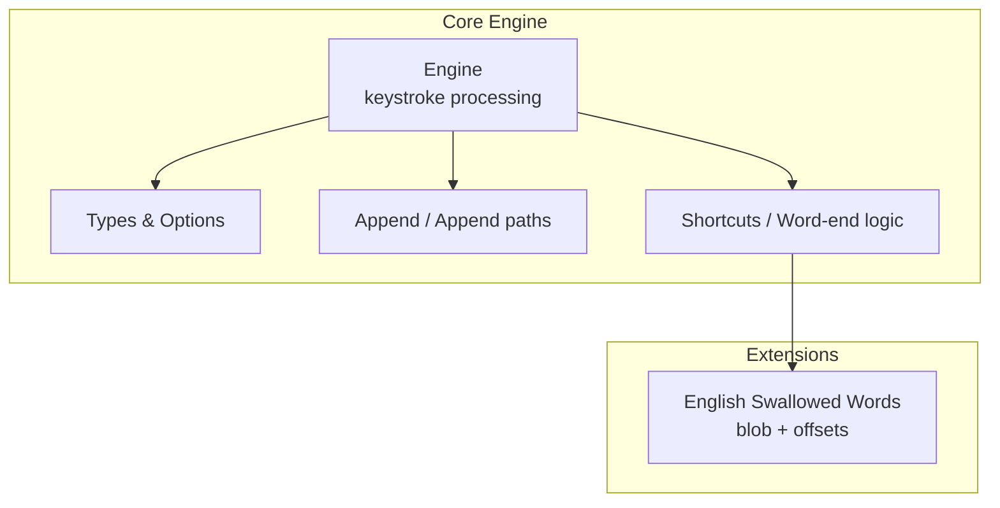
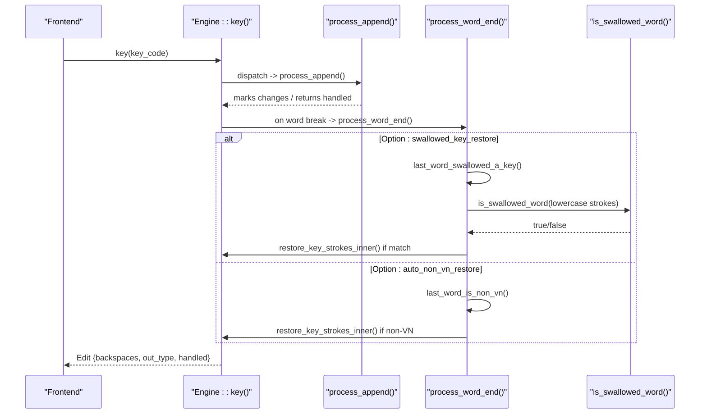
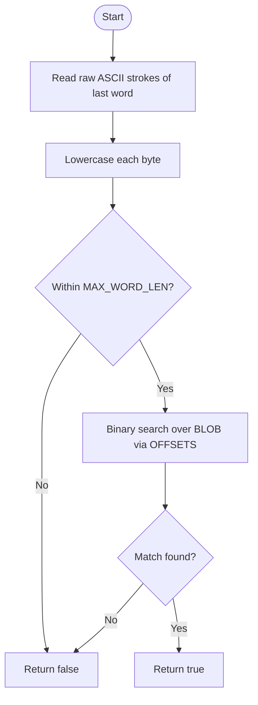
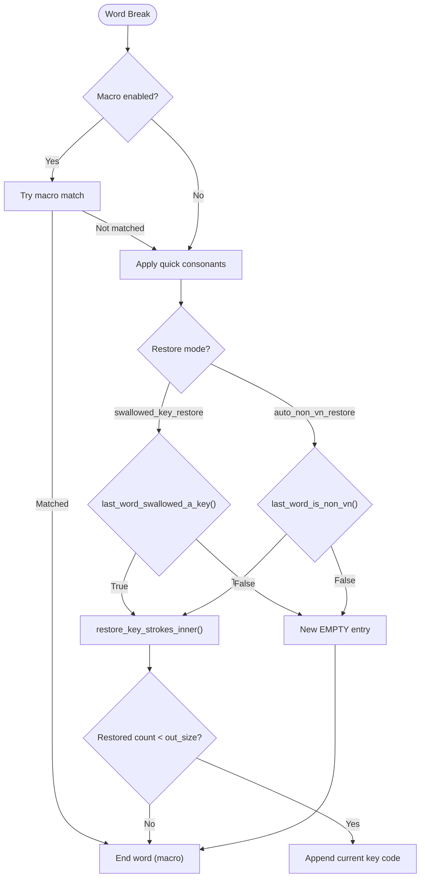
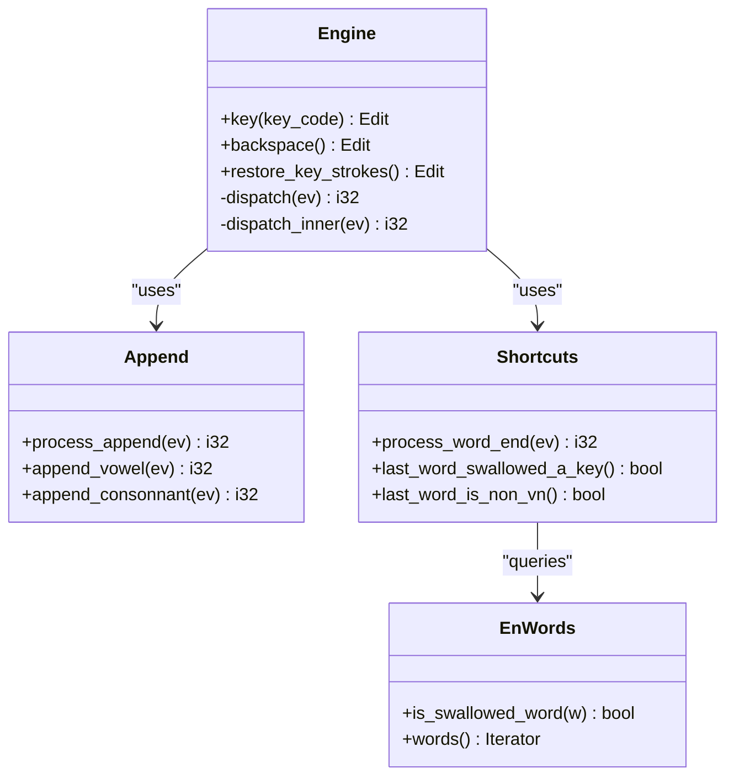
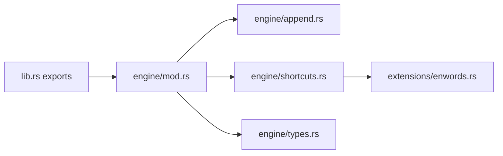

# English Word Handling

<cite>
**Referenced Files in This Document**
- [enwords.rs](file://port/skey-core/src/extensions/enwords.rs)
- [mod.rs](file://port/skey-core/src/engine/mod.rs)
- [types.rs](file://port/skey-core/src/engine/types.rs)
- [append.rs](file://port/skey-core/src/engine/append.rs)
- [shortcuts.rs](file://port/skey-core/src/engine/shortcuts.rs)
- [lib.rs](file://port/skey-core/src/lib.rs)
</cite>

## Table of Contents
1. [Introduction](#introduction)
2. [Project Structure](#project-structure)
3. [Core Components](#core-components)
4. [Architecture Overview](#architecture-overview)
5. [Detailed Component Analysis](#detailed-component-analysis)
6. [Dependency Analysis](#dependency-analysis)
7. [Performance Considerations](#performance-considerations)
8. [Troubleshooting Guide](#troubleshooting-guide)
9. [Conclusion](#conclusion)

## Introduction
This document explains the English word swallowing feature that prevents English words from being incorrectly transformed by Vietnamese typing rules. It covers how the engine detects when an English word was “swallowed” (a key consumed to produce a Vietnamese mark), how it restores the original keystrokes at word boundaries, and which configuration options control sensitivity and behavior. It also describes integration with the core engine, performance characteristics, edge cases, and practical scenarios where this improves typing experience.

## Project Structure
The English word handling spans several modules within the core engine:
- A compact dictionary of known swallowed English words is stored as a single blob with offsets for fast binary search.
- The engine’s keystroke pipeline buffers input, applies Vietnamese phonetic transformations, and at word boundaries decides whether to restore original keystrokes based on detection heuristics and user options.
- Options expose toggles for automatic restoration behaviors and spell-checking interactions.

**Diagram sources**
- [mod.rs:18-70](file://port/skey-core/src/engine/mod.rs#L18-L70)
- [types.rs:34-83](file://port/skey-core/src/engine/types.rs#L34-L83)
- [append.rs:141-196](file://port/skey-core/src/engine/append.rs#L141-L196)
- [shortcuts.rs:518-590](file://port/skey-core/src/engine/shortcuts.rs#L518-L590)
- [enwords.rs:22-53](file://port/skey-core/src/extensions/enwords.rs#L22-L53)

**Section sources**
- [lib.rs:15-42](file://port/skey-core/src/lib.rs#L15-L42)
- [mod.rs:18-70](file://port/skey-core/src/engine/mod.rs#L18-L70)
- [types.rs:34-83](file://port/skey-core/src/engine/types.rs#L34-L83)

## Core Components
- English swallowed-word table: A compact, sorted blob plus index offsets enables O(log n) lookup to detect if the last typed sequence matches a known swallowed English word.
- Engine state machine: Buffers keystrokes, tracks per-entry forms (vowel/consonant/non-Vietnamese), tones, and capitalization; dispatches events to appropriate processors.
- Word boundary handler: At word breaks, evaluates whether to restore original keystrokes using either phonotactic invalidity or explicit English swallowed-word detection.
- Options: Expose toggles for automatic restoration modes and spell-checking behavior that influence when restoration occurs.

Key responsibilities:
- Detect when a Vietnamese rule consumed a key and produced no valid Vietnamese output.
- Restore original ASCII keystrokes at word boundaries to preserve intended English text.
- Maintain accurate word boundaries and avoid interfering with legitimate Vietnamese typing.

**Section sources**
- [enwords.rs:22-53](file://port/skey-core/src/extensions/enwords.rs#L22-L53)
- [mod.rs:18-70](file://port/skey-core/src/engine/mod.rs#L18-L70)
- [shortcuts.rs:518-675](file://port/skey-core/src/engine/shortcuts.rs#L518-L675)
- [types.rs:34-83](file://port/skey-core/src/engine/types.rs#L34-L83)

## Architecture Overview
The keystroke flow integrates English word handling at word boundaries:

**Diagram sources**
- [mod.rs:249-319](file://port/skey-core/src/engine/mod.rs#L249-L319)
- [append.rs:141-196](file://port/skey-core/src/engine/append.rs#L141-L196)
- [shortcuts.rs:518-590](file://port/skey-core/src/engine/shortcuts.rs#L518-L590)
- [enwords.rs:33-48](file://port/skey-core/src/extensions/enwords.rs#L33-L48)

## Detailed Component Analysis

### English Swallowed Words Detection
- Data layout: A concatenated, sorted byte blob stores all target words; an offset array indexes each word’s start/end. Binary search compares lowercase candidate bytes against slices defined by offsets.
- Lookup function: Accepts a lowercased byte slice and returns true if present.
- Max length constant: Provides stack buffer sizing for callers.

**Diagram sources**
- [enwords.rs:22-53](file://port/skey-core/src/extensions/enwords.rs#L22-L53)
- [shortcuts.rs:625-654](file://port/skey-core/src/engine/shortcuts.rs#L625-L654)

**Section sources**
- [enwords.rs:22-53](file://port/skey-core/src/extensions/enwords.rs#L22-L53)
- [shortcuts.rs:625-654](file://port/skey-core/src/engine/shortcuts.rs#L625-L654)

### Word Boundary Restoration Logic
At word breaks, the engine decides whether to restore original keystrokes:
- If the option to restore swallowed keys is enabled, it checks whether the last word matches a known swallowed English word.
- If the option to auto-restore non-Vietnamese is enabled, it checks whether the current word is phonotactically invalid or otherwise non-Vietnamese.
- On success, it reconstructs the original keystrokes into the output buffer and marks the edit accordingly.

**Diagram sources**
- [shortcuts.rs:518-590](file://port/skey-core/src/engine/shortcuts.rs#L518-L590)
- [shortcuts.rs:592-675](file://port/skey-core/src/engine/shortcuts.rs#L592-L675)

**Section sources**
- [shortcuts.rs:518-590](file://port/skey-core/src/engine/shortcuts.rs#L518-L590)
- [shortcuts.rs:592-675](file://port/skey-core/src/engine/shortcuts.rs#L592-L675)

### Integration with Core Engine
- Keystroke entry point: Each key press prepares buffers, resets per-stroke state, dispatches to append or special handlers, and handles post-processing including potential restoration at word boundaries.
- Character classification: When configured, certain characters are treated as Vietnamese consonants to allow tonal marking while still enabling English word detection later.
- Output writing: After processing, the engine writes only changed segments to the output buffer and reports backspacing needed to the frontend.

**Diagram sources**
- [mod.rs:18-70](file://port/skey-core/src/engine/mod.rs#L18-L70)
- [mod.rs:249-319](file://port/skey-core/src/engine/mod.rs#L249-L319)
- [append.rs:141-196](file://port/skey-core/src/engine/append.rs#L141-L196)
- [shortcuts.rs:518-675](file://port/skey-core/src/engine/shortcuts.rs#L518-L675)
- [enwords.rs:22-53](file://port/skey-core/src/extensions/enwords.rs#L22-L53)

**Section sources**
- [mod.rs:249-319](file://port/skey-core/src/engine/mod.rs#L249-L319)
- [append.rs:141-196](file://port/skey-core/src/engine/append.rs#L141-L196)
- [shortcuts.rs:518-675](file://port/skey-core/src/engine/shortcuts.rs#L518-L675)

### Configuration Options
- spell_check_enabled: Controls whether the engine performs Vietnamese spell checking during composition. When disabled or in single-mode contexts, certain restoration paths may be bypassed.
- auto_non_vn_restore: Enables automatic restoration when the current word is phonotactically invalid or otherwise non-Vietnamese.
- swallowed_key_restore: Enables restoration when the last word matches a known swallowed English word pattern.
- allow_consonant_zfwj: Treats specific letters as Vietnamese consonants to allow tonal marking; affects character classification and can influence when English words are recognized.

These options directly influence when and how English words are preserved without disrupting Vietnamese typing.

**Section sources**
- [types.rs:34-83](file://port/skey-core/src/engine/types.rs#L34-L83)
- [append.rs:16-24](file://port/skey-core/src/engine/append.rs#L16-L24)
- [shortcuts.rs:518-590](file://port/skey-core/src/engine/shortcuts.rs#L518-L590)

## Dependency Analysis
- The engine depends on the append module for building words and on shortcuts for word-end decisions.
- Shortcuts depend on the English swallowed words extension to identify known problematic English sequences.
- Options propagate through the engine to gate restoration behavior and character classification.

**Diagram sources**
- [lib.rs:15-42](file://port/skey-core/src/lib.rs#L15-L42)
- [mod.rs:18-70](file://port/skey-core/src/engine/mod.rs#L18-L70)
- [append.rs:141-196](file://port/skey-core/src/engine/append.rs#L141-L196)
- [shortcuts.rs:518-675](file://port/skey-core/src/engine/shortcuts.rs#L518-L675)
- [enwords.rs:22-53](file://port/skey-core/src/extensions/enwords.rs#L22-L53)
- [types.rs:34-83](file://port/skey-core/src/engine/types.rs#L34-L83)

**Section sources**
- [lib.rs:15-42](file://port/skey-core/src/lib.rs#L15-L42)
- [mod.rs:18-70](file://port/skey-core/src/engine/mod.rs#L18-L70)

## Performance Considerations
- Compact dictionary: Storing words in a single blob with offsets minimizes memory overhead and enables fast binary search lookups.
- No allocation in hot path: The keystroke path avoids dynamic allocation; restoration uses pre-sized stack buffers based on the maximum word length.
- Minimal branching: Character classification and dispatch use efficient tables and early exits to keep latency low.
- Targeted restoration: Restoration only triggers at word boundaries and under specific conditions, reducing unnecessary work.

[No sources needed since this section provides general guidance]

## Troubleshooting Guide
Common issues and resolutions:
- English words still get mangled: Ensure swallowed_key_restore is enabled if you rely on the explicit English word list. Verify that the last word consists solely of ASCII alphabetic characters; non-ASCII or non-alphabetic inputs will not match.
- Legitimate Vietnamese words blocked: If auto_non_vn_restore is enabled, some incomplete or invalid Vietnamese sequences may trigger restoration. Adjust spell_check_enabled or disable auto restoration if conflicts occur.
- Unexpected behavior with z/f/w/j: If allow_consonant_zfwj is enabled, these keys participate in Vietnamese tone application, which can delay recognition of English words until a word break. Disable if you need immediate pass-through for English-only contexts.
- Edge cases with abbreviations or mixed content: The engine treats word breaks as separators; ensure your input method emits proper word breaks between English and Vietnamese segments.

**Section sources**
- [shortcuts.rs:518-590](file://port/skey-core/src/engine/shortcuts.rs#L518-L590)
- [shortcuts.rs:592-675](file://port/skey-core/src/engine/shortcuts.rs#L592-L675)
- [append.rs:16-24](file://port/skey-core/src/engine/append.rs#L16-L24)
- [types.rs:34-83](file://port/skey-core/src/engine/types.rs#L34-L83)

## Conclusion
The English word swallowing feature enhances multilingual typing by detecting and restoring English words that would otherwise be corrupted by Vietnamese phonetic rules. It leverages a compact dictionary and precise word-boundary logic to minimize false positives while preserving smooth Vietnamese typing. With configurable options, users can tailor sensitivity to their workflows—coding, technical writing, and multilingual documents—without sacrificing performance or accuracy.

[No sources needed since this section summarizes without analyzing specific files]