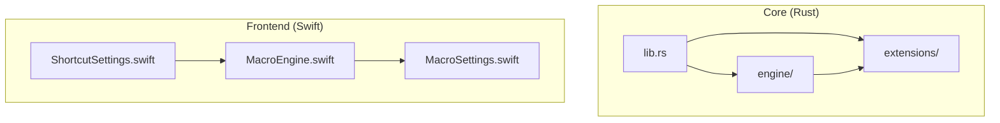
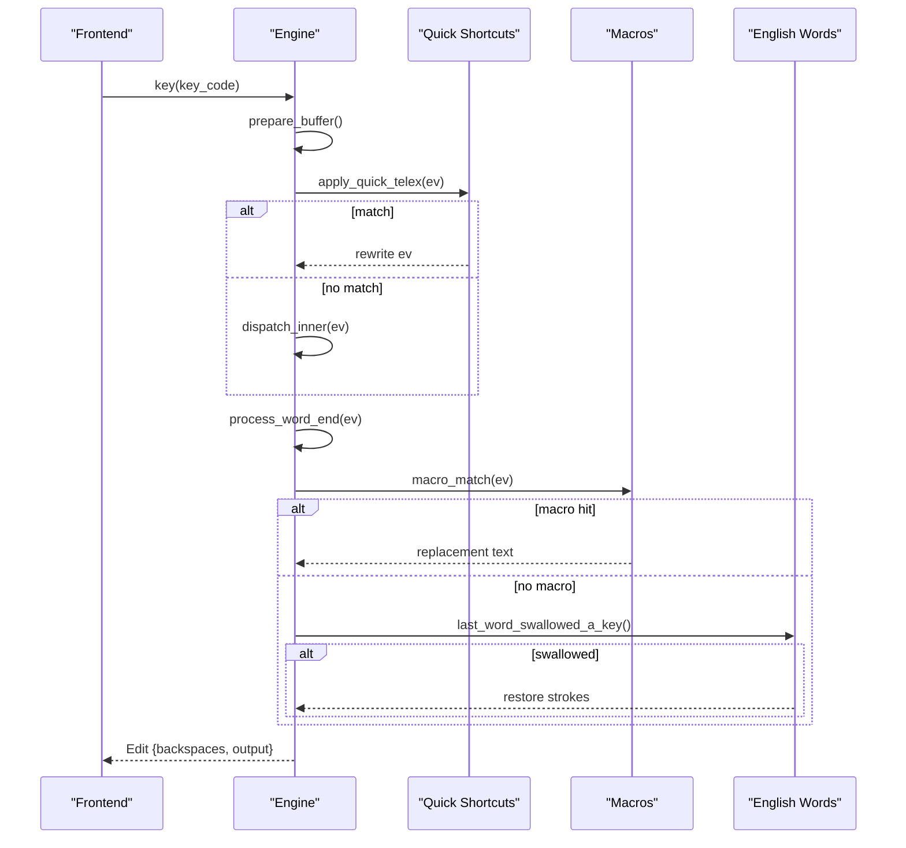
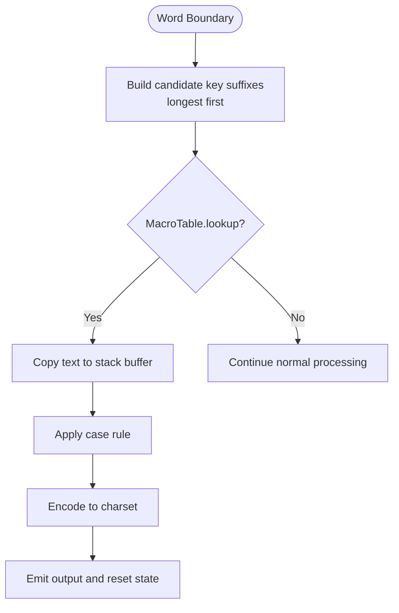
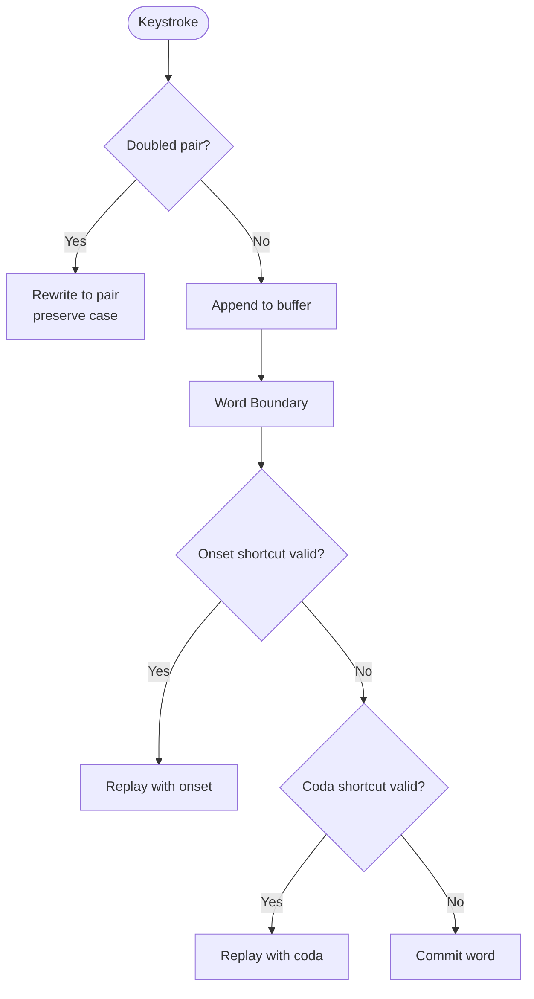
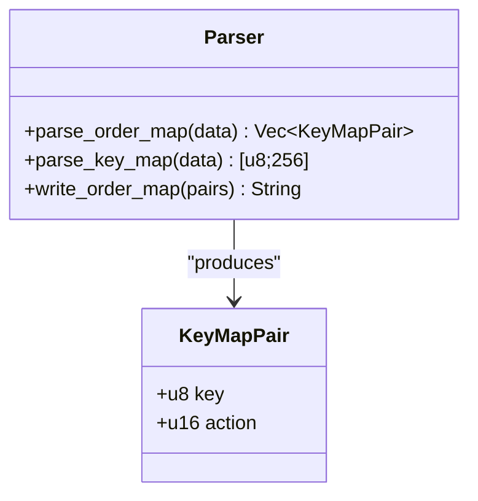
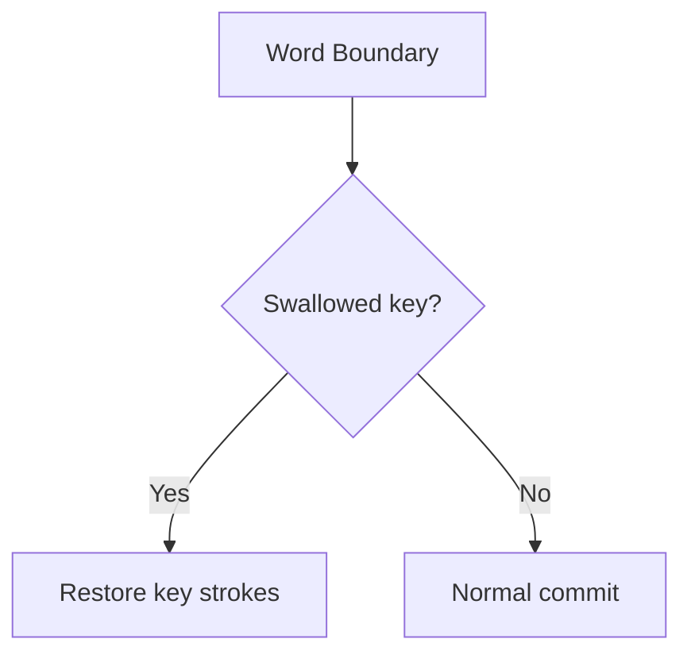
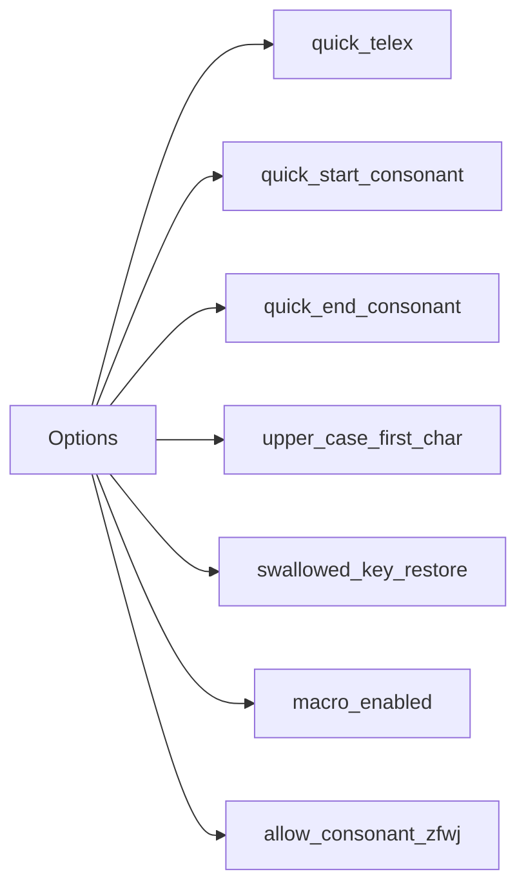
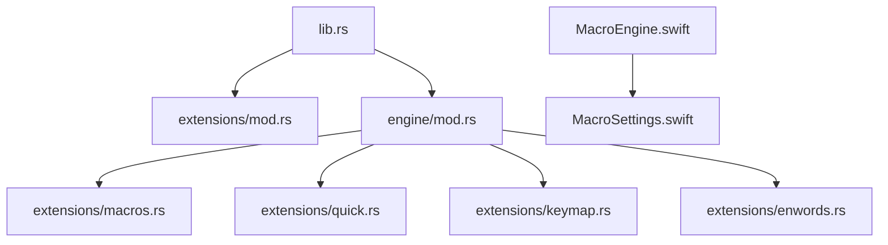

# Extensions System

<cite>
**Referenced Files in This Document**
- [mod.rs](file://port/skey-core/src/extensions/mod.rs)
- [macros.rs](file://port/skey-core/src/extensions/macros.rs)
- [quick.rs](file://port/skey-core/src/extensions/quick.rs)
- [keymap.rs](file://port/skey-core/src/extensions/keymap.rs)
- [enwords.rs](file://port/skey-core/src/extensions/enwords.rs)
- [lib.rs](file://port/skey-core/src/lib.rs)
- [engine_mod.rs](file://port/skey-core/src/engine/mod.rs)
- [engine_types.rs](file://port/skey-core/src/engine/types.rs)
- [engine_shortcuts.rs](file://port/skey-core/src/engine/shortcuts.rs)
- [MacroEngine.swift](file://macos/skey-app/Sources/Features/Keyboard/Engine/MacroEngine.swift)
- [MacroSettings.swift](file://macos/skey-app/Sources/Shared/Settings/Modules/MacroSettings.swift)
- [ShortcutSettings.swift](file://macos/skey-app/Sources/Shared/Settings/Modules/ShortcutSettings.swift)
- [MacroItem.swift](file://macos/skey-app/Sources/Features/Keyboard/Models/MacroItem.swift)
- [quick_tests.rs](file://port/skey-core/tests/quick.rs)
</cite>

## Table of Contents
1. [Introduction](#introduction)
2. [Project Structure](#project-structure)
3. [Core Components](#core-components)
4. [Architecture Overview](#architecture-overview)
5. [Detailed Component Analysis](#detailed-component-analysis)
6. [Dependency Analysis](#dependency-analysis)
7. [Performance Considerations](#performance-considerations)
8. [Troubleshooting Guide](#troubleshooting-guide)
9. [Conclusion](#conclusion)
10. [Appendices](#appendices)

## Introduction
This document explains the extensions system that augments the core Vietnamese typing engine with additional functionality beyond basic phonetic conversion. It covers:
- The macro system for text expansion and shortcuts
- Quick shortcuts for rapid insertion of common sequences
- Keymap extension for custom input method configurations and language-specific mappings
- English word swallowing prevention to avoid unintended mangling by Vietnamese rules
- How extensions are loaded, configured, and integrated with the core engine
- Examples for creating and configuring extensions
- Performance implications and how zero-allocation guarantees are maintained where possible

## Project Structure
The extensions live under a dedicated module and are conditionally compiled when memory allocation is available. The core engine integrates them via options and dispatch hooks. A Swift frontend provides user-facing configuration and runtime behavior for macros and shortcuts.

**Diagram sources**
- [lib.rs:15-38](file://port/skey-core/src/lib.rs#L15-L38)
- [engine_mod.rs:15-44](file://port/skey-core/src/engine/mod.rs#L15-L44)
- [mod.rs:1-9](file://port/skey-core/src/extensions/mod.rs#L1-L9)
- [MacroEngine.swift:1-111](file://macos/skey-app/Sources/Features/Keyboard/Engine/MacroEngine.swift#L1-L111)
- [MacroSettings.swift:1-125](file://macos/skey-app/Sources/Shared/Settings/Modules/MacroSettings.swift#L1-L125)
- [ShortcutSettings.swift:1-330](file://macos/skey-app/Sources/Shared/Settings/Modules/ShortcutSettings.swift#L1-L330)

**Section sources**
- [lib.rs:15-38](file://port/skey-core/src/lib.rs#L15-L38)
- [mod.rs:1-9](file://port/skey-core/src/extensions/mod.rs#L1-L9)

## Core Components
- Macro table: stores key-to-text mappings, supports loading from bytes, sorting, and lookup with case-folding semantics.
- Quick shortcuts: compact tables for doubled consonants, onset substitutions, and coda substitutions; applied at keystroke or word boundaries.
- Keymap parser: reads user-defined key mapping files and produces action maps used by the input processor.
- English swallowed-word detection: compact sorted blob with offsets to detect specific English words whose keys were swallowed by Vietnamese rules.
- Engine integration: options gate features; dispatch hooks call into extensions at appropriate points without allocations on hot paths.

**Section sources**
- [macros.rs:1-297](file://port/skey-core/src/extensions/macros.rs#L1-L297)
- [quick.rs:1-82](file://port/skey-core/src/extensions/quick.rs#L1-L82)
- [keymap.rs:1-203](file://port/skey-core/src/extensions/keymap.rs#L1-L203)
- [enwords.rs:1-54](file://port/skey-core/src/extensions/enwords.rs#L1-L54)
- [engine_types.rs:31-105](file://port/skey-core/src/engine/types.rs#L31-L105)
- [engine_mod.rs:15-44](file://port/skey-core/src/engine/mod.rs#L15-L44)

## Architecture Overview
Extensions are optional and feature-gated. The core engine exposes an Options struct that enables or disables behaviors like quick shortcuts, auto capitalization, and swallowed-key restoration. When enabled, the engine calls into extension logic at well-defined points:
- On keystroke: quick Telex doubling and onset/coda checks
- On word boundary: macro matching and potential stroke restoration
- On input method change: keymap parsing can reconfigure event handling

**Diagram sources**
- [engine_mod.rs:249-319](file://port/skey-core/src/engine/mod.rs#L249-L319)
- [engine_shortcuts.rs:518-590](file://port/skey-core/src/engine/shortcuts.rs#L518-L590)
- [engine_shortcuts.rs:232-297](file://port/skey-core/src/engine/shortcuts.rs#L232-L297)
- [macros.rs:97-107](file://port/skey-core/src/extensions/macros.rs#L97-L107)
- [enwords.rs:34-48](file://port/skey-core/src/extensions/enwords.rs#L34-L48)

## Detailed Component Analysis

### Macro System
- Storage: a contiguous arena holds all keys and texts, with a slim index for fast binary search. Case-folding comparison ensures robust lookups.
- Loading: accepts raw bytes, detects version header, decodes charset, parses lines, sorts entries, and preserves ordering semantics.
- Matching: walks the current word suffixes longest-first, copies matched text into stack buffers, applies case transformation, encodes to target charset, and emits output without heap allocation on the hot path.
- Frontend integration: a Swift MacroEngine maintains an in-memory map keyed by lowercase shortcut, tracks current word buffer, and evaluates on space with optional auto-caps behavior. Settings persist items and toggle behavior.

**Diagram sources**
- [macros.rs:97-107](file://port/skey-core/src/extensions/macros.rs#L97-L107)
- [macros.rs:150-166](file://port/skey-core/src/extensions/macros.rs#L150-L166)
- [macros.rs:193-223](file://port/skey-core/src/extensions/macros.rs#L193-L223)
- [engine_shortcuts.rs:44-180](file://port/skey-core/src/engine/shortcuts.rs#L44-L180)
- [MacroEngine.swift:71-109](file://macos/skey-app/Sources/Features/Keyboard/Engine/MacroEngine.swift#L71-L109)
- [MacroSettings.swift:18-125](file://macos/skey-app/Sources/Shared/Settings/Modules/MacroSettings.swift#L18-L125)

**Section sources**
- [macros.rs:1-297](file://port/skey-core/src/extensions/macros.rs#L1-L297)
- [engine_shortcuts.rs:44-180](file://port/skey-core/src/engine/shortcuts.rs#L44-L180)
- [MacroEngine.swift:1-111](file://macos/skey-app/Sources/Features/Keyboard/Engine/MacroEngine.swift#L1-L111)
- [MacroSettings.swift:1-125](file://macos/skey-app/Sources/Shared/Settings/Modules/MacroSettings.swift#L1-L125)

### Quick Shortcuts
- Doubled consonants: immediate substitution on repeated letter pairs, preserving case.
- Onset shortcuts: substitute initial letters (e.g., f→ph, j→gi, w→qu) only when safe at word start.
- Coda shortcuts: substitute final letters (e.g., g→ng, h→nh, k→ch) only when they rescue an otherwise invalid word.
- Integration: checked early per keystroke for doubled pairs; onset/coda evaluated at word boundary using a trial run to ensure validity.

**Diagram sources**
- [quick.rs:10-82](file://port/skey-core/src/extensions/quick.rs#L10-L82)
- [engine_shortcuts.rs:232-297](file://port/skey-core/src/engine/shortcuts.rs#L232-L297)
- [engine_shortcuts.rs:374-515](file://port/skey-core/src/engine/shortcuts.rs#L374-L515)
- [quick_tests.rs:23-180](file://port/skey-core/tests/quick.rs#L23-L180)

**Section sources**
- [quick.rs:1-82](file://port/skey-core/src/extensions/quick.rs#L1-L82)
- [engine_shortcuts.rs:232-515](file://port/skey-core/src/engine/shortcuts.rs#L232-L515)
- [quick_tests.rs:1-304](file://port/skey-core/tests/quick.rs#L1-L304)

### Keymap Extension
- Parses user-defined key mapping files into a 256-entry action map consumed by the input processor.
- Supports named actions (tones, roofs, bowls, telex modifiers) and character mappings; duplicates are rejected silently.
- Provides both parse and write helpers to round-trip mappings.

**Diagram sources**
- [keymap.rs:112-178](file://port/skey-core/src/extensions/keymap.rs#L112-L178)
- [keymap.rs:180-203](file://port/skey-core/src/extensions/keymap.rs#L180-L203)

**Section sources**
- [keymap.rs:1-203](file://port/skey-core/src/extensions/keymap.rs#L1-L203)

### English Word Swallowing Prevention
- Detects specific English words whose keys were swallowed by Vietnamese rules (no mark produced).
- Uses a compact sorted blob with offsets for O(log n) lookup without heap allocation.
- At word boundary, if detected and enabled, restores original key strokes instead of emitting mangled output.

**Diagram sources**
- [enwords.rs:22-54](file://port/skey-core/src/extensions/enwords.rs#L22-L54)
- [engine_shortcuts.rs:625-654](file://port/skey-core/src/engine/shortcuts.rs#L625-L654)
- [engine_shortcuts.rs:550-565](file://port/skey-core/src/engine/shortcuts.rs#L550-L565)

**Section sources**
- [enwords.rs:1-54](file://port/skey-core/src/extensions/enwords.rs#L1-L54)
- [engine_shortcuts.rs:550-654](file://port/skey-core/src/engine/shortcuts.rs#L550-L654)

### Engine Integration and Configuration
- Options control which extensions activate: quick shortcuts, upper-case first char, swallowed-key restoration, macro enablement, and allowing z/f/w/j as consonants.
- The engine’s dispatch pipeline calls extension logic at precise points to avoid extra allocations and preserve performance.
- Feature flags gate allocator-dependent components (macros, keymap), ensuring the core keystroke path remains zero-allocation.

**Diagram sources**
- [engine_types.rs:31-105](file://port/skey-core/src/engine/types.rs#L31-L105)
- [engine_mod.rs:15-44](file://port/skey-core/src/engine/mod.rs#L15-L44)

**Section sources**
- [engine_types.rs:31-105](file://port/skey-core/src/engine/types.rs#L31-L105)
- [engine_mod.rs:15-44](file://port/skey-core/src/engine/mod.rs#L15-L44)

## Dependency Analysis
- The extensions module is exposed through the library root and selectively re-exported based on features.
- The engine depends on extensions only when features are enabled; otherwise, those paths compile to no-ops.
- Frontend settings drive runtime toggles and data for macros and shortcuts.

**Diagram sources**
- [lib.rs:15-38](file://port/skey-core/src/lib.rs#L15-L38)
- [engine_mod.rs:15-44](file://port/skey-core/src/engine/mod.rs#L15-L44)
- [mod.rs:1-9](file://port/skey-core/src/extensions/mod.rs#L1-L9)
- [MacroEngine.swift:1-111](file://macos/skey-app/Sources/Features/Keyboard/Engine/MacroEngine.swift#L1-L111)
- [MacroSettings.swift:1-125](file://macos/skey-app/Sources/Shared/Settings/Modules/MacroSettings.swift#L1-L125)

**Section sources**
- [lib.rs:15-38](file://port/skey-core/src/lib.rs#L15-L38)
- [engine_mod.rs:15-44](file://port/skey-core/src/engine/mod.rs#L15-L44)

## Performance Considerations
- Zero-allocation hot path: the keystroke path avoids heap allocations; macros and keymaps use alloc only when explicitly enabled.
- Compact storage: macro table uses a single arena and a slim index; English word list uses a compressed blob with offsets.
- Early exits and guards: quick shortcuts check minimal conditions before deeper work; onset/coda validation uses a throwaway engine instance to avoid recursion.
- Deterministic behavior: default options disable non-core features to keep baseline behavior identical to the original engine.

[No sources needed since this section provides general guidance]

## Troubleshooting Guide
- Macros not expanding:
  - Ensure macro_enabled is set and the macro store is populated.
  - Verify that the shortcut is lowercased and trimmed before lookup.
  - Confirm that Shift+Space or Enter do not bypass expansion.
- Quick shortcuts not applying:
  - Check corresponding option flags (quick_telex, quick_start_consonant, quick_end_consonant).
  - Validate that onset/coda substitutions only apply when they rescue an invalid word.
- English words still mangled:
  - Enable swallowed_key_restore and confirm the word is in the internal list.
  - Ensure spell_check_enabled or single_mode does not interfere with restoration triggers.
- Keymap changes ignored:
  - Verify file format and that duplicate assignments are not present.
  - Confirm the parsed map is applied to the input processor.

**Section sources**
- [engine_shortcuts.rs:44-180](file://port/skey-core/src/engine/shortcuts.rs#L44-L180)
- [engine_shortcuts.rs:232-515](file://port/skey-core/src/engine/shortcuts.rs#L232-L515)
- [engine_shortcuts.rs:550-654](file://port/skey-core/src/engine/shortcuts.rs#L550-L654)
- [keymap.rs:126-178](file://port/skey-core/src/extensions/keymap.rs#L126-L178)
- [MacroEngine.swift:71-109](file://macos/skey-app/Sources/Features/Keyboard/Engine/MacroEngine.swift#L71-L109)

## Conclusion
The extensions system enhances the core engine with powerful, configurable capabilities while preserving performance and compatibility. Macros provide flexible text expansion, quick shortcuts accelerate common typing patterns, keymaps allow deep customization, and English word swallowing prevention safeguards against unintended mangling. All features integrate cleanly via options and dispatch hooks, with careful attention to zero-allocation constraints and deterministic defaults.

[No sources needed since this section summarizes without analyzing specific files]

## Appendices

### Creating Custom Extensions
- Add new quick shortcuts:
  - Extend the constant tables in the quick module and update any relevant checks in the engine’s dispatch or word-end logic.
  - Gate behavior behind Options fields to keep defaults stable.
- Define new macros:
  - Populate the MacroTable via add_line or add_item, ensuring keys and text respect length limits and charset encoding.
  - Use the existing case-handling and encoding paths to maintain consistency.
- Customize keymaps:
  - Write mapping files using supported labels and parse them into the 256-entry map; validate for duplicates and unknown labels.

**Section sources**
- [quick.rs:10-82](file://port/skey-core/src/extensions/quick.rs#L10-L82)
- [engine_shortcuts.rs:232-515](file://port/skey-core/src/engine/shortcuts.rs#L232-L515)
- [macros.rs:150-223](file://port/skey-core/src/extensions/macros.rs#L150-L223)
- [keymap.rs:126-178](file://port/skey-core/src/extensions/keymap.rs#L126-L178)

### Configuring Existing Extensions
- Enable/disable features via Options:
  - quick_telex, quick_start_consonant, quick_end_consonant, upper_case_first_char, swallowed_key_restore, macro_enabled, allow_consonant_zfwj.
- Manage macros in the frontend:
  - Use MacroSettings to add/remove items, toggle auto-caps, and persist changes.
  - MacroEngine reloads its in-memory map upon save.
- Configure shortcuts:
  - Use ShortcutSettings to assign presets or custom combinations for language toggle, clipboard, cleaner, and AI features.

**Section sources**
- [engine_types.rs:31-105](file://port/skey-core/src/engine/types.rs#L31-L105)
- [MacroSettings.swift:18-125](file://macos/skey-app/Sources/Shared/Settings/Modules/MacroSettings.swift#L18-L125)
- [MacroEngine.swift:71-109](file://macos/skey-app/Sources/Features/Keyboard/Engine/MacroEngine.swift#L71-L109)
- [ShortcutSettings.swift:1-330](file://macos/skey-app/Sources/Shared/Settings/Modules/ShortcutSettings.swift#L1-L330)