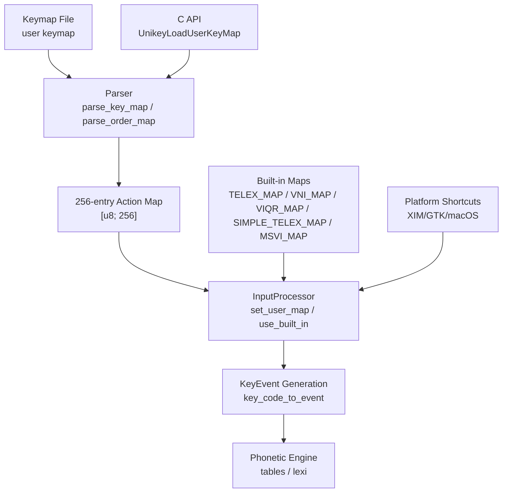
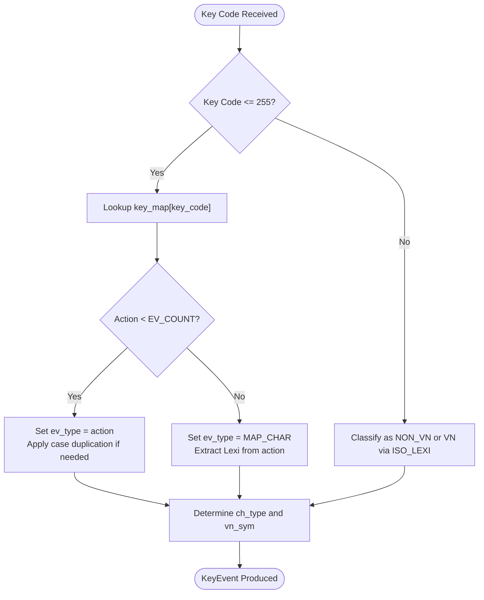
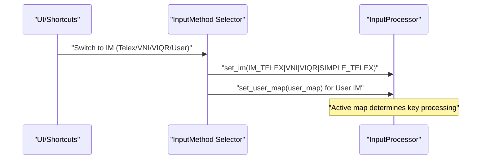
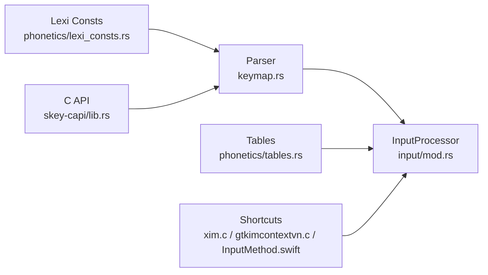

# Keymap Extension

<cite>
**Referenced Files in This Document**
- [keymap.rs](file://port/skey-core/src/extensions/keymap.rs)
- [mod.rs (input)](file://port/skey-core/src/input/mod.rs)
- [tables.rs](file://port/skey-core/src/phonetics/tables.rs)
- [lexi_consts.rs](file://port/skey-core/src/phonetics/lexi_consts.rs)
- [usrkeymap.h](file://src/ukengine/usrkeymap.h)
- [usrkeymap.cpp](file://src/ukengine/usrkeymap.cpp)
- [lib.rs (skey-capi)](file://port/skey-capi/src/lib.rs)
- [xim.c](file://src/xim/xim.c)
- [gtkimcontextvn.c](file://src/unikey-gtk/gtkimcontextvn.c)
- [InputMethod.swift](file://macos/skey-app/Sources/Features/Keyboard/Engine/InputMethod.swift)
- [MacroEngine.swift](file://macos/skey-app/Sources/Features/Keyboard/Engine/MacroEngine.swift)
</cite>

## Table of Contents
1. [Introduction](#introduction)
2. [Project Structure](#project-structure)
3. [Core Components](#core-components)
4. [Architecture Overview](#architecture-overview)
5. [Detailed Component Analysis](#detailed-component-analysis)
6. [Dependency Analysis](#dependency-analysis)
7. [Performance Considerations](#performance-considerations)
8. [Troubleshooting Guide](#troubleshooting-guide)
9. [Conclusion](#conclusion)
10. [Appendices](#appendices)

## Introduction
This document explains the keymap extension that enables custom input method configurations and language-specific mappings. It describes how physical keystrokes are mapped to output characters or actions, the keymap file format and syntax rules, validation behavior, loading process, conflict resolution, and priority handling. It also covers compatibility with built-in input methods (Telex, VNI, VIQR, Simple Telex, MS-VI) and how to extend them with user-defined maps. Finally, it provides guidance on debugging and testing custom configurations.

## Project Structure
The keymap system spans multiple layers:
- Core parser and mapping logic in Rust under port/skey-core
- Input processor and event classification in port/skey-core
- Built-in input method tables for Telex/VNI/VIQR/Simple Telex/MS-VI
- Legacy C++ implementation for compatibility
- C API for loading user keymaps from front ends
- Platform integrations (XIM/GTK/X11 shortcuts; macOS engine integration)



**Diagram sources**
- [keymap.rs:126-178](file://port/skey-core/src/extensions/keymap.rs#L126-L178)
- [mod.rs (input):94-148](file://port/skey-core/src/input/mod.rs#L94-L148)
- [tables.rs:676-694](file://port/skey-core/src/phonetics/tables.rs#L676-L694)
- [lib.rs (skey-capi):264-276](file://port/skey-capi/src/lib.rs#L264-L276)

**Section sources**
- [keymap.rs:1-203](file://port/skey-core/src/extensions/keymap.rs#L1-L203)
- [mod.rs (input):1-215](file://port/skey-core/src/input/mod.rs#L1-L215)
- [tables.rs:676-694](file://port/skey-core/src/phonetics/tables.rs#L676-L694)
- [lib.rs (skey-capi):264-276](file://port/skey-capi/src/lib.rs#L264-L276)

## Core Components
- Keymap Parser: Reads a text-based keymap file into an ordered list of key-action pairs and then collapses into a 256-entry action map used by the input processor.
- Input Processor: Holds the current input method and a 256-entry key map. It can be set to built-in maps or a user-provided map. It converts key codes to events and determines character types.
- Built-in Input Methods: Telex, VNI, VIQR, Simple Telex, and MS-VI are defined as compact key-to-action arrays.
- C API: Provides UnikeyLoadUserKeyMap to load a user keymap file and install it into the engine.
- Platform Shortcuts: XIM/GTK and macOS define shortcuts to switch between input methods and to restore keys.

**Section sources**
- [keymap.rs:126-178](file://port/skey-core/src/extensions/keymap.rs#L126-L178)
- [mod.rs (input):94-148](file://port/skey-core/src/input/mod.rs#L94-L148)
- [tables.rs:676-694](file://port/skey-core/src/phonetics/tables.rs#L676-L694)
- [lib.rs (skey-capi):264-276](file://port/skey-capi/src/lib.rs#L264-L276)
- [xim.c:248-263](file://src/xim/xim.c#L248-L263)
- [gtkimcontextvn.c:79-95](file://src/unikey-gtk/gtkimcontextvn.c#L79-L95)
- [InputMethod.swift:5-19](file://macos/skey-app/Sources/Features/Keyboard/Engine/InputMethod.swift#L5-L19)

## Architecture Overview
The keymap extension integrates at the boundary between raw keystrokes and the phonetic engine. The flow is:
1. Front end reads a keymap file and calls the C API to load it.
2. The parser validates lines, resolves labels to actions, enforces single-character keys, and prevents duplicate assignments.
3. The resulting 256-entry map is installed into the InputProcessor via set_user_map, switching the IM to user mode.
4. Incoming key codes are classified and converted to KeyEvent objects using the active map.
5. Events are processed by the phonetic engine to produce Vietnamese characters or other outputs.

```mermaid
sequenceDiagram
participant FE as "Front End"
participant API as "C API"
participant P as "Parser"
participant IP as "InputProcessor"
participant ENG as "Phonetic Engine"
FE->>API : "UnikeyLoadUserKeyMap(path)"
API->>P : "parse_key_map(data)"
P-->>API : "[u8; 256]"
API->>IP : "set_user_map(map)"
IP->>ENG : "use map for key_code_to_event()"
Note over IP,ENG : "Subsequent keystrokes use the user keymap"
```

**Diagram sources**
- [lib.rs (skey-capi):264-276](file://port/skey-capi/src/lib.rs#L264-L276)
- [keymap.rs:126-178](file://port/skey-core/src/extensions/keymap.rs#L126-L178)
- [mod.rs (input):122-148](file://port/skey-core/src/input/mod.rs#L122-L148)

## Detailed Component Analysis

### Keymap File Format and Syntax
- Lines are parsed as name=value pairs with optional comments after semicolon.
- Name must be exactly one ASCII character representing the physical key.
- Value must be a recognized label from the supported set (tone marks, roof/hook modifiers, escape, Telex-W, or specific character mappings).
- Duplicate assignments for the same key are silently rejected; unknown labels are skipped.
- Case handling:
  - For action-type mappings (below EV_COUNT), both upper and lower case are applied automatically.
  - For character-mapping entries (EV_COUNT + lexi), the case is explicit in the label and only the specified case is mapped.

Supported labels include tone marks (Tone0..Tone5), roof modifiers (Roof-All, Roof-A/E/O), hook modifiers (Hook-Bowl, Hook-UO/U/O), bowl (Bowl), D-Mark (DD), Telex-W, Escape, and direct character mappings such as DD/dd, A^/a^, A(/a(, E^/e^, O^/o^, O+/o+, U+/u+.

Validation and parsing details:
- Comments starting with semicolon are stripped before parsing.
- Whitespace around name/value is trimmed.
- Lines without a valid name=value pair are ignored.
- If the name is not a single character, the line is ignored.
- If the value does not match any known label, the line is ignored.

Conflict resolution:
- First assignment wins; subsequent attempts to reassign the same key are ignored.
- This ensures deterministic behavior when merging multiple keymap files or when duplicates exist.

Priority handling:
- User keymaps override built-in maps because set_user_map replaces the entire 256-entry table and switches IM to user mode.
- When switching back to a built-in IM, use_built_in resets the map to the selected built-in mapping.

**Section sources**
- [keymap.rs:66-110](file://port/skey-core/src/extensions/keymap.rs#L66-L110)
- [keymap.rs:126-178](file://port/skey-core/src/extensions/keymap.rs#L126-L178)
- [usrkeymap.cpp:178-214](file://src/ukengine/usrkeymap.cpp#L178-L214)

### Input Processing and Event Classification
- InputProcessor maintains the current IM and a 256-entry key map.
- set_im selects a built-in map (Telex, VNI, VIQR, MS-VI, Simple Telex) and applies it, including automatic case duplication for action-type mappings.
- set_user_map installs a user-provided map and sets IM to user mode.
- key_code_to_event uses the active map to convert key codes to KeyEvent objects, classifying whether the key is Vietnamese, non-Vietnamese, word-break, or reset.
- Character type determination relies on UKC_MAP and ISO_LEXI tables for accurate classification.



**Diagram sources**
- [mod.rs (input):150-192](file://port/skey-core/src/input/mod.rs#L150-L192)
- [tables.rs:150-168](file://port/skey-core/src/phonetics/tables.rs#L150-L168)

**Section sources**
- [mod.rs (input):94-148](file://port/skey-core/src/input/mod.rs#L94-L148)
- [mod.rs (input):150-192](file://port/skey-core/src/input/mod.rs#L150-L192)
- [tables.rs:150-168](file://port/skey-core/src/phonetics/tables.rs#L150-L168)

### Built-in Input Methods Compatibility
- Telex: Uses tone keys Z/S/F/R/X/J, W for Telex-W, roof keys A/E/O, D for dd, and bracket keys for certain diacritics.
- VNI: Uses number keys for tones and modifiers.
- VIQR: Uses punctuation and symbols for tones and modifiers, plus escape.
- Simple Telex: Similar to Telex but with different modifier behavior for W.
- MS-VI: Microsoft-style mapping with additional combinations.

These maps are compact arrays of (key, action) pairs and are loaded via use_built_in, which initializes the 256-entry table and applies case duplication for action-type mappings.

**Section sources**
- [tables.rs:676-694](file://port/skey-core/src/phonetics/tables.rs#L676-L694)
- [mod.rs (input):94-148](file://port/skey-core/src/input/mod.rs#L94-L148)

### Loading Process and Integration Points
- C API exposes UnikeyLoadUserKeyMap to read a file and call parse_key_map, then set_user_map on the engine’s input processor.
- Platform shortcuts allow switching between input methods and restoring keys:
  - XIM/GTK define shortcuts like Control+Shift+F5 for Telex, F6 for VNI, F7 for VIQR, F8 for user input, and F9 for switching.
  - macOS defines InputMethodType values for Telex, VNI, VIQR, and Simple Telex.



**Diagram sources**
- [lib.rs (skey-capi):264-276](file://port/skey-capi/src/lib.rs#L264-L276)
- [xim.c:248-263](file://src/xim/xim.c#L248-L263)
- [gtkimcontextvn.c:79-95](file://src/unikey-gtk/gtkimcontextvn.c#L79-L95)
- [InputMethod.swift:5-19](file://macos/skey-app/Sources/Features/Keyboard/Engine/InputMethod.swift#L5-L19)

**Section sources**
- [lib.rs (skey-capi):264-276](file://port/skey-capi/src/lib.rs#L264-L276)
- [xim.c:248-263](file://src/xim/xim.c#L248-L263)
- [gtkimcontextvn.c:79-95](file://src/unikey-gtk/gtkimcontextvn.c#L79-L95)
- [InputMethod.swift:5-19](file://macos/skey-app/Sources/Features/Keyboard/Engine/InputMethod.swift#L5-L19)

### Extending Existing Input Methods
- To extend Telex/VNI/VIQR, create a user keymap file that adds or overrides mappings while preserving existing behavior.
- Use recognized labels to ensure compatibility with the phonetic engine.
- Place your custom mappings early in the file to establish baseline behavior; later duplicates will be ignored due to first-wins conflict resolution.
- For specialized keyboards or personal preferences, map non-standard keys to actions or character mappings using supported labels.

Examples of customization scenarios:
- Add a new tone shortcut by assigning an unused key to Tone0..Tone5.
- Remap roof/hook modifiers to more ergonomic keys.
- Bind frequently used characters directly via character mapping labels (e.g., A^/a^, O+/o+, U+/u+).

**Section sources**
- [keymap.rs:126-178](file://port/skey-core/src/extensions/keymap.rs#L126-L178)
- [tables.rs:676-694](file://port/skey-core/src/phonetics/tables.rs#L676-L694)

### Macros and Shortcuts Interaction
- MacroEngine handles text expansion based on configured shortcuts, separate from keymaps.
- While keymaps control how keystrokes are interpreted by the input method, macros expand predefined sequences into longer text.
- Ensure macro shortcuts do not conflict with keymap actions to avoid unintended behavior.

**Section sources**
- [MacroEngine.swift:1-46](file://macos/skey-app/Sources/Features/Keyboard/Engine/MacroEngine.swift#L1-L46)

## Dependency Analysis
Key dependencies and relationships:
- Parser depends on input constants (EV_COUNT, NORMAL) and lexi constants for character mappings.
- InputProcessor depends on tables for built-in maps and character classification.
- C API bridges file I/O and core parsing, exposing a stable interface for front ends.
- Platform integrations rely on the C API and InputProcessor to switch IMs and apply user maps.



**Diagram sources**
- [keymap.rs:1-203](file://port/skey-core/src/extensions/keymap.rs#L1-L203)
- [mod.rs (input):1-215](file://port/skey-core/src/input/mod.rs#L1-L215)
- [tables.rs:676-694](file://port/skey-core/src/phonetics/tables.rs#L676-L694)
- [lexi_consts.rs:1-301](file://port/skey-core/src/phonetics/lexi_consts.rs#L1-L301)
- [lib.rs (skey-capi):264-276](file://port/skey-capi/src/lib.rs#L264-L276)
- [xim.c:248-263](file://src/xim/xim.c#L248-L263)
- [gtkimcontextvn.c:79-95](file://src/unikey-gtk/gtkimcontextvn.c#L79-L95)
- [InputMethod.swift:5-19](file://macos/skey-app/Sources/Features/Keyboard/Engine/InputMethod.swift#L5-L19)

**Section sources**
- [keymap.rs:1-203](file://port/skey-core/src/extensions/keymap.rs#L1-L203)
- [mod.rs (input):1-215](file://port/skey-core/src/input/mod.rs#L1-L215)
- [tables.rs:676-694](file://port/skey-core/src/phonetics/tables.rs#L676-L694)
- [lexi_consts.rs:1-301](file://port/skey-core/src/phonetics/lexi_consts.rs#L1-L301)
- [lib.rs (skey-capi):264-276](file://port/skey-capi/src/lib.rs#L264-L276)
- [xim.c:248-263](file://src/xim/xim.c#L248-L263)
- [gtkimcontextvn.c:79-95](file://src/unikey-gtk/gtkimcontextvn.c#L79-L95)
- [InputMethod.swift:5-19](file://macos/skey-app/Sources/Features/Keyboard/Engine/InputMethod.swift#L5-L19)

## Performance Considerations
- The 256-entry key map allows O(1) lookup per keystroke, ensuring low latency during typing.
- Built-in maps are compact arrays; use_built_in initializes the map once per IM switch.
- Parsing is linear in file size and skips invalid lines efficiently.
- Character classification uses precomputed tables (UKC_MAP, ISO_LEXI) for fast decisions.

[No sources needed since this section provides general guidance]

## Troubleshooting Guide
Common issues and resolutions:
- Unknown label: Ensure the value matches one of the supported labels. Unknown labels are skipped during parsing.
- Duplicate key assignment: Only the first assignment takes effect; remove duplicates to avoid confusion.
- Case sensitivity: For action-type mappings, both cases are applied automatically; for character mappings, use the exact case label.
- File format errors: Verify each line has a single-character name and a valid value; comments start with semicolon.
- Conflicts with macros: Check macro shortcuts to avoid overlapping with keymap actions.

Debugging steps:
- Load a minimal keymap with a few mappings to verify basic functionality.
- Use platform shortcuts to switch between built-in IMs and confirm expected behavior.
- Validate keymap content against supported labels and ensure no typos.

**Section sources**
- [keymap.rs:126-178](file://port/skey-core/src/extensions/keymap.rs#L126-L178)
- [usrkeymap.cpp:178-214](file://src/ukengine/usrkeymap.cpp#L178-L214)
- [MacroEngine.swift:1-46](file://macos/skey-app/Sources/Features/Keyboard/Engine/MacroEngine.swift#L1-L46)

## Conclusion
The keymap extension provides a robust, efficient mechanism for customizing input methods and language-specific mappings. By defining clear syntax rules, enforcing validation, and supporting conflict resolution, it enables flexible customization while maintaining compatibility with built-in methods. The architecture separates parsing, mapping, and processing, allowing easy extension and integration across platforms. With careful configuration and testing, users can tailor typing experiences to their preferences and needs.

[No sources needed since this section summarizes without analyzing specific files]

## Appendices

### Supported Labels Summary
- Tone marks: Tone0, Tone1, Tone2, Tone3, Tone4, Tone5
- Roof modifiers: Roof-All, Roof-A, Roof-E, Roof-O
- Hook modifiers: Hook-Bowl, Hook-UO, Hook-U, Hook-O
- Bowl: Bowl
- D-Mark: DD
- Telex-W: Telex-W
- Escape: Escape
- Character mappings: DD/dd, A^/a^, A(/a(, E^/e^, O^/o^, O+/o+, U+/u+

**Section sources**
- [keymap.rs:29-62](file://port/skey-core/src/extensions/keymap.rs#L29-L62)
- [lexi_consts.rs:1-301](file://port/skey-core/src/phonetics/lexi_consts.rs#L1-L301)