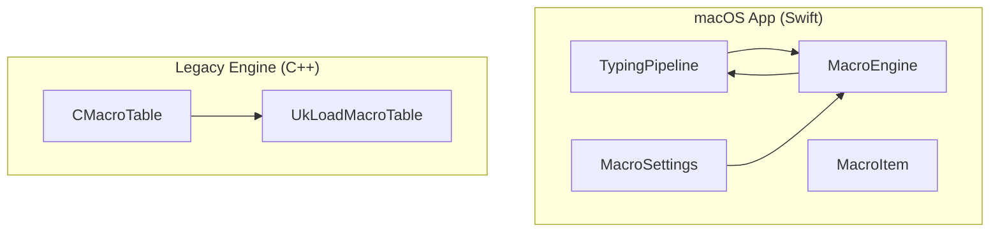
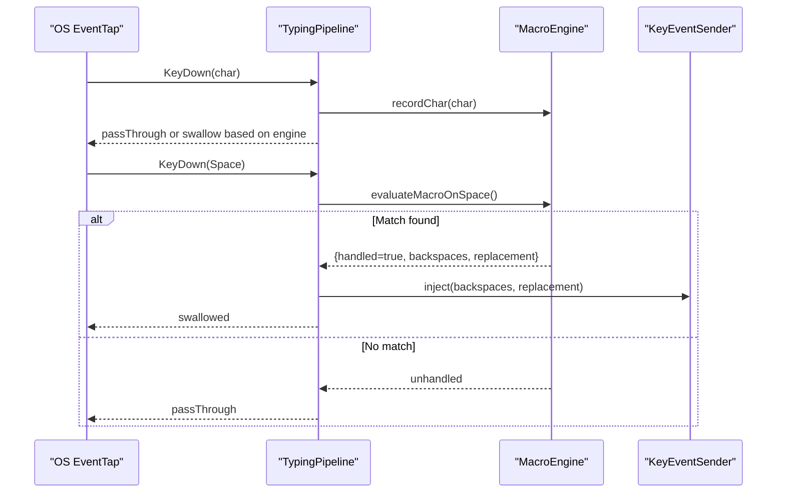
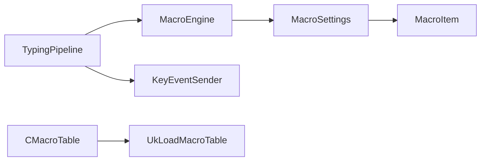

# Macro System

<cite>
**Referenced Files in This Document**
- [MacroEngine.swift](file://macos/skey-app/Sources/Features/Keyboard/Engine/MacroEngine.swift)
- [TypingPipeline.swift](file://macos/skey-app/Sources/Features/Keyboard/EventHandling/Pipeline/TypingPipeline.swift)
- [KeyInterceptor.swift](file://macos/skey-app/Sources/Features/Keyboard/EventHandling/Pipeline/KeyInterceptor.swift)
- [MacroSettings.swift](file://macos/skey-app/Sources/Shared/Settings/Modules/MacroSettings.swift)
- [MacroItem.swift](file://macos/skey-app/Sources/Features/Keyboard/Models/MacroItem.swift)
- [mactab.cpp](file://src/ukengine/mactab.cpp)
- [mactab.h](file://src/ukengine/mactab.h)
- [macro.cpp](file://src/ukengine/macro.cpp)
- [macro.h](file://src/ukengine/macro.h)
- [keycons.h](file://src/ukengine/keycons.h)
</cite>

## Table of Contents
1. Introduction
2. Project Structure
3. Core Components
4. Architecture Overview
5. Detailed Component Analysis
6. Dependency Analysis
7. Performance Considerations
8. Troubleshooting Guide
9. Conclusion

## Introduction
This document explains the macro system that enables text expansion and automation within the typing pipeline. It covers how macros are defined, stored, matched, and executed; the macro syntax and trigger behavior; configuration options for enabling/disabling macros, auto-caps behavior, and managing macro collections; performance characteristics aligned with zero-allocation design goals; and guidance for creating custom macros and troubleshooting common issues.

## Project Structure
The macro system spans two layers:
- Modern macOS app layer (Swift): In-memory macro engine integrated into the event processing pipeline, with settings and model types for user-defined macros.
- Legacy C++ reference implementation: A file-backed macro table used by the original engine, demonstrating persistent storage format and lookup semantics.

**Diagram sources**
- [TypingPipeline.swift:158-170](file://macos/skey-app/Sources/Features/Keyboard/EventHandling/Pipeline/TypingPipeline.swift#L158-L170)
- [MacroEngine.swift:16-38](file://macos/skey-app/Sources/Features/Keyboard/Engine/MacroEngine.swift#L16-L38)
- [MacroSettings.swift:80-97](file://macos/skey-app/Sources/Shared/Settings/Modules/MacroSettings.swift#L80-L97)
- [mactab.cpp:167-208](file://src/ukengine/mactab.cpp#L167-L208)
- [macro.cpp:27-33](file://src/ukengine/macro.cpp#L27-L33)

**Section sources**
- [TypingPipeline.swift:1-345](file://macos/skey-app/Sources/Features/Keyboard/EventHandling/Pipeline/TypingPipeline.swift#L1-L345)
- [MacroEngine.swift:1-111](file://macos/skey-app/Sources/Features/Keyboard/Engine/MacroEngine.swift#L1-L111)
- [MacroSettings.swift:1-125](file://macos/skey-app/Sources/Shared/Settings/Modules/MacroSettings.swift#L1-L125)
- [mactab.cpp:1-347](file://src/ukengine/mactab.cpp#L1-L347)
- [macro.cpp:1-35](file://src/ukengine/macro.cpp#L1-L35)

## Core Components
- TypingPipeline: Orchestrates keystroke events and delegates to MacroEngine on space or other word-break keys when appropriate.
- MacroEngine: Maintains an in-memory map of shortcut-to-replacement pairs and a small buffer tracking the current typed word. On space, it attempts to match and replace.
- MacroSettings: Persists macro items and toggles (enabled, auto-caps, English mode). Triggers reload of the engine’s macro map when changed.
- MacroItem: Data model representing a single macro entry (shortcut and replacement).
- CMacroTable (legacy): File-backed macro table with parsing, sorting, and lookup; demonstrates persistent macro format and versioning.

Key responsibilities:
- Event integration: TypingPipeline calls MacroEngine at precise points to avoid extra allocations and keep latency minimal.
- Storage: MacroSettings serializes/deserializes macro items to UserDefaults and triggers engine reload.
- Lookup: MacroEngine uses a hash map for O(1) average-time lookups; legacy CMacroTable uses sorted arrays and binary search.

**Section sources**
- [TypingPipeline.swift:218-244](file://macos/skey-app/Sources/Features/Keyboard/EventHandling/Pipeline/TypingPipeline.swift#L218-L244)
- [MacroEngine.swift:28-38](file://macos/skey-app/Sources/Features/Keyboard/Engine/MacroEngine.swift#L28-L38)
- [MacroSettings.swift:80-97](file://macos/skey-app/Sources/Shared/Settings/Modules/MacroSettings.swift#L80-L97)
- [mactab.cpp:105-112](file://src/ukengine/mactab.cpp#L105-L112)

## Architecture Overview
The macro system integrates into the hot path of keystroke processing. When a printable character is received, the pipeline records it in MacroEngine. On space, MacroEngine evaluates whether the current word matches a configured shortcut and, if so, replaces it with the corresponding text. The pipeline then injects backspaces and the replacement text via the key event sender.

**Diagram sources**
- [TypingPipeline.swift:218-244](file://macos/skey-app/Sources/Features/Keyboard/EventHandling/Pipeline/TypingPipeline.swift#L218-L244)
- [MacroEngine.swift:71-109](file://macos/skey-app/Sources/Features/Keyboard/Engine/MacroEngine.swift#L71-L109)

## Detailed Component Analysis

### MacroEngine (Swift)
Responsibilities:
- Maintain thread-safe in-memory mapping from normalized shortcuts to replacements.
- Track the current typed word buffer with bounded size to support matching on space.
- Apply optional auto-caps transformation based on user settings.
- Provide reset and backspace recording to keep the buffer consistent with user edits.

Performance notes:
- Uses os_unfair_lock for fast synchronization.
- Bounded word buffer avoids unbounded growth.
- Hash map lookup is O(1) average time.

Configuration interaction:
- Reads enabled/autoCaps flags from MacroSettings during evaluation.
- Reloads its internal map whenever settings change.

**Section sources**
- [MacroEngine.swift:16-38](file://macos/skey-app/Sources/Features/Keyboard/Engine/MacroEngine.swift#L16-L38)
- [MacroEngine.swift:40-67](file://macos/skey-app/Sources/Features/Keyboard/Engine/MacroEngine.swift#L40-L67)
- [MacroEngine.swift:71-109](file://macos/skey-app/Sources/Features/Keyboard/Engine/MacroEngine.swift#L71-L109)

### TypingPipeline Integration
Responsibilities:
- Route keystrokes through stages, including early exits for function/media/navigation keys.
- Record characters into MacroEngine for non-space printable ASCII.
- On space, attempt macro expansion before composing engine processing.
- Inject backspaces and replacement text via KeyEventSender when a macro matches.

Behavioral details:
- Resets MacroEngine state on navigation, structural word-break keys, mouse clicks, and modifier combinations.
- Supports both Vietnamese composing mode and English mode macro expansion depending on settings.

**Section sources**
- [TypingPipeline.swift:158-170](file://macos/skey-app/Sources/Features/Keyboard/EventHandling/Pipeline/TypingPipeline.swift#L158-L170)
- [TypingPipeline.swift:174-280](file://macos/skey-app/Sources/Features/Keyboard/EventHandling/Pipeline/TypingPipeline.swift#L174-L280)
- [TypingPipeline.swift:282-330](file://macos/skey-app/Sources/Features/Keyboard/EventHandling/Pipeline/TypingPipeline.swift#L282-L330)

### MacroSettings and MacroItem
Responsibilities:
- Persist macro items and toggle flags (enabled, auto-caps, inEnglishMode).
- Provide defaults and reset functionality.
- Serialize/deserialize macro items to JSON and trigger MacroEngine reload upon changes.

Data model:
- Each macro has a unique id, shortcut string, replacement string, and creation timestamp.

**Section sources**
- [MacroSettings.swift:11-27](file://macos/skey-app/Sources/Shared/Settings/Modules/MacroSettings.swift#L11-L27)
- [MacroSettings.swift:39-78](file://macos/skey-app/Sources/Shared/Settings/Modules/MacroSettings.swift#L39-L78)
- [MacroSettings.swift:80-125](file://macos/skey-app/Sources/Shared/Settings/Modules/MacroSettings.swift#L80-L125)
- [MacroItem.swift:1-23](file://macos/skey-app/Sources/Features/Keyboard/Models/MacroItem.swift#L1-L23)

### Legacy CMacroTable (C++)
Responsibilities:
- Load macro tables from files with header/version detection.
- Store key-text pairs in a compact memory region and sort them for efficient lookup.
- Provide lookup, iteration, and persistence APIs.

File format:
- Optional BOM and header line containing version marker.
- Lines formatted as key:text pairs.

Lookup strategy:
- Binary search over sorted entries using case-insensitive comparison logic.

**Section sources**
- [mactab.cpp:114-165](file://src/ukengine/mactab.cpp#L114-L165)
- [mactab.cpp:167-208](file://src/ukengine/mactab.cpp#L167-L208)
- [mactab.cpp:210-259](file://src/ukengine/mactab.cpp#L210-L259)
- [mactab.cpp:261-323](file://src/ukengine/mactab.cpp#L261-L323)
- [mactab.h:42-76](file://src/ukengine/mactab.h#L42-L76)
- [macro.cpp:27-33](file://src/ukengine/macro.cpp#L27-L33)
- [macro.h:24-38](file://src/ukengine/macro.h#L24-L38)
- [keycons.h:26-34](file://src/ukengine/keycons.h#L26-L34)

## Dependency Analysis
- TypingPipeline depends on MacroEngine for expansion decisions and on KeyEventSender for output injection.
- MacroEngine depends on MacroSettings for configuration and data.
- MacroSettings persists MacroItem instances and triggers MacroEngine reload.
- Legacy CMacroTable provides a reference implementation of persistent macro storage and lookup.

**Diagram sources**
- [TypingPipeline.swift:218-244](file://macos/skey-app/Sources/Features/Keyboard/EventHandling/Pipeline/TypingPipeline.swift#L218-L244)
- [MacroEngine.swift:28-38](file://macos/skey-app/Sources/Features/Keyboard/Engine/MacroEngine.swift#L28-L38)
- [MacroSettings.swift:80-97](file://macos/skey-app/Sources/Shared/Settings/Modules/MacroSettings.swift#L80-L97)
- [mactab.cpp:167-208](file://src/ukengine/mactab.cpp#L167-L208)
- [macro.cpp:27-33](file://src/ukengine/macro.cpp#L27-L33)

**Section sources**
- [TypingPipeline.swift:1-345](file://macos/skey-app/Sources/Features/Keyboard/EventHandling/Pipeline/TypingPipeline.swift#L1-L345)
- [MacroEngine.swift:1-111](file://macos/skey-app/Sources/Features/Keyboard/Engine/MacroEngine.swift#L1-L111)
- [MacroSettings.swift:1-125](file://macos/skey-app/Sources/Shared/Settings/Modules/MacroSettings.swift#L1-L125)
- [mactab.cpp:1-347](file://src/ukengine/mactab.cpp#L1-L347)

## Performance Considerations
- Zero/low allocation hot path:
  - TypingPipeline uses temporary buffers for Unicode extraction and avoids unnecessary allocations during event handling.
  - MacroEngine maintains a fixed-size word buffer and uses a lock-protected hash map for fast lookups.
- Locking:
  - MacroEngine uses os_unfair_lock around critical sections to minimize contention while keeping operations safe.
- Trigger discipline:
  - Macro evaluation occurs only on space (or equivalent word-break), reducing overhead during normal typing.
- Legacy storage:
  - CMacroTable stores all strings in a contiguous memory region and sorts once after load, enabling binary search without per-lookup allocations.

[No sources needed since this section provides general guidance]

## Troubleshooting Guide
Common issues and resolutions:
- Macros not triggering:
  - Ensure macros are enabled in settings and, if desired, enabled in English mode.
  - Verify that the current word buffer contains the exact shortcut (case-insensitive matching applies).
  - Confirm that space is the trigger and that no intervening modifiers or navigation keys interrupted the buffer.
- Auto-caps not applied:
  - Check the auto-caps setting; it transforms the first letter or entire uppercase input accordingly.
- Conflicts with composing engine:
  - If Vietnamese composing mode is active, macros may be bypassed until space is pressed; ensure you are in English mode if expecting immediate expansion.
- Persistence problems:
  - Macro items are stored in UserDefaults; verify that save operations complete and that MacroEngine.reloadMacros is invoked after changes.
- Legacy file format:
  - Ensure macro files include the required header/version marker and use key:text lines. Old formats are converted automatically on load.

**Section sources**
- [MacroEngine.swift:71-109](file://macos/skey-app/Sources/Features/Keyboard/Engine/MacroEngine.swift#L71-L109)
- [TypingPipeline.swift:218-244](file://macos/skey-app/Sources/Features/Keyboard/EventHandling/Pipeline/TypingPipeline.swift#L218-L244)
- [MacroSettings.swift:39-78](file://macos/skey-app/Sources/Shared/Settings/Modules/MacroSettings.swift#L39-L78)
- [mactab.cpp:114-165](file://src/ukengine/mactab.cpp#L114-L165)

## Conclusion
The macro system provides fast, reliable text expansion integrated directly into the keystroke pipeline. It balances usability with performance by minimizing allocations, using efficient data structures, and triggering expansions at natural word boundaries. Configuration is straightforward, and the legacy C++ implementation offers a robust reference for persistent macro storage and lookup semantics.

[No sources needed since this section summarizes without analyzing specific files]