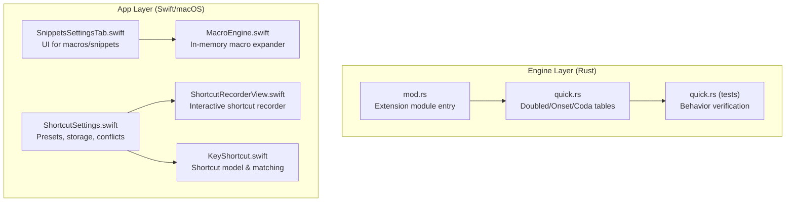
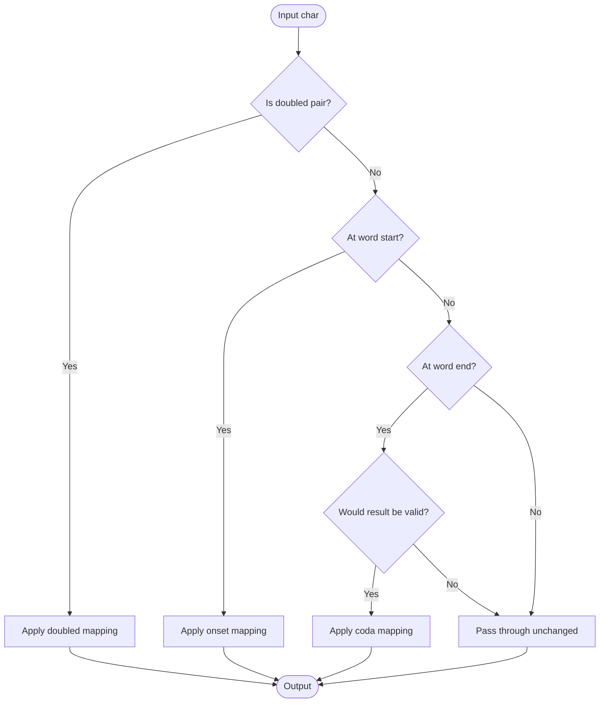
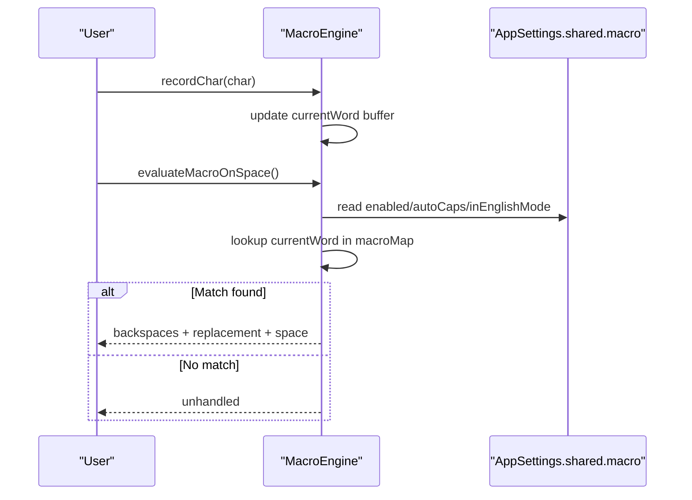
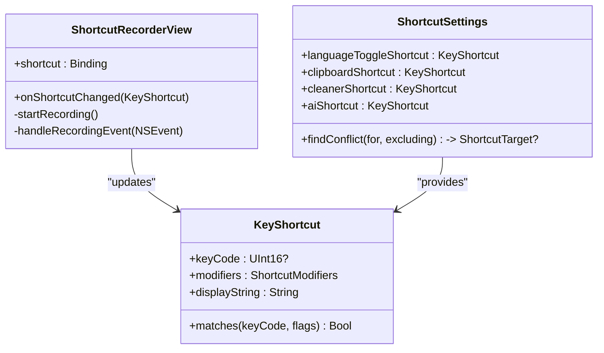
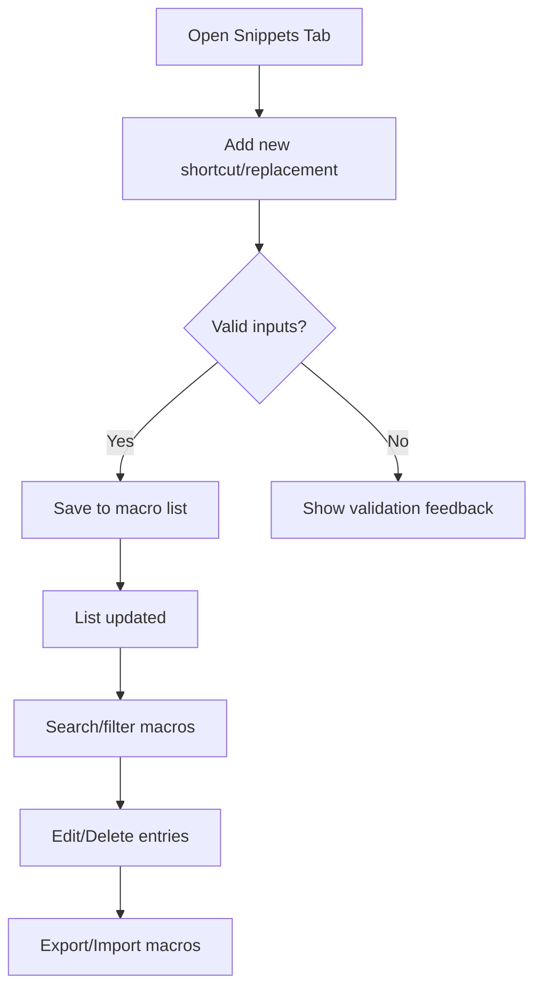
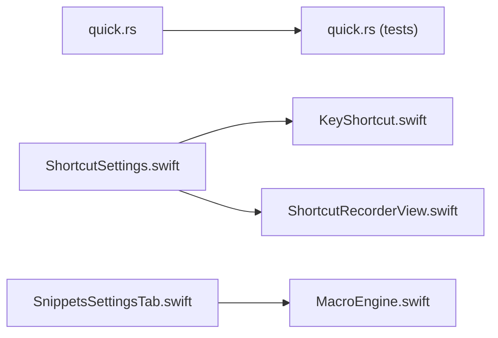

# Quick Shortcuts

<cite>
**Referenced Files in This Document**
- [quick.rs](file://port/skey-core/src/extensions/quick.rs)
- [quick.rs (tests)](file://port/skey-core/tests/quick.rs)
- [mod.rs (extensions)](file://port/skey-core/src/extensions/mod.rs)
- [MacroEngine.swift](file://macos/skey-app/Sources/Features/Keyboard/Engine/MacroEngine.swift)
- [KeyShortcut.swift](file://macos/skey-app/Sources/Shared/Shortcuts/KeyShortcut.swift)
- [ShortcutRecorderView.swift](file://macos/skey-app/Sources/Shared/Shortcuts/ShortcutRecorderView.swift)
- [ShortcutSettings.swift](file://macos/skey-app/Sources/Shared/Settings/Modules/ShortcutSettings.swift)
- [SnippetsSettingsTab.swift](file://macos/skey-app/Sources/Features/Settings/UI/Tabs/SnippetsSettingsTab.swift)
</cite>

## Table of Contents
1. Introduction
2. Project Structure
3. Core Components
4. Architecture Overview
5. Detailed Component Analysis
6. Dependency Analysis
7. Performance Considerations
8. Troubleshooting Guide
9. Conclusion
10. Appendices

## Introduction
This document explains the quick shortcuts feature that provides rapid text insertion capabilities as a lightweight alternative to full macros for simple text replacements. It covers how quick shortcuts work, their syntax and trigger mechanisms, context awareness, configuration interface, performance benefits over full macros, and best practices for organizing large sets of shortcuts.

Quick shortcuts are small, table-driven transformations applied during typing. They differ from full macros by being:
- Pure tables and predicates with minimal overhead
- Context-aware so they only apply when safe (e.g., at word boundaries or when the current word is invalid without them)
- Designed for fast, predictable expansions like doubled consonants, onset/coda substitutions, and first-letter capitalization

## Project Structure
The quick shortcuts feature spans two layers:
- Engine layer (Rust): compact tables and logic for quick typing shortcuts
- App layer (Swift/macOS): UI and settings for managing keyboard shortcuts and macro behavior



**Diagram sources**
- [quick.rs:1-82](file://port/skey-core/src/extensions/quick.rs#L1-L82)
- [quick.rs (tests):1-304](file://port/skey-core/tests/quick.rs#L1-L304)
- [mod.rs (extensions):1-9](file://port/skey-core/src/extensions/mod.rs#L1-L9)
- [MacroEngine.swift:1-111](file://macos/skey-app/Sources/Features/Keyboard/Engine/MacroEngine.swift#L1-L111)
- [KeyShortcut.swift:1-300](file://macos/skey-app/Sources/Shared/Shortcuts/KeyShortcut.swift#L1-L300)
- [ShortcutRecorderView.swift:1-328](file://macos/skey-app/Sources/Shared/Shortcuts/ShortcutRecorderView.swift#L1-L328)
- [ShortcutSettings.swift:1-330](file://macos/skey-app/Sources/Shared/Settings/Modules/ShortcutSettings.swift#L1-L330)
- [SnippetsSettingsTab.swift:1-363](file://macos/skey-app/Sources/Features/Settings/UI/Tabs/SnippetsSettingsTab.swift#L1-L363)

**Section sources**
- [quick.rs:1-82](file://port/skey-core/src/extensions/quick.rs#L1-L82)
- [quick.rs (tests):1-304](file://port/skey-core/tests/quick.rs#L1-L304)
- [mod.rs (extensions):1-9](file://port/skey-core/src/extensions/mod.rs#L1-L9)
- [MacroEngine.swift:1-111](file://macos/skey-app/Sources/Features/Keyboard/Engine/MacroEngine.swift#L1-L111)
- [KeyShortcut.swift:1-300](file://macos/skey-app/Sources/Shared/Shortcuts/KeyShortcut.swift#L1-L300)
- [ShortcutRecorderView.swift:1-328](file://macos/skey-app/Sources/Shared/Shortcuts/ShortcutRecorderView.swift#L1-L328)
- [ShortcutSettings.swift:1-330](file://macos/skey-app/Sources/Shared/Settings/Modules/ShortcutSettings.swift#L1-L330)
- [SnippetsSettingsTab.swift:1-363](file://macos/skey-app/Sources/Features/Settings/UI/Tabs/SnippetsSettingsTab.swift#L1-L363)

## Core Components
- Quick tables (engine): define doubled consonant pairs, onset shortcuts, and coda shortcuts. These are ASCII-only and evaluated against typed letters.
- Quick tests (engine): validate behavior such as case preservation, word boundary handling, and safety guarantees when features are off.
- Macro engine (app): an in-memory, high-performance expander that triggers on space, supports auto-caps, and maintains a current word buffer.
- Shortcut model and recorder (app): represent key combinations, match events, and provide an interactive UI to record and manage shortcuts.
- Settings and presets (app): store per-feature shortcuts, detect conflicts, and expose defaults and reset actions.
- Snippets UI (app): manages macro items (shortcuts and replacements), search, import/export, and editing.

**Section sources**
- [quick.rs:10-81](file://port/skey-core/src/extensions/quick.rs#L10-L81)
- [quick.rs (tests):14-303](file://port/skey-core/tests/quick.rs#L14-L303)
- [MacroEngine.swift:16-111](file://macos/skey-app/Sources/Features/Keyboard/Engine/MacroEngine.swift#L16-L111)
- [KeyShortcut.swift:8-159](file://macos/skey-app/Sources/Shared/Shortcuts/KeyShortcut.swift#L8-L159)
- [ShortcutRecorderView.swift:6-194](file://macos/skey-app/Sources/Shared/Shortcuts/ShortcutRecorderView.swift#L6-L194)
- [ShortcutSettings.swift:20-330](file://macos/skey-app/Sources/Shared/Settings/Modules/ShortcutSettings.swift#L20-L330)
- [SnippetsSettingsTab.swift:44-363](file://macos/skey-app/Sources/Features/Settings/UI/Tabs/SnippetsSettingsTab.swift#L44-L363)

## Architecture Overview
Quick shortcuts operate at two levels:
- Engine-level quick tables transform keystrokes immediately based on small lookup tables and context rules.
- App-level macros expand typed words into longer snippets after a trigger (space), with optional auto-casing.

```mermaid
sequenceDiagram
participant User as "User"
participant Engine as "Engine (quick.rs)"
participant App as "MacroEngine.swift"
participant UI as "Settings UI"
User->>Engine : Type keys (e.g., doubled consonants, onset/coda)
Engine-->>User : Immediate transformation if rule matches
Note over Engine : Tables are small, O(1) lookups; context checks prevent unsafe changes
User->>App : Type a macro shortcut then Space
App->>App : Record chars, evaluate on Space
App-->>User : Replace typed shortcut with expansion + trailing space
UI-->>App : Configure macros and shortcuts via settings
```

**Diagram sources**
- [quick.rs:10-81](file://port/skey-core/src/extensions/quick.rs#L10-L81)
- [MacroEngine.swift:40-111](file://macos/skey-app/Sources/Features/Keyboard/Engine/MacroEngine.swift#L40-L111)

## Detailed Component Analysis

### Engine Quick Tables (Doubled, Onset, Coda)
- Doubled consonants: map repeated letter pairs to common digraphs while preserving case semantics.
- Onset shortcuts: replace initial letters that cannot start Vietnamese words with valid onsets.
- Coda shortcuts: replace final letters with valid codas only when the resulting word would otherwise be invalid.



**Diagram sources**
- [quick.rs:10-81](file://port/skey-core/src/extensions/quick.rs#L10-L81)

**Section sources**
- [quick.rs:10-81](file://port/skey-core/src/extensions/quick.rs#L10-L81)
- [quick.rs (tests):33-180](file://port/skey-core/tests/quick.rs#L33-L180)

### Macro Engine (Space-triggered Expansion)
- Tracks the current word buffer and resets on whitespace/newline.
- Evaluates on space to find a matching shortcut and replaces it with the configured replacement, optionally applying auto-caps.
- Uses an in-memory map for O(1) lookup and thread-safe access.



**Diagram sources**
- [MacroEngine.swift:40-111](file://macos/skey-app/Sources/Features/Keyboard/Engine/MacroEngine.swift#L40-L111)

**Section sources**
- [MacroEngine.swift:16-111](file://macos/skey-app/Sources/Features/Keyboard/Engine/MacroEngine.swift#L16-L111)

### Shortcut Model and Recorder (UI)
- KeyShortcut represents key codes and modifiers, supports built-in presets, display strings, and event matching.
- ShortcutRecorderView captures live key events, supports modifier-only chords, and updates bindings safely.
- ShortcutPickerView integrates presets, conflict detection, and reset-to-default actions.



**Diagram sources**
- [KeyShortcut.swift:8-159](file://macos/skey-app/Sources/Shared/Shortcuts/KeyShortcut.swift#L8-L159)
- [ShortcutRecorderView.swift:6-194](file://macos/skey-app/Sources/Shared/Shortcuts/ShortcutRecorderView.swift#L6-L194)
- [ShortcutSettings.swift:20-330](file://macos/skey-app/Sources/Shared/Settings/Modules/ShortcutSettings.swift#L20-L330)

**Section sources**
- [KeyShortcut.swift:8-159](file://macos/skey-app/Sources/Shared/Shortcuts/KeyShortcut.swift#L8-L159)
- [ShortcutRecorderView.swift:6-194](file://macos/skey-app/Sources/Shared/Shortcuts/ShortcutRecorderView.swift#L6-L194)
- [ShortcutSettings.swift:20-330](file://macos/skey-app/Sources/Shared/Settings/Modules/ShortcutSettings.swift#L20-L330)

### Snippets and Macros Management (UI)
- Provides add/edit/delete operations for macro items.
- Supports search, export/import, and toggles for enabling features like auto-caps and English mode.
- Displays current macros and allows bulk management.



**Diagram sources**
- [SnippetsSettingsTab.swift:100-363](file://macos/skey-app/Sources/Features/Settings/UI/Tabs/SnippetsSettingsTab.swift#L100-L363)

**Section sources**
- [SnippetsSettingsTab.swift:100-363](file://macos/skey-app/Sources/Features/Settings/UI/Tabs/SnippetsSettingsTab.swift#L100-L363)

## Dependency Analysis
- Engine quick tables are independent, pure functions operating on ASCII input and returning immediate transformations.
- The app’s MacroEngine depends on settings for enablement and behavior toggles and uses an in-memory map for fast lookups.
- Shortcut settings coordinate multiple targets (language toggle, clipboard, cleaner, AI) and detect conflicts to avoid overlapping key combinations.
- The UI components depend on the shortcut model and settings to present and modify user preferences.



**Diagram sources**
- [quick.rs:10-81](file://port/skey-core/src/extensions/quick.rs#L10-L81)
- [quick.rs (tests):14-303](file://port/skey-core/tests/quick.rs#L14-L303)
- [ShortcutSettings.swift:20-330](file://macos/skey-app/Sources/Shared/Settings/Modules/ShortcutSettings.swift#L20-L330)
- [KeyShortcut.swift:8-159](file://macos/skey-app/Sources/Shared/Shortcuts/KeyShortcut.swift#L8-L159)
- [ShortcutRecorderView.swift:6-194](file://macos/skey-app/Sources/Shared/Shortcuts/ShortcutRecorderView.swift#L6-L194)
- [SnippetsSettingsTab.swift:100-363](file://macos/skey-app/Sources/Features/Settings/UI/Tabs/SnippetsSettingsTab.swift#L100-L363)
- [MacroEngine.swift:16-111](file://macos/skey-app/Sources/Features/Keyboard/Engine/MacroEngine.swift#L16-L111)

**Section sources**
- [quick.rs:10-81](file://port/skey-core/src/extensions/quick.rs#L10-L81)
- [quick.rs (tests):14-303](file://port/skey-core/tests/quick.rs#L14-L303)
- [ShortcutSettings.swift:20-330](file://macos/skey-app/Sources/Shared/Settings/Modules/ShortcutSettings.swift#L20-L330)
- [KeyShortcut.swift:8-159](file://macos/skey-app/Sources/Shared/Shortcuts/KeyShortcut.swift#L8-L159)
- [ShortcutRecorderView.swift:6-194](file://macos/skey-app/Sources/Shared/Shortcuts/ShortcutRecorderView.swift#L6-L194)
- [SnippetsSettingsTab.swift:100-363](file://macos/skey-app/Sources/Features/Settings/UI/Tabs/SnippetsSettingsTab.swift#L100-L363)
- [MacroEngine.swift:16-111](file://macos/skey-app/Sources/Features/Keyboard/Engine/MacroEngine.swift#L16-L111)

## Performance Considerations
- Quick shortcuts use small, fixed-size tables and inline functions, yielding near O(1) lookups with negligible CPU overhead.
- Context checks ensure substitutions only occur when safe, avoiding unnecessary processing.
- MacroEngine maintains an in-memory map and a bounded word buffer, minimizing memory churn and ensuring fast evaluation on space.
- Choose quick shortcuts for simple, predictable replacements (doubled consonants, onset/coda fixes, first-letter capitalization). Use full macros for complex multi-line snippets, conditional logic, or dynamic content.

[No sources needed since this section provides general guidance]

## Troubleshooting Guide
- Conflicts between shortcuts: use the settings UI to detect and resolve overlaps across targets (language toggle, clipboard, cleaner, AI).
- Unexpected expansions: verify that quick shortcuts are enabled/disabled as intended and check context rules (word boundaries, validity).
- Macro not triggering: ensure macros are enabled, the typed shortcut matches exactly, and the engine evaluates on space.
- Auto-caps behavior: confirm auto-caps setting and whether the first character was uppercase or all caps were used.

**Section sources**
- [ShortcutSettings.swift:247-330](file://macos/skey-app/Sources/Shared/Settings/Modules/ShortcutSettings.swift#L247-L330)
- [MacroEngine.swift:71-111](file://macos/skey-app/Sources/Features/Keyboard/Engine/MacroEngine.swift#L71-L111)
- [quick.rs (tests):14-303](file://port/skey-core/tests/quick.rs#L14-L303)

## Conclusion
Quick shortcuts offer a fast, reliable way to perform simple text replacements during typing with minimal overhead and strong context awareness. For more complex scenarios, full macros provide flexible snippet management and advanced behaviors. Organize your shortcuts using presets and groups, leverage conflict detection, and maintain clarity by keeping quick shortcuts focused on single-purpose transformations.

[No sources needed since this section summarizes without analyzing specific files]

## Appendices

### Practical Examples and Setup
- Doubled consonants: configure quick telex to expand repeated consonant pairs into common digraphs while preserving case.
- Onset/coda shortcuts: enable onset and coda mappings to correct non-Vietnamese initials/finals at word boundaries.
- First-letter capitalization: enable sentence-start capitalization to automatically capitalize the first letter after sentence-ending punctuation.
- Macros: add short aliases for frequent phrases, emails, or code templates; set auto-caps for professional tone.

**Section sources**
- [quick.rs (tests):33-217](file://port/skey-core/tests/quick.rs#L33-L217)
- [SnippetsSettingsTab.swift:100-363](file://macos/skey-app/Sources/Features/Settings/UI/Tabs/SnippetsSettingsTab.swift#L100-L363)

### Configuration Interface
- Manage per-feature shortcuts via presets and custom recordings; reset to defaults when needed.
- Detect conflicts and adjust priorities by reassigning overlapping shortcuts.
- Organize macros in the snippets tab with search, edit, delete, and import/export capabilities.

**Section sources**
- [ShortcutSettings.swift:20-330](file://macos/skey-app/Sources/Shared/Settings/Modules/ShortcutSettings.swift#L20-L330)
- [ShortcutRecorderView.swift:6-328](file://macos/skey-app/Sources/Shared/Shortcuts/ShortcutRecorderView.swift#L6-L328)
- [SnippetsSettingsTab.swift:100-363](file://macos/skey-app/Sources/Features/Settings/UI/Tabs/SnippetsSettingsTab.swift#L100-L363)

### Best Practices
- Keep quick shortcuts small and focused; reserve macros for complex or multi-line content.
- Use presets for consistency and switch to custom shortcuts only when necessary.
- Regularly review and prune unused shortcuts to reduce cognitive load and potential conflicts.
- Test edge cases (case sensitivity, word boundaries) using provided tests or manual checks.

[No sources needed since this section provides general guidance]