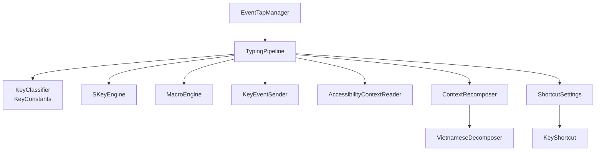
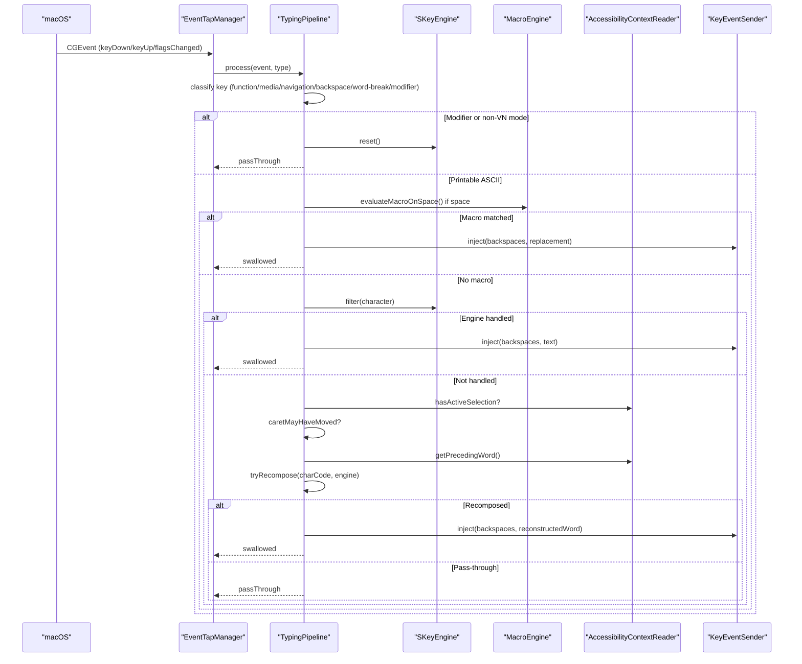
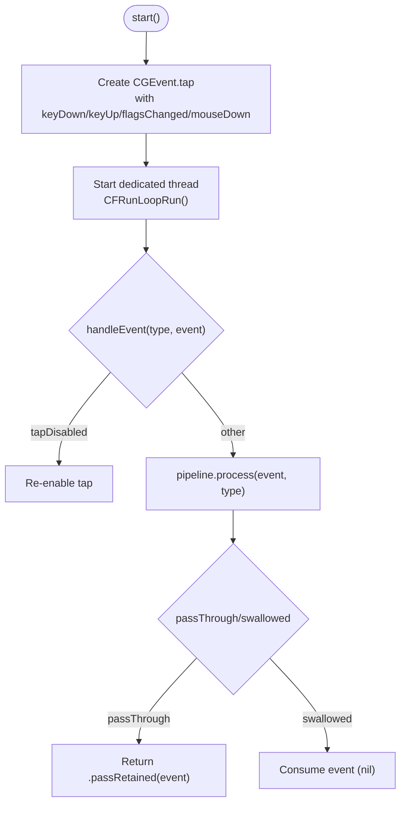
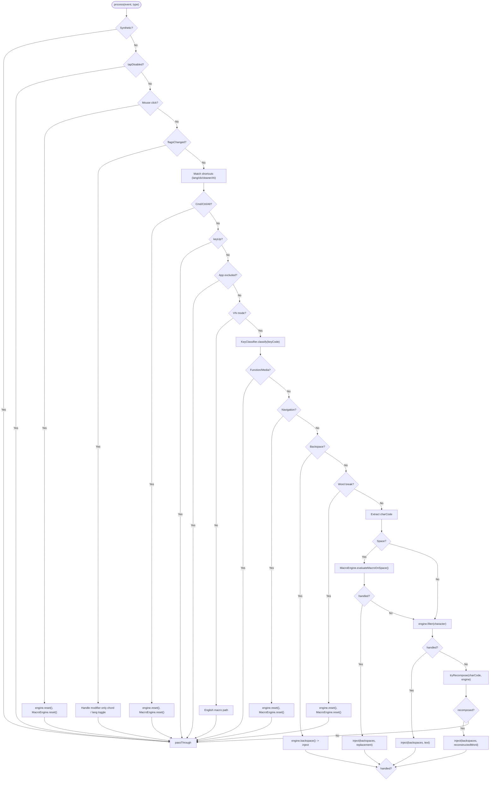
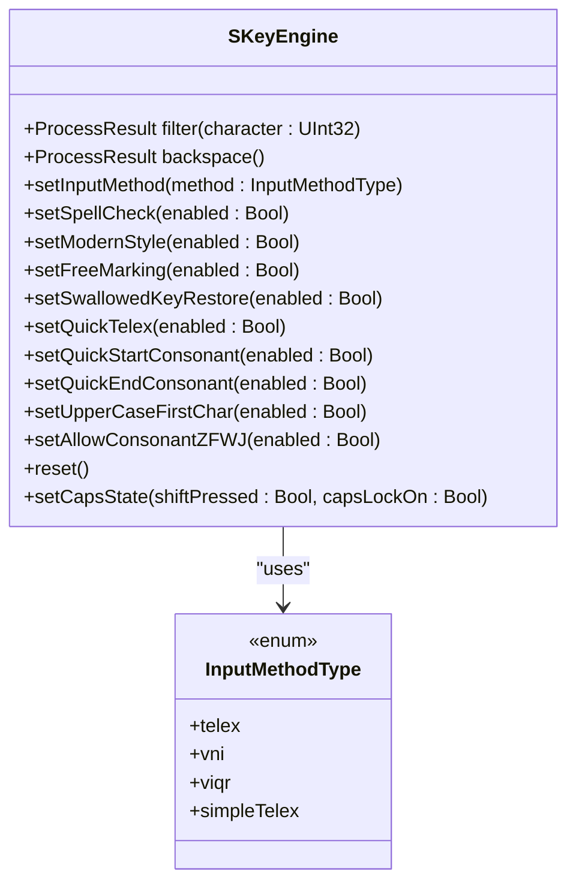
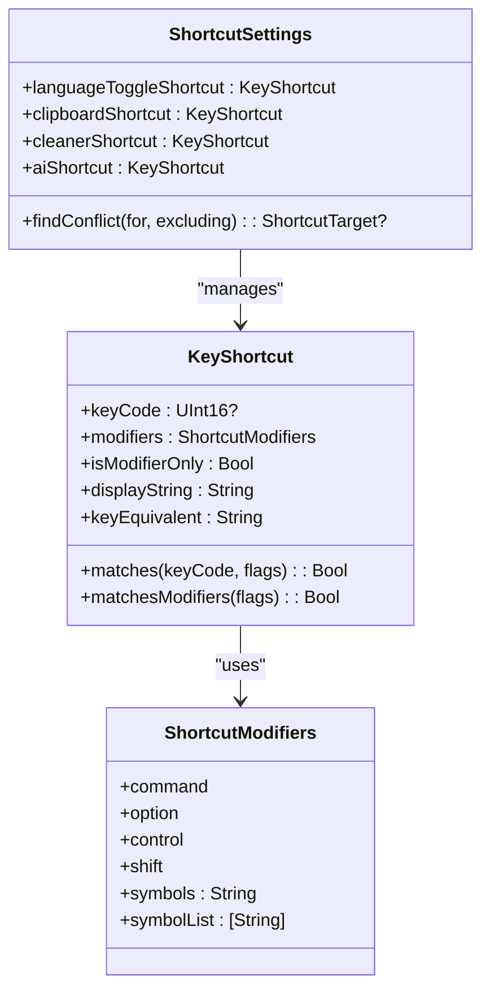
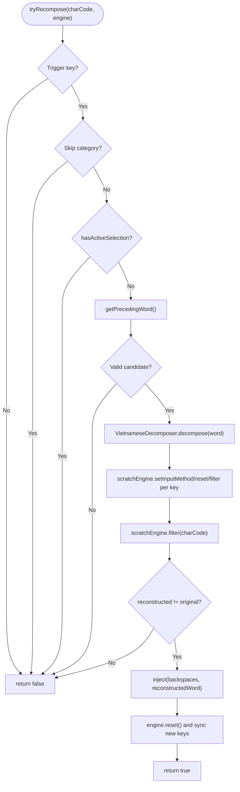
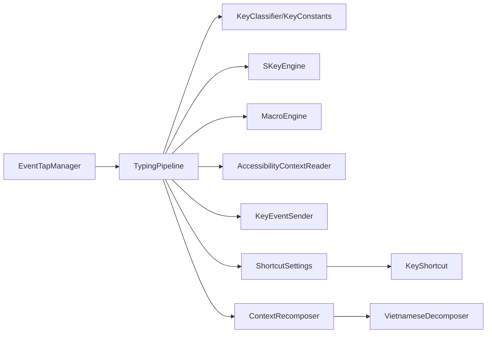

# Input Processing

<cite>
**Referenced Files in This Document**
- [EventTapManager.swift](file://macos/skey-app/Sources/Features/Keyboard/EventHandling/EventTapManager.swift)
- [TypingPipeline.swift](file://macos/skey-app/Sources/Features/Keyboard/EventHandling/Pipeline/TypingPipeline.swift)
- [KeyInterceptor.swift](file://macos/skey-app/Sources/Features/Keyboard/EventHandling/Pipeline/KeyInterceptor.swift)
- [KeyEventSender.swift](file://macos/skey-app/Sources/Features/Keyboard/EventHandling/KeyEventSender.swift)
- [KeyConstants.swift](file://macos/skey-app/Sources/Features/Keyboard/EventHandling/KeyConstants.swift)
- [SKeyEngine.swift](file://macos/skey-app/Sources/Features/Keyboard/Engine/SKeyEngine.swift)
- [InputMethod.swift](file://macos/skey-app/Sources/Features/Keyboard/Engine/InputMethod.swift)
- [MacroEngine.swift](file://macos/skey-app/Sources/Features/Keyboard/Engine/MacroEngine.swift)
- [KeyShortcut.swift](file://macos/skey-app/Sources/Shared/Shortcuts/KeyShortcut.swift)
- [ShortcutSettings.swift](file://macos/skey-app/Sources/Shared/Settings/Modules/ShortcutSettings.swift)
- [AccessibilityContextReader.swift](file://macos/skey-app/Sources/Features/Keyboard/Context/AccessibilityContextReader.swift)
- [ContextRecomposer.swift](file://macos/skey-app/Sources/Features/Keyboard/Context/ContextRecomposer.swift)
- [VietnameseDecomposer.swift](file://macos/skey-app/Sources/Features/Keyboard/Context/VietnameseDecomposer.swift)
</cite>

## Table of Contents
1. [Introduction](#introduction)
2. [Project Structure](#project-structure)
3. [Core Components](#core-components)
4. [Architecture Overview](#architecture-overview)
5. [Detailed Component Analysis](#detailed-component-analysis)
6. [Dependency Analysis](#dependency-analysis)
7. [Performance Considerations](#performance-considerations)
8. [Troubleshooting Guide](#troubleshooting-guide)
9. [Conclusion](#conclusion)

## Introduction
This document explains the input processing layer that normalizes keyboard events and maps them to internal representations for Vietnamese typing, macros, and shortcuts. It focuses on how platform-specific keyboard input is captured, normalized, processed through a high-performance pipeline, and dispatched back to applications. It also covers modifier handling, international key mapping support, custom shortcut configuration, accessibility integration, and the relationship between the input processing layer and the main engine.

## Project Structure
The input processing layer is implemented as a layered system:
- Event capture and lifecycle management at the OS level
- A multi-stage event pipeline that classifies and routes events
- A core engine wrapper around a Rust-based typing engine
- Macro expansion and context-aware recomposition
- Accessibility integration for assistive technologies and special cases like Spotlight
- Shortcut system with presets and custom bindings

**Diagram sources**
- [EventTapManager.swift:15-188](file://macos/skey-app/Sources/Features/Keyboard/EventHandling/EventTapManager.swift#L15-L188)
- [TypingPipeline.swift:31-170](file://macos/skey-app/Sources/Features/Keyboard/EventHandling/Pipeline/TypingPipeline.swift#L31-L170)
- [KeyConstants.swift:135-191](file://macos/skey-app/Sources/Features/Keyboard/EventHandling/KeyConstants.swift#L135-L191)
- [SKeyEngine.swift:131-187](file://macos/skey-app/Sources/Features/Keyboard/Engine/SKeyEngine.swift#L131-L187)
- [MacroEngine.swift:71-109](file://macos/skey-app/Sources/Features/Keyboard/Engine/MacroEngine.swift#L71-L109)
- [KeyEventSender.swift:33-51](file://macos/skey-app/Sources/Features/Keyboard/EventHandling/KeyEventSender.swift#L33-L51)
- [AccessibilityContextReader.swift:31-77](file://macos/skey-app/Sources/Features/Keyboard/Context/AccessibilityContextReader.swift#L31-L77)
- [ContextRecomposer.swift:40-97](file://macos/skey-app/Sources/Features/Keyboard/Context/ContextRecomposer.swift#L40-L97)
- [VietnameseDecomposer.swift:12-32](file://macos/skey-app/Sources/Features/Keyboard/Context/VietnameseDecomposer.swift#L12-L32)
- [ShortcutSettings.swift:99-132](file://macos/skey-app/Sources/Shared/Settings/Modules/ShortcutSettings.swift#L99-L132)
- [KeyShortcut.swift:68-158](file://macos/skey-app/Sources/Shared/Shortcuts/KeyShortcut.swift#L68-L158)

**Section sources**
- [EventTapManager.swift:15-188](file://macos/skey-app/Sources/Features/Keyboard/EventHandling/EventTapManager.swift#L15-L188)
- [TypingPipeline.swift:31-170](file://macos/skey-app/Sources/Features/Keyboard/EventHandling/Pipeline/TypingPipeline.swift#L31-L170)

## Core Components
- EventTapManager: Captures low-level CGEvents, manages thread and run loop, delegates processing to TypingPipeline, and controls language state.
- TypingPipeline: Multi-stage processor that classifies keys, handles shortcuts, resets engine state on navigation/mouse clicks, filters printable characters via SKeyEngine, integrates macro expansion, and coordinates context recomposition.
- KeyInterceptor: Defines the Chain of Responsibility result enum and protocol for extensibility.
- KeyEventSender: Injects synthetic backspaces and Unicode text into the active app, with special handling for Spotlight using Accessibility API.
- SKeyEngine: High-performance wrapper around the Rust engine; provides filter/backspace operations and options for input methods and spell check.
- MacroEngine: In-memory macro expander triggered by space, tracks current word buffer, supports auto-caps transformations.
- Shortcut system: KeyShortcut models and ShortcutSettings manage presets/custom shortcuts for language toggle, clipboard, cleaner, and AI actions.
- AccessibilityContextReader: Reads focused element info, detects Spotlight, checks selection ranges, and performs direct text replacement when needed.
- ContextRecomposer: Reconstructs words atomically when editing previously typed words, using decomposed keystrokes and scratch engine.
- VietnameseDecomposer: Converts pre-composed Vietnamese characters into raw keystroke sequences (base + tone marks).

**Section sources**
- [EventTapManager.swift:15-188](file://macos/skey-app/Sources/Features/Keyboard/EventHandling/EventTapManager.swift#L15-L188)
- [TypingPipeline.swift:31-170](file://macos/skey-app/Sources/Features/Keyboard/EventHandling/Pipeline/TypingPipeline.swift#L31-L170)
- [KeyInterceptor.swift:6-20](file://macos/skey-app/Sources/Features/Keyboard/EventHandling/Pipeline/KeyInterceptor.swift#L6-L20)
- [KeyEventSender.swift:33-51](file://macos/skey-app/Sources/Features/Keyboard/EventHandling/KeyEventSender.swift#L33-L51)
- [SKeyEngine.swift:131-187](file://macos/skey-app/Sources/Features/Keyboard/Engine/SKeyEngine.swift#L131-L187)
- [MacroEngine.swift:71-109](file://macos/skey-app/Sources/Features/Keyboard/Engine/MacroEngine.swift#L71-L109)
- [KeyShortcut.swift:68-158](file://macos/skey-app/Sources/Shared/Shortcuts/KeyShortcut.swift#L68-L158)
- [ShortcutSettings.swift:99-132](file://macos/skey-app/Sources/Shared/Settings/Modules/ShortcutSettings.swift#L99-L132)
- [AccessibilityContextReader.swift:31-77](file://macos/skey-app/Sources/Features/Keyboard/Context/AccessibilityContextReader.swift#L31-L77)
- [ContextRecomposer.swift:40-97](file://macos/skey-app/Sources/Features/Keyboard/Context/ContextRecomposer.swift#L40-L97)
- [VietnameseDecomposer.swift:12-32](file://macos/skey-app/Sources/Features/Keyboard/Context/VietnameseDecomposer.swift#L12-L32)

## Architecture Overview
The input flow starts with OS-level event capture and proceeds through a fast classification and routing pipeline before being sent back to the target application or consumed.

**Diagram sources**
- [EventTapManager.swift:81-188](file://macos/skey-app/Sources/Features/Keyboard/EventHandling/EventTapManager.swift#L81-L188)
- [TypingPipeline.swift:31-170](file://macos/skey-app/Sources/Features/Keyboard/EventHandling/Pipeline/TypingPipeline.swift#L31-L170)
- [SKeyEngine.swift:131-187](file://macos/skey-app/Sources/Features/Keyboard/Engine/SKeyEngine.swift#L131-L187)
- [MacroEngine.swift:71-109](file://macos/skey-app/Sources/Features/Keyboard/Engine/MacroEngine.swift#L71-L109)
- [AccessibilityContextReader.swift:31-77](file://macos/skey-app/Sources/Features/Keyboard/Context/AccessibilityContextReader.swift#L31-L77)
- [KeyEventSender.swift:33-51](file://macos/skey-app/Sources/Features/Keyboard/EventHandling/KeyEventSender.swift#L33-L51)

## Detailed Component Analysis

### EventCapture and Lifecycle: EventTapManager
- Creates an EventTap with appropriate masks for keyDown, keyUp, flagsChanged, and mouse down events.
- Starts a dedicated high-priority thread hosting a CFRunLoop to receive events without blocking the main thread.
- Delegates all event evaluation to TypingPipeline and returns either passThrough or swallowed based on pipeline results.
- Manages language state (Vietnamese vs English) with thread-safe access and resets engine state when toggling.

**Diagram sources**
- [EventTapManager.swift:81-188](file://macos/skey-app/Sources/Features/Keyboard/EventHandling/EventTapManager.swift#L81-L188)

**Section sources**
- [EventTapManager.swift:81-188](file://macos/skey-app/Sources/Features/Keyboard/EventHandling/EventTapManager.swift#L81-L188)

### EventProcessing Pipeline: TypingPipeline
- Stages:
  - Skip synthetic events generated by SKey (marked with event marker).
  - Pass through disabled tap events.
  - Reset engine and macro state on mouse clicks (caret movement/focus change).
  - Handle flagsChanged for modifier-only shortcuts and language toggle chords.
  - Match configured shortcuts (language toggle, clipboard, cleaner, AI, quick translate).
  - Reset engine on Command/Control/Option presses to avoid unintended composing.
  - Classify keys into function/media, navigation, backspace, word-break, or character.
  - For printable ASCII:
    - Evaluate macro expansion on space.
    - Filter character via SKeyEngine.
    - If not handled, attempt context recomposition when caret may have moved.
  - Track caret movement and selection state to optimize recomposition decisions.

**Diagram sources**
- [TypingPipeline.swift:31-170](file://macos/skey-app/Sources/Features/Keyboard/EventHandling/Pipeline/TypingPipeline.swift#L31-L170)
- [TypingPipeline.swift:174-280](file://macos/skey-app/Sources/Features/Keyboard/EventHandling/Pipeline/TypingPipeline.swift#L174-L280)
- [KeyConstants.swift:135-191](file://macos/skey-app/Sources/Features/Keyboard/EventHandling/KeyConstants.swift#L135-L191)

**Section sources**
- [TypingPipeline.swift:31-170](file://macos/skey-app/Sources/Features/Keyboard/EventHandling/Pipeline/TypingPipeline.swift#L31-L170)
- [TypingPipeline.swift:174-280](file://macos/skey-app/Sources/Features/Keyboard/EventHandling/Pipeline/TypingPipeline.swift#L174-L280)

### Key Classification and Constants: KeyClassifier and KeyConstants
- KeyConstants defines virtual key codes and timing constants used for synthetic event delivery.
- KeyClassifier uses a lookup table to categorize keys into character, backspace, navigation, word-break, function/media, and modifier categories for fast-path decisions.

**Section sources**
- [KeyConstants.swift:1-191](file://macos/skey-app/Sources/Features/Keyboard/EventHandling/KeyConstants.swift#L1-L191)

### Engine Integration: SKeyEngine
- Wraps the Rust engine with zero-heap hot path operations.
- Provides filter(character) and backspace() returning ProcessResult with handled flag, backspaces count, and transformed text.
- Configurable input methods (Telex, VNI, VIQR, Simple Telex), charset, and options like spell check and modern style.
- Caps state synchronization with shift and caps lock.

**Diagram sources**
- [SKeyEngine.swift:8-187](file://macos/skey-app/Sources/Features/Keyboard/Engine/SKeyEngine.swift#L8-L187)
- [InputMethod.swift:5-19](file://macos/skey-app/Sources/Features/Keyboard/Engine/InputMethod.swift#L5-L19)

**Section sources**
- [SKeyEngine.swift:8-187](file://macos/skey-app/Sources/Features/Keyboard/Engine/SKeyEngine.swift#L8-L187)
- [InputMethod.swift:5-19](file://macos/skey-app/Sources/Features/Keyboard/Engine/InputMethod.swift#L5-L19)

### Macro Expansion: MacroEngine
- Tracks current word buffer and matches against stored macros on space.
- Supports auto-caps transformation for replacements.
- Resets buffer on whitespace/newline or navigation/function keys.

**Section sources**
- [MacroEngine.swift:16-109](file://macos/skey-app/Sources/Features/Keyboard/Engine/MacroEngine.swift#L16-L109)

### Shortcut System: KeyShortcut and ShortcutSettings
- KeyShortcut represents a combination of modifiers and optional key code, with built-in presets and display helpers.
- ShortcutSettings manages preset/custom shortcuts for language toggle, clipboard, cleaner, and AI actions, including conflict detection and defaults.

**Diagram sources**
- [KeyShortcut.swift:6-158](file://macos/skey-app/Sources/Shared/Shortcuts/KeyShortcut.swift#L6-L158)
- [ShortcutSettings.swift:20-132](file://macos/skey-app/Sources/Shared/Settings/Modules/ShortcutSettings.swift#L20-L132)

**Section sources**
- [KeyShortcut.swift:6-158](file://macos/skey-app/Sources/Shared/Shortcuts/KeyShortcut.swift#L6-L158)
- [ShortcutSettings.swift:20-132](file://macos/skey-app/Sources/Shared/Settings/Modules/ShortcutSettings.swift#L20-L132)

### Accessibility and Assistive Technology Integration: AccessibilityContextReader and ContextRecomposer
- AccessibilityContextReader:
  - Detects Spotlight overlay and reads focused UI elements.
  - Checks for active selections (e.g., browser omnibox suggestions).
  - Performs direct text replacement via Accessibility API for Spotlight to avoid synthetic backspace loss.
- ContextRecomposer:
  - On non-handled printable characters, attempts atomic full-word recomposition when caret may have moved.
  - Uses VietnameseDecomposer to convert existing composed text into keystroke sequences, re-processes via a scratch engine, and replaces the entire preceding word atomically.
  - Skips certain app categories (developer tools, electron/chat) to avoid interference.

**Diagram sources**
- [ContextRecomposer.swift:40-97](file://macos/skey-app/Sources/Features/Keyboard/Context/ContextRecomposer.swift#L40-L97)
- [AccessibilityContextReader.swift:31-77](file://macos/skey-app/Sources/Features/Keyboard/Context/AccessibilityContextReader.swift#L31-L77)
- [VietnameseDecomposer.swift:12-32](file://macos/skey-app/Sources/Features/Keyboard/Context/VietnameseDecomposer.swift#L12-L32)

**Section sources**
- [AccessibilityContextReader.swift:16-77](file://macos/skey-app/Sources/Features/Keyboard/Context/AccessibilityContextReader.swift#L16-L77)
- [ContextRecomposer.swift:19-97](file://macos/skey-app/Sources/Features/Keyboard/Context/ContextRecomposer.swift#L19-L97)

### Synthetic Event Injection: KeyEventSender
- Injects backspaces followed by Unicode text into the active application.
- Uses direct Accessibility API replacement for Spotlight to ensure reliability.
- Posts synthetic events with non-coalesced flags and stamps them with the SKEY marker so they are recognized and skipped by the pipeline.

**Section sources**
- [KeyEventSender.swift:33-127](file://macos/skey-app/Sources/Features/Keyboard/EventHandling/KeyEventSender.swift#L33-L127)

## Dependency Analysis
- EventTapManager depends on TypingPipeline for event logic and SKeyEngine for language state.
- TypingPipeline depends on KeyClassifier/KeyConstants for fast classification, SKeyEngine for filtering, MacroEngine for expansions, AccessibilityContextReader for context awareness, and KeyEventSender for output.
- ShortcutSettings provides KeyShortcut instances used by TypingPipeline to match user-defined combinations.
- ContextRecomposer depends on VietnameseDecomposer and AccessibilityContextReader to reconstruct words atomically.

**Diagram sources**
- [EventTapManager.swift:15-188](file://macos/skey-app/Sources/Features/Keyboard/EventHandling/EventTapManager.swift#L15-L188)
- [TypingPipeline.swift:31-170](file://macos/skey-app/Sources/Features/Keyboard/EventHandling/Pipeline/TypingPipeline.swift#L31-L170)
- [KeyConstants.swift:135-191](file://macos/skey-app/Sources/Features/Keyboard/EventHandling/KeyConstants.swift#L135-L191)
- [SKeyEngine.swift:131-187](file://macos/skey-app/Sources/Features/Keyboard/Engine/SKeyEngine.swift#L131-L187)
- [MacroEngine.swift:71-109](file://macos/skey-app/Sources/Features/Keyboard/Engine/MacroEngine.swift#L71-L109)
- [AccessibilityContextReader.swift:31-77](file://macos/skey-app/Sources/Features/Keyboard/Context/AccessibilityContextReader.swift#L31-L77)
- [KeyEventSender.swift:33-51](file://macos/skey-app/Sources/Features/Keyboard/EventHandling/KeyEventSender.swift#L33-L51)
- [ShortcutSettings.swift:99-132](file://macos/skey-app/Sources/Shared/Settings/Modules/ShortcutSettings.swift#L99-L132)
- [KeyShortcut.swift:68-158](file://macos/skey-app/Sources/Shared/Shortcuts/KeyShortcut.swift#L68-L158)
- [ContextRecomposer.swift:40-97](file://macos/skey-app/Sources/Features/Keyboard/Context/ContextRecomposer.swift#L40-L97)
- [VietnameseDecomposer.swift:12-32](file://macos/skey-app/Sources/Features/Keyboard/Context/VietnameseDecomposer.swift#L12-L32)

**Section sources**
- [EventTapManager.swift:15-188](file://macos/skey-app/Sources/Features/Keyboard/EventHandling/EventTapManager.swift#L15-L188)
- [TypingPipeline.swift:31-170](file://macos/skey-app/Sources/Features/Keyboard/EventHandling/Pipeline/TypingPipeline.swift#L31-L170)

## Performance Considerations
- Zero-heap allocations on hot paths:
  - SKeyEngine uses stack-allocated buffers for UTF-8 extraction.
  - KeyEventSender uses temporary allocation for Unicode chunks.
  - VietnameseDecomposer uses inline switch tables for O(1) decomposition.
- Fast classification via lookup table avoids branching overhead.
- Dedicated thread for EventTap ensures low-latency event handling without blocking UI.
- Non-coalesced synthetic events prevent OS from merging backspaces/text, ensuring reliable delivery.
- Selective recomposition only when caret movement is detected reduces unnecessary Accessibility calls.

[No sources needed since this section provides general guidance]

## Troubleshooting Guide
- Event tap disabled:
  - The pipeline passes through disabled tap events; EventTapManager re-enables taps on timeout/user-input disable signals.
- Spotlight overlay issues:
  - Use AccessibilityContextReader.isSpotlightActive() to detect Spotlight and replaceTextViaAX for reliable insertion without synthetic backslashes.
- Active selection interference:
  - When a selection exists (e.g., omnibox suggestion), context recomposition is skipped to avoid corrupting selection state.
- App exclusions:
  - Excluded apps bypass the pipeline entirely; verify bundle ID and exclusion settings if input is not processed.
- Shortcut conflicts:
  - Use ShortcutSettings.findConflict to detect overlapping shortcuts across features.

**Section sources**
- [EventTapManager.swift:172-188](file://macos/skey-app/Sources/Features/Keyboard/EventHandling/EventTapManager.swift#L172-L188)
- [AccessibilityContextReader.swift:16-77](file://macos/skey-app/Sources/Features/Keyboard/Context/AccessibilityContextReader.swift#L16-L77)
- [TypingPipeline.swift:153-166](file://macos/skey-app/Sources/Features/Keyboard/EventHandling/Pipeline/TypingPipeline.swift#L153-L166)
- [ShortcutSettings.swift:247-286](file://macos/skey-app/Sources/Shared/Settings/Modules/ShortcutSettings.swift#L247-L286)

## Conclusion
The input processing layer provides a robust, high-performance system for normalizing keyboard events and mapping them to unified internal representations. It leverages a multi-stage pipeline to handle shortcuts, modifiers, macros, and Vietnamese typing with context-aware recomposition. Accessibility integration ensures compatibility with assistive technologies and special cases like Spotlight. The shortcut system allows flexible customization while maintaining clear separation of concerns and efficient execution paths.

[No sources needed since this section summarizes without analyzing specific files]