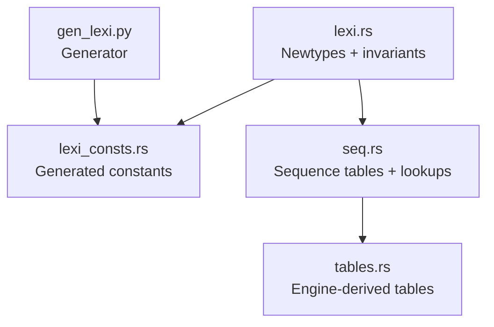
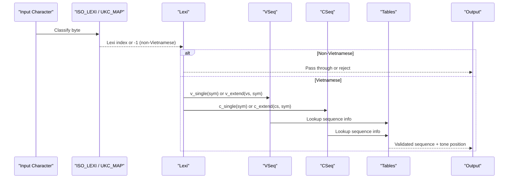
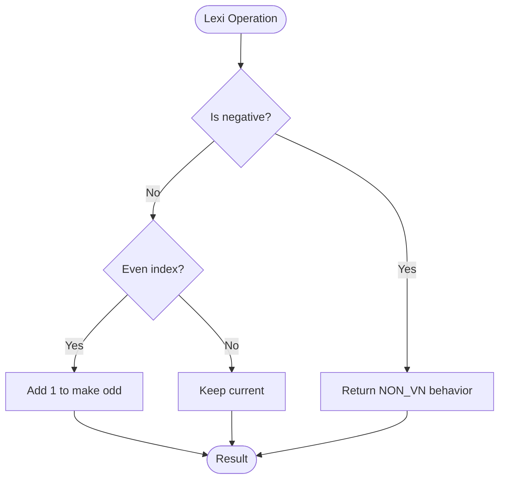
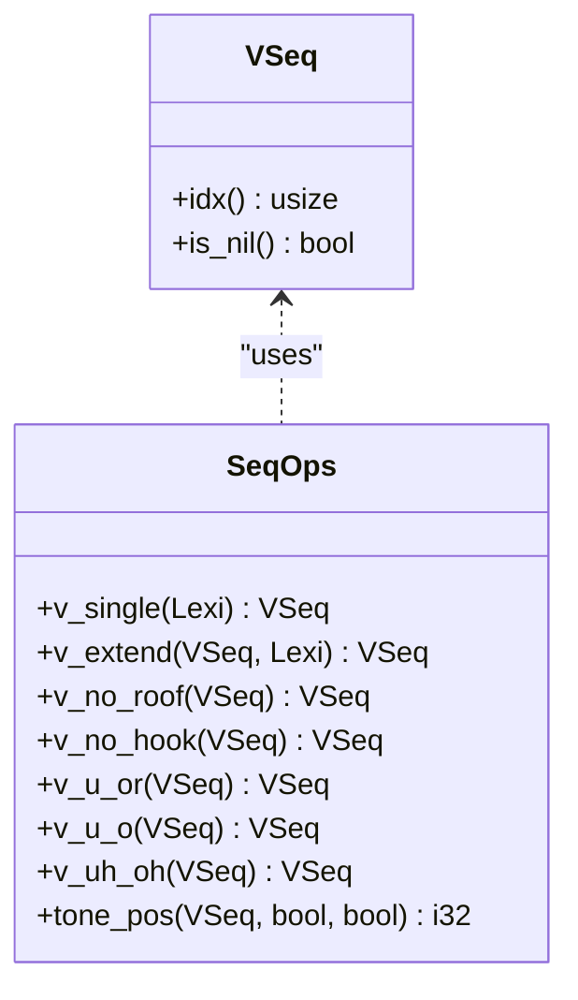
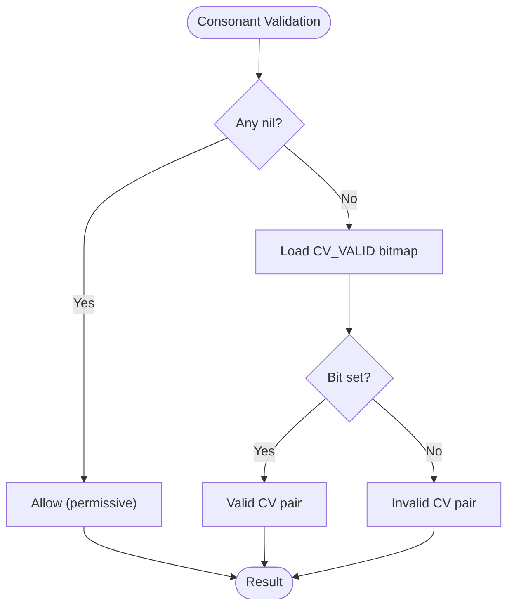
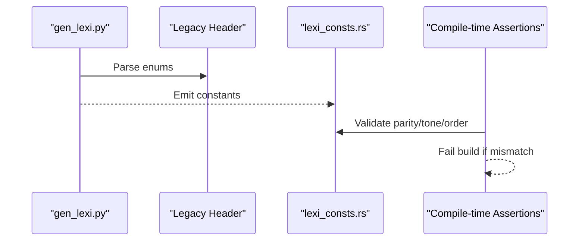
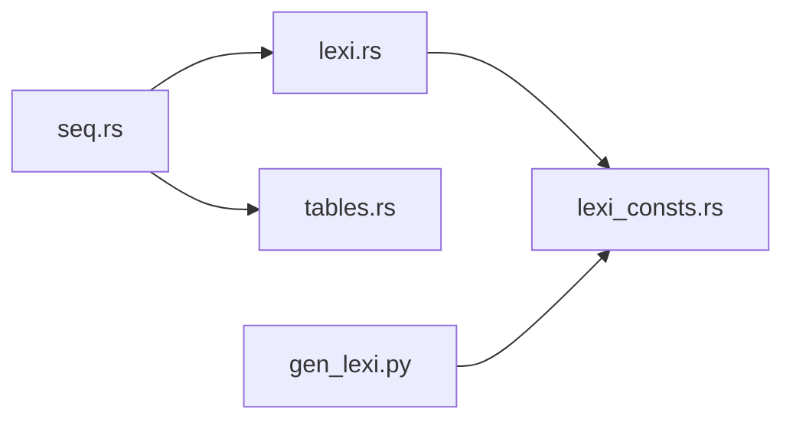

# Lexical Analysis

<cite>
**Referenced Files in This Document**
- [lexi.rs](file://port/skey-core/src/phonetics/lexi.rs)
- [seq.rs](file://port/skey-core/src/phonetics/seq.rs)
- [lexi_consts.rs](file://port/skey-core/src/phonetics/lexi_consts.rs)
- [tables.rs](file://port/skey-core/src/phonetics/tables.rs)
- [gen_lexi.py](file://port/tablegen/gen_lexi.py)
</cite>

## Table of Contents
1. [Introduction](#introduction)
2. [Project Structure](#project-structure)
3. [Core Components](#core-components)
4. [Architecture Overview](#architecture-overview)
5. [Detailed Component Analysis](#detailed-component-analysis)
6. [Dependency Analysis](#dependency-analysis)
7. [Performance Considerations](#performance-considerations)
8. [Troubleshooting Guide](#troubleshooting-guide)
9. [Conclusion](#conclusion)

## Introduction
This document explains the lexical analysis component that handles Vietnamese character encoding and classification. It focuses on the type-safe numeric spaces provided by the Lexi, VSeq, and CSeq newtypes, the critical invariants they enforce (case parity, tone level arithmetic, and StdVnChar offset), how non-Vietnamese characters are identified with a sentinel value, and how efficient case conversion and sequence operations work. It also documents compile-time assertions that keep the table engine synchronized with the generated constants and discusses performance implications of this design.

## Project Structure
The lexical analysis layer is implemented in Rust under the phonetics module. The key files are:
- lexi.rs: Defines the core newtypes (Lexi, VSeq, CSeq), their invariants, and helper methods for case handling and sentinel checks.
- seq.rs: Provides compile-time computed tables and fast lookup functions for vowel and consonant sequences, including tone position and validity checks.
- lexi_consts.rs: Generated constants mapping symbolic names to numeric indices for Lexi, VSeq, and CSeq.
- tables.rs: Generated tables from the original C++ engine, including sequence metadata, mappings, and validation bitmaps.
- gen_lexi.py: Code generator that emits lexi_consts.rs from the legacy header, ensuring enum order remains load-bearing.

**Diagram sources**
- [lexi.rs:1-109](file://port/skey-core/src/phonetics/lexi.rs#L1-L109)
- [seq.rs:1-451](file://port/skey-core/src/phonetics/seq.rs#L1-L451)
- [lexi_consts.rs:1-301](file://port/skey-core/src/phonetics/lexi_consts.rs#L1-L301)
- [tables.rs:1-696](file://port/skey-core/src/phonetics/tables.rs#L1-L696)
- [gen_lexi.py:1-51](file://port/tablegen/gen_lexi.py#L1-L51)

**Section sources**
- [lexi.rs:1-109](file://port/skey-core/src/phonetics/lexi.rs#L1-L109)
- [seq.rs:1-451](file://port/skey-core/src/phonetics/seq.rs#L1-L451)
- [lexi_consts.rs:1-301](file://port/skey-core/src/phonetics/lexi_consts.rs#L1-L301)
- [tables.rs:1-696](file://port/skey-core/src/phonetics/tables.rs#L1-L696)
- [gen_lexi.py:1-51](file://port/tablegen/gen_lexi.py#L1-L51)

## Core Components
- Lexi: A typed index into the Vietnamese lexical alphabet. Non-Vietnamese input is represented by a sentinel value (-1). Case is encoded via parity: even indices are uppercase, odd indices are lowercase. Tone levels are encoded as +2 per level from the base. Methods include change_case and to_lower for efficient case manipulation.
- VSeq: A typed index into the vowel sequence table. Nil is represented by -1. Supports single-symbol lookup and extension by one symbol.
- CSeq: A typed index into the consonant sequence table. Nil is represented by -1. Supports single-symbol lookup and extension by one symbol.

Key invariants enforced at compile time:
- Parity: lower case = upper case + 1.
- Tone step: each tone level adds 2 to the base index.
- Specific ordering constraints for roof/hook variants and special digraphs.
- LAST_CHAR boundary ensures the table size matches expectations.

StdVnChar offset:
- The Vietnamese block inside the StdVnChar space starts at a fixed offset. Combined with the Lexi index and tone, it yields a unique code point representation used by the engine.

Sentinel handling:
- Lexi::NON_VN and VSeq::NIL/CSeq::NIL use -1 to represent invalid or non-Vietnamese states, enabling fast checks without branching-heavy logic.

**Section sources**
- [lexi.rs:16-96](file://port/skey-core/src/phonetics/lexi.rs#L16-L96)
- [lexi.rs:98-109](file://port/skey-core/src/phonetics/lexi.rs#L98-L109)
- [lexi_consts.rs:9-196](file://port/skey-core/src/phonetics/lexi_consts.rs#L9-L196)
- [tables.rs:150-188](file://port/skey-core/src/phonetics/tables.rs#L150-L188)

## Architecture Overview
The system uses a layered approach:
- Newtypes provide type safety over numeric spaces.
- Generated constants map human-readable symbols to numeric indices.
- Precomputed tables replace runtime searches with direct array loads.
- Compile-time assertions ensure the generated constants match the engine’s expectations.

**Diagram sources**
- [seq.rs:263-328](file://port/skey-core/src/phonetics/seq.rs#L263-L328)
- [tables.rs:150-188](file://port/skey-core/src/phonetics/tables.rs#L150-L188)
- [tables.rs:135-148](file://port/skey-core/src/phonetics/tables.rs#L135-L148)

**Section sources**
- [seq.rs:1-451](file://port/skey-core/src/phonetics/seq.rs#L1-L451)
- [tables.rs:1-696](file://port/skey-core/src/phonetics/tables.rs#L1-L696)

## Detailed Component Analysis

### Lexi Newtype and Invariants
- Sentinel: NON_VN is -1; is_non_vn checks negative values.
- Case parity: change_case flips parity; to_lower forces odd parity.
- Tone arithmetic: Each tone level increments by 2 from the base; five tone levels above base imply specific offsets.
- StdVnChar offset: VN_STD_CHAR_OFFSET defines the start of the Vietnamese block; combined with Lexi index and tone yields a unique code.

Compile-time assertions validate:
- Lower case equals upper case + 1.
- Tone step equals 2.
- Five tone levels above base align with expected indices.
- Roof/hook variants follow expected ordering.
- LAST_CHAR matches expected count.

**Diagram sources**
- [lexi.rs:29-66](file://port/skey-core/src/phonetics/lexi.rs#L29-L66)

**Section sources**
- [lexi.rs:16-96](file://port/skey-core/src/phonetics/lexi.rs#L16-L96)
- [lexi.rs:98-109](file://port/skey-core/src/phonetics/lexi.rs#L98-L109)
- [lexi_consts.rs:9-196](file://port/skey-core/src/phonetics/lexi_consts.rs#L9-L196)

### Vowel Sequences (VSeq)
- Single lookup: v_single maps a Lexi symbol to a VSeq if present.
- Extension: v_extend appends a vowel to an existing sequence, returning nil if invalid or max length reached.
- Special transformations: v_no_roof, v_no_hook, v_u_or, v_u_o, v_uh_oh handle roof/hook removal and prefix rewrites required by Vietnamese orthography.
- Tone position: tone_pos computes where to place tone marks based on sequence, termination state, and modern style.

**Diagram sources**
- [seq.rs:263-386](file://port/skey-core/src/phonetics/seq.rs#L263-L386)

**Section sources**
- [seq.rs:107-328](file://port/skey-core/src/phonetics/seq.rs#L107-L328)
- [seq.rs:330-386](file://port/skey-core/src/phonetics/seq.rs#L330-L386)

### Consonant Sequences (CSeq)
- Single lookup: c_single maps a Lexi symbol to a CSeq if present.
- Extension: c_extend appends a consonant to an existing sequence, returning nil if invalid or max length reached.
- Validity: is_valid_cv checks whether a consonant can precede a given vowel sequence using a precomputed bitmap.

**Diagram sources**
- [seq.rs:388-451](file://port/skey-core/src/phonetics/seq.rs#L388-L451)

**Section sources**
- [seq.rs:223-303](file://port/skey-core/src/phonetics/seq.rs#L223-L303)
- [seq.rs:388-451](file://port/skey-core/src/phonetics/seq.rs#L388-L451)

### Generated Constants and Table Engine Synchronization
- lexi_consts.rs provides named constants for all Lexi, VSeq, and CSeq entries, derived from the legacy header.
- gen_lexi.py parses the header and emits constants preserving enum order, which is load-bearing for parity and tone arithmetic.
- Compile-time assertions in lexi.rs ensure the generated constants match the engine’s expectations; any mismatch fails the build.

**Diagram sources**
- [gen_lexi.py:1-51](file://port/tablegen/gen_lexi.py#L1-L51)
- [lexi.rs:98-109](file://port/skey-core/src/phonetics/lexi.rs#L98-L109)
- [lexi_consts.rs:1-301](file://port/skey-core/src/phonetics/lexi_consts.rs#L1-L301)

**Section sources**
- [gen_lexi.py:1-51](file://port/tablegen/gen_lexi.py#L1-L51)
- [lexi.rs:98-109](file://port/skey-core/src/phonetics/lexi.rs#L98-L109)
- [lexi_consts.rs:1-301](file://port/skey-core/src/phonetics/lexi_consts.rs#L1-L301)

## Dependency Analysis
- lexi.rs depends on lexi_consts.rs for constant definitions and asserts layout invariants.
- seq.rs depends on lexi.rs for newtypes and on tables.rs for sequence metadata and mappings.
- tables.rs is generated from the original C++ engine and includes ISO mappings, Unicode tables, and validation bitmaps.
- gen_lexi.py generates lexi_consts.rs from the legacy header, ensuring consistency.

**Diagram sources**
- [lexi.rs:1-109](file://port/skey-core/src/phonetics/lexi.rs#L1-L109)
- [seq.rs:1-451](file://port/skey-core/src/phonetics/seq.rs#L1-L451)
- [tables.rs:1-696](file://port/skey-core/src/phonetics/tables.rs#L1-L696)
- [gen_lexi.py:1-51](file://port/tablegen/gen_lexi.py#L1-L51)

**Section sources**
- [lexi.rs:1-109](file://port/skey-core/src/phonetics/lexi.rs#L1-L109)
- [seq.rs:1-451](file://port/skey-core/src/phonetics/seq.rs#L1-L451)
- [tables.rs:1-696](file://port/skey-core/src/phonetics/tables.rs#L1-L696)
- [gen_lexi.py:1-51](file://port/tablegen/gen_lexi.py#L1-L51)

## Performance Considerations
- Constant-time operations: All sequence lookups are replaced with direct array loads, eliminating runtime searches.
- Bitmap validation: Consonant-vowel validity is checked via bitwise AND on precomputed bitmaps, reducing branching.
- Compile-time computation: Tables are built at compile time, shifting cost from runtime to build time and enabling aggressive optimization.
- Minimal allocations: Newtypes wrap small integers; no heap usage in hot paths.
- Sentinel efficiency: Negative values enable fast non-Vietnamese detection without complex conditionals.

[No sources needed since this section provides general guidance]

## Troubleshooting Guide
Common issues and diagnostics:
- Build failures due to assertion mismatches: If compile-time assertions fail, the generated constants are out of sync with the engine. Regenerate constants using the generator and rebuild.
- Incorrect case conversion: Ensure parity rules are respected; use change_case or to_lower rather than manual arithmetic.
- Sequence errors: Use v_single/v_extend and c_single/c_extend; check for nil returns indicating invalid sequences.
- Tone placement problems: Verify tone_pos inputs (terminated flag and modern style) and ensure sequences are valid before querying tone position.

**Section sources**
- [lexi.rs:98-109](file://port/skey-core/src/phonetics/lexi.rs#L98-L109)
- [seq.rs:263-386](file://port/skey-core/src/phonetics/seq.rs#L263-L386)

## Conclusion
The lexical analysis component provides a robust, type-safe foundation for Vietnamese character processing. By encoding case and tone in numeric indices and enforcing invariants at compile time, it achieves high performance and correctness. Precomputed tables and bitmaps eliminate runtime overhead, while sentinels simplify error handling. The generator and assertions ensure long-term synchronization between the engine and its data structures, making the system maintainable and reliable.

[No sources needed since this section summarizes without analyzing specific files]