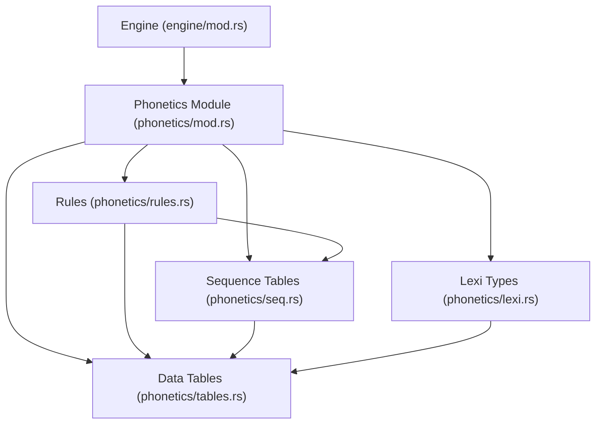
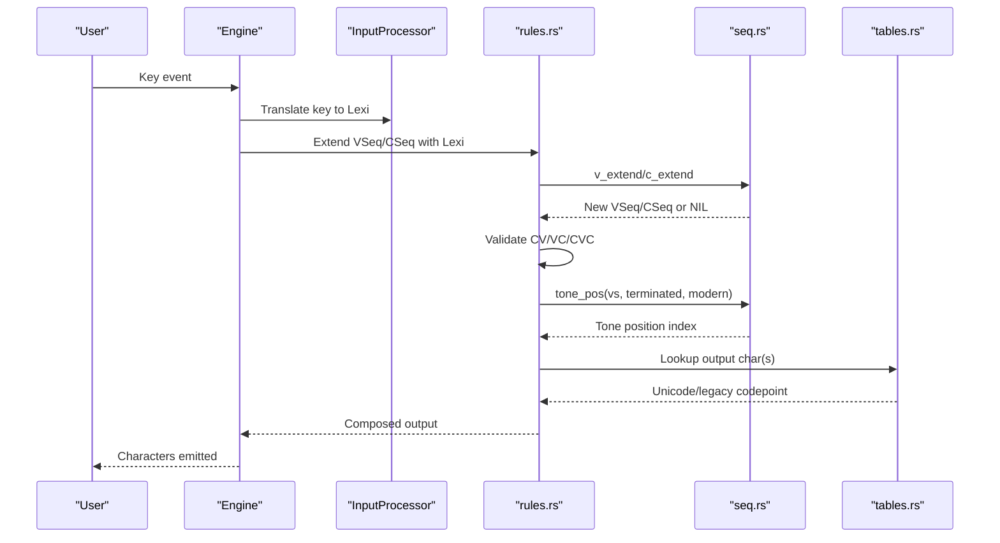
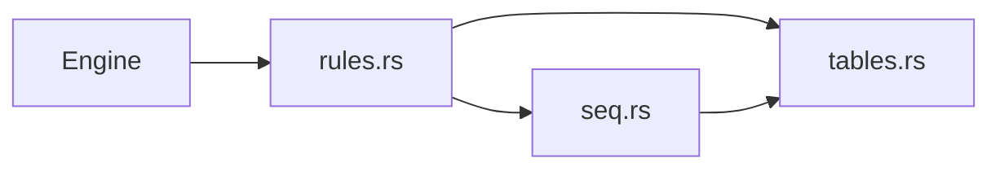

# Phonetics Processing

<cite>
**Referenced Files in This Document**
- [mod.rs](file://port/skey-core/src/phonetics/mod.rs)
- [lexi.rs](file://port/skey-core/src/phonetics/lexi.rs)
- [lexi_consts.rs](file://port/skey-core/src/phonetics/lexi_consts.rs)
- [rules.rs](file://port/skey-core/src/phonetics/rules.rs)
- [seq.rs](file://port/skey-core/src/phonetics/seq.rs)
- [tables.rs](file://port/skey-core/src/phonetics/tables.rs)
- [engine/mod.rs](file://port/skey-core/src/engine/mod.rs)
- [simple_telex.rs](file://port/skey-core/tests/simple_telex.rs)
</cite>

## Table of Contents
1. [Introduction](#introduction)
2. [Project Structure](#project-structure)
3. [Core Components](#core-components)
4. [Architecture Overview](#architecture-overview)
5. [Detailed Component Analysis](#detailed-component-analysis)
6. [Dependency Analysis](#dependency-analysis)
7. [Performance Considerations](#performance-considerations)
8. [Troubleshooting Guide](#troubleshooting-guide)
9. [Conclusion](#conclusion)

## Introduction
This document explains the phonetics processing subsystem that implements Vietnamese tone and diacritic handling. It focuses on how the lexi module encodes Vietnamese characters, how vowel sequences (including diphthongs and triphthongs) and consonant clusters are recognized, and how tone placement is determined by a table-driven rule system. It also documents how different input methods (Telex, VNI, VIQR) map to the same internal phonetic representation and how performance-critical tables enable sub-microsecond processing times.

## Project Structure
The phonetics subsystem lives under port/skey-core/src/phonetics and exposes a small, stable API surface used by the typing engine. The key modules:
- mod.rs: Declares public types and re-exports core symbols for the rest of the engine.
- lexi.rs: Defines compact numeric types Lexi, VSeq, CSeq and their invariants.
- lexi_consts.rs: Enumerates all lexical symbols and sequence identifiers.
- seq.rs: Compile-time generated lookup tables for single-symbol mapping, extension, roof/hook removal, and tone position.
- rules.rs: High-level phonotactic validation and sequence lookup helpers backed by tables.
- tables.rs: Generated data tables for sequences, mappings, and character sets.

**Diagram sources**
- [engine/mod.rs:1-70](file://port/skey-core/src/engine/mod.rs#L1-L70)
- [mod.rs:1-16](file://port/skey-core/src/phonetics/mod.rs#L1-L16)
- [lexi.rs:1-110](file://port/skey-core/src/phonetics/lexi.rs#L1-L110)
- [rules.rs:1-246](file://port/skey-core/src/phonetics/rules.rs#L1-L246)
- [seq.rs:1-451](file://port/skey-core/src/phonetics/seq.rs#L1-L451)
- [tables.rs:1-696](file://port/skey-core/src/phonetics/tables.rs#L1-L696)

**Section sources**
- [mod.rs:1-16](file://port/skey-core/src/phonetics/mod.rs#L1-L16)
- [engine/mod.rs:1-70](file://port/skey-core/src/engine/mod.rs#L1-L70)

## Core Components
- Lexi, VSeq, CSeq: Compact indices into the Vietnamese lexical alphabet and precomputed vowel/consonant sequences. They encode case via parity and tone levels via fixed offsets, enabling fast arithmetic and table indexing.
- Sequence tables: Precomputed arrays for single-symbol mapping, extending sequences, removing roofs/hooks, and determining tone position based on sequence shape and context.
- Rules: Phonotactic checks (valid CV, VC, CVC), sequence extenders, and helpers like “strip tone” and “is vowel.”
- Data tables: Generated tables for ISO/Unicode/VN encodings, TELEX/VNI/VIQR mappings, and validity bitmaps.

Key responsibilities:
- Convert keystrokes from Telex/VNI/VIQR into Lexi symbols.
- Build and validate VSeq/CSeq as input arrives.
- Determine where to place tones using TONE_POS.
- Output correctly composed Unicode or legacy encodings.

**Section sources**
- [lexi.rs:1-110](file://port/skey-core/src/phonetics/lexi.rs#L1-L110)
- [seq.rs:107-451](file://port/skey-core/src/phonetics/seq.rs#L107-L451)
- [rules.rs:1-246](file://port/skey-core/src/phonetics/rules.rs#L1-L246)
- [tables.rs:150-696](file://port/skey-core/src/phonetics/tables.rs#L150-L696)

## Architecture Overview
At a high level, each keystroke is mapped to a Lexi symbol, then used to update the current VSeq/CSeq state. The engine validates transitions with rules and uses precomputed tables to determine tone placement and final output composition.

**Diagram sources**
- [engine/mod.rs:18-70](file://port/skey-core/src/engine/mod.rs#L18-L70)
- [rules.rs:132-236](file://port/skey-core/src/phonetics/rules.rs#L132-L236)
- [seq.rs:263-386](file://port/skey-core/src/phonetics/seq.rs#L263-L386)
- [tables.rs:150-696](file://port/skey-core/src/phonetics/tables.rs#L150-L696)

## Detailed Component Analysis

### Lexi Encoding and Invariants
- Case encoding: Even indices are uppercase; odd indices are lowercase. Flipping parity toggles case.
- Tone encoding: Each base has five tone levels spaced by +2 from the toneless base.
- Non-Vietnamese sentinel: -1 indicates non-Vietnamese input.
- Compile-time assertions ensure the layout matches the original engine’s expectations, preventing silent regressions.

These invariants allow extremely fast operations such as case change and tone offsetting without branching.

**Section sources**
- [lexi.rs:1-110](file://port/skey-core/src/phonetics/lexi.rs#L1-L110)
- [lexi_consts.rs:1-301](file://port/skey-core/src/phonetics/lexi_consts.rs#L1-L301)

### Vowel Sequences: Diphthongs and Triphthongs
- Vowel sequences are represented by VSeq indices into a generated table of up to three vowels per entry.
- Single-vowel lookup maps a Lexi to its corresponding VSeq.
- Extension builds longer sequences (e.g., ai, au, ieu, uoi) while respecting maximum length constraints.
- Special handling exists for roof and hook positions (e.g., ơ, ư, ă) and for prefix transformations required by certain combinations.

Tone placement depends on:
- Whether the sequence is complete or still being built.
- Whether “modern style” is enabled.
- Presence of roof/hook markers and sequence length.

A precomputed TONE_POS table returns the exact position to place the tone mark in O(1).

**Section sources**
- [seq.rs:107-222](file://port/skey-core/src/phonetics/seq.rs#L107-L222)
- [seq.rs:330-386](file://port/skey-core/src/phonetics/seq.rs#L330-L386)
- [tables.rs:22-93](file://port/skey-core/src/phonetics/tables.rs#L22-L93)

### Consonant Clusters and Validity
- Consonant sequences (CSeq) support single, digraph, and trigraph clusters (e.g., ch, tr, ngh).
- Validity checks enforce Vietnamese phonotactics:
  - CV validity: Certain consonants cannot precede specific vowels (e.g., k only before a restricted set).
  - VC validity: Only specific consonants may follow certain vowels; encoded as a bitmap per VSeq.
  - CVC validity: Combines CV and VC checks plus special-case allowances (e.g., quyn, gieng).

These checks avoid expensive searches at runtime by using bitmasks and short-circuit logic.

**Section sources**
- [rules.rs:107-231](file://port/skey-core/src/phonetics/rules.rs#L107-L231)
- [seq.rs:388-451](file://port/skey-core/src/phonetics/seq.rs#L388-L451)
- [tables.rs:135-148](file://port/skey-core/src/phonetics/tables.rs#L135-L148)

### Rule-Based Composition and Tone Placement
- vseq1/cseq1: Map a single Lexi to its canonical sequence.
- vseq_extend/cseq_extend: Append a new symbol to an existing sequence if valid.
- std_no_tone: Strip tone marks to find the base character.
- is_vowel: Quick classification for decision paths.

Tone placement is resolved via tone_pos, which consults TONE_POS indexed by VSeq, termination state, and modern-style flag.

**Section sources**
- [rules.rs:132-236](file://port/skey-core/src/phonetics/rules.rs#L132-L236)
- [seq.rs:263-386](file://port/skey-core/src/phonetics/seq.rs#L263-L386)

### Input Method Mapping: Telex, VNI, VIQR
Different input methods produce the same internal Lexi stream:
- Telex: Keys like z, s, f, r, x, j, w modify preceding vowels to add tones or diacritics.
- VNI: Numeric keys (0–9) encode tone/diacritic information after a vowel.
- VIQR: Punctuation and symbols encode diacritics and tones around base letters.

The tables include explicit mappings for these methods, allowing conversion to the unified Lexi space used by the phonetics engine. Tests demonstrate equivalence across modes for common inputs.

**Section sources**
- [tables.rs:676-696](file://port/skey-core/src/phonetics/tables.rs#L676-L696)
- [simple_telex.rs:1-53](file://port/skey-core/tests/simple_telex.rs#L1-L53)

### Edge Cases: Diphthongs, Triphthongs, and Special Characters
- Diphthongs/triphthongs: Handled by multi-entry VSeq definitions and extension tables; tone placement accounts for the last or middle vowel depending on the sequence.
- Special characters: Roof and hook positions are tracked per VSeq; helper tables remove or transform them when needed (e.g., un-roof/un-hook).
- Special consonant-vowel interactions: Bitmask-based validation handles exceptions like k-only allowed vowels and gi/qu restrictions.

**Section sources**
- [seq.rs:145-222](file://port/skey-core/src/phonetics/seq.rs#L145-L222)
- [rules.rs:107-231](file://port/skey-core/src/phonetics/rules.rs#L107-L231)
- [tables.rs:22-93](file://port/skey-core/src/phonetics/tables.rs#L22-L93)

## Dependency Analysis
The phonetics subsystem is layered:
- Engine orchestrates input and calls phonetics APIs.
- rules.rs provides high-level functions that call seq.rs and tables.rs.
- seq.rs contains compile-time generated tables derived from tables.rs data.
- tables.rs holds all static data (sequences, mappings, validity bitmaps, encodings).

**Diagram sources**
- [engine/mod.rs:1-70](file://port/skey-core/src/engine/mod.rs#L1-L70)
- [rules.rs:1-246](file://port/skey-core/src/phonetics/rules.rs#L1-L246)
- [seq.rs:1-451](file://port/skey-core/src/phonetics/seq.rs#L1-L451)
- [tables.rs:1-696](file://port/skey-core/src/phonetics/tables.rs#L1-L696)

**Section sources**
- [engine/mod.rs:1-70](file://port/skey-core/src/engine/mod.rs#L1-L70)
- [rules.rs:1-246](file://port/skey-core/src/phonetics/rules.rs#L1-L246)
- [seq.rs:1-451](file://port/skey-core/src/phonetics/seq.rs#L1-L451)
- [tables.rs:1-696](file://port/skey-core/src/phonetics/tables.rs#L1-L696)

## Performance Considerations
- Table-driven lookups: All critical paths use constant-time array accesses or bitwise operations:
  - Single-symbol mapping: O(1) via V_SINGLE/C_SINGLE.
  - Sequence extension: O(1) via V_EXTEND/C_EXTEND keyed by compact codes.
  - Validity checks: O(1) via bitmasks (CV_VALID, VC_VALID).
  - Tone placement: O(1) via TONE_POS indexed by VSeq and flags.
- Minimal branching: Early exits for NIL/non-Vietnamese inputs reduce overhead.
- Memory layout: Small, cache-friendly arrays and bitmaps minimize memory traffic.
- Compile-time generation: Tables are computed at build time from authoritative data, ensuring correctness and eliminating runtime setup costs.

These optimizations collectively enable sub-microsecond processing per keystroke in hot paths.

[No sources needed since this section provides general guidance]

## Troubleshooting Guide
Common issues and diagnostics:
- Incorrect tone placement: Verify that the VSeq is complete and that modernStyle is set appropriately; check TONE_POS usage in seq.rs.
- Invalid sequences: Use is_valid_cv/is_valid_vc/is_valid_cvc to detect illegal combinations; inspect bitmask entries in tables.rs.
- Input method mismatches: Ensure correct mapping tables are used (TELEX_MAP, VNI_MAP, VIQR_MAP); confirm that the engine’s input method is configured properly.
- Case/tone arithmetic errors: Confirm Lexi parity and tone offsets remain intact; rely on compile-time assertions in lexi.rs to catch layout drift.

**Section sources**
- [rules.rs:107-236](file://port/skey-core/src/phonetics/rules.rs#L107-L236)
- [seq.rs:263-386](file://port/skey-core/src/phonetics/seq.rs#L263-L386)
- [tables.rs:676-696](file://port/skey-core/src/phonetics/tables.rs#L676-L696)
- [lexi.rs:98-110](file://port/skey-core/src/phonetics/lexi.rs#L98-L110)

## Conclusion
The phonetics subsystem achieves robust Vietnamese tone and diacritic handling through a carefully designed combination of compact numeric types, precomputed tables, and concise rule functions. By centralizing linguistic knowledge in generated tables and enforcing strict invariants, it delivers accurate composition for complex vowel sequences and consonant clusters while maintaining extremely low latency. The modular design cleanly separates concerns between input mapping, sequence management, phonotactic validation, and output composition, making it both maintainable and performant.

[No sources needed since this section summarizes without analyzing specific files]