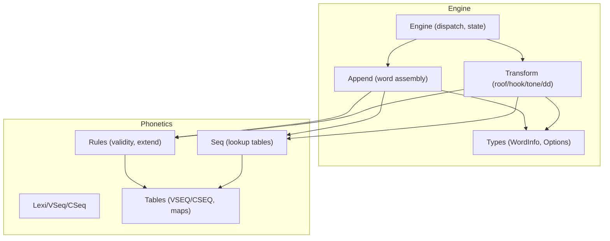
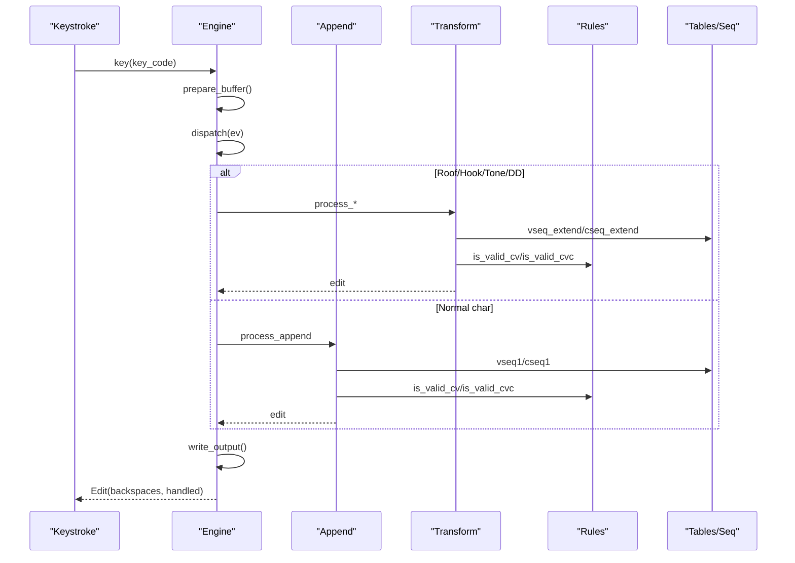
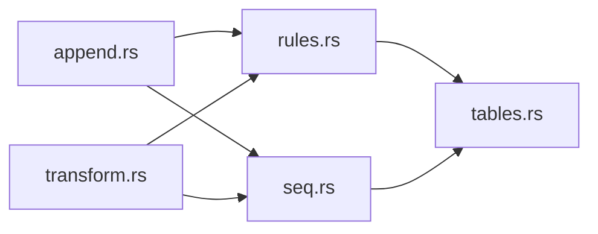

# Rule Application

<cite>
**Referenced Files in This Document**
- [mod.rs](file://port/skey-core/src/phonetics/mod.rs)
- [rules.rs](file://port/skey-core/src/phonetics/rules.rs)
- [seq.rs](file://port/skey-core/src/phonetics/seq.rs)
- [lexi.rs](file://port/skey-core/src/phonetics/lexi.rs)
- [tables.rs](file://port/skey-core/src/phonetics/tables.rs)
- [engine_mod.rs](file://port/skey-core/src/engine/mod.rs)
- [append.rs](file://port/skey-core/src/engine/append.rs)
- [transform.rs](file://port/skey-core/src/engine/transform.rs)
- [types.rs](file://port/skey-core/src/engine/types.rs)
</cite>

## Table of Contents
1. [Introduction](#introduction)
2. [Project Structure](#project-structure)
3. [Core Components](#core-components)
4. [Architecture Overview](#architecture-overview)
5. [Detailed Component Analysis](#detailed-component-analysis)
6. [Dependency Analysis](#dependency-analysis)
7. [Performance Considerations](#performance-considerations)
8. [Troubleshooting Guide](#troubleshooting-guide)
9. [Conclusion](#conclusion)

## Introduction
This document explains the rule-based system that implements Vietnamese phonetic composition for the SKey engine. It focuses on how input sequences are processed to determine correct character placement, tone assignment, and diacritic application. It documents the rule matching algorithms used for diphthongs, triphthongs, and special combinations; outlines precedence and conflict resolution; details edge-case handling and fallbacks; and analyzes performance optimizations and memory usage for large rule sets.

## Project Structure
The phonetic rule system is implemented under the phonetics module and integrated by the typing engine:
- Phonetics layer: lexical types, sequence tables, lookup rules, and validity checks.
- Engine layer: keystroke dispatch, word assembly, diacritic/tone processing, and output generation.

**Diagram sources**
- [engine_mod.rs:18-70](file://port/skey-core/src/engine/mod.rs#L18-L70)
- [append.rs:142-196](file://port/skey-core/src/engine/append.rs#L142-L196)
- [transform.rs:14-24](file://port/skey-core/src/engine/transform.rs#L14-L24)
- [types.rs:114-127](file://port/skey-core/src/engine/types.rs#L114-L127)
- [lexi.rs:16-27](file://port/skey-core/src/phonetics/lexi.rs#L16-L27)
- [tables.rs:9-22](file://port/skey-core/src/phonetics/tables.rs#L9-L22)
- [seq.rs:263-303](file://port/skey-core/src/phonetics/seq.rs#L263-L303)
- [rules.rs:132-182](file://port/skey-core/src/phonetics/rules.rs#L132-L182)

**Section sources**
- [engine_mod.rs:18-70](file://port/skey-core/src/engine/mod.rs#L18-L70)
- [append.rs:142-196](file://port/skey-core/src/engine/append.rs#L142-L196)
- [transform.rs:14-24](file://port/skey-core/src/engine/transform.rs#L14-L24)
- [types.rs:114-127](file://port/skey-core/src/engine/types.rs#L114-L127)
- [lexi.rs:16-27](file://port/skey-core/src/phonetics/lexi.rs#L16-L27)
- [tables.rs:9-22](file://port/skey-core/src/phonetics/tables.rs#L9-L22)
- [seq.rs:263-303](file://port/skey-core/src/phonetics/seq.rs#L263-L303)
- [rules.rs:132-182](file://port/skey-core/src/phonetics/rules.rs#L132-L182)

## Core Components
- Lexical primitives: Lexi, VSeq, CSeq encode symbols and sequences with strict numeric invariants.
- Sequence tables: VSEQ and CSEQ define all valid vowel/consonant sequences, including length, completeness, suffix flags, roof/hook positions, and sub-sequences.
- Lookup helpers: seq provides O(1) table lookups for single symbol mapping and extension; debug builds assert equivalence with binary search over sorted keys.
- Rule validators: rules provide phonotactic constraints (CV, VC, CVC), tone position computation, and helper functions like std_no_tone and is_vowel.
- Engine integration: append and transform modules apply these rules during keystroke processing to build words, place tones, and handle diacritics.

**Section sources**
- [lexi.rs:16-109](file://port/skey-core/src/phonetics/lexi.rs#L16-L109)
- [tables.rs:9-133](file://port/skey-core/src/phonetics/tables.rs#L9-L133)
- [seq.rs:263-303](file://port/skey-core/src/phonetics/seq.rs#L263-L303)
- [rules.rs:107-182](file://port/skey-core/src/phonetics/rules.rs#L107-L182)
- [engine_mod.rs:18-70](file://port/skey-core/src/engine/mod.rs#L18-L70)

## Architecture Overview
The engine processes each key event through a dispatcher that routes to specialized handlers. For Vietnamese input, the flow is:
1. Classify the key as Vietnamese or non-Vietnamese.
2. If Vietnamese, attempt to extend current vowel or consonant sequences using table-driven lookups.
3. Validate the resulting CV/VC/CVC structure against phonotactic rules.
4. Apply diacritics (roof/hook) and tones according to precomputed tone-position tables.
5. Output encoded characters and manage backspaces to reflect edits.

**Diagram sources**
- [engine_mod.rs:209-246](file://port/skey-core/src/engine/mod.rs#L209-L246)
- [append.rs:142-196](file://port/skey-core/src/engine/append.rs#L142-L196)
- [transform.rs:70-189](file://port/skey-core/src/engine/transform.rs#L70-L189)
- [seq.rs:263-303](file://port/skey-core/src/phonetics/seq.rs#L263-L303)
- [rules.rs:107-182](file://port/skey-core/src/phonetics/rules.rs#L107-L182)

## Detailed Component Analysis

### Lexical Model and Invariants
- Lexi encodes base letters, case parity, and tone levels with strict arithmetic invariants enforced at compile time.
- VSeq and CSeq index into generated tables; NIL sentinel indicates invalid or empty sequences.
- These invariants ensure consistent indexing across tables and avoid runtime branching overhead.

**Section sources**
- [lexi.rs:16-109](file://port/skey-core/src/phonetics/lexi.rs#L16-L109)

### Sequence Tables and Lookup
- VSEQ and CSEQ enumerate all valid sequences up to length three, marking completeness, suffix capability, and roof/hook positions.
- seq builds compact lookup tables:
  - v_single/c_single map a symbol to its sequence index.
  - v_extend/c_extend extend an existing sequence by one symbol via direct array access.
  - Tone position is computed via a flat table indexed by sequence and context flags.
- Debug builds include binary-search lookups to assert table correctness.

**Section sources**
- [tables.rs:9-133](file://port/skey-core/src/phonetics/tables.rs#L9-L133)
- [seq.rs:109-259](file://port/skey-core/src/phonetics/seq.rs#L109-L259)
- [seq.rs:337-386](file://port/skey-core/src/phonetics/seq.rs#L337-L386)
- [rules.rs:40-105](file://port/skey-core/src/phonetics/rules.rs#L40-L105)

### Rule Matching Algorithms
- Single-symbol mapping: vseq1/cseq1 use precomputed arrays for O(1) lookup.
- Extension: vseq_extend/cseq_extend use compact tables keyed by sequence index and symbol code; returns NIL if extension is invalid or sequence is already maximal.
- Validity checks:
  - is_valid_cv uses a bitmap per consonant sequence to test allowed vowels quickly.
  - is_valid_vc uses per-vowel-sequence bitmasks to test allowed coda consonants.
  - is_valid_cvc composes CV and VC checks with special-case allowances for known exceptions (e.g., quyn/quynh, gieng/gie^ng).

**Section sources**
- [rules.rs:107-182](file://port/skey-core/src/phonetics/rules.rs#L107-L182)
- [rules.rs:184-231](file://port/skey-core/src/phonetics/rules.rs#L184-L231)
- [seq.rs:393-450](file://port/skey-core/src/phonetics/seq.rs#L393-L450)

### Diphthongs and Triphthongs
- Diphthongs/triphthongs are represented as multi-element VSeq entries in VSEQ.
- Extensions proceed left-to-right; when a third vowel completes a triphthong, further extensions return NIL.
- Special handling exists for u/o combinations that transform into horned forms (uh/oh) and their interactions with subsequent consonants.

**Section sources**
- [tables.rs:22-93](file://port/skey-core/src/phonetics/tables.rs#L22-L93)
- [append.rs:428-510](file://port/skey-core/src/engine/append.rs#L428-L510)

### Diacritic Application (Roof and Hook)
- Roof: applies circumflex-like marks to specific vowels; can toggle removal if already present; validates resulting sequence and repositions tone if needed.
- Hook: adds hooks to u/o/a variants; complex logic handles uo contexts and toggling between hooked/unhooked states; ensures phonotactic validity and updates tone position accordingly.
- Both operations update sub-sequences for affected positions and adjust tone placement based on precomputed tone_pos.

**Section sources**
- [transform.rs:70-189](file://port/skey-core/src/engine/transform.rs#L70-L189)
- [transform.rs:327-467](file://port/skey-core/src/engine/transform.rs#L327-L467)

### Tone Assignment
- Tone position is determined by a precomputed table indexed by VSeq and contextual flags (termination, modern style).
- When applying a tone key, the engine:
  - Validates constraints (e.g., certain coda consonants restrict tone availability).
  - Places the tone at the computed position, moving it if necessary.
  - Supports toggling off a tone by reapplying the same tone key.

**Section sources**
- [transform.rs:14-52](file://port/skey-core/src/engine/transform.rs#L14-L52)
- [transform.rs:469-536](file://port/skey-core/src/engine/transform.rs#L469-L536)
- [seq.rs:337-386](file://port/skey-core/src/phonetics/seq.rs#L337-L386)

### Word Assembly and Spell Checking Integration
- process_append classifies incoming symbols and decides whether to append to vowel or consonant sequences.
- Special cases:
  - u after q and i after g behave as consonants to form digraphs.
  - Non-Vietnamese characters terminate the current word or start new ones depending on context.
- Spell checking options influence behavior: incomplete sequences may be blocked until completion unless free marking is enabled.

**Section sources**
- [append.rs:142-196](file://port/skey-core/src/engine/append.rs#L142-L196)
- [append.rs:202-369](file://port/skey-core/src/engine/append.rs#L202-L369)
- [append.rs:371-575](file://port/skey-core/src/engine/append.rs#L371-L575)

### Edge Cases and Fallbacks
- Invalid combinations:
  - is_valid_cv rejects illegal pairs (e.g., gi+i, qu+u) and enforces k’s restricted set of following vowels.
  - is_valid_vc ensures only permitted coda consonants follow certain vowels.
  - is_valid_cvc includes explicit exceptions for known patterns like quyn/quynh and gieng/gie^ng.
- Fallback mechanisms:
  - If extension fails, the symbol is treated as non-Vietnamese within the current word context.
  - Escape sequences in VIQR mode allow bypassing composition rules for literal output.
  - Backspace handling moves tone marks appropriately when vowel sequences change.

**Section sources**
- [rules.rs:107-182](file://port/skey-core/src/phonetics/rules.rs#L107-L182)
- [rules.rs:184-231](file://port/skey-core/src/phonetics/rules.rs#L184-L231)
- [transform.rs:714-766](file://port/skey-core/src/engine/transform.rs#L714-L766)
- [engine_mod.rs:321-405](file://port/skey-core/src/engine/mod.rs#L321-L405)

### Precedence and Conflict Resolution
- Precedence order:
  1. Roof/hook/diacritic handlers take priority over normal appending when applicable.
  2. Within appending, vowel extension is attempted before consonant extension; special digraph rules (q+u, g+i) redirect to consonant handling.
  3. Tone application occurs after sequence stabilization; tone position is recomputed from tables.
- Conflict resolution:
  - When multiple rules could apply (e.g., u/o hook vs. plain u/o), the engine checks target-specific conditions and validity before committing changes.
  - Free marking option allows immediate application even if not at the current cursor position; otherwise, operations are deferred or rejected.

**Section sources**
- [engine_mod.rs:209-246](file://port/skey-core/src/engine/mod.rs#L209-L246)
- [append.rs:180-196](file://port/skey-core/src/engine/append.rs#L180-L196)
- [transform.rs:70-189](file://port/skey-core/src/engine/transform.rs#L70-L189)
- [transform.rs:327-467](file://port/skey-core/src/engine/transform.rs#L327-L467)

## Dependency Analysis
The phonetics module exposes pure functions and tables consumed by the engine:
- append.rs depends on rules and seq for sequence building and validation.
- transform.rs depends on rules and seq for diacritic/tone operations.
- rules.rs depends on seq and tables for lookups and validity checks.
- seq.rs depends on tables for compiled data structures.

**Diagram sources**
- [append.rs:1-13](file://port/skey-core/src/engine/append.rs#L1-L13)
- [transform.rs:1-12](file://port/skey-core/src/engine/transform.rs#L1-L12)
- [rules.rs:1-7](file://port/skey-core/src/phonetics/rules.rs#L1-L7)
- [seq.rs:1-21](file://port/skey-core/src/phonetics/seq.rs#L1-L21)

**Section sources**
- [append.rs:1-13](file://port/skey-core/src/engine/append.rs#L1-L13)
- [transform.rs:1-12](file://port/skey-core/src/engine/transform.rs#L1-L12)
- [rules.rs:1-7](file://port/skey-core/src/phonetics/rules.rs#L1-L7)
- [seq.rs:1-21](file://port/skey-core/src/phonetics/seq.rs#L1-L21)

## Performance Considerations
- Table-driven design: All sequence mappings and extensions use precomputed arrays for O(1) access, eliminating runtime searches.
- Bitmask validation: CV and VC validity checks use bitmasks to reduce branching and enable fast bitwise operations.
- Tone position table: A flat table indexed by sequence and flags replaces complex conditional logic, minimizing branches.
- Memory layout: WordInfo is packed to minimize buffer size; the engine maintains a fixed-size buffer with periodic compaction to prevent growth.
- Debug assertions: In debug builds, binary search lookups assert table correctness without impacting release performance.

[No sources needed since this section provides general guidance]

## Troubleshooting Guide
Common issues and resolutions:
- Unexpected non-Vietnamese classification:
  - Check allow_consonant_zfwj option; z/f/w/j may be classified as consonants, affecting tone application.
  - Verify character type via char_type and UKC_MAP.
- Tone not applied or moved incorrectly:
  - Ensure spell_check_enabled and free_marking settings align with desired behavior.
  - Confirm tone position via get_tone_position and validate sequence completeness.
- Invalid combination errors:
  - Review is_valid_cv/is_valid_cvc constraints; some combinations require special handling (e.g., uo horn transformations).
  - Use escape sequences in VIQR mode to bypass composition when needed.
- Buffer overflow or stale state:
  - The engine periodically compacts buffers; ensure proper reset on focus changes or word breaks.

**Section sources**
- [append.rs:16-24](file://port/skey-core/src/engine/append.rs#L16-L24)
- [transform.rs:469-536](file://port/skey-core/src/engine/transform.rs#L469-L536)
- [rules.rs:107-182](file://port/skey-core/src/phonetics/rules.rs#L107-L182)
- [transform.rs:714-766](file://port/skey-core/src/engine/transform.rs#L714-L766)
- [engine_mod.rs:112-139](file://port/skey-core/src/engine/mod.rs#L112-L139)

## Conclusion
The SKey engine’s rule-based system leverages precomputed tables and bitmask validations to efficiently implement Vietnamese phonetic composition. It handles complex cases such as diphthongs, triphthongs, and special combinations through carefully designed sequence tables and rule validators. Precedence and conflict resolution ensure predictable behavior across diverse inputs, while robust edge-case handling and fallback mechanisms maintain usability. Performance optimizations and memory considerations make the system suitable for real-time typing scenarios with large rule sets.

[No sources needed since this section summarizes without analyzing specific files]