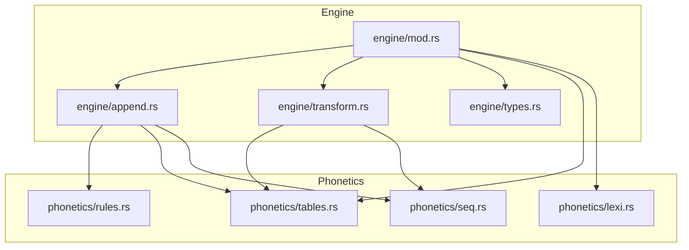
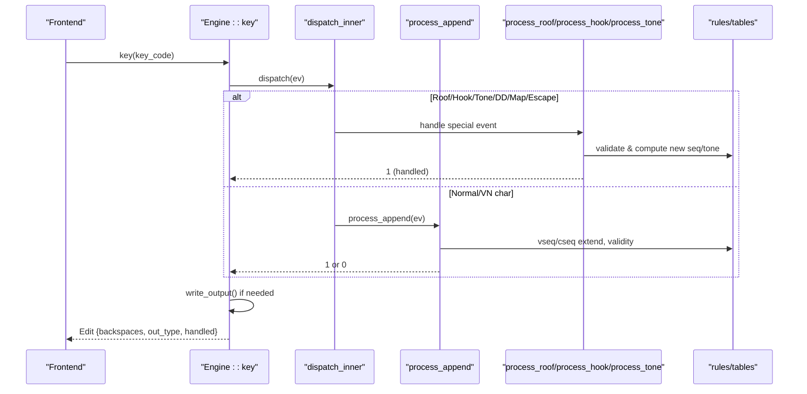
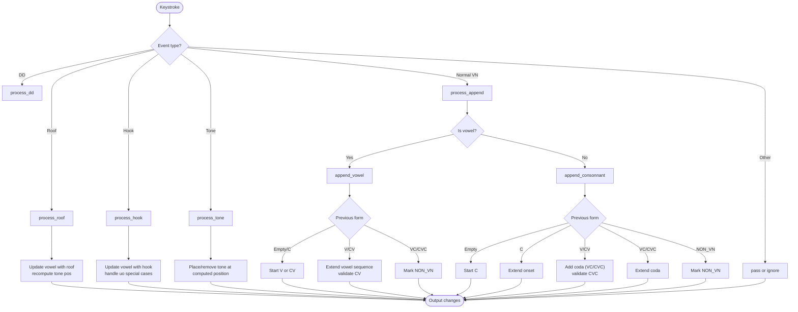
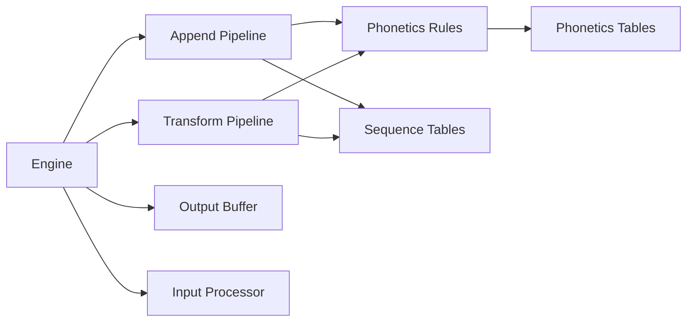

# Sequence Processing

<cite>
**Referenced Files in This Document**
- [lib.rs](file://port/skey-core/src/lib.rs)
- [engine/mod.rs](file://port/skey-core/src/engine/mod.rs)
- [engine/types.rs](file://port/skey-core/src/engine/types.rs)
- [engine/append.rs](file://port/skey-core/src/engine/append.rs)
- [engine/transform.rs](file://port/skey-core/src/engine/transform.rs)
- [phonetics/mod.rs](file://port/skey-core/src/phonetics/mod.rs)
- [phonetics/lexi.rs](file://port/skey-core/src/phonetics/lexi.rs)
- [phonetics/rules.rs](file://port/skey-core/src/phonetics/rules.rs)
- [phonetics/seq.rs](file://port/skey-core/src/phonetics/seq.rs)
- [phonetics/tables.rs](file://port/skey-core/src/phonetics/tables.rs)
</cite>

## Table of Contents
1. Introduction
2. Project Structure
3. Core Components
4. Architecture Overview
5. Detailed Component Analysis
6. Dependency Analysis
7. Performance Considerations
8. Troubleshooting Guide
9. Conclusion

## Introduction
This document explains the sequence processing module that handles multi-character input sequences for Vietnamese typing. It covers how the system recognizes valid Vietnamese syllable structures (initial consonants, medial vowels, final consonants, and tone markers), the incremental state machine that processes keystrokes, algorithms to detect complete versus incomplete sequences, context maintenance across keystrokes, examples of complex words, and error recovery mechanisms when users make mistakes.

## Project Structure
The sequence processing logic is implemented in a Rust port of the UniKey core engine. The key modules are:
- Engine orchestration and dispatch: engine/mod.rs
- Word buffer and append logic: engine/append.rs
- Diacritic and tone transformations: engine/transform.rs
- Phonetics tables and rules: phonetics/tables.rs, phonetics/rules.rs, phonetics/seq.rs, phonetics/lexi.rs
- Public API surface: lib.rs

**Diagram sources**
- [engine/mod.rs:18-70](file://port/skey-core/src/engine/mod.rs#L18-L70)
- [engine/append.rs:1-15](file://port/skey-core/src/engine/append.rs#L1-L15)
- [engine/transform.rs:1-13](file://port/skey-core/src/engine/transform.rs#L1-L13)
- [phonetics/tables.rs:9-22](file://port/skey-core/src/phonetics/tables.rs#L9-L22)
- [phonetics/rules.rs:1-15](file://port/skey-core/src/phonetics/rules.rs#L1-L15)
- [phonetics/seq.rs:1-21](file://port/skey-core/src/phonetics/seq.rs#L1-L21)
- [phonetics/lexi.rs:16-27](file://port/skey-core/src/phonetics/lexi.rs#L16-L27)

**Section sources**
- [lib.rs:15-42](file://port/skey-core/src/lib.rs#L15-L42)
- [engine/mod.rs:18-70](file://port/skey-core/src/engine/mod.rs#L18-L70)

## Core Components
- Engine: Maintains the current word buffer, keystroke history, options, and per-stroke output. Dispatches events to specialized handlers and writes output.
- Append pipeline: Classifies incoming characters as vowels or consonants, updates the current syllable form (C, V, CV, VC, CVC), validates transitions with phonotactic rules, and marks changes for output.
- Transform pipeline: Applies roof/hook diacritics and tone markers, repositioning tones when vowel sequences change.
- Phonetics tables and rules: Provide canonical vowel/consonant sequences, validity checks, tone position computation, and lookup tables derived from the original engine.

Key data model:
- WordInfo stores per-entry symbol, sequence indices, offsets to initial/final consonants and vowel nucleus, tone level, and caps flag.
- Edit returns backspaces, output type, and whether the key was handled.

**Section sources**
- [engine/types.rs:15-29](file://port/skey-core/src/engine/types.rs#L15-L29)
- [engine/types.rs:114-222](file://port/skey-core/src/engine/types.rs#L114-L222)
- [engine/mod.rs:248-319](file://port/skey-core/src/engine/mod.rs#L248-L319)

## Architecture Overview
The engine processes each keystroke through a deterministic state machine:
- Input classification determines if the event is a roof/hook/tone/double-d or normal character.
- For normal characters, the append pipeline decides whether to extend a vowel or consonant sequence, validate transitions, and update the current syllable form.
- For diacritics and tones, the transform pipeline modifies the active vowel sequence and tone position according to Vietnamese orthography.
- Output is written only for changed segments, minimizing UI updates.

**Diagram sources**
- [engine/mod.rs:209-246](file://port/skey-core/src/engine/mod.rs#L209-L246)
- [engine/append.rs:141-196](file://port/skey-core/src/engine/append.rs#L141-L196)
- [engine/transform.rs:70-189](file://port/skey-core/src/engine/transform.rs#L70-L189)
- [engine/transform.rs:327-467](file://port/skey-core/src/engine/transform.rs#L327-L467)
- [engine/transform.rs:469-536](file://port/skey-core/src/engine/transform.rs#L469-L536)

## Detailed Component Analysis

### State Machine and Syllable Forms
The engine tracks the current syllable form using compact flags:
- Empty, Non-Vietnamese, Consonant (C), Vowel (V), Consonant+Vowel (CV), Vowel+Consonant (VC), Consonant+Vowel+Consonant (CVC).
- Offsets point to the first consonant (c1), vowel nucleus (v), and last consonant (c2) within the current entry.
- Tone is stored per entry at the computed tone position within the vowel sequence.

Transitions:
- Vowel append extends the vowel sequence or starts a new V; may move tone to the correct position.
- Consonant append creates or extends an onset (C) or coda (CVC); validates against phonotactics.
- Special keys (roof/hook/tone) modify existing sequences and tone placement.

**Diagram sources**
- [engine/append.rs:202-369](file://port/skey-core/src/engine/append.rs#L202-L369)
- [engine/append.rs:371-575](file://port/skey-core/src/engine/append.rs#L371-L575)
- [engine/transform.rs:70-189](file://port/skey-core/src/engine/transform.rs#L70-L189)
- [engine/transform.rs:327-467](file://port/skey-core/src/engine/transform.rs#L327-L467)
- [engine/transform.rs:469-536](file://port/skey-core/src/engine/transform.rs#L469-L536)

**Section sources**
- [engine/types.rs:15-23](file://port/skey-core/src/engine/types.rs#L15-L23)
- [engine/append.rs:202-369](file://port/skey-core/src/engine/append.rs#L202-L369)
- [engine/append.rs:371-575](file://port/skey-core/src/engine/append.rs#L371-L575)

### Recognizing Valid Vietnamese Syllable Structures
- Initial consonants (onset): Built via cseq1/cseq_extend; validated by is_valid_cv/is_valid_cvc.
- Medial vowels: Built via vseq1/vseq_extend; extended up to length three; tone position computed by tone_pos.
- Final consonants (coda): Added when transitioning from V/CV to VC/CVC; validated by is_valid_vc/is_valid_cvc.
- Tone markers: Placed at positions determined by TONE_POS table based on vowel sequence, termination state, and modern style option.

Complex combinations:
- u/o hooks and roofs interact specially (e.g., u+o -> u+o+, u+o^, uo^).
- gi/qu have special constraints with i/u respectively.
- Certain codas restrict certain tones (e.g., c/ch/p/t do not allow certain rising/falling tones).

**Section sources**
- [phonetics/rules.rs:184-231](file://port/skey-core/src/phonetics/rules.rs#L184-L231)
- [phonetics/seq.rs:337-386](file://port/skey-core/src/phonetics/seq.rs#L337-L386)
- [phonetics/tables.rs:135-148](file://port/skey-core/src/phonetics/tables.rs#L135-L148)
- [engine/transform.rs:469-536](file://port/skey-core/src/engine/transform.rs#L469-L536)

### Incremental Processing and Real-Time Feedback
- Each keystroke prepares buffers, resets per-stroke state, and dispatches to the appropriate handler.
- Changes are marked via mark_change to compute minimal backspaces and output ranges.
- Output is encoded into a buffer and returned to the frontend; backspace counts reflect the exact number of steps to revert previous output.

Real-time behavior:
- Partial inputs remain in the buffer until completion or invalidity.
- When a sequence becomes invalid, it is marked NON_VN and treated as literal text.
- When a complete syllable is formed, subsequent keys can start a new syllable.

**Section sources**
- [engine/mod.rs:248-319](file://port/skey-core/src/engine/mod.rs#L248-L319)
- [engine/append.rs:34-66](file://port/skey-core/src/engine/append.rs#L34-L66)
- [engine/append.rs:98-109](file://port/skey-core/src/engine/append.rs#L98-L109)

### Algorithms for Complete vs Incomplete Sequences
- Completeness is tracked per vowel sequence via the complete flag in VSeqInfo.
- Tone application respects completeness unless free marking is enabled.
- Spell checking influences whether partial sequences accept tones early.

Detection logic:
- Vowel extension uses vseq_extend; if result is NIL, the sequence is invalid.
- Consonant extension uses cseq_extend; combined with is_valid_cvc to ensure phonotactic correctness.
- Tone position is recomputed when sequences change; tone is applied only if allowed.

**Section sources**
- [phonetics/tables.rs:9-22](file://port/skey-core/src/phonetics/tables.rs#L9-L22)
- [phonetics/seq.rs:264-328](file://port/skey-core/src/phonetics/seq.rs#L264-L328)
- [engine/transform.rs:469-536](file://port/skey-core/src/engine/transform.rs#L469-L536)

### Context Maintenance Across Keystrokes
- The engine maintains a fixed-size buffer of WordInfo entries representing the current word under construction.
- Offsets (c1_offset, v_offset, c2_offset) keep track of where the onset, nucleus, and coda lie within the current entry.
- Key stroke history is kept to support restoration and undo operations.

Context-sensitive behaviors:
- u+o handling adjusts between u+o, u+o+, and uo variants depending on preceding consonants and hooks.
- gi/qu special cases influence whether i/u behave as vowels or part of the onset.

**Section sources**
- [engine/types.rs:114-222](file://port/skey-core/src/engine/types.rs#L114-L222)
- [engine/append.rs:428-510](file://port/skey-core/src/engine/append.rs#L428-L510)
- [engine/append.rs:329-369](file://port/skey-core/src/engine/append.rs#L329-L369)

### Examples of Complex Words Through the Analyzer
- “quỳnh”: q + u (onset qu) + ù (vowel with tone) + nh (coda). The engine builds onset qu, extends to vowel with tone, then adds coda nh, validating CVC.
- “giếng”: g + i (onset gi) + ê (vowel) + ng (coda). Onset gi recognized; vowel extended; coda ng added; tone placed appropriately.
- “trường”: t + r (onset tr) + ư (vowel) + ơ (medial) + ờ (vowel with roof) + ờ (tone) + ng (coda). Multiple vowel extensions and roof application; tone repositioned when sequence changes.
- “huế”: h (onset) + u (vowel) + ô (roof) + é (tone). Roof applied to o; tone placed on the correct position after roof transformation.

These flows illustrate:
- Onset building and validation.
- Vowel sequence extension and roof/hook application.
- Coda addition and tone placement.
- Context-sensitive adjustments (e.g., u/o hooks, gi/qu constraints).

[No sources needed since this section summarizes behavior without quoting specific code lines]

### Error Recovery Mechanisms
- Escape sequences in VIQR mode allow bypassing Vietnamese conversion for problematic characters.
- If a sequence becomes invalid during typing, it is marked NON_VN and treated as literal text; subsequent keys may start a new syllable.
- Backspace handling moves the cursor intelligently, sometimes moving tone markers when vowel sequences change.
- Restore key strokes feature allows reverting to raw keystrokes for the last word.

Error recovery highlights:
- check_escape_viqr outputs escape sequences when necessary.
- process_no_spell_check falls back to treating characters as non-Vietnamese when spell checking fails and Vietnamese mode is off.
- restore_key_strokes reconstructs original key codes for debugging or correction.

**Section sources**
- [engine/transform.rs:714-766](file://port/skey-core/src/engine/transform.rs#L714-L766)
- [engine/append.rs:577-617](file://port/skey-core/src/engine/append.rs#L577-L617)
- [engine/mod.rs:321-405](file://port/skey-core/src/engine/mod.rs#L321-L405)
- [engine/mod.rs:407-423](file://port/skey-core/src/engine/mod.rs#L407-L423)

## Dependency Analysis
The engine depends on phonetics tables and rules for all sequence decisions:
- Vowel/consonant sequence lookups and extensions use precomputed tables for speed.
- Validity checks rely on bitmaps and special-case logic for gi/qu/k constraints.
- Tone positioning uses a generated table to avoid runtime branching.

Coupling:
- Engine tightly couples with phonetics modules but isolates them behind clean interfaces.
- Options affect behavior (modern style, free marking, spell checking) without changing core structure.

Potential circular dependencies:
- None observed; modules are layered with clear boundaries.

External integration points:
- Charset encoder affects output encoding and backspace counting.
- Input processor classifies key events before dispatch.

**Diagram sources**
- [engine/mod.rs:18-70](file://port/skey-core/src/engine/mod.rs#L18-L70)
- [engine/append.rs:1-15](file://port/skey-core/src/engine/append.rs#L1-L15)
- [engine/transform.rs:1-13](file://port/skey-core/src/engine/transform.rs#L1-L13)
- [phonetics/rules.rs:1-15](file://port/skey-core/src/phonetics/rules.rs#L1-L15)
- [phonetics/tables.rs:9-22](file://port/skey-core/src/phonetics/tables.rs#L9-L22)
- [phonetics/seq.rs:1-21](file://port/skey-core/src/phonetics/seq.rs#L1-L21)

**Section sources**
- [phonetics/rules.rs:107-131](file://port/skey-core/src/phonetics/rules.rs#L107-L131)
- [phonetics/seq.rs:337-386](file://port/skey-core/src/phonetics/seq.rs#L337-L386)
- [engine/append.rs:98-109](file://port/skey-core/src/engine/append.rs#L98-L109)

## Performance Considerations
- All sequence lookups and extensions are table-driven, avoiding runtime searches.
- Tone position computation is a single table load, minimizing branches.
- Output writing is limited to changed segments, reducing UI overhead.
- Buffer management ensures constant-time access and avoids reallocation during keystroke processing.

Optimization opportunities:
- Keep options minimal to reduce conditional paths.
- Use UTF-8 charset for one-step-per-char backspace counting to simplify calculations.

[No sources needed since this section provides general guidance]

## Troubleshooting Guide
Common issues and resolutions:
- Unexpected literal output: Check if the sequence became NON_VN due to invalid phonotactics; verify onset/coda validity and vowel extensions.
- Tone not appearing: Ensure the sequence is complete and tone application is allowed; check modern style and free marking options.
- Incorrect tone position: Verify vowel sequence changes and that tone repositioning occurs when roof/hook modifies the nucleus.
- Escape sequences in VIQR: Confirm escape conditions and that the engine outputs the expected escape prefix.

Debugging tips:
- Use restore_key_strokes to see raw input for the last word.
- Inspect WordInfo fields (form, offsets, tone) to understand current state.
- Validate options like spell_check_enabled and modern_style affecting behavior.

**Section sources**
- [engine/mod.rs:321-405](file://port/skey-core/src/engine/mod.rs#L321-L405)
- [engine/transform.rs:714-766](file://port/skey-core/src/engine/transform.rs#L714-L766)
- [engine/append.rs:577-617](file://port/skey-core/src/engine/append.rs#L577-L617)

## Conclusion
The sequence processing module implements a robust, table-driven state machine for Vietnamese typing. It incrementally builds syllables by extending vowel and consonant sequences, validates transitions with phonotactic rules, applies diacritics and tones correctly, and provides efficient real-time feedback. Error recovery mechanisms ensure resilience against invalid inputs, while performance optimizations keep the keystroke path fast and allocation-free. This design enables accurate and responsive Vietnamese typing experiences across applications.